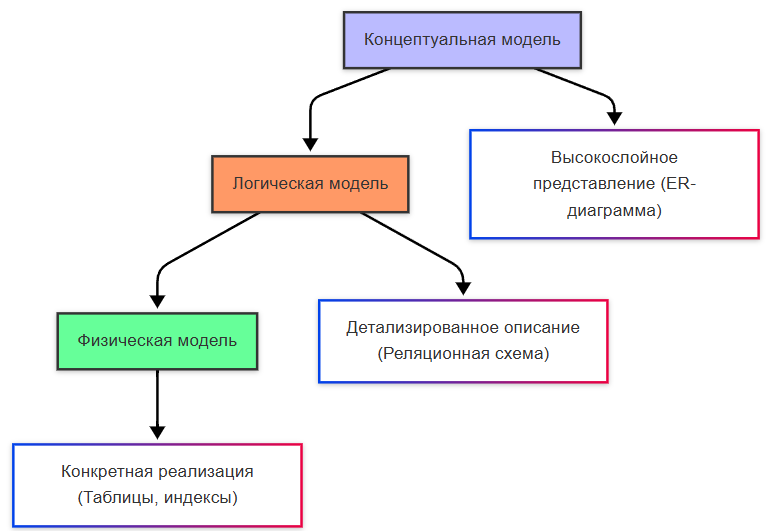
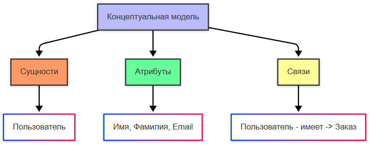
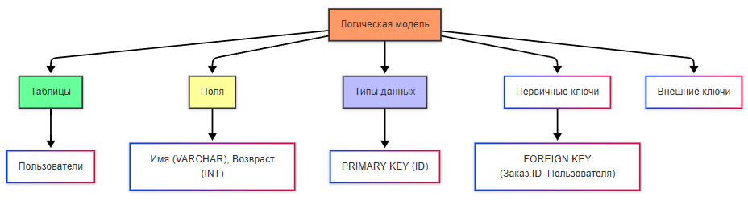
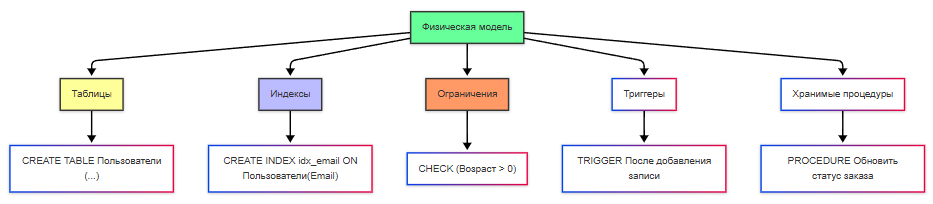
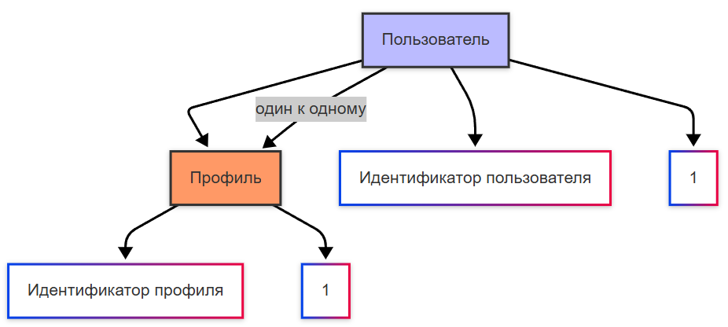
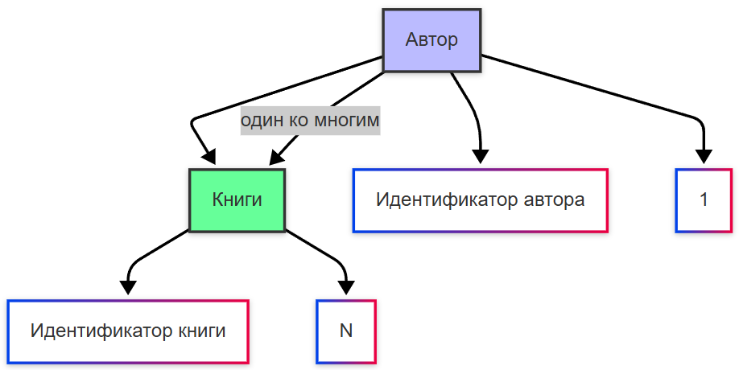
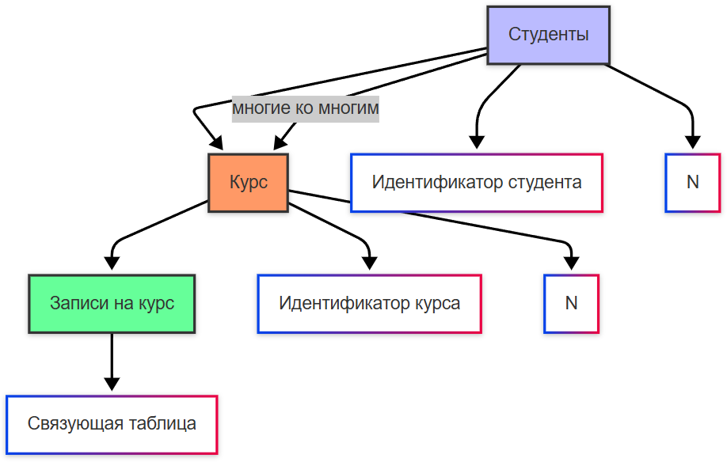

---
title: 6.11. Проектирование баз данных
---

# 6.11. Проектирование баз данных

<div class="article-tags">
  <span class="tag tag-inprogress">В РАЗРАБОТКЕ</span>
  <span class="tag tag-advanced">НЕ ДЛЯ НОВИЧКОВ</span>
  <span class="tag tag-notrequired">НЕ ОБЯЗАТЕЛЬНО</span>
</div>
<span class="complexity-badge">Разработчику</span>
<span class="complexity-badge">Архитектору</span>
<span class="complexity-badge">Аналитику</span>

## Проектирование баз данных

### Основы проектирования баз данных

Мы разобрали принципы, подходы и паттерны проектирования. Но, как заметно, мы затрагивали лишь код, файлы, структуру и прочие элементы, оставляя базы данных где-то за кадром. Роберт Мартин отмечал, что база данных - лишь деталь, намекая, что она не имеет такое фундаментальное влияние на архитектуру, приводя пример, что можно сменить СУБД без перелопачивания всей структуры.
```
Теория баз данных и проектирование баз данных
Грамотное структурирование БД
Грамотный подбор СУБД
Сущность-связь, ERD
IDEF1X
CASE-технология
Функциональная зависимость
Рефлективность
Дополнение
Транзитивность
Самоопределение
Декомпозиция
Композиция
Теорема о всеобщей зависимости или всеобщего объединения
Процедура нормализации
Нежелательные функциональные зависимости
Нормальные формы
Денормализация
Миграция данных
Паттерны (к примеру, Душитель)
```

### Уровни и модели

Проектирование баз данных является важной частью разработки программного обеспечения. Я бы даже сказал, что недооцениваемой частью, так как влияет на производительность, расширяемость, чистоту логики и поддерживаемость всей системы.

Проектирование БД - это процесс определения структуры базы данных, включая то, какие таблицы будут использоваться, какие поля (колонки) у этих таблиц, как они связаны между собой, как организовать хранение, индексирование, нормализацию. Словом, это не просто создание таблиц, а целое архитектурное решение, которое определяет, как приложение будет работать с данными.

Проектирование включает в себя создание моделей, и для баз данных формируются три модели - концептуальная, логическая и физическая.



Концептуальная модель — высокослойное представление данных, независимое от технологий (ER-диаграмма).



Логическая модель — детализированное описание данных с указанием типов и связей (РЕЛЯЦИОННАЯ СХЕМА).




Физическая модель — конкретная реализация в БД с учетом хранения и производительности (ТАБЛИЦЫ, ИНДЕКСЫ).




### Этапы проектирования БД

```
Этапы проектирования БД
```
1. Анализ предметной области. 

Изучаются бизнес-требования, определяются сущности (объекты), их атрибуты и связи. Здесь важно понять, что будет сущностью - в интернет-магазине это могут быть, к примеру, пользователи, товары, заказы, категории. Сущность включает в себя набор атрибутов (свойств, полей), которые нужно изначально выделять хотя бы базово.

Можно выделить стандартные поля - идентификатор, название, дата создания, дата изменения, кем создано, кем изменено. Их лучше закладывать всегда, и иногда также к ним добавляют описание или примечание. Все прочие поля можно назвать пользовательскими.

2. Концептуальное проектирование. 

После определения сущностей, создаётся ER-диаграмма.

ER (Entity-Relationship) - это графическое представление сущностей и связей.

Здесь не так важно, как именно реализуется БД, важно понять, что и как связано (те самые сущности и связи). К примеру, заказы связаны с пользователями, товары связаны с заказом, а прямой связи между товаром и пользователем нет. В нашем случае:
	- 1:1 - Пользователь ↔ Профиль (одна запись связана с другой).
	- 1:N - Категория → Товары (один элемент связан с несколькими другими);
	- N:M - Заказ ↔ Товары (в заказе может быть несколько товаров).

Это связи и отношения сущностей в модели БД. Они бывают следующие:
	- Однозначная связь - один объект связан с одним другим объектом.
	- Многозначная связь - один объект связан с несколькими объектами.
	- Многосторонняя связь - несколько объектов связаны между собой.

Однозначная связь (One-To-One):



Здесь мы видим связь между двумя сущностями, где один объект связан только с одним другим объектом. Например, каждый пользователь имеет только один профиль, и каждый профиль принадлежит только одному пользователю.

Многозначная связь (One-to-Many):



Здесь же отображена связь между двумя сущностями, где один объект может быть связан с несколькими объектами другой сущности. Например, один автор может написать много книг, но каждая книга написана только одним автором.

Многосторонняя связь (Many-to-Many):



Данная схема показывает связь между двумя сущностями, где несколько объектов одной сущности могут быть связаны с несколькими объектами другой сущности. Например, студенты могут записываться на несколько курсов, а курсы могут иметь много студентов. Для реализации такой связи используется связующая таблица (например, «Записи на курс»).

Отношения описываются через ключи:
	- Первичный ключ (PK): уникальный идентификатор.
	- Внешний ключ (FK): ссылка на PK другой таблицы.

3. Логическое проектирование - перевод ER-модели в реляционную модель, определив таблицы, колонки, ключи. Выбираются типы данных, определяются ограничения (NOT NULL, UNIQUE), внедряется нормализация (для минимизации дублирования данных).
4. Физическое проектирование - реализация модели в конкретной СУБД (допустим, PostgreSQL). Здесь выполняется настройка индексов, партиционирования, кластеризации, учитывается производительность запросов, объём данных, частота обращений.
5. Итеративное развитие и миграции. По мере развития продукта БД меняется, и используются миграции (скрипты для изменения структуры БД без потери данных).

### Подходы к проектированию БД

Бывают ли паттерны, методологии, принципы проектирования баз данных?

Разумеется, есть распространённые шаблоны и антипаттерны:

1. Полезные паттерны:
	- Surrogate Key — искусственный числовой ID вместо натурального ключа;
	- Soft Delete — вместо удаления строки помечается флаг is_deleted;
	- History Table / Temporal Tables — хранение истории изменений;
	- Materialized Path / Closure Table — эффективное хранение иерархий (например, деревьев категорий);
	- Polymorphic Association — универсальные ссылки (например, комментарии могут принадлежать посту или фото).
2. Антипаттерны:
	- «Слишком много JOIN-ов»;
	- «Гигантская таблица»;
	- «JSON в столбцах».

А инструменты и методологии?

Конечно, в первую очередь, они связаны с моделированием диаграмм и описанием сущностей:

| Инструмент                 | Назначение                              |
|----------------------------|-----------------------------------------|
| ERD (Entity Relationship Diagram) | Диаграммы связей между сущностями        |
| DBML / UML                 | Языки описания структуры базы данных    |
| SQLAlchemy, Prisma, TypeORM| ORM-инструменты для работы с данными     |
| Liquibase / Flyway         | Менеджеры миграций базы данных          |
| pgAdmin, DBeaver, MySQL Workbench | Графические интерфейсы для администрирования и разработки с БД |

Говоря об инструментах, можно также указать и стандартные возможности языков, таких как индексирование, фрагментирование, кэширование.

**Индекс** — это структура данных, которая позволяет ускорить выполнение запросов, особенно при поиске (WHERE), сортировке (ORDER BY) и объединении (JOIN). Вместо полного сканирования таблицы, СУБД использует индекс — как оглавление в книге. Индексы часто реализуются через B-деревья или хэши. Логично, что такие индексы надо устанавливать на полях, по которым часто выполняется фильтрация, а также для внешних ключей и полей для сортировки/группировки. Они замедляют операции записи, занимают место на диске, поэтому проектирование индекса подразумевает определение рисков - в какой таблице планируется частая запись, а в какой - частое чтение? Можно ли разделить их и потом связать?

**Фрагментация** (Partitioning, партиционирование) — это разделение большой таблицы на более мелкие части (фрагменты) для повышения производительности и упрощения управления данными. Когда таблица очень большая (миллионы строк), и есть явный критерий разделения: год, месяц, пользовательский ID, география, а также нужно улучшить скорость запросов или резервного копирования, можно выполнить фрагментацию соответствующего типа:
	- горизонтальная - разделение строк по какому-то критерию (например, по дате или региону);
	- вертикальная - разделение столбцов — выносим редко используемые данные в отдельные таблицы.

**Кэширование** — временно сохраняет результаты частых запросов, чтобы не нагружать БД повторными обращениями. Используется для кэша в памяти, кэша запросов или кэша уровня приложений. Кэширование спасает при частых одинаковых запросов, когда данные редко меняются и нужна высокая производительность.

В проектировании важно учитывать и другие важные особенности:
	- триггеры автоматически выполняют действия при изменении данных (например, обновление поля);
	- представления упрощают работу - это виртуальные таблицы;
	- хранимые процедуры и функции оставляют выполнение логики внутри СУБД;
	- ограничения позволяют ставить условия на данные;
	- секционирование позволяет выполнять горизонтальное разделение между несколькими серверами;
	- репликация позволяет копировать данные между серверами для отказоустойчивости и балансировки нагрузки;
	- нормализация позволит организовать структуру БД с инимизации дублирования данных, устранения аномалий вставки/обновления/удаления и обеспечения логической целостности (если частые обновления - нужна нормализация);
	- денормализация - это осознанное нарушение принципов нормализации, чтобы повысить производительность запросов за счёт повторения данных (если больше чтение и важна скорость выборки).

И это мы говорим только об SQL.

NoSQL не используют реляционную модель, поэтому вопрос со связями и диаграммами здесь уже немного иной. Такие БД созданы для работы с большими объемами неструктурированных или полуструктурированных данных, обеспечивая гибкость, горизонтальное масштабирование и высокую производительность.

Ключ-значение (Redis, Amazon DynamoDB) подходят для простого хранения пар ключей и значений, для кэширования данных.

Документно-ориентированные (MongoDB, Couchbase) применяются для хранения JSON-подобных документов, что даёт им гибкую структуру.

Колоночные (Cassandra, HBase, ClickHouse) применяются для больших данных, а также в аналитике и OLAP.

Графовые (Neo4j, ArangoDB) для сложных связей между данными (соцсети, рекомендательные системы).

В отличие от SQL, где акцент на нормализацию, в NoSQL чаще используется денормализация и вложенная структура.

Основные принципы проектирования NoSQL.

1. Моделирование идёт под запросы - не «что хранить», а «как запрашивать». Данные изначально моделируются так, чтобы минимизировать количество запросов.
2. Вложенные документы вместо JOIN-ов. Например, в MongoDB можно хранить заказ вместе с информацией о пользователей и товарах внутри одной записи.
3. Горизонтальное масштабирование. NoSQL легко масштабируется по горизонтали: добавляешь серверы → увеличивается ёмкость и производительность.
4. Шардинг и репликация. Они есть и в SQL, однако репликация важна для отказоустойчивости, а шардинг для распределения нагрузки - вся концепция NoSQL завязана на больших данных, поэтому тут акцент более чёткий.
5. CAP-теорема. Нужно выбрать две из трёх составляющих:
	- Consistency (согласованность) - все копии данных должны иметь одинаковую информацию в одно и то же время;
	- Availability (доступность) - служба всегда работает, и никогда не будет получено сообщение об ошибке;
	- Partition tolerance (устойчивость к разбиению) - способность продолжать работу даже при отключении или недоступности частей системы.

Например, MongoDB = CA + P, Cassandra = AP.

В отличие от SQL, схема здесь гибкая и динамическая, производительность более высокая, масштабирование горизонтальное.

### Алгоритм проектирования БД

Как можно понять, проектирование БД не является разовым действием на старте проекта. Это непрерывный процесс, который может начинаться с чистого листа, но продолжается годами по мере роста продукта, команды, нагрузки. И когда проектируем базу, нужно изначально расставлять правильные связи, выполнять нормализацию, однако всегда возникают нестандартные ситуации, требующие внесения изменений в БД, и это нормально. Поэтому включается ещё требование к гибкости, безопасности изменений и уважению к данным.

Можно условно разделить процесс на две ключевые фазы:

1. Создание схемы с нуля.

Когда мы проектируем в самом начале, мы закладываем архитектурные решения, которые будут влиять на производительность, масштабируемость и поддерживаемость системы. Проблема в том, что поначалу вы можете строить структуру и проверять её работу с небольшим количеством данных, когда записей менее 100. Однако на практике данные всегда тяжелые, и их количество достигает колоссальных размеров. К примеру, вы выполняете запрос на чтение из таблицы, и выполняется он за 58 мс, вы считаете это быстрым. Но будет ли время выполнения таким же, если записей будет 700 тысяч? Или 10 миллионов? Думайте на годы вперёд.

Поэтому надо соблюдать алгоритм, а проектирование должно быть осознанным, системным и устойчивым к росту.

Сначала - понять предметную область, собрав требования - кто использует систему? Какие сущности важны (пользователи, заказы, продукты)? Потом - определить ключевые операции - частые чтения, тяжелые отчеты, частые обновления. Даже если какие-то моменты не учтены заказчиком или документацией, думайте шире - предвидьте недостающие элементы, которые «нарисуются» позже.

Допустим, у вас определены 10 таблиц, и в каждой по 10 столбцов. Всё это сущности, которые нужно разобрать и связать друг с другом. К примеру, таблица с товарами - какие параметры есть у товара - как правило, такие же будут столбцы. Когда вы разберете все нужные сущности и распределите все их свойства, переходите на следующий этап - выделение и декомпозиция. Скажем, есть четыре столбца, которые связаны друг с другом, допустим, определяют характеристики категории товара - почему бы их не выделить в отдельную таблицу? Тогда мы создаем новую таблицу, куда переносим эти столбцы, а в основной таблице делаем столбец с идентификатором, связывая внешним ключом. Если проще, то после определения ключевых сущностей нужно спроектировать вторичные сущности, связав их друг с другом. Так выстроится более широкая схема связей.

Важно изначально такую схему задокументировать. Порой новичок-разработчик или аналитик может долго разбираться в связях, и потратить больше времени из-за «вникания». А когда есть схема связей, сразу будет ясно - ага, значит в этой колонке идёт ссылка на такую-то таблицу.
Причем, этот этап всё ещё является проектированием «на бумаге». Строится диаграмма. Только после определения максимально возможного набора сущностей, можно идти дальше.

Следующий шаг - это выбор модели и СУБД. Под моделью подразумевается выбор реляционной, документной, графовой, временной, колоночной. Допустим, для связей, целостности и транзакций, очевидно нужна реляционная. А для гибких данных, иерархичных профилей с настройками - можно и выбрать документную. Здесь учтите, что не обязательно придерживаться одной базы данных и одной модели на всю систему. Что-то вынесем в одну базу SQL, что-то в другую, а что-то в NoSQL. У меня был опыт работы на проекте, где были сотни баз данных (не таблиц и не реплик, а независимых баз!), и система работала с ними всеми, так что разобраться без грамотного проектирования было бы нереально. 
После определения модели, нужно выбрать СУБД. Разумеется, если вы работаете с серьёзным и крупным проектом, то выбор встанет между PostgreSQL и MS SQL. Но всё же не выбирайте СУБД по моде и трендам, изучите предлагаемые возможности и оцените реальные потребности по согласованности, доступности, объему данных и прочему. На небольшом проекте нет нужды в дорогой флагманской Postgres Pro Enterprise.
После выбора СУБД нужно снова вернуться к проектированию связей. Точнее, когда сущности уже определены, нужно пересмотреть грамотность связей - для этого надо рисовать ER-диаграмму (или use-case модели). Здесь мы проверяем сущности, атрибуты, связи, и важно думать о типах связей - один-ко-многим или многие-ко-многим. Словом, нужно доработать концепцию, пока она не будет удовлетворительной.

Следующий шаг - переход к логической модели и оптимизация. Связи теперь можно преобразовать в первичные/внешние ключи, и подумать о нормализации. Допустим 3НФ для транзакций (OLTP), а денормализация для аналитики (OLAP). На этом этапе мы не просто рисуем стрелочки, а продумываем также и добавление ограничений, вроде NOT NULL, UNIQUE, CHECK и прочее.

Оптимизация подразумевает пересмотр типов данных (точно INT или всё-таки BIGINT? TEXT или VARCHAR(n)?), изучение возможности индексируемости полей - здесь важно понять, какие запросы будут частыми, по каким полям - и по ним добавить индексы. И конечно, определить политику хранения - партиционирование, TTL, архивация.

При этом, учитывайте, что всё не получится предусмотреть - лучше начать хотя бы с умеренной нормализации, чем сразу гнаться за производительностью, возможно по сомнительным вопросам решение лучше отложить, и оптимизировать позже, на основе метрик. Главное сделать так, чтобы смена существующих или добавление новых решений не были болезненными для проекта.

2. Эволюция существующей схемы. Если столкнулись с тем, что появились новые бизнес-требования, логика усложняется, или появились иные проблемы, то приходится менять структуру. Причем, каждое изменение - это риск потерять данные, поломать работу сервиса, заблокировать таблицу и потерять деньги. Нужно сделать это безопасно.

Бывает и такое, что изначально база была спроектирована плохо, и когда с годами разрослась до немыслимых объемов, уже назад пути нет, и ничего не переделать - вот тогда создаются новые базы, в которые записывают какие-то новые и свежие данные более структурировано.
Грамотный и безопасный подход - Expand - Contract (метод двух этапов), когда сначала происходит расширение (добавление новых полей/таблиц/индексов, настройка кода на работу как со старой структурой так и с новой), а затем переход (перевод чтения на новое поле, синхронизация данных, отключение работы со старым), и в итоге сжатие (когда удаляется старое поле/таблица и чистится код).

Словом, этакий плавный переход с возможностью отката, когда сначала добавляется новое, и какой-то период система работает с новой и старой структурами, до состояния готовности. Всё это сопровождается тестированием, фиксацией метрик, бэкапами и проверкой восстановления. Самое опасное здесь - ошибиться в зависимостях, если выключить что-то старое, и получить проблему из-за остаточных связей.

Можно встретить и менее грамотные подходы, которые в силу обстоятельств и запущенности старой структуры приводят к решению архитектора - «Пациента не спасти». Допустим, в старой таблице уже тысячи таблиц с ужасной структурой, и оптимизация с нормализацией займёт годы и будет стоить очень много ресурсов. В таком случае порой действительно проще для определенных операций сделать «костыльные решения». Примеры - использование материализованных представлений или специальных отдельных баз.

К примеру, основная база имеет тысячи таблиц с огромной структурой, и запросы в неё будут выполняться долго, что будет загружать работу сервера и убивать производительность системы, в которой работают тысячи пользователей. Для решения такой проблемы можно сделать систему, которая будет в период низкой активности основной системы (то есть, с определенной периодической работой по расписанию) будет получать или выгружать данные (а может и вовсе читать с бэкапов, если они ежедневные?) к себе, но загружать при этом с распределением в грамотную и оптимизированную структуру, которая будет содержать строго то, что нужно для решения задачи. Допустим, если заказчик хочет отдельную аналитическую систему для ведения отчетности, тогда можно для такой системы сделать отдельную хорошенькую БД, которая будет в считанные секунды выдавать всю нужную информацию. Допустим, если нужна лишь ключевая статистика по количеству продаж, но нет нужды в тонкостях вроде диагонали проданных мониторов, то можно просто не использовать лишние поля.

Проектирование базы данных является не только техникой, но и культурой, которая подразумевает качественное документирование схем, решений, причин изменений, обсуждение миграций, проведение архитектурных совещаний, автоматизацию и проверку на производительность. Можно сказать, что хорошая база - это та, которую легко понять, безопасно изменять и быстро восстановить.

Порой придётся кусаться с заказчиком. Может быть такое, что его требования недальновидны и будут ломать структуру, но он будет лезть в «низкий уровень» и «пропихивать» свои «хотелки». Что забавно, мне пришлось побыть в разных ролях - пользователя, админа, разработчика, аналитика и заказчика. Поэтому да, порой на месте заказчика можно не видеть смысл решений, и пытаться давить на изменение подхода.

Здесь самое важное запомнить - данные важнее кода. Код можно переписать, а данные - нет. Всегда проводите аудит, используйте бэкапы и будьте аккуратны.

