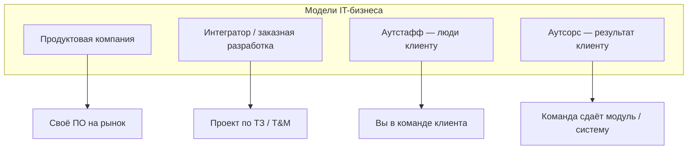

# Модели IT-бизнеса

  ОБЯЗАТЕЛЬНО
  ДЛЯ НОВИЧКОВ

  
Связь с другими статьями

  

  Договор и приёмка — <a href="./3">следующая статья</a>.
  Карьера в IT — <a href="/encyclopedia/1-basics/1-26-karera-v-it-i-mify/intro">раздел 1-26</a>.
  Старт проекта — <a href="/encyclopedia/7-project/7-17-nachalo-raboty-na-proekte/1">7.17</a>.
  

---

## Почему модель работодателя важна

От **модели бизнеса** зависят:

- **кто ставит задачи** — свой PO, PM заказчика, менеджер интегратора;
- **кто владеет кодом** — компания, клиент, open source;
- **как оценивают успех** — метрики продукта, акт приёмки, утилизация часов;
- **что ждут на испытательном сроке** — первый PR, сдача этапа, выход на проект клиента.

Один и тот же заголовок "разработчик" в продукте, интеграторе и аутстаффе означает **разный контекст**. Junior, который не понимает модель, часто разочаровывается: "я думал, буду делать продукт, а оказалось — заказная разработка по ТЗ".

### Четыре базовые модели

---

## Продуктовая компания

**Продукт** — своё программное обеспечение для рынка: SaaS, мобильное приложение, внутренняя платформа холдинга, маркетплейс.

### Характеристики

| Аспект | Как обычно устроено |
|--------|---------------------|
| **Цель** | Рост метрик продукта: MAU, retention, revenue |
| **Приоритеты** | [PO/PM](/encyclopedia/7-project/7-19-produktovye-roli/1), roadmap, гипотезы |
| **Горизонт** | Годы, несколько релизных циклов |
| **Процесс** | [Scrum](/encyclopedia/7-project/7-14-scrum/intro), [Kanban](/encyclopedia/7-project/7-18-kanban/intro), product discovery |
| **Код** | Обычно остаётся у компании |
| **Метрики успеха** | DAU, conversion, NPS, churn |

### Плюсы для разработчика

- влияние на архитектуру и стек (в разумных пределах);
- видимый результат для пользователей;
- долгий горизонт — можно углубиться в домен;
- часто сильнее инженерная культура (CI, review).

### Минусы и риски

- **feature factory** — много фич без проверки гипотез ([продуктовая аналитика](/encyclopedia/7-project/7-04-analitika/1123));
- давление метрик и дедлайнов релиза;
- в крупном продукте — узкая зона ответственности (только один сервис).

### Пример

Компания делает CRM для малого бизнеса. Команда из 12 человек: 6 backend, 3 frontend, 1 QA, 1 PO, 1 PM. Релизы каждые 2 недели. Задачи из product backlog, приоритет — отток клиентов после онбординга.

---

## Интегратор и заказная разработка

**Интегратор** или **студия заказной разработки** — компания, которая **строит систему под конкретного заказчика** по договору.

**Заказчик** платит за **результат по ТЗ** (fixed price) или по модели **T&M** (time and material — оплата за время).

### Характеристики

| Аспект | Как обычно устроено |
|--------|---------------------|
| **Цель** | Сдача этапа, акт, формальная приёмка |
| **Документы** | ТЗ, ПМИ, материалы по [ГОСТ](/encyclopedia/7-project/7-08-tehnicheskoe-pismo/12) |
| **Процесс** | Гибрид waterfall в договоре и [Scrum](/encyclopedia/7-project/7-14-scrum/intro) внутри этапа |
| **Заказчик** | Часто формальный; решения через PM и юристов |
| **IP** | Часто переходит заказчику по договору |

### Плюсы для разработчика

- разнообразие доменов и проектов;
- опыт работы с госконтрактами, ERP, интеграциями;
- чёткие критерии "сделано" — AC, ПМИ.

### Минусы и риски

- **[scope creep](/encyclopedia/7-project/7-22-upravlenie-izmeneniyami/1)** без change request — переработки "бесплатно";
- меньше влияния на продуктовые решения;
- смена проекта после сдачи — context switch.

### Fixed price и T&M внутри интегратора

| Модель | Для разработчика |
|--------|------------------|
| **Fixed price** | Scope жёсткий; "ещё кнопка" = CR и согласование |
| **T&M** | Гибче scope; важен учёт часов, прозрачность в трекере |

Подробнее — [договор и приёмка](./3).

### Пример

Интегратор внедряет портал для регионального министерства. ТЗ на 200 страниц, этапы по договору, приёмка по ПМИ. Внутри команда работает спринтами по 2 недели, но акт подписывают раз в квартал.

---

## Аутстафф (outstaff)

Компания-работодатель **предоставляет специалистов** в команду **клиента**. Вы числитесь у одной фирмы, а работаете в **их** Jira, **их** Git, **их** процессах — физически или удалённо.

### Характеристики

| Аспект | Как обычно устроено |
|--------|---------------------|
| **Клиент** | Продуктовая компания, банк, госкорпорация |
| **Менеджмент** | Линия может быть двойная: у клиента и у аутстаффера |
| **Оплата клиентом** | За часы или месяц специалиста |
| **Стек и архитектура** | Решает клиент |
| **Срок** | Контракт на 3–12+ месяцев, продление |

### Плюсы

- опыт **крупного продукта** или **госпроекта** "изнутри";
- погружение в зрелые процессы (если у клиента они есть);
- иногда выше ставка, чем в малом интеграторе.

### Минусы

- **меньше влияния** на архитектуру, стек, приоритеты;
- риск "вас первым снимут" при сокращении бюджета клиента;
- двойная отчётность — timesheet аутстафферу и статус клиенту.

### Линия менеджмента — критичный вопрос

Перед выходом на проект выясните:

| Вопрос | Назначение |
|--------|-------|
| Кто ставит задачи на день? | Тимлид клиента или ваш PM |
| Кто оценивает performance? | Влияет на бонусы и продление |
| Кто решает конфликт приоритетов? | Эскалация |
| Можно ли участвовать в архитектурных решениях? | Рост карьеры |

  
Типичная ловушка

  

  "Вы в команде банка" на собеседовании, а на деле — изолированная задача без доступа к prod и без ментора. Уточняйте состав команды, процесс review и длительность контракта.
  

### Пример

Разработчик нанят компанией OutStaff LLC, выведен в команду финтех-продукта на 6 месяцев. Daily с командой клиента, PR в их GitLab, performance review раз в квартал — у клиента и дублирующий sync с OutStaff LLC.

---

## Аутсорс (outsourcing)

Компания **сдаёт готовый результат**: модуль, MVP, мобильное приложение, микросервис. Клиент не нанимает людей поимённо — он покупает **deliverable**.

### Характеристики

| Аспект | Как обычно устроено |
|--------|---------------------|
| **Фокус** | Поставка по контракту, milestone |
| **Оплата** | Часто fixed price |
| **IP** | Обычно переходит заказчику ([7.07](/encyclopedia/7-project/7-07-intellektualnye-prava/intro)) |
| **Команда** | Внутренняя у аутсорсера; клиент видит PM и демо |
| **Процесс** | Scrum/Kanban внутри, waterfall наружу |

### Плюсы

- команда под ключ — PM, QA, dev;
- чёткие milestone и demo для клиента.

### Минусы

- **жёсткие дедлайны** при неполных требованиях;
- crunch перед сдачей этапа;
- после сдачи проекта — ротация на другой контракт.

### Аутстафф и аутсорс — сравнение

| | Аутстафф | Аутсорс |
|---|----------|---------|
| **Покупает клиент** | Человеко-часы / специалиста | Результат |
| **Где вы работаете** | Процессы клиента | Процессы аутсорсера |
| **Видимость для клиента** | Вы в их чатах | Часто через PM |
| **Риск scope** | Меньше, если T&M | Выше при fixed price |

---

## Другие типы работодателей

### Консалтинг и аудит

Короткие проекты: оценка архитектуры, миграция, аудит ИБ. Много презентаций и документов, меньше долгого сопровождения кода.

### Вендор ПО (SAP, 1С, Microsoft partner)

[Внедрение ERP](/encyclopedia/7-project/7-15-vnedrenie-erp-sistem/intro): fit-gap, настройка, кастомизация, обучение. TCO на годы. Отдельный карьерный трек — функциональный консультант, разработчик расширений.

### Стартап

Формально продукт, но ресурсы ограничены: один dev на всё, мало процессов, высокий риск закрытия. Плюс — скорость обучения и ownership.

### Госсектор и корпорации с in-house IT

Вы **заказчик и исполнитель** одновременно: свой продукт, но жёсткая регуляторика, закупки, длинные согласования.

---

## Внедрение ERP

Отдельный класс — [внедрение ERP](/encyclopedia/7-project/7-15-vnedrenie-erp-sistem/intro):

- **fit-gap** — что покрывает стандарт, что кастомизировать;
- обучение пользователей и change management;
- **TCO** (total cost of ownership) на годы — лицензии, поддержка, доработки.

Для разработчика ERP часто означает: платформа 1С, SAP ABAP, конфигурация + код расширений, редкие релизы по окнам.

---

## Сравнительная таблица для соискателя

| Критерий | Продукт | Интегратор | Аутстафф | Аутсорс |
|----------|---------|------------|----------|---------|
| Влияние на продукт | Высокое | Среднее | Низкое | Среднее внутри команды |
| Стабильность scope | Меняется часто | По CR | У клиента | По контракту |
| Документооборот | Умеренный | Высокий | Зависит от клиента | Высокий к сдаче |
| Рост в архитектуру | Да | Зависит от проекта | Редко | Зависит от роли |
| Типичный процесс | Agile | Гибрид | Как у клиента | Agile внутри |

---

## Выбор работодателя для junior

Оценивайте не только бренд и зарплату:

### Чек-лист собеседования

- [ ] Есть ли **наставник** (buddy) первые 1–3 месяца?
- [ ] Описан ли **процесс** ([методология](/encyclopedia/7-project/7-03-metodologiya-i-zhiznennyy-tsikl-po/intro))?
- [ ] **Code review** обязателен или формальность?
- [ ] **Стек** актуален для рынка?
- [ ] **Домен** интересен или хотя бы переносим (fintech, e-commerce)?
- [ ] Понятна **модель** — продукт, проект, аутстафф?
- [ ] Time to first PR — ориентир ≤ 2 недели?

### Куда идти junior без опыта

| Ситуация | Разумный выбор |
|----------|----------------|
| Нужен ментор и процесс | Продукт или крупный интегратор с academy |
| Нужен опыт "большого" банка/теха | Аутстафф в сильную команду клиента |
| Нужно быстро набить портфолио проектов | Интегратор / аутсорс (с оговоркой на качество) |
| Есть сильный pet-project | Стартап или продукт |

См. [карьера в IT](/encyclopedia/1-basics/1-26-karera-v-it-i-mify/intro), [советы для новичка](/encyclopedia/1-basics/1-12-sovety-dlya-novichka/intro).

---

## Как модель влияет на ваш день

### Продукт — типичная неделя

- Планирование спринта, refinement backlog.
- Разработка фичи с A/B-тестом.
- Demo на review, метрики через неделю.

### Интегратор — типичная неделя

- Задачи из ТЗ, привязка к пункту спецификации.
- Подготовка к demo этапа для заказчика.
- QA по чек-листу ПМИ.

### Аутстафф — типичная неделя

- Daily с командой клиента.
- PR по их стандартам.
- Раз в месяц — sync с HR/PM аутстаффера.

---

## Связь с проектом

Модель заказчика определяет:

- [старт проекта](/encyclopedia/7-project/7-17-nachalo-raboty-na-proekte/1) — кто инициирует, какие артефакты;
- [договор](./3) — fixed, T&M, приёмка;
- [выбор процесса](/encyclopedia/7-project/7-03-metodologiya-i-zhiznennyy-tsikl-po/4) — agile, waterfall, гибрид.

---

## FAQ

**Аутстафф — это хуже продукта?**

Не обязательно. Зависит от клиента: сильная команда банка может дать больше роста, чем слабый продукт без review.

**Можно ли перейти из интегратора в продукт?**

Да, частый путь. Важно показать ownership, тесты, понимание продукта в резюме и на собеседовании.

**Как понять модель по вакансии?**

Ищите: "выведем на проект клиента" (аутстафф), "разработка под ключ" (аутсорс/интегратор), "наш продукт", "roadmap", "MAU" (продукт).

**In-house в банке — это продукт?**

Обычно да, internal product. Но процессы могут быть тяжелее, чем в SaaS-стартапе.

**ERP-интегратор — это интегратор?**

Да, с уклоном в платформу и длинный lifecycle.

---

## Российский рынок: нюансы моделей

### Продукт с иностранным капиталом и локализация

После 2022 года часть компаний **локализовала** продукты и команды в РФ. Модель остаётся продуктовой, но могут быть:

- отдельное юрлицо и compliance;
- ограничения на стек и облака;
- hybrid remote внутри РФ.

### Госзаказ через интегратора

Заказчик — государственный орган; исполнитель — интегратор с лицензиями и опытом 44-ФЗ. Разработчик видит **ТЗ, ПМИ, этапы** ([договор](./3)). Процесс часто waterfall наружу, agile внутри.

### Аутстафф в банк или телеком

Популярный путь для middle+: высокие требования к ИБ, background check, иногда **закрытый контур** без интернета на рабочей машине. Модель аутстаффа, продукт — клиента.

### Стартапы и студии

Малые продуктовые команды 5–15 человек часто совмещают **продукт + заказную** разработку для cash flow. Уточняйте на собеседовании долю: 80% свой продукт или 80% клиентские проекты.

---

## Вопросы на собеседовании про модель

| Вопрос работодателю | Что выясняете |
|---------------------|---------------|
| Кто ваш клиент — рынок или заказчики? | Продукт vs интегратор |
| Код в open source или под NDA? | Портфолио |
| Как устроен performance review? | Аутстафф: двойная линия |
| Сколько проектов параллельно? | Context switch |
| Есть ли on-call и runbook? | Операционная зрелость |

---

## См. также

- [Договор и приёмка глазами разработчика](./3)
- [Как выбрать процесс под контекст](/encyclopedia/7-project/7-03-metodologiya-i-zhiznennyy-tsikl-po/4)
- [Продуктовые роли](/encyclopedia/7-project/7-19-produktovye-roli/intro)
- [Внедрение ERP](/encyclopedia/7-project/7-15-vnedrenie-erp-sistem/intro)
- [Карьера в IT и мифы](/encyclopedia/1-basics/1-26-karera-v-it-i-mify/intro)

---
