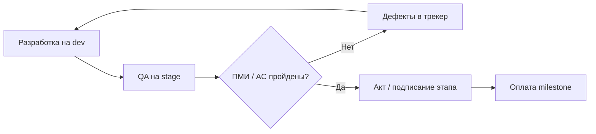
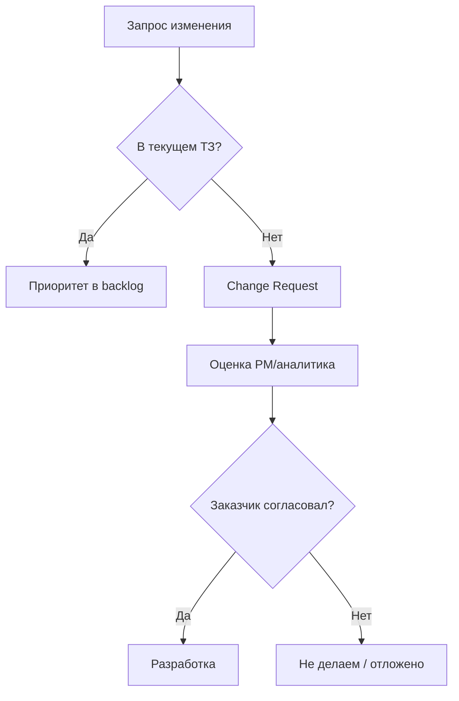

# Договор и приёмка глазами разработчика

<div class="article-tags">
  <span class="tag tag-required">ОБЯЗАТЕЛЬНО</span>
  <span class="tag tag-beginner">ДЛЯ НОВИЧКОВ</span>
</div>

<div class="callout callout--info">
  <div class="callout-title">Связь с другими статьями</div>
  <div class="callout-body">
  Модели IT-бизнеса — <a href="./2">предыдущая статья</a>.
  ГОСТ и техписьмо — <a href="/encyclopedia/7-project/7-08-tehnicheskoe-pismo/intro">раздел 7-08</a>.
  Управление изменениями — <a href="/encyclopedia/7-project/7-22-upravlenie-izmeneniyami/1">7-22</a>.
  ГИС и госконтракты — <a href="/encyclopedia/7-project/7-03-metodologiya-i-zhiznennyy-tsikl-po/2">7-03/2</a>.
  </div>
</div>

---

## Что даёт договор

**Договор** (или контракт, рамочное соглашение с приложениями) задаёт правила игры между **заказчиком** и **исполнителем**:

- **что** сдаём — перечень работ, ТЗ, спецификации;
- **когда** — календарный план, этапы, штрафы за просрочку (если есть);
- **как принимают** — критерии, ПМИ, сроки молчаливой приёмки;
- **сколько стоит** — fixed price, T&M, этапы оплаты;
- **что считается изменением** — change request, допсоглашение.

Разработчик редко подписывает документ лично, но **работает в его рамках** каждый день: приоритеты, definition of done, что можно менять без согласования.

Непонимание договора ведёт к:

- "переделайте бесплатно" — когда scope вырос без CR;
- конфликтам с [PO](/encyclopedia/7-project/7-19-produktovye-roli/1) — когда AC в Jira не совпадают с ТЗ;
- срыву приёмки — когда на stage не проходят сценарии ПМИ.

<div class="callout callout--tip">
  <div class="callout-title">Практический шаг</div>
  <div class="callout-body">
  Попросите у PM <strong>краткую выжимку</strong> (1–2 страницы): этапы, критерии приёмки текущего этапа, контакты заказчика, модель оплаты. Не обязательно читать весь договор на 80 страниц — но знать границы своей ответственности обязательно.
  </div>
</div>

---

## Типовые модели оплаты

| Модель | Суть | Для команды | Риски |
|--------|------|-------------|-------|
| **Fixed price** | Фиксированная сумма за scope | Scope жёсткий; изменения = [CR](/encyclopedia/7-project/7-22-upravlenie-izmeneniyami/1) | Недооценка, crunch, scope creep без оплаты |
| **T&M (time and material)** | Оплата за часы/ставки | Гибче scope; важен учёт часов | "Бесконечный" проект без приоритетов |
| **Retainer** | Абонентская плата | Поддержка, SLA ([ITSM](/encyclopedia/7-project/7-16-itsm-i-it-uslugi/2)) | Выгорание от мелких задач без учёта |
| **Milestone** | Оплата по этапам | Связь с актами приёмки | Задержка одного этапа блокирует cash flow |

### Fixed price подробнее

**Когда используют:** госконтракты, аутсорс MVP, интегратор с фиксированным бюджетом.

**Что это значит для разработчика:**

- каждая новая функция вне ТЗ — формальный или неформальный CR;
- оценки критичны — занижение бьёт по команде;
- документация и traceability до пунктов ТЗ часто обязательны.

**Пример:** договор на 5 млн ₽ за модуль "Личный кабинет" по ТЗ v1.2. Заказчик просит OAuth через Госуслуги — пункт в ТЗ отсутствует → PM оформляет CR, допсоглашение, новый срок.

### T&M подробнее

**Когда используют:** долгая продуктовая доработка для корпорации, аутстафф-подобные контракты, поддержка.

**Что это значит для разработчика:**

- задачи из backlog, приоритеты могут меняться чаще;
- timesheet или списание часов в трекере — часть процесса;
- риск "feature factory" без фокуса — решает PO/заказчик.

**Пример:** ставка 3500 ₽/час, cap 160 часов в месяц. Команда тянет backlog в Jira; в конце месяца акт на часы + отчёт о выполненных тикетах.

### Retainer и поддержка

После сдачи основного проекта часто идёт **гарантийная** и **post-warranty** поддержка:

- исправление дефектов по SLA;
- мелкие доработки в рамках пакета часов;
- приоритет инцидентов P1/P2.

См. [ITSM](/encyclopedia/7-project/7-16-itsm-i-it-uslugi/intro), [инциденты](/encyclopedia/7-project/7-21-incidenty-i-ekspluatatsiya/1).

---

## Госконтракты и PMI

В **госзакупках** (44-ФЗ, 223-ФЗ) и крупных корпоративных тендерах часто требуют:

| Артефакт | Назначение |
|----------|------------|
| **ТЗ** | Что должна делать система |
| **Технический проект / проектная документация** | Как устроено |
| **ПМИ** (программа и методика испытаний) | Как проверяют при приёмке |
| **Руководство пользователя / администратора** | Для эксплуатации |
| **Акт** | Формальное закрытие этапа |

### ПМИ глазами разработчика

**ПМИ** — документ со **сценариями испытаний**: шаги, входные данные, ожидаемый результат. На приёмке заказчик или комиссия **прогоняет** эти сценарии на agreed среде (часто stage).

Подробнее — [техписьмо / ПМИ](/encyclopedia/7-project/7-08-tehnicheskoe-pismo/14), [ГОСТ](/encyclopedia/7-project/7-08-tehnicheskoe-pismo/12).

**Ваша задача:**

- понимать, какие сценарии ПМИ покрывают ваш модуль;
- не ломать их регрессией перед приёмкой;
- если сценарий нереалистичен — эскалировать **до** приёмки, не в день акта.

### PMI (Project Management Institute) и договор

**PMI** в контексте управления проектами — [PMBOK](/encyclopedia/7-project/7-02-komanda-i-upravlenie/17), стандарты планирования, рисков, стейкholders. В договоре крупного заказчика могут ссылаться на:

- структуру WBS (work breakdown structure);
- отчётность по рискам и статусу;
- change control board.

Разработчику достаточно знать: **изменения scope** идут через формальный процесс, а не только через комментарий в чате.

<div class="callout callout--warning">
  <div class="callout-title">Не путайте ПМИ и PMI</div>
  <div class="callout-body">
  <strong>ПМИ</strong> — программа и методика <em>испытаний</em> (acceptance testing) в русскоязычных ГОСТ-проектах.
  <strong>PMI</strong> — Project Management Institute, стандарты управления проектами. В одном проекте могут сосуществовать оба контекста.
  </div>
</div>

---

## Приёмка

**Приёмка** — формальное подтверждение, что результат **соответствует критериям** договора: ТЗ, ПМИ, чек-листы, AC в тикетах.

### Уровни критериев

| Уровень | Где живёт | Кто проверяет |
|---------|-----------|---------------|
| **AC в тикете** | Jira, YouTrack | QA, иногда PO |
| **ПМИ** | PDF / wiki / репозиторий | Комиссия заказчика |
| **ТЗ** | Контрактное приложение | Аналитик, приёмка |
| **DoD команды** | Wiki, Confluence | Команда перед merge |

Для разработчика **AC в тикете** = то, что проверит QA и что может спросить заказчик на demo.

### Процесс приёмки (упрощённо)



### Что не считается приёмкой

- "Работает у меня" на локальной машине;
- demo только на dev без данных, близких к prod;
- устное "ок" без протокола (в госконтракте — особенно);
- merge в main без прохождения CI и QA на stage.

### Сроки молчаливой приёмки

В договоре часто указано: если заказчик **не направил мотивированный отказ** за N рабочих дней после передачи результата — результат **считается принятым**. PM следит за календарём; разработчик — за качеством на stage до передачи.

---

## Этапы и артефакты

Типичная цепочка **заказного** проекта ([основы проекта](/encyclopedia/7-project/7-02-komanda-i-upravlenie/1)):

| Этап | Артефакты | Участие разработчика |
|------|-----------|---------------------|
| 1. ТЗ / Технический проект | ТЗ, диаграммы, оценки | Review на feasibility |
| 2. Разработка | Код, CI, промежуточные demo | Основная работа |
| 3. Испытания | Протоколы ПМИ, баг-листы | Фиксы, поддержка QA |
| 4. Ввод в эксплуатацию | Инструкции, миграции | Деплой, smoke |
| 5. Гарантия | SLA, инциденты | Hotfix по приоритету |

В **Agile внутри этапа** — спринты, daily, review; **веха приёмки** по договору остаётся на календаре (конец квартала, сдача модуля).

### Traceability: от ТЗ до коммита

Зрелые команды связывают:

- пункт ТЗ → epic/story в трекере → PR → тест-кейс ПМИ.

Это спасает на приёмке, когда спрашивают: "где реализован пункт 4.2.17?"

Инструменты: ссылки в описании тикета, [Jira/YouTrack](./21), labels, custom field "ТЗ пункт".

---

## Изменения scope

Если заказчик просит "ещё одну кнопку" или "давайте сделаем по-другому":

### Алгоритм для команды

1. **Зафиксировать** запрос в трекере / CR (change request).
2. **Оценить** влияние на срок, стоимость, риски, другие модули.
3. **Согласовать** с заказчиком: допсоглашение (fixed) или переприоритизация (T&M).
4. **Только после** — брать в разработку (или swap с чем-то из scope).



**Молчаливое согласие разработчика** ("ну ладно, быстро добавлю") **не** обязует компанию работать бесплатно и **не** защищает вас от crunch.

<div class="callout callout--tip">
  <div class="callout-title">Как сказать заказчику</div>
  <div class="callout-body">
  "Понял запрос. Передаю PM/аналитику на оценку влияния на этап — вернёмся с вариантами: срок, стоимость или замена другой задачи из scope."
  </div>
</div>

### Scope creep — признаки

- AC в тикете растут без смены story points;
- "мелочи" накапливаются перед актом;
- заказчик ссылается на устные договорённости не из ТЗ.

Эскалация — PM, не конфликт dev vs заказчик в личке.

---

## Ответственность разработчика

### За что отвечаете вы

- **качество реализации** в рамках согласованных требований;
- соблюдение **процесса**: review, тесты, [DoD](/encyclopedia/7-project/7-25-dostavka-i-gotovnost/2);
- **своевременная эскалация** технических рисков письменно (тикет, email, комментарий с @PM).

### За что отвечаете не вы

- **бизнес-решение** "делать фичу X вместо Y" — зона PO/заказчика;
- **юридические** формулировки договора — юристы и PM;
- **приёмка** как подписание акта — уполномоченные лица заказчика.

### Исключение: молчали о риске

Если вы **знали**, что архитектурное решение не выдержит нагрузку или интеграция невозможна в срок, и **не сообщили** — ответственность растёт. Фиксируйте риски в тикете, ADR, письме.

Пример комментария в тикете:

```text
Риск: API заказчика не документирует поле X. Без ответа интеграция +5 дней.
Эскалация: @pm @analyst. Дата: 2026-03-01.
```

---

## NDA и интеллектуальная собственность

Код, документация, доступы — [интеллектуальная собственность](/encyclopedia/7-project/7-07-intellektualnye-prava/intro) по договору.

| Типичное правило | Действие |
|------------------|----------|
| Код принадлежит заказчику | Не публиковать фрагменты в open source без разрешения |
| NDA на проект | Не обсуждать детали в публичных чатах |
| LLM и внешние сервисы | Политика команды — [ИИ в процессе](/encyclopedia/7-project/7-24-ii-v-proektnom-protsesse/1) |

Не выкладывайте фрагменты ТЗ, credentials, персональные данные в публичные LLM.

---

## Практический чек-лист разработчика

### На старте этапа

- [ ] Знаю **критерии приёмки** текущего этапа (ПМИ, AC, demo).
- [ ] Знаю, **кто** со стороны заказчика подписывает акт.
- [ ] Понимаю, куда оформлять **запросы на изменение** (CR template, Jira type).
- [ ] Есть доступ к **ТЗ/спецификации** в wiki или репозитории.
- [ ] Понимаю модель оплаты: **fixed** или **T&M** — влияет на гибкость scope.

### Перед передачей на приёмку

- [ ] QA прошёл критичные сценарии на **stage**.
- [ ] Известные дефекты заведены и согласованы (blocker vs minor).
- [ ] Release notes / список изменений для заказчика готов ([7.25](/encyclopedia/7-project/7-25-dostavka-i-gotovnost/2)).
- [ ] Миграции и rollback проверены.

### При запросе "срочно вне плана"

- [ ] Запрос зафиксирован в трекере.
- [ ] PM в курсе — не только устный чат с аналитиком заказчика.

---

## Примеры из практики

### Пример 1. Fixed price, срыв приёмки

Заказчик отклонил акт: сценарий ПМИ №47 не проходит — timeout отчёта. Причина: на stage 100 строк, на demo заказчика — 100 000. **Урок:** заранее согласовать объём тестовых данных и нагрузочные ожидания в CR или приложении к ПМИ.

### Пример 2. T&M, бесконечный backlog

Команда 6 месяцев закрывает тикеты без релизных вех. Заказчик недоволен "ничего не видим". **Урок:** даже при T&M нужны demo и milestone каждые 2–4 недели — договориться с PM.

### Пример 3. CR без допсоглашения

Разработчик добавил интеграцию с SMS по просьбе заказчика в чате. На акте — спор: это не в ТЗ. **Урок:** любое "не в ТЗ" — через PM и CR.

---

## FAQ

**Нужно ли читать весь договор?**

Достаточно выжимки от PM + приложения ТЗ/ПМИ на ваш модуль. Полный текст — при спорных ситуациях.

**Кто пишет ПМИ?**

Обычно аналитик, QA lead, иногда с участием разработки (техническая feasibility).

**Можно ли менять AC в тикете без CR при fixed price?**

Если AC **уточняют** ТЗ — часто да. Если **расширяют** scope — нужен CR.

**Что если заказчик не приходит на demo?**

Фиксируйте протокол: видеозапись, письмо с результатами, календарь молчаливой приёмки — зона PM.

**Agile отменяет акты?**

Нет. Внутри команды — спринты; наружу — этапы по договору остаются.

**Ответственность за просрочку fixed price?**

Юридически — компания-исполнитель. Для команды — прозрачные оценки, ранние эскалации рисков, без героического crunch без решения PM.

---

## Глоссарий для разработчика

| Термин | Кратко |
|--------|--------|
| **ТЗ** | Техническое задание — что строим |
| **ПМИ** | Программа и методика испытаний |
| **Акт** | Документ приёмки этапа |
| **CR** | Change request — запрос на изменение scope |
| **Этап / milestone** | Контрольная точка договора |
| **Гарантия** | Период бесплатных исправлений дефектов по ТЗ |
| **SLA** | Согласованное время реакции на инцидент |

---

## См. также

- [Модели IT-бизнеса](./2)
- [ГИС и госконтракты](/encyclopedia/7-project/7-03-metodologiya-i-zhiznennyy-tsikl-po/2)
- [Управление изменениями](/encyclopedia/7-project/7-22-upravlenie-izmeneniyami/1)
- [Acceptance criteria](/encyclopedia/7-project/7-04-analitika/116)
- [Тестирование и ПМИ](/encyclopedia/7-project/7-05-testirovanie/intro)
- [Старт проекта](/encyclopedia/7-project/7-17-nachalo-raboty-na-proekte/1)

---
