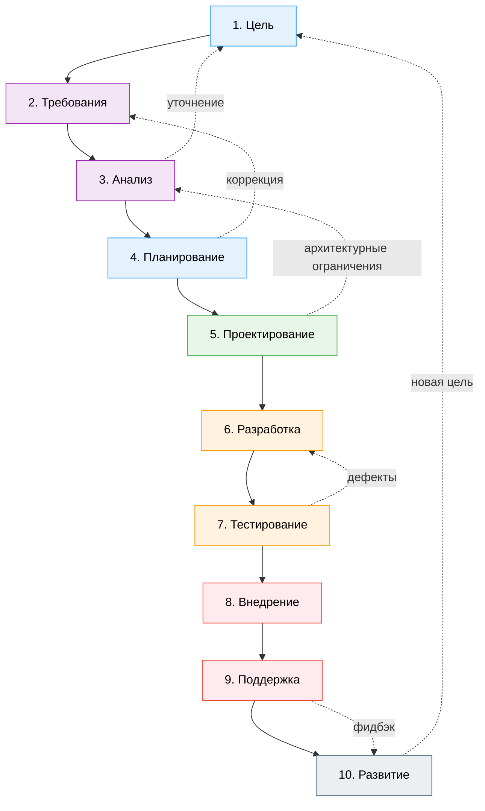
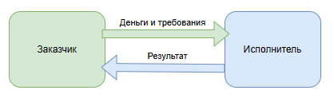
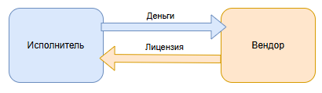

---
title: Основы управления IT-проектами
tags: [advanced, notrequired, analytic, architector, manager]
description: Управление людьми. Project Основы.
---

# Основы управления IT-проектами

  ОБЯЗАТЕЛЬНО
  ДЛЯ НОВИЧКОВ
  НЕ ДЛЯ НОВИЧКОВ
  В РАЗРАБОТКЕ

Руководителю
Аналитику
Техническому писателю

## Основы управления IT-проектами

### Что такое проект?

Мы уже не раз упоминали работу «команды», «проекта» и т.п. И настало время погрузиться уже в непосредственную «жизнь» IT-сферы - проектная деятельность. Начнём с фундамента.

**Проект** — это временная деятельность, направленная на создание уникального продукта, услуги или результата. В отличие от повседневной операционной деятельности, проект имеет:

	- чёткую цель - то, что должно быть достигнуто;
	- ограниченный срок - начало и конец;
	- выделенные ресурсы - люди, бюджет, технологии;
	- уникальность - каждый проект отличается от предыдущих, даже если решает похожие задачи.
	
Такое определение даёт, например, Project Management Institute (PMI) в PMBOK® Guide, и оно отлично подходит и для IT. Как вы понимаете - проектом может быть что угодно. Появляются новые технологии, растут требования пользователей, меняются бизнес-цели. Чтобы адаптироваться, компании запускают проекты. Без проектов невозможно разработать приложение, перенести данные, автоматизировать процессы, обеспечить безопасность.

Когда мы говорим о бизнесе, речь уже идёт о миллионах денежных средств, что превращает обычные решения в критически важные. Каждый просчёт будет стоить сильных потерь - временных, финансовых, трудовых.

---

### Особенности проектов в IT

IT-проекты обладают рядом уникальных черт, которые отличают их от проектов в других сферах.

1. **Высокая степень неопределённости**. На старте проекта мы не можем точно знать, что именно нужно заказчику (он может думать, что знает, но это не так), как лучше реализовать решение технически, какие риски возникнут по ходу, сколько времени и ресурсов реально потребуется, как себя поведёт система при масштабировании, интеграции, и как пользователи отреагируют на финальный продукт. Требования могут быть нечёткими, изменчивыми. Сегодняшнее «лучшее техническое решение» завтра может стать техническим долгом. Именно для борьбы с неопределённостью создаются специальные инструменты и методологии, вроде итеративной разработки, прототипирования, MVP.

2. **Быстрое изменение требований**. Редко бывает так, чтобы требования были неизменными от начала до конца проекта. Пользователи могут осознать, что им нужно нечто другое, только после того, как увидят прототип. Рынок может надавить и изменить бизнес-цели, конкуренты могут сделать что-то круче. Это всё требует гибкости от команды, чтобы быть готовыми переступить через принципы.

3. **Зависимость от технологий**. Когда мы строим здание, то материалы вроде бетона, кирпичей останутся неизменными, и так же в большинстве отраслей - нет свойства устаревания и нет зависимости от актуальности. Но если мы строим IT-проект, то технологический стек может устареть ещё до завершения проекта. Выбор фреймворка, языка программирования, библиотек, облачной платформы - всё это влияет на сроки, стоимость и даже возможность реализации. Кроме того, интеграция с другими системами, обновления API, изменения в лицензировании ПО - всё это создаёт дополнительные риски.

4. **Невидимость результата на ранних этапах**. В отличие от строительства, где видно, как растёт здание, в IT-проектах промежуточный результат часто неосязаем: код, архитектура, тесты являются внутренней кухней. Заказчики могут терять доверие, не видя прогресса, а менеджеры недооценивают сложность задач. Это всё требует особого подхода к демонстрации прогресса, именно для этого здесь существуют специфичные демо-версии, прототипы и MVP.

5. **Сложность оценки трудозатрат и сроков**. Нетривиальная задача - оценить, сколько времени займёт разработка модуля или исправление бага, особенно если речь идёт о новом функционале, нестандартной интеграции или исследовательской работе. Почти всегда сроки срываются, и для дисциплинирования исполнения заказчики устанавливают серьёзные штрафы. Поэтому для исполнителя нужно брать расчёт на превышение сроков.

6. **Безопасность и нагрузка**. IT-продукты должны быть функциональными и обладать готовностью к повышенным и нестандартным нагрузкам, обеспечивать безопасность данных заказчика и пользователей, соответствовать нормативным требованиям. Эти аспекты часто недооцениваются на старте, но могут привести к катастрофическим последствиям на этапе эксплуатации.

7. **Высокая зависимость от людей**. Как бы странно не было, но здесь речь идёт об особой роли квалификации, в IT успех проекта напрямую зависит от компетенций разработчиков, тестировщиков, DevOps-инженеров, аналитиков. Один ключевой специалист может «тянуть» проект, а его уход поставит всё под угрозу, ведь найти замену может быть невозможно.

---

### Участники проекта

В проекте участвуют определённые лица - заказчик и исполнитель. Между ними могут быть посредники, а также другие исполнители или другие заказчики для крупных проектов. Давайте рассмотрим участников проекта.

Основные участники - **заказчик** и **исполнитель**.

#### Заказчик (Customer / Client)

Это тот, кто инициирует проект, финансирует его и получает результат. Это может быть компания, заказывающая разработку ПО, отдел внутри компании, конечный пользователь или государственный орган. От него зависит формулировка целей и требований, утверждение бюджета и сроков, принятие промежуточных и финальных результатов, и конечно оплата по этапам или по факту.

#### Исполнитель

Здесь важно уточнить, что с точки зрения законодательства наименование изменчиво:
	- Оказание услуг - исполнитель;
	- Выполнение работ - подрядчик.
	
Но бывает так, что договорные отношения включают в себя комплекс услуг и работ, поэтому традиционно называют именно исполнителем.

Это тот, кто фактически выполняет проект, создаёт продукт, услугу или результат. Может быть внешней компанией (аутсорс), внутренней командой разработки (инхаус), фрилансером, или даже отдельным специалистом. От исполнителя зависит качество выполнения работ, соблюдение сроков и бюджета, техническая реализация требований, тестирование, сдача и иногда поддержка.

Дополнительные участники зависят от специфичности отношений.

#### Вендор

Как правило, это правообладатель системы или платформы, который уже ранее разработал (сам или по заказу) её и сейчас зарабатывает тем, что предоставляет лицензию на работу с платформой.

Рассмотрим на примере. Банк (заказчик) хочет себе систему на определённой платформе. Для этого он нанимает компанию-интегратора (исполнитель), чтобы разработать систему. Интегратор обращается к вендору, получает все необходимые лицензии, вендор предоставляет ему базовую версию программы. Интегратор затем дорабатывает продукт так, чтобы он соответствовал требованиям заказчика.

То есть, фактически, банк мог бы заплатить больше, чтобы исполнитель разработал систему с нуля. Но на рынке есть более дешёвые решения, которые уже разработаны, их нужно лишь доработать под свои хотелки (стили, сущности, логика) и всё.

У банка нет разработчиков, но есть деньги.

У интегратора есть разработчики, но нет денег и лицензий на платформу.

У вендора есть лицензия и платформа.

#### Стейкхолдер

В бизнес-теории, существует специальный термин для обозначения организаций или людей, которые так или иначе заинтересованы в проекте или влияют на него. Это не обязательно заказчик, это могут быть топ-менеджеры головной компании, конечные пользователи, партнёры, инвесторы, регуляторы. Большой бизнес управляется не одним-двумя лицами, а целыми группами аффилированных компаний, поэтому всегда есть кто-то заинтересованный - это и будет стейкхолдер. Они тоже являются частью коммуникации, и со стороны исполнителя не менее важно проявлять уважение - ведь фактически это «заказчик заказчика».

---

### Договорные отношения

Заказчик и исполнитель связаны договорными отношениями, которые представляют собой фундамент для выполнения работ, оказания услуг или поставки товаров.

**Сделка (Deal)** - это юридическое действие, направленное на установление, изменение или прекращение гражданских прав и обязанностей. Это любое действие, после которого будут юридическое последствие - купил, продал, заказал, передал, согласился. Даже если заказчик устно попросил исполнителя сделать сайт - уже фактически сделка.

У сделки могут быть стороны - это лица, между которыми она заключается. Особенность сделки в том, что она может быть односторонней. Договор - это вид сделки, и он уже не может быть односторонним.

**Договор** - это соглашение **двух** или более лиц (сторон), направленное на установление, изменение или прекращение гражданских прав и обязанностей.
В английском языке используют слово Contract для обозначения договора. У нас понятие «контракт» можно воспринимать как синоним, если речь идёт о международной практике. Часто государственные двусторонние сделки получают название «государственный контракт», и вряд ли встретите понятие «государственный договор». Но воспринимайте слова «контракт» и «договор» как обозначение одного и того же.

Ежедневно мы совершаем сделки, контактируя с людьми, выдвигая предложение, и получая согласия или отказы. Но что, если потом возникают споры в стиле «но ты обещал сделать ещё вот это!», хотя об «этом» речи не было? Вот тут и выходит из тени юриспруденция, в части оформления сделок. Чтобы потом можно было доказать, предъявив в ответ, нужно оформлять сделки в письменном виде.

Есть определённые правила для оформления договоров. Основная мысль «письменной формы» в том, чтобы не указать ничего лишнего, и не упустить ничего важного. Поэтому привлекают профессионалов - юристов.

В юриспруденции выделяют несколько видов договоров:

#### Договор подряда

Договор подряда - самый распространённый в IT. Исполнитель (подрядчик) обязуется выполнить определённую работу и сдать её результат заказчику, а заказчик - принять и оплатить. Это как раз разработка ПО, создание сайтов, настройка серверов, интеграция систем.
Ключевая особенность подряда - всегда есть результат, и он осязаемый (в контексте электронной формы код, файлы можно считать осязаемыми). Его можно принять, проверить. Существование результата подтверждается подписанным сторонами актом.

К примеру, результатом договора подряда на разработку сайта, будет сам сайт.

#### Договор возмездного оказания услуг

Договор возмездного оказания услуг - исполнитель обязуется оказать услуги, а заказчик - оплатить их. Услугой является действие или деятельность, результат которой не имеет материальной формы и не передаётся в собственность. Примеры - техническая поддержка, консультации, аудит, обучение, сопровождение системы.

Здесь ключевым является то, что результат именно процесс, а не продукт.

#### Договор поставки / купли-продажи

Поставка - это вид купли-продажи, классического договора, который применяется, когда продавец продаёт и передаёт в собственность покупателя определённый товар, а покупатель покупает и передаёт денежные средства продавцу. 

В IT это используется для продажи ПО, лицензий, оборудования, ресурсов - покупка коробочной версии 1С, приобретение лицензии Microsoft 365, покупка серверов или лицензий на ПО.

В данном виде передаётся товар или право пользования им.

#### Лицензионный договор

Лицензионный договор выделяется отдельно, он регулирует передачу прав на использование интеллектуальной собственности - ПО, дизайн, контент. К примеру, лицензия на использование CRM-системы, передача прав на использование мобильного приложения, или SaaS-лицензии. Здесь передаётся право использования на определённых условиях.

Он не всегда может подразумевать передачу за деньги, встречается и как дополнительный договор, без взимания платы. Допустим, заказчик уже платит исполнителю в рамках договора подряда, а лицензионный договор оформляется дополнительно, чтобы передать права на результат.

#### Договор присоединения

Необычный договор, условия которого определяются одной стороной (исполнителем обычно), а другая сторона может только присоединиться к ним. Это, к примеру, публичная оферта (предложение) на сайте фрилансера, условия использования сервиса (те самые, которые мы подписываем при установке ПО), облачные сервисы.

Заказчик вроде бы платит и заказывает, но…не может менять условия. Только принимать или отказываться.

#### Смешанный договор

Смешанный договор можно встретить довольно часто, он содержит элементы разных типов договоров, например, и разработку (подряд) и поддержку (услуги), и лицензию. То есть, наличие видов договоров не заставляет нас придерживаться строгости, но потребуется чётко разделять части договора, чтобы правильно применять нормы закона и не путать бухгалтерию.

**Предмет договора** - это то, ради чего заключён договор. Это основная обязанность исполнителя и основное право заказчика. Он должен быть прописан чётко, однозначно и применимо. Ошибаться в нём недопустимо.

Обычно предмет договора выделен в отдельный самостоятельный пункт, где чётко указано, что «Исполнитель передаёт Заказчику неисключительную лицензию на использование CRM-системы «CRM» на 10 (десять) рабочих мест».

Предметом соответственно являются товары, работы или услуги. Эти три понятия отличаются, так как имеют своё регулирование, свои особенности и последствия.

**Работы** имеют осязаемый, материальный, документированный результат. На работу можно требовать устранения недостатков.

**Услуги** представляют собой действие, процесс, эффект (консультация, поддержка, обучение). На услугу можно требовать надлежащее её оказание.

**Товары** являются физическим продуктом или цифровым активном (устройство, ПО, лицензия). Товар обладает гарантией и по нему можно оформить возврат.

---

### Ресурсы

Так, заказчик подписывает договор и исполнителем, и у них порождаются правоотношения, связанные с исполнением договора. В условиях всё указано, когда приступать, что делать - часто изложено в техническом задании и спецификациях, которые представляют собой приложения к договору.

Вопрос, который важно урегулировать между сторонами - это ресурсы. Нужно определить, на чьих мощностях будут развёрнуты результаты, где и как будет вести работу исполнитель, чьими силами и за чей счёт. Обычно базово определяется в договоре, к примеру, «исполнитель своими силами и за свой счёт выполняет…». Но если мы говорим о серьёзном крупном проекте, то заказчик вряд ли согласится на полную зависимость от исполнителя.

Обычно заказчики формируют свою инфраструктуру, где и развёртывается всё необходимое для разработки ПО. Исполнителю предоставляется туда доступ, как раз для разработки, тестирования, развёртывания и запуска продукта.

**Среда (environment)** является изолированным пространством (сервер, виртуальная машина, контейнер), где развёрнут продукт для определённой цели. Часто среду называют «стенд». Но стенд - это развёрнутая среда, подготовленная для тестирования, демонстрации или приёмки. Это понятие пришло из проектной деятельности в смежных сферах, когда разработанный проект представляют аудитории на «стенде».

Можно выделить четыре типа сред в порядке жизненного цикла:

1. **Dev (Разработка)** - среда разработки, используется для написания и первичного тестирования кода. Часто локальная (на компьютере разработчика) или общая для команды. Может быть нестабильной, «ломаться» при ошибках, поэтому нет ничего страшного, если такой сервер «уронить» - для того такая среда и выделяется отдельно, чтобы экспериментировать, исследовать без рисков для бизнеса.
2. **Test / QA** - тестовая среда, максимально приближенная к продакшену, где тестировщики проверяют функциональность, производительность и безопасность. Данные здесь тестовые, не «боевые». Важно установить, чтобы не было доступа к реальным данным пользователей.
3. **Stage / Staging** - предпродакшен (предпрод), полная копия продакшена по конфигурации, но с тестовыми или анонимизированными данными. Используется для финального тестирования, демонстрации заказчику, и именно тут проверяется, как всё будет работать «в бою».
4. **Prod / Production** - продакшен (боевая среда), реальная среда, где работает продукт для конечных пользователей. Любые изменения здесь должны быть под строгим контролем, а сбой будет равен убыткам, недовольным клиентам или репутационным рискам.

Исполнитель тоже обладает своими ресурсами, и это могут быть инструменты, инфраструктура и процессы, которые использует его команда для выполнения проекта.

1. **Системы контроля версий** - это свой сервер или репозиторий на платформе, к примеру, Git, для того, чтобы хранить код, совместно работать с ним, отслеживать изменения и откатывать к предыдущим версиям.
2. **Техника** - она может быть личной и корпоративной.

Корпоративная техника принадлежит организации, что позволяет эффективнее управлять доступом и безопасностью, иметь единые настройки и ПО, настраивать резервное копирование, свои политики.

Личная техника подразумевает принадлежность конкретному сотруднику, и может иметь риски, такие как утечка кода, данных, отсутствие бэкапов и важных доступов.

Часто в договоре или ТЗ могут указать, что исполнитель «обязан использовать защищённые корпоративные средства».

3. **Инструменты** - это CI/CD-пайплайны, системы управления задачами, чаты, трекеры, инструменты тестирования, документация, Wiki.
4. **Собственные среды** - у исполнителя тоже могут быть свои Dev/Test стенды, включая как реальные сервера, так и виртуальные машины или контейнеры.

---

### Результаты

Всё это организуется, чтобы грамотно подойти к соответствующим ожиданиям результатам.

**Результатом** будет то, что создаётся в процессе проекта и сдаётся Заказчику. При услугах - настраивается всё для деятельности и процессов, и исполнитель приступает, регулярно отчитываясь. При выполнении работ же рассматривают какой-то итоговый результат.

Вообще, результат может быть как промежуточным, так и финальным.

**Промежуточный результат** закрывает какую-то часть, этап или задачу - техническое задание, макеты интерфейсов, архитектурные схемы, прототипы, MVP, отчёты.

**Финальный результат** можно считать итогом - это рабочее ПО, установленное и переданное заказчику, исходный код, техническая документация, пользовательская документация, акт сдачи-приёмки, обучение сотрудников и гарантийное обслуживание. В договоре предмет и результат должны быть описаны максимально конкретно, например, если не указать ничего о гарантии или порядках приёмки, то будут применены общие правила, и заказчик не сможет требовать чего-то особого.

Если разрабатывается какой-то продукт, то его финальной точкой можно считать **релиз** - это официальный выпуск версии продукта для пользователей.

Релизы, кстати, тоже разделяют на некоторые виды:
1. Альфа-релиз - внутренний, для команды и тестировщиков, сырой, с багами, нестабильный.
2. Бета-релиз - для ограниченного круга пользователей, включающий сбор обратной связи и поиск критических багов.
3. RC (Release Candidate) - кандидат в релиз, почти финальная версия, где почти нет критических ошибок.
4. GA / Production Release (General Availability) - финальный релиз, который доступен всем пользователям. Подразумевается, что это стабильная, протестированная, и готовая к эксплуатации версия.

Чтобы провести релиз, нужно пройти целый ряд процессов, включая фиксацию версий в системах контроля, сборку (компиляцию кода в исполняемый продукт), всё развернуть, настроить, протестировать, уведомить пользователей и отслеживать ошибки на всех этапах.

В Agile-командах релизы могут быть каждые две-три недели или даже чаще. В Waterfall - раз в несколько месяцев. Всё зависит от подхода и организации работ.

Релиз, как правило, сопровождается актами и описанием изменений (release notes), где указано, что нового в версии, что удалено или добавлено, какие исправления выполнены, какие имеются проблемы, и конечно сюда могут включаться инструкции по обновлению.

Вся эта громадная структура позволяет избежать хаоса, срывов сроков и конфликтов между заказчиком и исполнителем. Так и организуются проекты.

---

## Бумажный цикл

### Бюджет и планирование

Любой проект влечёт за собой траты, как запланированные, так и непредусмотренные, и задача при планировании проекта постараться предвидеть любые сценарии. Это бизнес-сторона проекта, та, что происходит до разработки, которую можно назвать «бумажным циклом», включающим деньги, клиенты, предложения, договоры, бюджеты. Без всего этого проект «не заведётся».

**Бюджет проекта** — это расчёт всех финансовых затрат, необходимых для его реализации, и источников их покрытия.

Планирование бюджета необходимо, чтобы понять, во сколько обойдётся проект, определить его рентабельность (для исполнителя), получить финансирование от руководства или инвестора, и чтобы не выйти за рамки, не остаться в минусе.

В основном, бюджет включает:
1. Зарплаты команды;
2. Техника и ПО, лицензии;
3. Аренда и офис (коммуналка, мебель, интернет);
4. Маркетинг и продажи (реклама, конференции, продвижение);
5. Налоги и комиссии (НДС, банковские комиссии, услуги сопровождения);
6. Резерв на риски (обычно 10-20% бюджета на непредвиденные расходы);
7. Интеграции и аутсорс.

Бюджет может быть **фиксированным** (если работа ведётся по модели Fixed Price) или **гибким** (по Time & Material). Всегда лучше делать три варианта бюджета - оптимистичный, реалистичный и пессимистичный.

Для планирования бюджета используют специальные финансовые системы (к примеру, 1C), системы учета (Jira + Tempo, MS Project, ClickUp, Notion) и таблицы Excel / Google Sheets.

Начинается «бумажный цикл» с поиска заказчиков или поиска исполнителей.

**Исполнитель**:

Шаг 1. Определение целевой аудитории - кто является клиентом, и какие у него проблемы?

Шаг 2. Где искать? Платформы фриланса, профессиональные сети, тендеры и госзакупки, конференции и митапы, холодные звонки, email-рассылки, рефералы, сарафанное радио.

Шаг 3. Подготовка «продающих» материалов - портфолио с кейсами и цифрами, отзывы клиентов, презентации, демо-версии, коммерческие предложения.

**Заказчик**:

Шаг 1. Формулировка задачи - что нужно, какие технологии, какой бюджет и сроки?

Шаг 2. Где искать? Агентства, студии, фрилансеры, аутстафф-компании, тендеры.

Шаг 3. Проверка кандидатов - портфолио, кейсы, отзывы, рекомендации, заказ демонстраций, анализ юридической чистоты.

---

### Маркетинг

Для формирования спроса и привлечения клиентов используют разные подходы. Заказчики могут искать исполнителей через официальные процедуры:
	- Госзакупки (44-ФЗ, 223-ФЗ) — через ЕИС (zakupki.gov.ru)
	- Корпоративные тендеры — внутренние площадки крупных компаний
	- B2B-платформы — Etender, B2B-Center
	
Исполнители же зачастую вынуждены разворачивать маркетинговую машину - систему, которая постоянно привлекает клиентов без участия в каждом шаге - это контент-маркетинг, SEO, SMM, Email-рассылки, обзвоны, реклама, автоматизация. Маркетинг является инвестицией, которая требует вложений для получения лидов.

Главной процедурой здесь является анализ рынка - это исследование, которое помогает понять: кто твои конкуренты, кто клиенты, сколько стоит аналогичный продукт, какие тренды. Это нужно, чтобы правильно оценить стоимость проекта, понять, на чём можно сэкономить, как выделиться среди конкурентов и что предложить клиенту. 

Найдя потенциального клиента, исполнитель направляет ему коммерческое предложение — это документ, в котором исполнитель предлагает клиенту решение его проблемы за определённую цену. Обычно указывается описание решения, этапы работ, сроки, стоимость и формы оплаты с указанием контактов для связи.

Следующим этапом идут переговоры. Это первое знакомство, согласование формата сотрудничества, сроков, бюджетов и демонстрация понимания задачи с предлагаемым решением. Ничего сразу обещать не нужно, лучше выслушать, задавать вопросы, уточнять, причем как заказчику, так и исполнителю.

Затем договариваются о демонстрации прототипа, чтобы показать, как будет работать продукт, получить обратную связь по UX/UI и скорректировать требования до начала разработки. Тут либо создаётся MVP, сборка на тестовом стенде, или формируется макет в Figma, Webflow.

---

### Фиксация и оформление

Встречи закрепляются протоколами, где фиксируется, кто что сказал и согласовал. По взаимному согласию могут весьи запись встреч. Процесс согласования может включать множество встреч и уточнений, обсуждений и переписок. Здесь главное не бояться задавать уточняющие вопросы, чтобы всё определить ещё до оформления.

Если не зафиксировано, то значит - не было. Это важно при смене менеджеров, увольнении сотрудников и судебных спорах. К тому же, документация является своего рода «памятью» о проекте, без неё проект умрёт после сдачи.

Основной пакет документов при оформлении включает в себя:
	- *Договор (контракт)* с предметом, сроками, ценой, порядком оплаты, правами и обязанностями сторон, ответственностью и штрафами, гарантией, порядком разрешения споров, реквизитами и подписями.
	- *Техническое задание* с детальным описанием требований, функциональными и нефункциональными требованиями, интерфейсами, интеграциями, ограничениями, критериями приёмки. Часто как приложение к договору.
	- *Спецификация*, определяющая, что входит в проект, а что нет, распределяя этапы, ответственных, сроки по каждому.
	- *NDA (Non-Disclosure Agreement)*, соглашение о неразглашении, документ для защиты конфиденциальной информации - код, данные, бизнес-модель. Оно подписывается до начала работ, часто до первого обсуждения. При работе с банками, госструктурами и стартапами обязательно.
	
В случае изменения сроков, стоимости, добавления функционала или продления поддержки, заключаются дополнительные соглашения.

---

### Оплата

Оплачиваются проекты по следующим моделям:

1. **Фиксированная цена (Fixed Price)**, где полная стоимость проекта известна заранее, а оплата идёт по этапам (например, 30% аванс, 40% по факту разработки, остальное после приёмки). Это рисковано для исполнителя, так как рамки довольно жёсткие. Изменения повлекут дополнительные затраты, поэтому такой вариант подходит для чётко сформулированных проектов с минимальной неопределённостью.
2. **Оплата за время и материалы (Time & Material, T&M)**, где оплата по факту затраченного времени и ресурсов. Часто бывает помесячная или почасовая. Здесь менять требования можно, и траты прозрачные, заказчик всё видит. Но бюджет не фиксирован, может уйти «в бесконечность», и конечно требует высокого доверия и отчётности.
3. **Сдельная оплата (по результатам)** подразумевает оплату за конкретный результат - модуль, API. Чёткая привязка денег, поэтому редко используется в крупных проектах. Скорее характерно для микрозадач или фриланса.
4. **Помесячная / ретейнер** - фиксированная сумма в месяц за определённый объём работ или доступ к команде. Это стабильно для исполнителя и гибко для заказчика, ведь задачи можно перераспределять. Встречается в поддержке, аутстаффе, продуктовых командах.

---

### Сдача-приемка

Результат всегда подлежит приёмке-сдаче.

**Приёмка** является формальным подтверждением, что работа выполнена и соответствует договору. Исполнитель сначала уведомляет о готовности, заказчик проверяет согласно условиям договора, формирует замечания (если есть), исполнитель дорабатывает по замечаниям и повторно сдаёт - так до момента, пока заказчик не примёт.

Когда заказчик говорит «всё, теперь мои требования выполнены в полном объёме», тогда подписывается акт сдачи-приёмки, который и является юридическим основанием для финальной оплаты. Но заказчик не будет торопиться быстро принимать, так как после подписания акта он уже не сможет вернуться с замечаниями, ведь в акте будут отсутствовать найденные замечания.

Поэтому при приёмке проверяют соответствие ТЗ, отсутствие критических багов, работоспособность в целевом окружении, наличие документации и, если предусмотрено, учитывается и обучение пользователей.

Порой, до окончательной приёмки, проводят опытно-промышленную эксплуатацию. Это период, когда система работает «в боевом режиме», но ещё не окончательно принята, до выявления скрытых проблем. Это нужно, чтобы проверить работу под реальной нагрузкой, выявить ошибки, которые не видны в тестах, обучить пользователей и подтвердить стабильность и надёжность. Крупные проекты обязательно проводят такое - госзаказы, ERP/CRM-проекты, промышленные системы не смогут обойтись без этого. Обычно длится 1-3 месяца, прописывается в договоре, а по итогам фиксируется актами об успешном прохождении.

Вообще, акты это основные документы, которые подтверждают факты. Они бывают следующих типов:
	- Акт сдачи-приёмки выполненных работ (форма КС-2, или свободная форма), подписывается по этапам или в конце проекта, является основанием для оплаты;
	- Акт об устранении замечаний - после доработок по результатам приёмки;
	- Акт ОПИ (опытно-промышленной эксплуатации), подтверждает успешную работу системы «в бою»;
	- Акт приёма-передачи используется при передаче лицензий, результатов, документов или товаров.

Закрывается проект согласно одному из вариантов:
1. **Полное закрытие** - подписан акт, оплачено 100%, материалы переданы, гарантийный срок начался - всё, вопросов нет, до свидания.
2. **Закрытие с остатком** (если есть гарантия) - акт подписан, оплачено 90-95%, остаток будет после гарантийного периода (например, через 3 месяца).
3. **Закрытие с переходом на поддержку** - проект сдан, подписан новый договор на сопровождение и отдельный акт по отдельному договору.
4. **Досрочное закрытие** (по соглашению сторон) - проект прекращён досрочно, подписан акт на выполненный объём и подписано соглашение о расторжении.

Закрытие проекта ведёт за собой передачи доступов, кода, документации, отчётов, архивацию материалов, закрытие задач в Jira/Trello и отзыв/блокировку доступов исполнителя к системам заказчиков. Соглашение о неразглашении гарантирует отсутствие утечек информации.

---