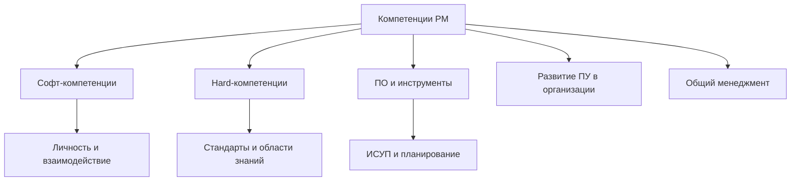

# Компетенции в управлении проектами

  ОБЯЗАТЕЛЬНО
  ДЛЯ НОВИЧКОВ

Руководителю
Аналитику

  
Теория данных (раздел 3)

  

  Миграции и оценка объёма данных — [Пакетная работа](/encyclopedia/3-data-markup/3-11-analiz-dannyh/433), [Основы БД](/encyclopedia/3-data-markup/3-05-osnovy-baz-dannyh/intro). Проверка на стенде — [SQL для тестировщика](/encyclopedia/7-project/7-05-testirovanie/129). Карта — [о разделе](./intro).
  

Материал систематизирует **карту компетенций** руководителя проекта: от личных навыков и общего менеджмента до стандартов, ИСУП и областей знаний по PMBOK. Карта пригодна для **самооценки**, плана развития, описания вакансии RPM/PM и построения программы обучения в компании.

См. также: [Основы управления IT-проектами](./1), [Роли и функции менеджмента](./12), [Квалификация команды на заказном проекте](/encyclopedia/7-project/7-13-ekonomika-proizvodstva-po/7).

---

## Как читать карту

Компетенции сгруппированы в **пять опор**, как на исходной схеме «Компетенции в управлении проектами»:

| Опора | Суть | Когда нужна сильнее всего |
|-------|------|---------------------------|
| **Софт-компетенции** | Люди, коммуникации, лидерство, переговоры | Любой проект с командой и заказчиком |
| **Hard-компетенции** | Стандарты, области знаний PM, методы планирования и контроля | Контрактные сроки, портфели, госконтракты |
| **ПО и инструменты** | MS Project, ИСУП, офисный пакет, моделирование | Масштабные планы, много подрядчиков |
| **Развитие ПУ в организации** | Зрелость, PMO, собственная методология | Корпоративный центр проектов |
| **Навыки общего менеджмента** | Финансы, право, процессы, изменения, мотивация | Руководитель на стыке «проект ↔ бизнес» |

Ниже перечислены **все темы** карты. Для каждой блока — краткое пояснение: что входит в компетенцию и зачем она PM в IT.

---

## 1. Софт-компетенции в управлении проектами

Софт-навыки определяют, **сможет ли** PM довести проект до результата при неполных требованиях, конфликтах и давлении сроков. Техническая экспертиза без них часто даёт «правильный план», который команда и заказчик не выполняют.

### 1.1. Личностные навыки

| Тема | Пояснение |
|------|-----------|
| **Эмоциональный интеллект** | Распознавание эмоций у себя и у других, регуляция реакций под стрессом релиза. Основа доверия в команде. |
| **Навыки фасилитации** | Ведение встречи так, чтобы группа сама пришла к решению: правила, таймбокс, фиксация итогов. |
| **Навыки коучинга** | Вопросы вместо директив, развитие самостоятельности тимлидов и ключевых специалистов. |
| **Власть, влияние и лидерство** | Легитимность решений без формальной «власти над кодом»: согласование, эскалации, личный пример. |
| **Управление конфликтом и стрессом** | Деэскалация, разделение позиций и интересов, профилактика выгорания. |
| **Эффективное целеполагание и целедостижение** | SMART/OKR на уровне проекта, декомпозиция целей, контроль промежуточных результатов. |
| **Управление возражениями** | Работа с сопротивлением заказчика и команды без обесценивания («да, и…», уточнение рисков). |

### 1.2. Приёмы ситуационного руководства

| Тема | Пояснение |
|------|-----------|
| **Разработка и принятие управленческих решений** | Сбор фактов, критерии выбора, фиксация решения и владельца, пересмотр при новых данных. |
| **Современные методы креативного мышления** | Мозговой штурм, SCAMPER, шесть шляп и др. — для разблокировки споров по scope и приоритетам. |

### 1.3. Навыки эффективного взаимодействия

| Тема | Пояснение |
|------|-----------|
| **Навыки аргументации** | Логика, доказательства, связь «факт → вывод → действие» в статусах и change request. |
| **Управление конфликтом** | Медиация между разработкой, QA и бизнесом; эскалация по матрице RACI. |
| **Навыки деловой презентации** | Структура «проблема — решение — эффект», работа с аудиторией C-level. |
| **Ведение переговоров** | Win-win по срокам, объёму и оплате; подготовка BATNA. См. [Как общаться с бизнесом](./113). |
| **Навыки влияния и убеждения** | Этичное влияние без манипуляций: прозрачность рисков, вовлечение стейкхолдеров. |
| **Конструктивные коммуникации в УП** | Ясные протоколы, единый глоссарий, письменное подтверждение устных договорённостей. |
| **Навыки командообразования** | Формирование правил, ритуалов (дейли, ретро), ролей. См. [Командная работа](./11). |
| **Кросс-культурные коммуникации** | Распределённые команды, часовые пояса, нормы обратной связи в международных проектах. |
| **Управление и модерация совещаний** | Повестка, таймбокс, решения и action items. См. [Ежедневные стендапы](./111). |

---

## 2. Hard-компетенции в управлении проектами

Hard-часть — **стандарты, процессы и измеримые методы** управления проектом. В IT-проектах она дополняет Agile-практики там, где контракт, бюджет или регулятор требуют формального плана и отчётности.

### 2.1. Стандарты в управлении проектами, программами и портфелями

#### Управление проектами и расширения стандартов

| Стандарт / подход | Пояснение |
|-------------------|-----------|
| **PMI PMBOK® Guide** | Базовые области знаний и процессы; общий язык с заказчиками и PMO. Обзор всех BOK — [статья 17](./17). |
| **ICB IPMA, НТК СОВНЕТ** | Компетенционный подход: оценка людей и организации, не только процессов. |
| **Национальные стандарты УП** | Локальные требования к отчётности и ролям в отрасли. |
| **P2M (Enterprise Innovation)** | Управление инновационными и R&D-проектами в крупных компаниях. |
| **ISO 21500** | Международная сводка процессов управления проектом. |
| **PRINCE2** | Роли, стадии, бизнес-кейс; часто в госсекторе и аутсорсе. |
| **Scrum / Agile** | Итерации, роли, инкремент. См. [раздел Scrum](/encyclopedia/7-project/7-14-scrum/intro). |
| **RUP** | Фазовая модель с артефактами — legacy, но встречается в крупных ERP. |
| **ГОСТ Р 54869—2011** | Российские требования к управлению проектом; стыкуется с ТЗ по ГОСТ 34. |
| **Расширения и приложения стандартов** | Отраслевые надстройки (строительство, ИТ, оборонка). |

#### Программы и портфели

| Тема | Пояснение |
|------|-----------|
| **Управление программами проектов** | Связанные проекты с общей выгодой; зависимости, общий бюджет. |
| **Управление портфелями проектов** | Приоритизация инициатив по стратегии, баланс ресурсов. |
| **ISO 9001 в управлении проектами** | Система качества: процедуры, аудиты, непрерывное улучшение. |

### 2.2. Области знаний проекта (процессы PMBOK-типа)

Каждая область — отдельная компетенция PM: планирование, исполнение, мониторинг и закрытие.

#### Управление интеграцией проекта

| Тема | Пояснение |
|------|-----------|
| **Управление изменениями** | Change request, влияние на срок/бюджет/scope, согласование baseline. |

#### Управление заинтересованными сторонами

| Тема | Пояснение |
|------|-----------|
| **Управление ожиданиями** | Явные критерии успеха, регулярная сверка «что обещали / что делаем». |
| **Вовлечённость стейкхолдеров** | Матрица влияния/интереса, план коммуникаций. |
| **Оперативная оценка участников** | Быстрая диагностика мотивации и рисков саботажа/блокировок. |

#### Управление содержанием (scope)

| Тема | Пояснение |
|------|-----------|
| **Управление требованиями** | Трассировка от бизнес-цели до тестов. См. [аналитика](/encyclopedia/7-project/7-04-analitika/intro). |
| **Декомпозиция и ИСР (WBS)** | Иерархия работ; основа оценки и контроля. См. [Оценка трудозатрат](./112). |

#### Управление сроками

| Тема | Пояснение |
|------|-----------|
| **Календарное планирование** | Сетевые графики, критический путь, резервы, baseline расписания. |

#### Управление стоимостью

| Тема | Пояснение |
|------|-----------|
| **Бюджетирование в УП** | Смета, контроль затрат, прогноз «закончить с бюджетом» (EAC). |
| **Метод освоенного объёма (EVM)** | PV, EV, AC, CPI/SPI. См. [Роли и функции менеджмента](./12). |

#### Управление качеством

| Тема | Пояснение |
|------|-----------|
| **Стандарты в области качества** | ISO 9001, отраслевые нормы. |
| **Инструментарий качества в проекте** | Чек-листы, аудиты, ПМИ, метрики дефектов. |

#### Управление человеческими ресурсами проекта

| Тема | Пояснение |
|------|-----------|
| **Мотивация команды, теория поколений** | Разные драйверы; связь с [мотивацией для руководителя](./143). |

#### Управление коммуникациями проекта

| Тема | Пояснение |
|------|-----------|
| **Деловая коммуникация в проекте** | Регламенты, шаблоны статусов, единый канал правды. |

#### Управление рисками проекта

| Тема | Пояснение |
|------|-----------|
| **Качественный анализ рисков** | Реестр, вероятность/влияние, стратегии (избежать, снизить, принять, передать). |
| **Количественный анализ рисков** | Монте-Карло, чувствительность, резервы по сроку и деньгам. |

#### Управление закупками проекта

| Тема | Пояснение |
|------|-----------|
| **Рынок закупок** | Типы контрактов, критерии выбора подрядчика. |
| **44-ФЗ** | Госзакупки: процедуры, обеспечение, отчётность. |
| **223-ФЗ** | Закупки госкорпораций и ряда юрлиц. |
| **FIDIC** | Международные условия контрактов (инфраструктура, стройка). |
| **Проектная логистика** | Поставки, склады, критичность сроков поставки для графика. |
| **Управление подрядчиками** | SLA, приёмка этапов, штрафы и эскалации. |

#### Документирование

| Тема | Пояснение |
|------|-----------|
| **Документооборот и архивирование** | Версии, доступ, хранение по контракту. |
| **Извлечённые уроки (lessons learned)** | Ретроспектива на уровне проекта для портфеля. |

---

## 3. ПО в управлении проектами

Инструменты не заменяют методологию, но **масштабируют** планирование и отчётность. PM в IT должен понимать, зачем каждый класс ПО и когда достаточно Jira + таблицы.

### 3.1. Календарно-сетевое планирование

| Инструмент | Пояснение |
|------------|-----------|
| **Microsoft Project** | Классика CPM, ресурсы, baseline; интеграция с Excel и Teams. См. [практику в энциклопедии](./16). |
| **Oracle Primavera** | Крупные стройки и промышленность; жёсткий контроль графика. |
| **Spider Project** | Отечественный планировщик; альтернатива в РФ-проектах. |

### 3.2. MS Office в управлении проектами

| Инструмент | Пояснение |
|------------|-----------|
| **Excel** | Сметы, EVM, риски, дашборды; главный «универсальный» инструмент PM. |
| **Word** | Устав, планы, протоколы, письма заказчику. |
| **PowerPoint** | Статусы для руководства, gate review. |
| **Visio** | Диаграммы процессов, органструктуры, схемы интеграций. |
| **Outlook** | Календарь, встречи, цепочки согласований. |

### 3.3. Вспомогательные программные средства

| Инструмент | Пояснение |
|------------|-----------|
| **@Risk, RiskyProject** | Вероятностное планирование и риски на графике. |
| **MindManager** | Mind map для WBS и мозговых штурмов. |
| **Project Expert** | Финансово-экономическая оценка инвестиционных проектов. |
| **Платформы ARIS** | Моделирование бизнес-процессов (BPM). |
| **IBM WebSphere Business Modeler** | BPM-модели и симуляция процессов (legacy в ряде ERP). |

### 3.4. Информационные системы управления проектами (ИСУП)

| Тема | Пояснение |
|------|-----------|
| **Современное состояние рынка ИСУП** | Обзор классов: таск-трекеры, PPM, ERP-модули. |
| **Серверные корпоративные системы хранения** | On-prem: контроль данных, интеграция с AD. |
| **«Облачные» системы хранения** | SaaS ИСУП, мобильный доступ, мультипроектность. |
| **Advanta** | Пример отечественной ИСУП/PPM-платформы. |

В IT часто **Jira / YouTrack / Azure DevOps** закрывают исполнение, а **Project / ИСУП** — портфель и контрактный график. Важно не дублировать учёт задач в двух системах без синхронизации.

---

## 4. Развитие проектного управления в организациях

Компетенции уровня **PMO и зрелости** — для руководителей направления, head of PMO и владельцев процесса УП.

| Блок | Темы | Пояснение |
|------|------|-----------|
| **Собственная методология** | Ключевые особенности создания методологии ПУ в компании | Единые шаблоны, gates, роли, связь с SDLC и контрактом. |
| **Организационная зрелость** | OPM3® (PMI), OCB (IPMA), показатели развития процессов | Диагностика «на каком уровне мы управляем проектами» и roadmap улучшений. |
| **Эффективность УП** | KPI УП, внешний аутсорсинг, ассессмент, аудит | Независимая оценка до кризиса портфеля. |
| **Проектный офис (PMO)** | Создание и развитие PMO; PMO как офис управления потребностями | От «центра отчётности» до стратегического портфеля. |
| **КСУП** | Проектирование, построение, развитие корпоративной системы УП | Политики, ИСУП, обучение, сообщество практик. |
| **Проектное и процессное управление** | PMBOK и BPM CBOK; взаимодействие архитектурного, проектного и процессного офисов | Согласование «проект изменил процесс» vs «процесс ограничил проект». |

---

## 5. Навыки общего менеджмента

PM в корпорации — **представитель проекта** перед финансами, HR, юристами и операционным блоком. Без базовых компетенций общего менеджмента сложно защитить бюджет и изменения.

### 5.1. Личная эффективность менеджера

| Тема | Пояснение |
|------|-----------|
| **Эффективная работа с информацией** | Фильтрация потока, заметки, единое хранилище решений. |
| **Управление временем и пространством** | Приоритизация, делегирование, защита глубокой работы. |

### 5.2. Организационное поведение

| Тема | Пояснение |
|------|-----------|
| **Трудовая мотивация** | Модели (Маслоу, Герцберг, SDT); связь с премиями и признанием. |
| **Индивидуальное и организационное обучение** | Обучающаяся организация; уроки проектов в базу знаний. |
| **Идентификация личности и установки** | Базовая психология для 1-on-1 без «диагнозов». |
| **Управление по компетенциям** | Матрицы компетенций, оценка, ИПР. |
| **KPI и BSC (ССП)** | Связь проекта со стратегией компании через показатели. |
| **Корпоративная культура** | Нормы, ритуалы, «как у нас принято эскалировать». См. [Культура уважения к инженерному труду](./2). |

### 5.3. Право

| Тема | Пояснение |
|------|-----------|
| **Организационные и правовые документы** | Устав проекта, договор, NDA, акты. |
| **Безопасность** | Требования ИБ в контракте и приёмке. |
| **Основы лицензирования** | ПО, СУБД, открытые лицензии в поставке. |
| **Авторские права и права на разработку** | Кому принадлежит код и документация по договору. |

### 5.4. Операционный менеджмент

| Тема | Пояснение |
|------|-----------|
| **Описание и оптимизация бизнес-процессов** | [BPMN](/encyclopedia/7-project/7-04-analitika/1231), AS-IS / TO-BE; стык с [цифровой трансформацией](./3). |
| **Организационные структуры** | Функциональная, проектная, матричная модель. |
| **Планирование деятельности подразделений** | Загрузка ресурсов вне одного проекта. |

### 5.5. Управление изменениями

| Тема | Пояснение |
|------|-----------|
| **Сопротивление изменениям** | ADKAR, работа с «потерями» при внедрении системы. |
| **Антикризисное управление** | План восстановления, коммуникации при срыве релиза. |

### 5.6. Финансы

| Тема | Пояснение |
|------|-----------|
| **Оценка инвестиций, дисконтирование** | NPV, IRR, payback — обоснование проекта для совета директоров. |
| **Финансовое планирование и бюджетный процесс** | Статьи бюджета, кассовый разрыв, прогноз. |
| **Основы бухгалтерского учёта** | Чтение отчётности, различие «начислено» и «оплачено». |

---

## Как использовать карту на практике

### Самооценка (шаблон)

Оцените каждую **опору** по шкале 1–5 (1 — не знаком, 5 — могу обучать других):

1. Софт-компетенции  
2. Hard-компетенции (особенно области, критичные для ваших проектов)  
3. ПО и ИСУП  
4. Развитие ПУ (если релевантно роли)  
5. Общий менеджмент  

Зоны с оценкой **≤ 2** — кандидаты в ИПР на квартал; зоны **≥ 4** — можно делегировать менторство junior PM.

### Связь с ролями в IT

| Роль | На что смотреть в первую очередь |
|------|----------------------------------|
| **Junior PM** | Документирование, коммуникации, требования, риски (качественно), Excel |
| **PM контрактного проекта** | Scope, сроки, EVM, закупки, ГОСТ/44-ФЗ, переговоры |
| **RPM / PMO** | Портфель, зрелость, PMO, методология, KPI |
| **Тимлид с матрицей** | Софт-компетенции + HR проекта; hard — через RPM |

Подробнее про роли на заказной разработке — [глава про квалификацию команды](/encyclopedia/7-project/7-13-ekonomika-proizvodstva-po/7).

---

## Связанные материалы

| Тема | Статья |
|------|--------|
| Базовый цикл проекта | [Основы управления IT-проектами](./1) |
| Метрики и EVM | [Роли и функции менеджмента](./12) |
| Команда и мотивация | [Управление разработчиками](./13), [Мотивация](./143) |
| Методологии | [Жизненный цикл ПО](/encyclopedia/7-project/7-03-metodologiya-i-zhiznennyy-tsikl-po/intro) |
| Экономика и роли | [Экономика производства ПО](/encyclopedia/7-project/7-13-ekonomika-proizvodstva-po/intro) |

---

  
Источник карты

  

  Структура тем соответствует корпоративной карте компетенций в управлении проектами (библиотека SRM). В энциклопедии темы сгруппированы и дополнены пояснениями для IT-контекста; детальные курсы по каждому инструменту и стандарту вынесены в профильные разделы энциклопедии.
  

