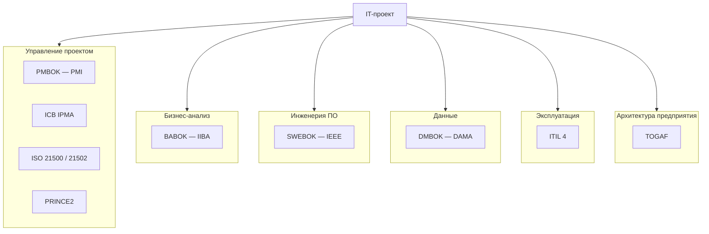

# BOK, PMBOK и прочие "бабоки"

  ОБЯЗАТЕЛЬНО
  ДЛЯ НОВИЧКОВ

Руководителю
Аналитику

  
Теория данных (раздел 3)

  

  Миграции и оценка объёма данных — [Пакетная работа](/encyclopedia/3-data-markup/3-11-analiz-dannyh/433), [Основы БД](/encyclopedia/3-data-markup/3-05-osnovy-baz-dannyh/intro). Проверка на стенде — [SQL для тестировщика](/encyclopedia/7-project/7-05-testirovanie/129). Карта — [о разделе](./intro).
  

В переписке и на собеседованиях всплывают **PMBOK**, **BABOK**, **SWEBOK**, иногда **DMBOK**, **ITIL**, **TOGAF** — и все их любовно называют "бабоками". Формально это **Body of Knowledge (BoK)** — *свод знаний*: не закон и не методология "из коробки", а **согласованный словарь и карта компетенций** профессии.

См. также: [Компетенции PM](./15), [Основы управления IT-проектами](./1), [Microsoft Project](./16), [BABOK в аналитике](/encyclopedia/7-project/7-04-analitika/112), [SWEBOK и конструирование](/encyclopedia/7-project/7-12-konstruirovanie-po/1), [ITIL](/encyclopedia/7-project/7-16-itsm-i-it-uslugi/3).

---

## Зачем вообще существуют BOK

| Задача | Как помогает свод знаний |
|--------|---------------------------|
| **Общий язык** | PM, BA и архитектор говорят об одних и тех же областях (риски, scope, требования). |
| **Обучение и сертификация** | Программы PMP, CBAP, IPMA Level привязаны к перечню тем. |
| **Зрелость организации** | PMO и аудит сверяют процессы с эталоном, а не с "как у Васи в прошлом году". |
| **Контракты и тендеры** | "Управление по PMBOK / ГОСТ" — юридически понятная отсылка к практикам. |

BOK **не заменяет** Scrum, Kanban или ваш внутренний регламент. Это **справочник** — что учитывать, когда пишете план, ТЗ или политику change request. Agile и Waterfall **укладываются** в те же области (сроки, стейкхолдеры, качество) — меняется ритм, не суть.

---

## Карта "бабок" по ролям в IT

| Сокращение | Полное название | Кто издаёт | Для кого в IT |
|------------|-----------------|------------|---------------|
| **PMBOK®** | A Guide to the Project Management Body of Knowledge | PMI | РП, PMO, заказчик на Fixed Price |
| **BABOK®** | Business Analysis Body of Knowledge | IIBA | Бизнес- и системные аналитики |
| **SWEBOK** | Guide to the Software Engineering Body of Knowledge | IEEE Computer Society | Разработка, тест, конструирование |
| **DMBOK** | Data Management Body of Knowledge | DAMA International | Data owner, архитектор данных, MDM |
| **ICB** | Individual Competence Baseline | IPMA | Оценка **компетенций** PM (не только процессов) |
| **ISO 21500 / 21502** | Управление проектом / программами | ISO | Нейтральный международный процессный слой |
| **PRINCE2** | Projects IN Controlled Environments | PeopleCert / Axelos | Метод с ролями и стадиями; часто госсектор |
| **ITIL 4** | IT Service Management practices | Axelos | Поддержка, SLA, инциденты после go-live |
| **TOGAF** | The Open Group Architecture Framework | The Open Group | Корпоративная и solution-архитектура |
| **ГОСТ Р 54869** | Проектный менеджмент (РФ) | Росстандарт | Госконтракты, стык с ГОСТ 34 на ТЗ |

Рядом, но **не BOK** в узком смысле — **Scrum Guide**, **SAFe**, **Kanban Guide**, **ISTQB** (силлабусы по тестированию), **CMMI** — это методы, модели зрелости или программы обучения, а не полные своды знаний профессии.

---

## PMBOK® Guide — главная "бабока" PM

**PMI** (Project Management Institute) публикует **PMBOK® Guide**. В [основах управления проектами](./1) уже используется определение проекта из этой линии: **временное предприятие** с уникальным результатом.

### Что внутри (логика, а не заучивание)

Исторически (издание **6**, ещё часто встречается в курсах и тендерах) знания группировали так:

**Пять групп процессов:** инициация → планирование → исполнение → мониторинг и контроль → закрытие.

**Десять областей знаний** (каждая — отдельный "рычаг" PM):

| Область | Суть в IT-проекте |
|---------|-------------------|
| Интеграция | Сводный план, change request, согласование baseline |
| Scope / содержание | WBS, границы релиза, "не делаем в этой фазе" |
| Schedule | График, критический путь — см. [MS Project](./16) |
| Cost | Бюджет, EVM — см. [менеджмент](./12) |
| Quality | Критерии приёмки, ПМИ, метрики дефектов |
| Resources | Команда, подрядчики, загрузка |
| Communications | Статусы, протоколы, эскалации |
| Risk | Реестр рисков, резервы |
| Procurement | Подряд, лицензии, аутстафф |
| Stakeholders | Ожидания, вовлечённость |

В издании **7** (2021) PMI сместил акцент — вместо матрицы "процесс × область" — **12 принципов** (ответственность, ценность, системное мышление, лидерство и др.) и **8 доменов эффективности** (stakeholders, team, development approach, planning, delivery, uncertainty и др.). Смысл тот же: **планируй → делай → измеряй → корректируй**, но формулировки ближе к гибридным и agile-проектам.

<b>PMBOK 6 vs 7 — что помнить на практике</b>

| | PMBOK 6 | PMBOK 7 |
|---|---------|---------|
| Структура | 10 областей × 5 групп процессов | 12 принципов + 8 performance domains |
| Процессы | Именованные процессы (например, "Identify Risks") | Менее процедурный, больше "как думать" |
| Agile | Отдельный **Agile Practice Guide** (с 6-м) | Встроен в домены (tailoring) |
| Экзамен PMP | Переходный период; вопросы на оба подхода | Акцент на принципы и ситуации |

На собеседовании и в договоре чаще ссылаются на **"области знаний PMBOK"** (язык 6-го) — имеет смысл знать обе рамки.

### Связанные стандарты PMI (не только PMBOK)

| Документ | Уровень |
|----------|---------|
| **The Standard for Project Management** | Ядро вместе с PMBOK 7 |
| Управление **программами** | Несколько связанных проектов, общая выгода |
| Управление **портфелем** | Приоритизация инициатив по стратегии |
| **OPM3 / организационная зрелость** | Насколько зрело УП в компании |

В IT один продуктовый релиз — **проект**; линейка микросервисов на год — **программа**; все инициативы CTO — **портфель**.

---

## IPMA: не "вторая бабока", а компетенции

**IPMA** (International Project Management Association) продвигает **ICB** (Individual Competence Baseline) и оценку по уровням **A / B / C / D**.$1это другой угол:

| PMBOK (PMI) | IPMA (ICB) |
|-------------|------------|
| Что делать в проекте (процессы, артефакты) | Каким должен быть **человек** и **организация** |
| PMP — экзамен по гайду | Сертификация через оценку опыта + компетенций |
| Сильнее в США и глобальном аутсорсе | Сильнее в Европе; в РФ — **СОВНЕТ** (национальная ассоциация) |

На крупных ERP и инфраструктурных проектах оба подхода **стыкуются**: PMBOK даёт чек-лист артефактов, IPMA — язык для развития PM и PMO.

---

## PRINCE2 и ISO 21500 — "родственники" PMBOK

| | PRINCE2 | ISO 21500 / 21502 |
|---|---------|-------------------|
| Тип | **Метод** (роли, стадии, business case) | **Стандарт-процесс** (нейтральный) |
| Роли | Project Board, PM, Team Manager | Не навязывает роли |
| Где в IT | Госсектор, UK-наследие, часть аутсорса | Ссылки в тендерах "по ISO" |
| Связь с PMBOK | Пересечение по scope, рискам, качеству | Близкий процессный слой к PMBOK 6 |

**PRINCE2** не отменяет agile: внедрение делают **гибридом** (стадии + спринты). Подробнее о методологиях — [SDLC и фреймворки](/encyclopedia/7-project/7-03-metodologiya-i-zhiznennyy-tsikl-po/1).

---

## BABOK® — "бабока" аналитика

**IIBA** издаёт **BABOK Guide** (сейчас v3) — шесть **концептов** (change, need, solution, value, stakeholder, context) и шесть **областей знаний** — от планирования BA до оценки решения.

| Область BABOK | Пересечение с PMBOK |
|---------------|---------------------|
| Планирование и мониторинг BA | Communications, Stakeholders |
| Выявление и согласование | Scope, Requirements |
| Оценка решения | Quality, Delivery |
| Управление требованиями | Scope, Change |

В энциклопедии BABOK разобран в [профессиональной аналитике](/encyclopedia/7-project/7-04-analitika/112), [инструментах](/encyclopedia/7-project/7-04-analitika/126) и FAQ [Аналитика — итоги](/encyclopedia/7-project/7-04-analitika/998). **CBAP / CCBA** — сертификации IIBA по BABOK.

**Важно:** BABOK не учит писать SQL; он учит **как не потерять ценность** между "хотелкой" бизнеса и backlog разработки.

---

## SWEBOK — инженерия ПО

**SWEBOK** (IEEE) описывает **knowledge areas** программной инженерии — требования, дизайн, **construction**, тестирование, сопровождение, конфигурация, качество, инженерия процессов и др.

В энциклопедии опора на SWEBOK — в разделе [Конструирование ПО](/encyclopedia/7-project/7-12-konstruirovanie-po/intro): граница "проектирование ↔ код ↔ тест" и дисциплина **Software Construction**.

| SWEBOK | PMBOK | BABOK |
|--------|-------|-------|
| Как **строить** систему | Как **вести** проект к сроку и бюджету | Как **понять и зафиксировать** потребность |
| Для разработчиков, QA, архитекторов | Для PM / РП | Для BA |

---

## DMBOK, ITIL, TOGAF — соседние "своды"

Их тоже иногда путают с PMBOK, но фокус другой:

| Свод / фреймворк | Фокус | Момент в жизни IT-системы |
|------------------|--------|---------------------------|
| **DMBOK** | Управление данными: качество, MDM, метаданные, governance | ERP, отчётность, миграции, GDPR |
| **ITIL 4** | ИТ-**услуги**: инциденты, изменения, каталог, SLA | После ввода в эксплуатацию — [ITSM](/encyclopedia/7-project/7-16-itsm-i-it-uslugi/intro) |
| **TOGAF ADM** | Архитектура предприятия: as-is / to-be, roadmap | До и во время крупных трансформаций |

Проект по внедрению CRM **заканчивается** сдачей (PMBOK); **эксплуатация** идёт по ITIL; **мастер-данные** клиентов — по DMBOK; **ландшафт** из 50 систем — по TOGAF.

---

## Российский контекст: ГОСТ и не только

| Документ | Назначение |
|----------|------------|
| **ГОСТ Р 54869—2011** | Управление проектом (процессы, роли) |
| **ГОСТ 34** | Жизненный цикл автоматизированных систем, ТЗ, ПМИ |
| **ГОСТ Р ИСО 21500** | Российское принятие ISO по УП |

На ERP и госконтрактах часто пишут: "в соответствии с ГОСТ 34 и PMBOK" — это **не противоречие**: 34 — **артефакты и этапы АС**, PMBOK — **управленческие процессы**. Разбор — [внедрение ERP](/encyclopedia/7-project/7-15-vnedrenie-erp-sistem/3), FAQ [Внедрение ERP — итоги и шпаргалка](/encyclopedia/7-project/7-15-vnedrenie-erp-sistem/998).

---

## Как "бабоки" стыкуются на одном IT-проекте

Упрощённая цепочка:

1. **TOGAF / архитектура** — куда вписывается система в ландшафт (если проект крупный).
2. **BABOK** — требования, ценность, стейкхолдеры.
3. **PMBOK + PRINCE2/ГОСТ** — план, риски, бюджет, change, приёмка.
4. **SWEBOK** — проектирование, разработка, тест, релиз.
5. **DMBOK** — модель данных, миграция, качество данных.
6. **ITIL** — поддержка и SLA после go-live.

На **стартапе из пяти человек** не нужны все своды сразу: достаточно backlog, Definition of Done и устных договорённостей. На **контракте на 200 млн ₽** заказчик **ожидает** язык PMBOK/ГОСТ в плане и отчётах.

---

## Сертификации: что за чем идёт

| Сертификат | Свод / основа | Кому |
|------------|---------------|------|
| **CAPM** | PMBOK, входной уровень | Начинающий PM |
| **PMP** | PMBOK 6/7 + опыт | Опытный PM |
| **PMI-ACP** | Agile Practice Guide | Гибридные проекты |
| **IPMA Level D→A** | ICB | По уровню ответственности |
| **PRINCE2 Foundation / Practitioner** | PRINCE2 | Метод, Европа/госсектор |
| **CBAP / CCBA** | BABOK | Бизнес-аналитик |
| **ITIL Foundation** | ITIL 4 | Поддержка, service manager |

Сертификат **не равен** умению вести проект: он проверяет знание **рамки**. Опыт и [софт-навыки](./15) решают, сработает ли план в вашей компании.

---

## Типичные заблуждения

1. **"PMBOK = Waterfall"** — нет; в 7-м издании явно **tailoring** под agile, kanban, гибриды.
2. **"Нужно выучить все бабоки"** — нет; выберите 1–2 свода под роль + знайте, **кто за что** в соседних областях.
3. **"BABOK только для банков"** — нет; любой продукт с бизнес-заказчиком.
4. **"ITIL заменяет PM"** — нет; ITIL — **эксплуатация услуги**, не разработка с нуля.
5. **"Сертификат PMP = гарантия сроков"** — нет; гарантия даётся **договором и дисциплиной**, не бумажкой.

---

## Что читать в первую очередь

| Роль | Старт | Углубление |
|------|-------|------------|
| **PM / РП** | PMBOK (обзор областей) + [компетенции](./15) | [MS Project](./16), PRINCE2 или ГОСТ под контракт |
| **BA** | [BABOK в 7-04](/encyclopedia/7-project/7-04-analitika/intro) | Требования, трассировка, [общение с бизнесом](./113) |
| **Тимлид / техлид** | SWEBOK (construction, quality) + Scrum Guide | [SDLC](/encyclopedia/7-project/7-03-metodologiya-i-zhiznennyy-tsikl-po/1) |
| **Support / SM** | ITIL Foundation | [раздел ITSM](/encyclopedia/7-project/7-16-itsm-i-it-uslugi/intro) |
| **Архитектор** | TOGAF (ADM) + BABOK (контекст) | [проектирование](/encyclopedia/7-project/7-06-proektirovanie-i-arhitektura/intro) |

Официальные издания — платные (PMI, IIBA, Axelos); в компаниях часто есть корпоративная библиотека. Для **общего языка** в команде достаточно **одностраничных шпаргалок** по областям PMBOK и глоссария из [статьи 1](./1).

---

## Кратко

**"Бабоки"** — это **карты местности** для разных ролей — PMBOK для сроков и рисков, BABOK для требований и ценности, SWEBOK для инженерии, DMBOK для данных, ITIL для эксплуатации. В IT-проекте они **пересекаются**, а не конкурируют. Выберите свод под свою роль, знайте соседние — и используйте стандарты как **словарь и чек-лист**, а не как замену здравому смыслу и разговору с командой.
