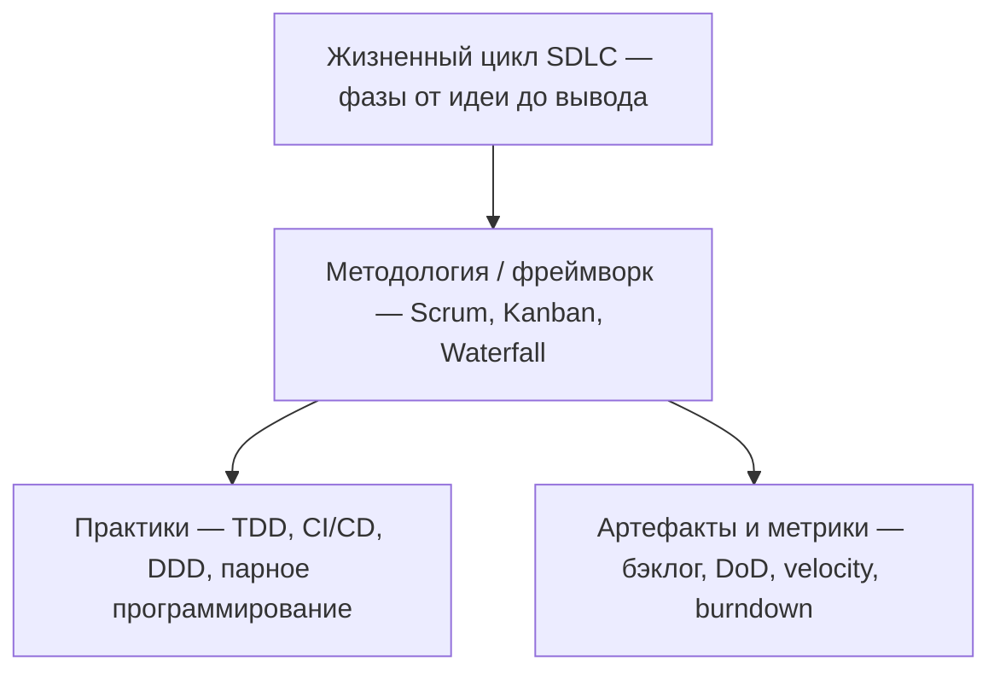
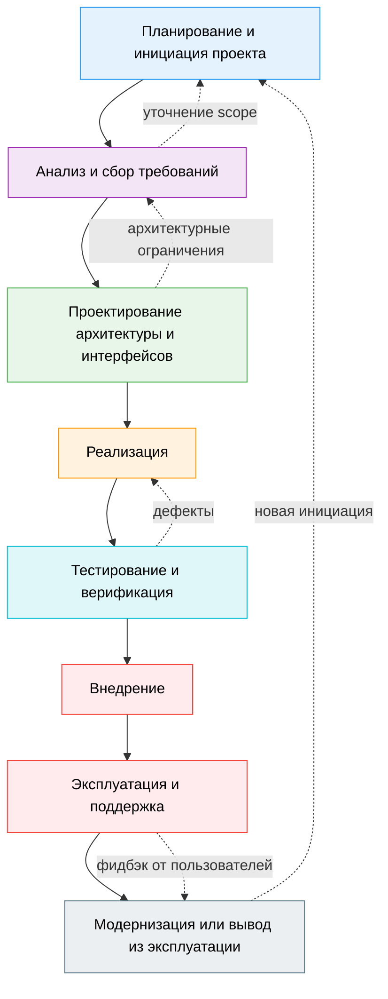
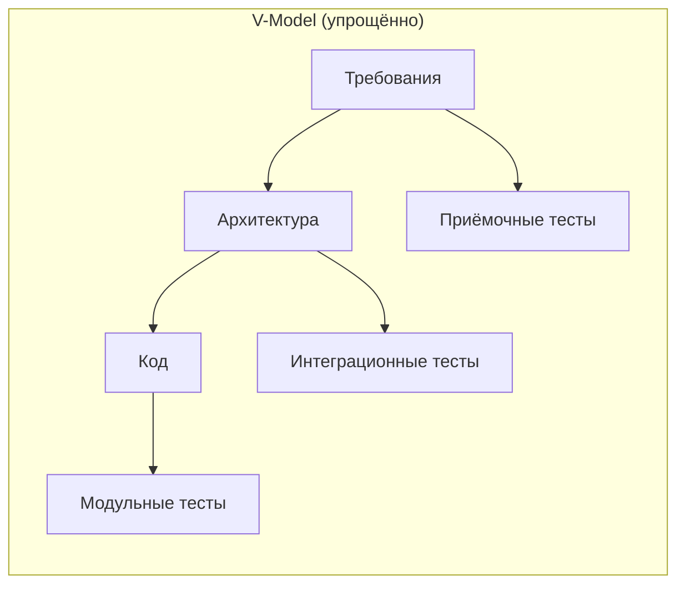
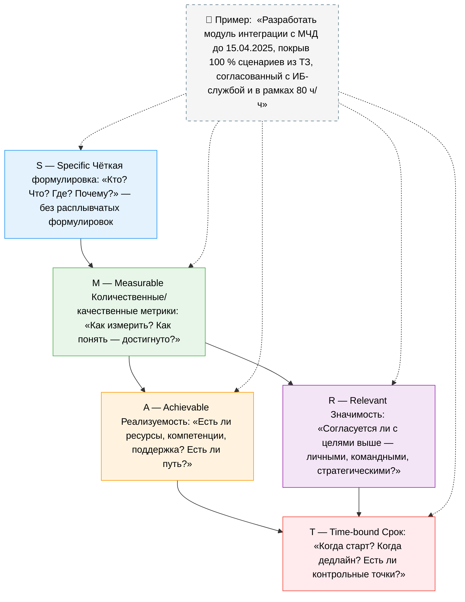
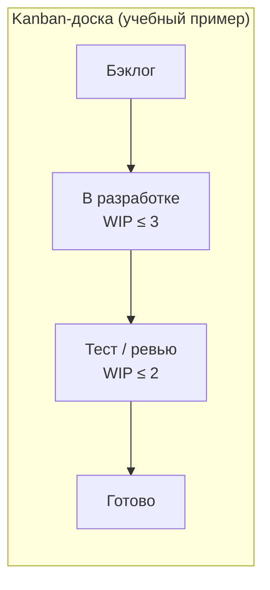

import SoftwareLifecycleDemo from '@site/src/components/SoftwareLifecycleDemo.jsx';
import CicdDemo from '@site/src/components/CicdDemo.jsx';

# Жизненный цикл программного обеспечения

<div class="article-tags">
  <span class="tag tag-required">ОБЯЗАТЕЛЬНО</span>
  <span class="tag tag-beginner">ДЛЯ НОВИЧКОВ</span>
</div>

<span class="complexity-badge">Руководителю</span>
<span class="complexity-badge">Аналитику</span>
<span class="complexity-badge">Техническому писателю</span>

## Жизненный цикл программного обеспечения

**Методология** — ответ на вопрос «как мы будем делать?»: в каком порядке, как часто, кто за что отвечает и что делать, когда что-то пошло не так. Без общих правил команда, заказчик и эксплуатация часто тянут в разные стороны: сроки сдвигаются, изменения воспринимаются как катастрофа, а не как часть процесса. С согласованной методологией появляются предсказуемость, прозрачность и механизм работы с изменениями.

В этом разделе:

- **[Методологии разработки государственных ИТ-систем](./2)** — регуляторика, ТЗ как юридический акт, приёмка и «два мира» подрядчика.
- **[Итоги](./998)** — краткое сравнение Waterfall, Agile, Scrum и Kanban.
- **[Чек-лист самопроверки](./999)** — диагностика: совпадает ли заявленный процесс с реальным.

Условно выделяют два полюса:

- **Waterfall** — последовательные фазы: требования → проектирование → реализация → тестирование → внедрение; изменения дороги и формализованы.
- **Agile** — короткие циклы, инкременты, обратная связь; план уточняется по мере появления информации.

На практике чаще встречаются **гибриды** (Water-Scrum-Fall, Scrumban), особенно в госсекторе — подробнее в конце главы и в отдельной статье про ГИС.

### Словарь раздела

| Термин | Смысл |
|--------|--------|
| **SDLC** (Software Development Life Cycle) | Полный путь продукта: от идеи до вывода из эксплуатации |
| **Методология** | Принципы, роли, артефакты и ритм работы команды |
| **Фреймворк** | Конкретизация Agile (Scrum, Kanban, SAFe) |
| **Инженерная практика** | TDD, code review, парное программирование — не заменяет методологию, но усиливает её |
| **Инкремент** | Часть продукта, потенциально готовая к поставке |
| **Бэклог** | Приоритизированный список работ и требований |
| **WIP** (Work In Progress) | Лимит незавершённых задач в Kanban |
| **DoD** (Definition of Done) | Критерии «готово» для задачи или инкремента |
| **DoR** (Definition of Ready) | Критерии «можно брать в работу» |
| **Верификация** | «Строим ли правильно?» — соответствие спецификации и тестам |
| **Валидация** | «Строим ли то, что нужно?» — ценность для пользователя и бизнеса |

### Уровни понятий (чтобы не путать)



**CI/CD** в этой главе рассматривается как **практика доставки** внутри DevOps, а не отдельная «методология жизненного цикла». В справочной таблице ниже встречаются и управленческие инструменты (OKR, RACI, PRINCE2) — они дополняют SDLC, но не заменяют выбор Scrum или Waterfall.

---

Методология разработки программного обеспечения опирается на **жизненный цикл программного обеспечения** (Software Development Life Cycle, **SDLC**) — систематическую модель этапов от идеи до вывода из эксплуатации.

<SoftwareLifecycleDemo />

<div class="callout callout--info">
  <div class="callout-title">SDLC и методология — разные уровни</div>
  <p><strong>SDLC</strong> отвечает на вопрос «какие фазы проходит продукт» (требования, проектирование, код, тесты, эксплуатация). <strong>Методология</strong> (Waterfall, Scrum, Kanban) — «как команда организует эти фазы»: последовательно, спринтами или потоком задач. Одни и те же фазы SDLC можно пройти по-разному.</p>
</div>

Жизненный цикл ПО помогает разбить сложный процесс на **управляемые фазы** с целями, артефактами, критериями завершения и ролями. Формализация цикла повышает предсказуемость, контроль качества и управление рисками.

Конкретная реализация зависит от методологии, но **набор фаз** в большинстве моделей узнаваем. Отличаются последовательность, перекрытие этапов и частота обратной связи.

---

### Фазы жизненного цикла ПО

В обобщённой модели жизненный цикл ПО состоит из следующих фаз:

1. **Планирование и инициация проекта**  
2. **Анализ и сбор требований**  
3. **Проектирование архитектуры и интерфейсов**  
4. **Реализация (разработка)**  
5. **Тестирование и верификация**  
6. **Внедрение (деплой)**  
7. **Эксплуатация и поддержка**  
8. **Модернизация или вывод из эксплуатации**



Эти фазы не всегда строго линейны. В итеративных и инкрементальных моделях они могут выполняться **параллельно**, **циклически** или **с перекрытием**. Например, в Scrum-проекте сбор требований и проектирование происходят в каждом спринте для конкретного инкремента, тогда как в Waterfall каждая фаза завершается перед началом следующей.

### Модели жизненного цикла (теория)

Одни и те же фазы SDLC можно организовать по-разному:

| Модель | Суть | Когда уместна |
|--------|------|----------------|
| **Waterfall** | Строгая последовательность фаз | Стабильные требования, регуляторика, контракт с фиксированным объёмом |
| **V-Model** | Каждой фазе проектирования соответствует фаза тестирования | Критичные системы (медицина, оборона, ГИС с формальной ПМИ) |
| **Итеративная / инкрементальная** | Повторение циклов «проектирование → сборка → оценка» | Продукты с уточняющейся обратной связью |
| **Спиральная (Boehm)** | Циклы с явной оценкой рисков и прототипами | Крупные проекты с высокой неопределённостью и риском |
| **Agile-фреймворки** | Короткие поставки ценности поверх SDLC | Быстро меняющийся рынок, цифровые продукты |



### Верификация и валидация

На всех этапах SDLC полезно различать:

- **Верификация** — проверка соответствия артефактам: ТЗ, контракту, тест-кейсам, стандартам ИБ («собрали по спецификации»).
- **Валидация** — проверка, что продукт решает задачу пользователя и бизнеса («собрали то, что нужно»).

В Waterfall верификация часто доминирует на финальных этапах; в Agile валидация встроена в **Sprint Review** и работу с заказчиком. Зрелый процесс сочетает оба типа проверок в каждом инкременте.

---

### Проект как управляющая единица жизненного цикла

Ключевым контекстом, в котором разворачивается жизненный цикл ПО, является **проект**. В управлении проектами под проектом понимается **временная инициатива**, направленная на создание уникального продукта, услуги или результата. В отличие от операционной деятельности, проект имеет чёткие границы по времени, ресурсам и содержанию.

Успешный проект должен обладать следующими характеристиками:

- **Определённая цель** — конечный результат, который должен быть достигнут;
- **Ограниченный срок** — проект начинается и завершается;
- **Уникальность** — результат проекта отличается от предыдущих продуктов;
- **Ограниченные ресурсы** — бюджет, персонал, инфраструктура;
- **Риски и неопределённость** — необходимость управления неизвестными факторами.

Для формулировки и контроля целей проекта широко используется методология **SMART** — система критериев, обеспечивающая конкретность и измеримость задач:

- **S** (Specific) — цель должна быть чёткой и конкретной, а не расплывчатой;
- **M** (Measurable) — должен существовать способ измерения прогресса и результата;
- **A** (Achievable) — цель должна быть достижимой при имеющихся ресурсах;
- **R** (Relevant) — цель должна быть значимой и соответствовать стратегическим интересам;
- **T** (Time-bound) — должна быть определена временная граница достижения.



Например, вместо цели «улучшить интерфейс приложения» SMART-формулировка будет звучать как: «Снизить среднее время завершения ключевой пользовательской операции с 45 до 20 секунд к концу Q3 2025 года, измеряя по данным A/B-тестирования на 10 000 активных пользователях».

---

### Релизный цикл

Внутри жизненного цикла ПО выделяют **релизный цикл** — последовательность операций, направленных на выпуск новой версии программного обеспечения. Релиз — это **управляемый процесс**, включающий технические, организационные и коммуникационные аспекты.

Стандартно релизный цикл включает следующие этапы:

1. **Планирование релиза** — определение содержания релиза (какие фичи, исправления, улучшения входят), установление даты выпуска, координация с маркетингом, поддержкой и инфраструктурой.
2. **Разработка** — реализация функциональности, написание кода, интеграция компонентов.
3. **Отладка** — выявление и устранение ошибок в процессе разработки и на ранних стадиях тестирования.
4. **Тестирование** — систематическая верификация и валидация продукта: модульное, интеграционное, системное, приёмочное, нагрузочное и регрессионное тестирование.
5. **Деплой (внедрение)** — развертывание новой версии в production-среде: может включать сине-зелёные развёртывания, канареечные релизы, пошагенные обновления.
6. **Поддержка** — мониторинг стабильности, обработка инцидентов, выпуск патчей, сбор обратной связи для следующего цикла.

В современных практиках эти этапы **не являются строго последовательными**. Благодаря автоматизации (CI/CD), тестирование может происходить параллельно с разработкой, а деплой — происходить несколько раз в день. Тем не менее, логическая последовательность сохраняется: невозможно тестировать то, что не реализовано; невозможно внедрить то, что не прошло проверку.

---

### Роли и зоны ответственности в команде разработки

Эффективное управление жизненным циклом невозможно без чёткого распределения ролей. Современная команда разработки — это **междисциплинарная система**, в которой каждая роль вносит вклад в общий результат, но обладает собственной зоной компетенции и ответственности.

- **Product Owner** — ответственный за **ценность продукта**. Определяет, что должно быть построено, на основе потребностей пользователей, бизнеса и рыночных условий. Формирует и приоритизирует продуктовый бэклог. Не управляет командой напрямую, но управляет **контекстом** её работы.
  
- **Scrum Master** — фасилитатор процесса. Обеспечивает соблюдение практик Scrum, устраняет организационные препятствия, защищает команду от внешних помех, способствует улучшению внутренней динамики. Не является менеджером проекта в традиционном смысле.

- **Разработчик (Developer)** — пишет код и участвует в проектировании, тестировании, рефакторинге и оценке задач. В Agile-командах ожидается **полнокомплектная ответственность** за инкремент, а не только за написание функций.

- **QA Engineer (Quality Assurance Engineer)** — специалист по обеспечению качества. Разрабатывает тест-кейсы, автоматизирует проверки, участвует в определении критериев готовности (Definition of Done), выявляет дефекты и риски. QA встраивается в процесс с самого начала.

- **DevOps Engineer** — обеспечивает **непрерывную доставку и эксплуатацию**. Настраивает CI/CD-пайплайны, управляет инфраструктурой как кодом (IaC), обеспечивает мониторинг, логирование, безопасность развёртываний. Служит мостом между разработкой и эксплуатацией.

- **Дизайнер (UI/UX Designer)** — формирует пользовательский опыт. Проводит исследования, создаёт прототипы, проектирует интерфейсы, участвует в тестировании удобства использования. Работает в тесной связке с Product Owner и разработчиками.

Важно: в небольших командах функции могут совмещаться (например, разработчик пишет автоматизированные тесты, а Product Owner сам создаёт макеты), но **логические границы ответственности** сохраняются. Успешная команда — та, в которой каждый понимает, **за что он отвечает**, и где отсутствуют «серые зоны».

---

### Принципы организации жизненного цикла

Помимо выбора методологии и распределения ролей, жизненный цикл ПО строится на ряде **фундаментальных принципов**, обеспечивающих его устойчивость и эффективность:

- **Принцип инкрементальности** — продукт создаётся по частям, каждая из которых приносит измеримую ценность. Это снижает риск и позволяет получать обратную связь на ранних этапах.
  
- **Принцип обратной связи** — регулярное получение данных от пользователей, заказчиков и системы мониторинга позволяет корректировать курс без катастрофических затрат.

- **Принцип автоматизации** — повторяющиеся операции (сборка, тестирование, деплой) должны быть автоматизированы для повышения скорости, надёжности и воспроизводимости.

- **Принцип прозрачности** — состояние проекта, прогресс, риски и проблемы должны быть видимы всем заинтересованным сторонам.

- **Принцип минимализма (KISS — Keep It Simple)** — простота проектирования и реализации снижает сложность, уменьшает количество ошибок и упрощает поддержку. Это подчёркивает ценность **элегантного и достаточного** решения.

- **Принцип ответственности за результат** — команда несёт ответственность за **доставленную ценность**. Это смещает фокус с активности на результат.

---

### Теоретические рамки принятия решений

Выбор методологии и стратегии управления жизненным циклом не всегда является техническим решением — часто он определяется **характером задачи** и **степенью неопределённости**. Ниже — модели, которые помогают не навешивать «Scrum на всё подряд».

#### Матрица Stacey (простота задачи × согласие стейкхолдеров)

| | **Высокое согласие** | **Низкое согласие** |
|--|----------------------|---------------------|
| **Простая задача** | Планирование, регламент, Waterfall | Переговоры, согласование требований |
| **Сложная задача** | Экспертиза, итерации | Эксперименты, Agile, прототипы |

Если требования и цели ещё не согласованы, формальный Waterfall с полным ТЗ на старте часто создаёт иллюзию контроля.

#### Cynefin (Dave Snowden)

**Cynefin** (произносится примерно как «кэ-нев-ин») — модель контекстов принятия решений:

- **Clear** (ранее Obvious) — «лучшая практика»: причины и следствия ясны, применяют стандарты и регламенты.
- **Complicated** — «хорошая практика»: нужны эксперты и анализ (архитектура, итеративное проектирование).
- **Complex** — «пробуем и учимся»: связи видны задним числом; уместны Agile, короткие эксперименты, MVP *в среде, где это допустимо*.
- **Chaotic** — «действуем, чтобы стабилизировать»: инциденты, аварии; сначала порядок, потом анализ.
- **Confusion / Disorder** — неясно, в каком домене задача; нужна декомпозиция и уточнение.

Ошибка зрелости процесса — применять процедуры домена **Clear** к задаче из **Complex** (бюрократия вместо обучения).

#### Цель → стратегия → тактика (процесс)

Методология (Scrum, Kanban, этапы по ГОСТ 34) — **тактический** уровень. Она должна опираться на **стратегию** продукта или программы (дорожная карта, KPI, OKR) и **цель** (зачем система существует). Иначе команда оптимизирует скорость закрытия задач, а не ценность — типичный признак «Agile в названии».

Для формализации процессов в крупных организациях используют **ISO/IEC 12207** (процессы жизненного цикла ПО) и отраслевые рамки вроде **ГОСТ 34** в госсекторе — они не заменяют Scrum, но задают, *какие* процессы должны быть доказуемы при проверке.

Для **систем в целом** (аппаратура, ПО, персонал, эксплуатация) параллельно смотрят **ISO/IEC 15288** (*Systems and software engineering — System life cycle processes*): интеграция, верификация и валидация на уровне **комплекса**, а не только репозитория. Связка с заказной разработкой и приёмкой — в маршруте [Экономика производства ПО](/encyclopedia/7-project/7-13-ekonomika-proizvodstva-po/intro) (гл. 1.1 курса).

**Вывод:** универсальной методологии нет. Выбор подхода должен быть **контекстуальным**, а не догматическим. Для государственных систем контекст регуляторики описан в **[отдельной главе](./2)**.

## Гибридные модели

На практике чистые формы методологий встречаются редко. Организации чаще сталкиваются с **многоуровневой неопределённостью**: часть требований стабильна и регламентирована (например, законодательные ограничения), тогда как другая — динамична и требует быстрой адаптации (например, пользовательские предпочтения). В таких условиях возникают **гибридные модели**, сочетающие элементы предиктивных и адаптивных подходов.

Типичный пример — **Water-Scrum-Fall**: начальная фаза проекта выполняется по водопадной модели (анализ требований, архитектурное проектирование, утверждение бюджета), за которой следует итеративная разработка по Scrum, а завершается всё жёсткой приёмкой и развёртыванием, как в классическом Waterfall. Такой подход часто встречается в государственных контрактах или в проектах с внешними поставщиками, где юридически необходимо чётко зафиксировать объём работ до начала исполнения — см. **[Методологии разработки государственных ИТ-систем](./2)**.

Другой распространённый гибрид — **Scrumban**, упомянутый ранее, но заслуживающий более глубокого рассмотрения. Он возникает, когда Scrum-команда сталкивается с потоком непредсказуемых задач (например, исправление критических багов, поддержка legacy-системы) и не может строго придерживаться спринтового ритма. В этом случае команда сохраняет роли и церемонии Scrum, но вводит **визуализацию потока** и **ограничение WIP** из Kanban. Это позволяет сохранить гибкость при управлении неплановыми задачами, не теряя дисциплины спринтовой работы с фичами.

Гибридизация — проявление **зрелости процесса**. Зрелая команда **адаптирует практики под контекст**, сохраняя при этом фокус на ценностях: прозрачность, качество, скорость доставки, удовлетворённость пользователя.

---

## Архитектор ПО

В рамках распределения ролей особое место занимает **архитектор программного обеспечения**. В отличие от разработчика, фокусирующегося на реализации конкретных задач, архитектор отвечает за **целостность системы в долгосрочной перспективе**.

Обязанности архитектора включают:

- **Формирование архитектурного видения** — определение ключевых компонентов, их взаимодействия, стилей (монолит, микросервисы, event-driven и т.д.);
- **Управление техническим долгом** — баланс между скоростью разработки и качеством архитектуры;
- **Оценка рисков** — выявление архитектурных «узких мест» до их реализации;
- **Согласование нефункциональных требований** — масштабируемость, отказоустойчивость, безопасность, производительность;
- **Наставничество команды** — передача архитектурных решений, участие в код-ревью, формирование стандартов.

В Agile-среде роль архитектора эволюционирует: вместо «башни из слоновой кости», выдающей неизменные спецификации, архитектор становится **встроенным участником команды**, чья работа также итеративна. Архитектура **эмерджентна** — она развивается по мере роста понимания домена. Однако это не отменяет необходимости **стратегического планирования**: даже в Scrum архитектор может вести «архитектурный бэклог» — набор долгосрочных технических задач, которые должны быть учтены при планировании спринтов.

---

## DevOps {#devops}

Традиционные модели жизненного цикла часто заканчивались на этапе «внедрения». В цифровой экономике **разрыв между разработкой (Development) и эксплуатацией (Operations)** стал источником задержек и инцидентов. **DevOps** — культурно-техническая парадигма, которая охватывает путь от коммита до мониторинга в production.

DevOps **дополняет Agile**: Agile отвечает за *что* и *как часто* поставлять ценность, DevOps — за *как быстро и надёжно* довести инкремент до пользователя.

**Three Ways** (Gene Kim) — удобная схема для памяти:

1. **Поток** — ускорить движение работы от идеи к production (CI/CD, автотесты, малые партии).
2. **Обратная связь** — быстрее узнавать о сбоях (мониторинг, алерты, постмортемы).
3. **Эксперименты и обучение** — безопасно пробовать изменения (feature flags, canary, хаос-инженерия на зрелых системах).

Ключевые практики:

- **CI** — частые слияния с автоматической сборкой и тестами;
- **CD** — автоматизация доставки до staging/production;
- **IaC** — инфраструктура в версионируемых скриптах;
- **Observability** — метрики, логи, трассировки;
- **Совместная ответственность** — «you build it, you run it».

<CicdDemo />

Интерактивная схема выше иллюстрирует **типовой CI/CD-поток**: коммит → сборка → тесты → артефакт → деплой. Это **практика доставки**, а не отдельная «методология жизненного цикла»; в госсекторе автоматизация накладывается на формальные этапы приёмки — см. **[государственные ИТ-системы](./2)**.

DevOps замыкает жизненный цикл в **петлю обратной связи**: данные из production влияют на приоритеты следующего инкремента.

---

## Сравнительный анализ методологий

Выбор методологии — это результат взвешенного анализа контекста. Ниже приведена систематизированная таблица, отражающая ключевые различия между основными подходами. Она служит **инструментом оценки** при планировании проекта.

| Критерий                     | Waterfall                     | Scrum                          | Kanban                          | DevOps (как расширение)        |
|-----------------------------|-------------------------------|--------------------------------|----------------------------------|-------------------------------|
| **Структура**                | Линейная, последовательная    | Итеративная, с фикс. спринтами | Непрерывный поток                | Циклическая, с обратной связью |
| **Гибкость к изменениям**    | Низкая                        | Высокая                        | Очень высокая                    | Высокая                       |
| **Предсказуемость сроков**   | Высокая (на старте)           | Средняя (на уровне спринта)    | Низкая (но стабильный поток)     | Зависит от автоматизации      |
| **Документирование**         | Подробное, формальное         | Минимальное, ориентированное на ценность | По потребности, часто неформальное | Фокус на код и автоматизацию |
| **Роли**                     | Жёстко определены             | Product Owner, Scrum Master, Dev Team | Нет предписанных ролей         | Все роли несут ответственность за доставку |
| **Обратная связь**           | В конце проекта               | Каждый спринт                  | Постоянно                        | В реальном времени            |
| **Тип проекта**              | Стабильные, регламентированные требования | Продукты с неопределённым вектором | Поддержка, инциденты, непрерывная работа | Любой, где важна скорость и надёжность доставки |

Выбор методологии должен основываться на анализе:
- **Стабильности требований**;
- **Уровня регуляторных ограничений**;
- **Зрелости команды**;
- **Критичности времени вывода на рынок**;
- **Наличия автоматизации**;
- **Культуры организации**.

Выбор методологии и организация жизненного цикла неразрывно связаны с **экономикой проекта**. Каждый этап цикла несёт прямые и косвенные издержки, а каждая ошибка, обнаруженная на поздней стадии, многократно увеличивает стоимость её исправления. Это положение формализовано в концепции **cost of change curve**, согласно которой стоимость внесения изменений экспоненциально растёт по мере приближения к production-среде.

В традиционной модели Waterfall пик затрат приходится на фазы тестирования и сопровождения, поскольку ошибки проектирования выявляются слишком поздно. Agile-подходы, напротив, стремятся **сгладить кривую стоимости**, вводя раннюю и частую верификацию: тестирование начинается одновременно с разработкой, а обратная связь от пользователей поступает после каждой итерации. Это снижает прямые затраты на исправление и **оппортунистические издержки** — потерянную выгоду от неверного направления разработки.

Ключевые экономические метрики жизненного цикла:

- **Total Cost of Ownership (TCO)** — совокупная стоимость владения, включающая разработку, инфраструктуру, поддержку, обучение и модернизацию.
- **Return on Investment (ROI)** — возврат на инвестиции, измеряемый как отношение полученной ценности к затраченным ресурсам.
- **Cycle Time** — время от появления идеи до её реализации в production; напрямую влияет на конкурентоспособность.
- **Lead Time for Changes** — время от фиксации требования до его доставки; показатель зрелости DevOps-практик.

Экономически эффективный жизненный цикл — тот, в котором **стоимость поддержки минимизирована**, а **ценность доставляется рано и часто**.

---

## Уровни зрелости процессов

Для оценки зрелости организационных процессов разработки ПО применяются стандартизированные модели, среди которых наиболее известны:

- **CMMI (Capability Maturity Model Integration)** — модель, предлагающая пять уровней зрелости:  
  1. **Initial** — процессы хаотичны, успех зависит от личных усилий;  
  2. **Managed** — процессы отслеживаются и контролируются;  
  3. **Defined** — процессы стандартизированы и документированы;  
  4. **Quantitatively Managed** — процессы управляются на основе количественных метрик;  
  5. **Optimizing** — процессы непрерывно улучшаются на основе анализа и инноваций.

- **ISO/IEC 15504 (SPICE — Software Process Improvement and Capability Determination)** — международный стандарт, фокусирующийся на **оценке компетентности** конкретных процессов (например, управление требованиями, проектирование, тестирование) по шкале от 0 до 5.

Эти модели не предписывают конкретные методологии, но служат **референтной системой** для сравнения текущего состояния и целевых показателей. Организация может использовать Scrum и при этом соответствовать уровню CMMI 3, если процессы спринтов, ревью и ретроспектив формализованы и стабильны.


## Подходы к методологиям разработки ПО

Ниже — обзор основных **фреймворков и практик**: от Agile и Scrum до Waterfall, DevOps и инженерных дисциплин (TDD, DDD). Условно методологии делят на **предиктивные** (plan-driven) и **адаптивные** (change-driven); на практике часто сочетают оба полюса.

---

### 1. Agile

<div class="callout callout--info">
  <div class="callout-title">Agile ≠ Scrum</div>
  <p><strong>Agile</strong> — ценности и принципы (манифест 2001). <strong>Scrum</strong>, <strong>Kanban</strong>, <strong>XP</strong> — конкретные способы их применить. Можно быть «agile» без Scrum и наоборот.</p>
</div>

**Agile** — это **манифест принципов**, провозглашённый в 2001 году группой разработчиков в Юте. Агилити (от англ. *agility* — «проворность») обозначает способность организации быстро адаптироваться к изменениям без потери качества и производительности.

Согласно Agile Manifesto, приоритеты определяются следующим образом:

- Люди и взаимодействие важнее процессов и инструментов;
- Работающий продукт важнее исчерпывающей документации;
- Сотрудничество с заказчиком важнее согласования условий контракта;
- Готовность к изменениям важнее следования первоначальному плану.

Эти четыре постулата не отрицают ценности процессов, документации, контрактов и планирования, но подчёркивают, что в условиях неопределённости и быстро меняющихся требований **гибкость и фокус на ценности для пользователя** становятся доминирующими факторами успеха.

Ключевой характеристикой Agile является **итеративность** — циклическое выполнение небольших частей работы, каждая из которых завершается выпуском **инкремента** — потенциально пригодной к использованию версии продукта. Итерация обеспечивает возможность ранней обратной связи, позволяет вовремя скорректировать направление разработки и снижает совокупный риск проекта за счёт частого подтверждения ценности разрабатываемых функций.

Ошибочно воспринимать Agile как хаотичный или «непланируемый» подход. Наоборот: Agile требует **более частого и тонкого планирования**, на уровне отдельных итераций. Планирование становится постоянной деятельностью, пронизывающей весь жизненный цикл продукта.

Agile не предписывает конкретных ролей, артефактов или сценариев работы — он оставляет это на усмотрение команды. Поэтому на практике Agile чаще всего реализуется через конкретные **фреймворки и методологии**, такие как Scrum, Kanban, Extreme Programming (XP) и другие, которые будут рассмотрены далее.

---

### 2. Scrum

**Scrum** — наиболее распространённый фреймворк для реализации Agile-подхода. Он предлагает чёткую структуру взаимодействия внутри команды, определяет роли, события (ceremonies) и артефакты, способные поддерживать прозрачность, инспекцию и адаптацию — три фундаментальных принципа Scrum.

#### Основные элементы Scrum

- **Спринт** — ограниченный по времени цикл работы (обычно от одной до четырёх недель), в течение которого команда разрабатывает заранее согласованный набор функциональности, называемый **спринт-бэклогом**. По завершении спринта должен быть получен **инкремент** — готовое к использованию расширение продукта.

- **Планирование спринта** — совместное мероприятие, на котором команда и Product Owner определяют цели спринта и выбирают из общего **продуктового бэклога** (product backlog) задачи для реализации в ближайшем цикле.

- **Дейли (Daily Scrum)** — краткая (до 15 минут) ежедневная встреча, на которой каждый участник отвечает на три вопроса:  
  1. Что я сделал вчера?  
  2. Что я планирую сделать сегодня?  
  3. Есть ли у меня какие-либо препятствия?  
  Цель дейли — синхронизация усилий и выявление барьеров.

- **Ревью спринта** (Sprint Review) — демонстрация инкремента заинтересованным сторонам, сбор обратной связи и возможная корректировка продуктового бэклога.

- **Ретроспектива** — внутренняя встреча команды, посвящённая анализу процесса работы в спринте: что было эффективно, что мешало, какие практики можно улучшить. Результатом ретроспективы часто становятся конкретные эксперименты или изменения в формате следующего спринта.

#### Артефакты Scrum

- **Продуктовый бэклог** — динамический, приоритезированный список всех желаемых функций, улучшений, исправлений и требований к продукту.
- **Спринт-бэклог** — подмножество продуктового бэклога, выбранное для реализации в текущем спринте.
- **Инкремент** — совокупность всех завершённых элементов бэклога на момент завершения спринта, объединённых в единое целое, готовое к потенциальному выпуску.

Scrum устанавливает чёткие границы: **Product Owner** отвечает за ценность продукта и приоритизацию бэклога, **Scrum Master** — за соблюдение процесса и устранение организационных препятствий, а **разработчики** — за техническую реализацию инкремента.

Scrum опирается на **эмпиризм**: **прозрачность** (видны бэклог, инкремент, препятствия), **инспекция** (ревью, метрики, дейли), **адаптация** (ретроспектива, перепланирование спринта). Без прозрачности церемонии превращаются в отчётность «для галочки».

#### Примеры артефактов

**Пользовательская история** (шаблон):

```markdown
Как сотрудник МФЦ
Я хочу видеть статус заявления по номеру
Чтобы не звонить в call-центр

Критерии приёмки:
- [ ] По 12-значному номеру статус из внешней системы ≤ 3 с
- [ ] При недоступности интеграции — сообщение пользователю, без HTTP 500
- [ ] Просмотр фиксируется в журнале аудита
```

**Definition of Ready (DoR)** — задачу можно брать в спринт, если:

- есть согласованные критерии приёмки;
- нет блокирующих зависимостей от других команд;
- оценка и риски обсуждены на refinement.

**Definition of Done (DoD)** — фрагмент для команды:

```yaml
definition_of_done:
  - код в основной ветке, code review выполнен
  - автотесты по затронутым модулям зелёные
  - обновлена документация API/README при изменении контракта
  - нет открытых дефектов severity ≥ Major
  - демо на тестовом стенде, PO подтвердил критерии истории
```

**Элемент бэклога** (как может выглядеть в трекере):

```json
{
  "id": "PROJ-42",
  "type": "story",
  "title": "Экспорт отчёта в PDF",
  "story_points": 5,
  "moscow": "Should-have"
}
```

### 3. Kanban

В отличие от Scrum, **Kanban** изначально не является фреймворком, разработанным специально для программной инженерии. Его истоки лежат в производственной системе Toyota, где метод использовался для регулирования потока материалов и компонентов на сборочной линии. Позже Kanban был адаптирован для управления разработкой программного обеспечения и стал одной из наиболее гибких и масштабируемых Agile-практик.



#### Основные принципы Kanban

1. **Визуализация рабочего процесса**.  
   Рабочие задачи отображаются на доске (Kanban board) в виде карточек, перемещающихся по колонкам, каждая из которых соответствует определённому состоянию задачи: «В работе», «На проверке», «Готово» и т.п. Это позволяет команде и заинтересованным лицам в любой момент времени понимать текущий статус каждого элемента работы.

2. **Ограничение количества задач в работе (WIP — Work in Progress)**.  
   Это ключевой механизм регулирования потока. Ограничение WIP предотвращает перегрузку исполнителей, снижает многозадачность и способствует более быстрому завершению отдельных задач. Например, если на колонке «В разработке» установлен лимит в 3 задачи, команда не может начинать новую, пока не завершит хотя бы одну из текущих.

3. **Управление потоком**.  
   Kanban делает акцент на непрерывном движении задач от начала к завершению. Измеряя время цикла (cycle time) — период от начала работы над задачей до её завершения — команда может идентифицировать узкие места и оптимизировать процесс.

4. **Явные правила рабочего процесса**.  
   Переход задач между колонками должен быть строго определён: что считается «готовым» для перехода из «В разработке» в «На тестировании»? Какие критерии приёмки задачи? Эти правила делают процесс прозрачным и воспроизводимым.

5. **Совместное улучшение (feedback loops)**.  
   Хотя Kanban не предписывает обязательных церемоний, как Scrum, практика регулярных встреч (например, операционных ревью или ретроспектив) остаётся важной для постоянного совершенствования.

#### Чем Kanban отличается от Scrum и общего Agile

Kanban не требует фиксированных итераций, ролей или артефактов. Он может быть внедрён в уже существующий процесс без радикальных изменений — достаточно визуализировать поток и ввести ограничения WIP. Это делает Kanban особенно полезным для **сервисных команд**, **сопровождения ПО**, **инцидент-менеджмента** и других сценариев, где работа носит непрерывный и непредсказуемый характер.

Scrum, напротив, предполагает регулярные циклы и чёткое разделение между «планированием» и «исполнением». Kanban работает в режиме **постоянного потока**.

Важно: Kanban совместим с Agile в том смысле, что соответствует его ценностям (адаптация, фокус на ценности, сотрудничество), но не обязан следовать всем практикам Scrum. Некоторые команды используют **Scrumban** — гибридный подход, сочетающий структуру спринтов с визуализацией и WIP-ограничениями Kanban.

---

### 4. Waterfall

**Waterfall** («водопад») — одна из самых ранних и формализованных методологий разработки программного обеспечения, восходящая к работам Уинстона Рояса (1970). Она предполагает **линейную последовательность фаз**, каждая из которых должна быть полностью завершена до начала следующей:

1. Анализ требований  
2. Проектирование  
3. Реализация (кодирование)  
4. Тестирование  
5. Внедрение  
6. Сопровождение  

В идеальной модели Waterfall нет возвратов: ошибки, обнаруженные на этапе тестирования, требуют формального процесса изменения требований и полного перепроектирования. На практике это оказалось нереалистичным — требования редко бывают полностью стабильными, а ошибки неизбежны.

Тем не менее, Waterfall остаётся актуальным в **строго регулируемых отраслях**: аэрокосмическая промышленность, медицинское ПО, системы управления критической инфраструктурой. Здесь важна **документальная прослеживаемость** и соответствие стандартам (например, ISO 13485, DO-178C). В таких контекстах предсказуемость и контроль перевешивают гибкость.

Waterfall несовместим с Agile в своей чистой форме, поскольку предполагает полную спецификацию продукта до начала кодирования. Однако многие современные проекты используют **гибридные модели**: например, предварительная фаза Waterfall для формирования архитектурных рамок, за которой следует итеративная разработка.

---

### 5. DevOps

Кратко о культуре и практиках доставки — в основном разделе **[DevOps](#devops)** (Three Ways, CI/CD, демо пайплайна). Здесь важно лишь помнить: DevOps **дополняет** Scrum/Kanban, а в госсекторе накладывается на формальную приёмку — см. **[государственные ИТ-системы](./2)**.

---

### 6. Lean

**Lean** («бережливое производство») берёт начало в производственной системе Toyota и применяется в ИТ под названием **Lean Software Development**. Основная идея — **максимизация ценности при минимизации потерь**.

| Потеря (waste) | Проявление в ИТ |
|----------------|-----------------|
| Незавершённая работа | Долго висящие PR, «почти готово» |
| Лишние функции | Фичи без метрик использования |
| Лишняя передача | Длинные цепочки согласований |
| Ожидание | Блокеры, очереди на ревью/тест |
| Переделки | Дефекты, найденные поздно |
| Перепроизводство | Код «на будущее» без запроса |

Lean поощряет:
- Быструю доставку (deliver fast);
- Эмпауэрмент команд (empower the team);
- Отложенное принятие решений до момента наличия достаточной информации (decide as late as possible);
- Интеграцию качества в сам процесс (build integrity in).

Lean тесно связан с Kanban и часто используется в сочетании с ним.

### 7. Extreme Programming (XP)

**Extreme Programming (XP)** — это одна из первых Agile-методологий, разработанная Кентом Беком в конце 1990-х годов. В отличие от Scrum, который делает акцент на управлении процессом, XP сосредоточена на **инженерных практиках**, направленных на повышение качества кода и адаптивности системы к изменениям требований.

XP не просто допускает изменения — она **строит архитектуру и процессы так, чтобы изменения были дешёвыми и безопасными**. Это достигается за счёт следующих ключевых практик:

- **Парное программирование (Pair Programming)** — два разработчика работают за одним компьютером: один пишет код (driver), другой — отслеживает логику, дизайн и потенциальные ошибки (navigator). Это повышает качество кода, снижает количество дефектов и способствует коллективному владению кодовой базой.

- **Test-Driven Development (TDD)** — написание автоматических тестов **до** реализации функциональности. Этот подход обеспечивает уверенность в корректности кода и служит живой документацией поведения системы.

- **Непрерывная интеграция (Continuous Integration)** — частые (ежедневно или несколько раз в день) слияния кода в общую ветку с немедленным запуском автоматических сборок и тестов.

- **Рефакторинг** — систематическое улучшение структуры кода без изменения его внешнего поведения. В XP рефакторинг является регулярной дисциплиной.

- **Простой дизайн** — реализация только той функциональности, которая необходима *сейчас*, без попыток предугадать будущие потребности. Это снижает сложность и облегчает дальнейшую модификацию.

- **Метафора системы (System Metaphor)** — использование общего языка и образов для описания архитектуры, понятного как разработчикам, так и заказчику.

XP особенно эффективна в условиях **высокой неопределённости требований** и **частых изменений**. Однако она требует высокой дисциплины, зрелости команды и поддержки со стороны заказчика (например, постоянного участия в уточнении пользовательских историй).

---

### 8. Rapid Application Development (RAD)

**RAD (Rapid Application Development)** — методология, появившаяся в 1980-х годах как реакция на медлительность Waterfall. Её основная цель — **сокращение времени вывода продукта на рынок** за счёт активного использования **прототипирования**, **итеративного уточнения** и **тесного взаимодействия с пользователями**.

Ключевые характеристики RAD:

- Фаза **требований** заменяется на совместные **воркшопы** с заказчиками, где сразу формулируются высокоуровневые цели и создаются черновые макеты интерфейсов.
- Разработка ведётся **модульно и параллельно**: разные команды работают над разными компонентами системы одновременно.
- Активное использование **CASE-инструментов** (Computer-Aided Software Engineering) и low-code платформ для ускорения сборки интерфейсов и бизнес-логики.
- **Интеграция и тестирование** происходят по мере готовности модулей.

RAD подходит для проектов с **чётко определённой предметной областью**, но нестабильными деталями реализации, а также там, где критически важна скорость. Однако она менее применима в проектах с высокими требованиями к безопасности, надёжности или регуляторному соответствию.

---

### 9. Domain-Driven Design (DDD)

**Domain-Driven Design (DDD)** — это **подход к проектированию сложных программных систем**, разработанный Эриком Эвансом. Его суть — построение программной модели, максимально точно отражающей реальную предметную область, через постоянное взаимодействие разработчиков и предметных экспертов.

Ключевые концепции DDD:

- **Универсальный язык (Ubiquitous Language)** — единый словарь терминов, используемый и разработчиками, и экспертами, исключающий двусмысленность.
- **Ограниченные контексты (Bounded Contexts)** — чёткое разграничение областей ответственности в системе, каждая из которых имеет собственную модель и язык.
- **Сущности (Entities)**, **объекты-значения (Value Objects)**, **агрегаты (Aggregates)**, **репозитории (Repositories)** — строительные блоки модели предметной области.
- **Слой приложения и слой инфраструктуры** — чёткое разделение бизнес-логики и технических деталей (доступ к БД, HTTP и т.п.).

DDD особенно полезен в **корпоративных системах**, **финансовых платформах**, **логистике** и других областях с высокой семантической сложностью. Он не предписывает конкретных процессов разработки, но может успешно сочетаться с Agile, XP или Scrum как основа архитектурного мышления.

**Пример:** ограниченный контекст «Платежи» и value object (упрощённо):

```python
from dataclasses import dataclass
from decimal import Decimal

@dataclass(frozen=True)
class Money:
    amount: Decimal
    currency: str  # ISO 4217, например "RUB"

def charge(account_id: str, total: Money) -> str:
    """Возвращает id операции; детали хранения — в инфраструктурном слое."""
    ...
```

Контекст «Отчётность» может использовать другую модель суммы; стыковка — через **ACL** (Anti-Corruption Layer), а не через «один общий класс на всё».

---

### 10. Test-Driven Development (TDD)

**TDD** — это инженерная практика, часто ассоциируемая с XP, но применимая независимо от выбранной методологии. Её цикл состоит из трёх шагов, известных как **Red–Green–Refactor**:

1. **Red**: написать тест, который описывает желаемое поведение, но пока не проходит (ошибка — «красный»).
2. **Green**: реализовать минимальный код, необходимый для прохождения теста («зелёный»).
3. **Refactor**: улучшить структуру кода без изменения его поведения.

TDD обеспечивает:
- Высокое покрытие кода автоматическими тестами;
- Документирование поведения системы;
- Защиту от регрессий при модификации;
- Естественное проектирование интерфейсов «снаружи внутрь».

TDD — это способ **мышления через требования и контракты**. Он требует дисциплины, но окупается на этапах поддержки и расширения системы.

Цикл **Red → Green → Refactor** на примере:

```python
# Red: тест падает — поведения ещё нет
def test_loyal_customer_gets_ten_percent_discount():
    customer = Customer(loyalty=True)
    assert price(customer, base=1000) == 900

# Green: минимальная реализация
def price(customer, base: int) -> int:
    if customer.loyalty:
        return int(base * 0.9)
    return base

# Refactor: вынести политику скидок, не меняя прохождение теста
```

> **Важно:** TDD и DDD — **инженерные практики**, а не замена Scrum или этапов по ГОСТ. В справочной таблице ниже они перечислены отдельно, чтобы было проще сопоставить термины с собеседованиями и документацией.

#### BDD (Behavior-Driven Development)

**BDD** развивает идею TDD: сценарии формулируют так, чтобы их понимали аналитик, заказчик и QA. Часто используют язык **Gherkin** (Given — When — Then):

```gherkin
Feature: Статус заявления по номеру
  Scenario: Успешный запрос
    Given пользователь авторизован в личном кабинете
    When он вводит валидный 12-значный номер заявления
    Then отображается актуальный статус из внешней системы за ≤ 3 с
```

---

### 11. Другие упоминаемые подходы

- **Feature-Driven Development (FDD)** — итеративная модель, ориентированная на разработку функций (features), с акцентом на моделирование домена и инспекции кода.
- **Crystal Methods** — семейство Agile-методологий, адаптируемых под размер команды, критичность системы и частоту взаимодействия.
- **SAFe (Scaled Agile Framework)**, **LeSS (Large-Scale Scrum)**, **Nexus** — фреймворки для масштабирования Agile на уровне нескольких команд или целой организации.

Ниже — **справочная таблица** терминов (в том числе с собеседований и документации). **CI/CD** здесь — практика автоматизации доставки, а не «методология жизненного цикла» наравне с Scrum.

| Подход | Описание и особенности | Когда применять |
|--------|-------------------------|-----------------|
| Waterfall (Водопад) | Последовательная модель, где этапы идут один за другим: анализ → проектирование → реализация → тестирование → внедрение. | Когда требования стабильны, не меняются со временем, и проект хорошо определён. |
| Scrum | Итеративная Agile-методология с короткими циклами (спринтами), ежедневными встречами и ретроспективами. | Для гибкой разработки, когда требования часто меняются, и нужна регулярная обратная связь. |
| Kanban | Визуальная система управления работой с помощью досок и карточек. Нет спринтов, акцент на поток задач. | Когда нужно улучшить поток работы, минимизировать простои и быстро реагировать на изменения. |
| Extreme Programming (XP) | Agile-подход с акцентом на качество кода: тестирование до написания кода, парное программирование, непрерывную интеграцию. | При высоких требованиях к качеству и необходимости быстрой адаптации к изменениям. |
| Lean Startup | Фокус на минимальный жизнеспособный продукт (MVP) и получение обратной связи от пользователей. | На ранних этапах создания продуктов, особенно в стартапах. |
| SAFe (Scaled Agile Framework) | Масштабируемая версия Agile для больших организаций и множества команд. | В крупных компаниях с несколькими командами, где нужна согласованность и координация. |
| LeSS (Large-Scale Scrum) | Упрощённая версия Scrum для масштабирования. Сохраняет принципы Agile при работе с несколькими командами. | Когда нужно масштабировать Scrum без излишней сложности SAFe. |
| Scrumban | Гибрид Scrum и Kanban. Использует элементы обоих подходов. | Когда нужны спринты, но есть также текущие задачи, которые должны обрабатываться гибко. |
| DSDM (Dynamic Systems Development Method (DSDM)) | Agile-фреймворк с фокусом на бизнес-ценность и участие заказчика. | Когда важно вовлечь бизнес и строго контролировать сроки и бюджет. |
| RUP (Rational Unified Process) | Итеративный процесс разработки с четкими фазами: начало, уточнение, построение, переход. | Для средних и крупных проектов, требующих формальной документации и контроля. |
| Spiral Model (Спираль) | Модель с акцентом на управлении рисками. Проект делится на циклы с оценкой рисков перед каждой фазой. | Когда требуется минимизация рисков и частые прототипы. |
| V-Model | Расширение Waterfall, где каждый этап имеет соответствующий этап тестирования. | Для проектов, где важна проверка качества и соответствие требованиям. |
| DevOps | Интеграция разработки и эксплуатации с акцентом на автоматизацию и непрерывную доставку. | Когда нужно быстро и надежно выпускать новые версии ПО. |
| CI/CD (Непрерывная интеграция / доставка) | Автоматизация сборки, тестирования и развертывания кода. | Для поддержания высокой скорости выпуска и качества продукта. |
| Design Sprint | Пятидневный процесс решения ключевых проблем через дизайн, прототипирование и тестирование. | Для быстрого поиска решений и проверки гипотез. |
| Six Sigma | Методология повышения качества за счет анализа данных и минимизации дефектов. | В организациях, где требуется максимальная точность и качество. |
| PRINCE2 (Projects IN Controlled Environments) | Структурированный подход к управлению проектами с чёткими ролями и этапами. | Для государственных и корпоративных проектов с жёсткими рамками. |
| Critical Path Method (CPM) | Метод планирования, позволяющий определить наиболее важные задачи проекта. | Когда нужно определить, какие задачи критичны для соблюдения сроков. |
| PERT (Program Evaluation and Review Technique) | Метод оценки и планирования проектов с учетом времени выполнения задач. | Для сложных проектов с большим количеством зависимостей. |
| Crystal Methods | Семейство Agile-методологий, адаптируемых под размер и критичность проекта. | Когда нужна гибкость и учёт специфики команды и проекта. |
| Feature-Driven Development (FDD) | Акцент на разработке функциональных возможностей. | Для проектов, где главная цель — реализация конкретных функций. |
| RAD (Rapid Application Разработка) | Быстрая разработка с использованием прототипов и активным участием заказчика. | Когда нужен быстрый результат и активное участие клиента. |
| OpenUP | Упрощённая версия RUP, ориентированная на открытую коммуникацию и гибкость. | Для малых и средних проектов с потребностью в структуре, но без бюрократии. |
| AUP (Agile Unified Process) | Минималистичная версия RUP с Agile-подходом. | Для команд, которым нужна легковесная структура и гибкость. |
| XP (eXtreme Programming) | Agile-подход с акцентом на качество и взаимодействие. | Когда нужны высокие стандарты кода и гибкость. |
| Test-Driven Development (TDD) | Практика написания тестов до кода, чтобы обеспечить качество и покрытие. | Для разработки надежного и тестируемого кода. |
| Behavior-Driven Development (BDD) | Расширение TDD с акцентом на поведение системы с точки зрения пользователя. | Когда нужно согласовать технические и бизнес-требования. |
| Domain-Driven Design (DDD) | Акцент на моделировании предметной области и архитектуре. | Для сложных систем с богатой бизнес-логикой. |
| Event Storming | Коллаборативный метод моделирования бизнес-процессов с использованием стикеров. | Для выявления событий, правил и ограничений в сложных системах. |
| User Story Mapping | Метод организации пользовательских историй для лучшего понимания продукта. | Для планирования MVP и управления backlog'ом. |
| Value Stream Mapping | Анализ потока ценности, начиная от идеи и заканчивая доставкой продукта. | Для выявления потерь и улучшения процессов. |
| PDCA (Plan-Do-Check-Act) | Цикл непрерывного улучшения. | Для постоянного развития процессов и качества. |
| DMAIC (Define-Measure-Analyze-Improve-Control) | Шестисигмовый подход к улучшению существующих процессов. | Для оптимизации уже работающих процессов. |
| OKR (Objectives and Key Results) | Метод установления целей и измерения результатов. | Для стратегического управления и мотивации команд. |
| SMART Goals | Метод формулирования целей: Specific, Measurable, Achievable, Relevant, Time-bound. | Для ясного и достижимого планирования. |
| MoSCoW Method | Приоритизация задач: Must-have, Should-have, Could-have, Won't-have. | Для управления требованиями и ограниченными ресурсами. |
| RACI Matrix | Метод распределения ролей: Responsible, Accountable, Consulted, Informed. | Для ясности в ответственности и коммуникации. |
| Burndown Chart | График, показывающий прогресс по задачам в спринте. | Для визуализации продвижения в Agile. |
| Velocity (Scrum) | Мера объема работы, которую команда может выполнить за спринт. | Для планирования загрузки и прогнозирования. |
| Definition of Done (DoD) | Чек-лист, который определяет, что считается "готовым". | Для согласованности и прозрачности. |
| Backlog Grooming (Refinement) | Регулярное обновление и приоритизация Product Backlog. | Для актуализации задач и подготовки к спринтам. |
| Retrospective Meeting | Обсуждение успешных и неудачных моментов после спринта. | Для постоянного улучшения командной работы. |
| Daily Standup | Короткая ежедневная встреча для обсуждения планов и препятствий. | Для поддержания коммуникации и фокуса. |
| Sprint Planning | Планирование задач на следующий спринт. | Для согласования целей и задач команды. |
| Sprint Review | Демонстрация результатов спринта заинтересованным лицам. | Для получения обратной связи. |
| Continuous Improvement | Постоянная оптимизация процессов. | Для роста эффективности и качества. |
| Coaching Agile Teams | Поддержка и обучение команд в переходе на Agile. | Для внедрения Agile в компании. |
| Change Management | Управление изменениями в процессах и людях. | Для успешного внедрения новых практик. |
| Servant Leadership | Стиль управления, при котором лидер служит команде. | Для создания поддерживающей и мотивирующей среды. |
| Team Health Check | Регулярная оценка состояния команды. | Для выявления проблем и улучшения условий работы. |


## Как понять, какая методология у вас на самом деле

<div class="callout callout--tip">
  <div class="callout-title">Практическая проверка</div>
  <p>Заявленный процесс (Scrum в Jira, «спринты» в отчётах) часто расходится с реальностью. Пройдите <strong><a href="./999">чек-лист самопроверки</a></strong> — особенно блоки про Waterfall, Agile, Kanban и CI/CD.</p>
</div>

Ниже — признаки, по которым можно **диагностировать** фактическую модель: этапы SDLC, частота поставок, вовлечённость заказчика, тестирование и инструменты.

### 1. Этапы жизненного цикла разработки

Фундаментальное различие между классическими и гибкими методологиями заключается в том, как организован жизненный цикл разработки программного обеспечения (Software Development Life Cycle, **SDLC**).

В классической модели Waterfall жизненный цикл представлен как строго последовательная цепочка фаз:  
**Сбор требований → Анализ → Проектирование → Реализация → Тестирование → Внедрение → Сопровождение**.  
Каждый этап завершается формальной «доставкой» артефакта (например, спецификации требований или архитектурного документа), и переход к следующему возможен только после утверждения результата текущего. Такая модель предполагает полную предсказуемость требований и среды, что в условиях современного рынка встречается крайне редко.

В противоположность этому, Agile-подходы (Scrum, Kanban, Extreme Programming) построены на принципе **итеративного и инкрементального развития продукта**. Здесь жизненный цикл функционирует через повторяющиеся циклы (спринты, итерации), в каждом из которых создаётся потенциально поставляемый инкремент продукта. Проектирование, разработка и тестирование могут происходить одновременно или чередоваться внутри одного цикла.

**Ключевой диагностический вопрос**: *Завершается ли одна фаза полностью до начала следующей?*  
Если ответ утвердительный — это указывает на Waterfall или его модификации (например, V-Model). Если фазы пересекаются, а задачи проектирования и тестирования сопровождают реализацию на протяжении всего времени — перед нами итеративная, скорее всего Agile-модель.

---

### 2. Частота поставок

Частота выпуска новых версий или функционала — один из самых объективных индикаторов применяемой методологии. В классических моделях релиз рассматривается как завершающий акт жизненного цикла, часто наступающий через месяцы или даже годы после старта проекта. Это связано с тем, что продукт должен пройти все фазы до достижения «готовности».

Напротив, в Agile и особенно в DevOps парадигмах поставки происходят **часто и предсказуемо** — от ежедневных до еженедельных. Это возможно благодаря автоматизации сборки, тестирования и развёртывания (CI/CD), а также культуре непрерывной интеграции и доставки. Каждый коммит в ветку main потенциально может стать релизом.

**Анализ частоты релизов позволяет сделать следующие выводы**:  
- Релиз раз в квартал или реже — признак Waterfall или «гибридной инерции», где Agile-термины используются без реального внедрения практик.  
- Релиз раз в 1–4 недели — типично для Scrum.  
- Ежедневные или даже многочисленные релизы в день — характерны для mature DevOps-практик.

---

### 3. Организация встреч и планирования

Структура командной коммуникации отражает принятую методологию более чётко, чем многие формальные документы. В Agile-моделях коммуникация становится центральным элементом процесса.

Scrum, например, строится вокруг **фиксированного набора событий**:  
- **Daily Scrum** (ежедневная 15-минутная встреча для синхронизации)  
- **Sprint Planning** (планирование работ на следующий спринт)  
- **Sprint Review** (демонстрация результата стейкхолдерам)  
- **Sprint Retrospective** (анализ процесса и поиск улучшений)

Kanban менее формализован, но также предполагает регулярные встречи: **Replenishment Meeting** (пополнение бэклога), **Service Delivery Review**, **Operations Review** и **Risk Review**.

В классических моделях встречи редки, неструктурированы и часто носят кризисный характер (например, «обсуждение отставания от графика»). Планирование происходит один раз — в начале проекта — и редко пересматривается.

**Диагностический признак**: *Наличие регулярных, коротких, циклических встреч с чёткой повесткой и участием всей команды*. Это почти всегда свидетельствует о применении Agile-подхода.

---

### 4. Вовлечённость заказчика и изменчивость требований

Одним из фундаментальных различий между Waterfall и Agile является **отношение к изменениям**. Классические модели рассматривают требования как фиксированные к началу реализации и считают изменения источником риска и переработок. Agile же принимает изменчивость как данность и строит процессы так, чтобы **минимизировать издержки от изменений**.

Это выражается в степени вовлечённости заказчика:  
- В Waterfall он участвует на этапе сбора требований и на приёмке — больше не возвращается.  
- В Agile он включён в процесс постоянно: формулирует **пользовательские истории**, участвует в **демонстрациях**, уточняет **критерии приёмки** и может менять приоритеты между итерациями.

**Практический вопрос**: *Меняются ли требования после начала разработки, и как команда на это реагирует?*  
Если изменения воспринимаются как катастрофа — это сигнал Waterfall-ментальности. Если они интегрируются в бэклог и приоритезируются — команда работает в Agile-парадигме.

---

### 5. Управление задачами и приоритетами

Способ, которым команда отслеживает и управляет задачами, — ещё один мощный индикатор методологии.

Agile-подходы используют **визуальные доски** (Kanban-доски), где каждая задача представлена карточкой, перемещающейся по колонкам: *To Do → In Progress → Review → Done*. Такие доски реализованы в инструментах вроде Jira, Trello или ClickUp. Они позволяют видеть текущее состояние работ, ограничивать WIP (Work in Progress), управлять потоком и выявлять узкие места.

Более того, Agile-команды работают с **бэклогом** — динамическим списком задач, упорядоченным по приоритету, который постоянно уточняется и пополняется. Приоритеты могут меняться из спринта в спринт.

В классических моделях задачи часто фиксируются в виде **линейного списка** (например, в Excel или MS Project), составленного один раз и редко корректируемого. Изменение приоритета требует формального изменения плана и часто связано с бюрократическими процедурами.

---

### 6. Оценка задач: точность против относительности

Оценка трудозатрат — область, где методологические различия проявляются особенно ярко.

В Waterfall-подходах оценка строится на **абсолютных величинах**: человеко-часах, календарных днях, месяцах. Это возможно только при полной определённости требований и архитектуры, что в реальности почти никогда не достигается. Тем не менее, такие оценки используются для составления бюджета и графика.

Agile отвергает иллюзию точности и использует **относительную оценку**: задачи сравниваются между собой («эта задача вдвое сложнее той») и выражаются в **Story Points**. Популярный инструмент — **Planning Poker** — основан на анонимном голосовании, затем обсуждении расхождений и достижении консенсуса. Такая оценка учитывает объём работ и неопределённость, риски и зависимость от других компонентов.

**Суть различия**: Waterfall пытается предсказать будущее, Agile — адаптироваться к нему.

---

### 7. Отношение к изменениям и управление проблемами

Методология определяет то, *как* работает команда и то, *как она мыслит* об изменениях, ошибках и рисках.

Классические модели строятся на предположении, что **изменения — зло**, которое нужно минимизировать через договор и спецификации. Любое отклонение от плана рассматривается как сбой.

Agile, напротив, исходит из того, что **изменения — неизбежны**, и процесс должен быть устойчив к ним. Это достигается через короткие циклы обратной связи, раннюю демонстрацию функционала и встроенную возможность перепланирования. Проблемы становятся поводом для **ретроспективы** и улучшения процесса.

**Ключевой признак зрелости методологии**: *Готова ли команда переписать план посередине проекта в ответ на новую информацию от пользователей или рынка?*

---

### 8. Работа с качеством и тестированием

Качество в классических моделях проверяется **в конце процесса**, на этапе тестирования. Это создаёт высокий риск: ошибки обнаруживаются поздно, их исправление дорого и может повлечь переработку.

В Agile и DevOps подходах **качество встроено в каждый этап**. Тестирование начинается параллельно с разработкой. Практикуется **Test-Driven Development (TDD)**, когда сначала пишутся тесты, а затем — код, удовлетворяющий им. Автоматизированные тесты запускаются при каждом коммите (CI), обеспечивая немедленную обратную связь.

**Диагностический вопрос**: *Тестируется ли продукт только после завершения кодирования или на протяжении всего цикла?*  
Если тестирование — финальный этап — это Waterfall. Если оно непрерывно — это Agile или DevOps.

---

### 9. Инструментарий как отражение методологии

Инструменты, используемые командой, не определяют методологию напрямую, но чётко её отражают.

- **Jira, Trello, ClickUp** — инструменты для управления бэклогом, спринтами, задачами; характерны для Agile.  
- **Confluence, Notion** — поддерживают совместную работу с документацией, но в Agile документация лёгкая и живая, а не статичная.  
- **GitLab CI, Jenkins, GitHub Actions** — автоматизируют сборку, тестирование, деплой; признак DevOps.  
- **MS Project, Excel, Gantt-диаграммы** — ориентированы на детальное предварительное планирование; типично для Waterfall.

Однако важно помнить: использование Jira не делает команду Agile, если в ней нет итераций, вовлечения заказчика и гибкости. Инструменты — лишь фасад; суть — в практиках.

---

### 10. Архитектура и технический долг

В Waterfall архитектура проектируется **заранее и полностью** — до первой строки кода. Это предполагает высокую степень предсказуемости, что в сложных системах часто приводит к ошибкам и необходимым переработкам.

Agile и Lean-подходы признают, что **архитектура эволюционирует** вместе с пониманием требований. Используются принципы **emergent design** и **evolutionary architecture**: система начинается с минимальной жизнеспособной архитектуры и постепенно усложняется, поддерживая гибкость через модульность, контракты и тесты.

Это напрямую связано с понятием **технического долга** — совокупности компромиссов, принятых ради ускорения доставки функционала. Технический долг неизбежен, но в Agile-командах он **учитывается явно**: выделяется время на рефакторинг, ведётся реестр долгов, и его погашение включается в план спринтов. В Waterfall технический долг часто игнорируется до кризиса, когда стоимость его устранения многократно возрастает.

---

### Верификация и приёмка

Независимо от методологии, любой продукт проходит процедуру **верификации** — проверки соответствия спецификациям. В Waterfall это формальная приёмка по окончании проекта. В Agile — **демонстрация инкремента** и проверка по критериям приёмки в конце каждого спринта. DevOps идёт дальше: верификация автоматизирована и встроена в pipeline.

Важно различать **верификацию** («правильно ли мы строим продукт?») и **валидацию** («строим ли мы правильный продукт?»). Только сочетание обоих подходов обеспечивает создание ценности.

См. также: **[Итоги](./998)** · **[Чек-лист самопроверки](./999)** · **[Государственные ИТ-системы](./2)**.

---
