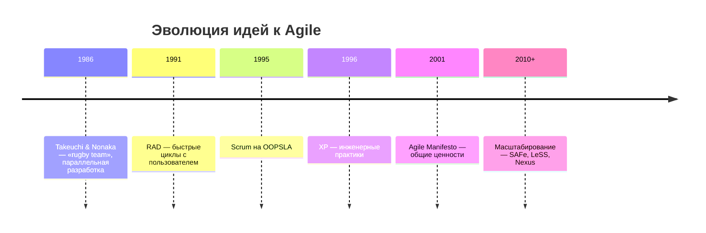
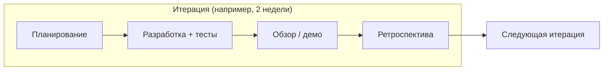
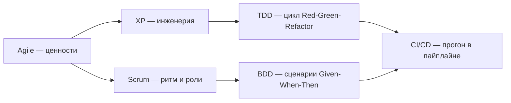
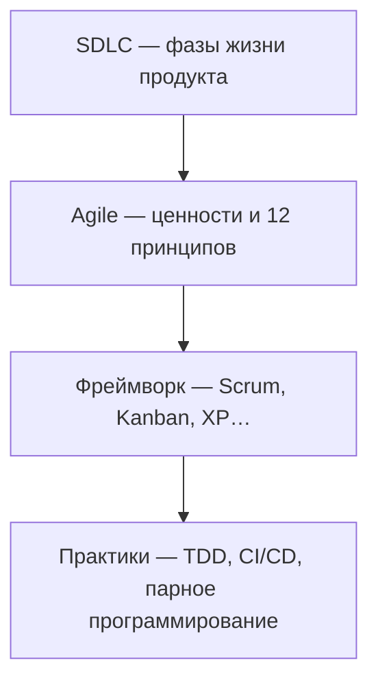

# Agile — гибкая методология разработки

<div class="article-tags">
  <span class="tag tag-required">ОБЯЗАТЕЛЬНО</span>
  <span class="tag tag-beginner">ДЛЯ НОВИЧКОВ</span>
</div>

<span class="complexity-badge">Руководителю</span>
<span class="complexity-badge">Аналитику</span>
<span class="complexity-badge">Разработчику</span>


<div class="callout callout--info">
  <div class="callout-title">Теория данных (раздел 3)</div>
  <div class="callout-body">
  Миграции в релизе, ETL, конфиги сред — [Пакетная работа](/encyclopedia/3-data-markup/3-11-analiz-dannyh/433), [ETL](/encyclopedia/3-data-markup/3-11-analiz-dannyh/425), [конфигурации](/encyclopedia/3-data-markup/3-04-konfiguratsii-i-dannye/intro). Карта — [о разделе](./intro).
  </div>
</div>

---

## Зачем отдельная статья

**Agile** (англ. *agile software development*, «гибкая разработка ПО») — не синоним Scrum и не «отсутствие плана». Это **набор ценностей и принципов**, зафиксированных в [Манифесте гибкой разработки ПО](https://agilemanifesto.org/iso/ru/principles.html) (2001), и семейство **практик и фреймворков**, которые их воплощают.

В [обзоре жизненного цикла](./1) Agile упоминается рядом с Waterfall, Scrum и Kanban. Здесь — **полноценный разбор**: откуда взялся подход, что означает «гибкость», как читать манифест без упрощений, как устроены **итерации** и **инкременты**, когда Agile уместен, а когда — нет.

<div class="callout callout--info">
  <div class="callout-title">Agile ≠ Scrum</div>

  <div class="callout-body">
  <strong>Agile</strong> — философия и принципы.

  <strong>Scrum</strong>, <strong>Kanban</strong>, <strong>XP</strong> — конкретные способы организовать работу. Подробный маршрут по Scrum — в разделе <a href="/encyclopedia/7-project/7-14-scrum/intro">7-14 Scrum</a>.
</div>
  </div>

---

## Что такое Agile

**Agile** — подход к разработке программного обеспечения (и к управлению продуктом в целом), в котором:

- ценность для заказчика и пользователя поставляется **часто и небольшими порциями**;
- требования и решения **уточняются по мере появления знаний**, а не замораживаются в начале;
- команда, бизнес и заказчик **работают вместе** на протяжении всего проекта;
- прогресс измеряется **работающим продуктом**, а не процентом выполнения плана на бумаге.

Термин *agility* переводят как **проворность**, **гибкость**, **адаптивность** — способность организации **быстро и осмысленно реагировать на изменения** (рынок, регуляторика, обратная связь пользователей) **без** хаотичного срыва качества и темпа.

Agile **не** является:

| Миф | Реальность |
|-----|------------|
| «Без документации» | Документация нужна, но **достаточная** и **живая**, а не «всё заранее на 500 страниц» |
| «Без плана» | План есть на уровне **релиза, итерации, недели**; он **пересматривается** регулярно |
| «Только для стартапов» | Применяют в банках, телекоме, госсекторе — часто **гибридно** с контрактом и приёмкой |
| «= Scrum в Jira» | Можно провалить Agile при **ежедневных стендапах** без инкремента и без заказчика в цикле |

Официальный текст манифеста и принципов — на [agilemanifesto.org](https://agilemanifesto.org/iso/ru/manifesto.html) (доступен на десятках языков, включая русский).

---

## Откуда взялся Agile: краткая история

### «Тяжёлые» методы 1980–1990-х

До широкого распространения Agile доминировали **документо- и план-ориентированные** процессы: полное ТЗ до кода, фазы «проектирование → реализация → тесты», редкие релизы. Их называли **heavyweight** («тяжёлые»): много артефактов, согласований, контроля. Золотым стандартом для многих организаций был **каскад (waterfall)** и производные (V-Model, стадии по ГОСТ).

Параллельно накапливался опыт **«лёгких» (lightweight)** методов — меньше церемоний, короче цикл обратной связи:

| Метод / идея | Примерный период | Суть |
|--------------|------------------|------|
| **RAD** (Rapid Application Development) | с 1991 | Быстрые прототипы, тесная связь с пользователем |
| **RUP** / **DSDM** | 1994+ | Итерации внутри формального процесса |
| **Scrum** | с 1995 | Timebox, роли, инкремент (см. [7-14](/encyclopedia/7-project/7-14-scrum/1)) |
| **Crystal Clear** | с 1996 | Масштабирование процесса под размер команды |
| **XP** (Extreme Programming) | с 1996 | Инженерные практики: TDD, парное программирование, CI |
| **FDD** (Feature-Driven Development) | с 1997 | Разработка «по фичам», короткие итерации |

Эти методы **существовали до** публикации манифеста; манифест **объединил** их общие ценности, а не изобрёл Scrum с нуля.

### Снежный берег Юты, февраль 2001

**11–13 февраля 2001** на курорте **Snowbird** (Юта, США) встретились **17** независимых практиков разных методологий — «Agile Alliance». Они сформулировали документ **Manifesto for Agile Software Development** и **12 принципов**; манифест опубликован **13 февраля 2001**.

Среди подписантов — имена, которые до сих пор цитируют в индустрии: **Кент Бек** (XP), **Мартин Фаулер**, **Алистер Кокбёрн**, **Уорд Каннингем**, **Кен Швабер** и **Джеф Сазерленд** (Scrum), **Джим Хайсмит**, **Рон Джеффрис**, **Роберт Мартин** и др. Полный список — в [истории манифеста](https://agilemanifesto.org/history.html).

Важно: манифест **не описывает** конкретные церемонии, длительность спринта или формат бэклога. Он задаёт **приоритеты** — что важнее в условиях неопределённости.



После 2001 года «гибкие» методы стали **массовым стандартом** в разработке ПО; термин *Agile* часто используют и для **продуктового управления** вне чистого IT.

---

## Что такое «гибкость» и в чём она заключается

**Гибкость** в Agile — не «делаем что хотим» и не «меняем ТЗ каждый час без последствий». Это **управляемая адаптивность**:

| Измерение | Жёсткий (предиктивный) подход | Гибкий (адаптивный) подход |
|-----------|------------------------------|----------------------------|
| **Требования** | Фиксируются в начале | Уточняются; важные решения откладывают, пока не станет дешевле ошибиться |
| **План** | Детальный на весь проект | Детальный на **ближайшую итерацию**; дальше — грубо |
| **Риск** | Концентрируется на финале | **Снижается** частыми поставками и проверками |
| **Обратная связь** | После длительной фазы | После каждой итерации (дни–недели) |
| **Изменения** | Change request, пересогласование | **Ожидаемы**; встроены в бэклог и приоритеты |
| **Качество** | Часто «отдел тестирования в конце» | Встроено в каждый инкремент (тесты, DoD, ревью) |

**Техническая** гибкость (принцип 9 манифеста) — отдельная ось: без **рефакторинга**, автотестов и приемлемой архитектуры бизнес не сможет менять приоритеты — каждое изменение будет стоить как в каскаде. Поэтому Agile в зрелых командах почти всегда сочетается с **CI/CD**, TDD или хотя бы с автоматизированной регрессией.

<div class="callout callout--tip">
  <div class="callout-title">Проверка «мы гибкие?»</div>

  <div class="callout-body">
  Спросите: можем ли мы **через 2–4 недели** показать заказчику <strong>работающий</strong> кусок продукта и <strong>изменить приоритеты</strong> следующего цикла без «аврала на три месяца»? Если нет — возможно, процесс только называется Agile.
</div>
  </div>

---

## Манифест Agile: четыре ценности

Манифест формулирует **четыре пары** приоритетов. Ключевая фраза (в духе оригинала): **не отрицая важности правой колонки, мы больше ценим левую**.

### 1. Люди и взаимодействие — важнее процессов и инструментов

**Смысл:** успех зависит от **коммуникации, доверия и компетенции** людей. Процессы и Jira **поддерживают** команду, но не заменяют разговор «что на самом деле нужно».

**На практике:**

- Product Owner и разработчики **уточняют** истории вместе, а не перекидывают PDF через посредника.
- Архитектурные решения обсуждаются **в команде**, а не спускаются сверху без контекста.
- Инструмент (доска, трекер) **не** оправдывает отсутствие заказчика на демо.

**Ошибка:** внедрить «Agile» как новый регламент из 40 страниц — это усиление **процесса**, а не людей.

### 2. Работающий продукт — важнее исчерпывающей документации

**Смысл:** главный артефакт — **работающее ПО**, которое можно показать, измерить, принять или отклонить. Документация нужна для сопровождения, контракта, онбординга — но **не подменяет** поставку ценности.

**На практике:**

- В конце итерации — **демо** инкремента, а не только отчёт «готово 80%».
- Спецификация **живая**: user story + критерии приёмки + при необходимости ADR, а не единственный том ТЗ на год вперёд.
- В регулируемых доменах документ **дополняет** инкремент (см. [Методологии ГИС](./2)).

**Ошибка:** «у нас Agile, потому что Confluence разросся» — при этом в production ничего не выходит месяцами.

### 3. Сотрудничество с заказчиком — важнее согласования условий контракта

**Смысл:** контракт и SLA важны, особенно в аутсорсе и госсекторе, но **партнёрство** (совместное уточнение scope, прозрачность рисков) даёт лучший результат, чем позиция «вы просили в п. 4.2 — доплата».

**На практике:**

- Регулярные **обзоры инкремента** с представителем бизнеса.
- Договорённость, **как** оформляются изменения (допсоглашение, change request в бэклоге, этапы контракта).
- Заказчик **вовлечён** в приоритизацию, а не появляется на приёмке через год.

**Ошибка:** контракт fix-price + «Agile» без механизма пересмотра scope — конфликт неизбежен; нужен **гибрид** (рамки в контракте, детали в итерациях).

### 4. Готовность к изменениям — важнее следования первоначальному плану

**Смысл:** план **полезен** (Эйзенхауэр: планировать важно), но **слепое** следование устаревшему плану в меняющейся среде — риск. Agile **приветствует** изменение требований, если это повышает ценность продукта.

**На практике:**

- Бэклог **переупорядочивается** после каждой итерации.
- Команда не «наказывают» за смену приоритета, если **прозрачно** показана цена (что вытесняется из спринта).
- Метрики — не «процент плана», а **поставленная ценность** и устойчивый темп.

**Ошибка:** спринт как мини-водопад с **замороженным** scope на две недели и запретом любых правок — это timebox без **адаптации**.

---

## Манифест Agile: двенадцать принципов (разбор с примерами)

Ниже — принципы в логике [русской версии манифеста](https://agilemanifesto.org/iso/ru/principles.html). Каждый — с пояснением для IT-проекта.

### Принцип 1. Удовлетворение заказчика через раннюю и регулярную поставку ценного ПО

**Суть:** «ценное» — то, что **решает задачу пользователя** или бизнеса, а не «мы написали модуль X».

**Пример:** вместо шести месяцев разработки «личного кабинета целиком» — через три недели: вход, просмотр статуса заявки, уведомление; заказчик подтверждает направление, следующий инкремент — оплата.

### Принцип 2. Приветствуются изменения требований даже на поздних стадиях

**Суть:** конкурентное преимущество часто приходит от **быстрой реакции** на рынок, а не от «сделали ровно то, что написали год назад».

**Пример:** после релиза MVP аналитика показала, что 80% пользователей не доходят до шага 3 — команда **меняет** приоритет UX и откладывает второстепенные интеграции.

**Оговорка:** в жёстком контракте изменения оформляют **явно** (см. [ГИС](./2)); принцип не отменяет юридические рамки.

### Принцип 3. Частая поставка работающего ПО (от пары недель до пары месяцев, предпочтительнее короче)

**Суть:** ритм поставки **сжимает риск** и делает прогресс **видимым**.

**Пример:** релиз в production раз в 2 недели (при зрелом CI/CD) или демо **готового к приёмке** инкремента раз в спринт — в зависимости от домена (медицина/ГОЗ могут реже в prod, но **демо** — всё равно часто).

### Принцип 4. Ежедневная совместная работа бизнеса и разработчиков

**Суть:** не обязательно физически «сидеть рядом», но **нет длинных пауз** без ответов на вопросы по требованиям.

**Пример:** выделенный Product Owner или бизнес-аналитик с полномочиями решений; **не** «отправили ТЗ — ждём два спринта».

### Принцип 5. Мотивированные профессионалы, условия, поддержка, доверие

**Суть:** процесс не компенсирует **выгорание** и текучку; Agile предполагает **ответственность** команды за результат.

**Пример:** команда сама оценивает задачи; менеджмент **не** ломает спринт постоянными «срочными» без снятия чего-то другого (см. WIP в Kanban).

### Принцип 6. Непосредственное общение — самый эффективный способ обмена информацией

**Суть:** синхронный разговор (встреча, парное уточнение) для **сложных** вопросов; асинхрон — для фиксации решений.

**Пример:** сложную интеграцию обсудили 20 минут у доски; итог записали в ADR или комментарий к story — не наоборот.

### Принцип 7. Работающий продукт — главный показатель прогресса

**Суть:** «закрыто 47 задач» без инкремента **не** равно прогрессу.

**Пример:** на обзоре показывают **развёрнутую** ветку или staging, а не только burn-down chart.

### Принцип 8. Устойчивый темп на неопределённый срок (инвесторы, разработчики, пользователи)

**Суть:** **марафон**, а не вечные переработки перед релизом; предсказуемость важнее разовых героических рывков.

**Пример:** velocity или throughput **стабилизируют** после 3–5 итераций; capacity планирования не завышают «чтобы понравиться».

### Принцип 9. Постоянное внимание к техническому совершенству и хорошему дизайну

**Суть:** **технический долг** без погашения убивает гибкость — изменения становятся дорогими, как в каскаде.

**Пример:** 10–20% ёмкости итерации на рефакторинг, обновление зависимостей, исправление дефектов; Definition of Done включает тесты и ревью.

### Принцип 10. Простота — искусство не делать лишней работы

**Суть:** **YAGNI** — не строить «на вырост» без запроса; минимальный инкремент, который **решает** задачу.

**Пример:** первая версия отчёта — CSV-выгрузка; «красивый BI с 50 виджетами» — только если подтверждена ценность.

### Принцип 11. Самоорганизующиеся команды дают лучшие требования и решения

**Суть:** команда **владеет** тем, *как* достичь цели спринта; заказчик задаёт *что* и *зачем*.

**Пример:** разработчики сами декомпозируют story на задачи; архитектурный выбор в рамках согласованных границ — в команде.

### Принцип 12. Регулярная ретроспектива и улучшение процесса

**Суть:** Agile — **эмпирический** цикл: сделали → посмотрели → улучшили процесс.

**Пример:** раз в итерацию — что мешало поставке, одно конкретное улучшение на следующий цикл (не 20 пунктов «в никуда»).

---

## Итерация, итеративный и инкрементальный подход

Эти термины часто смешивают; в Agile они **связаны**, но не тождественны.

### Итерация

**Итерация** — **ограниченный по времени** цикл работы (часто 1–4 недели), внутри которого команда проходит мини-жизненный цикл: планирование → анализ → проектирование → реализация → тестирование → (при необходимости) документирование → **обзор** с заказчиком.

Характеристики:

- **Фиксированная длина** (timebox) в Scrum или **поток** с контролем WIP в Kanban.
- В конце — **переоценка приоритетов** бэклога.
- Одна итерация **редко** равна полному major-релизу продукта, но должна давать **законченный инкремент** по выбранному scope.



### Итеративный подход

**Итеративность** — повторение циклов **с уточнением** продукта и процесса. Каждый виток **пересматривает** предыдущие решения на основе обратной связи.

**Аналогия:** серия эскизов портрета — каждый лист **полный**, но следующий точнее предыдущего.

**В ПО:** прототип UI → пилот с 10 пользователями → расширение функций; на каждом витке **переосмысливают** требования.

### Инкрементальный подход

**Инкрементальность** — поставка **нарастающих** частей системы, каждая из которых **добавляет ценность** (не «половина базы без UI»).

**Аналогия:** строительство по этажам — каждый этаж **можно использовать** (или хотя бы безопасно осмотреть), а не «все стены сразу в конце».

**В ПО:** сначала авторизация + каталог, потом корзина, потом оплата — каждый шаг **работает** для части сценариев.

### Вместе: IID

На практике Agile использует **итеративную и инкрементальную разработку (IID)**:

| | Итеративность | Инкрементальность |
|---|---------------|-------------------|
| **Вопрос** | «Правильно ли мы поняли задачу?» | «Что ещё добавить к продукту?» |
| **Результат витка** | Уточнённые требования, прототип | Работающая **добавка** к продукту |
| **Риск** | Снижает риск **неверного направления** | Снижает риск **долгого отсутствия value** |

<div class="callout callout--warning">
  <div class="callout-title">Итерация без инкремента</div>

  <div class="callout-body">
  Если за спринт «закрыли задачи», но <strong>нечего показать</strong> заказчику — это не Agile-итерация, а отчётность. Проверяйте <strong>Definition of Done</strong> и критерии приёмки.
</div>
  </div>

**Связанные термины** — в [словаре ниже](#словарь-agile-роли-артефакты-события-метрики); обзор SDLC — [статья 1](./1).

---

## Словарь Agile: роли, артефакты, события, метрики

Ниже — термины, которые чаще всего встречаются в **Scrum** и соседних практиках. В Kanban часть ролей и церемоний **не обязательна**, но смысл артефактов (бэклог, доска, WIP, DoD) тот же.

### Agile (как применяют на проекте)

Не «набор встреч», а **поведение**: частая поставка ценности, живой бэклог, заказчик в цикле, готовность менять приоритеты, измерение прогресса **работающим продуктом**. Чек-лист в конце раздела помогает отделить это от **Agile-театра**.

### Команда

**Кросс-функциональная команда** — группа (обычно до ~10 человек), способная **сама** довести элемент бэклога до «готово» по DoD: анализ, разработка, тестирование, при необходимости дизайн и эксплуатация — без бесконечных передач «через забор».

| Признак зрелой команды | Антипаттерн |
|------------------------|-------------|
| Общая цель итерации | «Моя задача закрыта — дальше не моё» |
| Коллективная ответственность за инкремент | Разработка vs QA vs аналитики как враждующие лагеря |
| Стабильный состав хотя бы на несколько итераций | Постоянная ротация без онбординга |

В **Scrum** команду разработки называют **Developers** (не только программисты). Подробнее о размере и SM — [7-14 / команда](/encyclopedia/7-project/7-14-scrum/3).

### Владелец продукта (Product Owner, PO)

**Владелец продукта** — один человек (не комитет), **ответственный за ценность**: что делаем, в каком порядке, принимаем ли инкремент. PO **не** расписывает все задачи за разработчиков и **не** подменяет Scrum Master.

| Делает PO | Не делает PO |
|-----------|--------------|
| Ведёт и **приоритизирует** бэклог продукта | Микроменеджмент оценок в часах «сверху» |
| Формулирует цель итерации / релиза | Назначает исполнителей на каждую подзадачу |
| Участвует в обзоре, отвечает на вопросы по scope | Блокирует изменения «потому что в ТЗ 2023 года» без процесса |

Без PO с полномочиями Agile часто превращается в **производство фич** без продукта.

### Scrum Master (SM)

**Scrum Master** — **слуга-лидер** процесса Scrum (в чистом Scrum — роль, не «старший разработчик» и не PM). Фокус: **эффективность команды**, фасилитация церемоний, снятие **импедиментов** (блокеров), обучение практикам.

| Зона SM | Зона не SM |
|---------|------------|
| Фасилитация планирования, ретро, дейли | Владение бэклогом и приоритетами (это PO) |
| Коучинг PO и команды по Scrum | Технические решения по архитектуре |
| Эскалация организационных блокеров | Оценка «кто виноват» в срыве задачи |

В **Kanban** роль SM **не обязательна**; функции фасилитации потока может выполнять Agile-коуч или тимлид.

### Итерация и спринт

**Итерация** — ограниченный период (часто 1–4 недели), в конце которого ожидают **законченный инкремент** и обратную связь.

**Спринт (Sprint)** — итерация в **Scrum** **фиксированной** длины; scope спринта **не меняют** произвольно в середине (меняют через переговор с PO: что выкинуть / что добавить осознанно). См. [7-14 / спринт](/encyclopedia/7-project/7-14-scrum/4).

### Инкремент

**Инкремент** — приращение продукта, соответствующее **Definition of Done**, потенциально **пригодное к использованию** (релиз, пилот, демо на staging). Не путать с «закрыли 20 тикетов в Jira».

### Бэклог продукта и бэклог спринта

| Артефакт | Содержание | Кто владеет |
|----------|------------|-------------|
| **Бэклог продукта (Product Backlog)** | Всё, что **может** понадобиться продукту: фичи, техдолг, исследования, баги | PO |
| **Бэклог спринта (Sprint Backlog)** | Выбранное на **текущую** итерацию + план «как сделаем» | Команда (в рамках цели спринта) |

Элементы бэклога часто оформляют как **user story**, **эпики**, **задачи**; важны **критерии приёмки** и порядок сверху вниз. **Уточнение (refinement / grooming)** — регулярная подготовка верхних элементов, чтобы на планировании не тратить час на расшифровку.

### Планирование

| Уровень | Когда | Результат |
|---------|-------|-----------|
| **Стратегия / roadmap** | Квартал–год | Направление, крупные вехи |
| **Планирование релиза** | По мере необходимости | Прогноз «когда что» при известной скорости |
| **Планирование итерации (Sprint Planning)** | Начало спринта | **Цель спринта** + набор работ из бэклога |
| **Ежедневное синхронизация (Daily Scrum / стендап)** | Каждый рабочий день, ~15 мин | План на 24 часа, блокеры |
| **Пополнение (Kanban)** | По триггеру WIP | Новые задачи в поток |

Agile **планирует часто**, но **горизонт детализации короткий**. Долгосрочный план — **грубый** и пересматриваемый.

### Скорость (Velocity) и оценки

**Velocity (скорость)** — сумма **завершённых** оценок (обычно story points) за итерацию. Используется для **прогноза** («сколько таких итераций до релиза X»), а не как KPI для наказания.

**Story Points** — **относительная** оценка сложности/риска/объёма, не часы. **Planning Poker** — способ согласовать оценку анонимным голосованием и обсуждением расхождений. Подробнее — [аналитика / 116](/encyclopedia/7-project/7-04-analitika/116), [7-14 / бэклог](/encyclopedia/7-project/7-14-scrum/6).

| Метрика | Смысл | Осторожно |
|---------|--------|-----------|
| **Velocity** | Скорость команды в SP за спринт | Не сравнивать разные команды |
| **Throughput** | Задач/элементов за период (Kanban) | Зависит от размера задач |
| **Cycle time** | Время от «взяли» до «готово» | Хорош для потока |
| **Lead time** | От идеи до поставки | Включает ожидание в очереди |

### Доска задач

**Доска (board)** — визуализация работ: колонки (**To Do → In Progress → Review → Done** или свои), **карточки** на задачи, часто **WIP-лимиты** (сколько максимум в «In Progress»).

- **Физическая доска** — сильная для фокуса в офисе.
- **Jira, YouTrack, Trello, Azure DevOps** — то же для распределённых команд.

Доска без WIP и без DoD — **картинка**, а не управление потоком.

### Стендап (Daily Scrum)

**Стендап** — короткая **синхронизация команды** (не отчёт руководству). Классические вопросы Scrum: что сделал вчера; что сделаю сегодня; **что мешает**. Цель — **адаптировать план спринта** и вскрыть блокеры. Этика и антипаттерны — [7-02 / 111](/encyclopedia/7-project/7-02-komanda-i-upravlenie/111).

### Диаграммы сгорания и прогорания

| Диаграмма | Показывает | Типичное использование |
|-----------|------------|-------------------------|
| **Burndown (сгорание)** | Оставшаяся работа в спринте/релизе **↓** со временем | «Успеем ли к концу спринта?» |
| **Burn-up (прогорание)** | Сделанный объём **↑** + линия scope | Видно **рост scope** (ползущие требования) |
| **CFD** (cumulative flow) | Задачи по колонкам во времени | Узкие места в Kanban |

Burndown **без** единого DoD и без честного учёта «незавершённого» вводит в заблуждение. Подробнее — [7-14 / спринт и метрики](/encyclopedia/7-project/7-14-scrum/4).

### Демо (Sprint Review / обзор итерации)

**Демо** — встреча, на которой команда показывает **работающий** инкремент стейкхолдерам; собирается обратная связь, **корректируется бэклог**. Это **валидация** («строим ли то, что нужно?»), а не формальный PowerPoint о проценте готовности.

### Ретроспектива

**Ретроспектива** — регулярный разбор **как мы работали** (люди, процесс, инструменты), с **1–3 конкретными улучшениями** на следующую итерацию. Без действий ретро превращается в жалобную сессию.

### Готовность: DoR и DoD

| Термин | Вопрос | Пример критериев |
|--------|--------|------------------|
| **Definition of Ready (DoR)** | Можно ли **брать** в работу? | Описана ценность, есть AC, нет блокирующих зависимостей, оценка |
| **Definition of Done (DoD)** | Когда задача **действительно готова**? | Код, ревью, тесты, документация API, деплой на staging |

DoD команды и **критерии приёмки** конкретной story **дополняют** друг друга: DoD — общий стандарт качества; AC — «что именно должно работать в этой фиче».

### Прочие частые термины

| Термин | Кратко |
|--------|--------|
| **User Story** | Описание ценности с точки зрения пользователя («как … я хочу … чтобы …») |
| **Критерии приёмки (AC)** | Проверяемые условия «сделано правильно» |
| **Эпик** | Крупный элемент, дробится на stories |
| **MVP** | Минимум для проверки гипотезы |
| **Технический долг** | Упрощения в коде/архитектуре; учитывают в бэклоге |
| **Impediment** | Блокер, мешающий команде |
| **WIP** | Лимит незавершённой работы |
| **Scrumban** | Спринты + доска и WIP из Kanban |

---

## Чек-лист Agile: есть ли это у вас на практике

Отметьте **да / нет / частично** по своей команде или продукту. Это **не** замена [полного чек-листа раздела 7-03](./999) (Waterfall, CI/CD, ГИС), а фокус на **Agile-лексике** из этой статьи.

<div class="callout callout--tip">
  <div class="callout-title">Как читать результат</div>

  <div class="callout-body">
  Много «нет» при заявленном Scrum — сигнал чинить процесс или <strong>честно</strong> назвать его иначе. Несколько «частично» — нормальная точка роста; выберите 1–2 улучшения на следующую итерацию.
</div>
  </div>

### Философия и заказчик

1. Прогресс измераем **работающим продуктом**, а не только закрытыми тикетами?
2. Есть представитель бизнеса с **полномочиями** менять приоритеты бэклога?
3. Изменения требований **встраиваются** в процесс, а не воспринимаются как саботаж?
4. Команда понимает **зачем** (цель продукта / спринта), а не только «что в Jira»?

### Роли

5. Владелец продукта (PO) **один** и доступен для уточнений в течение итерации?
6. PO **приоритизирует** бэклог, а не только «пишет ТЗ»?
7. Scrum Master (или аналог) **снимает блокеры**, а не раздаёт задачи разработчикам?
8. Команда **кросс-функциональна** enough, чтобы доводить фичу до DoD без вечной очереди в «чужой отдел»?

### Итерации и бэклог

9. Работа идёт **итерациями** (спринт или ритм Kanban) с обзором в конце?
10. Ведётся **бэклог продукта** — единый приоритизированный список?
11. Проводится **уточнение** верхних элементов бэклога до планирования?
12. В конце итерации есть **инкремент**, который можно показать (демо)?

### Планирование и оценки

13. Перед итерацией есть **планирование** с целью и выбранным scope?
14. Оценки **относительные** (story points) или эквивалент, а не «часы с потолка для отчёта»?
15. Скорость (velocity) или throughput используется для **прогноза**, а не как KPI наказания?
16. Scope середины спринта **не раздувают** без осознанного trade-off с PO?

### Прозрачность: доска и метрики

17. Задачи **видны** на доске (физической или электронной)?
18. Понятны **статусы** и кто над чем работает?
19. Для Kanban или зрелого потока есть **WIP-лимиты**?
20. Burndown / burn-up / CFD используют для **диалога**, а не для «поймать виноватого»?

### Церемонии

21. **Стендап** до 15 минут, про синхронизацию команды, а не статус-отчёт директору?
22. Проводится **демо / review** с участием заинтересованных сторон?
23. Есть **ретроспектива** с хотя бы одним **конкретным** улучшением процесса?
24. Блокеры с дейли **доходят до решения** (SM / менеджмент), а не копятся месяцами?

### Готовность и качество

25. Согласован **Definition of Done** и он проверяется (ревью, тесты, CI)?
26. Есть **Definition of Ready** или эквивалент «не берём сырьё в спринт»?
27. У каждой story есть **критерии приёмки**, понятные PO и команде?
28. Технический долг **виден** в бэклоге и периодически погашается?

### Инженерные практики (связь с XP / DevOps)

29. Есть **непрерывная интеграция** (сборка + тесты на коммит)?
30. Автотесты **блокируют** сломанный main, а не «зелёные в отчёте»?
31. Команда практикует **рефакторинг** в рамках задач, а не «потом перед релизом»?
32. Хотя бы часть команды знакома с **TDD** или пишет тесты **до** или **вместе** с кодом критичных модулей?

Полная диагностика SDLC, Waterfall и госсектора — **[чек-лист 999](./999)**. Scrum по ролям и церемониям — **[7-14](/encyclopedia/7-project/7-14-scrum/intro)**.

---

## Agile и Waterfall: не «кто прав», а контекст

| Критерий | Waterfall / предиктивный | Agile / адаптивный |
|----------|--------------------------|---------------------|
| Понимание требований | Высокое в начале | Растёт по ходу |
| Стоимость позднего изменения | Очень высокая | Ниже при зрелой инженерии |
| Регуляторика, контракт | Часто **удобнее** формализовать фазы | Нужен **гибрид** |
| Цифровой продукт, рынок | Риск «устаревшего ТЗ» | Часто **предпочтительнее** Agile |
| Команда | Может быть распределена по фазам | Нужна **кросс-функция** и вовлечённый заказчик |

**Гибриды** (Water-Scrum-Fall, Scrumban): например, архитектура и контракт — waterfall-рамка, разработка фич — спринты. Это **нормально**, если стороны честно понимают границы.

Диагностика «что у нас на самом деле» — [чек-лист 999](./999).

---

## Экосистема на базе Agile: Scrum, Kanban и соседи

Agile — **зонтичная идея**. **Scrum** и **Kanban** — самые частые «оболочки» процесса; ниже — методы и **инженерные практики**, которые часто сочетают с ними.

| Название | Тип | Когда смотреть |
|----------|-----|----------------|
| **Scrum** | Фреймворк | Нужны роли, спринт, церемонии — [7-14](/encyclopedia/7-project/7-14-scrum/intro) |
| **Kanban** | Поток | Поддержка, смешанный поток, без жёсткого спринта — [статья 1](./1) |
| **XP** | Метод + инженерия | Высокая неопределённость, упор на качество кода |
| **DSDM** | Фреймворк | Бизнес-ценность, сроки/бюджет, участие заказчика |
| **FDD** | Метод | Крупные команды, разработка «по фичам» |
| **TDD / BDD** | Практики | Контракт поведения через тесты и сценарии |
| **SAFe, LeSS, Nexus** | Масштаб | Много команд — [статья 1](./1) |

**DevOps** дополняет Agile: *что* и *как часто* поставлять — Agile; *как надёжно довести до production* — CI/CD, наблюдаемость ([раздел 1 — DevOps](./1)).

---

### Extreme Programming (XP)

**Extreme Programming (XP)** — гибкий **метод разработки** (Кент Бек, Уорд Каннингем, Мартин Фаулер и др.; проект C3 в Chrysler, 1990-е). Идея: полезные практики довести до **экстремума** — делать **постоянно**, а не «когда останется время».

**Scrum** в первую очередь про **прозрачность, инспекцию и адаптацию** процесса. **XP** — про **инженерную дисциплину**, чтобы изменения требований оставались **дёшевыми и безопасными**.

Практики XP (группировка по «Extreme Programming Explained»):

| Группа | Практики |
|--------|----------|
| Короткая обратная связь | **TDD**, игра в планирование, **заказчик в команде**, **парное программирование** |
| Непрерывный процесс | **CI**, **рефакторинг**, частые **малые релизы** |
| Общее понимание | простой дизайн, **метафора системы**, коллективное владение кодом, единый стиль кода |
| Устойчивый ритм | sustainable pace (не вечные переработки) |

**Парное программирование** — driver пишет, navigator смотрит на дизайн и ошибки; знания распределены по команде. **Простой дизайн** — только то, что нужно сейчас (связь с YAGNI). **Метафора системы** — общий образ архитектуры для разработчиков и заказчика.

XP уместна при **частых изменениях** и готовности инвестировать в автотесты. Без дисциплины TDD/CI XP **не взлетит**. Практикум — [лабораторный кейс TDD](/lab/Кейсы/7); углубление в SDLC — [статья 1, раздел XP](./1).

---

### DSDM (Dynamic Systems Development Method)

**DSDM** — один из «лёгких» методов 1990-х, вошедших в семейство Agile. Акцент: **бизнес-ценность**, участие **пользователей и заказчика**, итеративная поставка при **контроле сроков и бюджета** (часто ближе к корпоративным и заказным проектам, чем «чистый» стартап-Scrum).

Типичные элементы:

| Элемент | Смысл |
|---------|--------|
| **MoSCoW** | Приоритизация: Must / Should / Could / Won't (на этот релиз) |
| **Timeboxing** | Жёсткие рамки по времени; scope подстраивают под срок |
| **Итерации** | Поставка работающего ПО с участием пользователей |
| **Роли** | В разных версиях DSDM — посол проекта, технический координатор, аналитик и др. |

DSDM полезно знать, когда заказчик требует **«Agile, но с фиксированным дедлайном и отчётностью»**: метод изначально совмещал гибкость с **управлением ожиданиями** по срокам. С **госзаказом** часто стыкуют через гибрид — см. [Методологии ГИС](./2).

---

### FDD (Feature-Driven Development)

**FDD** (Питер Кабил, Джефф Де Лука, 1997) — **итеративная** разработка вокруг **фич** (features): небольших, **поставляемых** кусков функциональности, которые можно спроектировать и сдать за **короткий** период (ориентир — до ~2 недель на feature).

Пять процессов FDD (упрощённо):

1. Разработать **общую модель** предметной области.
2. Составить **список фич**.
3. **Спланировать** фичи по итерациям.
4. **Спроектировать** фичу.
5. **Построить** фичу.

Организация: **chief programmer** на фичу, **классы** по объектам модели, регулярные **отчёты о ходе** (зелёный / жёлтый / красный). FDD хорошо масштабируется на **большие команды**, где чистый Scrum без структуры даёт хаос; слабое место — нужна **зрелая начальная модель** и дисциплина декомпозиции на фичи.

---

### TDD (Test-Driven Development)

**TDD** — **инженерная практика** (ядро XP), применимая **вне** выбранного фреймворка. Цикл **Red → Green → Refactor**:

1. **Red** — написать **падающий** тест, описывающий желаемое поведение.
2. **Green** — минимальный код, чтобы тест прошёл.
3. **Refactor** — улучшить структуру **без** смены поведения ([методы рефакторинга](/encyclopedia/4-code-dev/4-02-chto-takoe-kod-i-kak-on-rabotaet/612)).

Зачем:

- поведение **зафиксировано** автотестом;
- меньше регрессий при изменениях;
- API и модули проектируются **«снаружи внутрь»**.

TDD чаще всего на уровне **юнит-тестов**; интеграционные и E2E дополняют, но не заменяют дисциплину на модулях. Уровни и границы — [тестирование / 131](/encyclopedia/7-project/7-05-testirovanie/131). Практика — [/lab/Кейсы/7](/lab/Кейсы/7).

Пример цикла (упрощённо):

```python
# Red — тест падает
def test_discount_for_loyal_customer():
    assert price(customer=Customer(loyal=True), base=1000) == 900

# Green — минимальная реализация, затем Refactor
```

---

### BDD (Behavior-Driven Development)

**BDD** — развитие идей **общения о поведении** системы на языке, понятном **бизнесу, аналитикам и тестировщикам**. Часто используют формат **Gherkin**:

```gherkin
Feature: Скидка для постоянного клиента
  Scenario: 10% при сумме заказа
    Given клиент с флагом loyal
    When оформляет заказ на 1000 руб.
    Then сумма к оплате 900 руб.
```

Шаги **Given / When / Then** связывают сценарий с автотестами (Cucumber, SpecFlow, pytest-bdd и др.). BDD **не заменяет** TDD: TDD чаще на уровне **разработчика и модуля**; BDD — **сквозные сценарии** и **живая спецификация** для стейкхолдеров.

| | TDD | BDD |
|---|-----|-----|
| **Фокус** | Модуль, контракт кода | Поведение системы для пользователя |
| **Язык** | Код теста | Gherkin + привязка шагов |
| **Кто пишет** | Преимущественно разработчик | Триада: бизнес, аналитик, QA/разработчик |
| **Связь с Agile** | DoD, CI, рефакторинг | Критерии приёмки, демо, приёмка |

Подробнее — [тестирование / 131](/encyclopedia/7-project/7-05-testirovanie/131), [Артефакты качества в проекте — BDD и Gherkin](/encyclopedia/7-project/7-05-testirovanie/113).

### Как сочетать XP, Scrum, TDD и BDD



Типичная зрелая команда: **Scrum** (или Kanban) для прозрачности и итераций; **TDD** и **CI** для качества; **BDD** для критичных пользовательских сценариев и приёмки; элементы **XP** (парное программирование, рефакторинг) — по необходимости.

---

## Когда Agile уместен — и когда нет

### Хорошие условия

- Требования **неполные** или **меняются** по мере обучения рынка.
- Есть **доверенный** представитель бизнеса для приоритетов.
- Команда **кросс-функциональна** (или близко к этому).
- Готовность инвестировать в **автотесты и CI** (хотя бы постепенно).
- Заказчик согласен на **частую обратную связь**, а не только финальную приёмку.

### Сложные контексты (возможен гибрид, не «чистый» Agile)

- **Госконтракт** с жёстким ТЗ и этапной приёмкой → [Методологии ГИС](./2).
- **Внедрение ERP** с фиксированным дедлайном «с нового года» → предиктивный план + Agile на доработках ([7-15](/encyclopedia/7-project/7-15-vnedrenie-erp-sistem/intro)).
- **Жёсткая сертификация** (авионика, медизделия) — формальная верификация **дополняет**, а не отменяет итерации в разработке, где это разрешено стандартом.

### Антипаттерны

- **Agile-театр** — церемонии есть, инкремента и PO нет.
- **Фасад Agile** — внутри спринтов waterfall по слоям (как Healthcare.gov в [истории Scrum](/encyclopedia/7-project/7-14-scrum/1)).
- **Отсутствие техдолга-политики** — «гибкость» только на словах.
- **Velocity как KPI** для наказания команд.

---

## Критика Agile (сбалансированный взгляд)

Критики справедливо указывают на риски:

1. **Слабое управление требованиями** — без product discovery и архитектурных рамок бэклог превращается в хаос; нужны roadmap и **архитектурный бэклог**.
2. **Технический долг** — давление «быстрее» без принципа 9 ведёт к «работает — и ладно».
3. **Масштаб** — один манифест не описывает 50 команд; нужны LeSS/SAFe или осознанная федерация.
4. **Контракты fix-price** — без механизма изменений конфликт «Agile vs юрист» неизбежен.

Ответ практиков Agile не в отказе от дисциплины, а в **дисциплине другого вида**: прозрачность, DoD, автотесты, вовлечённый заказчик, честные границы scope.

---

## Уровни: SDLC, Agile, фреймворк, практика



- На уровне **стратегии** — зачем продукт (OKR, roadmap).
- На уровне **Agile** — как учиться и поставлять ценность часто.
- На уровне **фреймворка** — роли, ритм, артефакты.
- На уровне **практик** — качество кода и доставка.

---

## Краткие выводы

1. **Agile** — манифест 2001 года и принципы **адаптивной** разработки, а не название доски в Jira.
2. **Гибкость** — управляемые изменения, частая поставка, совместная работа с заказчиком и **техническое** качество, без которого адаптация невозможна.
3. **Итерация** — timebox с обзором; **инкремент** — работающая добавка ценности; **PO, бэклог, DoD, демо, ретро** — рабочий словарь, а не декор.
4. **Чек-лист** в этой статье отделяет живой Agile от **театра**; полная диагностика SDLC — в [Методология и жизненный цикл ПО — чек-лист](./999).
5. **Scrum/Kanban** — процесс; **XP, TDD, BDD** — инженерия и язык требований; **DSDM/FDD** — варианты для корпоративного и feature-масштаба.
6. Выбор Agile vs Waterfall — вопрос **контекста**; часто побеждает **гибрид** с явными правилами изменений.

---

## Что читать дальше

| Тема | Ссылка |
|------|--------|
| SDLC, сравнение методологий, Kanban, DevOps | [Жизненный цикл ПО](./1) |
| Scrum углублённо | [7-14 Scrum](/encyclopedia/7-project/7-14-scrum/intro) |
| Госсектор, ТЗ, приёмка | [Методологии ГИС](./2) |
| User Story, оценки | [Аналитика / 116](/encyclopedia/7-project/7-04-analitika/116) |
| Тестирование в Agile | [Тестирование / 111](/encyclopedia/7-project/7-05-testirovanie/111) |
| TDD, BDD, уровни тестов | [Тестирование / 131](/encyclopedia/7-project/7-05-testirovanie/131) |
| Практикум TDD | [/lab/Кейсы/7](/lab/Кейсы/7) |
| Итоги и FAQ раздела | [Методология и жизненный цикл ПО — итоги](./998), [чек-лист 999](./999) |

### Внешние источники

- [Atlassian — Agile](https://www.atlassian.com/ru/agile) — обзор практик и глоссарий
- [Википедия — гибкая методология разработки](https://ru.wikipedia.org/wiki/%D0%93%D0%B8%D0%B1%D0%BA%D0%B0%D1%8F_%D0%BC%D0%B5%D1%82%D0%BE%D0%B4%D0%BE%D0%BB%D0%BE%D0%B3%D0%B8%D1%8F_%D1%80%D0%B0%D0%B7%D1%80%D0%B0%D0%B1%D0%BE%D1%82%D0%BA%D0%B8)
- [Википедия — Agile Manifesto](https://ru.wikipedia.org/wiki/Agile_Manifesto)
- [Яндекс Практикум — методология Agile](https://practicum.yandex.ru/blog/metodology-agile/)
- [Официальный текст манифеста (RU)](https://agilemanifesto.org/iso/ru/manifesto.html)

---
