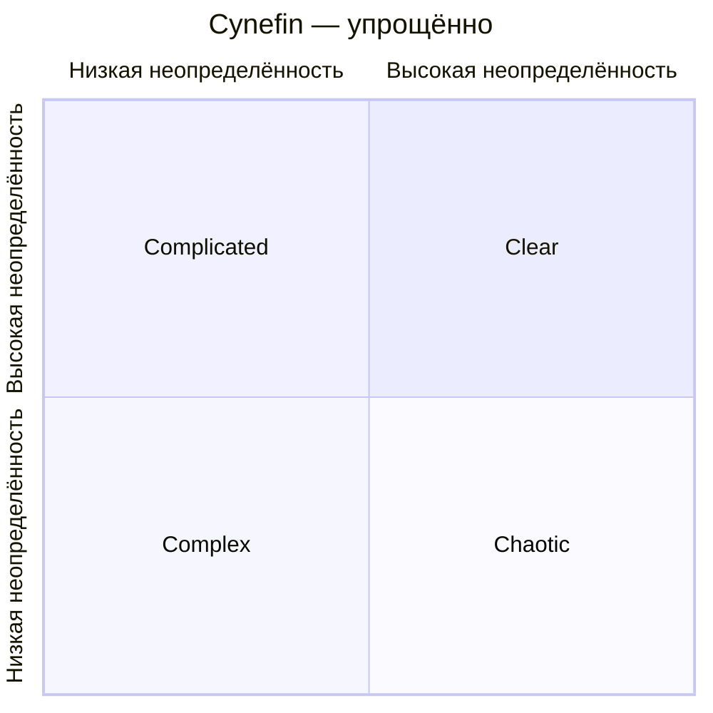
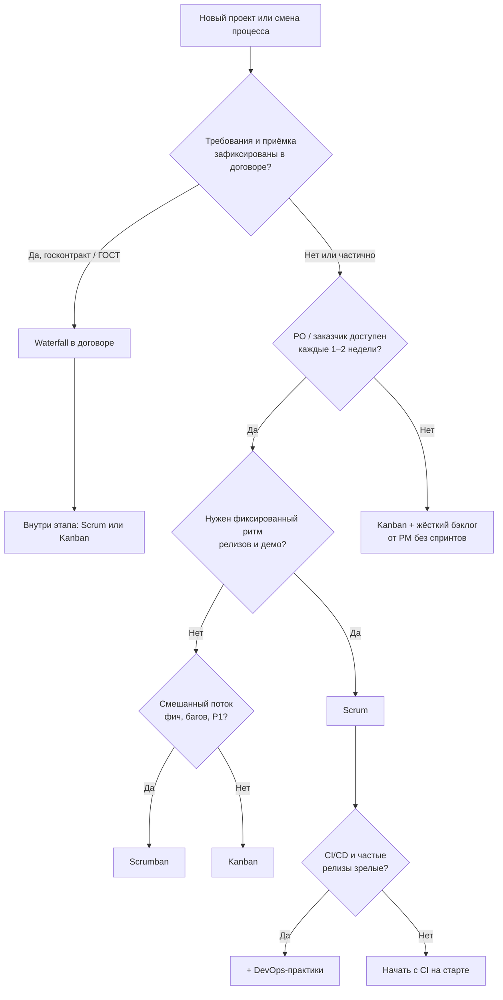

# Как выбрать процесс разработки под контекст

  ОБЯЗАТЕЛЬНО
  ДЛЯ НОВИЧКОВ

Руководителю

  
Связь с другими статьями

  

  Обзор жизненного цикла — <a href="/encyclopedia/7-project/7-03-metodologiya-i-zhiznennyy-tsikl-po/1">глава 1</a>.
  Agile — <a href="/encyclopedia/7-project/7-03-metodologiya-i-zhiznennyy-tsikl-po/3">глава 3</a>.
  ГИС и госконтракты — <a href="/encyclopedia/7-project/7-03-metodologiya-i-zhiznennyy-tsikl-po/2">глава 2</a>.
  Scrum — <a href="/encyclopedia/7-project/7-14-scrum/intro">раздел 7-14</a>.
  Kanban — <a href="/encyclopedia/7-project/7-18-kanban/intro">раздел 7-18</a>.
  

---

## Tailoring — подстройка процесса

**Tailoring** (в [PMBOK 7](/encyclopedia/7-project/7-02-komanda-i-upravlenie/17)) — адаптация процесса под контекст проекта: размер команды, регуляторика, зрелость инженерии, тип продукта, отношения с заказчиком.

Спор "Scrum или Waterfall" без контекста проекта редко даёт правильный ответ. Один и тот же метод может работать в одной команде и провалиться в соседней — потому что изменился продукт, законодательство или состав людей.

### Что входит в контекст

| Фактор | Вопросы для команды |
|--------|---------------------|
| **Требования** | Насколько стабильны? Кто принимает решения о приоритетах? |
| **Технология** | Стек знаком? Есть ли интеграции с legacy? |
| **Регуляторика** | Госконтракт, ГОСТ, отраслевые стандарты? |
| **Команда** | Сколько человек? Есть ли PO, QA, DevOps? |
| **Заказчик** | Доступен ли на демо? Как устроена приёмка? |
| **Релизы** | Как часто можно выкатывать в production? |

  
Практический совет

  

  Процесс выбирают не один раз навсегда. При смене фазы (MVP → масштабирование), смене заказчика или выходе на новый рынок — пересматривают tailoring на ретроспективе или на стратегической сессии.
  

Tailoring фиксируют при [запуске проекта](/encyclopedia/7-project/7-17-nachalo-raboty-na-proekte/6) вместе с [DoR/DoD](/encyclopedia/7-project/7-25-dostavka-i-gotovnost/intro) и правилами работы с трекером.

---

## Матрица Stacey (упрощённо)

**Ralph Stacey** предложил смотреть на две оси:

- **Ясность требований** — насколько понятно, *что* нужно построить.
- **Ясность технологии** — насколько понятно, *как* это построить.

### Базовая таблица

| | Требования ясны | Требования неясны |
|---|-----------------|-------------------|
| **Технология ясна** | План, контроль, [Kanban](/encyclopedia/7-project/7-18-kanban/intro) | [Agile](/encyclopedia/7-project/7-03-metodologiya-i-zhiznennyy-tsikl-po/3), итерации |
| **Технология неясна** | Исследование, прототипы | Эксперименты, spikes |

Чем **правее и выше** в таблице (больше неопределённости), тем больше нужны короткие циклы обратной связи и право менять план.

### Четыре зоны Stacey подробнее

**1. Простая зона (ясно + ясно)**

Примеры:

- добавить поле в существующую форму по готовому макету;
- миграция отчёта из Excel в PDF по шаблону;
- исправление опечатки в интерфейсе.

Подход: чек-лист, Kanban без лишних церемоний, предсказуемый workflow. Спринты не обязательны.

**2. Комplicated (сложная, но решаемая экспертизой)**

Примеры:

- интеграция с банковским API по документированной спецификации;
- настройка ERP-модуля по методике вендора;
- перенос монолита на новую версию фреймворка по runbook.

Подход: планирование, экспертная оценка, возможен waterfall внутри этапа. Важны review и тесты по [ПМИ](/encyclopedia/7-project/7-08-tehnicheskoe-pismo/14).

**3. Complex (комплексная — много неизвестного)**

Примеры:

- новый B2C-продукт на незнакомом рынке;
- рекомендательная система без истории данных;
- MVP с гипотезами, которые ещё не проверяли.

Подход: короткие итерации, [Scrum](/encyclopedia/7-project/7-14-scrum/intro), эксперименты, метрики. Требования уточняют по ходу.

**4. Хаос (chaotic в терминах Stacey — критическая неопределённость)**

Примеры:

- авария в production, нужно стабилизировать за часы;
- смена законодательства с жёстким дедлайном без готового решения;
- стартап с pivot каждые две недели.

Подход: сначала **стабилизация** (кто решает, что делаем прямо сейчас), потом нормализация процесса.

### Пример: один продукт — разные зоны

Команда делает маркетплейс:

| Часть работы | Зона Stacey | Процесс |
|--------------|-------------|---------|
| Каталог товаров (CRUD) | Простая / complicated | Kanban, фиксированные AC |
| Поиск и ранжирование | Complex | Спринты, A/B-тесты |
| Платёжный провайдер после сбоя | Хаос → complicated | Инцидент, потом runbook |

  
Типичная ошибка

  

  Навешивать полный Scrum на поток однотипных задач в простой зоне — команда тратит время на церемонии вместо поставки. Навешивать Kanban без WIP на complex-продукт — теряется ритм и предсказуемость для заказчика.
  

---

## Cynefin — тип ситуации

**Cynefin** (модель Dave Snowden) помогает выбрать **стиль управления** и **тип решений**. Название с валлийского — "место, где мы принадлежим" — напоминает, что контекст важнее универсального рецепта.

### Пять доменов

| Дomain | Характер | Подход | Ошибка |
|--------|----------|--------|--------|
| **Clear** (бывший Simple) | Причинно-следственная связь очевидна | Best practices, чек-листы | Переусложнить то, что уже решено |
| **Complicated** | Связь есть, но нужен эксперт | Анализ, проектирование, review | Ждать "идеального плана" слишком долго |
| **Complex** | Связь видна только задним числом | Probe → Sense → Respond, эксперименты | Применять жёсткий план как в complicated |
| **Chaotic** | Нет стабильной связи | Act → Sense → Respond, стабилизация | Обсуждать процесс, пока горит production |
| **Confusion** (Disorder) | Неясно, в каком домене мы | Сначала классифицировать ситуацию | Действовать по привычке |

### Диаграмма Cynefin

На практике Cynefin используют на стратсессиях и при выборе процесса для нового направления.

### Примеры по доменам

**Clear**

- деплой по кнопке через проверенный pipeline;
- онбординг по [чек-листу](/encyclopedia/7-project/7-09-bazy-znaniy-i-zadachniki/24);
- code review по [стандартам](/encyclopedia/7-project/7-10-kultura-koda/intro).

**Complicated**

- выбор СУБД для нагрузки 10k RPS — нужны бенчмарки и [ADR](/encyclopedia/7-project/7-20-adr-i-arhitekturnaya-pamyat/1);
- проектирование интеграции с ЕСИА по регламенту.

**Complex**

- новый продукт на незнакомом рынке;
- gamification в приложении — неизвестно, что сработает;
- команда впервые внедряет [microservices](/encyclopedia/4-code-dev/4-04-proekt-i-freymvorki/intro).

**Chaotic**

- DDoS на production;
- массовый сбой после релиза;
- внезапный уход ключевого разработчика без документации.

  
Cynefin и Stacey

  

  Матрицы дополняют друг друга. Stacey удобна для <strong>выбора процесса разработки</strong> (Scrum, Kanban, waterfall). Cynefin — для <strong>типа решений</strong> в конкретной ситуации (чек-лист, экспертиза, эксперимент, действие сейчас).
  

### Связь Cynefin с Agile и Waterfall

| Домен | Уместный процесс |
|-------|------------------|
| Clear | Kanban, SLA, runbook |
| Complicated | Waterfall этапа + экспертный design review |
| Complex | Agile, Scrum, короткие релизы |
| Chaotic | Incident management, потом retrospective |

Новый продукт на незнакомом рынке чаще **complex**. Миграция отчёта по жёсткому регламенту — **complicated**. Срочный инцидент — **chaotic**, пока не стабилизируют.

---

## Дерево решений

Ниже — практическое дерево для типовых ситуаций. Ответьте на вопросы сверху вниз.

### Сценарии с рекомендациями

**Новый продукт, PO доступен, нужны демо каждые 2 недели**

→ [Scrum](/encyclopedia/7-project/7-14-scrum/intro)

- фиксированная длина спринта;
- sprint review с демо заказчику;
- product backlog с приоритетами от PO.

**Смешанный поток фич, багов и P1-инцидентов**

→ [Kanban](/encyclopedia/7-project/7-18-kanban/intro)

- WIP-лимиты на колонки;
- классы обслуживания: expedite для P1;
- метрики cycle time и aging.

**Госконтракт с фиксированным ТЗ и этапной приёмкой**

→ Waterfall в договоре + Scrum или Kanban **внутри** этапа

Подробнее — [ГИС и госконтракты](/encyclopedia/7-project/7-03-metodologiya-i-zhiznennyy-tsikl-po/2), [договор глазами разработчика](/encyclopedia/7-project/7-01-obschee-o-biznese/3).

**Заказчик хочет "спринты" в отчёте, реальность — постоянные срочные тикеты**

→ Scrumban ([Kanban / гибрид](/encyclopedia/7-project/7-18-kanban/5))

- цель спринта как ориентир;
- WIP не даёт захламить "In Progress";
- отчётность для PMO сохраняется.

**Зрелая CI/CD, частые релизы**

→ Добавить [DevOps-практики](/encyclopedia/8-infra-security/8-04-devops-ci-cd/intro)

Процесс ритма (Scrum/Kanban) можно не менять — важнее trunk-based flow, feature flags, автотесты в pipeline.

**Команда 3–5 человек, один продукт, без формального PO**

→ Упрощённый Kanban или "Scrumban light"

- еженедельное планирование на 30 минут;
- DoR/DoD на доске;
- не внедрять все артефакты Scrum "для галочки".

**Legacy-монолит, редкие релизы раз в квартал**

→ Release train или фиксированные вехи + Kanban между релизами

- интеграционная ветка;
- регресс перед выкладкой;
- [управление изменениями](/encyclopedia/7-project/7-22-upravlenie-izmeneniyami/1).

### Таблица: быстрый выбор

| Ситуация | Процесс | Почему |
|----------|---------|--------|
| Стартап, гипотезы каждую неделю | Scrum 1–2 нед | Ритм и демо |
| Поддержка + мелкие доработки | Kanban | Поток, WIP |
| Госзаказ, этапы по договору | Waterfall + agile внутри | Контракт + скорость команды |
| Аутстафф в чужой Jira | Как у клиента | Вы не выбираете процесс |
| ERP-внедрение | Waterfall + agile кастомизаций | [7.15](/encyclopedia/7-project/7-15-vnedrenie-erp-sistem/intro) |

---

## Гибриды в российской практике

В России редко встречается "чистый" Scrum или "чистый" waterfall на длинных проектах. Чаще — **гибриды**, согласованные с договором и реальностью команды.

### ТЗ по ГОСТ для заказчика + спринты внутри разработки

**Как это выглядит**

- В договоре: ТЗ, календарный план, этапы, акты, [ПМИ](/encyclopedia/7-project/7-08-tehnicheskoe-pismo/14).
- Внутри этапа "Разработка": 2-недельные спринты, daily, review для заказчика (если договор позволяет).
- Приёмка — по этапу, не по каждому спринту (если иное не прописано).

**Риски и как смягчать**

| Риск | Решение |
|------|---------|
| Спринт "закрыли", акт не подписали | Критерии готовности этапа в DoD, промежуточные демо |
| Scope creep без CR | [Change request](/encyclopedia/7-project/7-22-upravlenie-izmeneniyami/1) в трекере |
| Разрыв между agile-отчётом и бумагой | Единый бэклог = traceability до пунктов ТЗ |

### Scrumban

**Суть:** цель спринта (или milestone) + Kanban-доска с WIP-лимитами.

Подходит, когда:

- есть привычка к спринтам у заказчика или PMO;
- поток прерывается срочными багами и инцидентами;
- команда устала от "незакрытых" спринтов из-за expedite.

Пример WIP:

| Колонка | WIP |
|---------|-----|
| In Progress | 3 |
| Code Review | 2 |
| QA | 2 |

### ERP: waterfall внедрения + agile кастомизаций

[Внедрение ERP](/encyclopedia/7-project/7-15-vnedrenie-erp-sistem/intro) часто идёт по методике вендора (фазы, fit-gap, обучение). Кастомизации и интеграции — короткими итерациями с demo для ключевых пользователей.

### Аутстафф и аутсорс

- **Аутстафф:** процесс **клиента**. Ваша задача — быстро войти в их Scrum/Kanban/waterfall ([модели бизнеса](/encyclopedia/7-project/7-01-obschee-o-biznese/2)).
- **Аутсорс fixed price:** внутри часто Scrum для контроля сроков; наружу — этапы по договору.

### Продуктовая компания с регуляторикой

Банки, медтех, финтех: внутри — agile-ритм; наружу — релизные окна, согласования ИБ, аудит. Feature flags и dark launch помогают не блокировать разработку.

  
Документируйте гибрид

  

  Одностраничный "Team Working Agreement": что из Scrum делаем, что из Kanban, что требует договор, кто принимает решения. Положите в wiki — <a href="/encyclopedia/7-project/7-09-bazy-znaniy-i-zadachniki/22">структура базы знаний</a>.
  

---

## Красные флаги

Признаки, что процесс выбран или внедрён неправильно:

| Красный флаг | Что не так | Что делать |
|--------------|------------|------------|
| В регламенте "Agile", но нет инкремента | Нет working software за итерацию | Ввести DoD, demo, минимальный инкремент |
| Нет [PO](/encyclopedia/7-project/7-19-produktovye-roli/1) и права менять приоритеты | Псевдо-Scrum | Назначить владельца бэклога или эскалацию |
| Waterfall в договоре, нет ранних интеграций | Big bang в конце этапа | Непрерывная интеграция, stage-среда |
| Нет автотестов к приёмке | "Работает у меня" | CI, smoke на stage ([7.05](/encyclopedia/7-project/7-05-testirovanie/intro)) |
| Процесс не пересматривали 2+ года | Контекст изменился | Retrospective на процесс, Stacey/Cynefin заново |
| 15 обязательных полей в Jira | Бюрократия вместо работы | Упростить workflow ([21](/encyclopedia/7-project/7-09-bazy-znaniy-i-zadachniki/21)) |
| Спринты по 6 недель "потому что так удобнее" | Нет обратной связи | Вернуть 1–3 недели или перейти на Kanban |

Полный [чек-лист agile](/encyclopedia/7-project/7-03-metodologiya-i-zhiznennyy-tsikl-po/999) помогает провести аудит команды.

---

## Примеры из практики

### Пример 1. Портал госуслуг региона

- **Контекст:** госконтракт, ТЗ по ГОСТ, приёмка по ПМИ.
- **Stacey:** complicated по процессу, complex по UX для граждан.
- **Cynefin:** complicated для интеграций, complex для юзабилити.
- **Выбор:** waterfall этапов + 2-недельные спринты внутри разработки; demo на stage для заказчика раз в спринт (неформально, если договор молчит).

### Пример 2. SaaS для малого бизнеса

- **Контекст:** продуктовая команда 8 человек, релизы 2 раза в неделю.
- **Stacey:** complex по продукту, complicated по инфраструктуре.
- **Выбор:** Scrum 1 неделя или Kanban с релизным поездом; CI/CD обязателен с первого дня.

### Пример 3. Команда поддержки legacy

- **Контекст:** 80% баги и мелкие задачи, 20% доработки.
- **Stacey:** простая и complicated зоны.
- **Выбор:** Kanban, классы обслуживания, SLA; без sprint planning.

---

## Связь со стартом проекта

Выбор процесса — часть [запуска проекта](/encyclopedia/7-project/7-17-nachalo-raboty-na-proekte/6):

1. Оценить контекст (Stacey, Cynefin, договор).
2. Выбрать базовый процесс и гибрид.
3. Настроить трекер и DoR/DoD ([7.25](/encyclopedia/7-project/7-25-dostavka-i-gotovnost/intro)).
4. Зафиксировать в wiki Working Agreement.
5. Пересмотреть через 1–2 месяца на retrospective.

---

## FAQ

**Можно ли совмещать Scrum и Kanban в одной команде?**

Да. Scrumban — распространённый гибрид. Главное — явно договориться, что берёте от каждого подхода, и не дублировать церемонии без пользы.

**Waterfall — это всегда плохо?**

Нет. Для predictable scope, жёсткой приёмки и regulated domain waterfall (или V-Model) часто **необходим** в договоре. Плохо — когда внутри этапа нет инженерных практик (CI, тесты, интеграция).

**Кто принимает решение о процессе?**

Обычно тимлид, PM или delivery manager с согласованием заказчика/PO. Разработчик может инициировать пересмотр через retrospective или предложение улучшения.

**Как убедить заказчика в agile внутри госконтракта?**

Показать снижение риска: ранние демо, прозрачный бэклог, traceability до ТЗ. Не менять юридическую модель приёмки без допсоглашения.

**Нужен ли Scrum Master?**

На старте Scrum полезен. В зрелой команде роль может быть распределена. Без человека, который держит ритм, Scrum часто деградирует в набор встреч.

**Как измерить, что процесс подходит?**

- предсказуемость поставки (velocity или cycle time);
- escaped defects в production;
- удовлетворённость команды и заказчика;
- time to restore после инцидента.

---

## См. также

- [Agile — гибкая методология](./3)
- [Extreme Programming, TDD и BDD](./5)
- [Модели IT-бизнеса](/encyclopedia/7-project/7-01-obschee-o-biznese/2)
- [Договор и приёмка](/encyclopedia/7-project/7-01-obschee-o-biznese/3)
- [Scrum — о разделе](/encyclopedia/7-project/7-14-scrum/intro)
- [Kanban — о разделе](/encyclopedia/7-project/7-18-kanban/intro)

---
