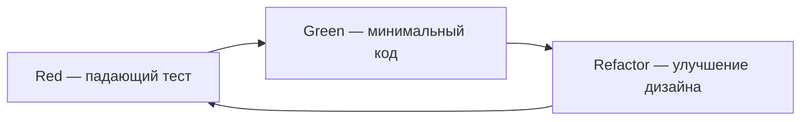

# Extreme Programming, TDD и BDD

<div class="article-tags">
  <span class="tag tag-required">ОБЯЗАТЕЛЬНО</span>
  <span class="tag tag-beginner">ДЛЯ НОВИЧКОВ</span>
</div>

<span class="complexity-badge">Разработчику</span>

<div class="callout callout--info">
  <div class="callout-title">Связь с другими статьями</div>
  <div class="callout-body">
  Обзор Agile — <a href="/encyclopedia/7-project/7-03-metodologiya-i-zhiznennyy-tsikl-po/3">глава 3</a>.
  Выбор процесса — <a href="/encyclopedia/7-project/7-03-metodologiya-i-zhiznennyy-tsikl-po/4">глава 4</a>.
  Тестирование — <a href="/encyclopedia/7-project/7-05-testirovanie/intro">раздел 7-05</a>.
  Рефакторинг — <a href="/encyclopedia/4-code-dev/4-02-chto-takoe-kod-i-kak-on-rabotaet/612">Фаулер</a>.
  </div>
</div>

---

## Extreme Programming (XP)

**XP** (Extreme Programming) — набор инженерных практик Agile, описанных **Kent Beck**. Идея: довести полезные приёмы (тесты, ревью, частые релизы) до **системной** дисциплины команды, а не оставлять их на усмотрение отдельных разработчиков.

XP появился в конце 1990-х на проектах с высокой неопределённостью требований. Сегодня отдельные практики XP (TDD, CI, pairing) используют и в Scrum-, и в Kanban-командах без формального "мы делаем XP".

### Практики XP

| Практика | Смысл | Связь с энциклопедией |
|----------|--------|------------------------|
| **TDD** | Сначала тест, потом код | Эта статья, [уровни тестов](./131) |
| **Pair programming** | Два разработчика на одной задаче | [Онбординг](/encyclopedia/7-project/7-17-nachalo-raboty-na-proekte/7) |
| **Continuous integration** | Частая сборка и интеграция в общую ветку | [DevOps CI/CD](/encyclopedia/8-infra-security/8-04-devops-ci-cd/intro) |
| **Refactoring** | Улучшение структуры без смены поведения | [Фаулер](/encyclopedia/4-code-dev/4-02-chto-takoe-kod-i-kak-on-rabotaet/612) |
| **Small releases** | Маленькие поставки в production | [DoD](/encyclopedia/7-project/7-25-dostavka-i-gotovnost/2) |
| **Coding standards** | Единый стиль кода | [7.10](/encyclopedia/7-project/7-10-kultura-koda/intro) |
| **Collective ownership** | Любой может править любой модуль (с review) | Code review, bus factor |
| **Sustainable pace** | Работа без хронического переработа | [Культура команды](/encyclopedia/7-project/7-02-komanda-i-upravlenie/2) |
| **On-site customer** | Заказчик доступен для вопросов | [PO](/encyclopedia/7-project/7-19-produktovye-roli/1) |
| **Metaphor** | Общий язык архитектуры для команды | [ADR](/encyclopedia/7-project/7-20-adr-i-arhitekturnaya-pamyat/1) |

XP **не требует** ролей Scrum (Scrum Master, Product Owner в каноническом виде). Сочетается со [Scrum](/encyclopedia/7-project/7-14-scrum/intro) или [Kanban](/encyclopedia/7-project/7-18-kanban/intro): Scrum задаёт ритм, XP — инженерное качество.

### Ценности XP

| Ценность | На практике |
|----------|-------------|
| **Communication** | Pairing, standup, общие стандарты |
| **Simplicity** | YAGNI — не пишем лишнего |
| **Feedback** | TDD, CI, частые релизы |
| **Courage** | Рефакторинг, честная оценка |
| **Respect** | Review без токсичности |

<div class="callout callout--tip">
  <div class="callout-title">С чего начать XP в команде</div>
  <div class="callout-body">
  Не внедряйте все практики сразу. Типичная последовательность: CI → coding standards → TDD на критичном модуле → pairing на сложных задачах → small releases.
  </div>
</div>

---

## TDD — Test-Driven Development

**TDD** — разработка через тесты. Вы **сначала** описываете желаемое поведение в тесте, **потом** пишете минимальный код, **затем** улучшаете дизайн.

### Цикл Red → Green → Refactor



**1. Red** — написать **падающий** тест на желаемое поведение.

Тест должен падать по **правильной** причине (нет реализации), а не из-за синтаксической ошибки.

**2. Green** — написать **минимальный** код, чтобы тест прошёл.

Не добавляйте функциональность "на будущее". Цель — зелёные тесты, не красота.

**3. Refactor** — улучшить структуру кода; тесты остаются зелёными.

Удалить дублирование, переименовать, вынести методы. [Рефакторинг](/encyclopedia/4-code-dev/4-02-chto-takoe-kod-i-kak-on-rabotaet/612) безопасен, потому что тесты страхуют.

### Пример на псевдокоде: калькулятор скидки

**Red** — тест:

```javascript
test('скидка 10% для суммы от 1000', () => {
  expect(calculateDiscount(1000)).toBe(100);
});
```

Запуск → FAIL (функции нет).

**Green** — минимум:

```javascript
function calculateDiscount(amount) {
  if (amount >= 1000) return amount * 0.1;
  return 0;
}
```

Запуск → PASS.

**Refactor** — константа, граничные случаи:

```javascript
const DISCOUNT_THRESHOLD = 1000;
const DISCOUNT_RATE = 0.1;

function calculateDiscount(amount) {
  if (amount >= DISCOUNT_THRESHOLD) {
    return amount * DISCOUNT_RATE;
  }
  return 0;
}
```

Добавить тесты на 999, 0, отрицательные значения — снова цикл Red-Green-Refactor.

### Результаты TDD

- **Спецификация** поведения в коде тестов — живой документ.
- **Меньше лишней** реализации — пишете только то, что требует тест.
- **Безопасный рефакторинг** — регрессия ловится за секунды в CI.
- **Лучший дизайн** — тестируемый код обычно с меньшей связностью.

### Где TDD особенно полезен

| Область | Почему |
|---------|--------|
| Деньги, налоги, комиссии | Ошибка дорого стоит |
| Права доступа, RBAC | Много граничных случаев |
| Парсинг, валидация | Табличные тесты |
| Доменная логика без UI | Быстрый feedback loop |
| Баг-фикс | Regression test сначала |

### Где TDD применять осторожно

| Область | Альтернатива |
|---------|--------------|
| Прототип UI "посмотреть как выглядит" | Ручная проверка, потом тесты |
| Исследование API без документации | Spike, потом TDD на стабильном API |
| Одноразовый скрипт миграции | Smoke-тест на копии данных |
| Legacy без тестов | Characterization tests, потом TDD на новом коде |

Уровни тестов — [unit, integration, E2E](./131). Практика на учебной задаче — [лабораторный кейс TDD](/lab/Кейсы/7).

### TDD и coverage

**Coverage** (покрытие строк/веток) — метрика, а не цель. TDD часто даёт высокое покрытие **доменной** логики, но:

- 100% coverage не гарантирует отсутствие багов;
- тесты "ради процента" после кода — **не** TDD;
- в [DoD](/encyclopedia/7-project/7-25-dostavka-i-gotovnost/2) разумно указать порог для критичных модулей, а не для всего репозитория.

---

## BDD — Behavior-Driven Development

**BDD** — описание поведения системы на языке, понятном бизнесу, аналитику и QA. Часто используют формат **Gherkin** (Given-When-Then).

BDD не заменяет TDD: TDD — на уровне unit-тестов разработчика; BDD — на уровне **сценариев приёмки**, которые могут автоматизироваться и читаться на ревью.

### Структура сценария Gherkin

```gherkin
Feature: Создание заявки
  Как авторизованный пользователь
  Я хочу создать заявку
  Чтобы отправить её на согласование

  Scenario: Успешное создание черновика
    Given пользователь авторизован
    And баланс счёта не менее 1000
    When он создаёт заявку на сумму 1000
    Then заявка в статусе "Черновик"
    And сумма заявки равна 1000

  Scenario: Отказ при недостаточном балансе
    Given пользователь авторизован
    And баланс счёта 500
    When он создаёт заявку на сумму 1000
    Then отображается ошибка "Недостаточно средств"
    And заявка не создана
```

### Ключевые слова Gherkin

| Ключевое слово | Назначение |
|----------------|------------|
| **Feature** | Группа связанных сценариев |
| **Scenario** | Один конкретный случай |
| **Given** | Предусловия (контекст) |
| **When** | Действие пользователя или системы |
| **Then** | Ожидаемый результат |
| **And / But** | Продолжение Given/When/Then |
| **Background** | Общие Given для всех сценариев |
| **Scenario Outline** | Параметризованные сценарии с Examples |

### Scenario Outline — табличные примеры

```gherkin
Scenario Outline: Валидация email
  When пользователь вводит email "<email>"
  Then результат валидации "<result>"

  Examples:
    | email              | result  |
    | user@example.com   | valid   |
    | invalid            | invalid |
    | user@              | invalid |
```

### Инструменты BDD

| Инструмент | Стек |
|------------|------|
| **Cucumber** | Java, JS, Ruby и др. |
| **SpecFlow** | .NET |
| **pytest-bdd** | Python |
| **Behave** | Python |
| **Cypress + cucumber** | E2E веб |

Связь с [acceptance criteria](/encyclopedia/7-project/7-04-analitika/116) и [техниками тест-дизайна](/encyclopedia/7-project/7-05-testirovanie/127).

### Кто пишет сценарии

| Роль | Участие |
|------|---------|
| **Аналитик / PO** | Формулировка поведения, приоритеты |
| **QA** | Граничные случаи, негативные сценарии |
| **Разработчик** | Связь с step definitions, автоматизация |
| **Бизнес** | Ревью на plain language (three amigos) |

**Three amigos** — короткая встреча PO + dev + QA перед разработкой фичи: согласовать сценарии до кода.

<div class="callout callout--warning">
  <div class="callout-title">Антипаттерн BDD</div>
  <div class="callout-body">
  Gherkin-файлы, которые <strong>никто не читает</strong> на планировании и которые дублируют технические детали UI — дорогая декорация. Сценарий должен описывать <strong>поведение</strong>, а не клики по xpath.
  </div>
</div>

### Хороший и плохой сценарий

**Плохо** (слишком технически):

```gherkin
When пользователь кликает #submit-btn
Then div.error.visible == true
```

**Хорошо** (поведение):

```gherkin
When пользователь отправляет форму без обязательного поля "Email"
Then отображается сообщение "Укажите email"
And форма не отправлена
```

---

## Pair programming

**Pair programming** — два разработчика работают над одной задачей за одним рабочим местом (или в shared IDE / screen share).

### Роли

| Роль | Делает |
|------|--------|
| **Driver** | Пишет код, управляет клавиатурой |
| **Navigator** | Думает о дизайне, замечает ошибки, ищет edge cases |

Роли меняют каждые 20–40 минут.

### Форматы

| Формат | Когда |
|--------|-------|
| **Classic pairing** | Сложная логика, онбординг |
| **Strong-style** | Navigator говорит что делать, driver только печатает — для обучения |
| **Mob programming** | Вся команда на одной задаче — редкие архитектурные решения |
| **Async pairing** | PR + быстрые созвоны — для удалённых команд |

### Польза

- меньше дефектов и bus factor;
- быстрый онбординг junior ([7.17/7](/encyclopedia/7-project/7-17-nachalo-raboty-na-proekte/7));
- общее владение кодовой базой;
- живое code review.

### Когда pairing уместен

- новый модуль или незнакомый стек;
- критичная бизнес-логика (деньги, безопасность);
- первые недели нового сотрудника;
- застряли на баге больше 2 часов — второй взгляд.

### Когда pairing не обязателен

- мелкие правки по одному файлу;
- рутинные задачи с готовым шаблоном;
- исследование, где нужна тишина (потом — короткий sync).

<div class="callout callout--warning">
  <div class="callout-title">Pairing как слежка</div>
  <div class="callout-body">
  Если senior сидит с junior только чтобы "контролировать" без объяснений — ломается <a href="/encyclopedia/7-project/7-02-komanda-i-upravlenie/2">психологическая безопасность</a>. Pairing — совместное решение задачи, а не надзор.
  </div>
</div>

---

## Когда внедрять практики

| Практика | Рекомендуемый момент | Минимум для старта |
|----------|---------------------|-------------------|
| **CI** | С [первого дня](/encyclopedia/7-project/7-17-nachalo-raboty-na-proekte/4) проекта | Сборка + unit-тесты на push |
| **TDD** | С критичной доменной логики | Один модуль как pilot |
| **Pair programming** | Сложные модули, онбординг junior | 2–4 часа в неделю на пару |
| **BDD** | Когда PO и QA читают сценарии на ревью | 1 feature end-to-end |
| **Small releases** | После базового CI и stage | Релиз раз в 2 недели |
| **Refactoring** | Постоянно, в рамках задачи | Правило boy scout |
| **Coding standards** | До второго PR в репо | Linter в CI |

Цель — не "100% TDD на всё", а **осознанное** покрытие рискованных зон.

### Дорожная карта внедрения (пример для команды из 5 dev)

**Неделя 1–2**

- CI: build + test на каждый PR.
- ESLint/Prettier или аналог в [культуре кода](/encyclopedia/7-project/7-10-kultura-koda/1).

**Неделя 3–4**

- TDD pilot на модуле `billing` или `auth`.
- DoD: новая доменная логика — unit-тесты.

**Месяц 2**

- BDD: один user story с Gherkin в репо, автотест в CI.
- Pairing: ротация на сложных тикетах.

**Месяц 3+**

- Small releases по расписанию.
- Retrospective: что из XP оставить, что упростить.

---

## Антипаттерны

| Антипаттерн | Почему плохо | Что делать |
|-------------|--------------|------------|
| Тесты **после** кода ради coverage | Не ловит design flaws | TDD на новом коде |
| BDD-декорация | Затраты без согласования | Three amigos, читаемые сценарии |
| Pairing как слежка | Выгорание junior | Ротация, обучающий тон |
| TDD на всё включая UI layout | Медленно, хрупко | E2E выборочно, unit на логику |
| Зелёные тесты без assert | Ложное спокойствие | Review тестов как кода |
| Refactor без тестов | Новые баги | Сначала characterization test |
| CI красный "потом починим" | Ломает доверие | Fix or revert в тот же день |

---

## Связь с Definition of Done

[DoD](/encyclopedia/7-project/7-25-dostavka-i-gotovnost/2) команды может включать:

- доменная логика покрыта unit-тестами;
- критичные сценарии описаны в BDD и проходят в CI;
- нет merge без зелёного pipeline;
- pairing или review для критичных модулей;
- нет нового кода без обновления документации API ([OpenAPI](/encyclopedia/7-project/7-09-bazy-znaniy-i-zadachniki/23)).

Пример фрагмента DoD:

```markdown
- [ ] Unit-тесты для новой доменной логики
- [ ] Gherkin-сценарии для AC из тикета (если есть)
- [ ] CI green
- [ ] Code review от 1+ разработчика
```

---

## Примеры из практики

### Пример 1. Модуль расчёта НДС

- TDD: таблица ставок, округление, граничные суммы.
- BDD: сценарий "счёт-фактура для юрлица" для QA и бухгалтерии.
- Pairing: junior + senior на первом релизе модуля.

### Пример 2. REST API заказов

- TDD: сервисный слой, моки репозитория.
- BDD: `Feature: Оформление заказа` — автотест через HTTP.
- CI: unit + integration + smoke BDD на stage.

### Пример 3. Legacy без тестов

- Не TDD на старый код сразу.
- Characterization test на текущее поведение.
- Новые фичи — только через TDD в новых классах.

---

## FAQ

**TDD замедляет разработку?**

На первых неделях — да. На горизонте месяцев экономит время на отладку и регрессии. На критичной логике окупается быстрее.

**Нужен ли TDD, если есть QA?**

Да, роли разные. Unit-тесты от dev — быстрый feedback; QA — integration, E2E, exploratory ([100](./100)).

**BDD без автоматизации имеет смысл?**

Да, как согласованные AC в Gherkin, даже если step definitions появятся позже.

**Pair programming для удалённых команд?**

Да: VS Code Live Share, JetBrains Code With Me, Zoom + shared control. Важны таймбоксы и смена ролей.

**XP без Scrum возможен?**

Да. Kanban + XP-практики — распространённая связка.

**Как убедить менеджера в pairing?**

Метрики: меньше багов на review, быстрее онбординг, меньше блокеров "единственный кто знает модуль".

---

## См. также

- [Agile — гибкая методология](./3)
- [Как выбрать процесс под контекст](./4)
- [Основы тестирования](./1)
- [Уровни тестирования](./131)
- [Acceptance criteria](/encyclopedia/7-project/7-04-analitika/116)
- [DevOps CI/CD](/encyclopedia/8-infra-security/8-04-devops-ci-cd/intro)
- [Лабораторный кейс TDD](/lab/Кейсы/7)

---
