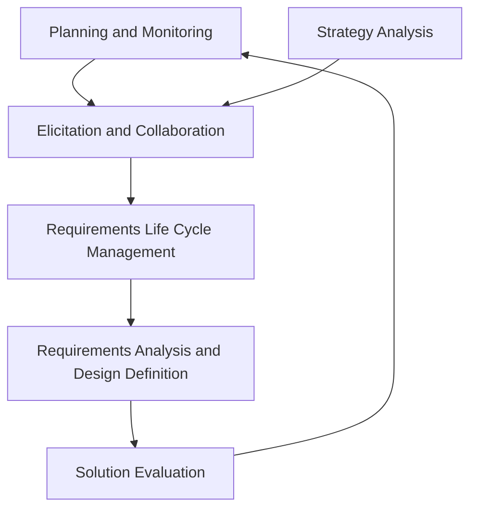

# Профессиональная аналитика

  ОБЯЗАТЕЛЬНО
  ДЛЯ НОВИЧКОВ

Аналитику
Архитектору
Руководителю
Техническому писателю

  
Теория данных (раздел 3)

  

  ERD — [Entity Relationship](/encyclopedia/3-data-markup/3-05-osnovy-baz-dannyh/11); SQL — [SQL для аналитики](./1122), [SQL](/encyclopedia/3-data-markup/3-07-sql/intro); миграции — [Пакетная работа](/encyclopedia/3-data-markup/3-11-analiz-dannyh/433). Полная таблица — [о разделе](./intro).
  

После [Основы анализа требований](/encyclopedia/7-project/7-04-analitika/111) — **чем занимается аналитик в проекте**: роли, сбор требований, модели, передача в разработку.

> Остановитесь после "Виды аналитиков" и отметьте свою траекторию — от неё зависит, какие главы читать дальше.

---

## Профессиональная аналитика

### Роль аналитика - связь бизнеса и разработки

Заказчик говорит: "Сделайте как в 1С, только отчёт сам уходит и кнопка красная". Разработчик берёт и делает красную кнопку, которая высылает ерунду. Потому что заказчик без деталей, сказал как понимает, он ведь не умеет говорить по-технически. А разработчик мысли тоже читать не умеет.

Для этого нанимают аналитика. Он говорит с заказчиком, вытаскивает из него правду, задаёт правильные вопросы (кому? когда? в каком формате? что делать?). Заказчик даже сам не знает ответы, пока аналитик не задаст глупые вопросы.

Аналитик формализует хаос в понятные структуры - рисует BPMN-схемы, пишет требования, и делает глоссарий (чтобы все друг друга понимали). Потом согласует с заказчиком и разработкой, чтобы потом не оказалось "я думал", "вы не так поняли" и прочее.

Задача в итоге переходит к разработчику с чёткими критериями и всеми деталями. Если в ТЗ всплывают классы, API или «как это станет кодом» — см. [технический дизайн](/encyclopedia/7-project/7-04-analitika/128) и базовую теорию [4.02 Код](/encyclopedia/4-code-dev/4-02-chto-takoe-kod-i-kak-on-rabotaet/intro).

Аналитик берет на себя весь тяжкий труд общения с заказчиком, пережёвывает это в понятную разработчикам детальщину и гарантирует, что все друг друга поняли.

---

### Анализ требований - до кода и оценки сроков

Разработка программного обеспечения — это проектирование сложной социо-технической системы, в которой технологическое решение должно точно соответствовать реальным потребностям бизнеса, пользователей и окружающей среды. Однако потребности эти редко поступают в виде чётких, непротиворечивых и структурированных требований. Чаще они разрознены, частично скрыты, сформулированы в терминах доменной области или выражены через боли, которые заказчик даже не осознаёт как системные. 

Именно поэтому в ИТ-проектах необходима промежуточная инженерная роль — **аналитик**, чья задача — трансформировать неструктурированную, часто эвристическую информацию в формализованную модель требований.

Без профессионального анализа возникает **дизайн без замысла**: разработчики конструируют систему, опираясь на собственное воображение, упрощённые интерпретации или фрагментарные указания. Это приводит к многочисленным итерациям, несоответствию продукта целям, избыточным функциям, высокой стоимости поддержки и, в конечном итоге, к провалу проекта. Анализ — это систематическая деятельность, направленная на **понимание**, **формализацию** и **валидацию** того, что должно быть построено, зачем и как оно будет использоваться.

---

### Что такое аналитика в IT?

В ИТ-контексте термин "аналитика" употребляется в двух принципиально разных смыслах, что часто вызывает путаницу.

1. **Аналитика как результат** — это готовые данные, представленные в виде отчётов, дашбордов, метрик и визуализаций, которые служат основой для принятия решений. Пример: "аналитика продаж за квартал", "аналитика поведения пользователей в приложении". В этом случае подразумевается, что система уже существует, собирает данные и автоматически или с участием специалиста по данным (Данные analyst) производит их обработку.

2. **Аналитика как процесс** — это профессиональная инженерная деятельность по исследованию, структурированию, интерпретации и моделированию информации с целью выявления и формализации требований к будущей системе. Эта деятельность осуществляется до и в начале разработки и является предпосылкой для создания работающего решения.

Настоящая глава посвящена **аналитике как процессу** — той деятельности, которая обеспечивает корректную постановку задачи для всех последующих этапов ИТ-проекта.

---

### Аналитическое мышление

Профессиональный анализ невозможен без развитого **аналитического мышления** — когнитивной способности разлагать сложные явления на составляющие, выявлять взаимосвязи, сопоставлять гипотезы с фактами и делать логически обоснованные выводы. Аналитическое мышление включает в себя несколько ключевых компонентов:

- **Системное мышление** — способность видеть объект как целостную систему с внутренними связями и внешними взаимодействиями. Системное мышление позволяет понимать, как изменение одного компонента повлияет на другие, а также учитывать влияние внешней среды (рынка, регуляторики, технологий).
  
- **Критическое мышление** — умение подвергать сомнению исходные утверждения, выявлять предпосылки, проверять логическую целостность аргументов и избегать когнитивных искажений (например, эффекта подтверждения или ложного консенсуса).

- **Внимание к деталям** — способность замечать несоответствия, пробелы, двусмысленности и скрытые допущения в информации, получаемой от заинтересованных сторон.

- **Методичность** — строгое следование проверенным процедурам сбора, обработки и верификации информации, что обеспечивает воспроизводимость и прозрачность аналитического процесса.

Эти когнитивные навыки становятся основой для применения конкретных техник анализа и моделирования.

---

### Техники анализа и моделирования

Профессиональный аналитик оперирует широким арсеналом методов, каждый из которых служит определённой цели: от стратегического позиционирования до детального проектирования процессов.

---

### Шесть областей знаний BABOK

*BABOK Guide v3* делит работу BA на **шесть областей знаний**. Каждая состоит из задач с входами, результатами и техниками:

| Область | Фокус |
| :--- | :--- |
| **Planning and Monitoring** | План подхода, стейкхолдеры, governance, информация, оценка эффективности BA |
| **Elicitation and Collaboration** | Сбор информации, прототипы, workshops, согласования |
| **Requirements Life Cycle Management** | Трассировка, приоритизация, change control, базовые линии |
| **Strategy Analysis** | Текущее и будущее состояние, риски, бизнес-кейс изменений |
| **Requirements Analysis and Design Definition** | Структурирование, модели, спецификации, design options |
| **Solution Evaluation** | Метрики после внедрения, барьеры ценности, рекомендации |

Шесть **концептов** (needs, value, stakeholders…) — в [Роль бизнес-аналитика в проекте](/encyclopedia/7-project/7-04-analitika/113#шесть-концептов-бизнес-анализа-babok). Планирование и приоритизация — в [Формализация и управление требованиями](/encyclopedia/7-project/7-04-analitika/116).

---

### Тип проекта и фокус BA

Один и тот же набор техник BABOK применяется по-разному в зависимости от **типа проекта**:

| Тип | Характер | Фокус BA |
| :--- | :--- | :--- |
| **Хранилище данных (DWH/BI)** | Крупный, часто enterprise-wide | Источники данных, grain витрин, self-service для бизнеса, обучение пользователей |
| **Улучшение процессов** | As-is/to-be, часто без «большого кода» | BPMN, регламенты, оргизменения, KPI процесса |
| **Инфраструктурный / платформенный** | Спонсируется IT | Влияние на UX смежных систем, обучение, ожидания внешних стейкхолдеров |
| **Веб / цифровой продукт** | Клиентоориентированный | Приоритизация фич, прототипы, usability, security, UAT |

Перед elicitation полезно явно назвать тип — от этого зависят шаблоны артефактов и глубина NFR.

---

### Матрица «цель → метод»

Метод выбирают под **задачу**, а не «потому что так принято в компании»:

| Цель анализа | Подходящие методы |
| :--- | :--- |
| Улучшить **существующий** сайт или приложение | Продуктовая аналитика, логи, heatmap, A/B |
| Понять **аудиторию** нового продукта | Интервью, **карта эмпатии**, персоны |
| **Стратегия** и конкурентная позиция | SWOT, PESTLE, MOST |
| **Процесс** as-is/to-be | BPMN, gap analysis, workshop |
| Структурировать **хаос идей** на старте | Mind map, brainstorming |
| **Сложная система** с множеством связей | Системный анализ, декомпозиция |

**Карта эмпатии** фиксирует, что пользователь думает, видит, слышит, говорит и делает, а также его «боли» и «выгоды». Её удобно строить на workshop вместе со стейкхолдерами перед прототипированием — см. [Прототипирование интерфейсов и сценариев](/encyclopedia/7-project/7-04-analitika/125).

---

#### SWOT, PESTLE, MOST — анализ внешнего и внутреннего контекста

Эти фреймворки используются на ранних стадиях проекта для понимания окружения, в котором будет функционировать система. Они отвечают на вопрос "зачем система нужна и каковы её условия существования?".

- **SWOT** (Strengths, Weaknesses, Opportunities, Threats) — анализ сильных и слабых сторон организации (внутренние факторы) в сочетании с возможностями и угрозами внешней среды. Позволяет выявить стратегические цели, которые система должна поддерживать.

- **PESTLE** (Political, Economic, Social, Technological, Legal, Environmental) — макроанализ внешних факторов, влияющих на бизнес. Особенно важен при разработке решений для регулируемых отраслей (финансы, здравоохранение, энергетика).

- **MOST** (Mission, Objectives, Strategies, Tactics) — внутреннее стратегическое выравнивание. Проверяет, соответствуют ли тактические действия (включая разработку ИТ-системы) общей миссии и стратегии компании.

Эти методы редко используются в чистом виде в повседневной работе аналитика, но их структура помогает формировать первичный контекстный фрейм, который снижает риск разработки без учёта контекста бизнеса и отрасли.

---

#### Mind Mapping (ментальные карты) — структурирование неструктурированного

Ментальные карты — это визуальный инструмент организации мышления. В отличие от линейного текста, карта отражает иерархические и ассоциативные связи между идеями. Аналитик использует их для:

- фиксации первоначальных идей в ходе интервью или мозгового штурма;
- выявления ключевых категорий предметной области;
- построения "карт знаний" по доменной области;
- подготовки структуры требований или пользовательских историй.

Хотя ментальные карты не являются формальным артефактом спецификации, они служат мощным когнитивным протезом для аналитика — особенно на стадии погружения в новую предметную область.

---

#### Дизайн процесса (BPMN) — визуализация автоматизируемого поведения

Когда речь идёт о системах, автоматизирующих бизнес-процессы (например, BPM-системы, ERP, CRM), ключевым артефактом становится **диаграмма бизнес-процесса**. Стандарт BPMN (Business Process Model and Notation) предоставляет унифицированный язык для описания:

- последовательности операций;
- участников (ролей и систем);
- точек принятия решений;
- исключений и компенсаций;
- интеграционных интерфейсов.

Для разработчика BPMN-диаграмма — это **выполняемая или как минимум проверяемая модель**. Она становится основой для настройки workflow-движков (включая такие платформы, как ELMA365 или BPMSoft). Более того, корректно построенная BPMN-модель позволяет заранее оценить сложность реализации, выявить потенциальные "узкие места" и согласовать логику с заказчиком без написания ни строчки кода.

---

### Системный анализ и требования — глубины понимания

Системный анализ — это ядро профессиональной аналитики в ИТ. Он направлен на выявление **функциональных и нефункциональных требований** к системе, а также на построение модели её поведения, структуры и взаимодействий. Важно различать **уровни глубины анализа**, которые зависят от характера проекта, его критичности и доступных ресурсов:

1. **Стратегический уровень** — определение целей системы, её места в бизнес-архитектуре, ключевых показателей эффективности (KPI). Здесь важны фреймворки вроде SWOT или MOST.

2. **Тактический уровень** — моделирование процессов, ролей, данных и правил. Именно на этом уровне применяются BPMN, use-case-диаграммы, глоссарии предметной области.

3. **Операционный уровень** — детальная проработка интерфейсов, логики валидации, алгоритмов, интеграционных контрактов. Часто выполняется совместно с архитектором или старшим разработчиком, но инициируется аналитиком.

Глубина анализа не должна быть ни избыточной (что ведёт к бюрократии и задержкам), ни недостаточной (что порождает неопределённость и переделки). Профессиональный аналитик умеет **адаптировать уровень детализации** под стадию проекта, риски и команду.

---

### Кто такой аналитик в ИТ?

Аналитик — это инженер, специализирующийся на **переводе доменных задач в технические спецификации**. Он выступает в роли **лингва-франка** между бизнесом и разработкой. Его основная ответственность — гарантировать, что система, которую строят разработчики, действительно решает ту проблему, ради которой она создавалась.

---

#### Почему аналитика критична для успеха проекта?

Разработчики — профессионалы в области реализации, а не в области понимания бизнес-контекста. Они могут писать код без аналитика, но:

- велика вероятность реализации **неверных или неполных требований**;
- разработка будет идти **итеративно и хаотично**, без чёткого направления;
- возникнет **избыточная сложность**, так как каждый разработчик будет интерпретировать задачу по-своему;
- тестирование будет затруднено, поскольку не будет чёткого ожидаемого поведения.

Аналитик снижает **энтропию коммуникации**. Он формализует требования, устраняет противоречия, согласовывает приоритеты и обеспечивает **единый источник истины** для всей команды.

---

### Виды аналитиков

В зависимости от фокуса и глубины взаимодействия с доменом и технологией выделяют несколько ролей:

- **Бизнес-аналитик (Business Analyst, BA)** — работает на стыке бизнеса и ИТ. Его главная задача — понять бизнес-цели, процессы и потребности пользователей и перевести их в требования. Часто не вникает в технические детали реализации.

- **Системный аналитик (Systems Analyst)** — более технически ориентированная роль. Он проектирует архитектуру взаимодействия компонентов, моделирует потоки данных, определяет интеграционные точки. Системный аналитик часто участвует в проектировании API, баз данных и микросервисов.

- **Продуктовый аналитик (Product Analyst)** — фокусируется на поведении пользователей в уже работающем продукте. Использует инструменты аналитики (Amplitude, Mixpanel, Google Analytics) для выявления точек роста и оптимизации user experience.

- **Data Analyst / Аналитик данных** — работает с массивами данных, строит отчёты, метрики, прогнозные модели. Его деятельность относится к аналитике как результату, а не как процессу проектирования.

В небольших командах функции BA и системного аналитика часто совмещаются в одном лице. В крупных проектах — разделяются для повышения экспертизы.

---

### Предметная область и её освоение

**Предметная область** (domain) — это совокупность знаний, правил, терминов, процессов и сущностей, характерных для конкретной сферы деятельности (например, страхование, логистика, медицина, производство). Именно в рамках предметной области формулируются бизнес-требования.

Разработчики, как правило, **не погружаются глубоко в предметную область** по нескольким причинам:

1. **Ограниченность времени и ресурсов** — их основная задача — реализация, а не изучение домена.
2. **Профессиональная специализация** — их экспертиза сосредоточена на технологиях, а не на бизнес-процессах.
3. **Риск когнитивной перегрузки** — одновременное освоение домена и решение сложных технических задач снижает эффективность.

Аналитик же **обязан освоить предметную область** на достаточном уровне, чтобы:

- правильно интерпретировать термины и концепции;
- выявлять скрытые бизнес-правила;
- строить корректные модели данных и процессов;
- задавать уточняющие вопросы, которые не приходят в голову разработчикам.

Это не означает, что аналитик должен стать экспертом в медицине или бухгалтерии. Но он должен говорить на языке заказчика и понимать логику его деятельности.

---

### Документирование — не "бумажка", а инженерный артефакт

В профессиональной ИТ-среде **документирование — это часть инженерного процесса**. Хорошая документация:

- фиксирует принятые решения;
- служит основой для тестирования и сдачи;
- обеспечивает преемственность при смене команды;
- ускоряет онбординг новых участников;
- снижает риски, связанные с потерей знаний.

Артефакты аналитика включают:

- **Глоссарий терминов** — устраняет двусмысленность;
- **Модели процессов (BPMN)** — визуализируют логику;
- **Use-case-спецификации** — описывают сценарии взаимодействия;
- **User stories с акцепт-критериями** — если используется agile-подход;
- **Требования к данным и интеграциям** — для архитекторов и разработчиков;
- **Матрицы трассировки** — связывают требования с тестами и задачами.

Документация должна быть **живой**: обновляться по мере уточнения требований, но при этом **контролируемой** — с версионированием и чётким статусом (черновик, согласовано, утверждено).

---

### Техники выявления требований — от хаоса к структуре

Выявление требований — это **активный процесс исследования**, в ходе которого аналитик взаимодействует с заинтересованными сторонами, анализирует существующие системы и моделирует будущее состояние. Ниже приведены ключевые техники, каждая из которых имеет своё назначение, сильные стороны и ограничения.

---

#### Интервью и опросы

**Индивидуальное интервью** позволяет глубоко погрузиться в точку зрения конкретного стейкхолдера, особенно если речь идёт о ключевом пользователе или эксперте домена. Аналитик задаёт открытые вопросы, уточняет контекст, выявляет скрытые допущения. Формат подходит для получения качественных, а не количественных данных.

**Фокус-группа** (групповое интервью) эффективна, когда необходимо согласовать позиции нескольких ролей (например, бухгалтера, логиста и менеджера по продажам). Динамика группы может породить новые идеи, но также несёт риск доминирования одного участника или "группового мышления".

Анкетирование (в том числе **метод Дельфи**) применяется для сбора количественных данных или получения консенсуса от экспертов при невозможности личной встречи. Метод Дельфи предполагает несколько раундов анонимного анкетирования с обратной связью по итогам каждого раунда, что позволяет сойтись к обоснованному мнению без давления авторитетов.

---

#### Мозговой штурм и ролевые техники

**Мозговой штурм** ориентирован на генерацию идей без критики на начальном этапе. Его цель — выйти за рамки текущих решений. Однако для перехода от идей к требованиям необходим последующий этап отбора и структурирования.

**Ролевая игра** (role-playing) заставляет участников "примерить" на себя роли пользователей или систем. Это особенно полезно при проектировании интерфейсов или сложных сценариев взаимодействия (например, обработка чрезвычайной ситуации). Через симуляцию выявляются неочевидные исключения и edge-кейсы.

---

#### Сценарные и визуальные методы

**Раскадровка** (storyboarding) — пошаговое описание пользовательского сценария в виде последовательности кадров или описаний. Позволяет визуализировать user journey, включая эмоции, действия и системные ответы. Часто используется в UX-анализе, но применима и в бизнес-анализе.

**Прототипирование** — создание упрощённой модели интерфейса, процесса или системы. Прототип может быть бумажным, интерактивным (в Figma, Adobe XD) или даже функциональным (low-code mock). Главная цель — **ранняя валидация** гипотез с пользователями без затрат на разработку.

---

#### Анализ существующих артефактов

**Сбор и анализ документации** — изучение регламентов, инструкций, нормативных актов, старых ТЗ. Позволяет понять, как процесс описан "на бумаге", даже если в реальности он отличается.

**Анализ функций существующей системы** — реверс-инжиниринг текущего решения. Особенно важен при миграциях, реинжиниринге или интеграциях. Анализ может включать просмотр логов, трассировку вызовов, интервью с пользователями о "как на самом деле работает".

**Извлечение данных** — работа с дашбордами, отчётами, SQL-запросами, логами. Этот метод ближе к Данные-driven подходу и позволяет подтвердить или опровергнуть гипотезы количественно (например, "90% заказов создаются в первой половине дня").

---

#### Интроспекция

Редко упоминаемый, но важный метод — **самостоятельное размышление аналитика**. Интроспекция не заменяет сбор данных, но помогает сформулировать гипотезы, выстроить логические цепочки, заметить противоречия. Профессиональный аналитик постоянно "прокручивает" информацию в уме, даже вне формальных сессий.

Эффективность выявления требований определяется **целенаправленным подбором** методов под тип проблемы, аудиторию и контекст.

---

### Стратегия анализа и оценка затрат

Анализ требует **чёткой стратегии**, которая включает:

- определение **границ исследования** (что входит, что нет);
- выбор **уровня детализации** (high-level vs. detailed);
- планирование **итераций** (особенно в agile-среде);
- оценку **ресурсов**: времени, экспертов, инструментов.

Затраты на анализ измеряются в **человеко-часах**, но их нельзя рассматривать изолированно. Инвестиции в качественный анализ **снижают общую стоимость проекта** за счёт:

- сокращения количества переделок;
- уменьшения числа дефектов на этапе тестирования;
- повышения скорости разработки (ясные требования = меньше ожиданий и уточнений);
- снижения рисков срыва сроков.

Оценка часто строится на основе **аналогов** (предыдущих проектов) или **моделей сложности** (например, количество процессов × средняя сложность × коэффициент неопределённости).

---

### Как организовать процесс анализа

Процесс анализа должен быть **структурирован, но гибок**. Рекомендуемая последовательность:

1. **Инициация** — понимание целей проекта, определение ключевых стейкхолдеров, сбор первичного контекста (через PESTLE, SWOT и т.п.).
2. **Погружение** — интервью, анализ документов, изучение предметной области, построение глоссария.
3. **Моделирование** — создание BPMN-диаграмм, use-case-моделей, прототипов.
4. **Согласование** — презентация моделей заказчику, фиксация обратной связи, уточнение требований.
5. **Формализация** — документирование в виде спецификаций, user stories, матриц трассировки.
6. **Передача в разработку** — проведение аналитических сессий с командой, ответы на уточняющие вопросы.
7. **Сопровождение** — участие в refinement, уточнение требований по ходу реализации.

В agile-проектах этапы 3–6 повторяются итеративно в рамках каждого спринта. В waterfall — выполняются последовательно и завершаются фазой утверждения.

---

### Сдача анализа — передача ответственности

"Сдача анализа" — это не просто отправка документа по email. Это **формальный переход ответственности** от аналитика к разработчикам и тестировщикам. Для этого необходимы:

- **Чёткие акцепт-критерии** — что считается "готовым" требованием;
- **Утверждение ключевыми стейкхолдерами** — подпись, согласование в системе управления требованиями (например, Jira, Confluence, Polarion);
- **Проведение аналитической сессии** — "walkthrough" с командой разработки, где аналитик объясняет логику, контекст и граничные случаи;
- **Наличие обратной связи** — механизм, позволяющий разработчикам оперативно задавать уточняющие вопросы.

Только после этого аналитик может считать свою часть работы завершённой. Однако в реальности он остаётся "гарантом смысла" до тех пор, пока требование не реализовано и не принято заказчиком.

---

### Краткий итог

| Тема | Статья |
| :--- | :--- |
| BA | [Роль бизнес-аналитика в проекте](/encyclopedia/7-project/7-04-analitika/113) |
| SA | [Роль системного аналитика в разработке](/encyclopedia/7-project/7-04-analitika/114) |
| Требования | [Формализация и управление требованиями](/encyclopedia/7-project/7-04-analitika/116) |
| BPMN | [Моделирование бизнес-процессов](/encyclopedia/7-project/7-04-analitika/124), [Справочник по нотации BPMN 2.0](/encyclopedia/7-project/7-04-analitika/129) |
| Продукт | [Основы продуктовой аналитики](/encyclopedia/7-project/7-04-analitika/1123) |

---

## Как выглядит сильная аналитическая поставка

Аналитика завершена, когда команда получает не просто документ, а набор артефактов, с которыми можно уверенно запускать разработку и тестирование.

Минимальный состав поставки:

- описание цели и границ изменения;
- словарь ключевых терминов;
- сценарии и исключения по ролям;
- функциональные и нефункциональные требования;
- критерии приемки;
- список рисков и открытых вопросов;
- трассировка "требование -> задача -> тест".

Такой комплект снижает потери на уточнениях и снимает спор "мы поняли по-разному".

---

## Антипаттерны в работе аналитика

1. **Документ ради документа**  
   Объемный текст без структуры не помогает разработке.

2. **Один источник требований**  
   Интервью только с одним стейкхолдером редко отражает картину целиком.

3. **Передача без walkthrough**  
   Документ отправлен, но команда не понимает контекст и ограничения.

4. **Преждевременное завершение роли**  
   Аналитик уходит из процесса до реализации, и требования теряют точность в спринтах.

---

## Маршрут для углубления

- Базовая терминология: **[Основы анализа требований](/encyclopedia/7-project/7-04-analitika/111)**.
- Метрики и гипотезы: **[Как переводить бизнес-задачи на язык данных](/encyclopedia/7-project/7-04-analitika/1121)**.
- Работа с данными на практике: **[SQL для аналитики](/encyclopedia/7-project/7-04-analitika/1122)**.

---
