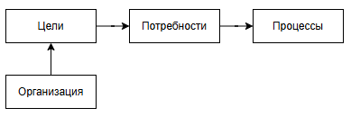

# Роль бизнес-аналитика в проекте

  ОБЯЗАТЕЛЬНО
  ДЛЯ НОВИЧКОВ

Аналитику
Архитектору
Руководителю
Техническому писателю

## Роль бизнес-аналитика в проекте

В современных IT-проектах, особенно в условиях высокой неопределённости, динамично меняющихся рынков и требований заказчиков, роль бизнес-аналитика выходит далеко за рамки простого «сборщика пожеланий». Это центральная фигура, обеспечивающая **смысловую и функциональную связь** между бизнесом и технической реализацией. Бизнес-аналитик — **инженер требований**, **интерпретатор бизнес-реальности** и **гарант того, что разрабатываемое решение действительно решает нужную проблему**.

Для понимания роли бизнес-аналитика необходимо сначала определить, что такое бизнес-анализ как дисциплина, и какую ценность он создаёт в контексте жизненного цикла программного продукта.

---

### Что такое бизнес-анализ?

**Бизнес-анализ** — это дисциплина, направленная на **выявление потребностей заинтересованных сторон**, **формулирование требований к решению**, **оценку возможных вариантов реализации** и **обеспечение соответствия итогового результата бизнес-целям**. Согласно определению из стандарта IIBA (International Institute of Business Analysis), бизнес-анализ — это «практика включения изменений в организации путём определения потребностей и рекомендации решений, которые приносят ценность заинтересованным сторонам».

Бизнес-анализ применим в любых областях, где происходят изменения — от внедрения новых бизнес-процессов до реорганизации структуры компании. Однако в IT-контексте он приобретает особую значимость, поскольку именно здесь ошибки в интерпретации требований приводят к **значительным финансовым потерям**, **удлинению сроков**, **росту технического долга** и **даже провалу продукта**.

Бизнес-анализ — это **способ мышления**: системный, ориентированный на ценность, основанный на доказательствах и вовлечении стейкхолдеров. Эта дисциплина требует как **аналитических**, так и **коммуникативных компетенций**, поскольку ключевая её задача — **перевод бизнес-языка в технический, и наоборот**, без искажений.

---

### Потребность заказчика

**Потребность заказчика** — это то, что ему необходимо для достижения бизнес-цели. Часто заказчик формулирует решение, а не проблему: «Мне нужна кнопка для экспорта в Excel» вместо «Мне нужно быстро получать отчёты в формате, совместимом с офисными приложениями». В этом различии — суть работы бизнес-аналитика.

Потребность может быть:

- **Явной** — чётко сформулированной и осознанной;
- **Неявной** — существующей, но не высказанной, иногда даже не осознаваемой самим заказчиком;
- **Латентной** — не имеющей отношения к текущей задаче, но могущей повлиять на архитектуру или гибкость решения.

Бизнес-аналитик должен уметь различать **реальную потребность** от **предлагаемого решения**, поскольку реализация решения без понимания цели часто приводит к созданию функциональности, которая не приносит ценности. При этом аналитик не должен отвергать предложенные заказчиком решения, а использовать их как **точку входа в диалог**, который позволит раскрыть скрытые требования и контекст.

---

### Понимание рынка и процессов

Бизнес-аналитик работает не в вакууме. Его выводы и рекомендации должны быть основаны на **глубоком понимании как внутренней, так и внешней среды**:

- **Внутренняя среда** включает бизнес-процессы организации, организационную структуру, корпоративную культуру, существующие ИТ-системы, регламенты и ограничения.
- **Внешняя среда** — это рынок, конкуренты, регуляторные требования, тренды, поведение клиентов и технологические возможности.

Понимание процессов — это выявление **целей процесса**, **точек принятия решений**, **источников данных**, **ролей участников**, **метрик эффективности** и **потенциальных узких мест**. Без этого аналитик рискует оптимизировать не ту часть системы или внедрить решение, которое конфликтует с существующими практиками.

Анализ рынка позволяет бизнес-аналитику понимать, какие решения уже существуют, как они устроены, какие у них сильные и слабые стороны, и какое **уникальное предложение** может быть реализовано в рамках проекта. Это особенно важно в продуктоориентированных командах, где конкурентоспособность продукта — ключевой критерий успеха.

---

### Основные задачи бизнес-аналитика

Задачи бизнес-аналитика многогранны и зависят от зрелости организации, типа проекта и жизненного цикла разработки. Однако можно выделить **ядерный набор функций**, которые выполняются в большинстве случаев:

1. **Выявление и анализ требований** — сбор информации от стейкхолдеров, интерпретация, уточнение, верификация.
2. **Моделирование бизнес-логики** — создание абстракций, описывающих поведение системы (диаграммы, сценарии, правила).
3. **Формулирование решений** — предложение альтернатив, оценка их стоимости и ценности.
4. **Управление требованиями** — отслеживание изменений, разрешение конфликтов, поддержание актуальности спецификаций.
5. **Обеспечение согласованности** — сведение разных точек зрения в единую модель, достижение консенсуса.
6. **Оценка рисков и последствий** — прогнозирование влияния решений на бизнес и систему.
7. **Поддержка внедрения и валидации** — участие в тестировании, обучении, мониторинге эффекта от внедрения.

Эти задачи не являются линейными. Они часто повторяются итеративно, особенно в гибких методологиях, где требования уточняются по мере разработки.

---

### Роли бизнес-аналитика: участник, фасилитатор, аналитик

В зависимости от контекста и фазы проекта бизнес-аналитик принимает на себя **разные роли**, каждая из которых требует специфических навыков:

- **Участник** — в этой роли аналитик включён в обсуждение как равноправный член команды, вносит вклад в принятие решений, основываясь на своём понимании требований и ограничений.
- **Фасилитатор** — здесь аналитик выступает как нейтральный модератор, организуя встречи, интервью, воркшопы, помогая стейкхолдерам выразить свои мысли, избегая доминирования одних и подавления других.
- **Аналитик** — в этой роли он сосредоточен на структурировании, анализе, моделировании и документировании информации, выявляя скрытые зависимости, противоречия и возможности оптимизации.

Эффективный бизнес-аналитик должен уметь **плавно переключаться между ролями**, сохраняя при этом объективность и ориентацию на ценность.

### Бизнес-требования: от цели к спецификации

**Бизнес-требования** — это формализованное выражение потребностей организации или заинтересованных сторон, направленное на достижение стратегических или операционных целей. Они отвечают на вопрос: *«Что должно измениться, чтобы бизнес получил ценность?»*

Важно отличать **бизнес-требования** от **функциональных** и **нефункциональных**. Бизнес-требования описывают **цель** и **контекст**, а не техническую реализацию. Например:

- **Бизнес-требование**: «Сократить время обработки заказа клиентом до 5 минут».
- **Функциональное требование**: «Система должна позволять клиенту оформить заказ в три клика».
- **Нефункциональное требование**: «Время отклика интерфейса оформления заказа не должно превышать 800 мс».

Бизнес-требования обычно формулируются на языке бизнеса и должны быть проверяемыми, измеримыми и привязанными к бизнес-метрикам (KPI). Они служат основой для всех последующих уровней детализации.

---

### Бизнес-логика: формализация правил и поведения

**Бизнес-логика** — это совокупность правил, условий, последовательностей действий и ограничений, определяющих, **как система должна вести себя в ответ на внешние или внутренние события**. Это ядро поведенческой модели системы.

Бизнес-аналитик **выявляет логику из практики, регламентов и целей бизнеса**, а затем **формализует** так, чтобы разработчики могли однозначно её реализовать. Формализация может происходить через:

- **Сценарии использования** (Use Кейсы);
- **Правила принятия решений** (Decision Tables, Decision Trees);
- **Состояния и переходы** (State Machines);
- **Потоки данных и контроля** (BPMN, Activity Diagrams).

Ключевая задача аналитика — **избежать неоднозначности**. Например, фраза «если клиент постоянный, дать скидку» не является корректной бизнес-логикой. Нужно уточнить: кто считается постоянным (например, совершивший ≥3 покупки за 6 месяцев), какова величина скидки, распространяется ли она на все товары и т.п.

Бизнес-логика — это **документированная модель**, доступная для проверки, валидации и изменения. Она должна быть отделена от технической реализации, чтобы при изменении архитектуры или стека не терялась суть бизнес-правил.

---

### Бизнес-риски: идентификация и управление неопределённостью

**Бизнес-риски** — это потенциальные события или условия, которые, если произойдут, могут негативно повлиять на достижение целей проекта или бизнеса. В отличие от технических рисков, бизнес-риски связаны с **рынком, поведением пользователей, юридическими аспектами, стратегическими ошибками**.

Примеры бизнес-рисков:
- Низкий уровень принятия нового функционала пользователями;
- Изменение законодательства, делающее решение нерелевантным;
- Появление конкурента с более эффективным решением;
- Завышенные ожидания от ROI.

Бизнес-аналитик участвует в **оценке вероятности и воздействия** рисков, а также в разработке **мер по их смягчению**. Для этого применяются техники:

- **SWOT-анализ** (Strengths, Weaknesses, Opportunities, Threats) — для продукта и для самого решения;
- **Анализ «что, если»** (What-if analysis);
- **Картирование рисков** с расчётом ожидаемого ущерба.

Важно: риски не устраняются полностью — они **управляются**. Аналитик помогает команде принимать **осознанные решения** с учётом возможных негативных сценариев.

---

### Сбор требований: от хаоса к структуре

**Сбор требований** — это **непрерывный процесс выявления, уточнения и согласования информации** от заинтересованных сторон. Цель — получить полную, непротиворечивую и проверяемую картину того, что должно быть реализовано.

Существуют различные **техники сбора требований**, каждая из которых подходит для определённого контекста:

1. **Интервью** — структурированный или неструктурированный диалог с ключевыми стейкхолдерами. Эффективен при работе с экспертами или при выявлении скрытых потребностей.
2. **Наблюдение** (Shadowing) — прямое наблюдение за работой пользователей в их реальной среде. Позволяет выявить «неформальные» практики, не отражённые в регламентах.
3. **Воркшопы и фасилитированные сессии** — коллективное обсуждение с визуализацией (например, через карточки, диаграммы), способствующее достижению консенсуса.
4. **Прототипирование** — создание макета интерфейса или процесса для быстрой обратной связи. Особенно полезно, когда заказчик не может чётко сформулировать ожидания.
5. **Анализ документов** — изучение регламентов, отчётов, логов, спецификаций существующих систем.
6. **Опросы и анкетирование** — для сбора количественных данных от большой аудитории.

Эффективный сбор требований требует **комбинации техник** и **итеративного подхода**. Однократное интервью редко даёт полную картину.

---

### User Story и Use Case: два подхода к описанию поведения

**User Story** и **Use Case** — это два распространённых артефакта, используемых для описания взаимодействия пользователя с системой. Несмотря на внешнее сходство, они имеют разную глубину и назначение.

**User Story** — краткая формулировка потребности в формате:  
> «Как `[роль]`, я хочу `[цель]`, чтобы `[выгода]`».

Пример: «Как менеджер по продажам, я хочу видеть историю заказов клиента, чтобы быстрее предлагать релевантные товары».

User Stories ориентированы на **ценность**, а не на детали. Они используются в Agile-подходах для планирования итераций. Однако они не описывают **альтернативные сценарии**, **ограничения**, **исключения** — для этого нужны дополнительные артефакты (например, сценарии или спецификации поведения).

**Use Case** — более формализованная модель, включающая:
- Актора (роль);
- Основной успешный сценарий;
- Альтернативные и исключительные потоки;
- Предусловия и постусловия;
- Технические и бизнес-ограничения.

Use Case даёт **полную картину взаимодействия**, что делает его предпочтительным в проектах с высокой степенью сложности, регуляторными требованиями или когда важна строгая верифицируемость.

Бизнес-аналитик должен уметь **выбирать подход**, соответствующий контексту проекта, а также **комбинировать оба метода**: например, использовать User Story для backlog’а и Use Case — для детального проектирования критически важных функций.

---

### Приоритизация требований: как выбрать, что делать первым

Не все требования одинаково важны. **Приоритизация** — это процесс ранжирования требований по критериям ценности, срочности, риска и усилий. Это позволяет команде **максимизировать отдачу от вложенных ресурсов**.

Рассмотрим три распространённые методики:

1. **MoSCoW** — классификация на:
   - **Must have** — критически важные для запуска;
   - **Should have** — важные, но не критичные;
   - **Could have** — желательные, но не обязательные;
   - **Won’t have (now)** — отложенные.

   Проста в применении, но субъективна и не учитывает усилия.

2. **Kano-модель** — классифицирует функции по влиянию на удовлетворённость:
   - **Базовые** (ожидаются по умолчанию, их отсутствие вызывает недовольство);
   - **Производительные** (чем больше — тем лучше);
   - **Восхитительные** (неожиданные, вызывают восторг).

   Помогает понять, какие функции «обязаны быть», а какие создадут конкурентное преимущество.

3. **RICE** — количественная модель на основе:
   - **Reach** (охват);
   - **Impact** (влияние на пользователя);
   - **Confidence** (уверенность в оценке);
   - **Effort** (трудозатраты).

   Формула: `RICE = (Reach × Impact × Confidence) / Effort`. Позволяет объективно сравнивать разнородные инициативы.

Выбор методики зависит от зрелости команды, доступности данных и типа проекта. Бизнес-аналитик должен уметь **обосновывать приоритеты**, а не просто расставлять метки.

## Основы бизнес-анализа

### Бизнес-аналитика

Бизнес-анализ фокусирует внимание на задачах организации, получая ответ на вопрос - а зачем вообще всё это нужно бизнесу?

Анализ требований включает в себя изучение представленных ожиданий, и перевод желаний в чёткие, измеримые и записанные требования. Бизнес хочет чего-то определённого. Здесь важно провести черту - бизнес-аналитик изучает потребность, возможно даже общаясь с пользователями, и формирует технически не точные бизнес-требования. А системный аналитик изучает бизнес-требования и формирует технически более точные требования. Но оба аналитика занимаются анализом требований, отличается лишь субъект - у бизнеса это, к примеру, пользователи, а у системного - бизнес.

То есть, анализ требований представляет собой формализацию ожиданий.

Порой разделения нет, и аналитик выполняет fullstack (фуллстек) функции - и бизнеса, и системного, из-за чего работа ведётся от самого начала до технической тонкости.

---

### Бизнес-аналитик

**Бизнес-аналитик** - это специалист, который переводит бизнес-цели в конкретные задачи для команды, выявляет потребности, анализирует процессы и помогает создавать решения, которые приносят ценность бизнесу. Именно он задаётся вопросами «Зачем?», «Что нужно?», «Как лучше?», изучает и делает понятным. 

Это профессионал, который исследует бизнес-проблемы и возможности, выявляет требования заинтересованных сторон, моделирует процессы и предлагает решения, направленные на повышение эффективности, снижение затрат или рост прибыли. Он работает на стыке бизнеса, технологий и управления изменениями, и ему придётся заниматься сбором, анализом, интерпретацией данных, подготовкой отчётов, выявлением проблем и возможностей для оптимизации, взаимодействовать с различными отделами и проводить исследования.

---

### Бизнес-цели

**Бизнес-цели** - это конкретные, измеримые, достижимые, релевантные и ограниченные по времени результаты, которые организация стремится достичь для реализации своей стратегии и миссии. 

Простыми словами - это то, чего организация хочет добиться. Заработать 10 миллионов, сократить издержки на 20%, выйти на новый рынок. Здесь важно понимать, что бизнесу плевать на тонкости, именно для этого он нанимает аналитиков. Вообще, вы же представляете, кто такой «бизнесмен»? Они живут по другим правилам, у них свои вопросы, и это руководство, которое даёт задачу в двух словах, а специалист принимает в работу и разбирается, беспокоя руководителя только если возникли проблемы.

Бизнес-аналитику может «прилететь» задача разобраться - как сократить время ожидания клиента перед получением результата оказания услуги, как ускорить процесс выдачи кредита. Порой может быть тонкая и конкретная задача - допустим, в имеющемся процессе выполняется запрос в другую систему, и нужно ускорить выполнение запроса.

---

### SMART

Существует специальное мнемоническое правило (запоминалка, проще говоря), которое помогает формулировать чёткие, измеримые и выполнимые цели - SMART.

В **SMART** каждая буква - критерий, которому должна соответствовать цель:
	- **S** (Specific) - конкретная, означает, что цель ясная, без размытых формулировок;
	- **M** (Measurable) - измеримая, можно измерить прогресс и результат;
	- **A** (Achievable) - достижимая, реалистичная с учётом ресурсов. Иногда A трактуют как Agreed, то есть согласованная;
	- **R** (Relevant) - значимая, релевантная, соответствует стратегии и имеет смысл. Иногда R трактуют как Realistic - реалистичная;
	- **T** (Time-bound) - ограниченная по времени, имеющая чёткий срок.

Таким образом, бизнес-цели, соответствующие критериям SMART, должны быть конкретными, измеримыми, достижимыми, значимыми и ограниченными во времени. «Хочу увеличить продажи» не соответствует SMART, слишком расплывчато - как, когда, насколько? Вот аналитику и придётся заниматься изучением ситуации, задавая правильные вопросы и получать правильные ответы. Если цель всё ещё не соответствует SMART - уточняем снова и снова, пока не добьёмся соответствия.

Здесь мы приходим к логическому заключению, что именно SMART помогает отделить желания от задач. Поэтому лучше придерживаться этим принципам как основе планирования, контроля и отчётов.

---

### Решение и потребность

Желание может быть следствием потребности.

**Потребность** - это то, без чего заказчик чувствует дискомфорт, неудобство или упущенную выгоду. Проблема, которую хочется решить, или возможность, которую хочется реализовать. Осознанное или неосознанное состояние недостатка чего-либо, побуждающее к действию с целью его устранения или удовлетворения.

Важно отличать **потребность** от **решения**. Если заказчик говорит «мне нужна кнопка «Экспорт в Excel» - это решение. Аналитик углубляется и ищет потребность решения - простым вопросом «Зачем?» - «Чтобы быстро делиться отчётами с бухгалтерией». Значит потребность в быстрой передаче данных в понятном формате.

Есть интересный **метод для выявления потребности 5 Why** - задавать пять раз подряд вопрос «Почему?» (или «Зачем?», на английском слово «Why» означает то же самое). Разумеется это не топорно, а грамотно должно быть, к примеру, «Что будет, если этого не сделать?», и смотреть на боль, потери, риски, мечты. Наблюдать за реальным поведением, а не только слушать/читать слова.

---

### Понимание

Чтобы разбираться, нужно понимание рынка и процессов. Это означает, что нужно уметь видеть контекст, в котором живёт бизнес, и механизмы, как он работает внутри. 

**Понимание рынка** — это знать, кто твои клиенты, конкуренты, тренды и правила игры, способность анализировать внешнюю среду (клиенты, конкуренты, регуляторы, технологии, тренды), чтобы выявлять возможности и угрозы для бизнеса. 

Чтобы развивать понимание рынка, нужно изучать клиентские сегменты (кто покупает, зачем, что их разражает?), следить за конкурентами (что они делают, что у них хорошо или плохо?), анализировать тренды (технологии, законы, поведение потребителей), читать отраслевые отчёты, интервью, отзывы, форумы.

**Понимание процессов** — это знать, как внутри компании что-то делается: кто что делает, зачем и как можно сделать лучше, способность декомпозировать, визуализировать и анализировать внутренние рабочие потоки компании, чтобы находить узкие места, дублирование, потери и точки роста.

Чтобы развивать понимание процессов, нужно рисовать AS-IS процессы, как есть сейчас, задавать вопросы «А зачем этот шаг?», «Кто это делает? Почему?», искать места, где теряется время/деньги/нервы, и конечно общаться с сотрудниками, которые знают реальность лучше всех.

---

### Бизнес-цели и бизнес-логика

Бизнес-цели порождают определённые процессы, работающие по определённым правилам. Совокупность таких правил представляет собой фактический мозг продукта или системы. Это бизнес-логика.

**Бизнес-логика** - это правила, которые определяют, как система должна вести себя в разных ситуациях, чтобы соответствовать целям бизнеса. «Что должно произойти, если нажать» и «когда можно нажимать, а когда нельзя». Всё это представляет собой совокупность правил, условий, алгоритмов и ограничений, которые отражают политику, процессы и требования бизнеса и определяют поведение системы при выполнении бизнес-функций.

Поэтому, если разработчик задаётся вопросом, а зачем это - то ему нужно идти за разъяснением именно к аналитику, который владеет пониманием бизнес логики.

Код - реализация логики. Интерфейс - то, как пользователь взаимодействует с логикой. А бизнес-логика уже отражает суть, что должно произойти, при каких условиях, в каком порядке, с какими ограничениями. Ньюанс лишь в том, что логику надо формулировать ещё до того, как разработчик начнёт писать код.

Бизнес-аналитик формулирует бизнес-логику в несколько этапов.

1. Собирает правила из разных источников - интервью с бизнесом, юристами, бухгалтерами, операторами, анализ текущих процессов (AS-IS), изучение документов (регламенты, договоры, политики, инструкции).
2. Структурирует и формализует в виде сценариев (use case, user stories), таблиц решений, диаграмм состояний, псевдокода или правил «ЕСЛИ…ТО».
3. Валидирует с заинтересованными сторонами - «Правильно ли я понял?», «А если так?», «А если иначе?».
4. Документирует и передаёт команде в виде требований (SRS, BRD, User Stories), в виде схем, матриц, прототипов с пояснениями, иногда в виде тест-кейсов для QA.

Логика часто живёт «в головах», и никто правила не записывал, потому что «всегда так делали». Аналитику придётся вытаскивать это наружу. Исключения - тоже логика, ведь не бывает «всегда», может быть «кроме», «если…», «при условии…». Придётся ловить эти ньюансы. Логика также может быть противоречивой, когда разные субъекты говорят отличающиеся друг от друга вещи, и это нужно согласовывать. К тому же, логика может меняться - новые законы, сезонные акции, изменение стратегии, нужно предусмотреть гибкость, например, настраиваемые правила.
Порой логика не имеет здравого смысла. То, что кажется очевидным нам, может быть неочевидно системе, поэтому нужно писать ВСЁ, даже «если корзина пуста - не показывать кнопку «Оплатить»». Часто на этом и прогорают аналитики.

Чтобы разобраться в логике, нужно также рисовать схемы, проверять вместе с реальными пользователями, формулировать однозначно, связывать с бизнес-целью. В итоге бизнес-логика должна представлять собой чётко сформулированные правила поведения системы, которые бизнес-аналитик извлек из реальных процессов, согласовал с заинтересованными сторонами и передаёт команде для реализации, чтобы продукт работал «как надо», а не «как получилось.

---

### Нужен ли бизнес-аналитику код? И нужно ли углубляться в технический стек?

Этот вопрос часто вызывает дискуссии. Ответ: **код писать не обязательно, но понимать — обязательно**.

Бизнес-аналитик не обязан быть разработчиком, но должен обладать **технической грамотностью**, достаточной для:

- понимания архитектурных ограничений (например, почему интеграция с устаревшей системой требует дополнительного времени);
- оценки сложности реализации требований («можно ли это сделать за спринт или это требует рефакторинга ядра?»);
- корректного общения с инженерами без искажений смысла;
- распознавания технических компромиссов и их последствий.

Углублённое знание конкретного стека (например, Spring Boot или .NET Core) не требуется — это задача архитекторов и разработчиков. Однако **понимание общих принципов**: клиент-серверная архитектура, REST vs GraphQL, синхронные и асинхронные операции, принципы безопасности, базы данных — критически важно.

В некоторых контекстах (например, в low-code/no-code платформах, таких как **ELMA365**, **OutSystems**, **Mendix**) бизнес-аналитик может напрямую участвовать в конфигурации логики. В таких средах знание синтаксиса не требуется, но понимание структуры данных, триггеров и workflow — обязательно. Здесь граница между аналитиком и разработчиком размывается, но цель остаётся прежней: **точно выразить бизнес-намерение в форме, пригодной для выполнения системой**.

Следовательно, **техническая компетентность — осознанное участие в проектировании решения**.

---

### Управление требованиями: от возникновения до устаревания

**Управление требованиями** — это систематический процесс **идентификации, документирования, анализа, отслеживания и контроля изменений** в требованиях на протяжении всего жизненного цикла проекта или продукта.

Этот процесс включает:

1. **Атрибутирование требований** — каждое требование должно иметь:
   - уникальный идентификатор;
   - источник (кто запросил);
   - приоритет;
   - статус (предложено, утверждено, реализовано, отклонено);
   - связи с другими требованиями, тестами, задачами.

2. **Трассировка (traceability)** — установление связей между:
   - бизнес-требованиями и функциональными;
   - функциональными и тест-кейсами;
   - тест-кейсами и дефектами.

   Это позволяет отвечать на вопросы: «Какие тесты покрывают это требование?», «Что сломается, если мы уберём этот функционал?»

3. **Контроль изменений** — любое изменение в требованиях должно проходить оценку влияния, согласование и фиксацию. Это особенно важно в регулируемых отраслях (медицина, финансы).

4. **Версионирование и актуализация** — требования устаревают. Аналитик отвечает за поддержание документации в актуальном состоянии, особенно при итеративной разработке.

Инструменты управления требованиями варьируются от простых таблиц (Confluence, Excel) до специализированных систем (Jira с аддонами, Jama Connect, IBM DOORS, qmsWrapper). Выбор зависит от масштаба проекта и требований к аудиту.

Ключевой принцип: **требования — это живой артефакт, а не разовый отчёт**.

---

### Анализ конкурентных продуктов и предложений на рынке

Бизнес-аналитик не ограничивается внутренними потребностями — он обязан понимать **внешний контекст**, в котором будет существовать продукт. **Конкурентный анализ** помогает:

- выявить лучшие практики (best practices);
- избежать ошибок, уже совершённых другими;
- определить уникальное торговое предложение (УТП);
- обосновать архитектурные и функциональные решения.

Методы конкурентного анализа:

- **Feature mapping** — сравнение функциональности по категориям;
- **User journey benchmarking** — сопоставление пользовательских сценариев;
- **Теневой анализ** — прохождение пользовательского пути в продуктах конкурентов;
- **Отзывы и рейтинги** — анализ фидбэка в App Store, Google Play, G2, Capterra.

Важно **понимать мотивацию** стоящую за функциями конкурентов. Например, наличие чата в приложении банка может быть не «модным трендом», а ответом на высокую стоимость звонков в колл-центр.

Результаты анализа фиксируются в **аналитических записках**, **матрицах сравнения** или **SWOT-диаграммах**, которые становятся основой для стратегических решений.

---

### Потенциальный эффект от реализации задачи

Перед тем как включать задачу в бэклог, необходимо оценить её **потенциальный эффект** — то есть **измеримое улучшение бизнес-показателей**, которое она принесёт.

Эффект может быть:

- **Количественным**: рост конверсии на 5%, снижение времени обработки заявки на 30%, уменьшение количества звонков в поддержку на 200 в день.
- **Качественным**: улучшение пользовательского опыта, повышение лояльности, снижение когнитивной нагрузки.

Оценка эффекта требует **гипотезного мышления**: «Если мы внедрим X, то Y изменится на Z». Гипотеза должна быть проверяемой. После релиза проводится **валидация**: действительно ли эффект достигнут?

Бизнес-аналитик играет ключевую роль в **формулировке гипотез**, **определении метрик успеха** и **анализе пост-релизных данных**. Без этого команда рискует оптимизировать «ради активности», а не ради ценности.

---

### SWOT-анализ: структурированная оценка стратегического контекста

**SWOT-анализ** (Strengths, Weaknesses, Opportunities, Threats) — это метод стратегического планирования, позволяющий оценить внутренние и внешние факторы, влияющие на инициативу.

В контексте IT-проекта SWOT помогает:

- **Strengths (Сильные стороны)** — что у нас уже есть (например, зрелая команда, доступ к данным, доверие пользователей);
- **Weaknesses (Слабые стороны)** — что ограничивает (например, устаревший фронтенд, отсутствие A/B-тестирования);
- **Opportunities (Возможности)** — внешние условия, которые можно использовать (например, рост рынка, новые регуляторные требования, технологии);
- **Threats (Угрозы)** — внешние риски (новые конкуренты, санкции, утечки данных у других игроков).

SWOT не даёт прямых решений, но **структурирует мышление** и помогает избежать слепых зон. Например, сильная техническая команда (Strength) может быть использована для быстрого захвата ниши (Opportunity), но только если не игнорировать угрозу (Threat) в виде жёстких сроков патентования.

Бизнес-аналитик часто инициирует SWOT-сессии на этапе инициации проекта или при оценке крупных эпиков.

---

### Модель и схема процесса: в чём разница?

Нередко эти понятия путают, хотя они отражают **разные уровни абстракции**.

- **Схема процесса** — это **визуальное представление последовательности шагов**, часто в виде блок-схемы или BPMN-диаграммы. Она отвечает на вопрос: *«Что делается и в каком порядке?»*  
  Пример: «Клиент оформляет заказ → система проверяет наличие → бухгалтерия выставляет счёт → склад отгружает товар».

- **Модель процесса** — это **формализованное, многомерное описание**, включающее не только последовательность, но и:
  - роли участников (RACI-матрица);
  - входы и выходы;
  - бизнес-правила;
  - KPI;
  - исключения и альтернативные пути;
  - связи с другими процессами и системами.

Модель — это **аналитический артефакт**, который можно использовать для симуляции, оптимизации, аудита. Схема — это **инструмент коммуникации**, упрощённое представление для широкой аудитории.

Бизнес-аналитик создаёт схемы для быстрого согласования, но строит модели — для глубокого анализа и проектирования. Путаница между ними приводит к тому, что «процесс нарисован, но не понят».

### Риски

Вместе с логикой существуют и опасности. Это бизнес-риски, всё, что может пойти не так и помешать бизнесу достичь цели. Например: клиенты не купят, закон изменится, система упадёт, сотрудники уйдут, бюджет сожгут. Нужно не просто предусмотреть, но и подготовиться к рискам.

**Риск** — это событие или условие, которое, если произойдёт, окажет негативное (или иногда позитивное) влияние на цели проекта или бизнеса. 

**Бизнес-риск** — это риск, связанный с неопределённостью в рыночной, операционной, финансовой, юридической или стратегической среде, способный повлиять на прибыль, репутацию, выполнение обязательств или устойчивость бизнеса.

Можно выделить основные виды бизнес-рисков:
	- Рыночный - падение спроса, появление конкурента, изменение трендов;
	- Операционный - сбой системы, ошибка сотрудника, задержка поставки;
	- Финансовый - рост курса валюты, нехватка бюджета, невыплата клиентом;
	- Юридический - изменение законов, штрафы, судебные иски и претензии;
	- Технологический - устаревание ПО, хакерская атака, несовместимость систем;
	- Репутационный - негатив в СМИ, плохие отзывы, утечка данных;
	- Стратегический - ошибка в выборе направления, неудачный запуск продукта.

Анализ рисков включает в себя ряд шагов:
1. **Идентификация рисков** - нужно спросить себя «Что может пойти не так?». Методы - мозговой штурм, интервью, анализ похожих проектов, SWOT, чек-листы.
2. **Оценка рисков** - нужно оценить по двум параметрам:
	- Вероятность - насколько вероятно, что случится?
	- Влияние - насколько сильно ударит по цели?

Часто для оценки используют **матрицу рисков**, которая отображает соотношение влияния и вероятности. Так и определяют степень (уровень) риска.

Визуально это просто - зеленый приемлемый, желтый средний, красный критичный.

3. **Приоритизация**, с фокусом на высоковероятных и высоковлияющих рисках (красная зона). Низковероятные получают низкий приоритет, и соответственно могут просто игнорироваться или мониториться без фокуса.
4. **Разработка мер реагирования**. На каждый риск используется свой подход. Можно выбрать одну из четырёх стратегий, либо комбинировать:
	- Избегать - убрать причину риска и не допускать возникновения;
	- Передать - переложить риск на другого (страхование, аутсорсинг);
	- Смягчить - уменьшить вероятность или влияние;
	- Принять - признать и подготовиться к последствиям.
5. **Мониторинг и контроль**. Нужно регулярно пересматривать список рисков, добавлять новые, закрывать устаревшие, и для этого ведут реестр рисков. В таком реестре обычно пишется риск, его вероятность, влияние, стратегия и ответственного.

При работе с рисками не нужно бояться говорить «а если», лучше услышать это на этапе проектирования, чем после провала. Нужно привязывать риск к целям, документировать, и говорить на языке бизнеса, используя их как аргумент. Именно риски позволят убедить несогласных с решением, отстоять время, бюджет или ресурсы.

---