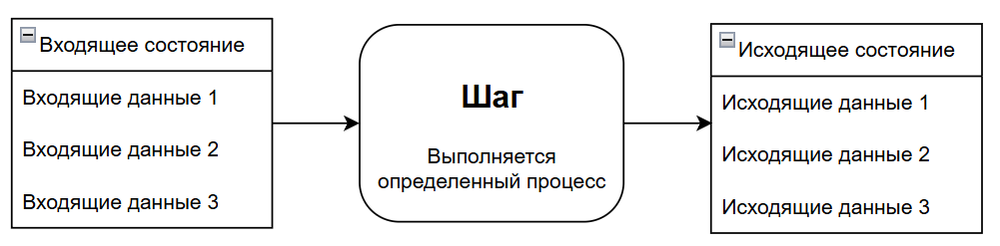

import SystemAnalystRoleDemo from '@site/src/components/SystemAnalystRoleDemo.jsx';

# Роль системного аналитика в разработке

  ОБЯЗАТЕЛЬНО
  ДЛЯ НОВИЧКОВ

Аналитику
Архитектору
Руководителю
Техническому писателю

**Системный аналитик (SA)** — от "хотим CRM" к проверяемой модели: сценарии, данные, API, NFR. После [113](/encyclopedia/7-project/7-04-analitika/113) → [115](/encyclopedia/7-project/7-04-analitika/115), [123](/encyclopedia/7-project/7-04-analitika/123), [128](/encyclopedia/7-project/7-04-analitika/128).

> Сначала sequence + ERD + AC на ядро сценария, не ТЗ на 80 страниц.

---

## Роль системного аналитика в разработке

### Что такое системный анализ?

Системный анализ представляет собой методологию, направленную на изучение сложных систем с целью выявления, формализации и структурирования их свойств, поведения и взаимодействий с окружающей средой. В контексте разработки программного обеспечения системный анализ служит основой для перехода от неформальных, часто расплывчатых потребностей заказчика к чётко определённым, проверяемым и реализуемым требованиям.

В отличие от общего аналитического подхода, применяемого в социальных или экономических науках, **системный анализ в IT фокусируется на построении модели системы**, которая отвечает функциональным и нефункциональным ожиданиям заинтересованных сторон и при этом технически осуществима в рамках заданных ограничений. Это дисциплина, сочетающая элементы инженерии требований, информационного моделирования и архитектурного проектирования на ранней стадии жизненного цикла разработки.

---

### Системный аналитик

Системный аналитик — это специалист, выполняющий эту трансформацию: он фиксирует пожелания заказчика, а также **интерпретирует, уточняет, логически связывает и верифицирует** их, превращая в основу для проектирования и реализации.

В отличие от бизнес-аналитика, для системного аналитика важно углубиться в технические тонкости, поэтому анализ тут бывает системный, функциональный и процессный.

Системный анализ фокусируется на том, что технически можно выполнить, а что нельзя, и какие имеются границы, ресурсы и архитектура. Заказчику всегда можно сказать "технически возможно всё", и добавить "но…", указав риски, цену, сложности и последствия. А чтобы их понимать, надо видеть возможности и ограничения:

<SystemAnalystRoleDemo />

Функциональный анализ фокусируется на том, что должна делать система. Важно определить чистый список действий - должна сохранять, отправлять, проверять, и так далее.

Процессный анализ фокусируется на потоках, шагах и оптимизации. Нужно определить, как выполняется работа сейчас (как она движется - так формируется поток), где узкие места и как сделать быстрее/дешевле. Да, "дешевле" важно для обоих - как бизнеса, так и системного, вопрос лишь в том, кто-то экономит и какие есть ресурсы, потому надо учитывать всё. Схематично любой процесс состоит из шагов:

Когда анализируем процессы, каждый шаг каждого процесса может представлять собой такой же процесс, и иметь свои шаги, свой результат. Чтобы выявить шаг, нужно понять, где начало, где конец - каково входящее состояние сущностей и каково исходящее:

Под изменением состояния можно подразумевать абсолютно что угодно - поле в базе данных, значение переменной, статус документа, баланс на счёте. Также к этому относится и действие - к примеру, при отправке уведомления на Email, на входящем состоянии у пользователя не было сообщение, а на исходящем - будет. Отсюда результат - наличие Email-сообщения. И всё в таком духе - под эту формулу можно подгонять что угодно.

---

### Перевод бизнес-требований в техническое задание

Одна из центральных задач системного аналитика — интерпретация бизнес-требований и их преобразование в форму, пригодную для реализации инженерной командой. Бизнес-требования, как правило, выражаются в терминах целей, метрик, процессов и ролей: *"нам нужно ускорить обработку заявок"*, *"клиенты должны видеть статус заказа в реальном времени"*, *"бухгалтерия хочет ежедневный отчёт по поступлениям"*. Такие формулировки носят декларативный характер и не содержат информации о том, **как** достичь желаемого результата.

Системный аналитик проводит работу по **декомпозиции**, **контекстуализации** и **формализации** этих требований. Он выявляет:

- **Актёров** — кто взаимодействует с системой;
- **Сценарии использования** — в каких условиях и для каких целей система будет применяться;
- **Границы системы** — что входит в неё, а что является внешним окружением;
- **Ограничения** — регуляторные, технические, временные или организационные рамки;
- **Критерии приемки** — как будет проверяться, что требование выполнено.

Результатом этой работы становится **техническое задание (ТЗ)** — документ, фиксирующий согласованные требования к системе. ТЗ может варьироваться по форме: от структурированного текстового документа до набора пользовательских историй с акцептанс-критериями, дополненного диаграммами и спецификациями интерфейсов. ТЗ — это живой артефакт, подлежащий уточнению и актуализации по мере развития проекта.

---

### Техническое задание, спецификации и требования — уточнение терминов

Термины "требования", "спецификации" и "техническое задание" часто используют в разговорной практике как синонимы, однако в профессиональном контексте они имеют чёткие различия:

- **Требования (requirements)** — это заявленные или выявленные потребности заинтересованных сторон. Они могут быть бизнес- (why), пользовательскими (who, what) или системными (how). Требования — это **что** система должна делать или обеспечивать.
- **Спецификации (specifications)** — формализованное описание требований в терминах, понятных разработчикам и тестировщикам. Спецификация отвечает на вопрос **как** система будет удовлетворять требованиям — например, через API-контракт, формат сообщений, логику обработки.
- **Техническое задание** — это совокупность спецификаций, дополненная контекстом, ограничениями, критериями качества и другими элементами, необходимыми для планирования, реализации и верификации системы. ТЗ — это **организующий документ**, связывающий бизнес-намерения с инженерной деятельностью.

Корректное разграничение этих понятий позволяет избежать подмены целей средствами: например, требование "система должна быть быстрой" требует спецификации в виде "время ответа на запрос /api/orders не должно превышать 300 мс при нагрузке до 1000 RPS".

---

### Анализ функциональных и нефункциональных требований

Процесс системного анализа включает выявление того, **что** должна делать система, и **каким образом** она должна это делать с учётом качества, надёжности, масштабируемости и других характеристик. Для этого требования разделяют на две категории: **функциональные** и **нефункциональные**.

**Функциональные требования** описывают поведение системы в ответ на определённые входные данные или действия пользователя. Они отвечают на вопрос: *"Какие задачи система должна выполнять?"*. Примеры:  
— "Пользователь может авторизоваться по логину и паролю";  
— "Система создаёт PDF-отчёт по завершённым заказам за выбранный период";  
— "При создании заявки система проверяет наличие обязательных полей и возвращает ошибку, если они не заполнены".

Такие требования часто формулируются через **сценарии использования (use Кейсы)** или **пользовательские истории**, и поддаются верификации с помощью тест-кейсов. Системный аналитик должен обеспечить их полноту (все необходимые функции учтены), непротиворечивость (нет конфликтующих условий) и однозначность (нет двусмысленных формулировок).

**Нефункциональные требования (NFR)**, напротив, определяют **качественные характеристики системы** — её производительность, безопасность, удобство использования, совместимость и т.д. Они отвечают на вопросы: *"Насколько быстро?", "Насколько надёжно?", "Какие стандарты безопасности соблюдаются?"*. Примеры:  
— "Система должна поддерживать одновременную работу не менее 5000 пользователей";  
— "Данные, передаваемые между клиентом и сервером, шифруются с использованием TLS 1.3";  
— "Интерфейс должен соответствовать WCAG 2.1 уровня AA".

Нефункциональные требования часто игнорируются на ранних этапах, но именно они определяют **пригодность системы для эксплуатации в реальных условиях**. Системный аналитик обязан выявлять такие требования в ходе интервью, анализа аналогов или регуляторных требований (например, GDPR, HIPAA). Важно формулировать NFR **измеримо**, чтобы их можно было проверить: вместо "система должна быть быстрой" — "время отклика на 95-м перцентиле не превышает 800 мс".

---

### Проектирование архитектурных решений — роль системного аналитика и границы компетенции

Вопреки распространённому мнению, системный аналитик **участвует в проектировании архитектурных решений**, но не занимается их **окончательной детализацией или реализацией**. Его вклад заключается в том, чтобы:

- Определить **структурные ограничения**, вытекающие из требований (например: необходимость интеграции с внешней системой через SOAP-интерфейс накладывает ограничение на выбор протоколов);
- Предложить **варианты архитектурных паттернов** на уровне компонентов и их взаимодействия (например: "для поддержки масштабируемости обработки заказов целесообразно выделить отдельный микросервис");
- Смоделировать **основные потоки данных**, границы подсистем и точки интеграции (часто в виде диаграмм компонентов, последовательностей или контейнер-диаграмм по методологии C4);
- Убедиться, что архитектурные гипотезы **соответствуют бизнес-целям** и не вносят избыточной сложности.

Однако **архитектор** — это отдельная роль, отвечающая за техническую целостность системы, выбор стека технологий, обеспечение соответствия принципам надёжности, масштабируемости и сопровождаемости на длительной временной дистанции. Архитектор принимает окончательные решения по структуре системы, учитывая текущие требования, прогнозируемую эволюцию, затраты на технический долг и стратегические приоритеты компании.

Таким образом, системный аналитик **задаёт рамки** и **формулирует проблемное пространство**, в котором архитектор ищет оптимальное решение. Это разделение необходимо для предотвращения перегрузки аналитика техническими деталями и избежания ситуаций, когда архитектура проектируется без учёта реальных бизнес-потребностей.

---

### Отличие системного аналитика от бизнес-аналитика

Хотя обе роли работают с требованиями и взаимодействуют с заказчиком, их **фокус, цели и артефакты** принципиально различаются.

**Бизнес-аналитик** сосредоточен на **бизнес-процессах, метриках эффективности и стратегических целях организации**. Он отвечает за выявление "боли" бизнеса, анализ текущих операций, моделирование "как есть" и "как должно быть", оценку ROI от внедрения изменений. Его основные инструменты — BPMN-диаграммы, анализ стоимости-выгоды, карты потоков создания ценности (Value Stream Mapping). Результат его работы — **понимание того, зачем нужна система и какие бизнес-задачи она решает**.

**Системный аналитик**, в свою очередь, работает **на стыке бизнеса и технической реализации**. Он принимает результаты работы бизнес-аналитика и трансформирует их в **спецификации, модели данных, контракты API, диаграммы взаимодействия**. Его цель — сделать требования **понятными, реализуемыми и проверяемыми для инженерной команды**. Он говорит на языке как бизнеса, так и разработки, но его продукт — технический артефакт, пригодный для проектирования и кодирования.

На практике в небольших командах эти роли могут совмещаться, но в крупных проектах, особенно с высокой сложностью домена или регуляторными требованиями, чёткое разделение повышает качество требований и снижает риски недопонимания.

---

### Хард-скиллы системного аналитика — компетенции, лежащие в основе профессии

Системный аналитик — это профессия, требующая синтеза знаний из нескольких областей. В отличие от узкоспециализированных ролей, таких как frontend-разработчик или QA-инженер, аналитик должен обладать **широкой технической эрудицией** и способностью быстро осваивать новые предметные области. Его хард-скиллы можно разделить на несколько ключевых блоков.

**1. Инженерия требований (Requirements Engineering).**  
Это фундаментальная дисциплина, включающая:
- Техники сбора требований (интервью, workshops, анализ документов, наблюдение за пользователями);
- Методы моделирования: use case-диаграммы, диаграммы последовательностей (UML, BPMN), потоки данных (DFD), модели сущность–связь (ERD);
- Подходы к управлению требованиями: трассировка (traceability), приоритизация (MoSCoW, Kano), версионирование и контроль изменений;
- Знание стандартов, таких как ISO/IEC/IEEE 29148 ("Systems and software engineering — Life cycle processes — Requirements engineering").

**2. Понимание архитектурных паттернов и технологий.**  
Системный аналитик не обязан писать код, но должен понимать:
- Принципы клиент-серверной архитектуры, REST/SOAP, очередей сообщений (Kafka, RabbitMQ), микросервисов и монолитов;
- Различия между реляционными и нереляционными СУБД, базовые принципы нормализации и денормализации;
- Основы безопасности: аутентификация, авторизация, принципы защиты от инъекций, XSS, CSRF;
- Принципы отказоустойчивости, горизонтального масштабирования, кэширования.

Эти знания позволяют ему корректно формулировать требования, избегать технически неосуществимых решений и эффективно взаимодействовать с архитекторами и разработчиками.

**3. Работа с моделями данных и API.**  
Системный аналитик часто создаёт или ревьюирует:
- Логические и физические модели данных;
- Контракты API (в форматах OpenAPI/Swagger, AsyncAPI);
- Примеры payload’ов запросов и ответов;
- Схемы валидации (JSON Schema и др.).

Эти артефакты служат основой для договорённостей между командами и гарантируют согласованность интерфейсов.

**4. Знание методологий разработки.**  
Понимание различий между Waterfall, Scrum, Kanban, SAFe позволяет аналитику адаптировать свои практики под контекст проекта:
- В итеративных методологиях акцент делается на инкрементальной детализации требований;
- В план-ориентированных проектах требуется полная спецификация на старте;
- В гибридных подходах аналитик совмещает элементы документирования и оперативного уточнения.

**5. Владение инструментами.**  
Типичный инструментарий включает:
- Confluence, Notion, SharePoint — для документирования;
- Jira, Azure DevOps, YouTrack — для управления задачами и трассировки требований;
- Draw.io, Lucidchart, PlantUML — для моделирования;
- Postman, Swagger Editor — для работы с API;
- `curl` в терминале — быстрая проверка контракта без GUI ([утилита curl](/encyclopedia/2-system-network/2-05-terminal/1133));
- SQL-клиенты — для верификации данных в существующих системах.

Критически важно, что системный аналитик использует эти инструменты как средства **обеспечения прозрачности, согласованности и воспроизводимости** требований.

---

### Постановка задач для разных ролей на основе аналитических артефактов

Работа системного аналитика завершается **передачей контекста** команде. Эффективная постановка задач предполагает адаптацию одного и того же аналитического ядра под потребности разных участников проекта.

**Для разработчиков** требуется:
- Чёткое описание поведения системы в виде сценариев или спецификаций;
- Полную контрактную спецификацию API (методы, параметры, статус-коды, примеры);
- Модель данных с описанием сущностей, связей и бизнес-правил;
- Нефункциональные требования, влияющие на реализацию (например: "операция должна быть идемпотентной").

**Для тестировщиков** необходимы:
- Акцептанс-критерии, сформулированные в виде Given-When-Then;
- Граничные условия и сценарии ошибок;
- Ожидаемые результаты для каждого тестового случая;
- Метрики нефункционального тестирования (например: "проверить, что при 1000 одновременных запросов время ответа ≤ 500 мс").

**Для DevOps-инженеров и SRE** важно:
- Понимание нефункциональных требований к масштабируемости, мониторингу, логированию;
- Сведения о зависимостях между компонентами;
- Требования к окружениям (например: необходимость отдельного staging для тестирования интеграций);
- SLA и SLO, если они определены.

**Для архитектора** системный аналитик предоставляет:
- Описание границ системы и её интеграционных точек;
- Перечень критически важных нефункциональных требований;
- Выявленные технические ограничения (например: необходимость поддержки устаревшего протокола);
- Сценарии, которые могут повлиять на выбор архитектурного паттерна (например: необходимость обработки событий в реальном времени).

Таким образом, системный аналитик выступает в роли **оркестратора контекста**: он не навязывает решения, но обеспечивает каждую роль той информацией, которая необходима для принятия обоснованных технических решений.

---

### Взаимодействие системного аналитика с командой на протяжении жизненного цикла проекта

Системный аналитик вовлечён в проект не только на этапе сбора требований. Его участие сохраняется на всех ключевых фазах:

- **На этапе запуска проекта** он участвует в инициации, определении scope, анализе рисков и составлении предварительной модели системы.
- **Во время проектирования** он уточняет детали, участвует в сессиях архитектурного проектирования, помогает сформулировать технические ограничения.
- **На этапе разработки** он отвечает на уточняющие вопросы, участвует в refinement-сессиях, вносит корректировки в требования при выявлении противоречий или упущений.
- **При тестировании** он участвует в верификации, проверяет соответствие реализации исходным требованиям, помогает интерпретировать спорные случаи.
- **На этапе сдачи и поддержки** он может участвовать в подготовке документации для эксплуатации, передаче контекста службе поддержки, а также в анализе обратной связи от пользователей для будущих итераций.

Системный аналитик — **активный участник инженерного процесса**. Его компетенция заключается в способности сохранять целостность требований при их трансформации в работающую систему.

---

### Чеклист перед передачей в разработку

- [ ] Акторы и границы системы
- [ ] Основной и негативный сценарий
- [ ] NFR с цифрами где риск дорогой
- [ ] Интеграции: протокол, ошибки
- [ ] Критерии приёмки для QA

---

### Мини кейс системного анализа

Запрос бизнеса: "Добавить онлайн-возврат товара".  
Задача системного аналитика:

1. Разобрать сценарии "возврат по чеку", "возврат без чека", "частичный возврат".
2. Уточнить ограничения: сроки возврата, юридические требования, исключения.
3. Описать модель данных: возврат, позиция возврата, причина, статус, транзакция.
4. Подготовить API-контракт между веб-приложением, billing и складом.
5. Зафиксировать NFR: время ответа, идемпотентность, аудит операций.
6. Подготовить критерии приёмки и негативные сценарии для QA.

На выходе команда получает инженерно точную модель, а не общую идею.

---

### Что усиливает качество артефактов SA

- Единый список терминов домена в начале документа.
- Отдельный блок допущений и ограничений.
- Примеры входных и выходных payload для всех критичных API.
- Таблица кодов ошибок и реакций клиента.
- Явный раздел "что система делает при сбое интеграции".

---

### Типовые провалы и как их предупреждать

- Проблема: требования описаны только для "счастливого пути".  
  Профилактика: фиксировать альтернативные и ошибочные сценарии сразу.
- Проблема: NFR остаются в виде общих слов.  
  Профилактика: переводить каждый NFR в числа и тестируемые критерии.
- Проблема: API-контракт отстаёт от реализации.  
  Профилактика: ревью контракта в каждом изменении интеграции.

---

### Куда идти дальше после этой статьи

- Декомпозиция и исследование систем до этапа формализации — [116](/encyclopedia/7-project/7-04-analitika/116).
- Управление требованиями и контроль изменений — [115](/encyclopedia/7-project/7-04-analitika/115).
- Практика документации в проекте — [117](/encyclopedia/7-project/7-04-analitika/117).

Дальше: [115](/encyclopedia/7-project/7-04-analitika/115), [128](/encyclopedia/7-project/7-04-analitika/128), [API](/encyclopedia/7-project/7-06-proektirovanie-i-arhitektura/design/117).

---
