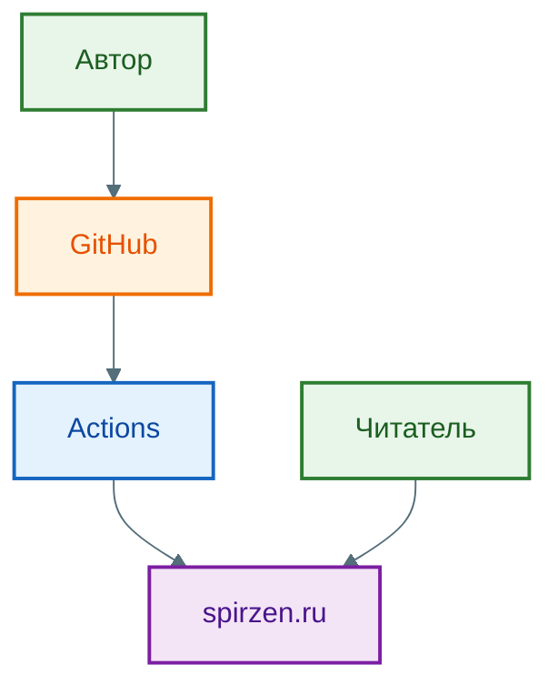
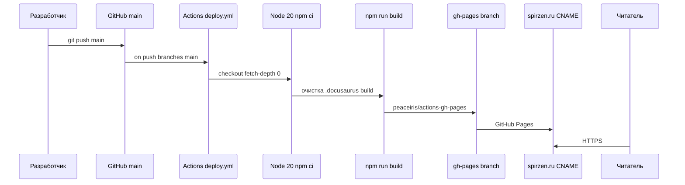

import ExternalPlayEmbed from '@site/src/components/ExternalPlayEmbed';

# Исследование и декомпозиция систем

  ОБЯЗАТЕЛЬНО
  ДЛЯ НОВИЧКОВ

Аналитику
Архитектору
Руководителю
Техническому писателю

  
Теория данных (раздел 3)

  

  ERD — [Entity Relationship](/encyclopedia/3-data-markup/3-05-osnovy-baz-dannyh/11); SQL — [SQL для аналитики](./1122), [SQL](/encyclopedia/3-data-markup/3-07-sql/intro); миграции — [Пакетная работа](/encyclopedia/3-data-markup/3-11-analiz-dannyh/433). Полная таблица — [о разделе](./intro).
  

Перед to-be нужен **as-is**: как система и процесс работают сейчас. Иначе "улучшение" дублирует старый костыль.

> Сначала зафиксируйте as-is, потом рисуйте целевое состояние.

---

## Исследование и декомпозиция систем

### С чего начать

Как аналитик знакомится с системой?
- читает всё что есть - документацию, схемы архитектуры, инструкции для пользователей;
- если нет документации - забивает, и делает задачу в Jira типа "сделать схему";
- открывает систему и проходит по главным сценариям (завести заказ, одобрить заявку, загрузить файл, сформировать отчёт);
- выписывает вопросы в блокнот (зачем тут три кнопки удаления? что будет, если нажать "отмена" в середине?);
- спрашивает у живых людей - зачем это всё, как сделано на самом деле, где самые больные места, на что чаще жалуются;
- общается с заказчиком, разработчиками, тестировщиками, техподдержкой;
- рисует схемы из всего того, что понял - основные сущности, сценарии, списки внешних систем;
- залезает в базу данных и изучает, какие таблицы, поля и связи есть ([ER-модель](/encyclopedia/3-data-markup/3-05-osnovy-baz-dannyh/11), [SQL для сверки](/encyclopedia/3-data-markup/3-07-sql/intro));
- при необходимости смотрит исходники и конфиги — [Код — о разделе](/encyclopedia/4-code-dev/4-02-chto-takoe-kod-i-kak-on-rabotaet/intro), [Git — история изменений](/encyclopedia/4-code-dev/4-13-osnovy-raboty-s-git/intro).

Не нужно сидеть и ждать, пока кто-то всё расскажет. Задавать глупые вопросы, рисовать хоть что-то и всё записывать, фиксировать.

---

### Методы elicitation — когда что применять

На этапе выявления требований BA комбинирует техники под **аудиторию, масштаб и срок**:

| Метод | Когда уместен | Ограничение |
| :--- | :--- | :--- |
| **Интервью** | Глубокое погружение, эксперты, старт проекта | Долго при большом числе ролей |
| **Workshop / JAD** | Быстрое согласование, конфликтные темы | Нужен фасилитатор и подготовка |
| **Наблюдение (shadowing)** | Разрыв "на бумаге" vs "в жизни" | Занимает время аналитика |
| **Анкета / опрос** | Много однотипных респондентов, статистика | Мало контекста, нет уточняющих вопросов |
| **Анализ документов** | Legacy, регламенты, контракты | Документы могут не отражать практику |
| **Прототип** | Неясный UX, визуальные ожидания | Риск "принять макет за продукт" — [Формализация и управление требованиями](/encyclopedia/7-project/7-04-analitika/116) |

Подробнее о коммуникациях и плане стейкхолдеров — [Взаимодействие аналитика с командой](/encyclopedia/7-project/7-04-analitika/127).

---

### Документы для elicitation

Параллельно с интервью BA **разбирает существующие артефакты** — они часто точнее устных рассказов:

- **Бизнес-правила, политики, SOP** — формальные ограничения и "как должно быть".
- **Блок-схемы процессов** — as-is, даже если устарели.
- **Архитектура предприятия** — оргструктура, зоны ответственности, цепочка подчинения; первый ориентир при входе в проект.
- **Регламенты ИБ и compliance** — нефункциональные требования "из коробки".
- **Legacy ТЗ, release notes, backlog** — что система уже умеет и что ломали раньше.

Чек-лист "что запросить у заказчика в первую неделю" — оргструктура, список систем, 3–5 ключевых регламентов, доступ к тестовому контуру, контакт суперпользователя.

<ExternalPlayEmbed example="project/system-discovery-demo" title="Исследование системы" minHeight={480} />

---

### Что такое исследование системы?

**Исследование систем** — фундаментальная компетенция аналитика, находящаяся на пересечении технического понимания, архитектурного видения и способности к абстрактному мышлению. В отличие от поверхностного изучения функциональности или интерфейсов, исследование системы предполагает проникновение в её суть — выявление взаимосвязей между компонентами, распознавание логики работы, понимание ограничений и возможностей, а также формирование целостного образа системы как единого, живого организма. 

Такой подход становится особенно критичным в условиях наследственных (legacy) решений, сложных интеграций или высоконагруженных распределённых архитектур, где каждая деталь может повлиять на целостность, производительность и безопасность всей экосистемы.

Успешное исследование невозможно без **умения видеть проект целиком**. Аналитик не рассматривает систему как набор отдельных экранов, форм или API-эндпоинтов. Он воспринимает её как совокупность процессов, данных, взаимодействий и контекстов. Этот целостный взгляд позволяет избежать локальных решений, которые нарушают архитектурную целостность или создают скрытые зависимости между компонентами. Именно способность видеть систему "в профиль и анфас" отличает системного аналитика от исполнителя, ограниченного рамками отдельной задачи.

---

### Как знакомиться с системой

Первое знакомство с системой — критический этап, формирующий базовое ментальное представление. Оно начинается задолго до изучения кода или базы данных. В первую очередь, аналитик получает доступ к доступной документации — техническим спецификациям, архитектурным схемам, руководствам администратора, пользовательским инструкциям и, при наличии, модели домена. Отсутствие такой документации уже является сигналом о техническом долге и требует более пристального внимания.

Затем следует **функциональное погружение**: последовательное прохождение типовых пользовательских сценариев. Аналитик сознательно идентифицирует:
- границы системы (что внутри, что вне);
- ключевые пользовательские роли и сценарии;
- точки входа и выхода (внешние взаимодействия);
- циклы жизнедеятельности сущностей (например, заказ: создание → оплата → сборка → доставка → завершение).

Параллельно проводится **структурное погружение**: изучение архитектуры. Здесь важно различать уровни абстракции:
- **Логическая архитектура** — компоненты, их обязанности, доменные модели;
- **Физическая архитектура** — серверы, контейнеры, [сети](/encyclopedia/2-system-network/2-03-set-i-internet/intro), окружения;
- **Технологический стек** — языки, фреймворки, базы данных, [брокеры сообщений](/encyclopedia/2-system-network/2-09-osnovy-integratsionnogo-vzaimodeystviya/121).

На этом этапе особенно полезны диаграммы [C4](/encyclopedia/7-project/7-04-analitika/1231#6-архитектура--c4) (Context, Containers, Components, Code), которые позволяют визуализировать систему на разных уровнях детализации. Если таких диаграмм нет, их создание часто становится первой аналитической задачей.

### Живой пример — as-is для "Вселенной IT"

Разберите [сводную схему](/about/project#arhitektura-proekta) как упражнение по знакомству с системой:

- **Акторы** — автор (правки в git), читатель (браузер), опционально GitHub API.
- **Внешние системы** — GitHub, GitHub Actions, GitHub Pages, [DNS](/encyclopedia/2-system-network/2-03-set-i-internet/6) spirzen.ru.
- **Граница продукта** — статический сайт без серверных сессий и БД; логика сборки в CI и скриптах `scripts/`.
- **Потоки** — push в `main` → сборка → `gh-pages` → [HTTPS](/encyclopedia/2-system-network/2-03-set-i-internet/11) у читателя ([путь запроса](/encyclopedia/2-system-network/2-04-kak-rabotayut-sayty-i-veb-sayty/1)).
- **Вопросы** — где хранится контент (`docs/`), где UI (`src/`), что генерируется при build (`doc-search-index.json`, редиректы).

Сначала — **уровень контекста**: три домена и точки интеграции (code/play встраиваются в spirzen.ru):

C4-контекст (уровень 1) в Mermaid — [полная версия на "О проекте"](/about/project#it-universe-c4-mermaid):

Тот же поток в нотации последовательности (as-is):

---

### Анализ архитектуры

Понимание архитектуры — это осознание **причин** и **следствий** выбора. Аналитик задаёт вопросы:
- Почему выбран именно этот паттерн взаимодействия между сервисами?
- Как обеспечивается согласованность данных при распределённости?
- Какова стратегия масштабирования и восстановления после сбоев?
- Где находятся узкие места (bottlenecks)?

Ключевой навык — **реконструкция архитектуры из поведения системы**. При отсутствии документации или устаревших схем аналитик использует наблюдение за трафиком (через прокси или логи), анализ зависимостей между микросервисами, изучение конфигурационных файлов и манифестов (в случае контейнеризации). Это — своего рода **реверс-инжиниринг архитектуры**, направленный на восстановление целостной картины.

Особое внимание уделяется **точкам интеграции**. Каждое внешнее взаимодействие — потенциальный источник сложности, отказоустойчивости и технического долга. Аналитик должен чётко понимать:
- тип интеграции (синхронная/асинхронная);
- протокол (REST, SOAP, gRPC, Kafka и др.);
- формат данных (JSON, XML, Avro, Protobuf);
- контракт (API specification, schema);
- стратегию обработки ошибок и повторных попыток.

---

### Формирование вариантов технической реализации

На основе понимания текущей системы аналитик переходит к проектированию решений. Это **аналитическое моделирование альтернатив**. Цель — сформировать обоснованный набор вариантов, каждый из которых сопровождается оценкой:
- сложности реализации;
- влияния на существующую архитектуру;
- рисков;
- затрат на сопровождение;
- совместимости с долгосрочной стратегией развития системы.

При этом аналитик опирается на принципы **инкрементальности** и **минимизации разрушительных изменений**. В идеале новое решение должно органично вписываться в существующую экосистему, а не требовать её полной перестройки.

---

### Анализ систем-источников и реверс-инжиниринг процессов

Во многих проектах (особенно при миграциях или интеграциях) аналитик работает с существующими системами-источниками. Здесь ключевая задача — **декомпозиция бизнес-процессов**, реализованных в legacy-системе. Реверс-инжиниринг процессов включает:
- восстановление сквозных сценариев по логам и аудит-таблицам;
- интервьюирование ключевых пользователей и суперпользователей;
- анализ правил обработки данных (часто закодированных в триггерах, хранимых процедурах или бизнес-правилах);
- выявление неочевидных зависимостей и "костылей", поддерживающих работоспособность системы.

Такой анализ позволяет **переосмыслить** функциональность в контексте новых требований и архитектурных принципов.

---

### UX-исследования, макетирование и прототипирование

Аналитик не обязан быть дизайнером, но обязан понимать, **как пользователь взаимодействует с системой**. UX-исследования помогают выявить болевые точки, избыточные шаги, когнитивную нагрузку и несоответствие интерфейсов реальным задачам. На основе этих данных создаются **макеты** — статические визуализации будущих экранов, форм, навигации. Они служат основой для обсуждения с заказчиком и разработчиками.

На следующем этапе — **прототипирование**. В отличие от макета, прототип демонстрирует поведение — переходы, валидации, реакции на действия. Прототипы интерфейсов модулей, особенно в части настройки интеграций или конфигурации сложных параметров, позволяют заранее выявить неудобства и архитектурные узкости. Например, если для настройки интеграции требуется заполнить 15 полей на трёх вкладках без подсказок — это сигнал о необходимости упрощения или автоматизации.

---

### Анализ интеграций — API, протоколы и контейнеры данных

Интеграции — одна из самых сложных областей анализа. Аналитик должен уметь **читать и интерпретировать спецификации API**, понимать различия между подходами:
- **REST** — ресурс-ориентированный, статус-коды как часть контракта, stateless;
- **SOAP** — строгий XML-контракт, встроенная поддержка безопасности и транзакций;
- **асинхронные сообщения** — через брокеры (Kafka, RabbitMQ), где важны топики, схемы сообщений, гарантии доставки (at-least-once, exactly-once).

Критически важно понимать **контейнеры данных** — то, как данные упаковываются для передачи. Например, в REST API может использоваться JSON, но структура объекта должна быть согласована между сторонами. Аналитик формирует **маппинг полей**, учитывая различия в типах, форматах дат, кодировках и семантике.

Особое внимание — **обработка ошибок** — как система реагирует на недоступность endpoint’а, невалидный запрос, timeout? Эти сценарии должны быть явно описаны в требованиях.

---

### Маппинг данных и миграции \{#маппинг-данных-и-миграции\}

При замене систем или интеграции с внешними источниками возникает задача **миграции данных**. Аналитик участвует в проектировании маппинга: сопоставлении сущностей и атрибутов между источником и целью. Инженерные приёмы (чанки, идемпотентность, checkpoint) — [Пакетная работа с данными](/encyclopedia/3-data-markup/3-11-analiz-dannyh/433). Это включает:
- идентификацию ключей и уникальных идентификаторов;
- преобразование типов и форматов;
- разрешение конфликтов (например, дублирующихся записей);
- обработку исторических данных;
- валидацию полноты и целостности после миграции.

Маппинг оформляется в виде таблиц или спецификаций, часто с примерами значений. Это не просто техническая задача — она тесно связана с семантикой данных и бизнес-правилами.

---

### Анализ баз данных — SQL и NoSQL

Аналитик не обязан писать сложные SQL-запросы, но должен понимать **структуру и логику хранения данных** — см. [Основы баз данных](/encyclopedia/3-data-markup/3-05-osnovy-baz-dannyh/intro). При работе с **реляционными базами** он анализирует:
- схемы (DDL);
- связи между таблицами (внешние ключи);
- [индексы](/encyclopedia/3-data-markup/3-05-osnovy-baz-dannyh/3#tipy-indeksov-po-role) и их влияние на производительность;
- использование представлений, триггеров, хранимых процедур.

В случае **NoSQL** ([обзор типов](/encyclopedia/3-data-markup/3-06-nosql/intro) — документные, ключ-значение, колоночные, графовые) акцент смещается:
- как данные группируются (в документе, в строке);
- какие паттерны запросов поддерживаются;
- как обеспечивается согласованность и масштабируемость.

Понимание этих различий позволяет аналитику корректно формулировать требования к хранению, извлечению и агрегации данных, не противореча архитектурным ограничениям используемых СУБД.

---

### Анализ высоконагруженных, облачных и микросервисных систем

В распределённых системах аналитик сталкивается с новыми классами проблем:
- **латентность** между сервисами;
- **частичные сбои** и необходимость идемпотентности;
- **трассировка запросов** по цепочке сервисов;
- **управление состоянием** в stateless-архитектуре.

Облачная среда добавляет слои абстракции — балансировщики, API-шлюзы, функции как сервис (FaaS), управляемые базы данных. Аналитик должен понимать, **какие ограничения и возможности накладывает облачная платформа** на проектируемое решение.

В микросервисной архитектуре особенно важна **граница ответственности** каждого сервиса. Аналитик помогает определить, в каком сервисе должна реализовываться та или иная бизнес-функция, избегая дублирования логики и "сервисного спагетти".

---

### Проверка соответствия реализованной функциональности требованиям — техническая сторона верификации

Проверка реализации — строгая процедура верификации, охватывающая как функциональные, так и нефункциональные аспекты. С технической точки зрения, аналитик должен убедиться, что реализация соответствует **смысловому контексту**, а также **архитектурным ограничениям**.

Для этого используется комбинация методов:

1. **Формальные проверки по спецификациям.** Требования должны быть выражены в виде проверяемых утверждений (например, "После подтверждения оплаты заказ переходит в статус \"Готов к сборке\" в течение 5 секунд"). Реализация проходит верификацию через автоматизированные тесты или ручную проверку с фиксацией исходных условий и ожидаемых результатов.

2. **Анализ логики в коде и конфигурациях.** В системах с конфигурируемой логикой (например, workflow-движки, правила обработки в BPM-системах) аналитик проверяет поведение в UI, корректность настройки правил — цепочек переходов, условий ветвления, действий по событиям. Это особенно важно в случае BPM-платформ, где логика часто выносится из кода в настраиваемые модели.

3. **Интеграционная валидация.** Если требование предполагает взаимодействие с внешней системой, проверяется успешный сценарий, обработку ошибок, таймаутов, повторных вызовов. Используются фейковые (mock) или тестовые инстансы внешних систем, чтобы смоделировать все возможные состояния.

4. **Соответствие контрактам API.** При наличии спецификации (OpenAPI, WSDL), реализация проверяется на строгое следование контракту — структура запроса/ответа, HTTP-статусы, заголовки, обработка ошибок. Ручная проверка эндпоинтов — [Postman и curl](/encyclopedia/2-system-network/2-09-osnovy-integratsionnogo-vzaimodeystviya/2), [утилита curl](/encyclopedia/2-system-network/2-05-terminal/1133), [curl / fetch — примеры](/lab/Примеры/1133). Отклонения от контракта могут вызвать сбои в смежных системах.

5. **Проверка данных.** Аналитик убеждается, что данные, создаваемые или модифицируемые системой, соответствуют ожидаемым форматам, типам и семантике. Например, поле "дата рождения" не должно содержать будущие даты, а сумма заказа — отрицательные значения, если это не предусмотрено бизнес-логикой.

Такой подход обеспечивает корректность поведения и долгосрочную поддерживаемость системы, поскольку явно задокументированные и проверенные контракты снижают риски регрессий при будущих изменениях.

---

### Работа с метриками — от сбора до интерпретации

Метрики — количественные показатели состояния и поведения системы. Для аналитика они служат объективным источником информации о том, **как система используется на практике**, а не только в теоретических сценариях. Работа с метриками включает несколько этапов:

- **Определение ключевых метрик.** На основе бизнес-целей и требований к системе формируется набор KPI — время обработки заявки, доля успешных транзакций, частота ошибок определённого типа, время отклика API. Эти метрики должны быть измеримы, сопоставимы во времени и привязаны к конкретным процессам.

- **Интеграция с системами мониторинга.** Аналитик взаимодействует с инженерами по надёжности (SRE) или DevOps-командой для настройки сбора метрик через инструменты вроде Prometheus, Datadog, Grafana или встроенных решений облачных платформ (Azure Monitor, AWS CloudWatch). Важно, чтобы метрики логировались с достаточным контекстом — идентификатор сессии, версия сервиса, география запроса и т.п.

- **Интерпретация данных.** Сбор — лишь первый шаг. Аналитик должен уметь отличать шум от сигнала: например, рост числа ошибок может быть вызван изменением поведения пользователей (новый тип запросов). Для этого применяются методы временного анализа, корреляции с другими событиями (релизами, нагрузочными тестами) и сегментации (по регионам, ролям, версиям).

- **Использование в улучшении системы.** Метрики становятся основой для принятия решений: если 95-й перцентиль времени обработки заявки превышает SLA, это сигнал к оптимизации. Если определённый экран вызывает высокий процент отказов — требуется UX-ревизия. Таким образом, метрики превращаются из пассивного отчёта в активный инструмент управления качеством.

---

### Конфигурирование и настройка систем под новые требования

В современных ИТ-ландшафтах значительная часть логики выносится в **конфигурацию**. Это позволяет быстрее адаптировать систему под меняющиеся требования без полного цикла разработки. Аналитик в таких случаях становится не только формулировщиком требований, но и **проектировщиком конфигурационных моделей**.

Конфигурирование включает:
- **Настройку workflow и бизнес-процессов.** Определение состояний, переходов, условий, исполнителей, таймаутов. Аналитик должен понимать семантику движка процессов, чтобы не проектировать несогласованные или циклические цепочки.
- **Параметризацию правил.** Например, настройка условий скидок, валидации полей, маршрутизации обращений. Здесь критически важно обеспечить читаемость и сопровождаемость правил, избегая сложных вложенных условий.
- **Кастомизацию UI.** В конфигурируемых платформах (например, low-code) аналитик может участвовать в проектировании форм, экранов, отчётов через drag-and-drop интерфейсы или декларативные описания.
- **Управление версиями конфигураций.** Конфигурации должны версионироваться так же, как и код, чтобы обеспечить откат в случае ошибок и соответствие требованиям аудита.

Ключевой принцип — **конфигурация как код** (Configuration as Code). Это означает, что все настройки хранятся в системе контроля версий, проходят ревью и тестирование. Аналитик, работая с такими системами, должен соблюдать дисциплину, аналогичную разработке — чёткие комментарии, атомарные изменения, документирование причин изменений.

---

### Observability — концепция и практическое применение

Observability — свойство системы, позволяющее выводить её внутреннее состояние на основе внешних выходных данных (логов, метрик, трассировок). В отличие от традиционного мониторинга, который проверяет известные сценарии ("работает ли сервис?"), observability помогает отвечать на вопросы, которые заранее не были сформулированы ("почему пользователи не могут оформить заказ в регионе X?").

Три столпа observability:
1. **Логи (Logs)** — структурированные записи событий. Современные системы используют форматы вроде JSON с контекстными полями (trace_id, user_id, service_name), что позволяет эффективно фильтровать и агрегировать.
2. **Метрики (Metrics)** — числовые агрегированные показатели во времени (например, количество запросов в секунду, средняя задержка).
3. **Трассировки (Traces)** — полный путь запроса через распределённую систему. Каждый вызов между сервисами помечается одним идентификатором (trace ID), что позволяет визуализировать цепочку и выявлять узкие места.

Аналитик, даже не будучи инженером по надёжности, должен понимать, **какие данные доступны через observability-инструменты**, и использовать их при:
- анализе инцидентов;
- верификации поведения в продакшене;
- планировании новых функций (например, оценка нагрузки на существующие сервисы);
- документировании неявных ограничений системы.

Инструменты вроде Jaeger (трассировки), Loki (логи), Prometheus (метрики) и Grafana (визуализация) становятся частью рабочего окружения аналитика в зрелых инженерных командах. Умение составлять запросы к таким системам (например, PromQL, LogQL) значительно повышает эффективность анализа.

---

### Playbook — as-is → gap → to-be

1. **As-is** — как сейчас (BPMN, интервью).
2. **Gap** — чего не хватает цели; что нельзя ломать.
3. **To-be** — целевой процесс и граница автоматизации.
4. **Декомпозиция** — эпики, интеграции, риски.
5. **Метрики успеха** — [Как переводить бизнес-задачи на язык данных](/encyclopedia/7-project/7-04-analitika/1121).

---

### Развёрнутый маршрут исследования системы

Чтобы исследование было предсказуемым по качеству, удобно идти фиксированным циклом:

1. Подготовка контекста — цель исследования, границы, ограничения.
2. Сбор материалов — документация, логи, метрики, схемы, регламенты.
3. Интервью с ролями — бизнес, support, разработка, эксплуатация.
4. Построение as-is моделей — процесс, данные, интеграции.
5. Выявление gap между текущим состоянием и целями.
6. Формирование вариантов to-be и оценка компромиссов.
7. Передача в требования, декомпозицию и план внедрения.

Такой порядок удерживает системность и снижает риск пропустить критичный участок.

---

### Что смотреть в первую очередь в legacy системе

- Где хранятся ключевые бизнес-сущности и кто их владелец.
- Какие интеграции критичны для выручки и SLA.
- Какие ручные операции закрывают пробелы автоматизации.
- Какие инциденты повторяются и почему они повторяются.
- Какие части системы меняются чаще всего и требуют изоляции.

---

### Частые ошибки исследования

- Погружение только в интерфейс без анализа данных и интеграций.
- Сбор мнений без сверки с логами и фактами.
- Преждевременный переход к to-be без качественной фиксации as-is.
- Отсутствие списка допущений и неизвестных.
- Разрозненные артефакты без единой карты системы.

---

### С чем связать эту статью в практической работе

- Роль BA в постановке задачи и целевой ценности — [Роль бизнес-аналитика в проекте](/encyclopedia/7-project/7-04-analitika/113).
- Роль SA в технической формализации решений — [Роль системного аналитика в разработке](/encyclopedia/7-project/7-04-analitika/114).
- Описание и контроль требований после исследования — [Формализация и управление требованиями](/encyclopedia/7-project/7-04-analitika/116).

Дальше: [Моделирование бизнес-процессов](/encyclopedia/7-project/7-04-analitika/124), [Справочник по нотации BPMN 2.0](/encyclopedia/7-project/7-04-analitika/129).

---
