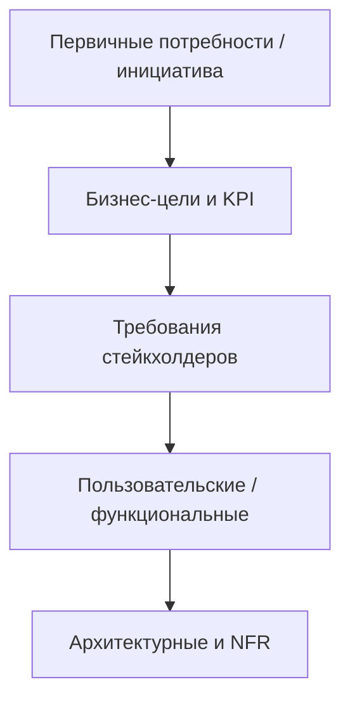

import ExternalPlayEmbed from '@site/src/components/ExternalPlayEmbed';

# Документация аналитика

  ОБЯЗАТЕЛЬНО
  ДЛЯ НОВИЧКОВ

Аналитику
Архитектору
Руководителю
Техническому писателю

  
Теория данных (раздел 3)

  

  ERD — [Entity Relationship](/encyclopedia/3-data-markup/3-05-osnovy-baz-dannyh/11); SQL — [1122](./1122), [SQL](/encyclopedia/3-data-markup/3-07-sql/intro); миграции — [Пакетная работа](/encyclopedia/3-data-markup/3-11-analiz-dannyh/433). Полная таблица — [о разделе](./intro).
  

Документация — **набор договорённостей**. Объём зависит от проекта. Детали ГОСТ и ТЗ — в [118–121](/encyclopedia/7-project/7-04-analitika/118); живой backlog — в [122](/encyclopedia/7-project/7-04-analitika/122).

---

### Lean vs формальный проект

| Режим | Минимум | Расширение |
| :--- | :--- | :--- |
| **Lean / Agile** | глоссарий, stories + AC, схемы по необходимости | OpenAPI, ADR |
| **Контракт / госсектор** | утверждённое [ТЗ](/encyclopedia/7-project/7-04-analitika/121) | ПМИ, руководства [118–120](/encyclopedia/7-project/7-04-analitika/118) |

> Согласуйте **источник истины** в начале: Confluence, Jira или комплект по ГОСТ.

---

### V-модель уровней требований

В корпоративных и контрактных проектах требования часто выстраивают **вертикальными уровнями** — от проблемы к реализации. Каждый уровень завершается перед детализацией следующего (V-образная логика «сначала смысл, потом интерфейс, потом архитектура»):

| Уровень | Содержание | Типичный артефакт |
| :--- | :--- | :--- |
| Первичные | Запрос, боль, инициатива | Протокол, письмо, epic |
| Бизнес | Цели, метрики, ограничения | BRD, business case |
| Стейкхолдеры | Ожидания ролей | User stories, use cases |
| Пользовательские | Поведение системы для роли | SRS, AC, прототипы |
| Архитектурные | Компоненты, интеграции, NFR | ADR, OpenAPI, ERD |

На каждом уровне BA отвечает на вопрос «**что** должно измениться», прежде чем команда уйдёт в «**как** реализовать». Связь с problem-first — [113](/encyclopedia/7-project/7-04-analitika/113). Lean-проекты сжимают уровни в backlog, но **логика** остаётся: цель → поведение → контракт API.

<ExternalPlayEmbed example="about/schema-maker-play" title="Схема для ТЗ" minHeight={560} playProps={{ defaultDocName: 'ТЗ', title: 'Схема для ТЗ', subtitle: 'UML-эскиз модулей и связей для передачи в разработку' }} />

---

## Документация аналитика

Документация — инструмент договориться, передать задачу, объяснить тестировщику и не потерять решение при смене команды.

Какая бывает документация у аналитика:
- бизнес-документы (BRD, карта стейкхолдеров, метрики успеха);
- требования (User Story, Use Case, SRS);
- модели и диаграммы (BPMN, ERD, схема компонентов, sequence diagram);
- техническая документация (API, словари данных, маппинг полей, ADR);
- вспомогательная (глоссарий, матрицы, журналы).

<ExternalPlayEmbed example="about/archi-styler-play" title="Диаграмма классов для ТЗ" minHeight={480} playProps={{ defaultPattern: 'layered', title: 'Диаграмма классов для ТЗ', subtitle: 'UML-структура модулей и связей — артефакт для передачи в разработку' }} />

---

### Общее о документах

Документация в сфере информационных технологий — это фундаментальный элемент инженерной и управленческой деятельности. Она выполняет функцию как среды передачи знаний, так и основы для принятия решений, координации усилий и обеспечения воспроизводимости результатов. В условиях высокой сложности IT-проектов, быстрой ротации персонала и распределённой разработки документы становятся критически важными артефактами, определяющими эффективность и возможность реализации проекта.

---

### Важность грамотности

Грамотность в контексте технической и бизнес-документации — это соблюдение норм орфографии и пунктуации, а также способность точно и однозначно выражать мысль, подбирать термины, соответствующие предметной области, и поддерживать логическую целостность текста. Ошибка в формулировке, неудачный пример или двусмысленное выражение могут привести к неправильному пониманию требований, а это, в свою очередь, — к ошибкам в реализации, задержкам сроков и увеличению стоимости проекта.

Грамотность документа определяется качеством языка и структурой изложения: последовательностью аргументов, чёткостью определений, логикой перехода от общего к частному. В документации не допускается использование разговорных оборотов, метафор без пояснения или неопределённых ссылок вроде "как уже говорилось". Каждое утверждение должно быть либо обосновано, либо определено, либо подкреплено ссылкой на источник.

Высокий уровень технической грамотности проявляется в умении формулировать сложные идеи простым и точным языком без потери содержания. Это требует не только лингвистических, но и концептуальных усилий: автор документа должен полностью понимать предмет, чтобы суметь его корректно описать.

---

### Ясное и чёткое изложение сложных бизнес-концепций

Одна из ключевых задач документации — трансляция абстрактных, часто неформализованных бизнес-концепций в структурированные и интерпретируемые технические артефакты. Бизнес-процессы, организационные цели, регуляторные требования, стратегические метрики — всё это изначально существует в форме вербальных или интуитивных представлений у заинтересованных сторон. Документация становится инструментом их формализации.

Ясность здесь означает читаемость текста и возможность его однозначного толкования. Это достигается через:

- использование единообразной терминологии;
- явное определение всех используемых понятий;
- введение ограничений и границ применимости;
- применение визуальных моделей (диаграмм, таблиц, схем) как дополнения к тексту;
- разграничение фактов, предположений и требований.

Когда аналитик описывает, например, "обработку заявки на кредит", он выделяет акторов, фиксирует триггеры и условия завершения, уточняет исключения, формулирует бизнес-правила и метрики эффективности. Каждый такой шаг — это интеллектуальная работа по деконструкции и реконструкции реальности в форме, пригодной для последующей автоматизации или анализа.

---

### Разработка технической документации

Часто возникает вопрос: если аналитик создаёт документы, означает ли это, что он — разработчик документации? Ответ требует уточнения терминов.

В широком смысле — да: аналитик разрабатывает документацию как основной продукт своей деятельности. Однако важно провести грань между *техническим писателем* и *аналитиком*. Обе роли создают документы, но их цели, аудитория, временные горизонты и критерии качества различны.

Технический писатель фокусируется на передаче уже известной и стабильной информации конечному пользователю или операционному персоналу. Его документация — это руководства, справочники, описания API, инструкции по установке. Она предназначена для многократного использования и должна быть устойчивой к изменениям в реализации.

Аналитик, напротив, создаёт документацию как промежуточный артефакт, направленный на согласование, проектирование и контроль. Его документы — это инструмент для достижения согласия между заинтересованными сторонами и перехода от неопределённости к определённости. Они часто подвержены изменениям, и их ценность заключается в точности передачи требований и контекста на конкретном этапе.

Таким образом, аналитик — *инженер требований*, для которого документ — носитель модели знаний о системе и её окружении.

---

### Документы для бизнес-аналитика

Бизнес-аналитик работает на стыке бизнеса и технологий, и его документы отражают эту двойственность. Основные категории документов, с которыми он взаимодействует:

- **Бизнес-требования** (Business Requirements Document, BRD) — формулируют стратегические цели, метрики успеха, стейкхолдеров и общие границы проекта. Это документ высокого уровня, часто адресованный менеджменту и спонсорам.
  
- **Функциональные требования** (Functional Specification) — детализируют, *что* система должна делать. Здесь описываются сценарии использования, бизнес-правила, входы и выходы, условия валидации. Этот документ уже ориентирован на разработчиков и тестировщиков.

- **Модели бизнес-процессов** (BPMN, EPC и др.) — визуальные представления потоков работ, ролей, решений и событий. Они дополняют текстовые описания и позволяют выявлять несоответствия и узкие места.

- **User Stories и Use Кейсы** — альтернативные формы фиксации требований, особенно в гибких методологиях. Они фокусируются на пользовательской перспективе и ценности.

- **Матрицы трассировки** — инструменты обеспечения полноты и прослеживаемости: каждое требование должно быть связано с источником, дизайном, тестом и реализацией.

Все эти документы объединяет одна цель: обеспечить согласованное понимание бизнес-нужд всеми участниками проекта.

---

### Документы для системного аналитика

Системный аналитик фокусируется на технической реализуемости бизнес-логики. Его документация лежит ближе к архитектуре и интеграции. Типичные артефакты:

- **Техническое задание** (ТЗ) или **Software Requirements Specification** (SRS) — содержит детализированные требования к интерфейсам, производительности, безопасности, совместимости, а также нефункциональные характеристики. Здесь уже задаются технические ограничения, протоколы, форматы данных.

- **Архитектурные диаграммы** (компонентные, развертывания, последовательности) — иллюстрируют, *как* система будет устроена.

- **Спецификации API** — формализованные описания точек взаимодействия между системами, часто в форматах OpenAPI/Swagger.

- **Описание моделей данных** — ER-диаграммы, словари данных, описания миграций и трансформаций.

- **Документы по интеграции** — сценарии обмена, соглашения о форматах, SLA для внешних систем.

Системный аналитик, в отличие от бизнес-аналитика, работает с уже частично формализованными требованиями и отвечает за их корректную интерпретацию в техническом контексте. Его документы — это мост между проектированием и реализацией, и их качество напрямую влияет на архитектурную устойчивость и сопровождаемость системы.

---

### Использование шаблонов

Шаблоны документации — это механизм обеспечения полноты, последовательности и повторяемости. Хорошо продуманный шаблон:

- сокращает когнитивную нагрузку на автора, позволяя сосредоточиться на содержании, а не на структуре;
- обеспечивает единообразие в рамках проекта или организации;
- помогает избежать пропусков критически важных разделов (например, "ограничения", "риски", "альтернативные сценарии");
- упрощает рецензирование и сопровождение документа.

Однако слепое применение шаблонов без адаптации к контексту может привести к обратному эффекту: документы становятся шаблонными в худшем смысле — содержат "воду", пустые заголовки и формальные фразы без смысла. Поэтому шаблон должен быть живым инструментом: его можно и нужно адаптировать под тип проекта, зрелость команды, сложность домена.

Важно также различать *шаблон как структуру* и *шаблон как контент*. Первое — рекомендация по компоновке материала; второе — заготовленные фразы, которые часто приводят к деградации качества. Профессиональный подход предполагает использование только структурных шаблонов с обязательным наполнением уникальным, предметным содержанием.

---

### Документ как артефакт инженерного мышления

Документация в IT не является побочным продуктом, а представляет собой результат системного мышления. Её создание требует не просто фиксации чужих слов, а выполнения интеллектуальной работы по моделированию, обобщению, выявлению противоречий и построению логически целостных конструкций. В этом смысле документ — *модель предметной области*, выраженная в языке, понятном целевой аудитории.

Именно поэтому качество документа напрямую коррелирует с глубиной понимания предмета его автором. Поверхностное описание требований, основанное на дословной записи интервью, почти неизбежно приводит к ошибкам в реализации. Напротив, документ, в котором чётко выделены сущности, связи, ограничения и неопределённости, становится основой для проектирования, тестирования и даже автоматизации.

Документация, таким образом, является средством коммуникации и инструментом познания и верификацией собственного понимания. Если аналитик не может сформулировать требование чётко и однозначно — это сигнал о том, что требование либо не согласовано, либо не до конца понято.

---

### Жизненный цикл документа

Как и любой инженерный артефакт, документ проходит ряд стадий: создание, согласование, утверждение, эксплуатация, актуализация и архивирование. Важно понимать, что не все документы проходят полный цикл — некоторые существуют лишь на время итерации или этапа анализа и после выполнения своей функции могут быть устаревшими по определению.

Тем не менее, для документов, имеющих долгосрочную ценность (например, архитектурные спецификации, глоссарии, соглашения по API), необходимо управлять их жизненным циклом. Это включает:

- **Версионирование** — каждая редакция документа должна быть идентифицируема, особенно если на неё ссылаются другие артефакты (например, тест-кейсы или код).
- **Срок действия** — явное указание, до какого момента документ считается актуальным или какие события его инвалидируют.
- **Ответственность за поддержку** — назначение владельца документа, который отслеживает изменения в системе и обновляет описание.
- **Механизмы уведомления** — если документ изменился, важно, чтобы заинтересованные стороны были об этом проинформированы.

Отсутствие управления жизненным циклом ведёт к ситуации, когда в системе сосуществуют несколько версий одного и того же документа, что создаёт когнитивный диссонанс и увеличивает риск ошибок.

---

### "Живая" и "мёртвая" документация

Эти термины отражают рактическую полезность и актуальность.

**"Живая" документация** — это та, которая регулярно используется, поддерживается в актуальном состоянии и влияет на решения. Примеры: спецификации API, открытые в Swagger UI; диаграммы архитектуры, встроенные в CI/CD-конвейер; пользовательские сценарии, используемые тестировщиками.

**"Мёртвая" документация** — это документы, которые были созданы "по шаблону", "для галочки" или "как было в прошлом проекте", но не поддерживаются и не используются. Они накапливаются в репозиториях, вводят в заблуждение новых участников и создают иллюзию порядка без реального содержания.

Причина появления "мёртвой" документации — отрыв процесса документирования от рабочих практик. Если документ пишется для отчёта — он обречён стать мёртвым. Чтобы этого избежать, необходимо:

- связывать документацию с рабочими артефактами (например, генерировать документацию из кода или из моделей);
- внедрять практики коллективного владения документами (code review для документации, совместное редактирование);
- измерять полезность документа (например, через частоту обращений, ссылок, использование в тренингах).

---

### Поддержание актуальности

Актуальность документации — это постоянный процесс. Поддержка достигается не за счёт периодических "ревизий", а за счёт встраивания документирования в рабочий процесс:

- **Изменения в коде → обновление документации**. Например, изменение контракта API должно автоматически помечать соответствующую документацию как требующую обновления.
- **Рецензирование документации как часть ревью кода**. Если PR включает изменение поведения системы, он должен включать и изменения в соответствующих документах.
- **Автоматизированная генерация**. Использование инструментов вроде OpenAPI, PlantUML, TypeDoc позволяет держать часть документации синхронизированной с кодом без ручного вмешательства.
- **Декомпозиция документации по уровням**. Базовые концепции (например, модель данных) требуют редкого, но глубокого обновления, тогда как пользовательские сценарии могут меняться часто. Разделение по уровням абстракции облегчает поддержку.

---

### Интеграция с системами управления знаниями

Современные проекты редко обходятся без централизованного хранилища знаний — будь то Confluence, Notion, GitHub Wiki, Docusaurus-сайт или внутренняя база знаний. Однако простое размещение документа в таком хранилище не делает его полезным. Необходима:

- **Структурированная навигация**, основанная на ролях, контекстах или доменах;
- **Поисковая индексация** с поддержкой семантического поиска;
- **Кросс-ссылки** между документами (например, от требований — к тестам, от компонентов — к владельцам, от ошибок — к диаграммам);
- **Интеграция с инструментами разработки** (Jira, GitLab, Azure DevOps) для автоматического обогащения документа метаданными.

Важно также учитывать аудиторию: документация для разработчиков, тестировщиков, поддержки и бизнеса должна быть доступна в соответствующем контексте и формате. Универсальный "общий документ" часто оказывается бесполезным для всех.

---

### Карта глав блока "Документация"

| Статья | Содержание |
| :--- | :--- |
| [118](/encyclopedia/7-project/7-04-analitika/118) | Виды документации |
| [119](/encyclopedia/7-project/7-04-analitika/119) | Confluence |
| [120](/encyclopedia/7-project/7-04-analitika/120) | Руководства |
| [121](/encyclopedia/7-project/7-04-analitika/121) | ТЗ, ГОСТ, ПМИ |
| [122](/encyclopedia/7-project/7-04-analitika/122) | Jira, change request |

---

### Минимальный набор документов по этапам проекта

Чтобы документация оставалась полезной, удобно формировать её по этапам:

1. Инициация:
   - глоссарий и карта стейкхолдеров;
   - бизнес-цели и метрики успеха;
   - контекстная схема системы.
2. Анализ и проектирование:
   - требования и критерии приёмки;
   - модели процессов и данных;
   - описание интеграций и ограничений.
3. Реализация и тестирование:
   - актуальные API-контракты;
   - тестовые сценарии и матрица прослеживаемости;
   - журнал принятых решений.
4. Ввод в эксплуатацию:
   - руководство пользователя и администратора;
   - runbook на инциденты;
   - регламент обновлений и отката.

---

### Как не допустить "мёртвую" документацию

- Привязывать каждый документ к конкретному процессу команды.
- Назначать владельца и дату следующего пересмотра.
- Обновлять документы в том же цикле, что и код.
- Добавлять ссылки между требованиями, задачами, тестами и схемами.
- Удалять или архивировать устаревшие версии, чтобы не плодить конфликт источников.

---

### Пример структуры страницы требования

- "Контекст и цель" — зачем изменение нужно бизнесу.
- "Границы" — что входит в задачу и что остаётся вне scope.
- "Сценарии" — основной, альтернативный и ошибочный.
- "Критерии приёмки" — проверяемые условия готовности.
- "Риски и зависимости" — интеграции, команды, регуляторика.
- "Связанные артефакты" — API, макеты, тесты, решения.

---

### Ссылки для углубления темы документов

- Управление требованиями и изменения в проекте — [116](/encyclopedia/7-project/7-04-analitika/116).
- Детальная классификация видов документации — [118](/encyclopedia/7-project/7-04-analitika/118).
- Confluence и структура базы знаний — [119](/encyclopedia/7-project/7-04-analitika/119).
- Руководства для пользователей и эксплуатации — [120](/encyclopedia/7-project/7-04-analitika/120).

---
