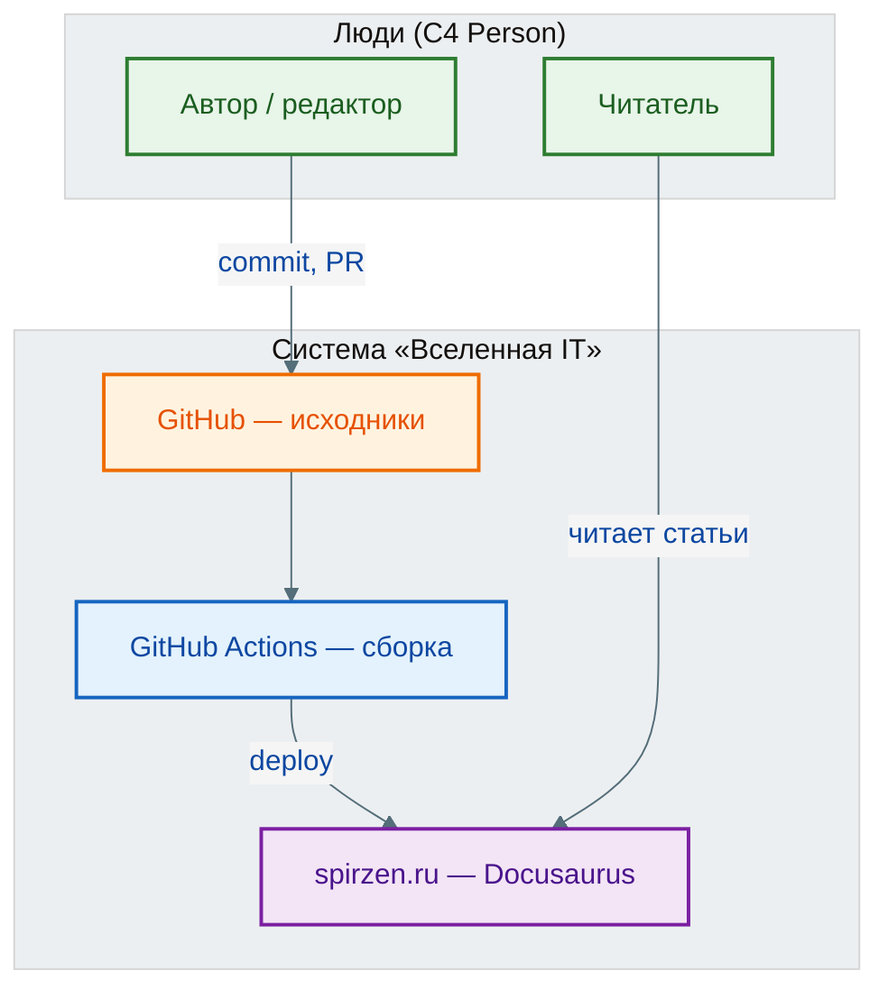

import ExternalPlayEmbed from '@site/src/components/ExternalPlayEmbed';
import BpmnNotationLegend from '@site/src/components/BpmnNotationLegend';
import BpmnIcon from '@site/src/components/BpmnIcon';

# Основы диаграмм и моделирования

  ОБЯЗАТЕЛЬНО
  ДЛЯ НОВИЧКОВ

Аналитику
Архитектору
Руководителю
Техническому писателю

  
Зачем эта статья

  

  Здесь — <strong>общая теория и карта нотаций</strong>. Практика процессов (as-is/to-be, journey, DFD) — в <a href="./124">моделировании бизнес-процессов</a>; справочник элементов BPMN — в <a href="./129">129</a>; инструменты — в <a href="./126">126</a>.
  

<ExternalPlayEmbed example="project/diagram-studio" title="Студия UML, BPMN и C4" minHeight={560} playProps={{ initialMode: 'uml', modes: ["uml","bpmn","c4"] }} />

---

## 1. Что такое моделирование и зачем оно нужно

**Моделирование** — способ описать сложную систему упрощённо, но достаточно точно для конкретной задачи. Вы не копируете реальность один в один — вы **отбрасываете лишнее** и оставляете то, без чего нельзя принять решение, согласовать требования или спроектировать реализацию.

**Академическое определение.** Модель — формализованное представление объекта или системы, построенное с целью изучения, объяснения, проектирования или управления его структурой, поведением или состоянием (обобщение по ISO/IEC/IEEE 24765 и практике системной инженерии). Модель всегда **частична**: она адекватна только в рамках заявленной цели.

**По-человечески.** Представьте, что вы объясняете коллеге, как устроен интернет-магазин. На словах за пять минут вы опустите детали про цвет кнопок и версию PostgreSQL — но скажете про "корзину", "оплату" и "склад". Вы уже построили **ментальную модель**. Диаграмма — это та же идея, только зафиксированная на бумаге или в файле, по правилам нотации, чтобы её поняли не только вы.

### Зачем моделировать в IT

| Задача | Что даёт модель |
| :--- | :--- |
| **Согласование** | Бизнес, аналитик и разработчик смотрят на одну схему, а не на десять разных "картинок в голове" |
| **Снижение риска** | Ошибку на диаграмме исправить дешевле, чем в продакшене |
| **Передача знаний** | Новый сотрудник читает as-is процесс и C4-контекст быстрее, чем триста страниц переписки |
| **Автоматизация** | Исполняемый BPMN (Camunda, Flowable) — модель становится частью runtime |
| **Проектирование** | UML и ERD помогают дойти до кода и схемы БД без "угадывания" на ходу |

Моделирование не заменяет разговор с заказчиком и не гарантирует истину. Оно **структурирует** знания. Хорошая модель уменьшает энтропию — меньше двусмысленности, меньше "а я думал, что…".

### Две большие области в IT

1. **Процессы и операционная логика** — кто что делает, в каком порядке, при каких условиях. Нотации — [BPMN](#4-процессы-и-поведение--bpmn), EPC, блок-схемы, customer journey.
2. **Структура и архитектура ПО** — из чего собрана система, как части общаются, где лежат данные. Нотации — [UML](#5-структура-по--uml), [C4](#6-архитектура--c4), ArchiMate, [ERD](#7-данные--erd).

Смешивать их на одном листе без пояснения уровня — частая ошибка новичка. Процесс "оформить заказ" и контейнер "Order Service" отвечают на **разные вопросы**; оба нужны, но не на одной диаграмме без рамки "это процесс" / "это архитектура".

Дальше по проекту: [артефакты аналитика](./123) → практика процессов [Моделирование бизнес-процессов](./124) → [технический дизайн](./128) → раздел [7.06 Проектирование и архитектура](/encyclopedia/7-project/7-06-proektirovanie-i-arhitektura/intro).

---

## 2. Терминология

Ниже — **словарь из 50 терминов**, с которых удобно начинать. Для каждого: коротко "по-человечески" и формулировка ближе к учебнику. Расширенные определения — в [глоссарии](/glossary/intro).

### 2.1. Базовые понятия визуализации

| № | Термин | По-человечески | Академически / строго |
| :---: | :--- | :--- | :--- |
| 1 | **Модель** | Упрощённая "копия" реальности под задачу | Абстрактное представление системы с явной целью и границами достоверности |
| 2 | **Нотация** | Набор правил: "круг = событие, прямоугольник = задача" | Формальный язык графических символов и связей с заданной семантикой (BPMN 2.0, UML 2.x, C4) |
| 3 | **Диаграмма** | Рисунок по стандарту, который понимают специалисты | Графическое представление модели в рамках конкретной нотации |
| 4 | **Схема** | Быстрый эскиз "на салфетке", правила могут быть свободными | Графическое изображение без обязательного соответствия стандарту; часто черновик |
| 5 | **График** | Линии/столбцы по **числам во времени** | Визуализация количественных рядов (временны́е ряды, распределения, сравнения) |
| 6 | **Виджет** | Один блок на экране: KPI, таблица, мини-график | Элемент пользовательского интерфейса или дашборда с привязкой к источнику данных |
| 7 | **Дашборд** | Экран "всё важное сразу" для мониторинга | Компоновка виджетов и графиков для оперативного анализа метрик |
| 8 | **Визуализация** | Любой способ показать данные или структуру глазами | Преобразование информации в зрительную форму для познания или принятия решений |
| 9 | **Артефакт** | Любой "выход" работы: ТЗ, диаграмма, прототип | Осязаемый результат деятельности по ЖЦ ПО (см. [Артефакты аналитической деятельности](./123)) |
| 10 | **Абстракция** | Скрыть детали, оставить суть | Выделение существенных свойств объекта при игнорировании несущественных |

### 2.2. Элементы модели

| № | Термин | По-человечески | Академически / строго |
| :---: | :--- | :--- | :--- |
| 11 | **Сущность** | "Объект мира": заказ, пользователь, сервер | Идентифицируемый объект предметной области со состоянием и/или поведением |
| 12 | **Связь** | "A связан с B" | Отношение между сущностями: ассоциация, зависимость, агрегация, FK |
| 13 | **Атрибут** | Поле сущности: имя, цена, дата | Именованное свойство сущности с типом и ограничениями |
| 14 | **Актёр** | Кто взаимодействует с системой снаружи | Роль вне системы, инициирующая или получающая поведение (UML, C4 Person) |
| 15 | **Событие** | "Что-то произошло" — старт, таймер, сообщение | Момент изменения состояния, триггер перехода в процессе или автомате |
| 16 | **Состояние** | "Сейчас заказ в статусе Оплачен" | Дискретное значение жизненного цикла объекта при заданных правилах переходов |
| 17 | **Переход** | Стрелка "из А в Б" | Условие или действие смены состояния или шага процесса |
| 18 | **Контейнер** (C4) | Крупная часть системы: приложение, БД, очередь | Единица развёртывания или исполнения с технологической границей |
| 19 | **Компонент** | Модуль внутри приложения | Логическая часть контейнера с явными зависимостями |
| 20 | **Граница системы** | Что "внутри нашего продукта", что снаружи | Scope модели: что включено в описание, а что — внешняя зависимость |

### 2.3. Уровни и аудитория

| № | Термин | По-человечески | Академически / строго |
| :---: | :--- | :--- | :--- |
| 21 | **Уровень абстракции** | "Насколько крупно рисуем" | Степень детализации модели от контекста до кода |
| 22 | **Аудитория диаграммы** | Для кого рисуем: директор, разработчик, аудитор | Целевая группа потребителей модели, определяющая допустимую детализацию |
| 23 | **Контекст** (C4 L1) | Система как чёрный ящик среди людей и API | System Context: границы продукта и внешние взаимодействия |
| 24 | **Декомпозиция** | Разбить сложное на части | Иерархическое разбиение модели без потери связности |
| 25 | **Рефайнмент** | Уточнить грубую схему детальной | Связь моделей разного уровня (один шаг BPMN → подпроцесс) |
| 26 | **As-is** | Как работает сейчас | Модель текущего состояния (baseline) |
| 27 | **To-be** | Как должно быть после изменений | Целевая модель будущего состояния |
| 28 | **Gap analysis** | Разница между as-is и to-be | Сравнительный анализ разрывов процессов, систем или данных |
| 29 | **Scope** | Границы задачи: что входим, что нет | Ограничение предметной области и глубины моделирования |
| 30 | **Stakeholder** | Заинтересованная сторона | Субъект, чьи интересы затрагивает система или процесс |

### 2.4. Процессы и BPMN

| № | Термин | По-человечески | Академически / строго |
| :---: | :--- | :--- | :--- |
| 31 | **Бизнес-процесс** | Устойчивая цепочка работы к результату | Набор связанных действий, преобразующих входы в выходы для потребителя |
| 32 | **Задача (Task)** | Один шаг работы | Атомарное действие в потоке BPMN |
| 33 | **Подпроцесс** | "Мини-процесс внутри процесса" | Иерархическая инкапсуляция фрагмента процесса |
| 34 | **Шлюз (Gateway)** | Развилка: И/ИЛИ/исключающий выбор | Элемент ветвления, слияния или параллелизма потока |
| 35 | **Дорожка (Lane)** | Кто отвечает: отдел, роль, система | Swimlane: пространственное разделение ответственности |
| 36 | **Пул (Pool)** | Участник взаимодействия (организация, система) | Граница независимого процесса или контрагента |
| 37 | **Поток управления** | Порядок выполнения шагов | Sequence Flow в BPMN |
| 38 | **Поток сообщений** | Обмен между пулами | Message Flow между участниками |
| 39 | **Исполняемая модель** | Диаграмма, которую крутит движок | Executable BPMN с семантикой, поддерживаемой BPMS |
| 40 | **Хореография** | Кто кому что шлёт без внутренней логики | Choreography: протокол взаимодействия участников |

Подробно: [справочник BPMN 2.0](./129), [движки Camunda и Flowable](./130).

### 2.5. UML, архитектура, данные

| № | Термин | По-человечески | Академически / строго |
| :---: | :--- | :--- | :--- |
| 41 | **Класс** (UML) | Шаблон объекта с полями и методами | Классификатор экземпляров с атрибутами, операциями и отношениями |
| 42 | **Интерфейс** | Контракт "что должен уметь", без реализации | Спецификация операций; реализация в классах (Realization) |
| 43 | **Прецедент (Use Case)** | Сценарий "пользователь хочет…" | Спецификация поведения системы относительно актёров |
| 44 | **Диаграмма последовательности** | Кто кому что вызывает по времени | Interaction: обмен сообщениями между lifeline в хронологии |
| 45 | **Диаграмма состояний** | Жизненный цикл одного объекта | State Machine: состояния, события, guard-условия |
| 46 | **C4 Model** | Четыре zoom-уровня архитектуры | Context → Containers → Components → Code (Simon Brown) |
| 47 | **ERD** | Таблицы и связи в БД | Entity-Relationship Diagram: сущности, атрибуты, кардинальность |
| 48 | **Кардинальность** | Сколько с каждой стороны: 1, 0..*, 1..* | Ограничение кратности связи в ERD или UML |
| 49 | **Нормализация** | Убрать дубли и аномалии в таблицах | Декомпозиция схемы БД по нормальным формам (1НФ–BCNF) |
| 50 | **Метрика** | Измеримый показатель продукта | Количественная мера, агрегируемая во времени (DAU, conversion, ARPU) |

Дополнительно в глоссарии — [UML](/glossary/U#uml), [C4 Model](/glossary/C#c4-model), [бизнес-процесс](/glossary/Б#бизнес-процесс).

---

## 3. Какой вид визуализации выбирать?

Главная шпаргалка: **сначала вопрос, потом нотация**. Не "нам нужен BPMN", а "нужно показать, кто и в каком порядке согласует заявку".

### Таксономия: вопрос → визуализация

| Вопрос, который нужно закрыть | Что рисовать | Нотация / формат | Куда углубиться |
| :--- | :--- | :--- | :--- |
| Как сейчас / как будет работать **операция**? | Поток работ, роли, ветвления | BPMN 2.0, блок-схема | [Моделирование бизнес-процессов](./124), [Справочник по нотации BPMN 2.0](./129) |
| Кто **взаимодействует** с продуктом снаружи? | Контекст системы | C4 Context, Use Case | [§6](#6-архитектура--c4), [7.06](/encyclopedia/7-project/7-06-proektirovanie-i-arhitektura/1) |
| Из **чего состоит** система технически? | Сервисы, БД, очереди, UI | C4 Container, диаграмма компонентов UML | [§6](#6-архитектура--c4), [Инструменты аналитика](./126) |
| Как устроены **классы и связи** в коде? | Объектная модель | UML Class Diagram | [124#uml-class-diagram](./124#uml-class-diagram) |
| Как **объекты обмениваются** вызовами во времени? | Сценарий API, интеграция | UML Sequence, BPMN message | [Технический дизайн на основе требований](./128), [7.06 design](/encyclopedia/7-project/7-06-proektirovanie-i-arhitektura/design/intro) |
| Какие **статусы** у заказа, тикета, платежа? | Автомат состояний | UML State Machine, таблица переходов | [Моделирование бизнес-процессов](./124#статусные-модели--управление-состоянием-сущностей) |
| Как **хранятся данные**? | Таблицы, ключи, связи | ERD, логическая модель | [§7](#7-данные--erd) |
| Что **видит пользователь** и в каком порядке? | Экраны, клики | Wireframe, user flow, Figma | [Прототипирование интерфейсов и сценариев](./125), [1.25 Интерфейс](/encyclopedia/1-basics/1-25-interfeys/7) |
| Сколько **пользователей** дошло до оплаты? | Воронка, когорты | График, Sankey, BI | [§8](#8-аналитика-и-продукт--графики-воронки-дашборды), [Основы продуктовой аналитики](./1123) |
| Как меняется **выручка по месяцам**? | Динамика KPI | Линейный/столбчатый график | [Основы продуктовой аналитики](./1123), [3.11 Анализ данных](/encyclopedia/3-data-markup/3-11-analiz-dannyh/1) |
| Нужен ли **быстрый эскиз** на встрече? | Схема на доске | Свободная схема → потом BPMN/C4 | [Моделирование бизнес-процессов](./124) |
| Как **ИТ стыкуется с бизнес-целями** в корпорации? | Слои бизнес / приложение / инфра | ArchiMate | [Инструменты аналитика](./126#21-archimate) |
| Где **физически** крутятся сервисы? | Узлы, сети | UML Deployment, схема инфра | [8.06](/encyclopedia/8-infra-security/8-06-konteynerizatsiya-i-orkestratsiya/intro) |
| Как **данные текут** между системами? | Потоки без детализации шагов | DFD | [Моделирование бизнес-процессов](./124#dfd--потоки-данных-на-старте-проекта) |
| Какой **путь клиента** через каналы? | Этапы, боли, точки контакта | Customer Journey Map | [Моделирование бизнес-процессов](./124#customer-journey--путь-клиента) |

  
Правило одного листа

  

  Одна диаграмма — один уровень абстракции и одна аудитория. Для совета директоров — C4 Context и KPI. Для разработчиков — Sequence и Class Diagram. Смешивать на одном слайде "процесс согласования" и "микросервис Payment" — признак, что пора разнести на два артефакта.
  

### Диаграмма проектирования ≠ график аналитики

| | Диаграмма (BPMN, UML, C4, ERD) | График / дашборд |
| :--- | :--- | :--- |
| **Источник** | Модель в голове команды, требования | События, логи, транзакции в БД |
| **Цель** | Спроектировать или согласовать **будущее/структуру** | Понять **фактическое** поведение пользователей |
| **Меняется** | При смене требований или архитектуры | При каждом новом дне данных |
| **Типичная ошибка** | Рисуют "красивый BPMN" без интервью | Строят дашборд без определения метрики |

---

## 4. Процессы и поведение → BPMN

**BPMN** (Business Process Model and Notation) — стандарт OMG для описания **последовательности работ**, **событий**, **ветвлений** и **участников**. Это язык бизнес-аналитика и инженера процессов, а не схема классов.

**По-человечески.** BPMN отвечает на вопрос: "Что происходит шаг за шагом, кто за это отвечает и где ветвление?" Заказ создан → проверка склада → если нет — уведомление → иначе сборка → отгрузка.

**Академически.** BPMN 2.0 задаёт метамодель Flow Objects (Events, Activities, Gateways), Connecting Objects, Swimlanes и Artifacts с исполняемой семантикой для подмножества элементов.

### Три уровня в BPMN

| Уровень | Содержание | Когда использовать |
| :--- | :--- | :--- |
| **Организационный** | Пулы, дорожки, взаимодействие подразделений | Согласование с бизнесом, регламенты |
| **Процессный** | Задачи, шлюзы, события, потоки | As-is / to-be, ТЗ, автоматизация |
| **Исполняемый** | Детали для Camunda/Flowable: типы задач, сообщения, таймеры | CI/CD процессов, low-code |

### Минимальный набор элементов

<BpmnNotationLegend compact />

- **Стартовое событие** — <BpmnIcon id="start-none" /> круг с тонкой границей.
- **Задача** — <BpmnIcon id="task-none" /> прямоугольник со скруглением.
- **Шлюз XOR** — <BpmnIcon id="gateway-exclusive" /> ромб с «×» (один путь).
- **Конечное событие** — <BpmnIcon id="end-none" /> круг с жирной границей.
- **Дорожка** — <BpmnIcon id="lane" /> горизонтальная полоса роли или системы.

Не путайте **поток управления** (внутри пула) и **поток сообщений** (между пулами).

### Куда читать дальше

- Практика — gap analysis, journey, типичные ошибки — [Моделирование бизнес-процессов](./124)
- Полный справочник элементов — [Справочник по нотации BPMN 2.0](./129)
- Исполнение в продакшене — [BPMN-движки Camunda и Flowable](./130)
- Корпоративный контекст — [государство и бизнес / Camunda](/encyclopedia/1-basics/1-29-gosudarstvo-i-biznes/112)

---

## 5. Структура ПО → UML

**UML** (Unified Modeling Language) — семейство диаграмм OMG для **структуры** и **поведения** программных систем. Это не язык программирования: это **согласованная нотация** между аналитиком, архитектором и разработчиком.

### Две группы диаграмм

**Структурные** — "из чего состоит":

| Диаграмма | Назначение |
| :--- | :--- |
| **Классов** | Типы, поля, методы, наследование, ассоциации |
| **Компонентов** | Модули, библиотеки, API между ними |
| **Развёртывания** | Узлы, артефакты, сеть |
| **Пакетов** | Группировка по слоям или доменам |
| **Объектов** | Снимок экземпляров в момент времени |

**Поведенческие** — "как ведёт себя во времени":

| Диаграмма | Назначение |
| :--- | :--- |
| **Прецедентов** | Функции системы для актёров |
| **Последовательности** | Вызовы и сообщения по времени |
| **Состояний** | Жизненный цикл объекта |
| **Активности** | Поток действий с ветвлениями (близко к BPMN) |
| **Коммуникации** | Связи объектов с акцентом на структуру, не время |

### С чего начать новичку

1. **Use Case** — на этапе требований ([Основы анализа требований](./111)).
2. **Диаграмма классов** — ядро объектной модели перед кодом.
3. **Sequence** — для REST/gRPC и микросервисов ([Технический дизайн на основе требований](./128)).

Детальная нотация классов (видимость `+`/`-`, ассоциация vs композиция, интерфейсы) — в [Моделирование бизнес-процессов, раздел UML](./124#uml-class-diagram). Там же интерактивный эскиз.

Связь с кодом — [проектирование сущности](/encyclopedia/4-code-dev/4-03-vypolnenie-koda/1), [ООП](/encyclopedia/4-code-dev/4-08-oop/intro), [технический дизайн](./128).

---

## 6. Архитектура → C4

**C4 Model** (Simon Brown) — **иерархия из четырёх уровней** для описания архитектуры ПО без перегруза UML. Идея — как карты — сначала страна, потом город, потом дом.

| Уровень | Вопрос | Пример элементов |
| :--- | :--- | :--- |
| **1. Context** | Что делает система и с кем говорит? | Person, Software System, External System |
| **2. Containers** | Из каких крупных частей собрана? | Web App, API, Database, Message Broker |
| **3. Components** | Что внутри одного контейнера? | Controllers, Services, Repositories |
| **4. Code** | Какие классы/модули? | Опционально; часто достаточно IDE и Class Diagram |

**Правило практики:** держите C4 на **Context и Container** в общей документации; Components — для онбординга в сервис; Code — точечно или не на диаграмме вовсе ([FAQ 7.06](/encyclopedia/7-project/7-06-proektirovanie-i-arhitektura/998)).

### Пример: "Вселенная IT" (этот репозиторий)

| Уровень C4 | "Вселенная IT" (it-knowledge-base) |
| :--- | :--- |
| **Context** | Читатель, автор, GitHub, spirzen.ru |
| **Containers** | Репозиторий; Docusaurus (`docs`, `src`, `static`); GitHub Actions; GitHub Pages |
| **Components** | Тема, remark-плагины, `src/components/*`, скрипты `scripts/*.mjs` |
| **Code** | Отдельные React-компоненты и MDX-страницы (по необходимости) |

Сводная схема — на [странице "О проекте"](/about/project#arhitektura-proekta).

Инструменты — Structurizr, Mermaid C4, PlantUML, Draw.io — [инструменты аналитика](./126#22-c4-model). Углубление: [основы проектирования](/encyclopedia/7-project/7-06-proektirovanie-i-arhitektura/1), [роль архитектора](/encyclopedia/7-project/7-06-proektirovanie-i-arhitektura/117).

---

## 7. Данные → ERD

**ERD** (Entity-Relationship Diagram) описывает **логическую структуру данных** — сущности (будущие таблицы), атрибуты (столбцы), связи и **кардинальность** (один-ко-многим и т.д.).

**По-человечески.** ERD отвечает: "Какие сущности храним и как они ссылаются друг на друга?" Пользователь — Заказ — Строка заказа — Товар.

**Отличие от UML Class Diagram.** ERD заточен под **реляционную БД** (PK, FK, нормализация). Диаграмма классов — под **объектную модель** в коде (наследование, интерфейсы, методы). На одном проекте часто живут **обе**: ERD для DBA, классы — для разработки; расхождения нужно явно согласовывать.

### Минимальный чеклист ERD

- У каждой сущности есть **идентификатор** (PK).
- Связи подписаны глаголом — "содержит", "принадлежит", "оформляет".
- Кардинальность с обеих сторон — `1`, `N`, `0..1`.
- Имена согласованы с [словарём данных](/encyclopedia/7-project/7-04-analitika/1121).

### Куда читать дальше

- Теория ER и нотации Chen / Crow's Foot — [Entity Relationship](/encyclopedia/3-data-markup/3-05-osnovy-baz-dannyh/11); иерархии супертип/подтип (EER) — [расширенная ER-модель](/encyclopedia/3-data-markup/3-05-osnovy-baz-dannyh/11#rasshirennaya-er-model)
- Нормализация — [SQL, нормальные формы](/encyclopedia/3-data-markup/3-07-sql/104#normalnye-formy)
- SQL на практике — [SQL для аналитики](./1122), [PostgreSQL](/encyclopedia/3-data-markup/3-07-sql/888)
- ERD рядом с классами — [Моделирование бизнес-процессов](./124#uml-class-diagram) (интерактив `erd-demo`)

---

## 8. Аналитика и продукт — графики, воронки, дашборды

Этот блок **не про проектирование**, а про **наблюдение за реальностью** — что пользователи уже делают в продукте, сколько денег приносит канал, где отваливаются.

### Типы визуализаций в продукте и BI

| Тип | Вопрос | Пример |
| :--- | :--- | :--- |
| **Линейный график** | Как метрика меняется во времени? | DAU по неделям |
| **Столбчатая диаграмма** | Сравнить категории | Выручка по регионам |
| **Воронка (funnel)** | Где теряем пользователей по шагам? | Визит → регистрация → оплата |
| **Когортный анализ** | Как ведут себя группы, пришедшие в разные даты? | Retention 7/30 дней |
| **KPI-карточка** | Одно число "здесь и сейчас" | Конверсия 3,2% |
| **Таблица / pivot** | Детализация с фильтрами | Топ SKU по марже |
| **Карта / heatmap** | Пространственное или плотностное распределение | Клики на макете |
| **Sankey** | Потоки между состояниями | Миграция статусов заказов |

**Виджет** — один такой блок на дашборде. **Дашборд** — компоновка виджетов для роли (CEO, поддержка, маркетинг).

### Отличие от BPMN/UML

- График строится из **логов и витрин** (ClickHouse, BigQuery, PostgreSQL, Amplitude).
- Диаграмма процесса описывает **задуманную** логику; воронка показывает, **как вышло на самом деле**.
- Если воронка расходится с BPMN to-be — либо продукт ведут иначе, либо модель устарела.

### Куда читать дальше

- [Основы продуктовой аналитики](./1123)
- [Как переводить бизнес-задачи на язык данных](./1121)
- [Инструменты аналитика — BI](./126#5-системы-бизнес-аналитики-bi) (Power BI, Tableau, DataLens)
- [Анализ данных — раздел 3.11](/encyclopedia/3-data-markup/3-11-analiz-dannyh/1)

---

## 9. Инструменты

Один инструмент редко закрывает всё. Типичный стек аналитика:

| Задача | Инструмент | Зачем |
| :--- | :--- | :--- |
| Текстовые диаграммы в git | **Mermaid**, PlantUML | Версионирование рядом с docs, CI-рендер |
| Универсальные схемы | **Draw.io** (diagrams.net) | BPMN, UML, C4, экспорт PNG/SVG |
| Процессы enterprise | Bizagi, Camunda Modeler, ELMA | Валидация BPMN, исполнение |
| Архитектура C4 | Structurizr, Mermaid C4 | Уровни Context–Container |
| UX-прототип | **Figma** | Wireframe до ТЗ |
| BI и дашборды | Power BI, Tableau, DataLens | Метрики и виджеты |

Подробное сравнение, стек по BABOK и чеклист внедрения — [Инструменты аналитика](./126).

Диаграммы в этой энциклопедии: **mermaid** в markdown, интерактив — [play.spirzen.ru](https://play.spirzen.ru/). Образец пайплайна — [О проекте](/about/project#it-universe-build-mermaid).

---

## 10. Типичные ошибки

### 1. Смешение уровней абстракции

На одной диаграмме "пользователь нажал кнопку", "Kubernetes pod" и "таблица Orders". **Лечение:** разнести на C4 Context, BPMN и ERD; связать ссылками в документе.

### 2. Перегрузка диаграммы

Сорок классов или пятнадцать дорожек BPMN на одном листе. **Лечение:** декомпозиция — подпроцесс, отдельная диаграмма компонентов, ссылка "см. рис. 2".

### 3. Игнорирование семантики нотации

Ромб без типа шлюза, пунктир там, где нужна ассоциация. **Лечение:** [Справочник по нотации BPMN 2.0](./129) для BPMN, [124#uml-class-diagram](./124#uml-class-diagram) для UML.

### 4. Устаревшая диаграмма хуже отсутствующей

Код уехал, на схеме — монолит 2019 года. **Лечение:** C4 только на Context/Container в git; дата и владелец на диаграмме; ADR при смене архитектуры ([7.06](/encyclopedia/7-project/7-06-proektirovanie-i-arhitektura/design/119)).

### 5. Моделирование того, чего нет

Идеальный to-be без интервью с операторами. **Лечение:** сначала as-is ([Моделирование бизнес-процессов](./124#gap-analysis--as-is-и-to-be)), потом gap.

### 6. Путаница графика и диаграммы проектирования

Строят "BPMN" из цифр продаж. **Лечение:** см. [§3](#диаграмма-проектирования--график-аналитики).

### 7. Диаграмма без аудитории

Sequence с внутренними DTO для CEO. **Лечение:** подписать "для кого" и "какой вопрос закрывает".

### 8. Нет легенды и версии

В приложении к ТЗ блок-схема без расшифровки символов. **Лечение:** [техническое письмо — требования к приложениям](/encyclopedia/7-project/7-08-tehnicheskoe-pismo/15).

---

## Маршрут после этой статьи

| Роль | Следующие шаги |
| :--- | :--- |
| **Бизнес-аналитик** | [Моделирование бизнес-процессов](./124) → [Справочник по нотации BPMN 2.0](./129) → [BPMN-движки Camunda и Flowable](./130) → [Формализация и управление требованиями](./116) |
| **Системный аналитик** | [124#uml-class-diagram](./124#uml-class-diagram) → [Технический дизайн на основе требований](./128) → [7.06](/encyclopedia/7-project/7-06-proektirovanie-i-arhitektura/intro) |
| **Продукт** | [Основы продуктовой аналитики](./1123) → [Как переводить бизнес-задачи на язык данных](./1121) |
| **Архитектор** | [C4 на проекте](/about/project#arhitektura-proekta) → [Основы проектирования и архитектуры программного обеспечения](/encyclopedia/7-project/7-06-proektirovanie-i-arhitektura/1) → [Роль и практика архитектора программного обеспечения](/encyclopedia/7-project/7-06-proektirovanie-i-arhitektura/117) |

Закрепление: [Аналитика — итоги](./998), [чек-лист](./999).
