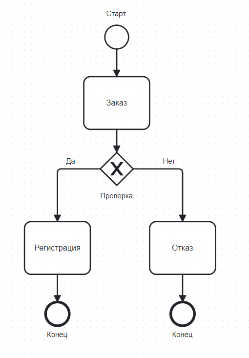

import ERDDemo from '@site/src/components/ERDDemo.jsx';

# Моделирование бизнес-процессов

  ОБЯЗАТЕЛЬНО
  ДЛЯ НОВИЧКОВ

Аналитику
Архитектору
Руководителю
Техническому писателю

## Моделирование бизнес-процессов

### Что такое моделирование?

**Моделирование** — одна из базовых интеллектуальных практик, применяемых при анализе, проектировании, управлении и передаче знаний о сложных системах. Оно позволяет абстрагироваться от избыточной детализации реального объекта или явления и создать его упрощённое, но функционально адекватное представление — модель. Цель моделирования — выделить существенные аспекты, которые необходимы для решения конкретной задачи: будь то анализ производственного цикла, описание архитектуры программного обеспечения или проектирование пользовательского сценария.

В IT-сфере, где сложность систем растёт экспоненциально, моделирование становится обязательной практикой. Без моделей невозможно согласовать требования между бизнесом и разработчиками, обеспечить преемственность знаний, верифицировать логику процессов или спроектировать масштабируемую архитектуру. Модели служат языком, на котором общаются аналитики, архитекторы, разработчики, заказчики и эксплуатационные команды.

---

### Что такое модель?

Модель — это формализованное представление сущности (или системы сущностей), построенное с целью изучения, объяснения, проектирования или управления её поведением, структурой или состоянием. Модель **всегда является упрощением** реальности: она отбрасывает несущественные детали и сохраняет только те характеристики, которые важны для поставленной цели.

Например, модель бизнес-процесса «обработка заказа» не содержит информации о том, какое программное обеспечение использует оператор, но точно фиксирует последовательность шагов, участников, условия переходов и результаты. Это позволяет сосредоточиться на логике процесса, а не на технических или человеческих деталях.

Модель может быть:
- **графической** (диаграмма, схема),
- **математической** (уравнение, формула),
- **текстовой** (описание на естественном языке с формальными ограничениями),
- **имитационной** (вычислительная модель, воспроизводящая поведение во времени).

В контексте IT-анализа и проектирования доминируют графические и текстовые модели, построенные по строгим правилам — нотациям.

---

### Что такое сущность и связь между сущностями?

Сущность — это объект реального или концептуального мира, который обладает идентичностью, состоянием и поведением. В IT-моделировании сущностями могут быть:
- физические объекты (пользователь, товар, сервер),
- абстрактные понятия (заказ, статус, роль),
- процессы (регистрация, авторизация),
- данные (запись в таблице, сообщение в очереди).

Связь между сущностями — это отношение, которое выражает зависимость, взаимодействие, ассоциацию или иерархию между двумя или более сущностями. Связи могут быть:
- **структурными** (например, «пользователь имеет профиль»),
- **поведенческими** («процесс А вызывает процесс Б»),
- **временными** («событие X предшествует действию Y»),
- **логическими** («если условие выполняется, то происходит переход»).

Моделирование сущностей и связей — это ядро любой системной модели. Процедура его выполнения включает следующие шаги:
1. **Идентификация домена** — определение предметной области, в рамках которой строится модель.
2. **Выявление ключевых сущностей** — через интервью, документы, наблюдение.
3. **Определение атрибутов сущностей** — какие свойства важны для решения задачи.
4. **Фиксация связей** — как сущности взаимодействуют, какие ограничения на эти взаимодействия накладываются.
5. **Валидация модели** — проверка на полноту, непротиворечивость и соответствие цели.

Этот алгоритм применяется как при построении ER-диаграмм для баз данных, так и при создании UML-диаграмм классов, и даже при анализе бизнес-процессов в BPMN (где сущностями выступают задачи, события, участники).

---

### Что такое диаграмма, схема, алгоритм?

Эти термины часто используются как синонимы, но имеют различия в строгом смысле.

- **Диаграмма** — графическое представление абстрактной структуры или поведения системы с использованием стандартизированных символов и связей. Диаграммы создаются в рамках конкретной нотации (например, BPMN, UML) и служат для коммуникации, анализа и проектирования.
  
- **Схема** — более широкое понятие. Это упрощённое графическое изображение, которое может не соответствовать строгой нотации. Схема часто используется на ранних этапах анализа для быстрой визуализации идеи. Например, белборд-схема процесса «как есть» может содержать только стрелки и подписи, без соблюдения BPMN-стандарта.

- **Алгоритм** — формальное описание последовательности действий для достижения результата. Алгоритм может быть представлен в виде текста, псевдокода или блок-схемы. В отличие от диаграммы, алгоритм фокусируется на **вычислительной логике**, а не на взаимодействии сущностей или участников.

Для аналитика все три формы важны:
- **алгоритмы** помогают уточнить логику принятия решений внутри процесса,
- **схемы** — быстро зафиксировать текущее состояние или предложить решение,
- **диаграммы** — стандартизировать описание для дальнейшей реализации, автоматизации или документирования.

---

### Моделирование и проектирование процессов и архитектуры систем

В IT две основные области применения моделирования:
1. **Бизнес-процессы и операционная логика** — моделируются с помощью BPMN, EPC, IDEF0. Цель — описать, как выполняется работа, кто участвует, какие условия и результаты.
2. **Архитектура и структура программных систем** — моделируются с помощью UML, C4, ArchiMate. Цель — описать компоненты, их взаимодействие, зависимости, данные и поведение.

Обе области используют диаграммы, но с разной семантикой. В BPMN центральную роль играют **потоки выполнения** и **участники**, в UML — **объекты**, **классы** и **сообщения между ними**. Смешивать эти подходы без чёткого разграничения целей — распространённая ошибка начинающих аналитиков.

Самые распространённые, из-за своей эффективности и простоты – модели в виде блок-схем (flowchart), где логика организована через лёгкое графическое представление, доходчиво показывающее даже человеку, не знакомому с нотациями и принципами. Даже если вы сейчас видите эти термины впервые, вы всё равно легко поймёте, что изображено здесь:

---

### Виды диаграмм в UML

Unified Modeling Language (UML) — это семейство нотаций, разделённых на две большие группы:

#### Структурные диаграммы
Описывают **статическую структуру** системы:
- **Диаграмма классов** — основной инструмент проектирования объектной модели. Показывает классы, их атрибуты, методы и отношения (наследование, ассоциация, агрегация, композиция).
- **Диаграмма объектов** — снимок экземпляров классов в определённый момент времени.
- **Диаграмма компонентов** — отображает модули системы (библиотеки, сервисы, файлы) и их зависимости.
- **Диаграмма развертывания** — показывает физическое размещение компонентов на узлах (серверах, контейнерах).
- **Диаграмма пакетов** — группировка элементов по логическим или организационным признакам.

#### Поведенческие диаграммы
Описывают **динамику** системы:
- **Диаграмма прецедентов (Use Case)** — сценарии взаимодействия актёров с системой. Используется на этапе сбора требований.
- **Диаграмма активности** — аналог блок-схемы, но с поддержкой параллелизма, потоков и объектов. Часто применяется как мост между BPMN и UML.
- **Диаграмма последовательности** — хронологическое взаимодействие объектов через обмен сообщениями. Ключевой инструмент для проектирования API и микросервисов.
- **Диаграмма состояний (State Machine)** — жизненный цикл объекта, переходы между состояниями по событиям.
- **Диаграмма коммуникации** — акцент на связях между объектами, а не на временной последовательности.

ERD (Entity-Relationship Diagram) формально не входит в UML, но часто используется параллельно с диаграммой классов при проектировании баз данных. ERD фокусируется на сущностях и связях между ними, без учёта поведения.

<ERDDemo />

---

### Что такое нотация?

Нотация — это формализованная система обозначений, включающая:
- **алфавит** — набор графических и текстовых элементов (символов),
- **синтаксис** — правила их комбинирования и соединения,
- **семантику** — точное значение каждого элемента в контексте модели.

Нотация обеспечивает **единообразие**, **однозначность** и **интерпретируемость** моделей. Без стандартизированной нотации диаграмма превращается в иллюстрацию, а не в инструмент анализа. Например, ромб в блок-схеме может означать «решение», но в BPMN ромб — это **шлюз**, и его тип (исключающий, параллельный и т.д.) строго определяет поведение потока.

Использование нотации позволяет:
- автоматизировать анализ (проверка на полноту, зацикленность),
- генерировать код или исполняемые процессы,
- поддерживать модели в долгосрочной перспективе.

---

### Нотации бизнес-процессов: BPMN, EPC, IDEF0

#### BPMN 2.0: три уровня моделирования

Business Process Model and Notation (BPMN) — наиболее распространённая нотация для описания бизнес-процессов. Её ключевое преимущество — поддержка **трёх уровней детализации**, соответствующих разным целям:

1. **Описательный (согласовательный) уровень**  
   Цель — донести суть процесса до заинтересованных сторон (бизнес-пользователей, руководителей). Используются только основные элементы: события, задачи, последовательные потоки, пулы и дорожки. Условия и данные не детализируются. Такая модель служит основой для согласования «как должно быть».

2. **Аналитический уровень**  
   Цель — глубокий анализ процесса: выявление узких мест, избыточных шагов, рисков. Добавляются шлюзы с условиями, данные, исключения, временные ограничения. Модель становится инструментом для оптимизации и верификации логики.

3. **Исполняемый уровень**  
   Модель становится технической спецификацией, пригодной для автоматизации в BPM-системах (например, Camunda, Flowable, ELMA365). Здесь детализируются все переменные, скрипты, сервисные задачи, обработчики ошибок. Такая модель может быть напрямую загружена в движок и выполнена.

Эта многоуровневость делает BPMN уникальной: одна и та же нотация покрывает весь жизненный цикл — от инициативы до реализации.

#### Элементы BPMN 2.0

Основные элементы BPMN делятся на категории:

- **События** (Events) — круги, обозначающие что-то, что происходит (старт, промежуточное, завершение). Могут быть запускающими (start), промежуточными (timer, message, error) и завершающими (end). События не выполняют действие — они **реагируют** или **инициируют**.

- **Действия** (Activities) — прямоугольники. Это задачи, подпроцессы, транзакции. Действие — единица работы, которая изменяет состояние системы.

- **Шлюзы** (Gateways) — ромбы. Управляют потоком выполнения:
  - **Исключающий (Exclusive)** — выбор одного пути по условию.
  - **Параллельный (Parallel)** — запуск всех исходящих потоков одновременно.
  - **Инклюзивный (Inclusive)** — запуск одного или нескольких путей, соответствующих условиям.
  - **Событийный (Event-based)** — выбор пути на основе события (например, получение сообщения или таймера).

- **Соединяющие элементы**:
  - **Последовательные потоки** — сплошные стрелки с условиями.
  - **Потоки сообщений** — пунктирные стрелки между пулами.
  - **Ассоциации** — пунктирные линии для привязки артефактов (данных, аннотаций).

- **Зоны ответственности**:
  - **Пул (Pool)** — представляет участника процесса (организацию, систему).
  - **Дорожка (Lane)** — подразделение пула по ролям или функциям. Все элементы внутри дорожки принадлежат одному исполнителю.

- **Артефакты**: данные, группы, аннотации — для пояснения, не влияют на выполнение.

#### Хороший стиль моделирования BPMN

- Избегать «диаграмм-спагетти»: разбивать сложные процессы на подпроцессы.
- Использовать осмысленные названия задач (глагол + объект: «Проверить наличие товара»).
- Не смешивать уровни: не вставлять исполняемые детали в согласовательную модель.
- Соблюдать направление потока (слева направо, сверху вниз).
- Минимизировать пересечения потоков.
- Всегда указывать условия на исходящих потоках шлюзов.

---

#### EPC (Event-driven Process Chain)

EPC — нотация, популярная в SAP-среде и в Европе. Основана на чередовании **событий** и **функций**. Ключевое правило: между двумя функциями всегда должно быть событие, и наоборот. Шлюзы (AND, OR, XOR) управляют потоками, но их семантика жёстко привязана к типу узла: XOR может стоять только после функции, так как решение принимается **исполнителем**, а не автоматически при наступлении события.

EPC менее гибка, чем BPMN, и не поддерживает исполняемые модели, но хорошо подходит для высокоуровневого описания процессов в ERP-системах.

---

#### IDEF0

IDEF0 — методология функционального моделирования, возникшая в военно-промышленном комплексе США. Каждая функция изображается как прямоугольник с четырьмя типами входов:
- **Входы (Inputs)** — что преобразуется,
- **Управление (Controls)** — правила, стандарты, политики,
- **Механизмы (Mechanisms)** — кто или что выполняет,
- **Выходы (Outputs)** — результат.

IDEF0 строится иерархически: верхний уровень — общая цель, нижние — детализация. Подходит для анализа сложных производственных или государственных систем, но не для IT-процессов с динамической логикой.

---

### Моделирование в жизненном цикле проекта

Модель — инструмент, встроенный в процессы анализа, проектирования, реализации и эксплуатации. Её ценность определяется не красотой диаграммы, а тем, насколько она способствует принятию решений, снижению рисков и ускорению разработки.

В типичном IT-проекте модели появляются на следующих этапах:

1. **Инициация и сбор требований**  
   Используются высокоуровневые диаграммы:  
   - BPMN (описательный уровень) — для фиксации «как есть» и «как должно быть»;  
   - Use Case — для выявления сценариев взаимодействия пользователей с системой;  
   - IDEF0 — при анализе сложных организационных процессов (например, в госсекторе или производстве).  
   Цель — создать общий язык между заказчиком и командой.

2. **Анализ и проектирование**  
   Происходит детализация:  
   - BPMN переходит на аналитический уровень — добавляются условия, исключения, данные;  
   - UML-диаграммы классов и последовательностей описывают структуру и поведение системы;  
   - ERD уточняет модель данных.  
   На этом этапе модели становятся основой для технического задания и спецификации.

3. **Реализация и автоматизация**  
   - BPMN-модель может быть преобразована в исполняемый процесс (BPM-движок);  
   - UML-диаграммы используются для генерации каркасов кода (code scaffolding) или верификации архитектуры;  
   - Диаграммы компонентов и развертывания служат инструкцией для DevOps.

4. **Эксплуатация и сопровождение**  
   Модели становятся частью документации:  
   - BPMN-схемы — для обучения новых сотрудников;  
   - UML-диаграммы — для понимания логики при доработке;  
   - Статусные модели — для отладки и мониторинга состояний сущностей.

Если модель не обновляется в ходе проекта, она быстро устаревает и теряет ценность. Поэтому важно поддерживать **живые модели** — синхронизированные с реальной системой через процессы версионирования и контроля изменений.

---

### Типичные ошибки при моделировании

#### 1. Смешение уровней абстракции  
Аналитик рисует BPMN-диаграмму для согласования с заказчиком, но включает в неё технические детали: «Вызвать REST API», «Записать в таблицу Orders». Это нарушает принцип описательного уровня — заказчик не понимает терминов, а разработчик не получает формальной спецификации. Решение: чётко разделять модели по целям.

#### 2. Игнорирование семантики нотации  
Пример: использование шлюза «Исключающее ИЛИ» без указания условий на исходящих потоках. В результате неясно, по какому критерию происходит выбор. В BPMN каждая ветвь эксклюзивного шлюза должна быть помечена условием (даже если одно — «по умолчанию»). Иначе модель неполна.

#### 3. Перегрузка диаграмм  
Одна BPMN-схема на 50 задач, 10 пулов и 15 шлюзов теряет читаемость. Правило: если диаграмма не помещается на одном экране без прокрутки, её нужно декомпозировать. Используйте подпроцессы (collapsed subprocess) для группировки логически связанных шагов.

#### 4. Отсутствие зон ответственности  
Процесс нарисован без дорожек. Возникает вопрос: кто выполняет задачу? Это особенно критично при автоматизации — система должна знать, кому направить задачу. Даже если исполнитель один, дорожка повышает ясность.

#### 5. Моделирование того, чего нет  
Аналитик проектирует «идеальный» процесс, игнорируя текущие ограничения (например, отсутствие API у внешней системы). Такая модель не реализуема. Модели должны быть **практически осуществимы** в рамках архитектурных и организационных рамок.

---

### Статусные модели: управление состоянием сущностей

Статусная модель — это специализированная форма моделирования, описывающая **жизненный цикл сущности через дискретные состояния и переходы между ними**. Она применяется везде, где объект проходит через фиксированные этапы: заявка, заказ, инцидент, пользовательский аккаунт.

Статусная модель формализуется через:
- **Состояния** (статусы): «Создан», «На согласовании», «Отклонён», «Завершён».
- **Переходы**: триггеры, приводящие к смене статуса («Отправить на согласование», «Отклонить»).
- **Условия перехода**: бизнес-правила, при которых переход разрешён (например, только руководитель может отклонить заявку).
- **Действия при переходе**: автоматические операции (отправка уведомления, изменение поля в БД).

Хотя статусные модели часто реализуются в коде (например, state machine в C# или Python), их **визуальное представление** критически важно:
- Для согласования бизнес-логики с заказчиком;
- Для документирования допустимых сценариев;
- Для выявления недостижимых или избыточных состояний.

В UML статусные модели отображаются на **диаграммах состояний (State Machine Diagrams)**. В BPMN — через комбинацию событий и шлюзов, хотя это менее удобно. В ряде low-code платформ (включая ELMA365) статусные модели выносятся в отдельный конструктор, что подчёркивает их значимость.

Пример: жизненный цикл заявки на отпуск может включать состояния  
`Черновик → На согласовании → Согласовано → Отклонено → В архиве`.  
Переход из «На согласовании» в «Согласовано» возможен только после действия «Руководитель одобрил», а возврат в «Черновик» — запрещён по бизнес-правилу.

Статусная модель — это не просто перечень статусов. Это **формальная система управления поведением сущности**, предотвращающая некорректные переходы (например, нельзя оплатить «Отменённый заказ»).

---

### Интеграция разных нотаций: когда и зачем

На практике редко используется только одна нотация. Комплексный проект требует **многомерного моделирования**:

- **BPMN + UML**  
  BPMN описывает процесс «Обработка заказа», а UML — компоненты системы, участвующие в этом процессе (сервис оплаты, сервис склада). Связка осуществляется через идентификаторы задач: задача в BPMN «Проверить оплату» соответствует вызову метода в компоненте «PaymentService».

- **BPMN + ERD**  
  При моделировании процесса, связанного с данными (например, «Регистрация клиента»), BPMN показывает поток действий, а ERD — структуру сущностей «Клиент», «Контакт», «Документ». Это необходимо для проектирования БД и валидации бизнес-правил.

- **IDEF0 + BPMN**  
  IDEF0 применяется на стратегическом уровне («Как работает логистика компании?»), BPMN — на тактическом («Как оформляется отгрузка?»). IDEF0 даёт контекст, BPMN — детализацию.

Ключевой принцип: **каждая нотация решает свою задачу**. Попытка «всё смоделировать в BPMN» приведёт к неуклюжим, перегруженным схемам. Аналогично — UML плохо подходит для описания ролей и временных задержек в бизнес-процессах.

---

### Архитектурная роль моделирования

Моделирование — не прерогатива аналитиков. Оно пронизывает все слои IT-деятельности:

- **Архитектор** использует UML и C4 для проектирования микросервисной архитектуры;
- **DevOps-инженер** опирается на диаграммы развертывания при настройке CI/CD;
- **Тестировщик** строит тест-кейсы на основе диаграмм последовательности и состояний;
- **Преподаватель** использует BPMN для объяснения логики автоматизации.

Модель — это **артефакт знания**, который сохраняет понимание системы даже при смене команды. Отсутствие моделей ведёт к «знанию в головах», что увеличивает риски при масштабировании, аудите или передаче проекта.

---