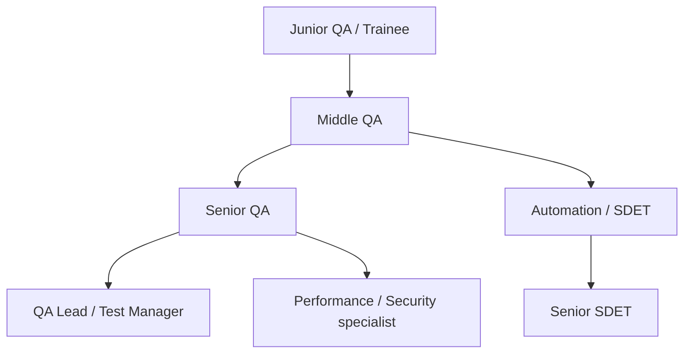
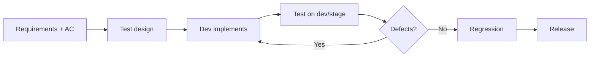

# Добро пожаловать в тестирование

<div class="article-tags">
  <span class="tag tag-required">ОБЯЗАТЕЛЬНО</span>
  <span class="tag tag-beginner">ДЛЯ НОВИЧКОВ</span>
</div>

<span class="complexity-badge">Тестировщику</span>

<div class="callout callout--info">
  <div class="callout-title">С чего начать раздел</div>
  <div class="callout-body">
  Эта статья — входная точка для новичков в QA. Дальше — <a href="./1">Основы тестирования</a>, маршрут в <a href="./intro">о разделе</a>.
  Онбординг в команде — <a href="/encyclopedia/7-project/7-09-bazy-znaniy-i-zadachniki/24">онбординг-пакет</a>.
  </div>
</div>

---

## Кто такой QA

**QA** (Quality Assurance, обеспечение качества) — специалист, который **проверяет**, что программа соответствует требованиям и **не навредит** пользователю, бизнесу и данным.

QA занимается **управлением риском**:

- что может пойти не так;
- как воспроизвести проблему стабильно;
- как задокументировать дефект так, чтобы разработчик исправил с первого раза;
- как убедиться, что исправление не сломало другое (регресс).

Это **не** "кликать всё подряд" и **не** "мешать релизу ради формальности". Хороший QA **ускоряет** поставку: дефекты дешевле ловить на dev и stage, чем в production с angry users и ночными hotfix.

### QA и QC — в чём разница

| Термин | Фокус |
|--------|-------|
| **QC** (Quality Control) | Контроль: проверка готового продукта |
| **QA** (Quality Assurance) | Обеспечение: процесс, чтобы качество было встроено |

На практике в IT заголовок "QA" часто включает и ручное тестирование, и участие в улучшении процесса (DoD, риски на refinement).

---

## Роли внутри QA

| Роль | Чем занимается | Типичный стек |
|------|----------------|---------------|
| **Manual QA** | Ручные сценарии, exploratory, UI/UX проверки | Jira, DevTools, Charles |
| **Automation QA / SDET** | Автотесты API/UI, CI | Python/Java/JS, Selenium, Playwright |
| **Performance QA** | Нагрузка, стресс | k6, JMeter, Grafana |
| **Security QA** | Базовые проверки, совместно с AppSec | OWASP ZAP, burp (под руководством) |

Один человек на старте карьеры часто совмещает manual + немного API/SQL. Углубление — по [карте раздела](./intro).

Подробнее — [Основы тестирования](./1), [классификация видов](./111).

---

## QA и разработчик — разные фокусы

| | Разработчик | QA |
|---|-------------|-----|
| Главный вопрос | Как **реализовать** требование | Как **проверить** и **опровергнуть** ожидания |
| Артефакты | Код, Pull Request | Чек-листы, тест-кейсы, баг-репорты |
| Успех | Фича работает по задумке автора | Дефекты найдены **до** пользователя |
| Мышление | Синтез решения | Анализ рисков и граничных случаев |

В **зрелой** команде:

- разработчик пишет **unit-тесты** и часть integration;
- QA расширяет покрытие: integration, E2E, exploratory, регресс, non-functional ([карта уровней](./131));
- оба участвуют в refinement acceptance criteria.

<div class="callout callout--tip">
  <div class="callout-title">Совместная работа</div>
  <div class="callout-body">
  Цель QA — не "поймать" разработчика, а **снять риск** до релиза. Хороший баг-репорт — подарок, не обвинение.
  </div>
</div>

---

## Карьерный путь в QA



### Junior QA (0–1.5 года)

**Ожидания:**

- ручное тестирование по чек-листам и AC;
- воспроизводимые баг-репорты;
- базовый SQL, HTTP, DevTools;
- участие в регрессе перед релизом.

**Рост:** [техники тест-дизайна](./127), [API-тестирование](./2), [SQL](./129).

### Middle QA (1.5–4 года)

**Ожидания:**

- самостоятельный test plan на фичу;
- exploratory без детального скрипта;
- автоматизация smoke / regression (частично);
- менторство junior.

### Senior QA / SDET

**Ожидания:**

- стратегия тестирования на релиз или продукт;
- фреймворк автотестов, CI integration;
- оценка рисков на архитектурных review;
- участие в DoD и quality gates.

### QA Lead

People management, hiring, процесс, метрики качества, не обязательно hands-off навсегда.

См. [подготовка к junior QA](./1274), [карьера в IT](/encyclopedia/1-basics/1-26-karera-v-it-i-mify/intro).

---

## Как устроена работа QA в проекте

Типичный поток (Scrum/Kanban команда):



### По шагам

1. **Требования** и AC от [аналитика](/encyclopedia/7-project/7-04-analitika/116) — участие QA на refinement.
2. **Тест-дизайн** — кейсы, чек-листы ([127](./127), [119](./119)).
3. **Проверка** на dev и stage ([среды](/encyclopedia/7-project/7-17-nachalo-raboty-na-proekte/3)).
4. **Баг-репорт** в [Jira/YouTrack](/encyclopedia/7-project/7-09-bazy-znaniy-i-zadachniki/21).
5. **Регресс** перед релизом — smoke + critical path.
6. Участие в **release notes** — что проверяли ([7.25](/encyclopedia/7-project/7-25-dostavka-i-gotovnost/2)).

Процесс команды — [Scrum](/encyclopedia/7-project/7-14-scrum/intro) или [Kanban](/encyclopedia/7-project/7-18-kanban/intro). Вход в проект — [онбординг](/encyclopedia/7-project/7-17-nachalo-raboty-na-proekte/7).

### Где QA в sprint

| Событие | Участие QA |
|---------|------------|
| Refinement | Риски, уточнение AC, testability |
| Planning | Оценка тестовых задач |
| Daily | Статус проверок, блокеры |
| Review | Demo + что ещё проверить |
| Retro | Качество, escaped defects |

---

## Маршрут на первую неделю

| День | Фокус | Действия |
|------|-------|----------|
| **1** | Доступы, продукт | [Онбординг](/encyclopedia/7-project/7-17-nachalo-raboty-na-proekte/7), пройти приложение руками как пользователь |
| **2** | Контекст | Wiki QA, тестовые данные, среды dev/stage |
| **3** | Теория | [Основы тестирования](./1) — виды, уровни |
| **4** | Документация | [Документация тестировщика](./119) — шаблон кейса |
| **5** | Практика | Первый **баг-репорт** (учебный или real minor) |

### День 1 подробнее

- [ ] Учётка, VPN, трекер, test management (если есть)
- [ ] Учётная запись **тестового** пользователя на stage
- [ ] Buddy QA или dev — tour по продукту 60 мин
- [ ] Записать 5 вопросов "а что если…" по главному flow

---

## Маршрут на вторую неделю

| День | Фокус | Действия |
|------|-------|----------|
| **6–7** | Виды тестирования | [Классификация](./111) — smoke, regression, exploratory |
| **8–9** | Веб или API | [Ручное веб-тестирование](./128) **или** [API](./2) |
| **10** | Тест-дизайн | [Техники](./127) — equivalence, boundaries |
| **11–12** | Углубление | Чек-лист на story из текущего спринта |
| **13–14** | SQL (желательно) | [SQL для тестировщика](./129) — SELECT, JOIN |

Дальше — [подготовка к junior QA](./1274) и полный маршрут в [о разделе](./intro).

### Чек-лист конца 2-й недели

- [ ] 3+ баг-репорта или 1 качественный + 2 улучшения документации
- [ ] 1 чек-лист на фичу (10–20 пунктов)
- [ ] Понимаю, куда писать вопросы (канал, buddy)
- [ ] DevTools: Network tab, Console — открывал

---

## Навыки с первого дня

### Soft skills

- **Внимательность** и вопрос "а что если…".
- **Письмо воспроизводимых шагов** — без "не работает".
- **Спокойная коммуникация** с разработчиком ([культура команды](/encyclopedia/7-project/7-02-komanda-i-upravlenie/2)).
- **Любопытство** к домену — банк, e-commerce, логистика.

### Hard skills (база)

| Навык | Назначение | Старт |
|-------|-------|-------|
| **HTTP** | API, статусы, cookies | [маршрут веб](./132) |
| **DevTools** | Network, Console, Storage | F12 на любом сайте |
| **SQL** | Проверка данных в БД | SELECT, WHERE ([129](./129)) |
| **JSON** | API bodies | jsonformatter.org |
| **Git** (read-only) | Какие PR в релизе | clone, log |
| **Jira** | Баги, статусы | [21](/encyclopedia/7-project/7-09-bazy-znaniy-i-zadachniki/21) |

SQL для проверки данных — **сильное** преимущество junior на собеседовании.

---

## Баг-репорт — минимальный шаблон

```markdown
**Заголовок:** [Модуль] Краткое описание проблемы

**Среда:** stage / prod-like, build 1.2.3
**Браузер:** Chrome 122 / API client

**Шаги:**
1. ...
2. ...

**Ожидание:** ...
**Факт:** ...

**Логи / скрин:** приложить
**Severity:** Blocker / Major / Minor
**Приоритет:** согласовать с lead
```

Подробнее — [документация тестировщика](./119).

---

## QA и автоматизация

Junior **не обязан** сразу писать Selenium. Но полезно понимать:

| Уровень | Кто | Скорость |
|---------|-----|----------|
| Unit | Dev | Миллисекунды |
| Integration | Dev + QA | Секунды |
| E2E UI | QA automation | Минуты |
| Manual exploratory | QA | Часы, высокая ценность |

Автоматизируют **стабильные** проверки; exploratory — человек. [TDD/BDD](/encyclopedia/7-project/7-03-metodologiya-i-zhiznennyy-tsikl-po/5) — см. связь с Gherkin.

---

## QA и ИИ

Код и тест-кейсы от **LLM** без review — типичный [нейрослоп](/encyclopedia/6-ai/6-07-vayb-koding-i-neurokontent/2). QA остаётся обязательным фильтром:

- проверять граничные случаи, которые модель пропустила;
- не доверять "100% coverage" от генератора;
- политика команды — [ИИ в процессе](/encyclopedia/7-project/7-24-ii-v-proektnom-protsesse/1).

---

## Типичные ошибки новичка

| Ошибка | Как лучше |
|--------|-----------|
| "Не работает" без шагов | Полный баг-репорт |
| Тест только happy path | Negative, boundaries |
| Боязнь "мешать" dev | Писать в тикет, не в личку с претензией |
| Игнор AC | Тестировать по требованиям, не "как кажется" |
| Только UI, без данных | SQL / API проверка state |

---

## Метрики качества (для понимания)

QA Lead смотрит не "сколько багов нашёл Ivan", а:

| Метрика | Смысл |
|---------|-------|
| **Escaped defects** | Баги в prod после релиза |
| **Defect leakage** | Доля багов, найденных поздно |
| **Test coverage** (risk-based) | Критичные области покрыты |
| **Cycle time** bug fix | От report до verified |

Junior достаточно знать: **качество баг-репорта** и **своевременность** проверки story важнее количества тикетов.

---

## Практика вне работы

- [Лаборатория](/lab/intro) encyclopedia.
- [play.spirzen.ru](https://play.spirzen.ru/) — учебные стенды.
- Pet-проекты: тестировать чужие demo apps, писать чек-листы публично (без NDA данных).
- Open source: воспроизвести issue, дополнить steps.

---

## Онбординг QA в команде

Связка с [онбординг-пакетом](/encyclopedia/7-project/7-09-bazy-znaniy-i-zadachniki/24):

### День 1 (QA-specific)

- [ ] Тестовые аккаунты всех ролей (user, admin, …)
- [ ] Доступ к stage, test data reset policy
- [ ] Где лежат regression checklist и release checklist

### Неделя 1

- [ ] Pairing с QA lead на regression одной story
- [ ] Первый баг в Jira с review от buddy

### Месяц 1

- [ ] Владение regression области (например, "корзина")
- [ ] Участие в release testing

---

## FAQ

**Нужно ли QA уметь программировать?**

Для manual junior — базовый SQL и HTTP достаточно. Для SDET — да, один язык уверенно.

**QA — это девушки?**

Стереотип без основания. В профессии люди любого пола; важны навыки.

**Manual QA вымирает?**

Автоматизация растёт, но exploratory, UX, сложные интеграции и риск-анализ остаются за людьми. Карьера → automation или domain expert.

**Как перейти из QA в dev?**

Путь распространён: automation → больше кода → internal transfer. Помогает участие в unit-тестах и code review.

**С чего начать сегодня вечером?**

Прочитать [Основы](./1), открыть DevTools на любом сайте, составить 10-пунктовый чек-лист для формы логина.

---

## Куда дальше

| Следующий шаг | Статья |
|---------------|--------|
| Теория | [Основы тестирования](./1) |
| Виды | [Классификация](./111) |
| Документы | [Документация тестировщика](./119) |
| Техники | [Тест-дизайн](./127) |
| Веб | [Ручное веб-тестирование](./128) |
| API | [API-тестирование](./2) |
| SQL | [SQL для QA](./129) |
| Junior track | [Подготовка к junior QA](./1274) |
| Весь раздел | [Тестирование — intro](./intro) |

Практика — [лаборатория](/lab/intro), [play.spirzen.ru](https://play.spirzen.ru/).

---

## Сертификации и обучение (ориентир)

| Направление | Примеры | Когда |
|-------------|---------|-------|
| Основы QA | ISTQB Foundation | После 6–12 мес практики |
| Автоматизация | Курсы Playwright/Selenium | Middle track |
| API | Postman learning | Неделя 2–4 |
| SQL | Практика на [129](./129) | Первый месяц |

Сертификат **не заменяет** практику и портфолио баг-репортов / pet-проектов автотестов.

---
