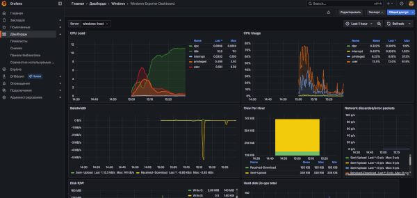

import LoadTestSimulatorPlay from '@site/src/components/LoadTestSimulatorPlay.jsx';

# Проверка надежности под нагрузкой

<div class="article-tags">
  <span class="tag tag-required">ОБЯЗАТЕЛЬНО</span>
  <span class="tag tag-beginner">ДЛЯ НОВИЧКОВ</span>
</div>

<span class="complexity-badge">Тестировщику</span> 
<span class="complexity-badge">Разработчику</span>
<span class="complexity-badge">Аналитику</span>

<LoadTestSimulatorPlay />

---

## Проверка надежности под нагрузкой

Нагрузочное и стресс-тестирование представляет собой процесс оценки производительности программного обеспечения при воздействии на него большого количества запросов. 

Цель такого тестирования заключается в определении того, как система ведет себя в условиях высокой нагрузки, выявлении узких мест и проверке стабильности работы перед запуском в промышленную эксплуатацию. Инженеры используют эти методы для прогнозирования поведения системы при пиковых значениях трафика, таких как распродажи или массовые мероприятия.

Процесс проверки надежности позволяет выявить пределы пропускной способности приложения. Система может успешно обрабатывать тысячи запросов в секунду до определенного момента, после чего начинается деградация производительности. Этот момент называется точкой насыщения. За ней следует возможный отказ сервиса или критическое замедление отклика. Стресс-тестирование специально направлено на преодоление точки насыщения для определения пределов устойчивости инфраструктуры.

---

## Создание тестового приложения

Для проведения эффективного тестирования требуется изолированная среда с известным поведением. Использование реального продакшн-приложения недопустимо из соображений безопасности и целостности данных. Мы создадим простое веб-приложение, имитирующее процесс оформления заказа. Это приложение будет принимать HTTP-запросы, выполнять фиктивную обработку данных и возвращать результат.

Приложение написано на языке Python с использованием легковесного фреймворка Flask. Код создает сервер, который принимает POST-запрос к эндпоинту `/order`. Сервер имитирует задержку обработки заказа случайным образом от 100 до 500 миллисекунд. Это моделирует реальную работу базы данных или внешних сервисов. Приложение также возвращает статус успешного выполнения операции.

```python
from flask import Flask, request, jsonify

import time
import random

app = Flask(__name__)

@app.route('/order', methods=['POST'])
def process_order():
    # Имитация задержки обработки заказа (от 0.1 до 0.5 секунд)
    delay = random.uniform(0.1, 0.5)
    time.sleep(delay)
    
    # Возвращаем успешный ответ
    return jsonify({
        "status": "success",
        "message": "Заказ оформлен успешно",
        "order_id": random.randint(10000, 99999),
        "processing_time_ms": int(delay * 1000)
    }), 200

if __name__ == '__main__':
    # Запуск сервера на локальном хосте, порт 5000
    app.run(host='127.0.0.1', port=5000, debug=False)
```

Перед запуском необходимо установить зависимости. Для этого используется менеджер пакетов pip. Команда установки скачивает и устанавливает библиотеку Flask и все необходимые для неё компоненты.

```bash
pip install flask
```

После установки запускаем скрипт. Приложение начинает слушать порт 5000 на локальном адресе. Терминал выводит сообщение о том, что сервер запущен и доступен по адресу http://127.0.0.1:5000. Теперь система готова принимать запросы от инструментов тестирования.

---

## Установка и настройка JMeter

Apache JMeter является стандартным инструментом для нагрузочного тестирования. Он работает на платформе Java и предоставляет графический интерфейс для создания тестовых сценариев. Инструмент поддерживает множество протоколов, включая HTTP, HTTPS, JDBC и FTP. Основная задача инструмента — генерация нагрузки и сбор метрик.

Установка JMeter начинается с наличия среды исполнения Java Разработка Kit (JDK). Версия JDK должна быть не ниже 8. Рекомендуется использовать актуальную версию LTS. После установки Java переходим к скачиванию архива JMeter с официального сайта проекта Apache. Файл содержит готовую среду выполнения без необходимости компиляции.

Распаковываем архив в любую удобную директорию. Внутри папки находится исполняемый файл `bin` с подкаталогами для различных операционных систем. В директории `bin` находим скрипт `jmeter.bat` для Windows или `jmeter` для Linux и macOS. Двойной клик по файлу запускает графическую оболочку программы.

Интерфейс JMeter состоит из нескольких основных зон. Верхняя панель содержит меню управления проектом. Левая часть экрана показывает дерево элементов теста. Правая часть отображает результаты выполнения и настройки выбранных элементов. Нижняя панель служит для вывода логов и статистики в реальном времени.

Создаем новый тестовый план. Для этого выбираем пункт "Добавить" в корне дерева и выбираем "Тестовый план". План становится контейнером для всех последующих компонентов. Называем его "Стресс-тест заказа".

Добавляем элемент "Группа потоков". Этот компонент отвечает за создание виртуальных пользователей. Настраиваем параметры группы: количество потоков устанавливаем в значение 100, время цикла (Ramp-Up Period in seconds) задаем равным 10. Это означает, что 100 пользователей начнут отправлять запросы в течение 10 секунд. Параметр "Циклы" оставляем пустым, чтобы каждый пользователь выполнил запрос только один раз.

Добавляем элемент "HTTP Запрос". Он определяет саму операцию взаимодействия с сервером. В поле "Имя сервера" указываем `localhost`, а в поле "Порт" пишем `5000`. В поле "Путь" вводим `/order`. Метод выбираем `POST`.

Добавляем элемент "Аргументы" внутри HTTP Запроса для передачи тела запроса. Создаем параметр с именем `Данные` и значением `&#123;"item": "test_product"&#125;`. Это симулирует данные заказа.

Добавляем элемент "Результат" для сбора данных. Выбираем "Логгер результатов в CSV файл" или "Листинг результатов в таблице". Для детального анализа лучше использовать CSV-логгер. Указываем путь к файлу `results.csv`.

---

## Тестирование 100 пользователей

Запускаем тестовый план. Нажимаем кнопку "Старт" на панели инструментов. JMeter начинает создавать 100 виртуальных потоков. Каждый поток выполняет цикл: отправляет POST-запрос на сервер, получает ответ и завершает работу. Процесс занимает около 10–15 секунд в зависимости от скорости компьютера и задержек сети.

В процессе выполнения наблюдаем поведение приложения. Сервер получает 100 запросов почти одновременно. Время обработки каждого запроса варьируется от 100 до 500 миллисекунд. Общая нагрузка на процессор и память сервера возрастает пропорционально количеству активных потоков.

После завершения теста открываем результаты. В JMeter можно просмотреть статистику прямо в интерфейсе. Открываем график "Отчет по результатам". График показывает распределение времени ответа. Видно среднее время, медиану, 90-й процентиль и максимальное время.

Среднее время ответа составляет около 300–350 миллисекунд. Медиана указывает на то, что половина запросов была обработана быстрее этого значения. 90-й процентиль показывает время, за которое было обработано 90% запросов. Если это значение близко к максимальному, значит система работает нестабильно при пиковой нагрузке.

Максимальное время ответа может достигать 600–700 миллисекунд. Это происходит из-за конкуренции за ресурсы процессора. Некоторые потоки ожидают своей очереди на выполнение задачи. Ошибок в логах не наблюдается, так как приложение справляется с нагрузкой.

---

## Анализ метрик и интерпретация результатов

Метрики производительности позволяют оценить качество работы системы. Ключевыми показателями являются пропускная способность, время отклика и процент ошибок. Пропускная способность измеряется в запросах в секунду (RPS). В нашем случае система обрабатывает примерно 200–250 запросов в секунду.



Собранные метрики нагрузочного теста удобно визуализировать в Grafana — [Практикум Prometheus и Grafana](/encyclopedia/2-system-network/2-06-sistemnoe-administrirovanie/prometheus-grafana-praktikum/intro) (шаг 4 — дашборды, шаг 9 — k6); готовые PromQL — [галерея Lab](/lab/Примеры/11114).

Время отклика делится на несколько категорий. Среднее время отражает общую эффективность. Медиана дает более точную картину для большинства пользователей. 95-й и 99-й процентили показывают опыт редких, но тяжелых случаев. Высокие значения на этих процентах сигнализируют о проблемах с очередями или блокировками.

Процент ошибок показывает долю неудачных запросов. В идеале этот показатель должен быть равен нулю. Наличие ошибок даже в размере 0.1% требует внимания. Ошибки могут возникать из-за переполнения памяти, исчерпания соединений с базой данных или таймаутов.

Интерпретация результатов зависит от бизнес-требований. Если целевое время ответа составляет 200 миллисекунд, то текущая конфигурация не подходит. Необходимо оптимизировать код или увеличить ресурсы сервера. Если допустимое время составляет 500 миллисекунд, то система работает удовлетворительно.

Анализ также включает проверку использования ресурсов. Нагрузка на CPU достигает 80–90% во время теста. Это указывает на то, что процессор является ограничивающим фактором. Память остается в пределах нормы. Сетевой трафик соответствует объему передаваемых данных.

Для дальнейшего улучшения рекомендуется провести серию тестов с увеличением количества пользователей. Находим точку насыщения, где время ответа начинает расти экспоненциально. Эта точка определяет максимальную емкость системы. Также полезно протестировать систему с разными объемами входных данных.

Результаты тестирования фиксируются в отчете. Отчет содержит графики, таблицы и выводы. Документация помогает команде разработчиков и архитекторам принять решение о масштабировании. Стресс-тестирование становится частью процесса непрерывной интеграции и доставки.

---

### Дополнительные рекомендации

При проведении тестов важно учитывать особенности окружения. Тестирование должно проводиться на инфраструктуре, максимально близкой к производственной. Различия в железе, версии ОС или сетевых настройках могут исказить результаты. Изоляция тестовой среды от других процессов гарантирует чистоту эксперимента.

Использование разнообразных сценариев нагрузки повышает надежность системы. Помимо равномерной нагрузки, стоит проверить резкие всплески трафика. Моделируйте ситуации, когда пользователи заходят на сайт одновременно. Это помогает выявить проблемы с синхронизацией и блокировками.

Автоматизация тестирования ускоряет процесс разработки. Настройте запуск JMeter через CI/CD пайплайн. Результаты тестов должны анализироваться автоматически. Пороговые значения для метрик настраиваются заранее. Если показатели выходят за рамки, сборка помечается как неудачная.

Документирование всех этапов тестирования сохраняет знания команды. Сохраняйте конфигурации тестов, логи и отчеты. Сравнение результатов разных версий приложения показывает прогресс в оптимизации. История изменений помогает понять динамику развития производительности системы.

---

## Как формулировать цели нагрузочного теста

Перед запуском теста зафиксируйте измеримые цели. Примеры:

- `p95` времени ответа не выше 400 мс при 100 одновременных пользователях;
- доля ошибок (`5xx` и таймауты) ниже 0.5%;
- процессор сервера ниже 75% на среднем профиле нагрузки;
- время восстановления после всплеска не выше 60 секунд.

Когда критерии заданы заранее, команда получает понятный ответ "готово/не готово" вместо субъективного "вроде работает".

---

## Профили нагрузки, которые стоит запускать отдельно

Один тест на 100 пользователей полезен для старта, но в реальном проекте используют несколько профилей:

- **базовая линия**: стабильная средняя нагрузка;
- **пиковый всплеск**: быстрый рост трафика за короткое время;
- **длительный прогон**: проверка утечек памяти и деградации за часы;
- **стресс до отказа**: поиск точки насыщения и поведения после неё.

Сравнение этих профилей показывает не только "сколько держит система", но и "как она деградирует" и "насколько быстро восстанавливается".

---

## Практические ошибки в нагрузочном тестировании

- Тестируют локально и переносят выводы на прод — результаты искажаются из-за другой инфраструктуры.
- Генератор нагрузки становится бутылочным горлышком — нужна отдельная проверка самого генератора.
- Смотрят только среднее время ответа — без `p95/p99` пропускают проблемы "длинного хвоста".
- Игнорируют бизнес-операции — важно считать метрики на уровне сценариев (заказ, оплата, логин), а не только RPS.

Эти ошибки приводят к ложному ощущению стабильности до первого реального пика.

---

## Связка с эксплуатацией и релизами

Нагрузочные тесты дают максимум пользы, когда встроены в релизный процесс:

1. Профили и пороги хранятся в репозитории рядом с кодом.
2. Результаты автоматически публикуются в отчёт CI/CD.
3. Отклонения по порогам блокируют выпуск или переводят релиз на ручной review.
4. После релиза метрики теста сравнивают с метриками продакшена.

Смежные темы: [автоматизация тестирования](./115.md), [нагрузочное тестирование](./122.md), [DevOps и CI/CD](/encyclopedia/8-infra-security/8-04-devops-ci-cd/intro), [основы информационной безопасности](/encyclopedia/2-system-network/2-08-osnovy-informatsionnoy-bezopasnosti/intro).

---

## Incident-кейс — деградация после релиза

После релиза p95 вырос с 280 мс до 900 мс, ошибок мало, но пользователи жалуются на "тормозит".

Порядок действий:

- сравнить профиль нагрузки релиза с эталонным прогоном прошлой версии;
- посмотреть изменения SQL, кэшей и внешних вызовов;
- проверить насыщение пула соединений и очередей воркеров;
- выполнить откат или включить feature flag при превышении SLO.

После стабилизации добавьте отдельный нагрузочный сценарий на проблемную операцию в CI. Это формирует защиту от повторного регресса производительности.

---

## Шаблон артефакта — performance gate

```text
Performance Gate (staging):
- p95 <= 400 ms
- p99 <= 900 ms
- Error rate <= 0.5%
- CPU avg <= 75%
- Memory growth за 30 мин <= 10%

Если любой порог превышен:
1) релиз на hold
2) заводится performance defect
3) назначается owner и ETA повторного прогона
```

Такой gate делает решение по релизу формализованным и воспроизводимым.

---

## Готовые поля для Jira и YouTrack

```text
Issue Type: Bug / Risk
Summary: [PERF] Превышен performance gate на build X
Test Profile: baseline/spike/soak/stress
Metrics:
- p95: ...
- p99: ...
- error rate: ...
- CPU/memory: ...
SLO Breach: yes/no
Decision: release hold / partial rollout
Action Items:
[ ] Оптимизация
[ ] Повторный прогон
[ ] Обновление baseline
```

Пример заполнения:

```text
Issue Type: Risk
Summary: [PERF] p95 checkout превысил gate после релиза 3.8.0
Test Profile: spike
Metrics:
- p95: 780 ms
- p99: 1450 ms
- error rate: 0.9%
- CPU/memory: 88% / +14%
SLO Breach: yes
Decision: release hold
Action Items:
[x] Оптимизация SQL индекса
[ ] Повторный прогон
[ ] Обновление baseline
```

---

## Навигация по разделу «Тестирование»

- **Маршрут:** [О разделе](./intro.md) · [Резюме раздела](./998.md) · [Карта уровней и практик (Unit / Integration / UI / E2E, TDD, BDD)](./131.md)
- **Теория и процесс:** [Основы](./1.md) · [Классификация](./111.md) · [Жизненный цикл](./112.md) · [Порядок этапов](./116.md) · [Артефакты качества](./113.md)
- **Уровни проверок:** [Unit](./120.md) · [Integration](./121.md) · [E2E, системное и UI](./114.md) · [API](./2.md) · [Тестовые дублёры](./117.md) · [Покрытие кода](./126.md) · [White-box](./130.md) · [Мутационное тестирование](./125.md)
- **Практика QA:** [Документация](./119.md) · [Тест-дизайн](./127.md) · [Ручное веб](./128.md) · [SQL](./129.md)
- **Автоматизация:** [Стратегия и пирамида](./115.md) · [Каталог инструментов](./118.md) · [Selenium](./1181.md) · [Playwright](./1182.md)
- **Практикум и углубление:** [1011](./1011.md) · [1012](./1012.md) · [1013](./1013.md) · [1014](./1014.md) · [Мобильное](./124.md) · [Нагрузка](./122.md) · [Безопасность](./123.md) · [Самопроверка](./999.md) · [Доп. материалы курса](./1271.md) · [1272](./1272.md) · [1273](./1273.md)

{/* sidebar-collections */}

---

## В подборках

Статья входит в [тематические подборки](/about/collections) и блок «С чего начать?» на [главной](/). Соседние шаги того же маршрута:

**DevOps и инфраструктура** — [Автоматизация тестирования](/encyclopedia/7-project/7-05-testirovanie/115), [Забота о коде и данных — о разделе](/encyclopedia/8-infra-security/8-03-zabota-o-kode-i-dannyh/intro), [Основы интеграционного взаимодействия — о разделе](/encyclopedia/2-system-network/2-09-osnovy-integratsionnogo-vzaimodeystviya/intro), [DevOps, CI-CD — о разделе](/encyclopedia/8-infra-security/8-04-devops-ci-cd/intro), [Основы информационной безопасности — о разделе](/encyclopedia/2-system-network/2-08-osnovy-informatsionnoy-bezopasnosti/intro), [Микросервисы и интеграция — о разделе](/encyclopedia/8-infra-security/8-05-mikroservisy-i-integratsiya/intro).

{/* /sidebar-collections */}

---
