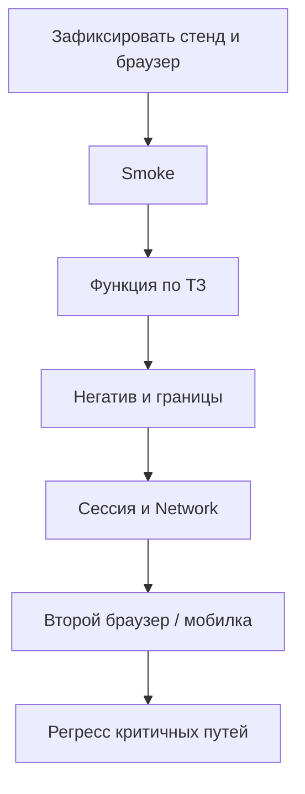

# Ручное тестирование веб-приложений

  ОБЯЗАТЕЛЬНО
  ДЛЯ НОВИЧКОВ

Тестировщику
Аналитику

> **Зачем эта статья.** Автотесты не заменяют "пожить в продукте руками". Здесь — **порядок проверки веба** без кода: что открыть, куда смотреть, какие зоны чаще ломаются. Используйте как чек-лист на каждый релиз или новую фичу.

---

## Что такое ручное тестирование веба

**Веб-приложение** — сайт, где много логики в браузере: личный кабинет, корзина, админка. Страница **общается с сервером** через HTTP-запросы (часто JSON — это и есть **API** "за кулисами").

**Ручное тестирование** — вы действуете как пользователь: клики, ввод, сравнение с ожиданием. **Автотест** ([Playwright](./1182.md), [Selenium](./1181.md)) повторяет те же шаги скриптом. Ручная проверка нужна, когда:

- фича новая и сценарии ещё не стабильны;
- нужна оценка "удобно ли" и визуальных мелочей;
- автотестов мало или их ещё нет.

---

## Словарь для первой сессии

| Термин | Простыми словами |
|--------|------------------|
| **Стенд** | Копия системы для тестов (`test.`, `staging.`), не боевой прод |
| **Smoke** | Быстрая проверка "вообще живо": открылось, вошёл, главный путь прошёл |
| **Регресс** | Старые важные сценарии после изменений — не сломали ли прошлое |
| **Сессия** | Период, пока сервер "помнит", что вы вошли (cookie, токен) |
| **2xx / 4xx / 5xx** | Код ответа HTTP: успех / ошибка клиента / ошибка сервера |
| **Flaky** | Тест или баг "то есть, то нет" — часто из-за таймингов и сети |

---

## С чего начать сессию

Перед проверкой зафиксируйте контекст — без этого баг-репорты будут неполными:

| Что записать | Пример |
|--------------|--------|
| URL и стенд | `https://test.shop.example/catalog` |
| Браузер и версия | Chrome 120, Firefox 115 |
| Разрешение | 1920×1080, мобильная эмуляция 390×844 |
| Учётная запись | `qa_user_01`, роль "покупатель" |
| Сборка | `2.1.0 (build 4521)` |

---

### Chrome DevTools — три вкладки на каждый день

Откройте **Chrome DevTools** (`F12`):

| Вкладка | Зачем QA |
|---------|----------|
| **Elements** | Вёрстка, скрытые элементы, атрибуты кнопок |
| **Console** | Ошибки JavaScript (красные строки) — часто объясняют "белый экран" |
| **Network** | Ушёл ли запрос на сервер, какой статус и тело ответа |

Подробнее про API через DevTools: [Тестирование и анализ API](./2.md#chrome-devtools).

:::tip Первый навык в Network
Включите **Preserve log**, выполните действие (логин, "В корзину"), найдите запрос по имени (`login`, `cart`). Клик → **Headers** (статус), **Response** (JSON с ошибкой). Этот скрин спасает разработчика час отладки.
:::

---

## Порядок проверки (типовой сценарий)

1. **Smoke** — сайт открывается, логин работает, главный сценарий проходит за 5–10 минут.
2. **Функциональность** — по требованиям или [тест-кейсам](./119.md).
3. **Негативные сценарии** — пустые поля, неверный формат, двойная отправка.
4. **Границы** — длинные строки, спецсимволы, кириллица и латиница.
5. **Сессия и безопасность** — выход, истечение токена, кнопка "Назад" в браузере.
6. **Совместимость** — второй браузер, уменьшенное окно, мобильная вёрстка.
7. **Регресс** — старые критичные сценарии после фикса.

:::tip Связка с документацией
Оформляйте находки сразу по шаблону из [Документации тестировщика](./119.md#баг-репорт). Хороший баг = воспроизводимые шаги + скрин + вкладка Network при ошибке API.
:::

---

## Чек-лист — формы и ввод

| # | Проверка | На что смотреть | Пример дефекта |
|---|----------|----------------|----------------|
| 1 | Обязательные поля | Сообщение при пустой отправке, фокус на первом ошибочном поле | Отправка пустой формы создаёт заказ |
| 2 | Маски и форматы | Телефон, email, ИНН — принимается только валидное | `abc` в поле телефона проходит |
| 3 | Границы длины | min/max символов: обрезка или явная ошибка | 10 000 символов в "комментарий" — 500 на сервере |
| 4 | Пробелы | В начале/конце строки — trim или отказ | Логин `" user "` не находится |
| 5 | Копипаст | Из Word/PDF — невидимые символы | Поле "ломается" после вставки из PDF |
| 6 | Двойной submit | Два быстрых клика "Оплатить" | Два заказа и два списания |
| 7 | Tab-порядок | Форма проходится с клавиатуры | Фокус прыгает в случайном порядке |
| 8 | Автозаполнение | Браузер подставил старые данные | Сломалась валидация после autofill |

Применяйте [техники тест-дизайна](./127.md): эквивалентные классы и граничные значения для полей "возраст 18–99", "пароль 8–64 символа" и т.д.

---

### Мини-разбор — поле "Скидка 0–100 %"

| Ввод | Ожидание (пример ТЗ) |
|------|----------------------|
| 50 | Принято |
| 0, 100 | Границы — принято |
| −1, 101 | Ошибка валидации |
| пусто | Ошибка "обязательное поле" |
| `100.5`, `abc` | Ошибка формата |

---

## Чек-лист — навигация и UI

| # | Проверка | Типичный баг |
|---|----------|--------------|
| 1 | Все ссылки в меню | 404, редирект не туда |
| 2 | Хлебные крошки | Неверный уровень, не кликаются |
| 3 | Кнопка "Назад" браузера | Потеря данных, повторная отправка формы |
| 4 | Модальные окна | Не закрываются по Esc / клику вне |
| 5 | Лоадеры | Бесконечный спиннер при медленном API |
| 6 | Пустые состояния | "Нет товаров", "Пустая корзина" — текст и CTA |
| 7 | Ошибки 404/500 | Своя страница, а белый экран |
| 8 | Favicon и title | "undefined", один title на всех страницах |

**Повторная отправка формы:** после "Назад" браузер может предложить "повторить отправку" — опасно для оплаты. Ожидание по ТЗ: предупреждение или POST-redirect-GET после успеха.

---

## Чек-лист — сеть и API (без Postman)

Даже ручной QA должен заглядывать в **Network**:

| # | Действие | Ожидание |
|---|----------|----------|
| 1 | Выполнить действие (логин, добавить в корзину) | Запрос ушёл, статус 2xx |
| 2 | Ошибка на экране | В Network — 4xx/5xx, тело ответа с кодом ошибки |
| 3 | Повторить с отключённым Wi‑Fi | Понятное сообщение пользователю |
| 4 | Медленная сеть (DevTools → Throttling) | Нет двойных списаний, есть индикатор загрузки |
| 5 | Размер ответа | Огромный JSON на списке — риск по производительности |

---

### Коды HTTP — шпаргалка для баг-репорта

| Код | Смысл | Что писать в баге |
|-----|-------|-------------------|
| 200, 201 | Успех | "POST /orders → 201, тело: id=1001" |
| 400 | Неверный запрос (валидация) | Фрагмент JSON с полем ошибки |
| 401 | Не авторизован | После логина всё ещё 401 — баг сессии |
| 403 | Нет прав | Ожидали 403 для гостя на `/admin` |
| 404 | Не найдено | URL запроса |
| 500 | Ошибка сервера | Время, Request-Id если есть |

Если API проверяете системно — [Postman и curl](./2.md).

---

## Чек-лист — авторизация и сессии

**Сессия** — способ сервера узнать "это тот же пользователь". Обычно: **cookie** с идентификатором сессии или **JWT** в заголовке (токен с подписью и сроком жизни).

| # | Проверка | Зачем |
|---|----------|-------|
| 1 | Логин / логаут | Сессия реально завершается, защищённые страницы недоступны |
| 2 | "Запомнить меня" | Дольше живёт cookie — по ТЗ |
| 3 | Доступ к `/admin` без прав | 403 или редирект на логин |
| 4 | Истечение сессии | Редирект на логин, понятное сообщение |
| 5 | Два аккаунта в двух браузерах | Корзины и профили не смешиваются |
| 6 | Смена пароля | Старые сессии инвалидируются (если в требованиях) |

---

## Кроссбраузерность и адаптив

Минимальный набор для большинства проектов:

- **Chrome** (основной)
- **Firefox** или **Safari** (второй движок — другой рендер и движок JS)
- **Мобильная эмуляция** в DevTools или реальное устройство

| Зона | Что проверить |
|------|---------------|
| ≤ 768px | Меню-бургер, таблицы не вылезают за экран |
| Клавиатура на телефоне | Поля не перекрываются, кнопка "Далее" видна |
| Zoom 125–150% | Текст читаем, кнопки кликабельны (доступность) |

Полный E2E через браузер — [End-to-End и системное](./114.md); автоматизация — [Playwright](./1182.md) или [Selenium](./1181.md).

---

## Пример одной тест-сессии (15–20 минут)

**Фича:** добавление товара в корзину на `test.shop.example`.

1. Записать браузер, URL, пользователя `qa_buyer`.
2. Smoke: главная открылась, каталог без ошибок в Console.
3. Добавить товар A — счётчик "1", Network: `POST /cart` → 200.
4. Обновить страницу (F5) — корзина всё ещё "1" (данные с сервера).
5. Два быстрых клика "+" — количество 2, один товар в Network (нет дубля).
6. Выйти — `/cart` редирект на логин.
7. Firefox: повторить шаги 3–4.

Нашли расхождение счётчика и Network → баг с шагами, скрином, HAR при необходимости.

---

## Типичные баги в отчётах новичков

| Плохо | Лучше |
|-------|-------|
| "Не работает корзина" | "После добавления товара X счётчик остаётся 0, Network: POST /cart → 500" |
| Без скрина | Скрин + HAR при сетевой ошибке |
| "У всех ломается" | "Chrome 120 Win11, test, пользователь без админ-прав" |
| Один браузер | Указать, проверяли ли Firefox/Safari |

---

## Куда дальше

| Тема | Статья |
|------|--------|
| Оформление кейсов и багов | [Документация тестировщика](./119.md) |
| Сквозной сценарий + Selenium | [Проверка пользовательского сценария](./1013.md) |
| Проверка данных в БД | [SQL для тестировщика](./129.md) |
| Современная UI-автоматизация | [Playwright](./1182.md) |

---

## Навигация по разделу «Тестирование»

- **Маршрут:** [О разделе](./intro.md) · [Резюме раздела](./998.md) · [Карта уровней и практик (Unit / Integration / UI / E2E, TDD, BDD)](./131.md)
- **Теория и процесс:** [Основы](./1.md) · [Классификация](./111.md) · [Жизненный цикл](./112.md) · [Порядок этапов](./116.md) · [Артефакты качества](./113.md)
- **Уровни проверок:** [Unit](./120.md) · [Integration](./121.md) · [E2E, системное и UI](./114.md) · [API](./2.md) · [Тестовые дублёры](./117.md) · [Покрытие кода](./126.md) · [White-box](./130.md) · [Мутационное тестирование](./125.md)
- **Практика QA:** [Документация](./119.md) · [Тест-дизайн](./127.md) · [Ручное веб](./128.md) · [SQL](./129.md)
- **Автоматизация:** [Стратегия и пирамида](./115.md) · [Каталог инструментов](./118.md) · [Selenium](./1181.md) · [Playwright](./1182.md)
- **Практикум и углубление:** [1011](./1011.md) · [1012](./1012.md) · [1013](./1013.md) · [1014](./1014.md) · [Мобильное](./124.md) · [Нагрузка](./122.md) · [Безопасность](./123.md) · [Самопроверка](./999.md) · [Доп. материалы курса](./1271.md) · [1272](./1272.md) · [1273](./1273.md)

---
