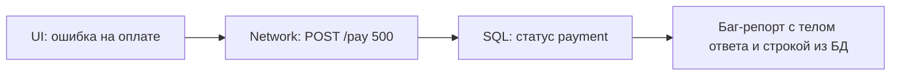

# SQL для тестировщика

<div class="article-tags">
  <span class="tag tag-required">ОБЯЗАТЕЛЬНО</span>
  <span class="tag tag-beginner">ДЛЯ НОВИЧКОВ</span>
</div>

<span class="complexity-badge">Тестировщику</span>
<span class="complexity-badge">Аналитику</span>

> **Зачем эта статья.** UI показал "Заказ создан", API вернул `200` — а **в базе** запись есть? Баланс списался? Статус верный? Без SQL вы верите интерфейсу на слово. Здесь — **минимум запросов** для ежедневной работы QA; углубление — в разделе [SQL](/encyclopedia/3-data-markup/3-07-sql/intro).

<div class="callout callout--warning">
  <div class="callout-title">Только тестовые стенды</div>
  Запросы выполняйте на **test / staging**, с read-only учёткой, если возможно. Не правьте продакшен "просто проверить". Согласуйте доступ с DBA или разработчиком.
</div>

---

## База данных простыми словами

**База данных (БД)** — хранилище структурированных данных приложения. Для QA важнее всего реляционная модель:

| Понятие | Аналогия | Пример |
|---------|----------|--------|
| **Таблица** | Лист Excel | `users`, `orders` |
| **Строка (row)** | Одна запись | один пользователь, один заказ |
| **Столбец (column)** | Поле | `email`, `status`, `total_amount` |
| **Первичный ключ (PK)** | Уникальный id строки | `users.id = 42` |
| **Внешний ключ (FK)** | Ссылка на другую таблицу | `orders.user_id` → `users.id` |

**SQL** (Structured Query Language) — язык **запросов** к таким таблицам. Тестировщику чаще всего нужен только **`SELECT`** — чтение без изменения данных.

---

## Словарь команд (что увидите в запросах)

| Команда / слово | Что делает |
|-----------------|------------|
| `SELECT` | "Верни столбцы…" |
| `FROM` | "…из таблицы…" |
| `WHERE` | "…где условие" |
| `JOIN` | "Соедини две таблицы по связи" |
| `ORDER BY` | Сортировка |
| `LIMIT` | Взять только N строк |
| `COUNT`, `SUM` | Посчитать строки или сумму |
| `GROUP BY` | Группировка (например, по дню) |
| `HAVING` | Фильтр **после** группировки |
| `NULL` | "Значения нет" (не ноль и не пустая строка) |

`INSERT`, `UPDATE`, `DELETE` на проде — только по согласованию. На тесте иногда чистят данные скриптами разработчиков.

---

## Что должен уметь тестировщик

| Навык | Зачем |
|-------|-------|
| `SELECT` + `WHERE` | Найти запись пользователя, заказа, платежа |
| `JOIN` | Связать заказ с пользователем и товарами |
| `COUNT`, `SUM` | Сверить количество строк с UI |
| `ORDER BY` + `LIMIT` | Последние N операций |
| Понимание транзакций | Почему "деньги списались, заказ не создался" |

Полный курс SQL — необязателен для старта в QA. Достаточно 10–15 шаблонов ниже.

---

### Транзакция — одним абзацем

**Транзакция** — набор операций в БД "всё или ничего". Пример: списать деньги **и** создать заказ. Если второй шаг упал, откат возвращает баланс. В баг-репорте полезно спросить: "операция в одной транзакции?" — объясняет "половинчатые" состояния.

---

## Как подключиться

| Инструмент | Когда |
|------------|-------|
| **DBeaver**, **DataGrip**, **pgAdmin** | Ручные проверки, экспорт в CSV |
| **Консоль** `psql`, `mysql` | Быстрый запрос с сервера |
| Запрос из автотеста | [Интеграционное тестирование](./121.md) |

Уточните у команды: СУБД (PostgreSQL, MySQL, MS SQL), имя схемы, **тестовая** база, логин только на чтение.

---

## Схема "UI сказал X — SQL подтвердил"

Частый рабочий цикл QA:

1. Выполнить действие в UI или через API (создать заказ, сменить статус).
2. Зафиксировать **факт** в интерфейсе: "Заказ №1001 — Оплачен".
3. Выполнить SQL на **том же** тестовом стенде и сравнить с оракулом из требований.

```sql
-- После оплаты в UI ожидаем status = 'paid' и одну запись
SELECT id, status, total_amount, paid_at
FROM orders
WHERE id = 1001;
```

| Что сравниваем | UI / API | SQL |
|----------------|----------|-----|
| Статус | "Оплачен" | `status = 'paid'` |
| Сумма | 1 990 ₽ | `total_amount = 1990.00` |
| Количество в списке | "3 заказа" | `COUNT(*) ... = 3` |

Если UI и БД расходятся — это дефект **целостности данных** (часто серьёзнее "кривой вёрстки"). В баг-репорт кладут оба факта: скрин UI и результат запроса.

---

## 10 запросов, которые покрывают 80% задач

### 1. Найти пользователя по email

```sql
SELECT id, email, status, created_at
FROM users
WHERE email = 'qa@test.local';
```

После регистрации через UI — проверка, что строка появилась. Пустой результат → запись не создалась или другой стенд/база.

---

### 2. Последние заказы пользователя

```sql
SELECT id, user_id, total_amount, status, created_at
FROM orders
WHERE user_id = 42
ORDER BY created_at DESC
LIMIT 10;
```

`ORDER BY ... DESC` — сначала новые; `LIMIT 10` — не выгружать миллион строк.

---

### 3. Заказ со строками (JOIN)

Две таблицы: **заказ** и **позиции**. `JOIN` соединяет строки, где `order_items.order_id = orders.id`.

```sql
SELECT o.id AS order_id, o.status, oi.product_id, oi.quantity, oi.price
FROM orders o
JOIN order_items oi ON oi.order_id = o.id
WHERE o.id = 1001;
```

Сверьте: сумма `quantity * price` по строкам = итог в UI (с учётом скидок по ТЗ).

**LEFT JOIN** (в запросе 9) — "все заказы, даже если пользователь пропал"; где связи нет, справа будет `NULL`.

---

### 4. Количество записей

```sql
SELECT COUNT(*) FROM orders WHERE status = 'pending';
```

Сравните с фильтром "Ожидают оплаты" в админке. Расхождение на 1 — уже повод для бага.

---

### 5. Дубликаты (anomaly hunting)

```sql
SELECT email, COUNT(*) AS cnt
FROM users
GROUP BY email
HAVING COUNT(*) > 1;
```

`GROUP BY` — сгруппировать по email; `HAVING` — оставить только группы, где больше одной строки.

---

### 6. "Зависшие" статусы

```sql
SELECT id, status, updated_at
FROM payments
WHERE status = 'processing'
  AND updated_at < NOW() - INTERVAL '1 hour';
```

Синтаксис интервала зависит от СУБД (`INTERVAL` в PostgreSQL; в SQL Server — `DATEADD`). Уточните у разработчика.

---

### 7. Сумма по периоду

```sql
SELECT DATE(created_at) AS day, SUM(total_amount) AS revenue
FROM orders
WHERE created_at >= '2026-03-01'
GROUP BY DATE(created_at)
ORDER BY day;
```

Сверка с отчётом аналитики или экспортом.

---

### 8. Мягкое удаление (soft delete)

```sql
SELECT id, deleted_at
FROM products
WHERE id = 55 AND deleted_at IS NOT NULL;
```

После "удаления" в UI товар часто **остаётся** в БД с меткой `deleted_at` — это норма по ТЗ, а не "баг удаления".

---

### 9. Проверка связи FK

```sql
SELECT o.id
FROM orders o
LEFT JOIN users u ON u.id = o.user_id
WHERE u.id IS NULL;
```

Результат **должен быть пустым**. Иначе — заказы без пользователя (битая миграция или баг API).

---

### 10. Аудит после тестового прогона

```sql
SELECT *
FROM audit_log
WHERE entity_type = 'order' AND entity_id = 1001
ORDER BY created_at;
```

Кто и когда менял статус — доказательная база для баг-репорта.

---

## Полный пример расследования бага

**Симптом:** в UI "Оплата не прошла", деньги "списались" (со слов пользователя).

| Шаг | Действие |
|-----|----------|
| 1 | В Network: `POST /api/pay` → 500, тело `{"code":"PAYMENT_GATEWAY_TIMEOUT"}` |
| 2 | Запомнить `order_id=1001`, время `14:32` |
| 3 | SQL: `SELECT * FROM payments WHERE order_id = 1001 ORDER BY created_at DESC LIMIT 5;` |
| 4 | Видим: последняя запись `status='processing'`, списание в `wallet_transactions` есть |
| 5 | Баг: "при 500 от шлюза платёж остаётся processing, UI показывает общую ошибку" + скрин + JSON + SELECT |

---

## Связка UI → API → SQL



1. Воспроизвести в браузере, сохранить **Request ID** / время.
2. В Network — URL, тело запроса, ответ.
3. В SQL — найти `payment_id` или `order_id` по времени и `user_id`.
4. В [баг-репорт](./119.md) — шаги UI + фрагмент JSON + результат SELECT.

---

## Типичные ошибки новичка

| Ошибка | Как избежать |
|--------|--------------|
| Смотрят **прод** вместо test | Сверить hostname и имя БД в клиенте |
| `SELECT *` на огромной таблице | Указывать столбцы и `LIMIT` |
| Сравнивают UI с **устаревшей** строкой | Сортировка `ORDER BY created_at DESC` |
| Путают `NULL` и `0` | `WHERE deleted_at IS NULL` — отдельный смысл |
| Один запрос без JOIN | Позиции заказа смотрят в `orders`, а не в `order_items` |

---

## Тестовые данные

| Правило | Почему |
|---------|--------|
| Не копировать прод без маскировки | GDPR, 152-ФЗ |
| Префикс `qa_`, `test_` | Легко найти и удалить |
| Скрипты seed от разработчиков | Воспроизводимое окружение |
| Откат после интеграционных тестов | [121 — практикум](./1012.md) |

Подробнее — [Документация тестировщика](./119.md#тестовые-данные-и-их-роль-в-обеспечении-качества).

---

## Куда углубляться

| Тема | Раздел |
|------|--------|
| Основы SELECT, WHERE, JOIN | [SQL — введение](/encyclopedia/3-data-markup/3-07-sql/intro) |
| Шпаргалка типовых задач | [885 — шпаргалка SQL](/encyclopedia/3-data-markup/3-07-sql/885) |
| Тестирование БД в автотестах | [118 — тестирование баз данных](./118.md#тестирование-баз-данных) |
| API + проверка ответа | [Тестирование API](./2.md) |
| Ручная проверка UI перед SQL | [Ручное тестирование веба](./128.md) |

---

## Навигация по разделу «Тестирование»

- **Маршрут:** [О разделе](./intro.md) · [Резюме раздела](./998.md) · [Карта уровней и практик (Unit / Integration / UI / E2E, TDD, BDD)](./131.md)
- **Теория и процесс:** [Основы](./1.md) · [Классификация](./111.md) · [Жизненный цикл](./112.md) · [Порядок этапов](./116.md) · [Артефакты качества](./113.md)
- **Уровни проверок:** [Unit](./120.md) · [Integration](./121.md) · [E2E, системное и UI](./114.md) · [API](./2.md) · [Тестовые дублёры](./117.md) · [Покрытие кода](./126.md) · [White-box](./130.md) · [Мутационное тестирование](./125.md)
- **Практика QA:** [Документация](./119.md) · [Тест-дизайн](./127.md) · [Ручное веб](./128.md) · [SQL](./129.md)
- **Автоматизация:** [Стратегия и пирамида](./115.md) · [Каталог инструментов](./118.md) · [Selenium](./1181.md) · [Playwright](./1182.md)
- **Практикум и углубление:** [1011](./1011.md) · [1012](./1012.md) · [1013](./1013.md) · [1014](./1014.md) · [Мобильное](./124.md) · [Нагрузка](./122.md) · [Безопасность](./123.md) · [Самопроверка](./999.md) · [Доп. материалы курса](./1271.md) · [1272](./1272.md) · [1273](./1273.md)

---
