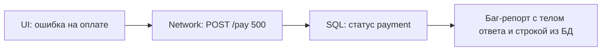

# SQL для тестировщика

<div class="article-tags">
  <span class="tag tag-required">ОБЯЗАТЕЛЬНО</span>
  <span class="tag tag-beginner">ДЛЯ НОВИЧКОВ</span>
</div>

<span class="complexity-badge">Тестировщику</span>
<span class="complexity-badge">Аналитику</span>


<div class="callout callout--info">
  <div class="callout-title">Теория данных (раздел 3)</div>
  <div class="callout-body">
  Проверка в БД — [SQL для тестировщика](./129), [Основы БД](/encyclopedia/3-data-markup/3-05-osnovy-baz-dannyh/1), [транзакции](/encyclopedia/3-data-markup/3-05-osnovy-baz-dannyh/7), [PostgreSQL](/encyclopedia/3-data-markup/3-07-sql/888). Карта — [о разделе](./intro).
  </div>
</div>

SQL (Structured Query Language — «язык структурированных запросов») — это специальный язык для работы с реляционными базами данных. Он используется для извлечения, добавления, изменения и удаления информации, которая хранится в виде связанных между собой таблиц. В отличие от стандартных языков программирования (например, Python или JavaScript), SQL не предназначен для написания полноценных приложений или создания интерфейсов. Его единственная задача — общение с базами данных. Данные в реляционных БД похожи на привычные таблицы Excel, но оптимизированы для огромных объемов информации. Чтобы получить из них данные, пишется декларативный запрос — вы описываете что хотите получить, а не то, как компьютер должен это искать.

SQL активно используется в тестировании. Это один из ключевых навыков для инженеров по обеспечению качества (QA). Для большинства задач тестировщику не нужно уметь проектировать базы данных или писать сложнейшие процедуры. Достаточно базового и среднего уровня (инструменты ручного и автоматизированного тестирования) - SELECT, WHERE, ORDER BY, GROUP BY, HAVING, COUNT, SUM, AVG, JOIN, INSERT, UPDATE, DELETE.

> UI показал "Заказ создан", API вернул `200` — а **в базе** запись есть? Баланс списался? Статус верный? Без SQL вы верите интерфейсу на слово. Здесь — **минимум запросов** для ежедневной работы QA; углубление — в разделе [SQL](/encyclopedia/3-data-markup/3-07-sql/intro).

<div class="callout callout--warning">
  <div class="callout-title">Только тестовые стенды</div>

  <div class="callout-body">
  Запросы выполняйте на **test / staging**, с read-only учёткой, если возможно. Не правьте продакшен "просто проверить". Согласуйте доступ с DBA или разработчиком.
</div>
  </div>


---

## База данных простыми словами

**База данных (БД)** — хранилище структурированных данных приложения. Теория: [знакомство с БД](/encyclopedia/3-data-markup/3-05-osnovy-baz-dannyh/1), [ключи и связи](/encyclopedia/3-data-markup/3-05-osnovy-baz-dannyh/11). Для QA важнее всего реляционная модель:

| Понятие | Аналогия | Пример |
|---------|----------|--------|
| **Таблица** | Лист Excel | `users`, `orders` |
| **Строка (row)** | Одна запись | один пользователь, один заказ |
| **Столбец (column)** | Поле | `email`, `status`, `total_amount` |
| **Первичный ключ (PK)** | Уникальный id строки | `users.id = 42` |
| **Внешний ключ (FK)** | Ссылка на другую таблицу | `orders.user_id` → `users.id` |

**SQL** (Structured Query Language) — язык **запросов** к таким таблицам. Тестировщику чаще всего нужен только **`SELECT`** — чтение без изменения данных.

База данных (БД) — это цифровая «картотека» или электронный склад, где вся информация хранится в строгом порядке, чтобы её можно было быстро найти, изменить или удалить. Сама по себе база данных — это просто упорядоченные файлы на диске. Чтобы человек или сайт могли с ними работать, нужна специальная программа-посредник — СУБД (Система управления базами данных).

---

## Словарь команд (что увидите в запросах)

| Команда / слово | Что делает |
|-----------------|------------|
| `SELECT` | "Верни столбцы…" |
| `FROM` | "…из таблицы…" |
| `WHERE` | "…где условие" |
| `JOIN` | "Соедини две таблицы по связи" |
| `ORDER BY` | Сортировка |
| `LIMIT` | Взять только N строк |
| `COUNT`, `SUM` | Посчитать строки или сумму |
| `GROUP BY` | Группировка (например, по дню) |
| `HAVING` | Фильтр **после** группировки |
| `NULL` | "Значения нет" (не ноль и не пустая строка) |

`INSERT`, `UPDATE`, `DELETE` на проде — только по согласованию. На тесте иногда чистят данные скриптами разработчиков.

---

## Что должен уметь тестировщик

Для тестировщика (QA) команды `SELECT`, `WHERE` и `JOIN` — это «золотая тройка» SQL. С их помощью выполняется 90% всех проверок данных. Тестировщику нужно уметь:
- Выбирать как всю таблицу целиком (`SELECT * FROM users;`), так и только конкретные столбцы (`SELECT email, phone FROM users;`), чтобы не перегружать экран лишней информацией.
- Использовать ключевое слово DISTINCT для удаления дубликатов из результатов (например, выгрузить список всех уникальных городов, из которых есть покупатели).
- Использовать базовые операторы сравнения (`=`, `>`, `<`, `!=`). Пример тест-кейса: проверить, что у всех заблокированных пользователей статус равен 'deleted'.
- Объединять условия через `AND` и `OR`. Пример: найти заказы, которые были оплачены (`status = 'paid'`), но до сих пор не доставлены (`delivery_status != 'delivered'`).
- Искать по части строки с помощью `LIKE` и знака `%`. Пример: найти всех пользователей, чья почта заканчивается на `@test.com` (тестовые аккаунты).
- Проверять пустые значения через `IS NULL` и `IS NOT NULL`. Пример: убедиться, что у пользователей без подтвержденного телефона в этом поле стоит именно пустота (NULL), а не ошибка.
- Четко понимать разницу между `INNER JOIN` и `LEFT JOIN` (это самый частый вопрос на собеседовании). INNER JOIN — находит только строгие совпадения в обеих таблицах. Пример: вывести имена пользователей и информацию об их заказах. Если пользователь ничего не купил, он в список не попадет. LEFT JOIN — берет ВСЮ левую таблицу и подтягивает данные из правой, если они есть. Если данных в правой таблице нет, подставит NULL. Пример: вывести вообще всех пользователей приложения и их заказы. Если заказов нет — мы увидим пользователя и пустоту напротив него (так проверяют, например, корректность работы профиля нового юзера).
- Уметь связывать таблицы по ключевым полям (обычно это ID в одной таблице и user_id / order_id во второй).

| Навык | Зачем |
|-------|-------|
| `SELECT` + `WHERE` | Найти запись пользователя, заказа, платежа |
| `JOIN` | Связать заказ с пользователем и товарами |
| `COUNT`, `SUM` | Сверить количество строк с UI |
| `ORDER BY` + `LIMIT` | Последние N операций |
| Понимание транзакций | Почему "деньги списались, заказ не создался" |

Полный курс SQL — необязателен для старта в QA. Достаточно 10–15 шаблонов ниже.

---

### Транзакция — одним абзацем

**Транзакция** — набор операций в БД "всё или ничего". Пример: списать деньги **и** создать заказ. Если второй шаг упал, откат возвращает баланс. В баг-репорте полезно спросить: "операция в одной транзакции?" — объясняет "половинчатые" состояния.

Транзакция в базах данных — это последовательность из нескольких действий (SQL-запросов), которая выполняется как одно целое. Главный принцип транзакции: «или всё, или ничего». Если хотя бы один запрос внутри транзакции завершается ошибкой, отменяются абсолютно все изменения, и база возвращается в исходное состояние.

Тестировщик проверяет, как система ведет себя в стрессовых ситуациях:
- Что произойдет, если оборвать оплату заказа на середине? (Нужно убедиться, что товар не заблокировался на складе, а деньги не списались).
- Что будет, если два пользователя одновременно попытаются купить последний билет на концерт? Транзакция должна сработать только у одного, а второму выдать корректную ошибку.

---

## Как подключиться к БД

| Инструмент | Когда |
|------------|-------|
| **DBeaver**, **DataGrip**, **pgAdmin** | Ручные проверки, экспорт в CSV |
| **Консоль** `psql`, `mysql` | Быстрый запрос с сервера |
| Запрос из автотеста | [Интеграционное тестирование](./121.md) |

Уточните у команды — СУБД (PostgreSQL, MySQL, MS SQL), имя схемы, **тестовая** база, логин только на чтение.

Чтобы подключиться к базе данных, вам понадобятся специальные доступы (реквизиты) и программа-клиент. Вам нужно запросить у разработчиков, сисадминов или тимлида следующие данные (обычно их присылают одним блоком):
- Host (или IP-адрес / Server): Адрес, где физически лежит база.
- Port (Порт): Цифровой «канал» для связи.
- Database (Имя БД): Конкретная база данных, к которой вы подключаетесь (на одном сервере их может быть много).
- Username (Логин): Имя вашего пользователя.
- Password (Пароль): Ваш секретный пароль.

Вам нужна программа с визуальным интерфейсом, куда вы введете эти данные. Если вы все ввели правильно, но база выдает ошибку ("Connection timeout" или "Сonnection refused"), в 95% случаев проблема в VPN / Доступе. Базы данных коммерческих проектов закрыты от внешнего интернета из соображений безопасности. Убедитесь, что вы включили корпоративный VPN компании. Без него рабочая сеть вас просто не пустит на сервер БД.

---

## Схема "UI сказал X — SQL подтвердил"

Суть в том, чтобы никогда не верить глазам на 100%. Если кнопка на экране поменяла цвет или сайт написал «Успешно сохранен», тестировщик обязан пойти в базу данных и лично проверить, что данные записались корректно и без искажений.

Разработчик мог случайно захардкодить (жестко прописать) анимацию успеха на кнопке, но сама форма при этом никуда не отправляет данные. На экране всё красиво, а в базе — пустота.

На UI вы ввели имя `Ярослав`, а из-за плохой интеграции бэкенд обрезал его до `Ярос` или превратил в `???????`. На экране вы этого не увидите, пока пользователь не перезагрузит страницу.

Частый рабочий цикл QA:

1. Выполнить действие в UI или через API (создать заказ, сменить статус).
2. Зафиксировать **факт** в интерфейсе: "Заказ №1001 — Оплачен".
3. Выполнить SQL на **том же** тестовом стенде и сравнить с оракулом из требований.

```sql
-- После оплаты в UI ожидаем status = 'paid' и одну запись
SELECT id, status, total_amount, paid_at
FROM orders
WHERE id = 1001;
```

| Что сравниваем | UI / API | SQL |
|----------------|----------|-----|
| Статус | "Оплачен" | `status = 'paid'` |
| Сумма | 1 990 ₽ | `total_amount = 1990.00` |
| Количество в списке | "3 заказа" | `COUNT(*) ... = 3` |

Если UI и БД расходятся — это дефект **целостности данных** (часто серьёзнее "кривой вёрстки"). В баг-репорт кладут оба факта: скрин UI и результат запроса.

---

## 10 запросов, которые покрывают 80% задач

### 1. Найти пользователя по email

```sql
SELECT id, email, status, created_at
FROM users
WHERE email = 'qa@test.local';
```

После регистрации через UI — проверка, что строка появилась. Пустой результат → запись не создалась или другой стенд/база.

---

### 2. Последние заказы пользователя

```sql
SELECT id, user_id, total_amount, status, created_at
FROM orders
WHERE user_id = 42
ORDER BY created_at DESC
LIMIT 10;
```

`ORDER BY ... DESC` — сначала новые; `LIMIT 10` — не выгружать миллион строк.

---

### 3. Заказ со строками (JOIN)

Две таблицы: **заказ** и **позиции**. `JOIN` соединяет строки, где `order_items.order_id = orders.id`.

```sql
SELECT o.id AS order_id, o.status, oi.product_id, oi.quantity, oi.price
FROM orders o
JOIN order_items oi ON oi.order_id = o.id
WHERE o.id = 1001;
```

Сверьте: сумма `quantity * price` по строкам = итог в UI (с учётом скидок по ТЗ).

**LEFT JOIN** (в запросе 9) — "все заказы, даже если пользователь пропал"; где связи нет, справа будет `NULL`.

---

### 4. Количество записей

```sql
SELECT COUNT(*) FROM orders WHERE status = 'pending';
```

Сравните с фильтром "Ожидают оплаты" в админке. Расхождение на 1 — уже повод для бага.

---

### 5. Дубликаты (anomaly hunting)

```sql
SELECT email, COUNT(*) AS cnt
FROM users
GROUP BY email
HAVING COUNT(*) > 1;
```

`GROUP BY` — сгруппировать по email; `HAVING` — оставить только группы, где больше одной строки.

---

### 6. "Зависшие" статусы

```sql
SELECT id, status, updated_at
FROM payments
WHERE status = 'processing'
  AND updated_at < NOW() - INTERVAL '1 hour';
```

Синтаксис интервала зависит от СУБД (`INTERVAL` в PostgreSQL; в SQL Server — `DATEADD`). Уточните у разработчика.

---

### 7. Сумма по периоду

```sql
SELECT DATE(created_at) AS day, SUM(total_amount) AS revenue
FROM orders
WHERE created_at >= '2026-03-01'
GROUP BY DATE(created_at)
ORDER BY day;
```

Сверка с отчётом аналитики или экспортом.

---

### 8. Мягкое удаление (soft delete)

```sql
SELECT id, deleted_at
FROM products
WHERE id = 55 AND deleted_at IS NOT NULL;
```

После "удаления" в UI товар часто **остаётся** в БД с меткой `deleted_at` — это норма по ТЗ, а не "баг удаления".

---

### 9. Проверка связи FK

```sql
SELECT o.id
FROM orders o
LEFT JOIN users u ON u.id = o.user_id
WHERE u.id IS NULL;
```

Результат **должен быть пустым**. Иначе — заказы без пользователя (битая миграция или баг API).

---

### 10. Аудит после тестового прогона

```sql
SELECT *
FROM audit_log
WHERE entity_type = 'order' AND entity_id = 1001
ORDER BY created_at;
```

Кто и когда менял статус — доказательная база для баг-репорта.

---

## Полный пример расследования бага

**Симптом:** в UI "Оплата не прошла", деньги "списались" (со слов пользователя).

| Шаг | Действие |
|-----|----------|
| 1 | В Network: `POST /api/pay` → 500, тело `{"code":"PAYMENT_GATEWAY_TIMEOUT"}` |
| 2 | Запомнить `order_id=1001`, время `14:32` |
| 3 | SQL: `SELECT * FROM payments WHERE order_id = 1001 ORDER BY created_at DESC LIMIT 5;` |
| 4 | Видим: последняя запись `status='processing'`, списание в `wallet_transactions` есть |
| 5 | Баг: "при 500 от шлюза платёж остаётся processing, UI показывает общую ошибку" + скрин + JSON + SELECT |

---

## Связка UI → API → SQL



1. Воспроизвести в браузере, сохранить **Request ID** / время.
2. В Network — URL, тело запроса, ответ.
3. В SQL — найти `payment_id` или `order_id` по времени и `user_id`.
4. В [баг-репорт](./119.md) — шаги UI + фрагмент JSON + результат SELECT.

---

## Типичные ошибки новичка

| Ошибка | Как избежать |
|--------|--------------|
| Смотрят **прод** вместо test | Сверить hostname и имя БД в клиенте |
| `SELECT *` на огромной таблице | Указывать столбцы и `LIMIT` |
| Сравнивают UI с **устаревшей** строкой | Сортировка `ORDER BY created_at DESC` |
| Путают `NULL` и `0` | `WHERE deleted_at IS NULL` — отдельный смысл |
| Один запрос без JOIN | Позиции заказа смотрят в `orders`, а не в `order_items` |

---

## Тестовые данные

| Правило | Почему |
|---------|--------|
| Не копировать прод без маскировки | GDPR, 152-ФЗ |
| Префикс `qa_`, `test_` | Легко найти и удалить |
| Скрипты seed от разработчиков | Воспроизводимое окружение |
| Откат после интеграционных тестов | [121 — практикум](./1012.md) |

Подробнее — [Документация тестировщика](./119.md#тестовые-данные-и-их-роль-в-обеспечении-качества).

---

## Куда углубляться

| Тема | Раздел |
|------|--------|
| Основы SELECT, WHERE, JOIN | [SQL — введение](/encyclopedia/3-data-markup/3-07-sql/intro) |
| Шпаргалка типовых задач | [Шпаргалка с типичными задачами по SQL — шпаргалка SQL](/encyclopedia/3-data-markup/3-07-sql/885) |
| Тестирование БД в автотестах | [Инструменты для ручного и автоматизированного тестирования — тестирование баз данных](./118.md#тестирование-баз-данных) |
| API + проверка ответа | [Тестирование API](./2.md) |
| Ручная проверка UI перед SQL | [Ручное тестирование веба](./128.md) |

---

## SQL-проверка перед баг-репортом

Перед отправкой дефекта убедитесь, что в отчете есть — стенд, фильтрованный запрос по id/time, ожидаемое и фактическое значение из БД, а также ссылка на UI/API-контекст (время, request id). Такой формат заметно ускоряет подтверждение и исправление дефекта.

---

## Кейс "UI показывает успех, в БД другое состояние"

Когда в процессе тестирования воспроизводится кейс «UI показывает успех, а в БД другое состояние» — это критический баг (обычно уровня Major или Blocker). Пользователь думает, что всё прошло отлично, но на самом деле система сломалась или обманула его. 
1. Пример с покупкой: Вы нажимаете «Оплатить курс». UI выдает красивое окно: «Ура! Доступ открыт, приятного обучения!». Вы идете в базу данных, делаете `SELECT status FROM user_courses;`, а там статус `not_paid` (не оплачено). Пользователь заходит в личный кабинет, а курса там нет.
2. Пример с удалением: Вы нажимаете кнопку «Удалить аккаунт». UI пишет: «Профиль успешно удален». Вы делаете `SELECT * FROM users WHERE id = 123;` — строка на месте, флаг удаления (`is_deleted`) равен `false`. Если пользователь обновит страницу, он снова увидит свой аккаунт.
3. Пример с настройками: Включаете в профиле «Ночной режим». Переключатель загорелся зеленым. В базе данных в таблице `user_settings` поле `dark_mode` осталось равным 0 (выключено). После перезагрузки сайта тема снова станет светлой.

Ситуация: пользователь видит "Оплачено", но в таблице платежей статус остается `processing`.

Алгоритм расследования:

1. Зафиксировать время и идентификатор операции в UI/API.
2. Проверить связанные таблицы (`orders`, `payments`, `audit_log`).
3. Сверить, была ли транзакция завершена или произошел частичный откат.

Если расхождение подтверждается, баг классифицируется как нарушение целостности данных и обычно получает высокий приоритет.

---

## Навигация по разделу "Тестирование"

- **Маршрут:** [О разделе](./intro.md) · [Резюме раздела](./998.md) · [Карта уровней и практик (Unit / Integration / UI / E2E, TDD, BDD)](./131.md)
- **Теория и процесс:** [Основы](./1.md) · [Классификация](./111.md) · [Жизненный цикл](./112.md) · [Порядок этапов](./116.md) · [Артефакты качества](./113.md)
- **Уровни проверок:** [Unit](./120.md) · [Integration](./121.md) · [E2E, системное и UI](./114.md) · [API](./2.md) · [Тестовые дублёры](./117.md) · [Покрытие кода](./126.md) · [White-box](./130.md) · [Мутационное тестирование](./125.md)
- **Практика QA:** [Документация](./119.md) · [Тест-дизайн](./127.md) · [Ручное веб](./128.md) · [SQL](./129.md)
- **Автоматизация:** [Стратегия и пирамида](./115.md) · [Каталог инструментов](./118.md) · [Selenium](./1181.md) · [Playwright](./1182.md)
- **Практикум и углубление:** [Подготовка среды и создание первого теста](./1011.md) · [Проверка взаимодействия компонентов](./1012.md) · [Проверка пользовательского сценария](./1013.md) · [Проверка надежности под нагрузкой](./1014.md) · [Мобильное](./124.md) · [Нагрузка](./122.md) · [Безопасность](./123.md) · [Самопроверка](./999.md) · [Доп. материалы курса](./1271.md) · [Инструменты с низким кодом для тестирования](./1272.md) · [Тестирование нейроморфных систем](./1273.md)

---
