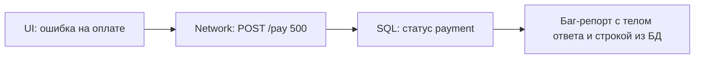

# SQL для тестировщика

<div class="article-tags">
  <span class="tag tag-required">ОБЯЗАТЕЛЬНО</span>
  <span class="tag tag-beginner">ДЛЯ НОВИЧКОВ</span>
</div>

<span class="complexity-badge">Тестировщику</span>
<span class="complexity-badge">Аналитику</span>

> **Зачем эта статья.** UI показал «Заказ создан», API вернул `200` — а **в базе** запись есть? Баланс списался? Статус верный? Без SQL вы верите интерфейсу на слово. Здесь — **минимум запросов** для ежедневной работы QA; углубление — в разделе [SQL](/encyclopedia/3-data-markup/3-07-sql/intro).

:::warning Только тестовые стенды
Запросы выполняйте на **test / staging**, с read-only учёткой, если возможно. Не правьте продакшен «просто проверить». Согласуйте доступ с DBA или разработчиком.
:::

---

## Что должен уметь тестировщик

| Навык | Зачем |
|-------|-------|
| `SELECT` + `WHERE` | Найти запись пользователя, заказа, платежа |
| `JOIN` | Связать заказ с пользователем и товарами |
| `COUNT`, `SUM` | Сверить количество строк с UI |
| `ORDER BY` + `LIMIT` | Последние N операций |
| Понимание транзакций | Почему «деньги списались, заказ не создался» |

Полный курс SQL — не обязателен для старта в QA. Достаточно 10–15 шаблонов ниже.

---

## Как подключиться

| Инструмент | Когда |
|------------|-------|
| **DBeaver**, **DataGrip**, **pgAdmin** | Ручные проверки, экспорт в CSV |
| **Консоль** `psql`, `mysql` | Быстрый запрос с сервера |
| Запрос из автотеста | [Интеграционное тестирование](./121.md) |

Уточните у команды: СУБД (PostgreSQL, MySQL, MS SQL), имя схемы, **тестовая** база, логин только на чтение.

---

## 10 запросов, которые покрывают 80% задач

### 1. Найти пользователя по email

```sql
SELECT id, email, status, created_at
FROM users
WHERE email = 'qa@test.local';
```

После регистрации через UI — проверка, что строка появилась.

### Схема «UI сказал X — SQL подтвердил»

Частый рабочий цикл QA:

1. Выполнить действие в UI или через API (создать заказ, сменить статус).
2. Зафиксировать **факт** в интерфейсе: «Заказ №1001 — Оплачен».
3. Выполнить SQL на **том же** тестовом стенде и сравнить с оракулом из требований.

```sql
-- После оплаты в UI ожидаем status = 'paid' и одну запись
SELECT id, status, total_amount, paid_at
FROM orders
WHERE id = 1001;
```

| Что сравниваем | UI / API | SQL |
|----------------|----------|-----|
| Статус | «Оплачен» | `status = 'paid'` |
| Сумма | 1 990 ₽ | `total_amount = 1990.00` |
| Количество в списке | «3 заказа» | `COUNT(*) ... = 3` |

Если UI и БД расходятся — это дефект **целостности данных** (часто серьёзнее «кривой вёрстки»). В баг-репорт кладут оба факта: скрин UI и результат запроса.

### 2. Последние заказы пользователя

```sql
SELECT id, user_id, total_amount, status, created_at
FROM orders
WHERE user_id = 42
ORDER BY created_at DESC
LIMIT 10;
```

### 3. Заказ со строками (JOIN)

```sql
SELECT o.id AS order_id, o.status, oi.product_id, oi.quantity, oi.price
FROM orders o
JOIN order_items oi ON oi.order_id = o.id
WHERE o.id = 1001;
```

Сверьте сумму позиций с итогом в UI.

### 4. Количество записей

```sql
SELECT COUNT(*) FROM orders WHERE status = 'pending';
```

Сравните с фильтром «Ожидают оплаты» в админке.

### 5. Дубликаты (анomaly hunting)

```sql
SELECT email, COUNT(*) AS cnt
FROM users
GROUP BY email
HAVING COUNT(*) > 1;
```

После «массового импорта» или бага с двойной регистрацией.

### 6. «Зависшие» статусы

```sql
SELECT id, status, updated_at
FROM payments
WHERE status = 'processing'
  AND updated_at < NOW() - INTERVAL '1 hour';
```

Нефункциональная проверка: платежи не должны висеть вечно.

### 7. Сумма по периоду

```sql
SELECT DATE(created_at) AS day, SUM(total_amount) AS revenue
FROM orders
WHERE created_at >= '2026-03-01'
GROUP BY DATE(created_at)
ORDER BY day;
```

Сверка с отчётом аналитики или экспортом.

### 8. Мягкое удаление (soft delete)

```sql
SELECT id, deleted_at
FROM products
WHERE id = 55 AND deleted_at IS NOT NULL;
```

После «удаления» в UI товар часто остаётся в БД с меткой времени.

### 9. Проверка связи FK

```sql
SELECT o.id
FROM orders o
LEFT JOIN users u ON u.id = o.user_id
WHERE u.id IS NULL;
```

Не должно быть заказов без пользователя — признак бага миграции.

### 10. Аудит после тестового прогона

```sql
SELECT *
FROM audit_log
WHERE entity_type = 'order' AND entity_id = 1001
ORDER BY created_at;
```

Кто и когда менял статус — полезно для баг-репорта.

---

## Связка UI → API → SQL

Типичный расследование бага:



1. Воспроизвести в браузере, сохранить **Request ID** / время.
2. В Network — URL, тело запроса, ответ.
3. В SQL — найти `payment_id` или `order_id` по времени и user_id.
4. В [баг-репорт](./119.md) — шаги UI + фрагмент JSON + результат SELECT.

---

## Тестовые данные

| Правило | Почему |
|---------|--------|
| Не копировать прод без маскировки | GDPR, 152-ФЗ |
| Префикс `qa_`, `test_` | Легко найти и удалить |
| Скрипты seed от разработчиков | Воспроизводимое окружение |
| Откат после интеграционных тестов | [121 — практикум](./1012.md) |

Подробнее про управление данными — [Документация тестировщика](./119.md#тестовые-данные-и-их-роль-в-обеспечении-качества).

---

## Куда углубляться

| Тема | Раздел |
|------|--------|
| Основы SELECT, WHERE, JOIN | [SQL — введение](/encyclopedia/3-data-markup/3-07-sql/intro) |
| Шпаргалка типовых задач | [885 — шпаргалка SQL](/encyclopedia/3-data-markup/3-07-sql/885) |
| Тестирование БД в автотестах | [118 — тестирование баз данных](./118.md#тестирование-баз-данных) |
| API + проверка ответа | [Тестирование API](./2.md) |

---
