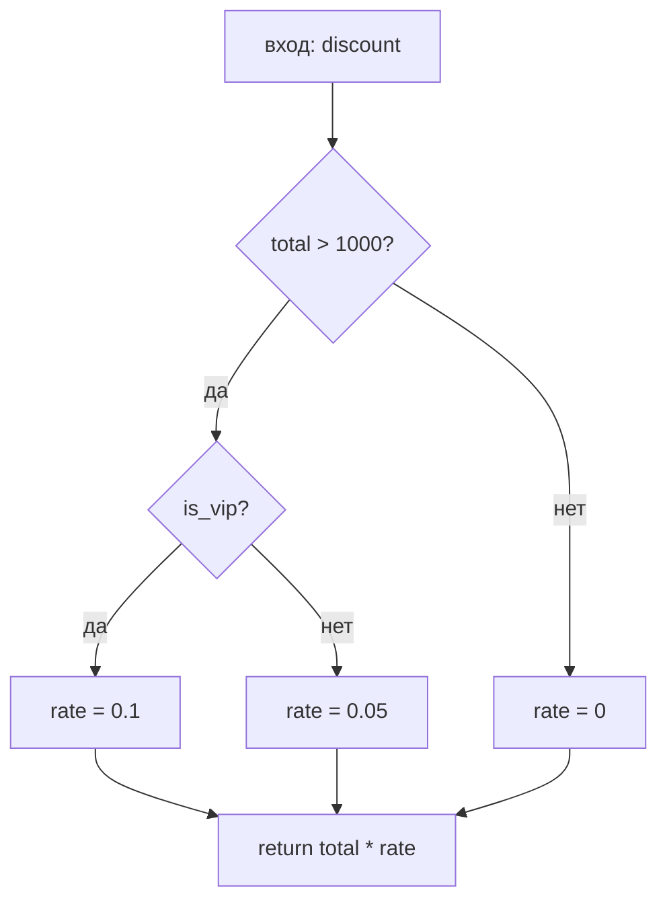

# White-box — тестирование потоков управления и данных

<div class="article-tags">
  <span class="tag tag-required">ОБЯЗАТЕЛЬНО</span>
  <span class="tag tag-beginner">ДЛЯ НОВИЧКОВ</span>
</div>

<span class="complexity-badge">Разработчику</span>
<span class="complexity-badge">Тестировщику</span>

> **Зачем эта статья.** [Black-box](./111) отвечает на вопрос "что видит пользователь". **White-box** (структурное тестирование) отвечает на "какие ветки кода мы реально прошли". Для новичка в QA это мост к unit-тестам, покрытию и разговору с разработчиком на одном языке.

---

## Black-box и white-box — в чём разница

| Подход | Что знаем | Типичный исполнитель | Пример |
|--------|-----------|----------------------|--------|
| **Black-box** | Только входы и выходы по ТЗ | Ручной QA, API-тесты | "Скидка 10 % при сумме > 1000" — проверили сумму 1500 |
| **White-box** | Структура кода: `if`, циклы, присвоения | Разработчик (unit), иногда QA с доступом к коду | Тот же сценарий + отдельный тест для ветки `total ≤ 1000` |
| **Gray-box** | Частично знаем API/БД/логи | Интеграционные тесты | UI + SQL + коды ошибок API |

[Black-box](/encyclopedia/7-project/7-05-testirovanie/111) хватает для большинства API и UI. Внутри одного модуля может быть **много веток `if`**, и один "счастливый" сценарий **не заходит** в редкую, но опасную комбинацию (отрицательная скидка, деление на ноль, необработанный `else`).

**White-box** использует **знание кода**: граф потока управления, присвоения переменных, пути выполнения. Глава **2.3** учебника "экономика производства ПО" посвящена этому на уровне **модулей и компонентов**.

<div class="callout callout--tip">
  <div class="callout-title">Кто пишет white-box тесты</div>
  <p>Чаще <strong>разработчик</strong> (unit-тесты). QA с доступом к коду и <a href="/encyclopedia/7-project/7-05-testirovanie/126">покрытию</a> подключается на критичных модулях: расчёты, безопасность, системы реального времени.</p>
</div>

---

## Граф потока управления (CFG)

**Control Flow Graph (CFG)** — схема выполнения программы:

- **Узел** = **базовый блок** — последовательность команд **без** ветвлений внутри.
- **Ребро** = переход после условия (`if`, `while`, `return`).

Пример:

```python
def discount(total, is_vip):       # блок 1 — вход
    if total > 1000:               # решение (ветвление)
        rate = 0.1 if is_vip else 0.05   # блок 2 или 3
    else:
        rate = 0                     # блок 4
    return total * rate              # блок 5 — выход
```



Для **ветвевого покрытия (branch)** нужны тесты, которые хотя бы раз прошли **каждое ребро "да" и "нет"** у решений. Минимум для примера выше:

| # | total | is_vip | Какие ветки задействованы |
|---|-------|--------|---------------------------|
| 1 | 1500 | true | total>1000, vip |
| 2 | 1500 | false | total>1000, обычный |
| 3 | 500 | false | else, rate=0 |

Три теста — не "перебор ради перебора", а **гарантия**, что ветка `else` существует в прогоне.

Подробнее о метрике сложности — [цикломатическая сложность](/encyclopedia/7-project/7-10-kultura-koda/2).

---

## Стратегии тестирования потока управления

| Стратегия | Идея | Покрытие |
|-----------|------|----------|
| **Statement** | Каждая строка выполнена хотя бы раз | Слабое: можно пройти строку без проверки результата |
| **Branch / decision** | Каждая ветка true/false | Базовое для модулей |
| **Condition** | Все комбинации в сложном `if a && b` | Сильнее branch |
| **Basis path** | Число путей ≈ цикломатическая сложность **M** | Классика McCabe |
| **Path (полное)** | Все пути | Часто нереально (экспоненциальный рост) |

**Basis path testing:** выберите **M линейно независимых** путей — минимальный набор, чтобы разумно "пройти" ветвления. **M** считают по графу: число рёбер − узлов + 2 (для одной функции с одним входом).

<div class="callout callout--info">
  <div class="callout-title">Сложность тестирования</div>
  Чем выше **M**, тем **больше** обязательных сценариев. Функция с M > 15 — сигнал **упростить** код, а не "добить coverage любой ценой" ([культура кода](/encyclopedia/7-project/7-10-kultura-koda/2)).
</div>

---

### Связь с black-box техниками

[Эквивалентные классы и границы](./127) говорят **какие входы** взять с точки зрения ТЗ. White-box показывает **где в коде** эти границы превращаются в `if`. Оба подхода дополняют друг друга.

---

## Корректность white-box тестов

Тест **корректен**, если:

1. **Достижимость** — путь реально выполняется (в тесте нет "мертвого" кода, который никогда не вызовется).
2. **Оракул** — известен **ожидаемый результат** для входа ([127](./127)).
3. **Независимость** — тесты не зависят от порядка (FIRST в [120](./120)).
4. **Учёт данных** — ветка пройдена с **конкретными** значениями, **активирующими** условие.

**Ложное покрытие:** тест "прошёл" по строке, но **без assert** на результат — coverage зелёный, дефект остаётся.

```python
def discount(total, is_vip):
    if total > 1000:
        rate = 0.1 if is_vip else 0.05
    else:
        rate = 0
    return total * rate

# Плохо: вызвали функцию, не проверили return
def test_discount_smoke():
    discount(1500, True)  # нет assert

# Хорошо
def test_vip_branch():
    assert discount(1500, True) == 150.0
```

---

## Тестирование с учётом переменных и констант

Условия зависят от **границ**:

| Конструкция | Что проверять |
|-------------|---------------|
| `x > 1000` | 999, 1000, 1001 |
| `a && b` | все 4 комбинации true/false |
| `switch (code)` | каждый `case` + `default` |
| Константы `#define TIMEOUT 50` | timeout−1, timeout, timeout+1 |

---

## Потоки данных (data flow testing)

**Поток данных** — путь от **определения** (definition) переменной до **использования** (use).

| Аббревиатура | Смысл |
|-------------|--------|
| **DEF** | Присвоение значения |
| **USE** | Чтение в выражении / условии |
| **DU-chain** | Цепочка def → use |

**Классы покрытия** (упрощённо):

| Критерий | Требование |
|----------|------------|
| **All-defs** | Каждое определение доходит до хотя бы одного use в тесте |
| **All-uses** | Каждое use покрыто тестом от какого-то def |
| **All-du-paths** | Все пути def→use (дорого) |

---

### Мини-разбор

```csharp
int x = ReadInput();    // DEF x
if (x < 0) x = 0;       // DEF x (повторное)
return x * 2;           // USE x
```

| Тест | Вход | Ожидание | Какой поток |
|------|------|----------|-------------|
| 1 | x = -5 | return 0 | clamp сработал |
| 2 | x = 3 | return 6 | без clamp |

Без теста с **отрицательным** x ветка clamp **не проверена** — statement coverage может быть обманчивым, если `return` вызывается только с положительными x из другого теста без отрицательных.

---

## Связь control-flow и data-flow

| Только control-flow | + data-flow |
|-------------------|-------------|
| "Зашли в `if`" | "Зашли с x=-1 и получили 0" |
| Может пропустить **неинициализированную** переменную | Ловит USE без DEF |

Статический анализ (Sonar, PVS-Studio) частично автоматизирует data-flow **до** запуска.

---

## Инструменты

| Инструмент | Что даёт |
|------------|----------|
| **Coverage.py, JaCoCo, dotCover** | Statement / branch coverage |
| **pytest-cov, Istanbul** | Отчёты в CI |
| **SonarQube** | Coverage + smells |
| **Отладчик / trace** | Реальный путь при падении |

Цель — **осознанное** покрытие критичных модулей ([126](./126)), а не зелёный процент ради отчёта.

---

## White-box на уровне комплекса

На **интеграции** white-box смотрит на **взаимодействие модулей**: все ли **интерфейсы** вызваны, все ли **коды ошибки** обработаны. Это ближе к **gray-box** ([111](./111)).

Для **систем реального времени** white-box дополняется **измерением времени** пути — см. [заказные РВ-системы](/encyclopedia/7-project/7-13-ekonomika-proizvodstva-po/5).

---

## Когда QA без глубокого кода всё равно полезен white-box

| Ситуация | Действие |
|----------|----------|
| Разработчик говорит "покрытие 90 %" | Спросить: branch или только statement? Есть ли assert? |
| Критичный расчёт (налог, скидка) | Попросить таблицу граничных входов из кода |
| Падение только на prod | С trace/log восстановить **какая ветка** не отработала |
| Рефакторинг `if` | Регресс + unit от разработчика по CFG |

---

## Типичные ошибки

1. **Гонка за 100% coverage** — тесты без assert.
2. **Игнор `else` и `catch`** — "так не бывает" в проде бывает.
3. **Не тестировать short-circuit** — в `a || expensive()` вызов `expensive()` зависит от `a`.
4. **Путать branch с path** — полное покрытие путей комбинаторно взрывается.

---

## Куда читать дальше

| Тема | Материал |
|------|----------|
| Unit-тесты | [120](./120) |
| Цикломатическая сложность | [7-10/2](/encyclopedia/7-project/7-10-kultura-koda/2) |
| Тест-дизайн black-box | [127](./127) |
| Маршрут курса | [7-13/intro](/encyclopedia/7-project/7-13-ekonomika-proizvodstva-po/intro) |

---

## White-box чек-лист для PR

- покрыты ветви `if/else`, `switch/case`, обработка исключений;
- проверены граничные значения и пустые входы;
- есть assert на бизнес-результат;
- непокрытый код явно обоснован в комментарии или задаче.

Такой чек-лист удерживает фокус на качестве логики, а не только на проценте покрытия.

---

## Кейс "ветка исключения не тестировалась год"

Ситуация: при внешнем сбое сервис падает, хотя основной поток покрыт тестами.

Причина: `catch`-ветка долго не выполнялась в тестах и накопила регрессию.

Как закрывать риск:

- в unit/integration добавлять сценарии принудительных ошибок зависимостей;
- проверять не только факт перехвата, но и корректный бизнес-результат;
- периодически ревизовать критичные `catch/finally` ветки на актуальность.

White-box особенно ценен именно в таких редко исполняемых путях.

---

## Навигация по разделу "Тестирование"

- **Маршрут:** [О разделе](./intro.md) · [Резюме раздела](./998.md) · [Карта уровней и практик (Unit / Integration / UI / E2E, TDD, BDD)](./131.md)
- **Теория и процесс:** [Основы](./1.md) · [Классификация](./111.md) · [Жизненный цикл](./112.md) · [Порядок этапов](./116.md) · [Артефакты качества](./113.md)
- **Уровни проверок:** [Unit](./120.md) · [Integration](./121.md) · [E2E, системное и UI](./114.md) · [API](./2.md) · [Тестовые дублёры](./117.md) · [Покрытие кода](./126.md) · [White-box](./130.md) · [Мутационное тестирование](./125.md)
- **Практика QA:** [Документация](./119.md) · [Тест-дизайн](./127.md) · [Ручное веб](./128.md) · [SQL](./129.md)
- **Автоматизация:** [Стратегия и пирамида](./115.md) · [Каталог инструментов](./118.md) · [Selenium](./1181.md) · [Playwright](./1182.md)
- **Практикум и углубление:** [1011](./1011.md) · [1012](./1012.md) · [1013](./1013.md) · [1014](./1014.md) · [Мобильное](./124.md) · [Нагрузка](./122.md) · [Безопасность](./123.md) · [Самопроверка](./999.md) · [Доп. материалы курса](./1271.md) · [1272](./1272.md) · [1273](./1273.md)

---
