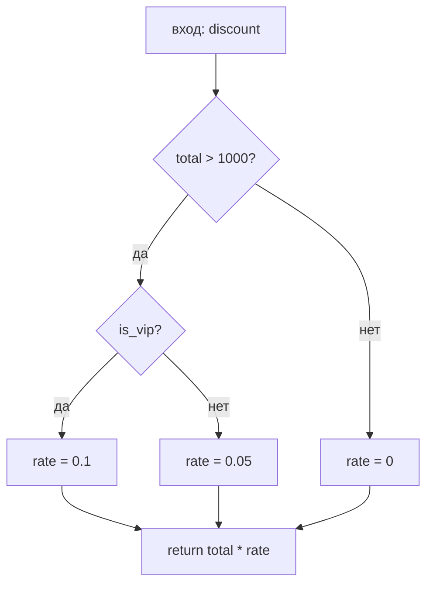

import ExternalCodeEmbed from '@site/src/components/ExternalCodeEmbed';


# White-box — тестирование потоков управления и данных

<div class="article-tags">
  <span class="tag tag-required">ОБЯЗАТЕЛЬНО</span>
  <span class="tag tag-beginner">ДЛЯ НОВИЧКОВ</span>
</div>

<span class="complexity-badge">Разработчику</span>
<span class="complexity-badge">Тестировщику</span>


<div class="callout callout--info">
  <div class="callout-title">Теория данных (раздел 3)</div>
  <div class="callout-body">
  Проверка в БД — [SQL для тестировщика](./129), [Основы БД](/encyclopedia/3-data-markup/3-05-osnovy-baz-dannyh/1), [транзакции](/encyclopedia/3-data-markup/3-05-osnovy-baz-dannyh/7), [PostgreSQL](/encyclopedia/3-data-markup/3-07-sql/888). Карта — [о разделе](./intro).
  </div>
</div>

> [Black-box](./111) отвечает на вопрос "что видит пользователь". **White-box** (структурное тестирование) отвечает на "какие ветки кода мы реально прошли". Для новичка в QA это мост к unit-тестам, покрытию и разговору с разработчиком на одном языке.

---

## Black-box и white-box — в чём разница

Тестирование потоков управления (Control Flow Testing) и тестирование потоков данных (Data Flow Testing) — это две фундаментальные динамические техники структурного тестирования методом «белого ящика» (White-Box Testing). Они базируются на анализе исходного кода, но фокусируются на разных его аспектах: последовательности выполнения команд и жизненном цикле переменных.

Тестирование потоков управления основано на проверке логического порядка выполнения операторов программы. Для этого исходный код преобразуется в граф потока управления (Control Flow Graph, CFG), где узлы — это блоки кода (операторы), а ребра — переходы между ними (условия, циклы).

Тестирование потоков данных исследует жизненный цикл переменных и то, как значения передаются внутри программы. Она дополняет тестирование потоков управления, связывая логику ветвления с обработкой конкретных данных.

| Подход | Что знаем | Типичный исполнитель | Пример |
|--------|-----------|----------------------|--------|
| **Black-box** | Только входы и выходы по ТЗ | Ручной QA, API-тесты | "Скидка 10 % при сумме > 1000" — проверили сумму 1500 |
| **White-box** | Структура кода: `if`, циклы, присвоения | Разработчик (unit), иногда QA с доступом к коду | Тот же сценарий + отдельный тест для ветки `total ≤ 1000` |
| **Gray-box** | Частично знаем API/БД/логи | Интеграционные тесты | UI + SQL + коды ошибок API |

[Black-box](/encyclopedia/7-project/7-05-testirovanie/111) хватает для большинства API и UI. Внутри одного модуля может быть **много веток `if`**, и один "счастливый" сценарий **не заходит** в редкую, но опасную комбинацию (отрицательная скидка, деление на ноль, необработанный `else`).

**White-box** использует **знание кода** — граф потока управления, присвоения переменных, пути выполнения. Теория ветвлений и сложности — [Алгоритмы — о разделе](/encyclopedia/4-code-dev/4-01-algoritmy/intro), [цикломатическая сложность](/encyclopedia/7-project/7-10-kultura-koda/2). Глава **2.3** учебника "экономика производства ПО" посвящена этому на уровне **модулей и компонентов**.

<div class="callout callout--tip">
  <div class="callout-title">Кто пишет white-box тесты</div>

  <div class="callout-body">
  Чаще **разработчик** (unit-тесты).

  QA с доступом к коду и [покрытию](/encyclopedia/7-project/7-05-testirovanie/126) подключается на критичных модулях — расчёты, безопасность, системы реального времени.
</div>
  </div>


---

## Граф потока управления (CFG)

**Control Flow Graph (CFG)** — схема выполнения программы:

- **Узел** = **базовый блок** — последовательность команд **без** ветвлений внутри.
- **Ребро** = переход после условия (`if`, `while`, `return`).

Узлы (Nodes) представляют собой линейные участки кода или базовые блоки (Basic Blocks). Базовый блок — это последовательность инструкций, в которую поток управления входит только через первую инструкцию и выходит только через последнюю, без каких-либо ветвлений внутри.

Ребра (Edges) - направленные стрелки, соединяющие узлы. Они показывают возможные переходы управления между блоками (например, при выполнении условий if, циклов while или вызовов функций).

Узел входа (Entry Node) начальная точка выполнения программы или функции.

Узел выхода (Exit Node) завершающая точка, где выполнение функции прекращается (оператор return или конец блока).

Граф потока управления позволяет математически рассчитать, насколько хорошо тесты проверяют структуру кода.

Пример:

```python
def discount(total, is_vip):       # блок 1 — вход
    if total > 1000:               # решение (ветвление)
        rate = 0.1 if is_vip else 0.05   # блок 2 или 3
    else:
        rate = 0                     # блок 4
    return total * rate              # блок 5 — выход
```



Для **ветвевого покрытия (branch)** нужны тесты, которые хотя бы раз прошли **каждое ребро "да" и "нет"** у решений. Минимум для примера выше:

| # | total | is_vip | Какие ветки задействованы |
|---|-------|--------|---------------------------|
| 1 | 1500 | true | total>1000, vip |
| 2 | 1500 | false | total>1000, обычный |
| 3 | 500 | false | else, rate=0 |

Три теста — **гарантия**, что ветка `else` существует в прогоне.

Подробнее о метрике сложности — [цикломатическая сложность](/encyclopedia/7-project/7-10-kultura-koda/2).

---

## Стратегии тестирования потока управления

| Стратегия | Идея | Покрытие |
|-----------|------|----------|
| **Statement** | Каждая строка выполнена хотя бы раз | Слабое: можно пройти строку без проверки результата |
| **Branch / decision** | Каждая ветка true/false | Базовое для модулей |
| **Condition** | Все комбинации в сложном `if a && b` | Сильнее branch |
| **Basis path** | Число путей ≈ цикломатическая сложность **M** | Классика McCabe |
| **Path (полное)** | Все пути | Часто нереально (экспоненциальный рост) |

**Basis path testing:** выберите **M линейно независимых** путей — минимальный набор, чтобы разумно "пройти" ветвления. **M** считают по графу: число рёбер − узлов + 2 (для одной функции с одним входом).

<div class="callout callout--info">
  <div class="callout-title">Сложность тестирования</div>

  <div class="callout-body">
  Чем выше **M**, тем **больше** обязательных сценариев. Функция с M > 15 — сигнал **упростить** код, а не "добить coverage любой ценой" ([культура кода](/encyclopedia/7-project/7-10-kultura-koda/2)).
</div>
  </div>

1. Statement Coverage (Покрытие операторов). Проверяет, что каждый оператор в коде выполнился хотя бы один раз. На графе CFG это означает посещение всех узлов. Помогает найти «мертвый» код, который вообще невозможно вызвать.
2. Branch / Decision Coverage (Покрытие ветвей / решений). Требует, чтобы каждое решение (развилка) в программе приняло значение «истина» (True) и «ложь» (False) хотя бы раз. На графе CFG это означает прохождение по всем ребрам (стрелкам). Автоматически гарантирует 100% покрытие операторов.
3. Condition Coverage (Покрытие условий). Применяется, когда решение состоит из составных логических условий (например, `if (A or B)`). Критерий требует, чтобы каждое отдельное под-условие (A и B по отдельности) приняло значение `True` и `False`. Фокусируется на комбинаторике внутри скобок, но, как ни странно, не гарантирует покрытие ветвей.
4. Basis Path Coverage (Покрытие базовых путей). Метод тестирования, основанный на цикломатической сложности Маккейба. Из всего бесконечного множества путей выделяется базисный набор линейно независимых маршрутов. Количество тестов строго равно цикломатической сложности M. Любой другой сложный путь в программе можно представить как линейную комбинацию этих базовых путей.
5. Path Coverage (Покрытие путей). Самый мощный и бескомпромиссный критерий. Требует выполнения всех возможных уникальных путей от начальной точки программы до конечной.


---

### Связь с black-box техниками

Тестирование «черного ящика» (Black-Box) и «белого ящика» (White-Box) часто противопоставляют, но в реальном процессе разработки (SDLC) они не заменяют, а дополняют друг друга. Их связь строится на принципе синергии: «черный ящик» проверяет что программа делает, а «белый ящик» — как она это делает внутри.

[Эквивалентные классы и границы](./127) говорят **какие входы** взять с точки зрения ТЗ. White-box показывает **где в коде** эти границы превращаются в `if`. Оба подхода дополняют друг друга.

---

## Корректность white-box тестов

Корректность тестов «белого ящика» (White-Box) оценивается иначе, чем для «черного ящика». Поскольку эти тесты строятся на основе самой реализации (исходного кода), они подвержены специфическим рискам: ложноположительным результатам, жесткой привязке к коду и иллюзии надежности при высоком проценте покрытия. Главная ловушка белого ящика: если в самом коде заложена логическая ошибка, тест, написанный строго по этому коду, просто продублирует и узаконит эту ошибку.

Тест считается некорректно спроектированным, если он «падает» при изменении внутренней реализации, которая не повлияла на конечный результат.

Тест **корректен**, если:

1. **Достижимость** — путь реально выполняется (в тесте нет "мертвого" кода, который никогда не вызовется).
2. **Оракул** — известен **ожидаемый результат** для входа ([Техники проектирования тестов](./127)).
3. **Независимость** — тесты не зависят от порядка (FIRST в [Юнит-тестирование](./120)).
4. **Учёт данных** — ветка пройдена с **конкретными** значениями, **активирующими** условие.

**Ложное покрытие:** тест "прошёл" по строке, но **без assert** на результат — coverage зелёный, дефект остаётся.

Метрика покрытия кода (Code Coverage) — это инструмент поиска непротестированного кода, но она не является абсолютным гарантом корректности тестов. Если тест про прохождении строчки кода не делает проверок (assert), инструмент покрытия все равно засчитает эту строчку как успешно протестированную. Это называется «тестированием без проверок» (Assertionless Testing).

Для оценки качества и корректности тест-кейсов белого ящика применяют продвинутые инженерные подходы:
- Мутационное тестирование (Mutation Testing). Специальный инструмент (например, PITest для Java или MutMut для Python) автоматически вносит мелкие умышленные баги (мутации) в ваш исходный код. 
- Анализ граничных условий в предикатах. Тест корректен, если он бьет точно в точки смены поведения потока управления.
- Независимость от окружения (Изоляция). Корректный юнит-тест детерминирован: он выдает одинаковый результат независимо от порядка запуска, времени на сервере, настроек файловой системы или доступа к сети. Все внешние зависимости должны быть корректно изолированы с помощью заглушек (Stubs/Mocks).

<ExternalCodeEmbed example="python/project-7-7-05-testirovanie-130-001" title="Корректность white-box тестов" minHeight={318} />

---

## Тестирование с учётом переменных и констант

Тестирование с учётом переменных и констант — это развитие идей тестирования потоков данных (Data Flow Testing) на уровне конкретных языковых конструкций. Главная задача здесь — убедиться, что память программы используется корректно, изменяемые данные не приводят к непредсказуемым побочным эффектам, а неизменяемые — действительно защищены от модификации.

1. Тестирование констант (Constants). Константы определяют фиксированное поведение системы (настройки, математические величины, бизнес-правила). При их тестировании фокус смещается на этап компиляции / инициализации и на логику использования.
2. Тестирование переменных (Variables). При работе с переменными White-Box тестирование отслеживает их состояния в рамках трех фаз: Объявление (Declaration) → Инициализация/Модификация (Definition) → Использование (Use).
3. Анализ состояний полей объектов (Stateful Testing). Если переменная является свойством класса (полем объекта), её значение может меняться между вызовами разных методов. 

Условия зависят от **границ**:

| Конструкция | Что проверять |
|-------------|---------------|
| `x > 1000` | 999, 1000, 1001 |
| `a && b` | все 4 комбинации true/false |
| `switch (code)` | каждый `case` + `default` |
| Константы `#define TIMEOUT 50` | timeout−1, timeout, timeout+1 |

---

## Потоки данных (data flow testing)

Тестирование потоков данных (Data Flow Testing) — это мощная техника «белого ящика», которая фокусируется не на логических ветвлениях кода сами по себе, а на том, как переменные создаются, изменяются и используются на протяжении работы программы. Эта техника ищет несоответствия между тем, где данные записываются в память, и тем, где они оттуда читаются.
1. Жизненный цикл переменной (Статусы данных). В любой момент времени работы программы каждая переменная находится в одном из трех состояний.
2. DU-цепочки (Data Use Pairs). Смысл тестирования сводится к анализу DU-пар (или DU-цепочек).
3. Критерии покрытия потоков данных. Полнота тестирования оценивается по тому, сколько DU-пар или путей проверили ваши тесты (по классификации Рапса и Вьюкера).
4. Аномалии потоков данных (Что ищут тесты?). Главная практическая польза техники — автоматический поиск структурных дефектов кода (аномалий), которые часто упускаются обычным тестированием ветвей.

**Поток данных** — путь от **определения** (definition) переменной до **использования** (use).

| Аббревиатура | Смысл |
|-------------|--------|
| **DEF** | Присвоение значения |
| **USE** | Чтение в выражении / условии |
| **DU-chain** | Цепочка def → use |

**Классы покрытия** (упрощённо):

| Критерий | Требование |
|----------|------------|
| **All-defs** | Каждое определение доходит до хотя бы одного use в тесте |
| **All-uses** | Каждое use покрыто тестом от какого-то def |
| **All-du-paths** | Все пути def→use (дорого) |

В тестировании методом «белого ящика» (White-Box Testing) термином классы покрытия (или уровни/критерии покрытия) называют стандартизированные метрики, которые определяют, какая доля структуры кода была выполнена и проверена существующим набором тестов. В коммерческой веб- и мобильной разработке стандартом де-факто является достижение 80–90% Statement (C0) и Branch (C1) покрытия. Пытаться достичь 100% покрытия путей экономически нецелесообразно.

Вручную строить DU-цепочки для больших программ невозможно. Для этого используют инструменты статического и динамического анализа (Data Flow Analyzers). Они встроены в продвинутые линтеры и IDE (например, инспекции в JetBrains IntelliJ IDEA / WebStorm, плагины для SonarQube, статические анализаторы PVS-Studio или Cppcheck). Они подсвечивают строки кода предупреждениями вроде "Variable is never used" или "Value overwritten before read".

---

### Мини-разбор

```csharp
int x = ReadInput();    // DEF x
if (x < 0) x = 0;       // DEF x (повторное)
return x * 2;           // USE x
```

| Тест | Вход | Ожидание | Какой поток |
|------|------|----------|-------------|
| 1 | x = -5 | return 0 | clamp сработал |
| 2 | x = 3 | return 6 | без clamp |

Без теста с **отрицательным** x ветка clamp **не проверена** — statement coverage может быть обманчивым, если `return` вызывается только с положительными x из другого теста без отрицательных.

---

## Связь control-flow и data-flow

| Только control-flow | + data-flow |
|-------------------|-------------|
| "Зашли в `if`" | "Зашли с x=-1 и получили 0" |
| Может пропустить **неинициализированную** переменную | Ловит USE без DEF |

Статический анализ (Sonar, PVS-Studio) частично автоматизирует data-flow **до** запуска.

---

## Инструменты

| Инструмент | Что даёт |
|------------|----------|
| **Coverage.py, JaCoCo, dotCover** | Statement / branch coverage |
| **pytest-cov, Istanbul** | Отчёты в CI |
| **SonarQube** | Coverage + smells |
| **Отладчик / trace** | Реальный путь при падении |

Цель — **осознанное** покрытие критичных модулей ([Покрытие кода и метрики полноты тестирования](./126)), а не зелёный процент ради отчёта.

---

## White-box на уровне комплекса

На **интеграции** white-box смотрит на **взаимодействие модулей**: все ли **интерфейсы** вызваны, все ли **коды ошибки** обработаны. Это ближе к **gray-box** ([Классификация видов тестирования](./111)).

Для **систем реального времени** white-box дополняется **измерением времени** пути — см. [заказные РВ-системы](/encyclopedia/7-project/7-13-ekonomika-proizvodstva-po/5).

---

## Когда QA без глубокого кода всё равно полезен white-box

| Ситуация | Действие |
|----------|----------|
| Разработчик говорит "покрытие 90 %" | Спросить: branch или только statement? Есть ли assert? |
| Критичный расчёт (налог, скидка) | Попросить таблицу граничных входов из кода |
| Падение только на prod | С trace/log восстановить **какая ветка** не отработала |
| Рефакторинг `if` | Регресс + unit от разработчика по CFG |

---

## Типичные ошибки

1. **Гонка за 100% coverage** — тесты без assert.
2. **Игнор `else` и `catch`** — "так не бывает" в проде бывает.
3. **Не тестировать short-circuit** — в `a || expensive()` вызов `expensive()` зависит от `a`.
4. **Путать branch с path** — полное покрытие путей комбинаторно взрывается.

---

## Рекомендую читать дальше

| Тема | Материал |
|------|----------|
| Unit-тесты | [Юнит-тестирование](./120) |
| Цикломатическая сложность | [7-10/2](/encyclopedia/7-project/7-10-kultura-koda/2) |
| Тест-дизайн black-box | [Техники проектирования тестов](./127) |
| Маршрут курса | [7-13/intro](/encyclopedia/7-project/7-13-ekonomika-proizvodstva-po/intro) |

---

## White-box чек-лист для PR

- покрыты ветви `if/else`, `switch/case`, обработка исключений;
- проверены граничные значения и пустые входы;
- есть assert на бизнес-результат;
- непокрытый код явно обоснован в комментарии или задаче.

Такой чек-лист удерживает фокус на качестве логики, а не только на проценте покрытия.

---

## Кейс "ветка исключения не тестировалась год"

Ситуация: при внешнем сбое сервис падает, хотя основной поток покрыт тестами.

Причина: `catch`-ветка долго не выполнялась в тестах и накопила регрессию.

Как закрывать риск:

- в unit/integration добавлять сценарии принудительных ошибок зависимостей;
- проверять не только факт перехвата, но и корректный бизнес-результат;
- периодически ревизовать критичные `catch/finally` ветки на актуальность.

White-box особенно ценен именно в таких редко исполняемых путях.

---

## Навигация по разделу "Тестирование"

- **Маршрут:** [О разделе](./intro.md) · [Резюме раздела](./998.md) · [Карта уровней и практик (Unit / Integration / UI / E2E, TDD, BDD)](./131.md)
- **Теория и процесс:** [Основы](./1.md) · [Классификация](./111.md) · [Жизненный цикл](./112.md) · [Порядок этапов](./116.md) · [Артефакты качества](./113.md)
- **Уровни проверок:** [Unit](./120.md) · [Integration](./121.md) · [E2E, системное и UI](./114.md) · [API](./2.md) · [Тестовые дублёры](./117.md) · [Покрытие кода](./126.md) · [White-box](./130.md) · [Мутационное тестирование](./125.md)
- **Практика QA:** [Документация](./119.md) · [Тест-дизайн](./127.md) · [Ручное веб](./128.md) · [SQL](./129.md)
- **Автоматизация:** [Стратегия и пирамида](./115.md) · [Каталог инструментов](./118.md) · [Selenium](./1181.md) · [Playwright](./1182.md)
- **Практикум и углубление:** [Подготовка среды и создание первого теста](./1011.md) · [Проверка взаимодействия компонентов](./1012.md) · [Проверка пользовательского сценария](./1013.md) · [Проверка надежности под нагрузкой](./1014.md) · [Мобильное](./124.md) · [Нагрузка](./122.md) · [Безопасность](./123.md) · [Самопроверка](./999.md) · [Доп. материалы курса](./1271.md) · [Инструменты с низким кодом для тестирования](./1272.md) · [Тестирование нейроморфных систем](./1273.md)

---
