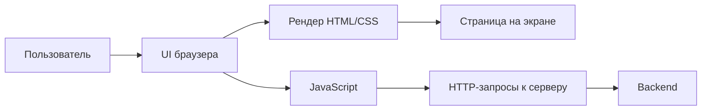

# Основы тестирования веб-приложений — маршрут для QA

  ОБЯЗАТЕЛЬНО
  ДЛЯ НОВИЧКОВ

Тестировщику
Аналитику

  
Теория данных (раздел 3)

  

  Проверка в БД — [129](./129), [Основы БД](/encyclopedia/3-data-markup/3-05-osnovy-baz-dannyh/1), [транзакции](/encyclopedia/3-data-markup/3-05-osnovy-baz-dannyh/7), [PostgreSQL](/encyclopedia/3-data-markup/3-07-sql/888). Карта — [о разделе](./intro).
  

> **Зачем эта статья.** Типичный курс QA по вебу охватывает пять больших блоков: основы, клиент–сервер, backend, формы и фронтенд, нефункциональные проверки. В энциклопедии эти темы **разбросаны** по разделам «Тестирование», «Сеть», «HTML», «Безопасность». Здесь — **единый маршрут**: что читать, в каком порядке и что проверять руками на стенде.

---

## Как пользоваться маршрутом

| Шаг | Действие |
|-----|----------|
| 1 | Пройдите блоки 1–2, если только входите в веб-QA |
| 2 | Откройте [Ручное тестирование веба](./128.md) — практические чек-листы |
| 3 | По задаче углубляйтесь в смежные разделы по ссылкам из таблиц |
| 4 | Автоматизацию подключайте после ручной базы — [115](./115.md), [1182](./1182.md) |

  
Связка «теория → практика»

  

  Прочитали про HTTP — сразу откройте DevTools → Network на любом сайте.

  Прочитали про роли — войдите под двумя учётками и сравните доступ к `/admin`. Без такой связки материалы остаются абстракцией.

  

---

## Блок 1 — основы веба для тестировщика

### Архитектура браузера — что нужно QA

Тестировщику не обязательно знать исходники Chromium, но **структура браузера** объясняет, куда смотреть при баге.

| Компонент | Зачем QA |
|-----------|----------|
| **UI браузера** | Адресная строка, вкладки, закладки — навигация пользователя |
| **Движок рендеринга** (Blink, Gecko, WebKit) | Разная отрисовка CSS и шрифтов → кроссбраузерные баги |
| **JavaScript-движок** (V8, SpiderMonkey, JavaScriptCore) | Ошибки в Console, «белый экран» на SPA |
| **Сетевой стек** | Запросы HTTP/HTTPS, cookies, кэш — вкладка Network |
| **DevTools** | Elements, Console, Network — ежедневный инструмент ручного QA |

**Где углубиться**

- [Движки браузеров и линейки продуктов](/encyclopedia/2-system-network/2-04-kak-rabotayut-sayty-i-veb-sayty/127) — Blink, Gecko, WebKit; почему тестируют минимум два семейства
- [JavaScript-движок](/encyclopedia/2-system-network/2-03-set-i-internet/617) — связь JS и производительности
- [От URL до пикселей](/encyclopedia/2-system-network/2-04-kak-rabotayut-sayty-i-veb-sayty/1) — полный путь загрузки страницы
- [DevTools в контексте веба](/encyclopedia/2-system-network/2-04-kak-rabotayut-sayty-i-veb-sayty/1111) — вкладки и закладки; [128](./128.md) — Network для QA

### HTML и структура страницы

HTML — **каркас**, который видит браузер и скринридер. QA проверяет не синтаксис ради синтаксиса, а **поведение элементов**.

| Элемент | Что проверить |
|---------|---------------|
| Формы (`form`, `input`, `select`) | Отправка, валидация, обязательные поля — [чек-лист форм](./128.md#чек-лист--формы-и-ввод) |
| Ссылки (`a href`) | Все ли ведут куда нужно, нет ли `javascript:void(0)` вместо действия |
| Кнопки (`button` vs `a`) | Клик с клавиатуры, тип `submit` vs `button` |
| Семантика (`nav`, `main`, `h1`) | Заголовки, landmarks — база для accessibility |

**Где углубиться** — [раздел HTML](/encyclopedia/3-data-markup/3-09-html/intro).

### Навигация

Проверки навигации — в [128](./128.md#чек-лист--навигация-и-ui): меню, хлебные крошки, кнопка «Назад», модальные окна, 404/500, title и favicon.

Для SPA добавьте: смена URL без перезагрузки, deep link (открытие `/orders/123` напрямую), состояние после F5 — см. [Playwright и SPA](./1182.md#spa-и-react--что-учитывать-в-e2e).

### Локализация и интернационализация

| Термин | Смысл | Что тестировать |
|--------|-------|-----------------|
| **i18n** | Продукт готов к переводу | Смена локали не ломает логику, даты и числа |
| **l10n** | Конкретный язык и регион | Тексты, валюта, форматы, правовые формулировки |

**Чек-лист l10n для веба**

- Переключение языка сохраняется после F5 и логина
- Длинные немецкие/финские строки не обрезают кнопки
- RTL (арабский, иврит) — порядок элементов и выравнивание
- Форматы даты, времени, валюты по региону
- Ввод на национальной раскладке в полях поиска и логина
- SEO-мета (`title`, `description`) на целевом языке

Теория i18n/l10n — [Классификация видов тестирования](./111.md#интернационализация-и-локализация). Мобильные сценарии — [124](./124.md).

### Характеристики качества

Нефункциональные свойства веба описывают **как** система работает, а не **что** делает.

| Характеристика | Примеры для веба | Материал |
|----------------|------------------|----------|
| Функциональность | Сценарии по ТЗ | [1](./1.md), [127](./127.md) |
| Производительность | Время загрузки, TTFB | [122](./122.md) |
| Безопасность | XSS, IDOR, сессии | [123](./123.md) |
| Usability | Понятность интерфейса | [111](./111.md), [маршрут веб-дизайна](/encyclopedia/1-basics/1-25-interfeys/7#блок-7--ux-исследования-и-юзабилити-тестирование) |
| Accessibility (a11y) | Клавиатура, скринридер, контраст | [111](./111.md#доступность-accessibility-и-доступность-системы-availability), [128](./128.md#дополнительный-чек-лист-для-ручного-qa) |
| Совместимость | Браузеры, разрешения | [128](./128.md#кроссбраузерность-и-адаптив) |
| Надёжность / availability | Uptime, деградация при сбое | [122](./122.md), [DevOps-мониторинг](/encyclopedia/8-infra-security/8-04-devops-ci-cd/19) |

Стандарт **ISO/IEC 25010** систематизирует эти характеристики — см. [Экономика производства ПО](/encyclopedia/7-project/7-13-ekonomika-proizvodstva-po/intro).

---

## Блок 2 — клиент–серверное взаимодействие

### HTTP и REST

HTTP — язык общения браузера и API с сервером. Минимум для QA:

| Тема | Минимум | Статья |
|------|---------|--------|
| Методы | GET, POST, PUT/PATCH, DELETE | [2](./2.md), [1274](./1274.md) |
| Коды | 2xx, 4xx, 5xx | [128](./128.md#коды-http--шпаргалка-для-баг-репорта) |
| Заголовки | `Content-Type`, `Authorization`, `Cookie`, `Set-Cookie` | [2](./2.md) |
| Тело | JSON, `application/x-www-form-urlencoded`, multipart | [2](./2.md) |
| REST | Ресурсы, идемпотентность GET/PUT/DELETE | [117](/encyclopedia/2-system-network/2-09-osnovy-integratsionnogo-vzaimodeystviya/117) |

Базовый разбор протокола — [HTTP как основа веб-интеграций](/encyclopedia/2-system-network/2-09-osnovy-integratsionnogo-vzaimodeystviya/118).

### DNS

**DNS** переводит `shop.example.com` в IP-адрес сервера. Для QA важно понимать:

- неверный DNS на стенде → «сайт не открывается» при рабочем backend;
- CDN и балансировщик могут отдавать разный контент по региону;
- при отладке curl/Postman иногда нужен `Host`-заголовок или запись в `/etc/hosts`.

**Где углубиться** — [DNS — система доменных имён](/encyclopedia/2-system-network/2-03-set-i-internet/6).

### Анализ запросов и логов

| Источник | Что даёт QA |
|----------|-------------|
| **DevTools → Network** | Статус, тело, timing, HAR-экспорт |
| **Логи веб-сервера** (nginx, Apache) | 4xx/5xx, медленные запросы, IP |
| **Логи приложения** | Stack trace, business-код ошибки, correlation id |
| **Логи БД** | Медленные запросы, блокировки |

При баге с сетью приложите к отчёту: URL, метод, статус, фрагмент Request/Response, `Request-Id` или trace id из заголовка.

**Где углубиться** — [Логирование и мониторинг](/encyclopedia/8-infra-security/8-04-devops-ci-cd/19), [128](./128.md#чек-лист--сеть-и-api-без-postman).

### Перехват трафика, прокси и брандмауэр

**Зачем QA перехват**

- увидеть запрос «как его шлёт браузер», а не только ответ на экране;
- подменить ответ (mock) для негативных сценариев;
- проверить, не уходит ли лишнее в query string (пароль, токен);
- воспроизвести медленную сеть и обрыв соединения.

| Инструмент | Когда использовать |
|------------|-------------------|
| **Chrome DevTools** | Ежедневно — Network, Throttling, Override |
| **Burp Suite / OWASP ZAP** | Глубокий анализ, повтор запросов, security-smoke |
| **Charles / Fiddler** | Перехват HTTPS на desktop, мобильный прокси |
| **Postman Interceptor** | Связка браузера и коллекции Postman |

**Прокси** стоит между клиентом и сервером: корпоративный фильтр, кэш, MitM для отладки. **Брандмауэр** может блокировать порты — симптом «работает у разработчика, не работает у QA в офисе».

  
Этика и правила

  

  Перехват HTTPS и пентest-инструменты — только на **своих** стендах или с письменным разрешением. На production без согласования — нарушение политики и закона.

  

**Где углубиться**

- [Прокси-серверы](/encyclopedia/2-system-network/2-03-set-i-internet/614)
- [Анализ и мониторинг сетевого трафика](/encyclopedia/2-system-network/2-03-set-i-internet/615)
- [Burp и веб в пентestе](/encyclopedia/8-infra-security/8-10-testirovanie-na-proniknovenie/4) — для security-углубления

---

## Блок 3 — динамика и backend

### Серверы приложений и стек

Типовая цепочка: **браузер → балансировщик → веб-сервер (nginx) → приложение (Node, Java, PHP…) → БД**.

QA на интеграционном стенде проверяет, что **версии** компонентов совпадают с релизной матрицей, а конфиг (env, feature flags) — с тест-планом.

**Где углубиться** — [Как работают сайты](/encyclopedia/2-system-network/2-04-kak-rabotayut-sayty-i-veb-sayty/intro), [веб-серверы](/encyclopedia/2-system-network/2-04-kak-rabotayut-sayty-i-veb-sayty/112).

### БД и SQL для проверки данных

UI может показывать «Успех», а в БД — пусто или дубль. После критичных операций (регистрация, оплата, смена статуса) сверяйте данные запросом.

| Задача | Пример |
|--------|--------|
| Запись создалась | `SELECT * FROM orders WHERE id = …` |
| Статус сменился | `payment_status = 'paid'` |
| Нет дубля | один заказ на двойной submit |
| Мягкое удаление | `deleted_at IS NOT NULL`, UI скрывает |

**Где углубиться** — [SQL для тестировщика](./129.md), [раздел SQL](/encyclopedia/3-data-markup/3-07-sql/intro).

### Аутентификация, авторизация, cookies, OAuth

| Механизм | Что проверить |
|----------|---------------|
| **Логин/пароль** | Негатив, блокировка, политика пароля |
| **Сессия (cookie / JWT)** | Logout, истечение, F5, два браузера |
| **«Запомнить меня»** | Срок жизни cookie по ТЗ |
| **Роли (RBAC)** | Гость не видит `/admin`; user не редактит чужие данные |
| **OAuth 2.0 / SSO** | Вход через Google/GitHub; отзыв доступа; callback URL |
| **2FA** | Обязательность, резервные коды, блок после N попыток |

**Чек-лист прав доступа (IDOR-smoke)**

- Открыть `/api/users/100` под user A — только свои данные
- Подменить id в URL или теле запроса на чужой — 403/404, не чужой профиль
- Прямая ссылка на админ-раздел без роли — редирект или 403
- Действие «удалить» доступно только владельцу или admin

Сессии в UI — [128](./128.md#чек-лист--авторизация-и-сессии). Теория auth — [Аутентификация и авторизация](/encyclopedia/2-system-network/2-08-osnovy-informatsionnoy-bezopasnosti/111). OAuth в API — [Публичный API и OAuth 2.0](/encyclopedia/7-project/7-06-proektirovanie-i-arhitektura/design/1171). Cookies — [Cookies и хранилища](/encyclopedia/2-system-network/2-04-kak-rabotayut-sayty-i-veb-sayty/116).

---

## Блок 4 — формы, вёрстка и интерактивность

### GET и POST

| Метод | Особенность | Риск для теста |
|-------|-------------|----------------|
| **GET** | Параметры в URL | Утечка в логах, истории браузера, Referer |
| **POST** | Тело запроса | Повторная отправка при «Назад», CSRF |

После успешной POST-формы ожидайте **PRG** (Post/Redirect/Get) — иначе браузер предложит повторить отправку. Проверка — [128](./128.md#чек-лист--навигация-и-ui).

### Функциональное тестирование

Функциональные проверки строятся из требований и [техник тест-дизайна](./127.md):

- эквивалентные классы;
- границы;
- таблицы решений;
- попарное тестирование.

### HTML, CSS и адаптивность

| Зона | Проверки |
|------|----------|
| Вёрстка | Наложения, обрезанный текст, сломанная сетка |
| Адаптив | 320px, 768px, 1920px; бургер-меню; горизонтальный скролл |
| Zoom 125–200% | Читаемость, кликабельность — часть a11y |
| Тёмная тема | Конtrast, иконки, границы полей |

CSS-теория — разделы [HTML](/encyclopedia/3-data-markup/3-09-html/intro) и [интерфейс](/encyclopedia/1-basics/1-25-interfeys/intro). Практика — [128](./128.md#кроссбраузерность-и-адаптив).

### JavaScript, DOM, AJAX и SPA

| Технология | Симптом бага | Где смотреть |
|------------|--------------|--------------|
| **JS-ошибка** | Белый экран, кнопка «мертвая» | Console |
| **DOM** | Элемент есть в Elements, но не виден | `display`, `visibility`, overlay |
| **AJAX / fetch** | Данные не обновились | Network → XHR/Fetch |
| **SPA** | URL сменился, контент старый | Network, timing, [1182 SPA](./1182.md#spa-и-react--что-учитывать-в-e2e) |

**Smoke для SPA**

- F5 на внутреннем маршруте не даёт 404
- Кнопка «Назад» ведёт себя предсказуемо
- Лоадер исчезает после ответа API
- Ошибка API показывает сообщение, а не вечный спиннер

JavaScript для контекста — [раздел JS](/encyclopedia/5-languages/5-01-javascript/intro).

---

## Блок 5 — нефункциональное тестирование и смежные темы

### Производительность

Минимум для ручного QA без JMeter:

- DevTools → **Performance** / **Lighthouse** — TTFB, LCP, CLS
- Network → **Throttling** (Slow 3G) — usable или белый экран
- Список из 100+ элементов — пагинация, виртуализация, время отклика

Системная нагрузка — [122 Нагрузочное тестирование](./122.md), практика — [1014](./1014.md).

### Защищённость

Базовый security-smoke для QA (не замена пентest):

- HTTPS везде, нет mixed content
- Cookie с `HttpOnly`, `Secure`, `SameSite` где нужно
- Нет секретов в URL и в ответах API
- Ошибка 500 не показывает stack trace пользователю
- Заголовки `X-Frame-Options` / CSP — clickjacking

Углубление — [123](./123.md), [пентest веба](/encyclopedia/8-infra-security/8-10-testirovanie-na-proniknovenie/intro).

### Usability и accessibility

**Usability** — наблюдение за пользователем или экспертный обход: «где кнопка?», «понятна ли ошибка?».

**Accessibility (a11y)** — WCAG 2.x: клавиатура, контраст, alt у картинок, labels у полей. Инструменты: **axe** DevTools, **Lighthouse**, NVDA/VoiceOver.

Краткий a11y-smoke — [128](./128.md#дополнительный-чек-лист-для-ручного-qa). Классификация — [111](./111.md#доступность-accessibility-и-доступность-системы-availability).

### Автоматизация

| Уровень | Инструмент | Статья |
|---------|------------|--------|
| API | Postman, pytest, REST Assured | [2](./2.md), [1011](./1011.md), [1015](./1015.md) |
| E2E UI | Playwright, Selenium | [1182](./1182.md), [1181](./1181.md) |
| Стратегия | Пирамида, CI | [115](./115.md) |

Автотесты **дополняют** ручные чек-листы из [128](./128.md), не заменяют исследовательское тестирование новых фич.

### SEO и мониторинг — что проверяет QA

**SEO-smoke** (если продукт зависит от поиска):

- Уникальные `title` и `meta description` на ключевых страницах
- `robots.txt` и `sitemap.xml` доступны на стенде
- Канонический URL (`link rel="canonical"`) без дублей
- Open Graph / Twitter Card для шаринга
- Core Web Vitals в норме — пересекается с performance

**Мониторинг** — зона DevOps/SRE, но QA должен знать:

- алерт «5xx > порога» блокирует релиз;
- дашборды uptime, latency, error rate;
- после деплоя — smoke + сверка метрик.

**Где углубиться** — [SEO-оптимизация](/encyclopedia/2-system-network/2-04-kak-rabotayut-sayty-i-veb-sayty/118), [мониторинг в DevOps](/encyclopedia/8-infra-security/8-04-devops-ci-cd/19).

---

## Сводная таблица — покрытие syllabus

| Тема курса | Статус | Главные материалы |
|------------|--------|-------------------|
| Архитектура браузера, HTML, навигация | Покрыто | этот маршрут, [127](/encyclopedia/2-system-network/2-04-kak-rabotayut-sayty-i-veb-sayty/127), [HTML](/encyclopedia/3-data-markup/3-09-html/intro), [128](./128.md) |
| Локализация, характеристики качества | Покрыто | [111](./111.md), [128](./128.md), [124](./124.md) |
| HTTP, DNS, логи, прокси, перехват | Покрыто | [2](./2.md), [1274](./1274.md), [6](/encyclopedia/2-system-network/2-03-set-i-internet/6), [614–615](/encyclopedia/2-system-network/2-03-set-i-internet/614) |
| Backend, SQL, auth, OAuth, права | Покрыто | [129](./129.md), [128](./128.md), [111 auth](/encyclopedia/2-system-network/2-08-osnovy-informatsionnoy-bezopasnosti/111) |
| GET/POST, формы, CSS, JS, DOM, AJAX, SPA | Покрыто | [128](./128.md), [1182](./1182.md) |
| Perf, security, usability, a11y, авто, SEO, мониторинг | Покрыто | [122](./122.md), [123](./123.md), [111](./111.md), [115](./115.md), [118](/encyclopedia/2-system-network/2-04-kak-rabotayut-sayty-i-veb-sayty/118), [DevOps 19](/encyclopedia/8-infra-security/8-04-devops-ci-cd/19) |

  
Чего пока нет отдельной статьёй

  

  Нет одного длинного учебника «веб-QA от А до Я» — зато есть этот маршрут и практика в [128](./128.md).

  Отдельный глубокий курс по **Burp для функционального QA** (не пентest) и развёрнутый **l10n-чек-лист для веб-магазинов** — кандидаты на следующие статьи раздела.

  

---

## Рекомендуемый порядок чтения

1. [Основы тестирования](./1.md) → [Классификация](./111.md)
2. **Этот маршрут (132)** — обзор веб-стека
3. [От URL до пикселей](/encyclopedia/2-system-network/2-04-kak-rabotayut-sayty-i-veb-sayty/1) — как грузится страница
4. [Ручное тестирование веба](./128.md) — ежедневные чек-листы
5. [Тестирование API](./2.md) → [SQL для тестировщика](./129.md)
6. [Дополнительные модули](./1274.md) — Git, HTTP, soft skills
7. По роли: [115](./115.md) + [1182](./1182.md) или [122](./122.md) / [123](./123.md)

---

## Навигация по разделу «Тестирование»

- **Маршрут:** [О разделе](./intro.md) · [Основы веба для QA](./132.md) · [Ручное веб](./128.md) · [Резюме раздела](./998.md)
- **Практика QA:** [Документация](./119.md) · [Тест-дизайн](./127.md) · [SQL](./129.md) · [API](./2.md)
- **Автоматизация:** [115](./115.md) · [1182 Playwright](./1182.md) · [1181 Selenium](./1181.md)
- **NFR:** [122 Нагрузка](./122.md) · [123 Безопасность](./123.md) · [111 Классификация NFR](./111.md)
