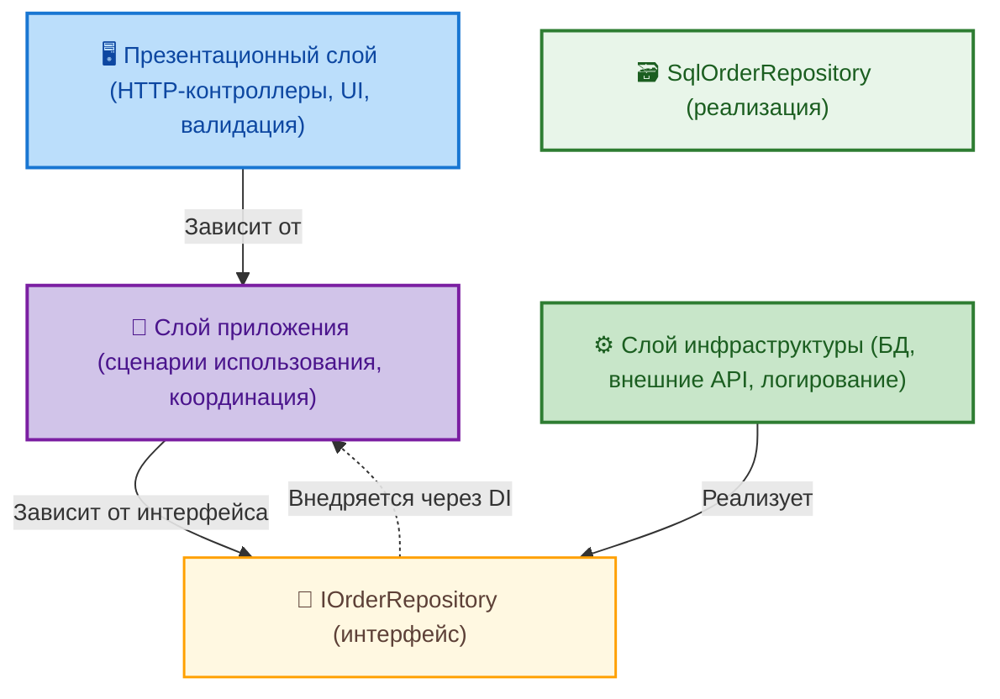
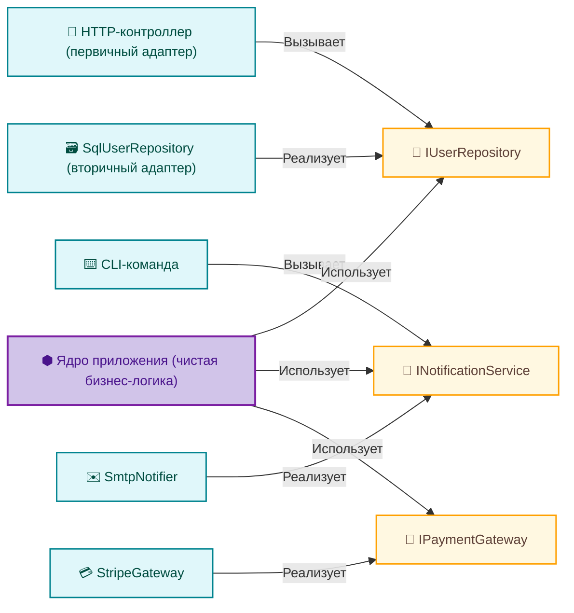
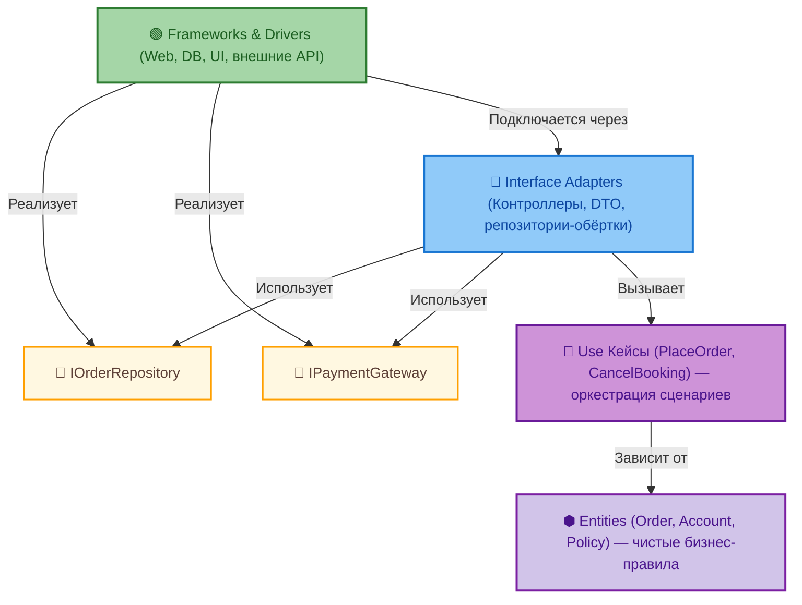
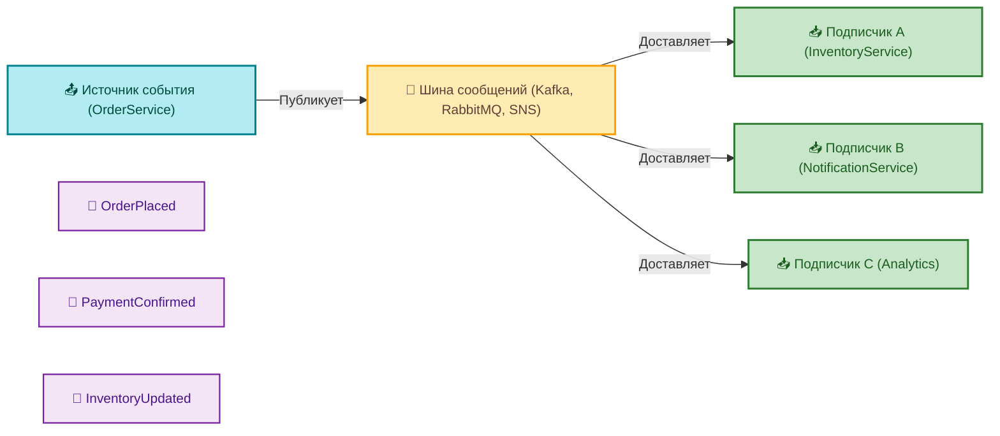
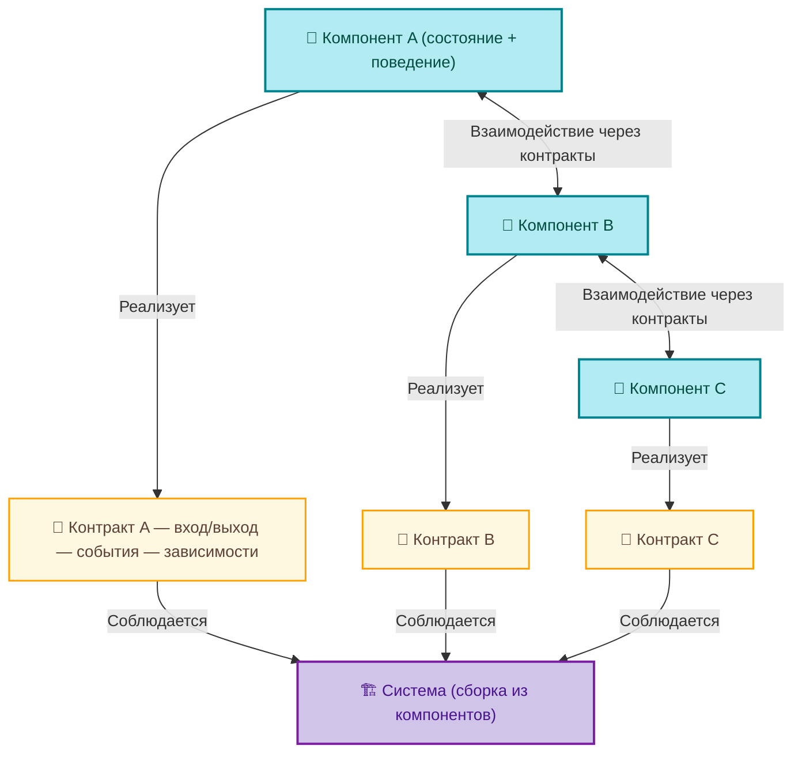

# Стили внутренней организации кода

  ОБЯЗАТЕЛЬНО
  ДЛЯ НОВИЧКОВ

Разработчику
Архитектору
Аналитику

## Стили внутренней организации кода

Выбор архитектурного стиля — это выбор стратегии **направления зависимостей**. В любой системе возникают зависимости: между классами, модулями, слоями, внешними системами. Ключевой вопрос в том, *как сделать зависимости управляемыми*. Хороший стиль минимизирует зависимость стабильных, критичных частей системы (бизнес-логики, доменных правил) от нестабильных (интерфейсов, инфраструктуры, внешних API).

Это достигается через **инверсию зависимостей** — принцип, согласно которому высокоуровневые модули не должны зависеть от низкоуровневых; оба должны зависеть от абстракций. Архитектурные стили — это конкретные реализации этого принципа на уровне приложения.

---

### Слоистая архитектура (Layered Architecture)

Слоистая архитектура — наиболее распространённый и интуитивно понятный стиль. Система разделяется на горизонтальные слои, каждый из которых имеет чёткую зону ответственности, и зависимости допускаются **только в одном направлении** — от верхних слоёв к нижним.

Типичная трёхслойная структура:

- **Презентационный слой (Presentation)** — отвечает за взаимодействие с пользователем или внешней системой: HTTP-контроллеры, GraphQL-ресолверы, UI-компоненты (в случае SSR). Здесь формируются запросы и отдаются ответы. Логика здесь минимальна: преобразование данных, валидация входных параметров, маршрутизация.
  
- **Слой приложения (Application / Business Logic)** — сердце системы. Здесь реализуются сценарии использования: «оформить заказ», «отменить бронирование», «рассчитать налог». Этот слой координирует работу доменных сущностей, транзакций, внешних вызовов. Он не содержит деталей реализации (как именно сохраняются данные, как отправляется email), но знает, *когда* и *в каком порядке* это должно происходить.

- **Слой инфраструктуры (Infrastructure / Persistence)** — техническая поддержка: доступ к базе данных, работа с внешними API, отправка сообщений, логирование, кэширование. Здесь живут репозитории, HTTP-клиенты, ORM-маппинги.

Ключевой приём — **зависимости направлены вниз**, но реализация низкоуровневых компонентов внедряется *вверх* через интерфейсы (Dependency Injection). Например, слой приложения зависит не от конкретного `SqlOrderRepository`, а от интерфейса `IOrderRepository`. Конкретная реализация подаётся из слоя инфраструктуры при старте приложения.

Такая структура обеспечивает:

- чёткое разделение ответственности — легко понять, где искать нужный код;
- возможность тестирования слоя приложения в изоляции (mock-реализации репозиториев);
- заменяемость инфраструктурных компонентов без перекомпиляции ядра.

Однако у слоистой архитектуры есть ограничение: она хорошо масштабируется по функциональности, но плохо — по *доменным контекстам*. Когда система охватывает несколько независимых предметных областей (например, «продажи», «склад», «финансы»), слои начинают «размазываться»: в одном слое приложения смешиваются правила из разных доменов, в слое инфраструктуры — репозитории, не связанные логически. Это приводит к росту связанности и снижению возможности автономной эволюции.

---

### Гексагональная архитектура (Ports & Adapters)

Гексагональная архитектура — ответ на проблему *внешних зависимостей*. Её цель — сделать ядро приложения полностью независимым от того, *откуда приходят данные* и *куда они уходят*. Ядро («гексагон») содержит только бизнес-логику и оперирует через **порты** — интерфейсы, определяющие, *что* может делать система (например, `IUserRepository`, `INotificationService`, `IPaymentGateway`).

Внешние адаптеры — это реализации этих портов:

- **Первичные (driving) адаптеры** — инициируют вызовы *в* ядро: HTTP-контроллеры, CLI-команды, scheduled-задачи. Они преобразуют внешний запрос в вызов порта.
- **Вторичные (driven) адаптеры** — реагируют на вызовы *из* ядра: реализации репозиториев, HTTP-клиенты для внешних систем, отправка email через SMTP.

Суть в том, что ядро **ничего не знает** о вебе, базах данных, протоколах. Оно зависит только от своих портов — абстракций, определённых *внутри* ядра. Адаптеры зависят и от портов, и от внешних технологий. Направление зависимостей — **внутрь гексагона**, а не наружу.

Преимущества:

- возможность легко менять способ взаимодействия: заменить REST на gRPC — достаточно написать новый первичный адаптер;
- тестирование ядра в полной изоляции — все зависимости заменяются на заглушки;
- чёткое выделение контрактов: порт — это публичный API ядра, его стабильность критична.

Гексагональная архитектура особенно эффективна в системах с множеством интеграций, где внешние интерфейсы часто меняются (например, платёжные шлюзы, CRM, ERP), а бизнес-логика остаётся стабильной. Она также хорошо сочетается с DDD: порты часто соответствуют границам агрегатов или ограниченных контекстов.

---

### Чистая архитектура (Clean Architecture)

Чистая архитектура — развитие идей гексагональной, с акцентом на **иерархию стабильности**. Она формализует круги зависимости:

1. **Entities (Сущности)** — ядро ядра. Бизнес-объекты, инкапсулирующие критически важные правила, не зависящие ни от чего внешнего: `Order`, `Account`, `Policy`. Могут быть чистыми классами или даже просто структурами данных с методами. Эти правила должны выживать даже при полной смене технологий.

2. **Use Кейсы (Сценарии использования)** — оркестрация: как сущности взаимодействуют для выполнения бизнес-задачи. Например, `PlaceOrderUseCase` получает данные, создаёт `Order`, проверяет инвентарь, инициирует платёж. Зависит от Entities, но не от внешних технологий.

3. **Interface Adapters (Адаптеры интерфейсов)** — преобразование данных между форматами: контроллеры, презентеры, репозитории-обёртки, DTO-мапперы. Здесь происходит адаптация к конкретному фреймворку (MVC, gRPC), но без логики.

4. **Frameworks & Drivers (Фреймворки и драйверы)** — внешние зависимости: базы данных, веб-серверы, UI-фреймворки, внешние API. Эта зона наиболее нестабильна.

Зависимости направлены **от внешних кругов к внутренним**. Entities ничего не знают о Use Кейсы; Use Кейсы не знают о том, как именно реализованы репозитории. Это достигается через интерфейсы и DI.

Чистая архитектура — **принцип стабильности**: чем ближе к центру, тем дольше живёт код. Сущности могут оставаться неизменными годами; адаптеры — меняться с новой версией фреймворка.

Этот стиль оправдан там, где долгосрочная поддержка важнее скорости первоначальной разработки: госзаказ, медицинские системы, финансовые ядра. Он снижает стоимость владения, но требует дисциплины — легко «протечь» зависимость из внешнего круга во внутренний (например, добавить атрибут `Id` типа `Guid` в доменную сущность только потому, что так требует ORM).

---

### Событийно-ориентированная архитектура (Event-Driven Architecture)

Событийно-ориентированная архитектура — это смещение акцента с *запрос-ответ* на *публикация-подписка*. Вместо того чтобы компоненты вызывали друг друга напрямую, они обмениваются **событиями** — неизменяемыми фактами о том, что произошло: `OrderPlaced`, `PaymentConfirmed`, `InventoryUpdated`.

Ключевые элементы:

- **Источник события** — компонент, фиксирующий факт и публикующий событие в шину (Kafka, RabbitMQ, AWS SNS/SQS);
- **Шина сообщений** — инфраструктурный компонент, обеспечивающий доставку;
- **Подписчики** — компоненты, реагирующие на события и выполняющие свои задачи (обновление склада, отправка уведомления, аналитика).

Событие — не команда. Оно не говорит *«сделай»*, а констатирует *«сделано»*. Это позволяет строить **асинхронные, слабосвязанные системы**.

Преимущества:

- масштабируемость: обработчики событий можно масштабировать независимо;
- отказоустойчивость: если один обработчик упал, событие остаётся в очереди;
- расширяемость: новые функции можно добавлять просто подпиской на существующие события;
- историчность: события можно сохранять как журнал (event log), что даёт полную аудиторскую трассу.

Однако события вносят новую сложность:

- **eventual consistency** — состояние системы может быть временно несогласованным;
- отладка требует инструментов трассировки по цепочке событий;
- дублирование событий или их потеря требуют идемпотентных обработчиков;
- проектирование событий — нетривиальная задача: слишком грубое событие (например, `OrderUpdated`) несёт мало информации; слишком детальное — жёстко связывает издателя и подписчика.

Событийно-ориентированная архитектура особенно эффективна в системах с высокой нагрузкой, где важна асинхронность: электронная коммерция, логистика, финтех, IoT. Часто она используется как *дополнение* к другим: например, в чистой архитектуре сценарий использования после выполнения публикует событие, а инфраструктурный адаптер его отправляет.

---

### Компонентно-ориентированная архитектура (Component-Based Architecture)

Этот стиль чаще применяется на уровне пользовательского интерфейса, но принципы переносятся и на бэкенд. Основная идея — разбиение системы на **повторно используемые, самодостаточные компоненты**, каждый из которых инкапсулирует:

- состояние;
- поведение;
- представление (если применимо);
- интерфейс взаимодействия с другими компонентами.

Компонент — это не просто класс или модуль. Это *контракт*: что он принимает на вход, что выдаёт на выход, какие события генерирует, какие зависимости требует. В вебе это — React-компоненты, Angular-модули, Web Components. В бэкенде — библиотеки с чётким API, микросервисы с открытой спецификацией (OpenAPI), плагины с фиксированным интерфейсом.

Компонентно-ориентированный подход позволяет:

- собирать сложные интерфейсы из простых блоков;
- переиспользовать функционал без дублирования;
- изолировать изменения: если компонент меняет внутреннюю реализацию, но сохраняет контракт — внешний код не требует правок.

Ключевое условие успеха — **строгая дисциплина контрактов**. Компонент без документированного API быстро превращается в «чёрный ящик», зависимость от которого становится техническим долгом.

---