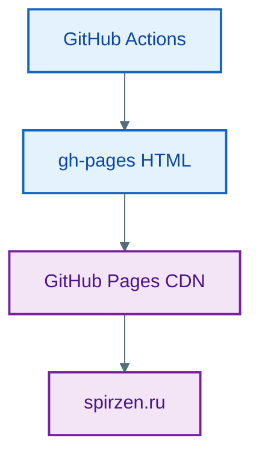

# Влияние инфраструктуры на архитектурные решения

  ОБЯЗАТЕЛЬНО
  ДЛЯ НОВИЧКОВ

Разработчику
Архитектору
Аналитику

---

## Влияние инфраструктуры на архитектурные решения

>**Инфраструктура** — совокупность вычислительных, сетевых и хранилищных ресурсов, обеспечивающих выполнение программного обеспечения, включая физическое или виртуальное оборудование, операционные системы и средства управления.

Инфраструктура — это **множество решений, инкапсулированных в сервисы**, каждое из которых накладывает ограничения и открывает возможности. Архитектор, игнорирующий инфраструктурный контекст, получает решения, которые неизбежно сталкиваются с реальностью при развёртывании.

---

### От статичной среды к управляемым сервисам

Раньше инфраструктура была статичной: арендованный сервер, установленная ОС, настроенная СУБД. Сегодня — динамическая, программно-определяемая, облачная. Ключевое изменение: **от ответственности за "железо" к ответственности за контракты сервисов**.

>**Арендованный сервер** — выделенный или виртуальный вычислительный ресурс, предоставляемый облачным провайдером или хостинг-провайдером на условиях временного использования за плату.

Примеры:

- **Хранение**: выбор между S3 (immutable объекты, eventual consistency), EBS (блочные устройства, strong consistency), RDS (управляемая БД), Aurora (репликация на уровне storage) — определяет, какие паттерны работы с данными допустимы.
- **Сеть**: VPC, security groups, Сеть ACLs, service mesh (Istio) — задают границы зон доверия, стратегии шифрования (in-transit), ограничения на прямые вызовы.
- **Вычисления**: EC2 (полный контроль), ECS/EKS (оркестрация контейнеров), Lambda (serverless) — влияют на модель жизненного цикла, управление состоянием, холодные старты.
- **Observability**: CloudWatch, Prometheus+Grafana, OpenTelemetry — определяют, какие метрики, логи, трассировки доступны "из коробки", и как легко строить диагностические сценарии.

>**immutable объекты** — объекты, состояние которых не изменяется после создания; любая модификация приводит к созданию нового объекта с обновлённым значением.

>**eventual consistency** — модель согласованности данных, при которой система гарантирует, что все реплики данных станут одинаковыми через конечное время после прекращения обновлений.

>**EBS** — Elastic Block Store, сервис блочного хранилища Amazon Web Services, предоставляющий постоянные тома для использования с экземплярами EC2.

>**Блочные устройства** — устройства хранения данных, оперирующие фиксированными по размеру блоками, позволяющие произвольный доступ к содержимому и используемые как основа для файловых систем.

>**strong consistency** — модель согласованности, при которой любой запрос на чтение немедленно возвращает результат последней успешной операции записи.

>**RDS (управляемая БД)** — Relational Database Service, полностью управляемый сервис реляционных баз данных от AWS, автоматизирующий задачи резервного копирования, масштабирования, патчинга и мониторинга.

>**Aurora (репликация на уровне storage)** — облачная реляционная база данных от AWS, реализующая репликацию данных на уровне хранилища между несколькими зонами доступности для повышения отказоустойчивости и производительности.

>**VPC** — Virtual Private Cloud, изолированная виртуальная сеть в облаке, в пределах которой размещаются ресурсы с контролируемой маршрутизацией, подсетями и политиками безопасности.

>**security groups** — правила сетевой фильтрации на уровне экземпляра, определяющие разрешённые входящие и исходящие соединения для ресурсов в VPC.

>**Сеть ACLs** — списки контроля доступа на уровне подсети, задающие разрешающие или запрещающие правила для входящего и исходящего трафика с учётом порядка применения.

>**Service mesh (Istio)** — инфраструктурный слой, реализованный с помощью Istio, обеспечивающий безопасное, наблюдаемое и управляемое взаимодействие между микросервисами без изменения их кода.

>**Зона доверия** — сегмент сети или архитектурная область, в пределах которой компоненты считаются взаимно доверенными и подчиняются единым правилам безопасности.

>**Стратегии шифрования (in-transit)** — подходы к защите данных при передаче по сети, включающие использование TLS, mTLS или других протоколов, обеспечивающих конфиденциальность и целостность.

>**Ограничения на прямые вызовы** — архитектурные правила, запрещающие или регулирующие непосредственное обращение одного компонента к другому вне установленных каналов взаимодействия.

>**EC2 (полный контроль)** — Elastic Compute Cloud, сервис виртуальных машин AWS, предоставляющий полный контроль над операционной системой, сетевой конфигурацией и установленным программным обеспечением.

>**ECS/EKS (оркестрация контейнеров)** — Amazon Elastic Container Service и Elastic Kubernetes Service — управляемые платформы для запуска, масштабирования и координации контейнеризированных приложений.

>**Lambda (serverless)** — вычислительный сервис AWS, выполняющий код в ответ на события без необходимости управления серверами, с автоматическим масштабированием и оплатой только за фактическое время выполнения.

Архитектурное решение "использовать event-driven подход" бессмысленно, если инфраструктура не предоставляет надёжных очередей (Kafka, SQS, Pub/Sub) с гарантиями доставки. Решение "делать микросервисы" рискованно без service discovery и circuit breaker’ов на уровне инфраструктуры.

>**Event-driven** — архитектурный стиль, при котором компоненты взаимодействуют через асинхронную передачу событий, реагируя на изменения состояния в системе.

>**Очереди** — структуры данных или сервисы, обеспечивающие временное хранение сообщений с последовательной доставкой потребителям, поддерживающие асинхронную обработку и буферизацию нагрузки.

>**Service discovery** — механизм автоматического определения сетевого адреса и состояния доступности сервиса в динамической среде.

>**Circuit breaker** — паттерн устойчивости, который временно прекращает вызовы к недоступному сервису после серии сбоев, предотвращая каскадные отказы и позволяя системе восстановиться.

>**Kafka** — распределённая платформа потоковой обработки событий, обеспечивающая высокую пропускную способность, долговременное хранение и повторное потребление сообщений.

>**SQS** — Simple Queue Service, управляемый сервис очередей сообщений от AWS, обеспечивающий надёжную асинхронную передачу данных между компонентами.

>**Pub/Sub** — модель обмена сообщениями, при которой отправители (publishers) публикуют события в темы, а получатели (subscribers) подписываются на интересующие их темы для получения уведомлений.

Все перечисленные механизмы (очереди, pub/sub, service discovery, circuit breaker, autoscaling) собраны в одной таблице с маршрутом по главам — [12 концепций распределённой архитектуры](./141.md).

---

### Зоны и среды

Развёртывание — это **часть архитектуры**, влияющая на безопасность, отказоустойчивость, стоимость.

### Живой пример — статический хостинг вместо кластера

Для [«Вселенной IT»](/about/project#arhitektura-proekta) достаточно **GitHub Pages + CDN**: нет EC2, Kubernetes и управляемой БД продукта. Те же идеи из статьи (среда, артефакт сборки, домен) применимы в упрощённом виде:

| Идея из облачной инфраструктуры | Реализация у энциклопедии |
| :--- | :--- |
| Среда публикации | Ветка `gh-pages`, CNAME spirzen.ru |
| Артефакт | Каталог `build/` после `docusaurus build` |
| CI | `.github/workflows/deploy.yml` на push в `main` |
| Масштабирование | Раздача статики CDN GitHub Pages |

---

#### Зоны доступности (Availability Zones)

>**Зоны доступности** — физически отдельные дата-центры внутри одного региона AWS, соединённые низколатентной сетью и предназначенные для повышения отказоустойчивости.

Развёртывание в нескольких AZ — требование для высокой доступности. Но это требует:

- stateless-приложений (состояние — в БД или кэше с репликацией);
- распределённых БД с синхронной репликацией между AZ;
- балансировщика, поддерживающего failover между зонами.

Если архитектура предполагает shared-состояние в памяти (например, in-memory кэш без инвалидации), то многозоновое развёртывание невозможно без переработки.

---

#### Окружения (Environments)

Разделение на `dev`, `test`, `staging`, `prod` — стандарт. Но архитектурно важно:

- **Изоляция данных**: одни и те же учётные записи не должны работать в `staging` и `prod`; тестовые данные — не попадать в продакшен.
- **Конфигурация как код**: различия между окружениями — только через параметры (например, через ConfigMaps в Kubernetes), а не через разный код.
- **Синхронизация схемы БД**: миграции должны быть идемпотентными и применяться в определённом порядке — иначе staging не отражает состояние prod.

Нарушение этих принципов приводит к "работает у меня, не работает на проде" — как к системному риску.

---

#### Multi-region и geo-replication

>**Регион** — географически обособленная зона инфраструктуры облачного провайдера, содержащая вычислительные, сетевые и хранилищные ресурсы.

>**Multi-region** — архитектурная стратегия размещения компонентов в нескольких географических регионах для повышения доступности и снижения задержек.

>**geo-replication** — автоматическое копирование данных между регионами для обеспечения отказоустойчивости и локального доступа.

Для глобальных систем выбор региона — архитектурное решение:

- **Latency-based routing** (CloudFront, Route53) требует stateless-фронтенда;
- **Active-active репликация БД** — сложна из-за конфликтов (например, два пользователя одновременно редактируют профиль);
- **Active-passive** — проще, но требует механизма failover и проверки целостности при переключении.

Здесь архитектура должна учитывать технические ограничения и **правовые** (GDPR, ФЗ-152): данные граждан РФ должны храниться в РФ — это граница архитектурной модели.

---

### Инфраструктурные компромиссы

Многие инфраструктурные сервисы маскируют сложность за простым API. Но "простота" имеет цену — в виде ограничений.

---

#### Пример 1. Serverless (AWS Lambda)

>**AWS Lambda** — реализация serverless-вычислений в экосистеме Amazon Web Services, позволяющая запускать функции в ответ на триггеры без управления инфраструктурой.

Преимущества: масштабирование "до нуля", оплата за использование, отсутствие управления серверами.

Ограничения:

- **Время выполнения** (макс. 15 мин) — исключает длительные batch-процессы;
- **Холодный старт** — неприемлем для low-latency API;
- **Ограниченный доступ к сети** — нет постоянных TCP-соединений;
- **Состояние** — только через внешние хранилища (DynamoDB, S3), что увеличивает latency и стоимость.

>**Батч-процесс** (от англ. batch processing — пакетная обработка) — это метод выполнения задач, при котором данные или операции объединяются в группы (пакеты или "батчи") и обрабатываются как единое целое, а не по одной записи, что повышает эффективность, снижает нагрузку и экономит ресурсы, особенно при больших объемах данных, например, в базах данных, машинном обучении или производственных системах. Это противоположность обработке в реальном времени (real-time). 

Архитектура под Lambda требует:

- коротких, идемпотентных функций;
- асинхронной обработки через очереди;
- кэширования на уровне API Gateway или CloudFront.

Попытка запустить монолитное приложение через Lambda — путь к разочарованию.

---

#### Пример 2. Managed-БД (RDS, Cloud SQL)

>**managed-БД** — база данных, обслуживание которой полностью или частично осуществляется облачным провайдером, включая резервное копирование, масштабирование и обновления.

Преимущества: автоматические бэкапы, патчинг, мониторинг.

Ограничения:

- **Отсутствие доступа к ОС** — нельзя настроить `pg_stat_statements` вручную или оптимизировать ядро;
- **Ограниченная кастомизация** — нельзя поставить свой плагин или изменить параметры, недоступные через консоль;
- **Vendor lock-in** — экспорт данных может быть медленным и дорогим.

>**Vendor lock-in** — зависимость архитектуры от специфических технологий, API или сервисов одного поставщика, затрудняющая перенос в другую среду.

Если приложению критична низкоуровневая оптимизация (например, геопространственные запросы в PostGIS), managed-БД может стать бутылочным горлышком.

---

#### Пример 3. Service Mesh (Istio, Linkerd)

Преимущества: централизованное управление трафиком, mTLS "из коробки", retry/circuit breaker без кода.

>**mTLS** — механизм взаимной аутентификации участников сетевого взаимодействия с использованием цифровых сертификатов, обеспечивающий шифрование и проверку подлинности на обоих концах соединения.

>**retry/circuit breaker** — паттерны устойчивости: retry автоматически повторяет неудачные запросы, circuit breaker временно блокирует вызовы к недоступному сервису для предотвращения каскадных сбоев.

Сложности:

- **Дополнительная задержка** (1–3 мс на вызов через sidecar);
- **Сложность отладки** — трафик "исчезает" в прокси;
- **Требования к ресурсам** — sidecar потребляет CPU и память.

Service mesh оправдан при десятках сервисов, но избыточен для трёх.

>**Service mesh** — инфраструктурный слой, управляющий сетевым взаимодействием между сервисами, обеспечивая маршрутизацию, безопасность, наблюдаемость и политики отказоустойчивости.

---

### Проектирование "инфраструктуро-осознанно"

Это означает:

1. **На раннем этапе определить инфраструктурные ограничения заказчика**:  
   — Облако или on-premise?  
   — Какие сервисы разрешены?  
   — Есть ли политики безопасности (шифрование, аудит, изоляция)?  
   Без этого проектирование идёт вслепую.

2. **Включать инфраструктурщиков в архитектурные обсуждения** — на этапе "как устроить". Например, решение использовать gRPC влияет на выбор балансировщика (не все поддерживают HTTP/2).

3. **Моделировать failure modes инфраструктуры**:  
   — Что будет, если сеть между AZ порвётся?  
   — Что, если очередь переполнится?  
   — Что, если диск заполнится на 100%?  
   Архитектура должна предусматривать graceful degradation.

4. **Документировать инфраструктурные зависимости** в ADR:  
   > *Решение: использовать DynamoDB вместо PostgreSQL.  
   > Контекст: требование 10K RPS на запись, eventual consistency допустима.  
   > Последствия: отказ от сложных JOIN’ов, необходимость denormalization, обучение команды новой модели данных.*
   
>**DynamoDB** — полностью управляемая NoSQL-база данных от Amazon Web Services, ориентированная на высокую производительность, горизонтальное масштабирование и предсказуемую задержку.

5. **Использовать Infrastructure as Code (IaC)** как **спецификацию архитектуры**: Terraform-файлы — это формальное описание связей между компонентами ("этот сервис зависит от этой очереди и этого кластера БД").

>**Infrastructure as Code (IaC)** — практика описания и управления инфраструктурой с помощью машинно-читаемых файлов конфигурации, позволяющая автоматизировать развёртывание и обеспечивать воспроизводимость.

---

### Мини-чеклист перед архитектурным решением

Перед выбором стиля или технологии полезно прогнать короткие вопросы:

- Какой предел по задержке и доступности у ключевых сценариев?
- Какие ограничения по безопасности и регуляторике обязательны?
- Что будет при отказе сети, БД, очереди, DNS и секрет-хранилища?
- Сможет ли команда сопровождать выбранный стек 24/7?
- Есть ли план миграции или отката, если решение не сработает?

Если ответы размыты, лучше сначала сделать технический spike и зафиксировать ADR, чем сразу масштабировать архитектурное решение.

---

### Типовые антипримеры

- Выбор serverless без проверки ограничений по cold start и времени выполнения.
- Переход на multi-region без стратегии разрешения конфликтов данных.
- Service mesh "на вырост" для нескольких сервисов при отсутствии базовой observability.
- Управляемая БД при требованиях к глубокой низкоуровневой настройке, которую провайдер не даёт.

---

### Инфраструктурные кейсы "до/после"

**Кейс 1: serverless "в лоб"**

- До: длительные batch-задачи перенесли в Lambda без переработки.
- Проблема: ограничения по времени выполнения и нестабильное поведение при пиках.
- После: длительные операции вынесены в контейнерные воркеры, Lambda оставлена для коротких реактивных задач.
- Эффект: предсказуемое время обработки и меньше аварийных перезапусков.

**Кейс 2: multi-region без модели данных**

- До: включили geo-replication, не продумав конфликтные записи.
- Проблема: расхождения профилей и спорные состояния заказов.
- После: определили master-правила по сущностям и стратегию разрешения конфликтов.
- Эффект: устойчивое восстановление консистентности после сбоев связи.

**Кейс 3: observability как обязательная часть архитектуры**

- До: переход к микросервисам без трассировки, инциденты расследуются "наугад".
- После: централизованные логи, метрики и distributed tracing введены до массовой декомпозиции.
- Эффект: существенно быстрее root-cause анализ и ниже MTTR.

---

### См. также

- [Основы проектирования и архитектуры программного обеспечения](./1.md)
- [Архитектурные стили и их применение](./101.md)
- [Стратегии декомпозиции монолитных систем](./104.md)
