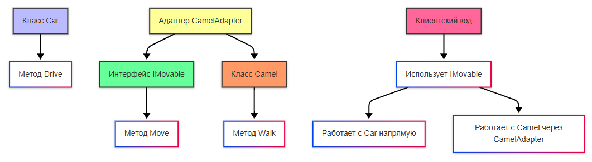
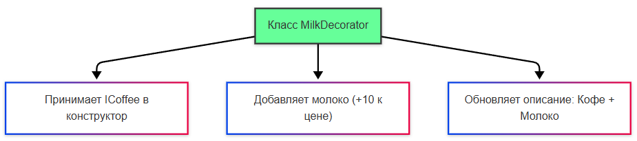
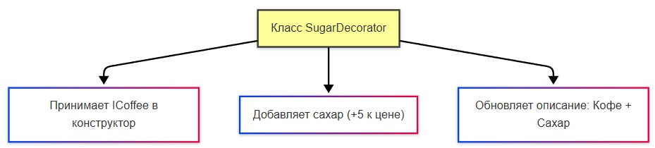

---
title: Паттерны проектирования
tags: [beginner, advanced, notrequired, analytic, developer, architector]
---

# Паттерны проектирования

<div class="article-tags">
  <span class="tag tag-inprogress">В РАЗРАБОТКЕ</span>
  <span class="tag tag-advanced">НЕ ДЛЯ НОВИЧКОВ</span>
  <span class="tag tag-notrequired">НЕ ОБЯЗАТЕЛЬНО</span>
</div>
<span class="complexity-badge">Разработчику</span>
<span class="complexity-badge">Архитектору</span>
<span class="complexity-badge">Аналитику</span>

## Паттерны проектирования

### Паттерны

В практике разработки программного обеспечения естественным образом возникают типовые задачи: как управлять жизненным циклом объекта? Как обеспечить расширяемость без переписывания кода? Как организовать взаимодействие компонентов так, чтобы изменения в одном месте не приводили к каскаду правок по всей системе? Ответы на подобные вопросы не изобретаются каждый раз заново — они уже были сформулированы, протестированы, адаптированы и обобщены. Эти обобщённые решения и называются **паттернами проектирования**.

Паттерны — это **шаблоны мышления**, **архитектурные приёмы**, **организационные схемы**, позволяющие решать повторяющиеся проблемы в контексте объектно-ориентированного программирования (и не только). Паттерн фиксирует опыт: как, когда и почему следует применить определённую структуру классов или механизм взаимодействия. Он предлагает *каркас*, в который можно уложить конкретную предметную область.

Термин *паттерн* (от англ. *pattern* — образец, шаблон) был заимствован из архитектуры. В 1970-х годах Кристофер Александр ввёл его в книге *«A Pattern Language»*, описав повторяющиеся структурные решения в проектировании городов и зданий: «оконные ниши», «частные сады», «места встреч». Он показал, что эффективные решения возникают как ответ на устойчивые социальные и физические потребности. В программировании эта идея получила развитие в 1994 году, когда вышла книга *«Проектирование Patterns: Elements of Reusable Object-Oriented Software»*, написанная Эрихом Гаммой, Ричардом Хелмом, Ральфом Джонсоном и Джоном Влиссидесом — так называемой «Бандой четырёх» (*Gang of Four*, GoF). Эта работа заложила основу современного понимания паттернов и описала 23 классических шаблона, ставших базой для дальнейшего развития методологий ООП.

Важно не путать **паттерны** с **принципами** и **методологиями**. Это разные уровни абстракции, действующие на разных этапах проектирования.

---

### Паттерны, принципы и методологии

**Принципы** проектирования — это общие рекомендации высокого уровня, задающие ориентиры для архитектурных решений. Примеры:  
- **SOLID** — пять принципов, направленных на повышение гибкости и сопровождаемости кода (например, *Принцип единственной ответственности* или *Принцип инверсии зависимостей*);  
- **DRY** (*Don’t Repeat Yourself*) — избегать дублирования логики;  
- **KISS** (*Keep It Simple, Stupid*) — стремиться к простоте реализации.  

Принципы не говорят *как именно* организовать классы. Они говорят *как думать*: не смешивай зоны ответственности, не дублируй код, делай решения максимально простыми до тех пор, пока это не мешает корректности.

**Паттерны проектирования** — это уже конкретные *реализации* указанных принципов на уровне классов, объектов и их взаимодействий. Паттерн отвечает на вопрос: «А *как* реализовать инверсию зависимостей в этой конкретной ситуации?». Например, паттерн *Стратегия* позволяет легко заменять алгоритмы благодаря зависимости от интерфейса, а не от конкретной реализации — тем самым воплощая *Принцип инверсии зависимостей* в жизнь.

**Методологии** — это системные подходы к построению систем в целом, охватывающие код, процессы, командную работу, тестирование. К ним относятся:  
- **DDD** (*Domain-Driven Проектирование*) — проектирование, центрированное вокруг предметной области; здесь возникают *паттерны моделирования* (например, *Aggregate Root*, *Value Object*), которые не входят в классический список GoF, но являются неотъемлемой частью современных архитектур;  
- **TDD** (*Test-Driven Разработка*) — подход, при котором тесты пишутся до реализации; он использует паттерны (например, *Шаблонный метод* для организации тестовых сценариев), но сам по себе не является паттерном;  
- **BDD** (*Behavior-Driven Разработка*) — развитие TDD, ориентированное на читаемые сценарии на естественном языке.

Таким образом, можно выстроить иерархию:
- **Методологии** определяют *мировоззрение* и *процессы*;
- **Принципы** задают *направление* архитектурных решений;
- **Паттерны** предоставляют *конкретные инструменты* для реализации этих решений.

Эта иерархия не иерархия «важности» — она иерархия *масштаба*. Ошибка проектирования на уровне методологии (например, попытка применить DDD к простому CRUD-приложению) повлечёт за собой каскад неправильных решений на уровне принципов и паттернов.

---

### Классификация паттернов

В классической книге GoF все паттерны разделены на три группы по тому, *на каком уровне проектирования* они работают:

1. **Порождающие паттерны** (Creational) — решают задачи *инициализации* и *создания* объектов, скрывая логику создания и делая её гибкой. Их цель — повысить независимость системы от конкретных классов, упростить добавление новых типов, контролировать количество экземпляров.

2. **Структурные паттерны** (Structural) — отвечают за *компоновку* классов и объектов, создавая более сложные структуры из простых. Они помогают составлять системы из совместимых частей, скрывать сложность за простыми интерфейсами, расширять функционал без наследования.

3. **Поведенческие паттерны** (Behavioral) — управляют *взаимодействием* объектов, распределяя обязанности и организуя потоки управления. Они делают коммуникацию между компонентами гибкой, отвязанной от конкретных реализаций и легко изменяемой.

Эта классификация удобна, но не исчерпывающа. Современные практики добавляют дополнительные уровни:  
- **Архитектурные паттерны** (например, MVC, MVVM, Clean Architecture) — работают на уровне приложения, определяя распределение ответственности между слоями (представление, бизнес-логика, доступ к данным);  
- **Паттерны интеграции** (например, API Gateway, Message Broker, Event Sourcing) — фокусируются на взаимодействии между системами;  
- **Паттерны доменного моделирования** (например, Repository, Specification, Aggregate) — специфичны для DDD и описывают абстракции предметной области.

Важно понимать: паттерны — не догма. Их ценность в том, чтобы *понимать* — почему и когда тот или иной подход работает, какие компромиссы он влечёт, и как он соотносится с другими решениями. Например, *Синглтон* упрощает доступ к глобальному ресурсу, но усложняет тестирование и может стать скрытой точкой зависимости. *Стратегия* обеспечивает гибкость замены алгоритмов, но требует дополнительной инфраструктуры в виде интерфейсов и контекста. Знание паттерна — это знание *стоимости решения*.

---

### GRASP

Прежде чем подробно рассматривать паттерны GoF, стоит остановиться на более фундаментальном уровне — на **GRASP** (*General Responsibility Assignment Software Patterns*). Этот набор из девяти рекомендаций, предложенный Крейгом Ларманом, описывает *как распределять ответственность между объектами* в объектно-ориентированной системе. GRASP — «паттерны мышления», принципы назначения обязанностей.

1. **Information Expert** (*Эксперт по информации*) — класс должен брать ответственность за операцию, если он содержит всю необходимую информацию для её выполнения. Это основа инкапсуляции: данные и поведение хранятся вместе.

2. **Creator** (*Создатель*) — класс A должен создавать объекты класса B, если выполняется хотя бы одно из условий:  
   - A *содержит* или агрегирует объекты B;  
   - A *записывает* B в своё поле;  
   - A *часто использует* B;  
   - A *имеет данные*, необходимые для инициализации B.

3. **Controller** (*Контроллер*) — первоначальные системные события (например, нажатие кнопки) должны обрабатываться специализированным объектом-контроллером, который координирует вызовы.

4. **Low Coupling** (*Низкая связанность*) — стремитесь к тому, чтобы компоненты знали друг о друге как можно меньше. Это повышает модульность, упрощает тестирование и замену.

5. **High Cohesion** (*Высокая связанность внутри объекта*) — методы и данные в рамках одного класса должны быть тесно связаны по смыслу. Класс должен отвечать за одну чётко определённую задачу.

6. **Polymorphism** (*Полиморфизм*) — поведение объекта должно определяться его типом, а не условиями вроде `if (type == "Dog")`. Это достигается через интерфейсы и наследование.

7. **Protected Variations** (*Защита от изменений*) — если ожидается изменение какого-то аспекта системы (например, алгоритм оплаты), выносите его за абстракцию (интерфейс), чтобы клиентский код не зависел от деталей реализации.

8. **Indirection** (*Косвенная связь*) — вводите промежуточный объект для снижения связанности двух других. Это — суть многих структурных паттернов (*Фасад*, *Мост*, *Посредник*).

9. **Pure Fabrication** (*Чисто вымышленный класс*) — если ни один из существующих классов предметной области не может взять на себя ответственность, создайте служебный класс, существующий только для обеспечения принципов Low Coupling и High Cohesion (например, *Repository*, *Service*).

GRASP и GoF взаимодополняют друг друга: GRASP помогает *назначить* обязанности, GoF показывает, *как структурировать* код для их реализации. Например, *Стратегия* — это конкретное воплощение *Polymorphism* и *Protected Variations*. *Наблюдатель* реализует *Indirection* и *Low Coupling* при организации событий.

Теперь перейдём к детальному рассмотрению паттернов по категориям.

---

## Порождающие паттерны

Создание объектов кажется простой операцией — вызвал `new`, получил экземпляр. Однако в реальных системах вопросы *когда*, *кем* и *как* создаётся объект становятся критически важными. Жёсткая привязка к конкретным конструкторам усложняет тестирование, ограничивает расширяемость и нарушает инкапсуляцию. Порождающие паттерны решают эти проблемы, перенося логику создания за пределы клиентского кода.

---

### Синглтон (Singleton)

**Проблема**, которую решает паттерн:  
Как гарантировать, что в системе существует ровно *один* экземпляр класса, и обеспечить глобальную точку доступа к нему? Эта задача возникает при работе с ресурсами, которые естественно единичны: подключение к базе данных (пул соединений), системные настройки, логгер, реестр объектов.

**Суть решения**:  
Скрыть конструктор класса, хранить единственный экземпляр внутри статического поля, предоставлять к нему доступ через статический метод. Это предотвращает создание дополнительных экземпляров и централизует управление.

**Структура реализации**:  
- Приватный конструктор, недоступный извне;  
- Приватное статическое поле для хранения единственного экземпляра;  
- Публичный статический метод `GetInstance()`, который проверяет, создан ли экземпляр, и при необходимости создаёт его (ленивая инициализация).


На схеме `Logger` реализует паттерн *Синглтон*. Клиентский код не может вызвать `new Logger()`, так как конструктор закрыт. Единственный способ получения экземпляра — `Logger.GetInstance()`. При первом вызове создаётся объект, при последующих — возвращается уже существующий.

**Особенности и предостережения**:  
- В многопоточной среде требует синхронизации при инициализации (например, `Double-Checked Locking` или `Lazy<T>` в .NET).  
- Нарушает *Принцип инверсии зависимостей*: клиенты зависят от конкретного класса, а не от абстракции. Внедрение зависимостей (*DI*) часто является более гибкой альтернативой.  
- Затрудняет модульное тестирование: глобальное состояние влияет на изоляцию тестов.  
- Является *антипаттерном*, если используется как «глобальная переменная в виде объекта» без веских оснований.

---

### Фабрика (Factory) и Фабричный метод (Factory Method)

**Проблема**, которую решают паттерны:  
Как создавать объекты, не привязываясь к их конкретным классам? Это необходимо, когда тип объекта известен только во время выполнения или должен определяться настраиваемой логикой.

**Суть решения**:  
Перенести логику создания объекта в отдельный метод или класс, скрыв детали инициализации за интерфейсом. Клиент работает с абстракцией, а не с реализацией.

**Пример**:  
Интерфейс `IAnimal`, реализации `Cat` и `Dog`. Фабрика `AnimalFactory` содержит метод `Create(string type)`, который возвращает `IAnimal`, но внутри решает, создавать `Cat` или `Dog`. Клиент вызывает `factory.Create("Cat")`, ничего не зная о классе `Cat`.

**Фабрика как инструмент инкапсуляции доменных объектов**  
Рассмотрим пример с доменным объектом `UserConnection` — логической сущностью, описывающей подключение пользователя (например, в чате или онлайн-игре). Это часть предметной области: содержит `Id`, `Username`, `ConnectionId`.

```csharp
public class UserConnection
{
    public Guid Id { get; }
    public string Username { get; }
    public string ConnectionId { get; }

    public UserConnection(Guid id, string username, string connectionId)
    {
        Id = id;
        Username = username ?? throw new ArgumentNullException(nameof(username));
        ConnectionId = connectionId ?? throw new ArgumentNullException(nameof(connectionId));
    }
}
```

Конструктор инициализирует поля, обеспечивая *инварианты* — например, `Username` не может быть `null`. Однако при извлечении данных из базы или внешнего источника ORM (например, Entity Framework Core) по умолчанию вызывает конструктор напрямую. Это работает, но не предоставляет возможности добавить логику валидации, преобразования или логирования при создании.

**Решение**: ввести интерфейс фабрики — `IUserConnectionFactory`.

```csharp
public interface IUserConnectionFactory
{
    UserConnection Create(Guid id, string username, string connectionId);
}

public class UserConnectionFactory : IUserConnectionFactory
{
    public UserConnection Create(Guid id, string username, string connectionId)
    {
        return new UserConnection(id, username, connectionId);
    }
}
```

Теперь ORM не создаёт объекты напрямую. Вместо этого используется проекция через LINQ:

```csharp
var userConnections = dbContext.Connections
    .Where(c => c.IsActive)
    .Select(c => factory.Create(c.Id, c.Username, c.ConnectionId))
    .ToList();
```

Это даёт преимущества:  
- Централизованная точка создания — можно добавить проверки, преобразования, кэширование;  
- Поддержка *Pure Fabrication*: фабрика — чисто служебный класс, не входящий в предметную область, но повышающий гибкость;  
- Упрощение тестирования: фабрику можно заменить моком.

Аналогичные подходы применяются во всех ООП-языках:

**Python**:
```python
class UserConnectionFactory:
    @staticmethod
    def create(user_id, username):
        return UserConnection(user_id, username)
```

**Java**:
```java
public interface UserConnectionFactory {
    UserConnection create(String id, String username);
}
```

**TypeScript**:
```typescript
class UserConnectionFactory {
    static create(id: string, username: string): UserConnection {
        return new UserConnection(id, username);
    }
}
```

Фабрика — не всегда отдельный класс. Иногда достаточно статического метода в самом классе (*Статическая фабрика*), например `UserConnection.New(...)`.

---

### Другие порождающие паттерны (кратко)

- **Абстрактная фабрика** (*Abstract Factory*) — «фабрика фабрик». Создаёт *семейства* связанных объектов (например, «тема интерфейса»: кнопка, поле ввода, меню — все в едином стиле Windows или macOS). Гарантирует совместимость компонентов между собой.

- **Строитель** (*Builder*) — пошаговое создание сложных объектов, когда конструктор с десятком параметров непрактичен. Позволяет отделить конструирование от представления (например, `ReportBuilder` может создавать отчёт в PDF, HTML или Excel, используя один и тот же процесс построения).

- **Прототип** (*Prototype*) — клонирование существующего объекта вместо его создания с нуля. Эффективно, когда инициализация дорогостояща (например, загрузка данных из БД), но копирование быстрее. Требует реализации механизма клонирования (глубокого или поверхностного).

- **Пул объектов** (*Object Pool*) — управление фиксированным набором дорого создаваемых объектов (например, соединения с БД). Вместо создания и уничтожения объекты берутся из пула и возвращаются в него. Экономит ресурсы и снижает задержки.

---

## Структурные паттерны

Структурные паттерны решают задачу *организации компонентов системы* — классов, объектов, модулей — в устойчивые, гибкие и расширяемые структуры. Их цель — *компоновать*, *адаптировать*, *расширять* и *упрощать* взаимодействие существующих элементов. Они отвечают на вопросы: как сделать несовместимые интерфейсы совместимыми? Как добавить функционал, не нарушая инкапсуляции? Как скрыть сложность за простым фасадом?

---

### Адаптер (Adapter)

**Проблема**:  
Существующий класс (например, сторонняя библиотека, legacy-код) предоставляет нужную функциональность, но его интерфейс не соответствует требованиям новой системы. Прямая интеграция приведёт к жёсткой связке, дублированию логики или невозможности использовать полиморфизм.

**Суть решения**:  
Создать промежуточный класс — *адаптер*, — который реализует *целевой интерфейс* и внутри себя делегирует вызовы *адаптируемому классу*. Таким образом, клиентский код работает только с абстракцией и не знает о различиях в реализации.

**Классический пример**: интеграция «машинного» и «камелоподобного» поведения.  
Пусть у нас есть:
- `Car` с методом `Drive()` — он уже реализует интерфейс `IMovable` (метод `Move()`);  
- `Camel` с методом `Walk()` — он *не* реализует `IMovable`.

Чтобы использовать верблюда там, где ожидается `IMovable`, создаётся `CamelAdapter`:

```csharp
public interface IMovable
{
    void Move();
}

public class Car : IMovable
{
    public void Move() => Drive();
    private void Drive() => Console.WriteLine("Car is driving.");
}

public class Camel
{
    public void Walk() => Console.WriteLine("Camel is walking.");
}

public class CamelAdapter : IMovable
{
    private readonly Camel _camel;

    public CamelAdapter(Camel camel) => _camel = camel;

    public void Move() => _camel.Walk();
}
```

Клиентский код:
```csharp
var car = new Car();
var camel = new CamelAdapter(new Camel());

car.Move();    // Car is driving.
camel.Move();  // Camel is walking.
```



На схеме `CamelAdapter` выступает как «переводчик» между интерфейсом `IMovable` и классом `Camel`. Клиент взаимодействует только с `IMovable`, нейтрально к тому, что внутри — машина или верблюд.

**Виды адаптеров**:  
- *Классовый адаптер* — наследование от адаптируемого класса и реализация целевого интерфейса (редко используется из-за ограничений на множественное наследование);  
- *Объектный адаптер* — композиция (как в примере выше) — предпочтительный и более гибкий подход.

**Практическое применение**:  
- Интеграция старых API (например, SOAP-сервиса) в современную систему, ожидающую REST-подобный интерфейс;  
- Совместимость версий (v1 → v2);  
- Тестирование: адаптер к реальному внешнему сервису заменяется моком без изменения клиентского кода.

---

### Декоратор (Decorator)

**Проблема**:  
Как динамически, во время выполнения, добавить объекту новые обязанности без изменения его класса и без наследования (которое приводит к взрыву количества подклассов)?

**Суть решения**:  
Обернуть исходный объект в *декоратор* — класс, реализующий тот же интерфейс, что и оборачиваемый, и содержащий ссылку на него. Декоратор может добавлять поведение *до*, *после* или *вместо* вызова метода целевого объекта.

**Пример: кофе с добавками**  
Базовый напиток — `SimpleCoffee`. Добавки — молоко, сахар — не меняют суть напитка, а лишь *декорируют* его.

```csharp
public interface ICoffee
{
    decimal GetCost();
    string GetDescription();
}

public class SimpleCoffee : ICoffee
{
    public decimal GetCost() => 50;
    public string GetDescription() => "Кофе";
}

public abstract class CoffeeDecorator : ICoffee
{
    protected readonly ICoffee _coffee;
    public CoffeeDecorator(ICoffee coffee) => _coffee = coffee;

    public virtual decimal GetCost() => _coffee.GetCost();
    public virtual string GetDescription() => _coffee.GetDescription();
}

public class MilkDecorator : CoffeeDecorator
{
    public MilkDecorator(ICoffee coffee) : base(coffee) { }

    public override decimal GetCost() => base.GetCost() + 10;
    public override string GetDescription() => base.GetDescription() + ", с молоком";
}

public class SugarDecorator : CoffeeDecorator
{
    public SugarDecorator(ICoffee coffee) : base(coffee) { }

    public override decimal GetCost() => base.GetCost() + 5;
    public override string GetDescription() => base.GetDescription() + ", с сахаром";
}
```

Использование:
```csharp
var coffee = new SimpleCoffee();
var coffeeWithMilk = new MilkDecorator(coffee);
var coffeeWithMilkAndSugar = new SugarDecorator(coffeeWithMilk);

Console.WriteLine(coffeeWithMilkAndSugar.GetDescription()); // "Кофе, с молоком, с сахаром"
Console.WriteLine(coffeeWithMilkAndSugar.GetCost());        // 65
```

  
  
  
  


На схемах видно: каждый декоратор принимает `ICoffee`, реализует `ICoffee`, и может быть вложен в другой. Это позволяет *комбинировать* функционал произвольным образом, не создавая классов `MilkAndSugarCoffee`, `MilkAndSugarAndCinnamonCoffee` и т.д.

**Преимущества перед наследованием**:  
- Гибкость: состав объекта определяется в runtime, а не compile-time;  
- Соответствие *Принципу открытости/закрытости*: расширение без изменения существующего кода;  
- Естественная поддержка *High Cohesion*: каждый декоратор отвечает ровно за одну добавку.

**Реальные сценарии**:  
- Добавление логирования, кэширования, шифрования к каналам связи (например, `BufferedStream`, `CryptoStream` в .NET);  
- UI-компоненты: рамки, тени, прокрутка вокруг базового элемента.

---

### Другие ключевые структурные паттерны

- **Фасад** (*Facade*) — предоставляет упрощённый интерфейс к сложной подсистеме. Например, библиотека работы с аудио может включать десятки классов (`AudioDecoder`, `Mixer`, `OutputDevice`), но фасад `AudioPlayer` сводит всё к трём методам: `Play()`, `Pause()`, `Stop()`. Клиент не знает о внутренней структуре — связанность снижена, а интерфейс стабилен.

- **Мост** (*Bridge*) — разделяет *абстракцию* и *реализацию* так, чтобы их можно было изменять независимо. Классический пример: фигуры (`Circle`, `Square`) и их отрисовка (`RasterRenderer`, `VectorRenderer`). Без моста пришлось бы создавать `RasterCircle`, `VectorCircle`, `RasterSquare`, `VectorSquare`. С мостом — `Circle` содержит ссылку на `IRenderer`, и комбинации формируются динамически.

- **Компоновщик** (*Composite*) — позволяет трактовать отдельные объекты и составные структуры единообразно. Например, файловая система: `File` и `Directory` реализуют интерфейс `IFileSystemItem`, у которого есть метод `GetSize()`. Для `File` — это размер файла, для `Directory` — сумма размеров всех вложенных элементов. Рекурсивная обработка дерева становится тривиальной.

- **Заместитель** (*Proxy*) — контролирует доступ к объекту, добавляя логику перед его использованием. Виды:  
  - *Защитный прокси* — проверяет права доступа;  
  - *Кэширующий прокси* — сохраняет результаты дорогостоящих операций;  
  - *Удалённый прокси* — скрывает сетевые детали вызова (например, `WCF`, `gRPC` stubs);  
  - *Виртуальный прокси* — откладывает создание тяжёлого объекта до первого обращения (например, загрузка изображения при прокрутке вниз).

- **Летучая мышь** (*Flyweight*) — оптимизирует память, разделяя *внутреннее* состояние (неизменяемое, общее) между множеством объектов, и храня *внешнее* состояние (контекст-зависимое) отдельно. Пример: в текстовом редакторе символ `'a'` с шрифтом `Arial, 12pt` — один объект `FlyweightCharacter`; его позиция на экране — внешнее состояние, передаваемое при отрисовке.

---

## Поведенческие паттерны

Поведенческие паттерны фокусируются на *распределении обязанностей* и *организации коммуникации* между объектами. Они определяют, как объекты делегируют выполнение, реагируют на события, передают запросы, сохраняют и восстанавливают состояние. Их цель — сделать взаимодействие гибким, отвязанным от конкретных классов и легко изменяемым.

---

### Наблюдатель (Observer)

**Проблема**:  
Как уведомлять несколько объектов об изменении состояния одного объекта, не создавая жёсткой зависимости между ними?

**Суть решения**:  
Модель «издатель-подписчик». Издатель (*Subject*) поддерживает список подписчиков (*Observers*) и уведомляет их о событиях, вызывая стандартный метод (например, `Update()`). Подписчики сами регистрируются и отменяют подписку — издатель не знает их конкретных типов.

**Структура**:
- `ISubject` — методы `Attach(IObserver)`, `Detach(IObserver)`, `Notify()`;  
- `IObserver` — метод `Update()`;  
- Конкретные издатели и наблюдатели реализуют интерфейсы.

  
  


На схемах:  
1. `Subject` управляет списком подписчиков;  
2. При изменении состояния вызывается `Notify()`, который по очереди вызывает `Update()` у всех подписчиков;  
3. Каждый `Observer` реагирует по-своему — обновляет UI, отправляет уведомление, сохраняет в лог.

**Пример**:  
Поток данных (курс валют) — `CurrencyRateSubject`. Подписчики: `CurrencyDisplay`, `EmailAlertService`, `TradingAlgorithm`. При изменении курса все получают уведомление *независимо* друг от друга.

**Современные аналоги**:  
- В .NET — `IObservable<T>` / `IObserver<T>` (Reactive Extensions);  
- В JavaScript — `EventEmitter`, `addEventListener`;  
- В Python — `signal` или библиотеки вроде `blinker`.

---

### Стратегия (Strategy)

**Проблема**:  
Как изменять алгоритм выполнения задачи во время работы программы, не переписывая код и не используя условные конструкции вида `if (mode == "card") ... else if (mode == "sbp") ...`?

**Суть решения**:  
Инкапсулировать каждый алгоритм в отдельный класс, реализующий общий интерфейс (*стратегию*). *Контекст* (клиент) хранит ссылку на стратегию и делегирует ей выполнение. Смена алгоритма — это замена ссылки на другую реализацию.


На схеме:  
- `IStrategy` — интерфейс с методом `Execute()` (например, `Pay()`);  
- `CardPayment`, `SBPPayment` — конкретные реализации;  
- `Context` (например, `ShoppingCart`) — хранит текущую стратегию и вызывает `Execute()`.

**Преимущества**:  
- Соответствие *Принципу инверсии зависимостей*: контекст зависит от абстракции, а не от реализации;  
- Расширяемость: добавление новой стратегии не требует изменения контекста;  
- Тестируемость: каждая стратегия тестируется изолированно.

**Дополнительные сценарии**:  
- Сортировка: `QuickSortStrategy`, `MergeSortStrategy`;  
- Маршрутизация: `ShortestPathStrategy`, `FastestPathStrategy`;  
- Валидация: `EmailValidator`, `PhoneValidator`, объединённые в `CompositeValidator`.

---

### Другие важные поведенческие паттерны

- **Команда** (*Command*) — инкапсулирует запрос как объект. Позволяет параметризовать клиентов командами, ставить операции в очередь, поддерживать отмену/повтор (*Undo/Redo*), логировать операции. Пример: в графическом редакторе каждое действие (`DrawLine`, `MoveObject`) — объект `ICommand` с методами `Execute()` и `Undo()`.

- **Цепочка обязанностей** (*Chain of Responsibility*) — передаёт запрос по цепочке обработчиков. Каждый обработчик либо решает запрос, либо передаёт его дальше. Применяется в валидации (цепочка проверок), обработке HTTP-запросов (middleware в ASP.NET Core), системах одобрения («сначала руководитель, потом финансист»).

- **Состояние** (*State*) — инкапсулирует поведение, зависящее от внутреннего состояния объекта, в отдельные классы. Объект делегирует вызовы текущему *состоянию*. Пример: заказ в интернет-магазине — `CreatedState`, `PaidState`, `ShippedState`, `DeliveredState`. Переход между состояниями — это смена ссылки на объект-состояние.

- **Посетитель** (*Visitor*) — добавляет новую операцию к иерархии классов без изменения их кода. Основан на *двойной диспетчеризации*: элементы вызывают `Accept(IVisitor)`, а посетитель реализует `Visit(ConcreteElement)`. Используется для анализа структур (например, подсчёт строк кода, сериализация AST в компиляторе).

- **Шаблонный метод** (*Template Method*) — определяет скелет алгоритма в базовом классе, оставляя некоторые шаги для реализации в подклассах. Пример: базовый класс `TestRunner` с методом `Run()` (setup → execute → teardown), где `execute()` — абстрактный, и его реализуют `UnitTestCase`, `IntegrationTestCase`.

- **Итератор** (*Iterator*) — предоставляет единый способ обхода коллекций без раскрытия их внутренней структуры. Унифицирует доступ к спискам, деревьям, графам. В .NET — `IEnumerable<T>`, в Java — `Iterator<T>`, в Python — `__iter__()`.

- **Посредник** (*Mediator*) — инкапсулирует, как объекты взаимодействуют, вынося логику коммуникации в отдельный класс. Уменьшает связанность: вместо «многие-ко-многим» — «многие-к-посреднику». Пример: чат-комната, где пользователи отправляют сообщения `ChatMediator`, который рассылает их.

- **Хранитель** (*Memento*) — фиксирует и внешним образом сохраняет внутреннее состояние объекта без нарушения инкапсуляции. Объект создаёт «снимок» (*memento*), который может быть позже использован для восстановления. Применяется в механизмах отмены, сохранении состояния игры.

---

## Расширение классификации

Классические 23 паттерна GoF охватывают в первую очередь ООП-уровень. Современная разработка требует более широкого взгляда. Ниже — систематизация паттернов по уровням архитектуры.

---

### Архитектурные паттерны (на уровне приложения)

| Паттерн | Описание и особенности | Когда применять |
|--------|------------------------|-----------------|
| **MVC** | Разделение на *Model* (данные и логика), *View* (представление), *Controller* (управление вводом). View наблюдает за Model, Controller изменяет Model. | Традиционные веб-фреймворки (ASP.NET MVC, Spring MVC). |
| **MVP** | *Presenter* забирает логику из View, делая её «глупой». View вызывает Presenter, Presenter работает с Model и обновляет View. | Десктопные приложения (WinForms), где требуется тестирование UI. |
| **MVVM** | *ViewModel* предоставляет данные и команды для View через привязку данных (*Данные binding*). View не вызывает ViewModel напрямую — реакция на изменения происходит автоматически. | WPF, Xamarin, Angular, Vue — всё, где есть двусторонняя привязка. |
| **Clean Architecture** | Концентрические слои: *Entities* (бизнес-правила) → *Use Кейсы* (кейсы) → *Interface Adapters* (контроллеры, презентеры) → *Frameworks & Drivers* (БД, UI). Зависимости направлены внутрь. | Масштабируемые системы, где бизнес-логика должна быть независима от инфраструктуры. |
| **Hexagonal (Ports & Adapters)** | Приложение в центре, окружено *портами* (интерфейсами) и *адаптерами* (реализациями для внешних систем: БД, API, UI). Гибкость тестирования и замены. | Системы с интенсивной интеграцией — микросервисы, legacy-модернизация. |

---

### Паттерны доменного моделирования (DDD)

| Паттерн | Описание и особенности | Когда применять |
|--------|------------------------|-----------------|
| **Entity** | Объект с идентичностью, меняющийся во времени (например, `Order`). Равенство определяется по ID. | Когда важна история объекта, а не только его текущее состояние. |
| **Value Object** | Неизменяемый объект без идентичности (например, `Address`, `Money`). Равенство — по значению полей. | Для атрибутов, которые естественно сравнивать по содержимому. |
| **Aggregate Root** | Корневой объект агрегата — единица согласованности и транзакционности. Внешние ссылки возможны только на него. | Для обеспечения инвариантов внутри сложной сущности (например, `Order` → `OrderLine`). |
| **Repository** | Абстрагирует работу с источником данных. Предоставляет коллекцию-подобный интерфейс (`GetById`, `Save`, `Find`). | Для отделения бизнес-логики от ORM и упрощения тестирования. |
| **Specification** | Инкапсулирует бизнес-правило как объект. Поддерживает `And`, `Or`, `Not` — позволяет строить сложные фильтры. | Поиск по составным условиям (`ActiveAndPremiumSpecification`), валидация. |
| **Domain Service** | Операция, не принадлежащая ни одному объекту предметной области (например, `TransferMoneyService`). | Когда логика охватывает несколько агрегатов. |
| **Domain Event** | Событие, значимое для бизнеса (например, `OrderPlaced`). Публикуется агрегатом и обрабатывается подписчиками. | Для реакции на бизнес-события без нарушения инвариантов (отправка email, обновление аналитики). |

---

### Интеграционные и системные паттерны

| Паттерн | Описание и особенности | Когда применять |
|--------|------------------------|-----------------|
| **API Gateway** | Единая точка входа для клиентов. Выполняет маршрутизацию, агрегацию, авторизацию, ограничение скорости. | При наличии нескольких микросервисов — упрощает клиентскую интеграцию. |
| **CQRS** | Разделение модели *записи* (Command) и *чтения* (Query). Позволяет оптимизировать каждую по-своему (разные БД, кэширование). | При высокой нагрузке на чтение/запись или сложных сценариях отчётов. |
| **Event Sourcing** | Состояние агрегата восстанавливается путём воспроизведения последовательности событий (*events*), а не текущего снимка. Хранится *журнал* изменений. | Там, где важна аудитория, отмена, временные запросы (финансы, медицина). |
| **Pub/Sub** | Асинхронное взаимодействие: издатель публикует сообщение в *топик*, подписчики получают копию. Нет прямой связи. | Системы с высокой связанностью компонентов — уведомления, интеграция. |
| **Message Broker** | Посредник, управляющий очередями и доставкой сообщений (`RabbitMQ`, `Kafka`). Поддерживает надёжную доставку, перезапуск, задержки. | Для асинхронной обработки, декуплинга, отказоустойчивости. |
| **Service Mesh** | Инфраструктурный слой для управления сервис-к-сервис коммуникацией (через sidecar-прокси: `Istio`, `Linkerd`). | В крупных микросервисных системах — наблюдаемость, безопасность, трафик-менеджмент. |

---

### Паттерны доступа к данным (Данные Access)

| Паттерн | Описание и особенности | Когда применять |
|--------|------------------------|-----------------|
| **Active Record** | Объект сам отвечает за сохранение в БД (методы `Save()`, `Find()`). | Простые приложения, небольшие домены (например, Ruby on Rails по умолчанию). |
| **Данные Mapper** | Отдельный класс переводит данные между объектами и БД (например, `OrderMapper`). Объекты не знают о БД. | Сложные домены, где объекты и схема БД сильно расходятся. |
| **Repository + Unit of Work** | *Repository* управляет коллекцией агрегатов; *Unit of Work* отслеживает изменения и координирует сохранение в одной транзакции. | При работе с ORM в enterprise-приложениях (Entity Framework Core поддерживает UoW из коробки). |
| **Table/Row Данные Gateway** | Один класс на таблицу (`UserGateway`) или строку (`UserRow`). Простые CRUD-операции. | Legacy-модернизация, приложения с минимальной логикой. |

---

### Антипаттерны

Антипаттерн — это *распространённое, но ошибочное решение*, кажущееся разумным на первый взгляд, но ведущее к скрытым проблемам:

- **Божественный объект** (*God Object*) — класс, берущий на себя слишком много обязанностей. Нарушает *Single Responsibility Principle*.
- **Спагетти-код** — неразрывная связь логики и представления, отсутствие структуры.
- **Избыточная оптимизация** — преждевременная оптимизация без профилирования.
- **Магические числа/строки** — константы без именования.
- **Singleton как глобальное состояние** — когда `Singleton` используется «просто так», а не для управления ресурсом.

Знание антипаттернов так же важно, как и знание паттернов — оно помогает распознавать технический долг на ранних этапах.

---

### Выбор паттернов

Многие паттерны внешне похожи: и *Стратегия*, и *Состояние* используют делегирование через интерфейсы; и *Команда*, и *Шаблонный метод* определяют каркас выполнения; и *Адаптер*, и *Фасад* скрывают сложность. Разница — в *намерении*, *динамике* и *структуре изменений*. Ниже — систематическое сравнение.

---

### Стратегия (Strategy) и Состояние (State)

| Критерий | **Стратегия** | **Состояние** |
|---------|---------------|---------------|
| **Цель** | Варьировать *алгоритм* выполнения одной и той же операции. | Варьировать *поведение объекта* в зависимости от его *внутреннего состояния*. |
| **Инициатор смены** | Внешний код (клиент) — решает, какую стратегию установить. | Сам объект (или его контекст) — состояние меняется *в ответ на события*. |
| **Зависимость от контекста** | Стратегия *не знает* о контексте (чистая функция). | Состояние *может иметь ссылку* на контекст для инициации переходов (`context.TransitionTo(newState)`). |
| **Количество реализаций** | Часто фиксировано (несколько известных алгоритмов). | Может расти динамически (цепочка состояний). |
| **Типичный пример** | Способ оплаты: `CardPayment`, `SBPPayment`. | Жизненный цикл заказа: `Created`, `Paid`, `Shipped`, `Cancelled`. |

**Как выбрать?**  
Спросите:  
- Меняется ли поведение *внешне* (пользователь выбирает алгоритм) → **Стратегия**.  
- Меняется ли поведение *внутренне* (объект сам переходит в новое состояние по правилам) → **Состояние**.

Пример: система доставки.  
- Способ расчёта стоимости (`ByDistance`, `ByWeight`, `FlatRate`) — **Стратегия** (выбирается при создании заказа).  
- Статус доставки (`InTransit`, `Delayed`, `Delivered`) — **Состояние** (изменяется диспетчером при сканировании).

---

### Адаптер (Adapter) и Фасад (Facade) и Заместитель (Proxy)

| Паттерн | Когда использовать | Что скрывает |
|--------|-------------------|-------------|
| **Адаптер** | Когда *интерфейс существующего класса не подходит*, но функциональность нужна. | Несовместимость API — перевод одного интерфейса в другой. |
| **Фасад** | Когда *подсистема слишком сложна*, и нужен упрощённый вход. | Внутреннюю структуру, взаимодействие множества компонентов. |
| **Заместитель** | Когда нужен *контроль доступа* к объекту (ленивость, безопасность, кэширование). | Факт создания, удалённости или дорогостоящего вызова. |

**Наглядный пример — работа с файлом**:

```csharp
// Адаптер: делаем старый API совместимым с новым
public class LegacyFileReader { public string ReadOldFormat() { ... } }
public class FileReaderAdapter : IFileReader { 
    private readonly LegacyFileReader _legacy;
    public string Read() => _legacy.ReadOldFormat().Replace(";", ","); 
}

// Фасад: упрощаем работу с архивом + шифрованием + логированием
public class SecureArchiveFacade {
    public string ReadFile(string path) {
        var archive = new ArchiveExtractor();
        var crypto = new Decryptor();
        var logger = new AuditLogger();
        logger.Log("Extracting...");
        var Данные = archive.Extract(path);
        logger.Log("Decrypting...");
        return crypto.Decrypt(Данные);
    }
}

// Proxy: ленивая загрузка + кэширование
public class LazyFileProxy : IFileReader {
    private IFileReader _realReader;
    private string _cache;
    public string Read() {
        if (_cache == null) {
            _realReader ??= new RealFileReader();
            _cache = _realReader.Read();
        }
        return _cache;
    }
}
```

---

### Команда (Command) и Шаблонный метод (Template Method)

| Критерий | **Команда** | **Шаблонный метод** |
|---------|-------------|---------------------|
| **Уровень изменчивости** | Алгоритм *полностью* заменяется (разные классы). | Алгоритм *частично* переопределяется (методы в подклассах). |
| **Время связывания** | Динамическое (во время выполнения). | Статическое (на этапе компиляции — через наследование). |
| **Гибкость** | Выше: можно комбинировать, ставить в очередь, сериализовать. | Ниже: жёстко привязан к иерархии классов. |
| **Сложность реализации** | Требует дополнительных классов. | Проще — использует виртуальные методы. |

**Пример — обработка запроса**:
- `Template Method`: базовый `HttpRequestHandler` с `OnValidate()`, `OnProcess()`, `OnRespond()`, переопределяемыми в `UserRegistrationHandler`, `LoginHandler`.  
- `Command`: каждый запрос — объект `ICommand` (`RegisterUserCommand`, `LoginCommand`), обрабатываемый универсальным `CommandProcessor`.

Выбор зависит от требований: если нужна *очередь отмены*, — **Команда**. Если логика обработки *в целом одинакова*, а отличаются лишь шаги, — **Шаблонный метод**.

---

### Наблюдатель (Observer) и Публикация-Подписка (Pub/Sub)

| Критерий | **Наблюдатель (Observer)** | **Pub/Sub** |
|---------|----------------------------|-------------|
| **Связанность** | Издатель *знает* о подписчиках (хранит список). | Издатель и подписчики *не знают друг о друге* — взаимодействие через брокер. |
| **Синхронность** | Обычно синхронный вызов `Update()`. | Обычно асинхронный — сообщение кладётся в очередь. |
| **Масштабируемость** | Подходит для внутрипроцессного взаимодействия. | Подходит для межпроцессного и межсерверного. |
| **Гарантии доставки** | Нет — если подписчик упал, уведомление потеряно. | Есть — брокер обеспечивает надёжную доставку. |

**Как выбрать?**  
- В пределах одного приложения (UI ↔ бизнес-логика) → **Observer** (встроенные события в .NET, `addEventListener` в JS).  
- Между микросервисами → **Pub/Sub** (`RabbitMQ`, `Kafka`).

---

## Кейсы проектирования

Рассмотрим три типовых сценария. Для каждого — пошаговый анализ, выделение требований, выбор паттернов и аргументация.

---

### Кейс 1. Система уведомлений для интернет-магазина

**Требования**:  
- При изменении статуса заказа (`Paid`, `Shipped`) отправлять уведомления: email, SMS, push.  
- Новые каналы могут добавляться без изменения логики заказа.  
- Некоторые уведомления — синхронные (email), другие — асинхронные (push в мобильное приложение).

**Анализ**:  
1. **Проблема**: жёсткая связь заказа с каналами уведомлений → нарушение *Single Responsibility* и *Open/Closed*.  
2. **Ключевое свойство**: уведомления — *реакция на событие*, а не часть бизнес-логики заказа.  
3. **Критерии выбора**:  
   - Добавление новых каналов должно быть *ненавязчивым*;  
   - Отказ одного канала не должен блокировать другие.

**Решение**:  
- Используем **Domain Event** + **Observer** (для внутрипроцессных) / **Pub/Sub** (для межсервисных).  
- При смене статуса заказ публикует событие `OrderStatusChanged`.  
- `EmailNotificationService`, `SmsService`, `PushService` — подписчики.

```csharp
// Domain event
public record OrderStatusChanged(OrderId Id, OrderStatus OldStatus, OrderStatus NewStatus);

// В агрегате Order
public void Ship() {
    if (Status != OrderStatus.Paid) throw new InvalidOperationException();
    var oldStatus = Status;
    Status = OrderStatus.Shipped;
    AddDomainEvent(new OrderStatusChanged(Id, oldStatus, Status));
}

// Обработчик события
public class NotificationHandler : IDomainEventHandler<OrderStatusChanged>
{
    private readonly IEmailService _email;
    private readonly ISmsService _sms;
    public Task Handle(OrderStatusChanged ev) {
        // Параллельно, с изоляцией ошибок
        _ = Task.Run(() => _email.Send(ev));
        _ = Task.Run(() => _sms.Send(ev));
        // Push — асинхронно через очередь
        _messageBus.Publish(new PushNotificationCommand(ev));
        return Task.CompletedTask;
    }
}
```

**Почему не просто Observer в классе Order?**  
- Потому что `Order` не должен знать о каналах уведомлений — это нарушает *границы агрегата*.  
- Domain Event выносит эффекты за пределы агрегата, сохраняя его *чистоту*.

---

### Кейс 2. Конфигурируемый отчётный движок

**Требования**:  
- Формировать отчёты в разных форматах: PDF, Excel, HTML.  
- Формат определяется настройкой пользователя *во время выполнения*.  
- Каждый формат имеет свою сложную логику построения (верстка, стили).

**Анализ**:  
1. **Проблема**: условные операторы `if (format == "PDF") CreatePdf()` → рост сложности, дублирование.  
2. **Требование к расширяемости**: новые форматы должны добавляться без изменения ядра.  
3. **Общее поведение**: все отчёты имеют `Generate(DataSet Данные)`.

**Решение**:  
- Паттерн **Стратегия**.  
- Интерфейс `IReportGenerator`, реализации `PdfReportGenerator`, `ExcelReportGenerator`.  
- Фабрика `ReportGeneratorFactory` по строковому ключу.

```csharp
public interface IReportGenerator
{
    byte[] Generate(DataSet Данные);
}

public class ReportService
{
    private readonly IReportGenerator _generator;
    public ReportService(IReportGenerator generator) => _generator = generator;

    public byte[] CreateReport(DataSet Данные) => _generator.Generate(Данные);
}

// Использование
var generator = factory.Create("pdf"); // или DI по имени
var service = new ReportService(generator);
var pdf = service.CreateReport(Данные);
```

**Дополнительно**:  
- Если формирование отчёта — многоэтапный процесс (заголовок → тело → подвал), можно добавить **Шаблонный метод** внутри каждой стратегии.  
- Если этапы могут комбинироваться (например, «PDF с водяным знаком»), — **Декоратор** поверх стратегии.

---

### Кейс 3. Интеграция с устаревшей бухгалтерской системой

**Требования**:  
- Использовать legacy-библиотеку `AccountingSystem.dll` (COM-объект, методы `CalcTax_V1(string xml)`).  
- Новая система ожидает интерфейс `ITaxCalculator.Calculate(Order)`.  
- В будущем планируется замена на REST-API (`/tax/calculate`).

**Анализ**:  
1. **Проблема**: несовместимые интерфейсы, необходимость изоляции legacy-кода.  
2. **Риск**: прямая зависимость от `AccountingSystem.dll` затруднит замену.  
3. **Требование**: единая точка замены при миграции.

**Решение**:  
- **Адаптер** для текущей интеграции.  
- **Стратегия** для будущей замены (оставим возможность подключения нового адаптера).  
- **Фабрика** для выбора реализации по конфигурации.

```csharp
// Целевой интерфейс
public interface ITaxCalculator { decimal Calculate(Order order); }

// Адаптер для legacy
public class LegacyTaxAdapter : ITaxCalculator
{
    private readonly AccountingSystem _legacy;
    public decimal Calculate(Order order) {
        var xml = XmlSerializer.Serialize(order);
        var result = _legacy.CalcTax_V1(xml);
        return XmlSerializer.Deserialize<decimal>(result);
    }
}

// Адаптер для REST (будущее)
public class RestTaxAdapter : ITaxCalculator { ... }

// Фабрика
public class TaxCalculatorFactory
{
    public ITaxCalculator Create(string provider) => 
        provider switch {
            "legacy" => new LegacyTaxAdapter(),
            "rest" => new RestTaxAdapter(),
            _ => throw new ArgumentException()
        };
}
```

**Преимущества подхода**:  
- Legacy-код изолирован в одном классе.  
- Переход на REST — изменение одной строки в конфигурации и фабрике.  
- Тестирование — легко подменить `ITaxCalculator` моком.

---

## Антипаттерны в проектировании

Паттерны — инструмент. Как любой инструмент, при неправильном применении он вредит. Ниже — типовые ошибки и как их избежать.

### Паттерн ради паттерна

**Симптомы**:  
- Внедрение `Mediator`, когда объектов два;  
- Создание фабрики для класса с единственным конструктором без параметров.

**Риск**: избыточная абстракция, снижение читаемости.

**Профилактика**:  
- Применяйте паттерн *только* когда столкнулись с конкретной проблемой, которую он решает.  
- Следуйте *KISS*: если без паттерна код проще — не используйте его.

---

### Singleton-эпидемия

**Симптомы**:  
- Все сервисы — `Singleton`;  
- Глобальное состояние влияет на поведение тестов.

**Риск**: спрятанные зависимости, сложное тестирование, проблемы в многопоточной среде.

**Альтернатива**:  
- Внедрение зависимостей (*DI*) с жизненным циклом `Singleton` — явная, контролируемая регистрация.  
- Для логгера — использовать `ILogger<T>` (Microsoft.Extensions.Logging), который сам управляет экземпляром.

---

### Божественный фасад

**Симптомы**:  
- Один `ApplicationFacade` содержит 50 методов;  
- Внутри — прямые вызовы БД, бизнес-логики, UI.

**Риск**: нарушение *Single Responsibility*, невозможность замены частей.

**Исправление**:  
- Разделить фасад на *тематические* (например, `OrderFacade`, `UserFacade`);  
- Перенести бизнес-логику в *сервисы*, оставив в фасаде только оркестрацию.

---

### Наблюдатель-утечка

**Симптомы**:  
- Подписчики не отменяют подписку → утечка памяти;  
- Событие вызывается рекурсивно → StackOverflow.

**Профилактика**:  
- В .NET — использовать `WeakReference` в подписчиках или `IDisposable` для отписки;  
- Вручную — всегда вызывать `Detach()` в `Dispose()` или `OnDestroy()`.

---

## Паттерны в контексте технологических стеков

Знание паттерна в отрыве от инструментов бессильно. Современные фреймворки уже встроили многие классические решения как *идиомы*, *соглашения* и *инфраструктурные абстракции*. Понимание этого позволяет использовать мощь платформы максимально эффективно.

### C# и .NET

**1. Factory **

В .NET нет нужды писать `UserConnectionFactory`, если используется внедрение зависимостей. Вместо этого:

```csharp
// Регистрация фабрики через делегат
services.AddTransient<IUserConnectionFactory>(sp => 
    new UserConnectionFactory());

// Или — фабрика с параметрами (EF Core не может вызвать конструктор с Guid)
services.AddTransient<Func<Guid, string, string, UserConnection>>(sp => 
    (id, username, connId) => new UserConnection(id, username, connId));
```

Теперь в сервисе:

```csharp
public class ConnectionService
{
    private readonly Func<Guid, string, string, UserConnection> _factory;
    
    public ConnectionService(
        Func<Guid, string, string, UserConnection> factory)
    {
        _factory = factory;
    }

    public async Task<UserConnection> CreateFromDbRecord(DbConnectionRecord record)
    {
        // Проверка, преобразование, логика — уже здесь
        if (string.IsNullOrWhiteSpace(record.Username))
            throw new ValidationException("Username required");
        
        return _factory(
            record.Id, 
            record.Username.Trim(), 
            record.ConnectionId.ToUpperInvariant()
        );
    }
}
```

**Почему это лучше классической фабрики?**  
- Поддержка DI и жизненных циклов (transient/scoped/singleton);  
- Возможность внедрять зависимости *внутрь* фабрики (например, `ILogger<UserConnectionFactory>`);  
- Совместимость с `IOptions<T>` для конфигурации.

**2. Repository + Unit of Work — как это делает EF Core «из коробки»**

Классический `IRepository<T>` часто избыточен в EF Core:

```csharp
// Не нужно
public interface IOrderRepository { Task<Order> GetByIdAsync(int id); }

// Вместо этого — DbContext как Unit of Work, DbSet как Repository
public class OrderService
{
    private readonly AppDbContext _db;
    public OrderService(AppDbContext db) => _db = db;

    public async Task<Order> GetOrderWithItemsAsync(int id)
    {
        return await _db.Orders
            .Include(o => o.Items)
            .FirstOrDefaultAsync(o => o.Id == id);
    }
}
```

EF Core уже реализует:
- **Unit of Work** — через `SaveChangesAsync()` (все изменения в рамках `_db` атомарны);  
- **Identity Map** — один и тот же объект не создаётся дважды в пределах контекста;  
- **Change Tracking** — отслеживание модификаций без ручного `MarkModified()`.

**Когда всё же писать Repository?**  
- При переходе от EF Core к Dapper (нужна абстракция);  
- Когда требуется единая точка для кэширования (`MemoryCache`), аудита или валидации;  
- В DDD — для ограничения доступа только к корневым агрегатам.

**3. Observer — через события .NET и MediatR**

Встроенные `event`/`EventHandler<T>` подходят для простых случаев:

```csharp
public class Order
{
    public event EventHandler<OrderStatusChangedEventArgs>? StatusChanged;
    
    public void Ship()
    {
        Status = OrderStatus.Shipped;
        StatusChanged?.Invoke(this, new(Status));
    }
}
```

Но для enterprise-систем лучше использовать **MediatR** (реализует *Mediator* + *Command/Query* + *Notifications*):

```csharp
// Domain event как уведомление
public record OrderShippedEvent(OrderId Id) : INotification;

// Обработчик
public class EmailOnShippedHandler : INotificationHandler<OrderShippedEvent>
{
    public Task Handle(OrderShippedEvent ev, CancellationToken ct)
    {
        // Отправка email
        return _emailService.SendAsync($"Order {ev.Id} shipped", ct);
    }
}

// В сервисе
await _mediator.Publish(new OrderShippedEvent(order.Id), ct);
```

**Преимущества MediatR**:  
- Отмена подписки не требуется — обработчики создаются DI на каждый вызов;  
- Поддержка `CancellationToken`, логирование, middleware;  
- Чёткое разделение команд (изменение) и уведомлений (реакция).

**4. Strategy — через DI и keyed/named services (.NET 8+)**

Раньше требовалась фабрика. Теперь — нативная поддержка:

```csharp
// Регистрация с ключами
services.AddKeyedTransient<IPaymentStrategy, CardPaymentStrategy>("card");
services.AddKeyedTransient<IPaymentStrategy, SBPPaymentStrategy>("sbp");

// Использование
public class PaymentService
{
    private readonly IServiceProvider _sp;
    public PaymentService(IServiceProvider sp) => _sp = sp;

    public async Task ProcessPayment(string method, PaymentДанные Данные)
    {
        var strategy = _sp.GetRequiredKeyedService<IPaymentStrategy>(method);
        await strategy.ExecuteAsync(Данные);
    }
}
```

Это — идиоматичная замена `PaymentFactory.Create(method)`.

---

### TypeScript и NestJS

NestJS построен на принципах SOLID и шаблонах проектирования — многие паттерны встроены в его архитектуру.

**1. Dependency Injection — как основа для Strategy, Factory, Observer**

NestJS имеет встроенный DI-контейнер, поддерживающий *scoped*, *transient*, *singleton* провайдеры. Это делает реализацию порождающих и поведенческих паттернов тривиальной.

Пример *Стратегии* оплаты:

```typescript
// Интерфейс
export interface PaymentStrategy {
  pay(Данные: PaymentData): Promise<PaymentResult>;
}

// Реализации
@Injectable()
export class CardPaymentStrategy implements PaymentStrategy { ... }

@Injectable({ name: 'sbp' })
export class SBPPaymentStrategy implements PaymentStrategy { ... }

// Фабрика через DI
@Injectable()
export class PaymentStrategyFactory {
  constructor(
    @Inject('card') private card: PaymentStrategy,
    @Inject('sbp') private sbp: PaymentStrategy,
  ) {}

  create(type: 'card' | 'sbp'): PaymentStrategy {
    return type === 'card' ? this.card : this.sbp;
  }
}

// Сервис
@Injectable()
export class PaymentService {
  constructor(private factory: PaymentStrategyFactory) {}

  async process(type: 'card' | 'sbp', Данные: PaymentData) {
    const strategy = this.factory.create(type);
    return strategy.pay(Данные);
  }
}
```

**2. Pipes, Guards, Interceptors — как реализация Chain of Responsibility**

Механизм middleware в NestJS — это *цепочка обязанностей*:

```typescript
// Валидация → Аутентификация → Логирование → Выполнение
@UsePipes(new ValidationPipe())
@UseGuards(AuthGuard)
@UseInterceptors(LoggingInterceptor)
@Post('pay')
async create(@Body() dto: PaymentDto) { ... }
```

Каждый элемент цепи:
- `Pipe` — преобразует/валидирует входные данные;  
- `Guard` — решает, разрешить ли доступ;  
- `Interceptor` — оборачивает вызов (логирование, кэширование, обработка ошибок).

Это — production-ready реализация *CoR*, без ручного создания `Handler`-классов.

**3. CQRS через @nestjs/cqrs**

Пакет `@nestjs/cqrs` предоставляет:
- `CommandBus`, `QueryBus` — как *медиаторы*;  
- `CommandHandler`, `QueryHandler` — как *стратегии* выполнения;  
- `EventBus`, `EventsHandler` — для *наблюдателей*.

```typescript
// Команда
export class CreateOrderCommand {
  constructor(public readonly userId: string, public readonly items: Item[]) {}
}

// Обработчик команды
@CommandHandler(CreateOrderCommand)
export class CreateOrderHandler 
  implements ICommandHandler<CreateOrderCommand, OrderId> 
{
  constructor(private repo: OrderRepository) {}

  async execute(command: CreateOrderCommand): Promise<OrderId> {
    const order = Order.create(command.userId, command.items);
    await this.repo.save(order);
    return order.id;
  }
}

// Использование
const id = await this.commandBus.execute(
  new CreateOrderCommand(userId, items)
);
```

Здесь:
- `CommandBus` — *фасад* для отправки команд;  
- `CreateOrderHandler` — *стратегия* для конкретной команды;  
- Расширяемость: добавление `UpdateOrderHandler` не требует изменения буса.

**4. RxJS как фундамент для Observer и Reactive Extensions**

RxJS — это *язык реактивного программирования*. Он реализует *Observer* на уровне потоков:

```typescript
// Создание потока событий
private readonly orderStatus$ = new Subject<OrderStatusChangeEvent>();

// Подписка (наблюдатель)
this.orderStatus$.pipe(
  filter(ev => ev.status === 'shipped'),
  mergeMap(ev => this.emailService.sendShippedNotification(ev.orderId))
).subscribe();

// Публикация (издатель)
this.orderStatus$.next({ orderId: '123', status: 'shipped' });
```

Преимущества перед простыми `EventEmitter`:  
- Отмена подписки через `unsubscribe()` или `takeUntil()`;  
- Комбинирование потоков (`combineLatest`, `switchMap`);  
- Обработка ошибок и завершения.

---

### Python и Django

Django следует философии «convention over configuration», и многие паттерны уже заложены в его архитектуру — но не всегда явно.

**1. Active Record vs Repository: как работает Django ORM**

Модели Django — это *Active Record*:

```python
# models.py
class Order(models.Model):
    status = models.CharField(max_length=20)
    
    def ship(self):
        self.status = 'shipped'
        self.save()  # ← Сохранение прямо в модели
```

Это удобно для простых случаев, но нарушает *чистоту домена* в DDD.  
**Решение — Service Layer**:

```python
# services.py
class OrderService:
    @staticmethod
    def ship_order(order_id: int) -> Order:
        order = Order.objects.select_for_update().get(id=order_id)
        if order.status != 'paid':
            raise ValidationError("Cannot ship unpaid order")
        order.status = 'shipped'
        order.save(update_fields=['status'])
        OrderShippedEvent.objects.create(order_id=order.id)  # ← Domain Event
        return order
```

Здесь:
- `OrderService` — *сервисный слой*;  
- `Order.objects` — *репозиторий* (хотя и встроенный);  
- `OrderShippedEvent` — *событие домена* (сохраняется в БД для надёжности).

**2. Signals — Observer, но с оговорками**

Django Signals позволяют подписываться на события модели:

```python
@receiver(post_save, sender=Order)
def on_order_shipped(sender, instance, **kwargs):
    if instance.status == 'shipped':
        send_email.delay(instance.user_id)  # ← Celery task
```

**Почему это не всегда хорошо?**  
- Сигналы трудно тестировать (глобальная регистрация);  
- Нет транзакционной гарантии: если `send_email` упадёт, откатить `save()` нельзя.

**Лучшая практика**:  
- Использовать сигналы *только* для асинхронных, идемпотентных операций (логирование, кэширование);  
- Для бизнес-событий — явные вызовы сервисов или *domain events* с поддержкой транзакций (через `transaction.on_commit`).

**3. Class-Based Views (CBV) — как Template Method и Strategy**

CBV в Django — это *шаблонный метод*:

```python
class OrderListView(ListView):
    model = Order
    template_name = 'orders/list.html'
    
    # Этапы алгоритма, которые можно переопределить
    def get_queryset(self): ...          # ← setup
    def get_context_data(self, **kwargs): ...  # ← processing
    def render_to_response(self, context): ...  # ← output
```

Структура `ListView` фиксирована (`dispatch → get → render`), но шаги — гибкие.

**Для стратегий** — используем параметризацию:

```python
class OrderListView(ListView):
    def get_queryset(self):
        strategy = self.request.GET.get('sort', 'date')
        return Order.objects.order_by({
            'date': '-created_at',
            'price': '-total'
        }.get(strategy, '-created_at'))
```

**4. Middleware — Chain of Responsibility «из коробки»**

Django Middleware — это классическая *цепочка обязанностей*:

```python
class LoggingMiddleware:
    def __init__(self, get_response):
        self.get_response = get_response

    def __call__(self, request):
        logger.info(f"Request: {request.path}")
        response = self.get_response(request)  # ← Передача дальше
        logger.info(f"Response: {response.status_code}")
        return response
```

В `settings.py`:
```python
MIDDLEWARE = [
    'django.middleware.Безопасность.SecurityMiddleware',
    'myapp.middleware.LoggingMiddleware',  # ← Наш обработчик
    'django.middleware.common.CommonMiddleware',
]
```

Порядок важен — это и есть цепочка.

---

## Сравнительная таблица

| Паттерн | C# / .NET | TypeScript / NestJS | Python / Django |
|--------|-----------|---------------------|-----------------|
| **Factory** | `Func<T>`, keyed services (.NET 8) | `@Injectable({ name })`, фабрики через DI | Простые функции, `functools.partial` |
| **Repository** | Избыточен с EF Core; нужен при DDD или смене ORM | `TypeORM Repository`, кастомные репозитории | `Model.objects` — встроенный Active Record |
| **Observer** | `MediatR Notifications`, `IObservable<T>` | `RxJS Subject`, `@EventPattern` | `Signals` (осторожно!), `django-channels` |
| **Strategy** | Named/keyed DI, `IOptions<T>` | `@Inject(name)`, фабрики | Параметризация CBV, словари функций |
| **Chain of Responsibility** | Middleware (ASP.NET Core), MediatR Pipeline | NestJS Pipes/Guards/Interceptors | Django Middleware |
| **Command/Query** | MediatR, CQRS библиотеки | `@nestjs/cqrs` | Явные сервисы, DRF ViewSets |
| **Domain Events** | `IDomainEvent`, `INotificationHandler` | `EventBus`, `EventsHandler` | Явные `Event` модели + `on_commit` |

**Ключевой вывод**:  
Современные фреймворки *не отменяют* знание паттернов — они *переводят* их на уровень соглашений и инфраструктуры. Разработчик должен понимать, *какой паттерн реализует тот или иной механизм*, чтобы использовать его правильно и не «ломать» архитектуру.

---

## Антикоррупционный слой (ACL)

В реальных проектах редко удаётся построить систему «с нуля». Чаще — требуется интеграция с legacy-приложениями, внешними API, ERP-системами, государственными сервисами. Эти системы часто обладают:
- устаревшими интерфейсами (SOAP, CSV-файлы, COM);
- нестабильной документацией;
- семантикой, конфликтующей с вашей предметной областью (например, «клиент» у них — это «поставщик» у вас);
- отсутствием гарантий SLA.

**Антикоррупционный слой (ACL)** — это *специализированный подсистема*, задача которой — изолировать ядро доменной модели от внешних влияний, транслировать концепции и обеспечить устойчивость к сбоям. ACL — *комбинация* структурных и поведенческих шаблонов, объединённых общей целью: **сохранить чистоту домена**.

---

### Архитектура ACL

1. **Адаптер (Adapter)** — преобразует *внешний интерфейс* к внутреннему.  
   Пример: внешний сервис возвращает XML в кодировке Windows-1251, а домен ожидает JSON в UTF-8 с полями `order_id`, `total`.

2. **Транслятор (Translator)** — преобразует *семантику*.  
   Пример: внешняя система использует термин `ContractorType: 1|2|3`, а в домене — `PartyRole: Buyer|Seller|Broker`. Транслятор содержит правила сопоставления, валидации и обработки неизвестных значений.

3. **Фасад (Facade)** — предоставляет *единый, упрощённый интерфейс* к сложной интеграции.  
   Пример: для получения данных о клиенте нужно вызвать три метода legacy-системы (`GetBasicInfo`, `GetAddresses`, `GetContacts`). Фасад `LegacyCustomerGateway` объединяет их в один вызов `GetCustomer(id)`.

4. **Защитный прокси (Protection Proxy)** — добавляет *устойчивость*: повторные попытки, обрыв цепи, кэширование при сбое.

Рассмотрим интеграцию с устаревшей бухгалтерской системой через ACL.

---

### Пример: ACL для интеграции с legacy-бухгалтерией (C#)

**Внешняя система**:  
- COM-библиотека `AccountingSystem.dll`;  
- Метод `CalcTax(string xmlInput)` → возвращает XML-строку;  
- Частые таймауты, нестабильная работа;  
- Семантика: `TaxBase` = сумма без НДС, `TaxRate` = 0.2 (вместо 20%).

**Цель**: предоставить домену интерфейс `ITaxCalculator.Calculate(TaxCalculationRequest)`.

**Реализация ACL**:

```csharp
// 1. Транслятор: преобразование доменных объектов ↔ внешние форматы
internal class TaxRequestTranslator
{
    public string ToLegacyXml(TaxCalculationRequest request)
    {
        // Валидация и преобразование
        if (request.Amount <= 0) 
            throw new ArgumentException("Amount must be positive");
        
        return $@"<TaxRequest>
                    <Base>{request.Amount / (1 + request.TaxRate)}</Base>
                    <Rate>{request.TaxRate}</Rate>
                  </TaxRequest>";
    }

    public TaxCalculationResult FromLegacyXml(string xml)
    {
        var doc = XDocument.Parse(xml);
        var taxAmount = decimal.Parse(doc.Root.Element("TaxAmount").Value);
        // Внешняя система возвращает НДС отдельно — домен ожидает итог
        return new TaxCalculationResult(
            total: request.Amount + taxAmount, 
            tax: taxAmount
        );
    }
}

// 2. Адаптер + Защитный прокси
public class ResilientLegacyTaxAdapter : ITaxCalculator
{
    private readonly AccountingSystem _legacy;
    private readonly TaxRequestTranslator _translator;
    private readonly ILogger _logger;

    public ResilientLegacyTaxAdapter(
        AccountingSystem legacy,
        TaxRequestTranslator translator,
        ILogger<ResilientLegacyTaxAdapter> logger)
    {
        _legacy = legacy;
        _translator = translator;
        _logger = logger;
    }

    public async Task<TaxCalculationResult> Calculate(TaxCalculationRequest request)
    {
        // Circuit Breaker (через Polly)
        return await Policy
            .Handle<Exception>()
            .CircuitBreakerAsync(
                exceptionsAllowedBeforeBreaking: 3,
                durationOfBreak: TimeSpan.FromMinutes(1))
            .ExecuteAsync(async () => 
            {
                // Retry (тоже через Polly)
                return await Policy
                    .Handle<TimeoutException>()
                    .WaitAndRetryAsync(3, i => TimeSpan.FromSeconds(Math.Pow(2, i)))
                    .ExecuteAsync(async () => 
                    {
                        try
                        {
                            var xmlInput = _translator.ToLegacyXml(request);
                            var xmlOutput = await Task.Run(() => 
                                _legacy.CalcTax(xmlInput), 
                                CancellationToken.None);
                            return _translator.FromLegacyXml(xmlOutput);
                        }
                        catch (Exception ex)
                        {
                            _logger.LogWarning(ex, "Legacy tax calculation failed");
                            throw;
                        }
                    });
            });
    }
}

// 3. Фасад для клиента
public class TaxCalculationService
{
    private readonly ITaxCalculator _calculator;
    public TaxCalculationService(ITaxCalculator calculator) => _calculator = calculator;

    // Доменный метод — не знает о legacy
    public async Task<OrderWithTaxes> ApplyTaxesToOrder(Order order)
    {
        var taxRequest = new TaxCalculationRequest(
            amount: order.Total,
            taxRate: order.Country.TaxRate);

        var result = await _calculator.Calculate(taxRequest);
        
        return order.WithTaxes(
            totalInclTax: result.Total,
            taxAmount: result.Tax);
    }
}
```

**Регистрация в DI**:
```csharp
// Legacy-зависимость изолирована
services.AddSingleton<AccountingSystem>(_ => new AccountingSystem());

// ACL — transient, чтобы каждый вызов имел свежий Circuit Breaker state
services.AddTransient<ITaxCalculator, ResilientLegacyTaxAdapter>();
```

**Преимущества подхода**:  
- Доменная модель (`Order`, `TaxCalculationRequest`) не зависит от legacy;  
- Сбой в бухгалтерии не «заражает» весь сервис — Circuit Breaker изолирует проблему;  
- Замена legacy на REST-API потребует только новой реализации `ITaxCalculator`.

---

#### ACL в TypeScript/NestJS: интеграция с внешним REST-API

**Сценарий**: интеграция с государственным API проверки ИНН — нестабильный, без OpenAPI, возвращает 503 при высокой нагрузке.

**Реализация**:

```typescript
// 1. Транслятор
@Injectable()
export class InnValidatorTranslator {
  toExternalRequest(inn: string): ExternalInnRequest {
    return { taxpayerId: inn.replace(/\s/g, '') };
  }

  fromExternalResponse(res: ExternalResponse): InnValidationResult {
    if (res.status === 'VALID') return { isValid: true };
    if (res.status === 'INVALID') return { isValid: false };
    throw new ExternalSystemException('Unexpected status: ' + res.status);
  }
}

// 2. Защищённый адаптер
@Injectable()
export class ResilientInnValidator implements IInnValidator {
  constructor(
    private readonly http: HttpService,
    private readonly translator: InnValidatorTranslator,
    @Inject('CONFIG') private config: ConfigService,
  ) {}

  async validate(inn: string): Promise<InnValidationResult> {
    const request = this.translator.toExternalRequest(inn);
    
    // Circuit Breaker + Retry через @nestjs/terminus и rxjs
    return firstValueFrom(
      this.http.post<ExternalResponse>(this.config.get('INN_API_URL'), request)
        .pipe(
          retry({ count: 3, delay: (error, count) => 
            timer(Math.pow(2, count) * 1000) 
          }),
          timeout(5000),
          catchError(err => {
            if (err instanceof TimeoutError) {
              throw new ServiceUnavailableException('INN API timeout');
            }
            throw new ExternalSystemException('INN API failed', { cause: err });
          }),
          map(res => this.translator.fromExternalResponse(res.Данные))
        )
    );
  }
}

// 3. Регистрация с политиками
@Module({
  providers: [
    {
      provide: IInnValidator,
      useClass: ResilientInnValidator,
    },
    InnValidatorTranslator,
  ],
  exports: [IInnValidator],
})
export class InnValidationModule {}
```

**Особенности NestJS**:  
- `HttpService` уже поддерживает `rxjs` — естественная интеграция с `retry`, `timeout`;  
- `@nestjs/terminus` позволяет экспортировать состояние Circuit Breaker в health-check.

---

### ACL в Python/Django: файловая интеграция с 1С

**Сценарий**: 1С выгружает данные в CSV-файлы на общем сетевом диске. Формат нестабилен, колонки меняются, кодировка — cp1251.

**Реализация**:

```python
# translators.py
class OrderCsvTranslator:
    LEGACY_COLUMNS = ['Номер', 'Дата', 'Сумма_без_НДС', 'Ставка_НДС']
    
    @classmethod
    def to_domain(cls, row: dict) -> OrderImportDto:
        try:
            # Валидация и преобразование
            amount = Decimal(row['Сумма_без_НДС'].replace(',', '.'))
            rate = Decimal(row['Ставка_НДС'].rstrip('%')) / 100
            
            return OrderImportDto(
                external_id=row['Номер'],
                date=datetime.strptime(row['Дата'], '%d.%m.%Y'),
                amount=amount,
                tax_rate=rate
            )
        except (KeyError, ValueError, InvalidOperation) as e:
            raise TranslationError(f"Invalid row {row}: {e}")

# adapters.py
class CsvOrderAdapter:
    def __init__(self, file_path: Path, translator: OrderCsvTranslator):
        self.file_path = file_path
        self.translator = translator

    def read_orders(self) -> Iterator[OrderImportDto]:
        try:
            with self.file_path.open('r', encoding='cp1251') as f:
                reader = csv.DictReader(f, delimiter=';')
                for row in reader:
                    try:
                        yield self.translator.to_domain(row)
                    except TranslationError as e:
                        logger.warning("Skipped invalid row: %s", e)
        except FileNotFoundError:
            logger.error("CSV file not found: %s", self.file_path)
            return

# services.py
class OrderImportService:
    def __init__(self, adapter: CsvOrderAdapter):
        self.adapter = adapter

    @transaction.atomic
    def import_orders(self):
        for dto in self.adapter.read_orders():
            Order.objects.update_or_create(
                external_id=dto.external_id,
                defaults={
                    'date': dto.date,
                    'amount': dto.amount,
                    'tax_rate': dto.tax_rate,
                    'total': dto.amount * (1 + dto.tax_rate)
                }
            )
        # После успешного импорта — архивация файла
        self._archive_file()
```

**Защита от сбоев**:  
- `TranslationError` не прерывает весь импорт — только одну строку;  
- `transaction.atomic` гарантирует целостность БД;  
- Логирование проблемных строк позволяет анализировать и исправлять шаблоны.

---

## Паттерны устойчивости (Resilience Patterns)

В микросервисной архитектуре сбои — норма. Паттерны устойчивости обеспечивают * graceful degradation* — системное поведение при частичных отказах.

### Circuit Breaker (Обрыв цепи)

**Проблема**: при сбое внешнего сервиса (таймаут, 5xx) каждый запрос ждёт таймаута — ресурсы потоков/памяти исчерпываются, система «падает» целиком.

**Суть**:  
- **Закрытое состояние** (Closed): запросы проходят нормально;  
- **Открытое состояние** (Open): после N сбоев — все запросы *немедленно* отклоняются (без вызова внешнего сервиса);  
- **Полуоткрытое состояние** (Half-Open): через время T — один тестовый запрос; при успехе — возврат в Closed.

**Реализация (C# с Polly)**:
```csharp
var circuitBreaker = Policy
    .Handle<HttpRequestException>()
    .CircuitBreakerAsync(
        exceptionsAllowedBeforeBreaking: 5,
        durationOfBreak: TimeSpan.FromMinutes(2),
        onBreak: (ex, breakDelay) => 
            logger.LogWarning("Circuit broken for {Delay}", breakDelay),
        onReset: () => logger.LogInformation("Circuit reset"),
        onHalfOpen: () => logger.LogInformation("Circuit half-open")
    );
```

**Важно**:  
- Circuit Breaker должен быть *scoped* к экземпляру клиента (не singleton), чтобы не влиять на другие вызовы;  
- Состояние можно сериализовать для кластерной среды (Polly.Caching).

---

### Retry (Повторная попытка)

**Проблема**: временные сбои (сетевые глюки, перегрузка) не должны приводить к отказу операции.

**Суть**:  
- Повторить запрос N раз с экспоненциальной задержкой;  
- Не применять к *неповторяемым* операциям (POST с созданием ресурса без idempotency key).

**Стратегии**:  
- `WaitAndRetry`: фиксированная/экспоненциальная задержка;  
- `RetryForever`: для критически важных фоновых задач.

**Пример (TypeScript)**:
```typescript
const retryPolicy = retry({
  count: 3,
  delay: (error, attempt) => timer(Math.min(1000 * Math.pow(2, attempt), 10000))
});
```

---

### Bulkhead (Отсек)

**Проблема**: сбой в одном компоненте (например, отправка email) «съедает» все потоки пула, блокируя другие операции.

**Суть**:  
Разделить ресурсы (потоки, соединения) на изолированные *отсеки*. Сбой в одном отсеке не влияет на другие.

**Реализация (C# с Polly)**:
```csharp
var bulkhead = Policy.BulkheadAsync(
    maxParallelization: 10,   // Макс. параллельных вызовов
    maxQueuingActions: 5       // Макс. в очереди
);

// Комбинирование с Circuit Breaker
var resilientPolicy = Policy.WrapAsync(circuitBreaker, bulkhead, retryPolicy);
```

---

### Timeout (Таймаут)

**Проблема**: внешний сервис «зависает» — клиент ждёт бесконечно.

**Суть**:  
Прерывать вызов по истечении заданного времени.

**Важно**:  
- Таймаут должен быть *меньше*, чем таймаут на уровне балансировщика или клиента;  
- Всегда использовать `CancellationToken`.

**Пример (Python с aiohttp)**:
```python
async with aiohttp.ClientSession() as session:
    try:
        async with session.post(
            url, 
            json=Данные, 
            timeout=aiohttp.ClientTimeout(total=5.0)
        ) as response:
            return await response.json()
    except asyncio.TimeoutError:
        raise ServiceTimeout("External service timeout")
```

---

## Сага (Saga) и Outbox

В микросервисах нет глобальных транзакций (2PC). **Сага** — это паттерн координации долгих операций через последовательность локальных транзакций и компенсирующих действий.

---

### Хореографическая Сага (Choreography)

- Каждый шаг публикует событие;  
- Следующий сервис реагирует на событие;  
- При сбое — публикуется *компенсирующее событие* (`OrderCancelled` → `PaymentRefunded`).

**Проблема**: сложность отслеживания состояния — нет единой точки контроля.

---

### Орхестрованная Сага (Orchestration)

- Единый *координатор* управляет шагами;  
- Чёткий порядок, лёгкое логирование и отладка.

**Реализация (C# с MassTransit)**:

```csharp
// Состояние саги
public class OrderProcessingState : SagaStateMachineInstance
{
    public Guid CorrelationId { get; set; }
    public string CurrentState { get; set; }
    public Guid OrderId { get; set; }
    public Guid PaymentId { get; set; }
}

// Машинное состояние
public class OrderProcessingSaga : MassTransitStateMachine<OrderProcessingState>
{
    public State PaymentCompleted { get; private set; }
    public State InventoryReserved { get; private set; }
    public State Completed { get; private set; }

    public Event<OrderSubmitted> OrderSubmitted { get; private set; }
    public Event<PaymentCompleted> PaymentCompleted { get; private set; }
    public Event<InventoryReserved> InventoryReserved { get; private set; }

    public OrderProcessingSaga()
    {
        InstanceState(x => x.CurrentState);

        Event(() => OrderSubmitted, x => x.CorrelateById(m => m.Message.OrderId));

        Initially(
            When(OrderSubmitted)
                .Then(context => context.Instance.OrderId = context.Данные.OrderId)
                .Send(new ProcessPayment(context.Данные.OrderId))
                .TransitionTo(PaymentCompleted)
        );

        During(PaymentCompleted,
            When(PaymentCompleted)
                .Then(context => context.Instance.PaymentId = context.Данные.PaymentId)
                .Send(new ReserveInventory(context.Данные.OrderId))
                .TransitionTo(InventoryReserved)
        );

        During(InventoryReserved,
            When(InventoryReserved)
                .Publish(new OrderProcessed(context.Instance.OrderId))
                .TransitionTo(Completed)
        );
    }
}
```

---

### Outbox Pattern

**Проблема**: при публикации события после сохранения в БД возможна рассинхронизация — запись есть, события нет (падение при публикации).

**Суть**:  
1. Сохранить *данные и события* в одной транзакции — в таблицу `outbox`;  
2. Фоновый процесс читает `outbox` и публикует события;  
3. После успешной публикации — удаляет запись.

**Структура таблицы**:
```sql
CREATE TABLE outbox (
    id UUID PRIMARY KEY,
    occurred_on TIMESTAMPTZ NOT NULL,
    type TEXT NOT NULL,          -- 'OrderSubmitted'
    Данные JSONB NOT NULL,         -- Сериализованное событие
    processed BOOLEAN DEFAULT false
);
```

**Преимущества**:  
- Гарантия «at-least-once» доставки;  
- События публикуются даже при перезапуске;  
- Поддержка идемпотентности на приёмной стороне.

---