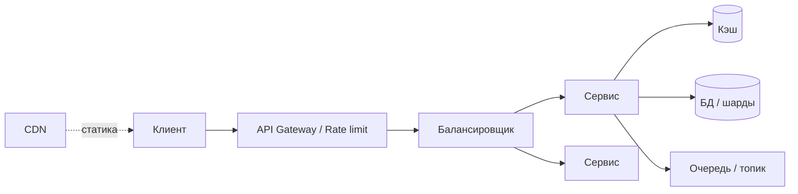

# 12 концепций архитектуры распределённых систем

  ОБЯЗАТЕЛЬНО
  ДЛЯ НОВИЧКОВ

Разработчику
Архитектору

  
Теория данных (раздел 3)

  

  Модель и масштаб — [Основы БД](/encyclopedia/3-data-markup/3-05-osnovy-baz-dannyh/intro), [опорные темы](/encyclopedia/3-data-markup/3-05-osnovy-baz-dannyh/12), [проектирование БД](design/116.md), [пакетная работа](/encyclopedia/3-data-markup/3-11-analiz-dannyh/433). Карта — [о разделе](./intro).
  

Ниже — **короткая шпаргалка** по идеям, которые встречаются в любом высоконагруженном веб-сервисе. Каждый пункт — одна фраза «зачем» и ссылка, куда разобрать детали в энциклопедии.

Полная **карта system design** (порядок изучения от сетей к очередям, пять инженерных рычагов, типовой контур, каркас собеседования) — в [System Design — карта тем и подготовка](143.md).

  
Сначала фундамент

  

  Балансировка, кэш и Kafka имеют смысл после HTTP/TCP/DNS и модели данных (индексы, репликация). Маршрут по шагам — в [System Design — карта тем и подготовка](143.md#poriadok-izucheniia);

  Kubernetes — после понимания этого контура.

  

  
Как пользоваться

  

  Сначала пробегите таблицу целиком, затем откройте 2–3 темы, которые уже встречаются в вашем проекте (например, кэш + балансировщик + rate limit на API).

  Сначала при необходимости — [ошибки и исключения в коде](/encyclopedia/4-code-dev/4-06-arhitektura-vypolneniya/111). Для микросервисов логичное продолжение — [экосистема технологий](design/118.md#ekosistema-msa), [девять компонентов продакшн-стека](design/118.md#prodakshn-stek) и [паттерны MSA](design/118.md), [инженерия устойчивости](design/2136.md). Для продукта с LLM те же приёмы ложатся на [семь слоёв LLM-стека](/encyclopedia/6-ai/6-05-razrabotka-ii/119) (слои 5–6).

  

---

## Сводная таблица

| № | Концепция | Зачем | Углубление |
|---|-----------|--------|------------|
| 1 | **Балансировка нагрузки** | Распределяет входящие запросы между несколькими серверами, снимает перегрузку с одного узла | [Горизонтальное масштабирование](design/2113.md), [веб-серверы](/encyclopedia/2-system-network/2-04-kak-rabotayut-sayty-i-veb-sayty/112), [глоссарий «Балансировка нагрузки»](/glossary/Б#балансировка-нагрузки) |
| 2 | **Кэширование** | Хранит часто читаемые данные в памяти, снижает задержку и нагрузку на БД | [Redis](/encyclopedia/3-data-markup/3-06-nosql/5), [HTTP-кэш](/encyclopedia/2-system-network/2-03-set-i-internet/611), [веб-стек](/encyclopedia/2-system-network/2-04-kak-rabotayut-sayty-i-veb-sayty/1) |
| 3 | **CDN** | Раздаёт статику с edge-узлов ближе к пользователю | [Веб-серверы и CDN](/encyclopedia/2-system-network/2-04-kak-rabotayut-sayty-i-veb-sayty/112), [масштабирование веба](design/119.md) |
| 4 | **Очередь сообщений** | Развязывает продюсера и потребителя: задачи обрабатываются асинхронно | [Брокеры](/encyclopedia/2-system-network/2-09-osnovy-integratsionnogo-vzaimodeystviya/121), [RabbitMQ](/encyclopedia/2-system-network/2-09-osnovy-integratsionnogo-vzaimodeystviya/122), [Kafka](/encyclopedia/2-system-network/2-09-osnovy-integratsionnogo-vzaimodeystviya/123) |
| 5 | **Publish–Subscribe** | Одно событие получают все подписчики топика | [Типы взаимодействия](/encyclopedia/2-system-network/2-09-osnovy-integratsionnogo-vzaimodeystviya/111), [событийная архитектура](design/2127.md), [Redis Pub/Sub](/encyclopedia/2-system-network/2-09-osnovy-integratsionnogo-vzaimodeystviya/129) |
| 6 | **API Gateway** | Единая точка входа: маршрутизация, auth, лимиты, агрегация | [Паттерны MSA §5](design/118.md), [проектирование API](design/117.md), [REST в инфраструктуре](/encyclopedia/8-infra-security/8-05-mikroservisy-i-integratsiya/1151) |
| 7 | **Circuit Breaker** | При серии сбоев зависимости перестаёт «долбить» её запросами | [Ошибки, исключения и отказоустойчивость](/encyclopedia/4-code-dev/4-06-arhitektura-vypolneniya/111#otkazoustojchivost), [Инженерия устойчивости](design/2136.md), [веб-паттерны](design/119.md) |
| 8 | **Service Discovery** | Реестр живых экземпляров сервисов в динамическом кластере | [Паттерны MSA §4](design/118.md), [влияние инфраструктуры](105.md), [Kubernetes Services](/encyclopedia/8-infra-security/8-06-konteynerizatsiya-i-orkestratsiya/intro) |
| 9 | **Шардирование** | Делит датасет по ключу на несколько серверов; ключ задаёт равномерность нагрузки | [§9 ниже](#9-шардирование-sharding), [масштабируемость](2.md), [РСУБД § шардинг](/encyclopedia/3-data-markup/3-08-upravlenie-rsubd/1.md#шардинг), [MongoDB](/encyclopedia/3-data-markup/3-06-nosql/41.md#11-шардирование-sharding) |
| 10 | **Rate limiting** | Ограничивает число запросов клиента за окно времени | [§10 — пять алгоритмов](#10-rate-limiting), [проектирование API](/encyclopedia/8-infra-security/8-05-mikroservisy-i-integratsiya/122), [уязвимости API](/encyclopedia/8-infra-security/8-07-informatsionnaya-bezopasnost/128#rate-limiting) |
| 11 | **Consistent hashing** | Раскладывает ключи по кольцу узлов; при добавлении узла переносится меньше данных | [Глоссарий](/glossary/C#consistent-hashing), [Redis Cluster](/encyclopedia/3-data-markup/3-06-nosql/5) |
| 12 | **Autoscaling** | Добавляет или убирает инстансы по метрикам нагрузки | [Горизонтальное масштабирование](design/2113.md), [HPA в Kubernetes](/encyclopedia/8-infra-security/8-06-konteynerizatsiya-i-orkestratsiya/intro), [облачные технологии](/encyclopedia/8-infra-security/8-01-oblachnye-tehnologii/1) |

---

## 1. Балансировка нагрузки (Load Balancing)

**Балансировщик** принимает трафик от клиентов и направляет его на один из однотипных backend-инстансов. Частые алгоритмы:

| Алгоритм | Суть | Когда уместен |
|----------|------|----------------|
| **Round Robin** | По очереди на каждый здоровый узел | Однородные запросы и равная мощность инстансов |
| **Least Connections** | На узел с меньшим числом активных соединений | Долгие запросы (файлы, WebSocket, тяжёлые API) |
| **Weighted** | Доля трафика пропорциональна весу узла | Разная мощность машин в пуле |
| **IP hash / consistent hashing** | Клиент или ключ «прилипает» к узлу | Локальный кэш на инстансе; шарды по ключу — [§11](#11-consistent-hashing) |

Дополнительно — health-check и исключение нездоровых узлов из пула.

Типичные продукты: Nginx, HAProxy, Envoy, облачные ALB/NLB. Балансировка даёт и **отказоустойчивость**: нездоровый узел исключают из пула.

Связка с проектированием: приложение должно быть **stateless** (сессия и данные — во внешнем хранилище), иначе все запросы одного пользователя «прилипнут» к одному серверу.

---

## 2. Кэширование (Caching)

Перед обращением к медленной БД проверяют **кэш** (Redis, Memcached, in-process). Попадание в кэш — ответ из памяти за миллисекунды; промах — чтение из БД и запись в кэш.

Уровни кэша:

- **браузер и CDN** — статика и ответы с `Cache-Control`;
- **приложение** — горячие объекты и сессии;
- **СУБД** — буферный пул и материализованные представления.

Важно заранее выбрать **политику инвалидации** (TTL, событие «данные изменились»), иначе пользователи увидят устаревшие данные. В Redis при нехватке RAM срабатывает **eviction** (`allkeys-lru`, `volatile-ttl` и др.) — таблица `maxmemory-policy` в [главе про Redis](/encyclopedia/3-data-markup/3-06-nosql/5).

---

## 3. CDN (Content Delivery Network)

**CDN** — сеть edge-серверов, которые кэшируют статику (и иногда HTML/API) рядом с пользователем. Запрос к `cdn.example.com` часто не доходит до origin в вашем дата-центре.

Снижается **latency** и нагрузка на origin. DNS направляет клиента на ближайший PoP. Для динамики используют edge-функции (Workers, Lambda@Edge).

---

## 4. Очередь сообщений (Message Queue)

**Продюсер** кладёт сообщение в очередь и продолжает работу. **Потребители** забирают задачи в своём темпе. Так развязывают пики нагрузки и длинные операции (отправка писем, генерация отчётов). Для почты поверх очереди нужны ещё state machine, suppression и webhooks провайдера — [email-рассылка как распределённая система](144.md).

Гарантии доставки (at-most-once, at-least-once, exactly-once) и порядок сообщений — отдельное проектное решение; см. [брокеры](/encyclopedia/2-system-network/2-09-osnovy-integratsionnogo-vzaimodeystviya/121).

---

## 5. Publish–Subscribe

В модели **pub/sub** отправитель публикует событие в **топик**, а все **подписчики** получают копию. Это broadcast: один факт — много реакций (уведомления, аналитика, синхронизация read-моделей).

Отличие от очереди: в классической очереди сообщение обычно обрабатывает **один** consumer; в pub/sub — **много** независимых подписчиков.

---

## 6. API Gateway

**Шлюз API** — фасад для внешних клиентов (браузер, мобильное приложение, партнёр). Он маршрутизирует `/orders` → сервис заказов, проверяет JWT, режет трафик по rate limit, может собрать ответ из нескольких внутренних вызовов.

Внутренние сервисы остаются за периметром; клиент не знает их адресов и не держит десятки контрактов.

---

## 7. Circuit Breaker (предохранитель)

Три состояния:

| Состояние | Поведение |
|-----------|-----------|
| **Closed** | Вызовы идут к зависимости как обычно |
| **Open** | После порога ошибок вызовы сразу отклоняются (fallback, кэш, ошибка 503) |
| **Half-Open** | Пробные запросы проверяют, восстановилась ли зависимость |

Цель — не усугубить падение зависимого сервиса лавиной retry и не блокировать свои потоки на таймаутах.

---

## 8. Service Discovery

В Kubernetes и облаке IP инстансов меняются при каждом деплое. **Service discovery** (Consul, Eureka, etcd, DNS Kubernetes) хранит актуальный список `host:port` и health.

**Client-side discovery** — клиент сам выбирает инстанс из реестра. **Server-side** — запрос идёт на балансировщик, который смотрит в реестр.

---

## 9. Шардирование (Sharding)

**Шардинг** (горизонтальное партиционирование) — распределение данных одной логической базы по **нескольким серверам** (шардам). Каждый шард хранит подмножество строк; вместе они образуют полный датасет. Правильно выбранный **ключ шарда** напрямую влияет на производительность и равномерность нагрузки.

### Зачем шардинг

- **Масштабируемость** — объём и интенсивность записи растут за пределы одного сервера.
- **Производительность** — нагрузка распределяется между узлами.
- **Доступность** — сбой одного шарда затрагивает только его данные; остальные продолжают обслуживать запросы (при репликации каждого шарда добавляется отказоустойчивость на уровне данных).

Шардинг увеличивает пропускную способность **записи** и **ёмкость**; для отказоустойчивости шарды обычно **реплицируют** отдельно.

### Типы шардинга

| Тип | Суть | Пример |
|-----|------|--------|
| **По диапазону (range)** | Данные режутся по интервалам значения ключа | Заказы с `id` 0…999 — shard 1, 1000…1999 — shard 2; товары до 75 — один шард, 76–150 — другой |
| **По справочнику (directory)** | Каталог сопоставляет значение ключа и номер шарда | Регион `EU` → shard 2, `RU` → shard 1; перенос «горячего» региона — правка каталога |
| **По ключу / хешу (key-based)** | `hash(shard_key) → shard_id` даёт более равномерное распределение | Один `user_id` всегда попадает на один шард |

Диапазон и справочник удобны, когда запросы **локализованы** по известному ключу (регион, период). Хеш-схема снижает перекос при равномерных ключах, если поле выбрано осознанно.

### Выбор ключа шарда

Три критерия, которые стоит проверить до продакшена:

1. **Кардинальность** — много уникальных значений ключа; данные равномерно раскладываются по шардам. Ключ с двумя–тремя значениями даёт 2–3 перегруженных шарда.
2. **Частота (распределение)** — значения встречаются примерно с одной частотой. Редкий, но «горячий» ключ (мега-аккаунт, общий каталог) создаёт **hot partition** — один шард перегружен.
3. **Монотонность** — время, автоинкремент и последовательные ID направляют **все новые записи** на последний шард; остальные простаивают. Для таких полей используют составной ключ (`tenant_id` + `id`) или хеш от стабильного бизнес-идентификатора.

На практике также требуют **локальность запросов** (один запрос — один шард) и предсказуемый маршрут без полного сканирования кластера.

### Маршрутизация запросов к шарду

| Паттерн | Кто выбирает шард |
|---------|-------------------|
| **Узлы, знающие топологию** | Клиент подключается к любому узлу; узел знает карту и перенаправляет запрос на нужный шард |
| **Выделенный маршрутизатор** | Прокси (`mongos`, Vitess): приложение шлёт запрос в один endpoint, маршрутизация скрыта |
| **Шард-aware клиент** | Логика в приложении: по `user_id` вычисляется шард и открывается соединение напрямую |

Простое `hash(key) % N` при изменении числа узлов `N` перекладывает почти все ключи; для плавного роста кластера применяют **consistent hashing** (см. §11).

### Ограничения

- Транзакции и `JOIN` **между шардами** — дорого или недоступны; границы данных проектируют вокруг ключа шарда.
- **Перебалансировка** при добавлении шардов — миграция данных и двойная запись на переходный период.
- **Партиционирование** внутри одной СУБД на одном сервере ускоряет обслуживание таблицы, но не снимает лимит железа — см. [партиционирование](/encyclopedia/3-data-markup/3-05-osnovy-baz-dannyh/3.md#10-партиционирование).

Углубление: [Масштабируемость и параллелизм](2.md), [репликация и шардинг в РСУБД](/encyclopedia/3-data-markup/3-08-upravlenie-rsubd/1.md#шардинг), [MongoDB](/encyclopedia/3-data-markup/3-06-nosql/41.md#11-шардирование-sharding), [глоссарий «Шардинг»](/glossary/Ш#шардинг).

---

## 10. Rate Limiting

**Лимит запросов (rate limiting)** ограничивает, сколько запросов клиент (IP, API-ключ, `sub` из JWT, tenant) может отправить за интервал времени. Цели — защита от злоупотреблений, brute-force, случайных DDoS и перегрузки downstream-сервисов при ошибках клиента.

Лимит обычно ставят на **API Gateway**, reverse-proxy (Nginx, Envoy) или в middleware приложения; счётчик часто хранят в **Redis** при нескольких инстансах. При превышении — **`429 Too Many Requests`** и по возможности **`Retry-After`**, **`X-RateLimit-Limit`**, **`X-RateLimit-Remaining`**, **`X-RateLimit-Reset`** (имена заголовков не стандартизированы единым RFC, но распространены). Подробнее про контракт с клиентом — [проектирование API — лимиты и квоты](/encyclopedia/8-infra-security/8-05-mikroservisy-i-integratsiya/121#rate-limiting-quotas), [код `429`](/encyclopedia/2-system-network/2-03-set-i-internet/611).

Ниже — **пять распространённых алгоритмов**. Выбор зависит от того, нужны ли **кратковременные всплески (burst)** или **ровный исходящий поток**, и сколько памяти вы готовы тратить на точность.

### Сводка алгоритмов

| Алгоритм | Память | Точность | Главный плюс |
|----------|--------|----------|--------------|
| **Fixed Window Counter** | Низкая | Низкая (граница окна) | Простая реализация, один счётчик на окно |
| **Sliding Window Log** | Высокая | Высокая | Точный лимит за последние *N* секунд |
| **Sliding Window Counter** | Низкая | Средняя–высокая | Компромисс: мало памяти, без «двойного» лимита на стыке окон |
| **Token Bucket** | Низкая | Высокая | Допускает burst, если накопились токены |
| **Leaky Bucket** | Низкая | Высокая | Выравнивает поток на выходе, защищает сервис от рывков |

### 1. Fixed Window Counter (фиксированное окно)

Время делится на **непересекающиеся интервалы** (например, каждую минуту с `:00`). Внутри окна ведётся счётчик запросов; при достижении **capacity** остальные запросы отклоняются до начала следующего окна.

**Минус:** на стыке двух окон клиент может отправить почти **двойной** лимит за короткий промежуток (например, 100 запросов в `00:59` и ещё 100 в `01:00`). Для многих публичных API это приемлемо; для жёстких SLA — смотрите скользящие окна.

### 2. Sliding Window Log (журнал скользящего окна)

Для **каждого** принятого запроса сохраняется **метка времени**. Перед обработкой нового запроса удаляются записи старше окна (например, старше 60 секунд), затем считается число оставшихся. Если `count < limit` — запрос принимается и в лог добавляется новая метка.

**Плюс:** нет артефакта на границе фиксированных окон. **Минус:** память и работа с множеством меток растут с числом клиентов и частотой запросов. В Redis типичная реализация — **sorted set (ZSET)** с атомарным Lua-скриптом, см. [Redis — rate limiter](/encyclopedia/3-data-markup/3-06-nosql/5#rate-limiter-sliding-window-log).

### 3. Sliding Window Counter (счётчик скользящего окна)

Гибрид: хранятся счётчики **текущего** и **предыдущего** фиксированного окна (например, две «минуты»). Оценка нагрузки за последние 60 секунд — **взвешенная сумма**: доля предыдущего окна, ещё попадающая в интервал, плюс счётчик текущего окна. Памяти мало, поведение ближе к скользящему окну, чем у одного fixed window.

### 4. Token Bucket (ведро токенов)

В «ведро» с **максимальной ёмкостью** токены **поступают с постоянной скоростью** (например, 10 токенов в секунду). Каждый запрос **забирает один токен**. Есть токен — запрос проходит; ведро пустое — отказ (`429` или очередь, если так заложено в продукте).

**Когда уместен:** публичные API и мобильные клиенты, где **кратковременный burst** допустим (пользователь открыл экран и дернул несколько эндпоинтов сразу), но средняя скорость должна оставаться в лимите. Тот же принцип лежит в **`limit_req … burst=`** в Nginx и в **Token Bucket Filter (`tbf`)** в `tc` Linux — см. [обратный прокси](/encyclopedia/2-system-network/2-03-set-i-internet/614#обратный-прокси-для-веб-приложений), [шейпинг трафика](/encyclopedia/2-system-network/2-01-operatsionnaya-sistema/51).

### 5. Leaky Bucket (протекающее ведро)

Входящие запросы попадают в **очередь (FIFO)** фиксированного размера; из ведра они **«протекают» на обработку с постоянной скоростью**. Очередь переполнена — новые запросы отбрасываются. На выходе поток **ровный**, burst на backend не попадает.

**Когда уместен:** защита узкого ресурса (БД, внешний API), где важна **стабильная скорость обработки**, а не разрешение всплесков. Отличается от token bucket: token bucket **разрешает burst на входе** (пока есть токены), leaky bucket **сглаживает** поток к downstream.

### Как выбрать

| Задача | Частый выбор |
|--------|----------------|
| Простой лимит «1000 запросов в час» на gateway | Fixed window или sliding window counter |
| Строгий лимит «не более 60 в минуту» без провала на стыке минут | Sliding window log или counter |
| API с редкими всплесками, средняя скорость важнее пика | **Token bucket** |
| Защита БД/воркера от волны одновременных запросов | **Leaky bucket** или очередь + фиксированный pool воркеров |

Ключ лимита задают явно: `IP`, `API-Key`, `user_id`, комбинация `tenant + route`. На `/login` и `/reset-password` лимиты **строже**, чем на чтение каталога — см. [безопасность API](/encyclopedia/8-infra-security/8-07-informatsionnaya-bezopasnost/128#rate-limiting).

  
Троттлинг и rate limit

  

  Троттлинг (throttling) в эксплуатации — общее «дросселирование» нагрузки (CPU cgroup, `429`, очередь). Rate limiting — конкретный **алгоритм подсчёта** запросов во времени. См. также [троттлинг в администрировании](/encyclopedia/2-system-network/2-06-sistemnoe-administrirovanie/9#троттлинг).
  

---

## 11. Consistent Hashing

Обычный `hash(key) % N` при добавлении узла перекладывает почти все ключи. **Consistent hashing** размещает узлы и ключи на **кольце**: ключ принадлежит первому узлу по часовой стрелке. При появлении нового узла переезжает только его сегмент кольца.

Используют в распределённых кэшах, балансировщиках, шардах (виртуальные ноды на кольце уменьшают перекос нагрузки).

---

## 12. Autoscaling

**Автомасштабирование** по метрикам (CPU, RPS, длина очереди) добавляет или удаляет инстансы. В Kubernetes — Horizontal Pod Autoscaler; в облаке — Auto Scaling Groups.

Связано с **горизонтальным масштабированием**: stateless-приложение, балансировщик, observability. Scale-down требует graceful shutdown, чтобы не оборвать активные запросы.

---

## Типовые цепочки

Полная схема продакшн-приложения на микросервисах (gateway, registry, авторизация, брокер, Prometheus, ELK) — в [Паттернах MSA](design/118.md#prodakshn-stek). Скелет «90% масштабируемых систем» (CDN, stateless API, кэш, primary/read replica, очередь, воркеры) — в [System Design — карта тем и подготовка](143.md#tipovoi-kontur).

**Быстрый ответ пользователю**

Клиент → CDN (статика) → API Gateway (auth + rate limit) → балансировщик → сервис → кэш → при промахе **read replica** (или primary на запись).

**Запись и фоновая работа**

API пишет в **primary** → репликация на read-копии → событие в **очередь** (или CDC/outbox) → **воркеры** (уведомления, аналитика, пересчёт ленты) без блокировки HTTP-ответа.

**Устойчивость к сбоям партнёра**

Сервис → circuit breaker на вызов внешнего API → при open — ответ из кэша или очередь на повтор позже.

**Рост нагрузки**

Метрики → autoscaling → новые поды → service discovery обновляет реестр → балансировщик начинает слать им трафик.

---

## Слой сетевых служб

Балансировщик, CDN, API Gateway и кэш из таблицы выше работают **поверх** базовых сетевых служб. Их порты и протоколы постоянно всплывают при проектировании и инцидентах:

| Роль | Примеры | Порт | Связь с архитектурой |
| :--- | :--- | :--- | :--- |
| Имена | DNS | 53 | Service discovery и CDN направляют клиента на нужный IP |
| Вход в API | HTTPS / HTTP/3 | 443 | Gateway, rate limit, TLS termination |
| Данные | PostgreSQL, MySQL | 5432, 3306 | Шардирование, реплики, connection pool |
| Идентификация | OAuth 2.0 / OIDC, LDAP | 443, 389/636 | Единый вход, корпоративный каталог |
| Операции | SSH | 22 | Деплой, туннель к БД, диагностика |

Полная таблица по шести группам (DHCP, NTP, почта, VPN и др.) — [Сетевые сервисы по ролям](/encyclopedia/2-system-network/2-03-set-i-internet/618#setevye-servisy-po-rolyam). Учебный контекст портов и сокетов — [сеть и интернет, основы](/encyclopedia/2-system-network/2-03-set-i-internet/1#порт).

---

## Что читать дальше

1. [System Design — карта тем и подготовка](143.md) · [Масштабируемость и параллелизм](2.md) · [NFR](design/1116.md)
2. [Распределённые системы](design/21.md) · [Выбор лидера — Raft, Paxos, ZAB](142.md) · [PACELC](/encyclopedia/8-infra-security/8-05-mikroservisy-i-integratsiya/124)
3. [Микросервисы и интеграция](/encyclopedia/8-infra-security/8-05-mikroservisy-i-integratsiya/intro)
4. [Итоги раздела](998.md) · [чек-лист](999.md)
