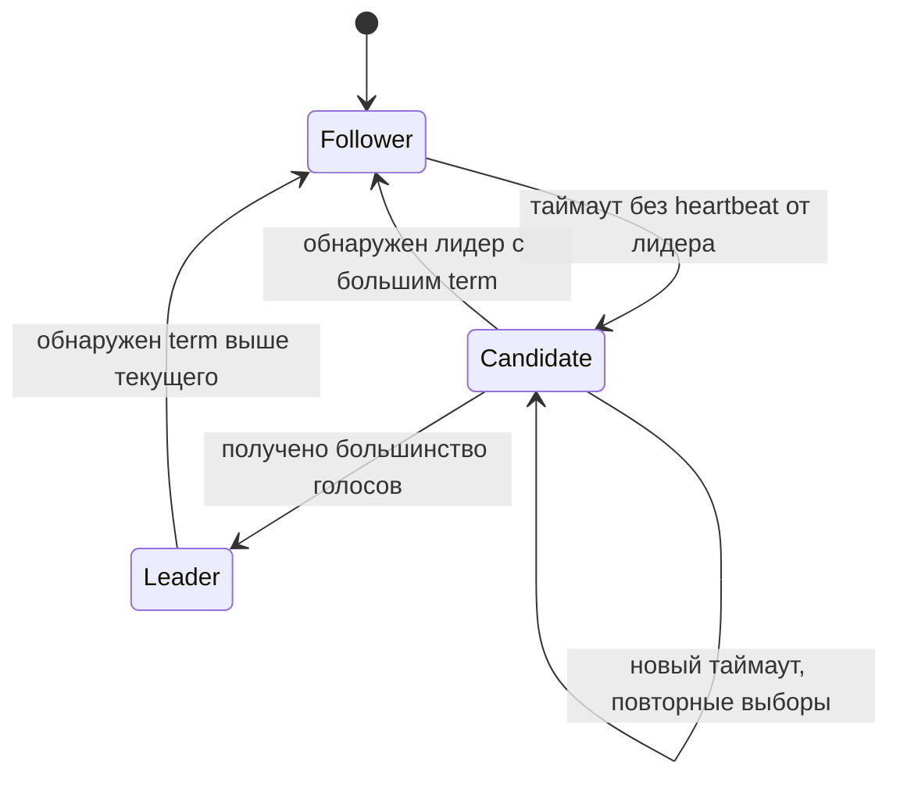

# Алгоритмы выбора лидера в распределённых системах

  ОБЯЗАТЕЛЬНО
  ДЛЯ НОВИЧКОВ

Разработчику
Архитектору

  
Теория данных (раздел 3)

  

  Модель и масштаб — [Основы БД](/encyclopedia/3-data-markup/3-05-osnovy-baz-dannyh/intro), [опорные темы](/encyclopedia/3-data-markup/3-05-osnovy-baz-dannyh/12), [проектирование БД](design/116.md), [пакетная работа](/encyclopedia/3-data-markup/3-11-analiz-dannyh/433). Карта — [о разделе](./intro).
  

Алгоритмы выбора лидера в распределённых системах представляют собой фундаментальный класс протоколов синхронизации, предназначенных для решения задачи координации в среде, где множество независимых вычислительных узлов работают совместно над общей задачей, но не имеют единого центрального управляющего элемента и не могут полагаться на общую память или точное глобальное время. Суть этих алгоритмов сводится к процедуре демократического или детерминированного избрания одного из узлов в качестве временного координатора, который берет на себя ответственность за принятие критических решений, управление очередями операций и обеспечение консистентности данных. Главные проблемы, которые призваны решать подобные алгоритмы, связаны с асинхронной природой сетей передачи данных, возможными задержками, временными сбоями связи и полным выходом узлов из строя, при этом ключевыми требованиями выступают сходимость процесса к единственному лидеру за конечное время, устойчивость к повторным выборам после потери связи и гарантия того, что в любой момент времени в системе не будет существовать двух узлов, одновременно считающих себя полноправными лидерами.

Узел в контексте распределенных систем представляет собой базовую единицу вычислительной инфраструктуры, которая может быть реализована как физический сервер, виртуальная машина, контейнер или даже отдельный процесс, функционирующий в сети и обладающий собственным локальным тактовым генератором, оперативной памятью и постоянным хранилищем. Каждый узел обладает уникальным идентификатором в рамках системы, поддерживает сетевую связанность с другими узлами через каналы передачи данных и способен выполнять локальные вычисления независимо от остальной части кластера. Важной характеристикой узла является его нестабильность, поскольку в реальных условиях эксплуатации узлы могут отключаться по техническим причинам, перегружаться из-за высокого потока запросов или терять связь с остальными участниками сети, что приводит к необходимости разработки алгоритмов, способных корректно функционировать в условиях постоянно меняющегося состава рабочих участников системы.

Лидер представляет собой специально избранный узел в распределенном кластере, который наделяется исключительными полномочиями по управлению потоком операций модификации данных и координации работы остальных узлов на определенный интервал времени, называемый сроком полномочий или периодом лидерства. Основная функция лидера заключается в упорядочивании входящих запросов на запись, назначении им глобальных порядковых номеров или версий и рассылке этих обновлений всем подчиненным узлам для обеспечения согласованности реплик. Лидер также часто выступает в роли арбитра в спорных ситуациях, разрешает конфликты между параллельными транзакциями и принимает решения об инициации процедуры смены лидера в случае обнаружения собственной неработоспособности или получения сигналов от других узлов о потере с ним связи. Важно понимать, что лидерство в распределенных системах является эфемерным и временным статусом, который может быть пересмотрен в любой момент при возникновении сетевых разделений или сбоев оборудования.

Координатор является более широким понятием по сравнению с лидером и обозначает любой узел или компонент системы, который берет на себя функции управления распределенными транзакциями, планирования задач и обеспечения выполнения общих протоколов взаимодействия между участниками. В отличие от лидера, который обычно связан с репликацией данных и обслуживанием операций записи, координатор может выполнять функции посредника в двухфазных или трехфазных протоколах фиксации транзакций, управлять распределенными блокировками ресурсов или контролировать последовательность выполнения длительных бизнес-процессов, распределенных по множеству сервисов. Во многих архитектурах роль координатора может совмещаться с ролью лидера, но существуют системы, где координация вынесена в отдельный слой, не связанный напрямую с хранением данных, что позволяет разделить ответственность за управление транзакциями и обеспечение отказоустойчивости хранилища.

В кластере из нескольких узлов часто нужен **один координатор** — узел, который принимает записи, планирует фоновые задачи или хранит "истину" о том, кто сейчас primary. **Выбор лидера** (leader election) — протокол, по которому оставшиеся в строю узлы договариваются, кто этот координатор, когда прежний лидер упал или сеть его изолировала.

Это близко к **консенсусу** (согласию о порядке операций в журнале), но цель уже: сначала выбрать лидера, затем через него или кворум применять изменения. На практике Raft, Paxos и ZAB решают обе задачи в связке.

Контекст CAP, репликации и кворумов — [распределённые системы](design/21.md), [основы NoSQL](/encyclopedia/3-data-markup/3-06-nosql/2), [PACELC](/encyclopedia/8-infra-security/8-05-mikroservisy-i-integratsiya/124). Общая карта тем system design — [System Design — карта тем и подготовка](143.md).

---

## Зачем нужен лидер

| Задача | Без лидера | С лидером |
|--------|------------|-----------|
| Запись в master–replica | Риск двух primary и расхождения данных | Один узел принимает write |
| Failover БД | Ручное переключение | Автоматический выбор нового primary |
| Планировщик в кластере | Все узлы запускают backup одновременно | Задачу выполняет только лидер |
| Координация (блокировки, конфиг) | Гонки и split-brain | Единая упорядоченная очередь решений |

Master–replica представляет собой одну из наиболее распространенных архитектурных парадигм построения отказоустойчивых систем хранения данных, в которой один главный узел принимает все операции записи и последовательно распространяет изменения на один или несколько подчиненных узлов-реплик, которые обслуживают запросы чтения. Главный узел в этой схеме отвечает за поддержание единственной версии истины, разрешение конфликтов записи и обеспечение строгой последовательности применения операций, в то время как реплики играют вспомогательную роль, повышая пропускную способность системы по чтению и обеспечивая сохранность данных в случае отказа главного узла. Синхронность репликации может варьироваться от строгой, когда запрос считается выполненным только после подтверждения записи на всех или на большинстве реплик, до асинхронной, когда главный узел подтверждает операцию немедленно, а реплики догоняют его с некоторой задержкой, что дает выигрыш в производительности, но создает риск потери последних изменений при внезапном отказе мастера.

Primary является синонимом лидера или главного узла в некоторых системах управления базами данных и распределенных хранилищах, особенно в контексте реляционных баз данных с поддержкой кластеризации, где этот термин подчеркивает первичность узла по отношению ко всем остальным для операций модификации схемы и данных. В отличие от реплик или вторичных узлов, primary-узел обладает полными правами на изменение состояния системы, включая создание новых таблиц, индексов и других объектов базы данных, а также выполняет все операторы вставки, обновления и удаления данных. Ключевое отличие primary от лидера заключается в том, что в некоторых системах может существовать строго один primary узел на протяжении всего времени работы кластера, тогда как концепция лидера допускает более частые и автоматизированные смены управляющего узла в рамках протоколов консенсуса.

Write является критической операцией модификации состояния распределенной системы, которая требует особого внимания в контексте выбора лидера, поскольку именно лидер несет полную ответственность за обработку всех запросов на изменение данных и гарантирует, что эти изменения будут корректно упорядочены и применены к состоянию системы в соответствии с заданными правилами согласованности. Операция записи в распределенной среде представляет собой сложный процесс, который включает в себя валидацию входящего запроса, проверку прав доступа, локализацию соответствующих данных, применение изменений с учетом текущего состояния и распространение обновлений на все реплики, при этом успешность записи часто зависит от кворума подтверждений со стороны других узлов. Поскольку любая потерянная или неправильно упорядоченная операция записи может привести к нарушению целостности данных, алгоритмы выбора лидера разрабатываются таким образом, чтобы минимизировать риск пропуска записей и гарантировать, что даже после смены лидера все подтвержденные записи сохранят свою согласованность относительно друг друга.

Failover представляет собой автоматизированный процесс переключения ролей в распределенной системе, при котором в случае обнаружения отказа или недоступности текущего лидера или master-узла управление и ответственность за обработку операций записи передаются другому узлу, выбранному из числа доступных реплик или кандидатов на лидерство. Процесс failover может быть инициирован как самим лидером при обнаружении собственных проблем и отправке сигнала о добровольном освобождении должности, так и другими узлами, которые по истечении заранее заданного тайм-аута принимают решение о том, что текущий лидер более не функционален и необходимо провести выборы нового координатора. Критически важным аспектом failover является обеспечение минимального времени простоя системы и предотвращение ситуации, когда после переключения клиентские запросы продолжают направляться на старый, возможно частично работающий лидер, что требует применения механизмов обнаружения изменений в топологии и перенаправления трафика на вновь избранный узел.

Split-brain является одним из самых опасных и разрушительных состояний в распределенных системах, возникающим, когда из-за временных проблем с сетевой связностью кластер разделяется на две или более группы узлов, каждая из которых считает себя единственно правильной и избирает собственного лидера, не зная о существовании другой активной группы. В таком состоянии две независимые части системы начинают принимать операции записи одновременно, что приводит к необратимым расхождениям в данных, когда каждая группа фиксирует свои изменения, предполагая, что именно ее версия состояния является актуальной, и последующее восстановление связности уже не позволяет автоматически разрешить возникшие противоречия без вмешательства администратора. Основными методами борьбы с split-brain являются использование протоколов консенсуса, требующих подтверждения от строгого большинства узлов для любых изменений, применение механизмов эпох и версий для детектирования устаревших лидеров, а также внедрение системы кворумов, которая гарантирует, что при сетевом разделении только группа, содержащая более половины всех узлов, сможет продолжать обработку операций записи.

  
Split-brain

  

  Если сеть разделила кластер и **два** узла считают себя лидером, клиенты могут писать в оба — данные разойдутся.

  Алгоритмы консенсуса и кворумы как раз ограничивают такой сценарий: лидером становится только сторона с большинством голосов или подтверждений.

  

Операционные примеры — **Patroni + etcd** для PostgreSQL, **ZooKeeper** для старых стеков Kafka, **KRaft** (Raft) в современном Kafka, **etcd** и **Consul** как хранилища конфигурации с встроенным Raft.

Patroni с Etcd представляет собой современный стек управления отказоустойчивостью для систем управления базами данных PostgreSQL, в котором Patroni выступает в роли высокоуровневого менеджера кластера, автоматизирующего процессы репликации, мониторинга состояния узлов и инициации переключения лидера, а Etcd служит распределенным хранилищем конфигурации и метаданных, построенным на основе алгоритма консенсуса Raft и обеспечивающим надежное хранение информации о текущем лидере, состоянии реплик и параметрах кластера. Взаимодействие между этими компонентами строится по принципу постоянного контроля здоровья: каждый экземпляр Patroni на каждом узле периодически обновляет свою запись в Etcd, указывая текущее состояние сервера PostgreSQL и свою готовность стать лидером, а при обнаружении необновляемой в течение заданного интервала записи действующего лидера запускается процедура выборов нового координатора на основе заранее определенных критериев приоритета. Использование Etcd в качестве надежного слоя хранения состояния позволяет Patroni гарантировать, что даже при полной потере связи между частью узлов конфигурация кластера останется доступной и консистентной благодаря встроенным механизмам кворумов и устойчивости к сетевым разделениям.

ZooKeeper представляет собой централизованный сервис координации распределенных приложений, разработанный в недрах компании Yahoo, который предоставляет высоконадежное хранилище иерархического пространства имен, очень похожего на файловую систему, где каждый узел может хранить небольшие объемы данных и поддерживать механизмы watch-уведомлений для отслеживания изменений состояния другими клиентами. В основе работы ZooKeeper лежит протокол ZAB, обеспечивающий строгую последовательность обновлений и выбор лидера, благодаря чему данный сервис стал де-факто стандартом для реализации распределенных блокировок, обнаружения сервисов, поддержки очередей сообщений и управления конфигурацией в таких крупных проектах, как Apache HBase, Apache Kafka и многие другие. ZooKeeper реализует модель строгой упорядоченности, где все операции записи проходят через единственного лидера и применяются к состоянию системы в едином глобальном порядке, что гарантирует всем клиентам консистентное представление данных независимо от того, к какому серверу кластера они подключены в данный момент.

KRaft представляет собой новый встроенный протокол управления метаданными и выбора контроллера в экосистеме Apache Kafka, который призван заменить традиционную зависимость от внешних координационных сервисов типа ZooKeeper и реализовать механизм консенсуса на основе алгоритма Raft непосредственно внутри брокеров сообщений. Суть KRaft заключается в том, что часть узлов кластера назначаются контроллерами, которые образуют кворум и отвечают за поддержание актуальной метаинформации о всех разделах, репликах и конфигурациях тем, при этом один из контроллеров избирается активным лидером и выполняет все операции изменения состояния, а остальные пассивно реплицируют его журнал изменений. Переход на KRaft значительно упрощает архитектуру Kafka, устраняя необходимость поддержки отдельного внешнего кластера ZooKeeper, снижая задержки при операциях с метаданными и повышая общую устойчивость системы за счет сокращения количества движущихся частей и точек отказа.

Consul представляет собой многофункциональный инструмент для сервисной сетки и управления инфраструктурой, разработанный компанией HashiCorp, который сочетает в себе возможности сервисного реестра с поддержкой проверок здоровья узлов и сервисов, распределенного хранилища ключ-значение, безопасной передачи конфигураций и встроенного механизма выбора лидера на основе протокола Raft. В отличие от специализированных координаторов, Consul предлагает интегрированное решение для обнаружения сервисов с автоматическим обновлением DNS-записей и балансировки нагрузки, что делает его популярным выбором для микросервисных архитектур и сред с динамически изменяющимся составом рабочих экземпляров. Механизм сессий и блокировок в Consul позволяет приложениям элегантно реализовывать распределенную координацию и выбирать лидера для выполнения фоновых задач, при этом встроенные механизмы защиты от split-brain обеспечивают надежность работы даже в условиях нестабильных сетевых соединений.

Paxos представляет собой теоретический фундамент и один из первых формальных протоколов консенсуса, предложенный Лесли Лампортом, который лег в основу множества практических реализаций распределенных систем благодаря своим строгим математическим доказательствам корректности и устойчивости к сбоям. Протокол Paxos основывается на идее достижения согласия между неопределенным множеством участников относительно некоторого значения, несмотря на возможные отказы узлов и задержки в сети, и предполагает последовательность раундов с фазами обещания и принятия, где каждый раунд может быть инициирован любым узлом, а для принятия решения требуется поддержка строгого большинства акцепторов. Несмотря на свою теоретическую безупречность, классический Paxos считается сложным для понимания и реализации на практике, что привело к появлению его упрощенных вариаций, таких как Multi-Paxos и Fast Paxos, а также к созданию альтернативных протоколов, которые сохраняют основные гарантии Paxos, но предлагают более интуитивно понятный механизм работы.

---

## Пять базовых алгоритмов

Ниже — схемы, которые чаще всего встречаются в учебниках и обзорах распределённых БД и координаторов (в духе обзоров вроде ByteByteGo). В продакшене доминируют **Raft** и производные от **Paxos** / **ZAB**; **Bully** и **Ring** полезны для понимания идей, реже — как готовый продукт.

### Сводная таблица

| Алгоритм | Идея выбора лидера | Кворум / голосование | Типичное применение |
|----------|-------------------|----------------------|---------------------|
| **Bully** | Узел с **максимальным числовым ID** | Нет; опрос "старших" соседей | Учебные кластеры, простые координаторы |
| **Ring** | Обход **логического кольца**, побеждает **макс. ID** в сообщении | Нет | Учебные модели, редко в промышленных СУБД |
| **Paxos** | Согласование **значения** (в т.ч. "кто лидер") через раунды propose/accept | **Да** — большинство acceptors | Chubby, основа многих CP-хранилищ |
| **Raft** | **Голосование** кандидатов; большинство голосов → лидер | **Да** — большинство узлов | etcd, Consul, CockroachDB, KRaft |
| **ZAB** | Лидер через **эфемерные последовательные znode** в ZooKeeper | **Да** — кворум followers | Apache ZooKeeper, старые кластеры Kafka |

---

### Bully Algorithm

Bully является одним из наиболее простых и интуитивно понятных алгоритмов выбора лидера, который часто используется в системах с небольшим количеством узлов и невысокими требованиями к устойчивости к разделению сети, где выборы инициируются узлом, обнаружившим отсутствие координатора, путем отправки сообщений-вызовов всем узлам с большим идентификатором. В основе алгоритма лежит принцип приоритета по максимальному идентификатору, где узел, пославший вызов и не получивший ответа от более старших узлов в течение установленного тайм-аута, объявляет себя лидером и рассылает соответствующее уведомление всем остальным участникам, которые обязаны признать его лидерство. Недостатком Bully является его уязвимость к сетевым задержкам и временным потерям связи, поскольку отсутствие ответа от более старшего узла может быть как следствием его реального отказа, так и результатом проблем с доставкой сообщений, что может приводить к частым и неоправданным сменам лидера.

У каждого узла есть **уникальный числовой приоритет** (ID). Пока жив узел с наибольшим ID, он — лидер.

1. Узел замечает, что текущий лидер не отвечает.
2. Отправляет сообщение **ELECTION** всем узлам с **большим** ID.
3. Если кто-то с большим ID жив, он отвечает и сам запускает выборы; инициатор ждёт.
4. Если ответа нет — инициатор объявляет себя лидером и шлёт **COORDINATOR** остальным.

**Плюсы** — простая логика, быстрый выбор, если "старший" узел стабилен. **Минусы** — при падении узла с максимальным ID вся цепочка опроса повторяется; много сообщений в больших кластерах; приоритет по ID не отражает нагрузку или здоровье узла.

---

### Ring Algorithm

Ring или кольцевой алгоритм выбора лидера представляет собой децентрализованный протокол, в котором узлы организуются в логическое кольцо с заранее установленным порядком следования, и выборы инициируются путем передачи специального сообщения-маркера по кругу, где каждый узел добавляет в маркер свой идентификатор, а по завершении обхода маркер возвращается к инициатору, который анализирует полученные данные и назначает лидера по заданному критерию, например, по максимальному идентификатору. В отличие от алгоритма Bully, где каждый узел действует независимо, кольцевой подход предполагает коллективный сбор информации обо всех участниках, что обеспечивает более детерминированный и предсказуемый результат, однако требует времени, пропорционального размеру кольца, и создает единую точку сбоя в виде процесса доставки маркера, потеря которого может парализовать работу всей системы. Кольцевые алгоритмы находят применение в системах с относительно стабильным составом узлов и невысокими требованиями к скорости переключения лидера, например, в некоторых реализациях распределенных очередей и систем обработки потоков данных с топологией, определенной заранее.

Узлы выстроены в **логическое кольцо** (по списку соседей или хешу). При старте выборов **инициатор** посылает по кольцу сообщение со своим ID. Каждый узел подставляет в сообщение **максимум** из своего ID и уже переданных; когда сообщение обошло круг, всем известен победитель с наибольшим ID — он становится лидером.

Трафик предсказуем (**O(n)** сообщений на раунд), но кольцо уязвимо к разрыву связи между соседями, а восстановление топологии усложняет эксплуатацию по сравнению с Raft.

---

### Paxos

Paxos представляет собой семейство протоколов для достижения консенсуса в распределённых системах, предложенное Лесли Лампортом в 1989 году и ставшее теоретическим краеугольным камнем для множества практических реализаций координации узлов. В своей основе Paxos решает фундаментальную задачу согласования одного значения среди группы процессов, работающих в асинхронной среде, где возможны отказы узлов любого типа, включая внезапную остановку, потерю сетевого соединения и даже недетерминированные задержки при передаче сообщений. Протокол оперирует тремя основными ролями узлов, которые могут быть совмещены в одном физическом экземпляре: инициаторы предлагают значения для голосования, акцепторы принимают или отклоняют предложения, а обучающиеся получают итоговое принятое решение, причём классическая реализация Paxos проходит через две фазы, где на первой фазе инициатор подготавливает почву, запрашивая у большинства акцепторов обещание не принимать предложения с меньшим номером раунда, а на второй фазе отправляет своё значение для финального утверждения. Главная сложность Paxos заключается в его невероятной тонкости, поскольку корректная обработка ситуации, когда несколько инициаторов запускают раунды с растущими номерами параллельно, требует строгого соблюдения временных и логических условий, что делает протокол трудным для понимания и реализации даже опытными инженерами, однако именно благодаря строгим математическим доказательствам Лампорт гарантирует, что при любых сценариях сбоев, если только большинство узлов остаются работоспособными и связь между ними в конечном счёте восстанавливается, протокол всегда сходится к единственному принятому значению. На практике инженеры редко используют классический однораундовый Paxos в чистом виде, предпочитая его вариации, такие как Multi-Paxos, где лидер избирается один раз и обслуживает последовательность операций без повторного выполнения подготовительной фазы для каждого отдельного решения, что значительно повышает пропускную способность системы и делает её пригодной для ведения непрерывного журнала операций в базах данных и распределённых файловых системах.

Классический **кворумный** протокол консенсуса. Роли:

- **Proposer** — предлагает значение (например, номер нового лидера или запись в журнал).
- **Acceptor** — голосует за предложения; решение принято, если **большинство** acceptors согласились.
- **Learner** — узнаёт принятое значение и применяет его.

Один раунд Paxos гарантирует согласие на **одно** значение при отказе меньшинства узлов. Для журнала операций запускают серию раундов (**Multi-Paxos**), часто с выделенным лидером (proposer), чтобы не гонять полный протокол на каждую запись.

Paxos математически строг, но сложен в реализации и объяснении; поэтому в индустрии часто берут **Raft** как более понятный эквивалент по целям.

---

### Raft

Raft является протоколом консенсуса, разработанным Диего Онгаро и Джоном Оустерхаутом в 2013 году как более понятная и доступная для практической реализации альтернатива Paxos, при этом он сохраняет все ключевые свойства безопасности и устойчивости к сбоям, но предлагает чёткое разделение на три основных компонента: выбор лидера, репликацию журнала и обеспечение безопасности, что позволяет разработчикам легче воспринимать логику работы и отлаживать систему. В протоколе Raft каждый узел может находиться в одном из трёх состояний: лидер, который обслуживает все клиентские запросы и управляет репликацией, последователь, который пассивно получает обновления от лидера и участвует в выборах, и кандидат, который временно активизируется для инициирования процедуры выборов при обнаружении отсутствия действующего лидера, причём выборы проводятся на основе случайных таймеров, что минимизирует вероятность одновременной инициации выборов несколькими узлами и уменьшает количество повторных раундов. Ключевой инновацией Raft является понятие термина, представляющего собой строго возрастающий номер раунда выборов, который позволяет узлам определять актуальность информации и отвергать сообщения от устаревших лидеров, а также механизм сопоставления индексов записей в журнале, где лидер отслеживает для каждого последователя индекс последней успешно реплицированной записи и постоянно догоняет отстающие узлы, отправляя им недостающие фрагменты журнала. Процесс репликации в Raft строится на том, что лидер принимает команду от клиента, добавляет её в свой локальный журнал, затем параллельно рассылает эту запись всем последователям и считает команду зафиксированной только после получения подтверждения от строгого большинства узлов, после чего применяет команду к состоянию своей конечной машины и уведомляет клиента об успехе, при этом в случае обнаружения расхождений между журналом лидера и последователей протокол предусматривает механизм принудительной перезаписи, который гарантирует консистентность всех реплик даже после серии сбоев. Благодаря своей интуитивной ясности и наличию нескольких детально документированных эталонных реализаций, Raft стал стандартом де-факто для построения современных распределённых систем, включая такие проекты, как etcd, Consul, TiKV и CockroachDB, вытеснив многие более сложные протоколы за счёт сочетания простоты понимания и надёжности.

Raft явно разделяет **выбор лидера** и **репликацию журнала**. Состояния узла:

- **Follower** — принимает записи только от лидера, отвечает на heartbeat.
- **Candidate** — запрашивает голоса у peers в рамках **term** (логического поколения выборов).
- **Leader** — принимает клиентские записи, рассылает их followers, коммитит после **большинства** подтверждений.

Клиенты пишут через лидера; при его падении после таймаута кластер проводит новые выборы. Условие безопасности: в одном term не больше одного лидера с подтверждённым большинством.

**Где встречается:** etcd, HashiCorp Consul, TiKV, CockroachDB, **KRaft** в Apache Kafka, многие NewSQL-СУБД.

---

### ZAB (ZooKeeper Atomic Broadcast)

ZAB является аббревиатурой для протокола атомарной широковещательной рассылки, разработанного специально для Apache ZooKeeper, который обеспечивает упорядоченную доставку сообщений всем узлам кластера и включает в себя процедуру выбора лидера для координации потока обновлений. Ключевое отличие ZAB от классического Paxos состоит в оптимизации под рабочие нагрузки с высокой интенсивностью операций записи, где лидер играет доминирующую роль, последовательно принимая запросы от клиентов, присваивая им глобальные порядковые номера в виде ZXID и рассылая их подчиненным узлам для применения в точно таком же порядке. При сбое лидера ZAB запускает фазу восстановления, в ходе которой новый лидер синхронизирует свое состояние с большинством узлов, гарантируя, что все подтвержденные ранее операции будут сохранены, а любые неподтвержденные транзакции будут либо отменены, либо повторно применены в соответствии с состоянием кворума.

**ZAB** — протокол **Apache ZooKeeper** для атомарной широковещательной рассылки и согласованного журнала. Выбор лидера связан с иерархией **znode** в дереве координации:

- клиенты создают **эфемерные последовательные** узлы (например, `/election/`);
- узел с **наименьшим порядковым суффиксом** среди живых кандидатов считается лидером;
- при отключении сессии эфемерный узел исчезает — следующий по очереди становится лидером.

Репликация идёт циклом **Propose → ACK → Commit** от лидера к followers; коммит фиксируется при **кворуме** подтверждений.

ZooKeeper даёт CP-хранилище метаданных (конфиг, блокировки, service discovery). Старые кластеры **Kafka** до KRaft использовали ZooKeeper для controller election; сейчас новые развёртывания переходят на **KRaft** (внутри — Raft).

---

## Лидер, кворум и консенсус — как связано

| Понятие | Вопрос, на который отвечает |
|---------|------------------------------|
| **Leader election** | *Кто* сейчас координатор? |
| **Кворум** | Сколько узлов должно подтвердить операцию? Обычно **большинство** из `N` узлов |
| **Консенсус** | *В каком порядке* применять операции, чтобы все реплики сошлись к одному журналу? |

Кворум представляет собой фундаментальное понятие в теории распределённых систем, означающее минимальное количество узлов в кластере, которое должно принять участие в операции голосования или подтвердить получение данных для того, чтобы решение считалось легитимным и система могла безопасно продолжать работу, при этом классический размер кворума вычисляется как строгое большинство от общего числа узлов, то есть более половины, что обеспечивает гарантию того, что любые два кворума обязательно пересекутся хотя бы в одном узле, предотвращая возможность принятия противоречивых решений разными подгруппами. Использование кворумов является основным защитным механизмом против проблемы split-brain, поскольку в случае разделения сети на две изолированные части только та группа, которая содержит более половины всех узлов, сможет набрать необходимый кворум для продолжения операций записи и выбора нового лидера, тогда как меньшая часть останется в состоянии ожидания, не имея возможности изменять состояние системы и тем самым создавать конфликтующие версии данных. Размер кворума напрямую влияет на доступность и производительность распределённой системы: чем больше требуемое количество подтверждений, тем выше гарантии консистентности и устойчивости к отказам, но тем ниже пропускная способность и выше задержки из-за необходимости дожидаться ответов от множества узлов, поэтому на практике инженеры часто выбирают компромиссные значения, например, для кластера из пяти узлов кворум в три подтверждения позволяет пережить отказ двух узлов, сохраняя возможность как для чтения, так и для записи, что является оптимальным балансом между надёжностью и производительностью. Важно понимать, что понятие кворума может применяться не только к операциям записи, но и к чтению, особенно в системах с возможностью чтения из реплик, где для гарантии получения самых свежих данных клиент может запрашивать ответы от нескольких реплик и выбирать версию с самым большим порядковым номером, что позволяет достичь строгой согласованности даже без обращения к единственному лидеру, ценой дополнительной нагрузки на сеть и узлы кластера.

Консенсус в контексте распределённых вычислений обозначает фундаментальную задачу и одновременно свойство системы, при котором группа узлов, работающих в асинхронной среде с возможными отказами и задержками, достигает общего согласия относительно некоторого значения или последовательности значений, причём это согласие должно удовлетворять трём ключевым требованиям: завершимость, означающая, что протокол гарантированно приходит к решению за конечное время при условии работоспособности большинства узлов; корректность, гарантирующая, что все узлы, достигшие консенсуса, приняли одно и то же значение; и устойчивость к сбоям, обеспечивающая сохранение ранее достигнутых решений даже при выходе из строя части узлов после фиксации. Достижение консенсуса является одной из самых сложных проблем в распределённых системах, поскольку она требует одновременного решения нескольких подзадач: детерминированного выбора единственного источника истины в условиях, когда любой узел может выйти из строя в любой момент, гарантированной доставки сообщений в условиях нестабильной сети и предотвращения ситуации, когда две разные подгруппы узлов независимо принимают свои собственные решения, считая их окончательными. Теоретической основой для понимания границ достижимости консенсуса служит теорема FLP, доказанная Фишером, Линчем и Патерсоном в 1985 году, которая утверждает, что в полностью асинхронной распределённой системе невозможно достичь детерминированного консенсуса за конечное время, если хотя бы один узел может отказать неожиданным образом, что на практике означает необходимость введения дополнительных предположений о синхронности сети или использования случайных таймеров, как это сделано в протоколах Paxos и Raft. Несмотря на теоретические ограничения, алгоритмы консенсуса широко применяются во всех современных распределённых системах, обеспечивая согласованную репликацию данных в базах данных, координацию распределённых транзакций, управление конфигурацией кластеров и многие другие критические функции, при этом выбор конкретного протокола всегда представляет собой компромисс между сложностью реализации, производительностью, устойчивостью к различным типам сбоев и удобством эксплуатации в конкретных условиях промышленного окружения.

В **Dynamo-стиле** (Cassandra, настраиваемые `W` и `R`) кворум задаётся на **каждую** запись без постоянного лидера — это **безлидерная** репликация с eventual consistency. В **leader-based** модели (PostgreSQL primary, Kafka partition leader) сначала выбирают лидера через Raft/ZAB/Paxos, затем клиент пишет в него.

Подробнее о `W`, `R`, `RF` — [репликация и согласование в NoSQL](/encyclopedia/3-data-markup/3-06-nosql/2#репликация-и-масштабирование). О ведущей и безлидерной репликации — [масштабируемость и параллелизм](2.md).

---

## Практика для разработчика и администратора

| Сценарий | Механизм | Что проверить |
|----------|----------|----------------|
| HA PostgreSQL | Patroni + **etcd** (Raft) | Кворум etcd, `synchronous_standby_names`, RTO/RPO |
| Распределённый lock / конфиг | **etcd**, **Consul**, **ZooKeeper** | Сессии, TTL, не держать долгие блокировки |
| Kafka | **KRaft** или ZooKeeper (legacy) | Версия брокера, `acks=all` для критичных топиков |
| Cron в кластере | `consul lock`, **leader election** в оркестраторе | [Распределённое планирование](/encyclopedia/2-system-network/2-06-sistemnoe-administrirovanie/8) |
| Синхронизация времени | **NTP / Chrony** | Дрейф часов вызывает ложные перевыборы — [инженерия устойчивости](design/2134.md) |

  
Не изобретайте свой Raft

  

  Для прикладного кода достаточно готового координатора (etcd, Consul, ZooKeeper) или встроенного механизма СУБД/брокера.

  Собственная реализация выборов лидера на heartbeat и Redis без кворума легко приводит к split-brain.

  

---

## Что читать дальше

1. [Распределённые системы — CAP, ACID, BASE](design/21.md)
2. [12 концепций распределённой архитектуры](141.md) · [микросервисы — продакшн-стек](design/118.md#prodakshn-stek)
3. [Кластеризация и HA в управлении РСУБД](/encyclopedia/3-data-markup/3-08-upravlenie-rsubd/1.md)
4. [Отказоустойчивость Shared Nothing](design/2117.md)
5. [Глоссарий — выбор лидера](/glossary/В#выбор-лидера)
