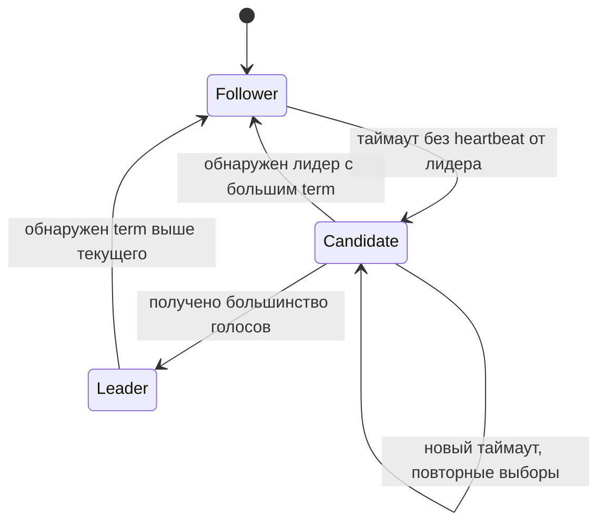

# Алгоритмы выбора лидера в распределённых системах

  ОБЯЗАТЕЛЬНО
  ДЛЯ НОВИЧКОВ

Разработчику
Архитектору

  
Теория данных (раздел 3)

  

  Модель и масштаб — [Основы БД](/encyclopedia/3-data-markup/3-05-osnovy-baz-dannyh/intro), [опорные темы](/encyclopedia/3-data-markup/3-05-osnovy-baz-dannyh/12), [проектирование БД](design/116.md), [пакетная работа](/encyclopedia/3-data-markup/3-11-analiz-dannyh/433). Карта — [о разделе](./intro).
  

В кластере из нескольких узлов часто нужен **один координатор** — узел, который принимает записи, планирует фоновые задачи или хранит "истину" о том, кто сейчас primary. **Выбор лидера** (leader election) — протокол, по которому оставшиеся в строю узлы договариваются, кто этот координатор, когда прежний лидер упал или сеть его изолировала.

Это близко к **консенсусу** (согласию о порядке операций в журнале), но цель уже: сначала выбрать лидера, затем через него или кворум применять изменения. На практике Raft, Paxos и ZAB решают обе задачи в связке.

Контекст CAP, репликации и кворумов — [распределённые системы](design/21.md), [основы NoSQL](/encyclopedia/3-data-markup/3-06-nosql/2), [PACELC](/encyclopedia/8-infra-security/8-05-mikroservisy-i-integratsiya/124). Общая карта тем system design — [System Design — карта тем и подготовка](143.md).

---

## Зачем нужен лидер

| Задача | Без лидера | С лидером |
|--------|------------|-----------|
| Запись в master–replica | Риск двух primary и расхождения данных | Один узел принимает write |
| Failover БД | Ручное переключение | Автоматический выбор нового primary |
| Планировщик в кластере | Все узлы запускают backup одновременно | Задачу выполняет только лидер |
| Координация (блокировки, конфиг) | Гонки и split-brain | Единая упорядоченная очередь решений |

  
Split-brain

  

  Если сеть разделила кластер и **два** узла считают себя лидером, клиенты могут писать в оба — данные разойдутся.

  Алгоритмы консенсуса и кворумы как раз ограничивают такой сценарий: лидером становится только сторона с большинством голосов или подтверждений.

  

Операционные примеры — **Patroni + etcd** для PostgreSQL, **ZooKeeper** для старых стеков Kafka, **KRaft** (Raft) в современном Kafka, **etcd** и **Consul** как хранилища конфигурации с встроенным Raft.

---

## Пять базовых алгоритмов

Ниже — схемы, которые чаще всего встречаются в учебниках и обзорах распределённых БД и координаторов (в духе обзоров вроде ByteByteGo). В продакшене доминируют **Raft** и производные от **Paxos** / **ZAB**; **Bully** и **Ring** полезны для понимания идей, реже — как готовый продукт.

### Сводная таблица

| Алгоритм | Идея выбора лидера | Кворум / голосование | Типичное применение |
|----------|-------------------|----------------------|---------------------|
| **Bully** | Узел с **максимальным числовым ID** | Нет; опрос "старших" соседей | Учебные кластеры, простые координаторы |
| **Ring** | Обход **логического кольца**, побеждает **макс. ID** в сообщении | Нет | Учебные модели, редко в промышленных СУБД |
| **Paxos** | Согласование **значения** (в т.ч. "кто лидер") через раунды propose/accept | **Да** — большинство acceptors | Chubby, основа многих CP-хранилищ |
| **Raft** | **Голосование** кандидатов; большинство голосов → лидер | **Да** — большинство узлов | etcd, Consul, CockroachDB, KRaft |
| **ZAB** | Лидер через **эфемерные последовательные znode** в ZooKeeper | **Да** — кворум followers | Apache ZooKeeper, старые кластеры Kafka |

---

### Bully Algorithm

У каждого узла есть **уникальный числовой приоритет** (ID). Пока жив узел с наибольшим ID, он — лидер.

1. Узел замечает, что текущий лидер не отвечает.
2. Отправляет сообщение **ELECTION** всем узлам с **большим** ID.
3. Если кто-то с большим ID жив, он отвечает и сам запускает выборы; инициатор ждёт.
4. Если ответа нет — инициатор объявляет себя лидером и шлёт **COORDINATOR** остальным.

**Плюсы** — простая логика, быстрый выбор, если "старший" узел стабилен. **Минусы** — при падении узла с максимальным ID вся цепочка опроса повторяется; много сообщений в больших кластерах; приоритет по ID не отражает нагрузку или здоровье узла.

---

### Ring Algorithm

Узлы выстроены в **логическое кольцо** (по списку соседей или хешу). При старте выборов **инициатор** посылает по кольцу сообщение со своим ID. Каждый узел подставляет в сообщение **максимум** из своего ID и уже переданных; когда сообщение обошло круг, всем известен победитель с наибольшим ID — он становится лидером.

Трафик предсказуем (**O(n)** сообщений на раунд), но кольцо уязвимо к разрыву связи между соседями, а восстановление топологии усложняет эксплуатацию по сравнению с Raft.

---

### Paxos

Классический **кворумный** протокол консенсуса. Роли:

- **Proposer** — предлагает значение (например, номер нового лидера или запись в журнал).
- **Acceptor** — голосует за предложения; решение принято, если **большинство** acceptors согласились.
- **Learner** — узнаёт принятое значение и применяет его.

Один раунд Paxos гарантирует согласие на **одно** значение при отказе меньшинства узлов. Для журнала операций запускают серию раундов (**Multi-Paxos**), часто с выделенным лидером (proposer), чтобы не гонять полный протокол на каждую запись.

Paxos математически строг, но сложен в реализации и объяснении; поэтому в индустрии часто берут **Raft** как более понятный эквивалент по целям.

---

### Raft

Raft явно разделяет **выбор лидера** и **репликацию журнала**. Состояния узла:

- **Follower** — принимает записи только от лидера, отвечает на heartbeat.
- **Candidate** — запрашивает голоса у peers в рамках **term** (логического поколения выборов).
- **Leader** — принимает клиентские записи, рассылает их followers, коммитит после **большинства** подтверждений.

Клиенты пишут через лидера; при его падении после таймаута кластер проводит новые выборы. Условие безопасности: в одном term не больше одного лидера с подтверждённым большинством.

**Где встречается:** etcd, HashiCorp Consul, TiKV, CockroachDB, **KRaft** в Apache Kafka, многие NewSQL-СУБД.

---

### ZAB (ZooKeeper Atomic Broadcast)

**ZAB** — протокол **Apache ZooKeeper** для атомарной широковещательной рассылки и согласованного журнала. Выбор лидера связан с иерархией **znode** в дереве координации:

- клиенты создают **эфемерные последовательные** узлы (например, `/election/`);
- узел с **наименьшим порядковым суффиксом** среди живых кандидатов считается лидером;
- при отключении сессии эфемерный узел исчезает — следующий по очереди становится лидером.

Репликация идёт циклом **Propose → ACK → Commit** от лидера к followers; коммит фиксируется при **кворуме** подтверждений.

ZooKeeper даёт CP-хранилище метаданных (конфиг, блокировки, service discovery). Старые кластеры **Kafka** до KRaft использовали ZooKeeper для controller election; сейчас новые развёртывания переходят на **KRaft** (внутри — Raft).

---

## Лидер, кворум и консенсус — как связано

| Понятие | Вопрос, на который отвечает |
|---------|------------------------------|
| **Leader election** | *Кто* сейчас координатор? |
| **Кворум** | Сколько узлов должно подтвердить операцию? Обычно **большинство** из `N` узлов |
| **Консенсус** | *В каком порядке* применять операции, чтобы все реплики сошлись к одному журналу? |

В **Dynamo-стиле** (Cassandra, настраиваемые `W` и `R`) кворум задаётся на **каждую** запись без постоянного лидера — это **безлидерная** репликация с eventual consistency. В **leader-based** модели (PostgreSQL primary, Kafka partition leader) сначала выбирают лидера через Raft/ZAB/Paxos, затем клиент пишет в него.

Подробнее о `W`, `R`, `RF` — [репликация и согласование в NoSQL](/encyclopedia/3-data-markup/3-06-nosql/2#репликация-и-масштабирование). О ведущей и безлидерной репликации — [масштабируемость и параллелизм](2.md).

---

## Практика для разработчика и администратора

| Сценарий | Механизм | Что проверить |
|----------|----------|----------------|
| HA PostgreSQL | Patroni + **etcd** (Raft) | Кворум etcd, `synchronous_standby_names`, RTO/RPO |
| Распределённый lock / конфиг | **etcd**, **Consul**, **ZooKeeper** | Сессии, TTL, не держать долгие блокировки |
| Kafka | **KRaft** или ZooKeeper (legacy) | Версия брокера, `acks=all` для критичных топиков |
| Cron в кластере | `consul lock`, **leader election** в оркестраторе | [Распределённое планирование](/encyclopedia/2-system-network/2-06-sistemnoe-administrirovanie/8) |
| Синхронизация времени | **NTP / Chrony** | Дрейф часов вызывает ложные перевыборы — [инженерия устойчивости](design/2134.md) |

  
Не изобретайте свой Raft

  

  Для прикладного кода достаточно готового координатора (etcd, Consul, ZooKeeper) или встроенного механизма СУБД/брокера.

  Собственная реализация выборов лидера на heartbeat и Redis без кворума легко приводит к split-brain.

  

---

## Что читать дальше

1. [Распределённые системы — CAP, ACID, BASE](design/21.md)
2. [12 концепций распределённой архитектуры](141.md) · [микросервисы — продакшн-стек](design/118.md#prodakshn-stek)
3. [Кластеризация и HA в управлении РСУБД](/encyclopedia/3-data-markup/3-08-upravlenie-rsubd/1.md)
4. [Отказоустойчивость Shared Nothing](design/2117.md)
5. [Глоссарий — выбор лидера](/glossary/В#выбор-лидера)
