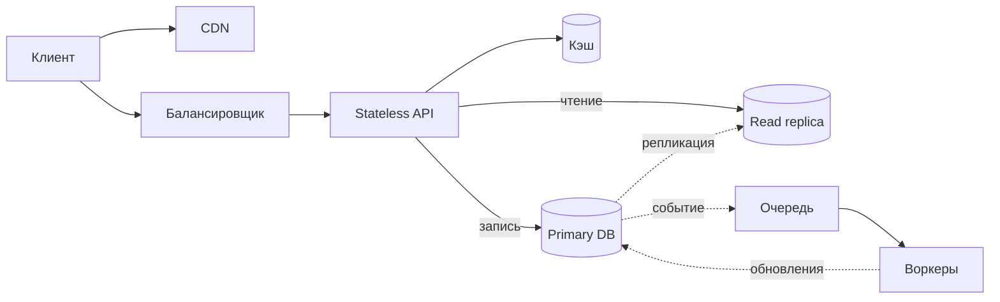
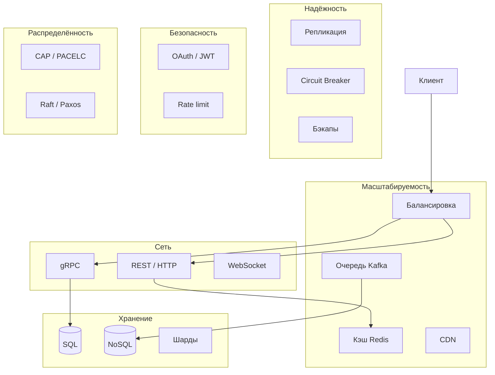

# System Design — карта тем и подготовка

  ОБЯЗАТЕЛЬНО
  ДЛЯ НОВИЧКОВ

Разработчику
Архитектору

  
Теория данных (раздел 3)

  

  Модель и масштаб — [Основы БД](/encyclopedia/3-data-markup/3-05-osnovy-baz-dannyh/intro), [опорные темы](/encyclopedia/3-data-markup/3-05-osnovy-baz-dannyh/12), [проектирование БД](design/116.md), [пакетная работа](/encyclopedia/3-data-markup/3-11-analiz-dannyh/433). Карта — [о разделе](./intro).
  

**System design** — умение спроектировать систему под измеримые требования: сколько пользователей, какой RPS, допустимая задержка, RTO/RPO при сбое, бюджет и сроки команды. На собеседовании и в продакшене от вас ждут не перечисления технологий, а **цепочку решений** с trade-off.

Эта страница — **навигатор** по материалам «Вселенной IT»: шесть опорных блоков (как на типовых cheat sheet), чеклист технологий и порядок чтения. Детали по каждому рычагу — в [12 концепциях](141.md); консенсус и лидер — в [142.md](142.md) и [распределённых системах](design/21.md).

  
С чего начать за 30 минут

  

  Проверьте, что понимаете **задержку и пропускную способность** на уровне HTTP/TCP/DNS — [§ в основах сети](/encyclopedia/2-system-network/2-03-set-i-internet/1#пропускная-способность-и-задержка).

  Затем [12 концепций](141.md) → [NFR в цифрах](design/1116.md) → одна задача из [классических задач design](#pyat-klassicheskih-zadach) с блок-схемой от клиента до БД (для «ложного CRUD» удобна [email-рассылка](144.md)).

  

---

## Порядок изучения — от пакета до Kubernetes

Многие начинают с оркестрации и диаграмм, не понимая, **что происходит с сетевым запросом** и **где лежат данные**. Ниже — порядок, который даёт устойчивую базу; каждый шаг опирается на предыдущий.

| Шаг | Тема | Зачем | Главы энциклопедии |
|-----|------|--------|-------------------|
| 1 | **Сети** | Без HTTP, TCP, DNS и RTT нельзя честно говорить о latency API | [Сеть и интернет — intro](/encyclopedia/2-system-network/2-03-set-i-internet/intro), [TCP/UDP, HTTP, DNS](/encyclopedia/2-system-network/2-03-set-i-internet/4), [задержка и throughput](/encyclopedia/2-system-network/2-03-set-i-internet/1#пропускная-способность-и-задержка), [HTTP-экосистема](/encyclopedia/2-system-network/2-09-osnovy-integratsionnogo-vzaimodeystviya/118) |
| 2 | **Базы данных** | Масштабирование — это прежде всего данные: индексы, репликация, партиционирование; массовые загрузки — batch/chunk | [Опорные темы](/encyclopedia/3-data-markup/3-05-osnovy-baz-dannyh/12), [Основы БД](/encyclopedia/3-data-markup/3-05-osnovy-baz-dannyh/intro), [индексы и план](/encyclopedia/3-data-markup/3-05-osnovy-baz-dannyh/3), [репликация и шардинг](/encyclopedia/3-data-markup/3-08-upravlenie-rsubd/1), [пакетная работа с данными](/encyclopedia/3-data-markup/3-11-analiz-dannyh/433), [проектирование БД](/encyclopedia/7-project/7-06-proektirovanie-i-arhitektura/design/116) |
| 3 | **Кэширование** | Большая доля выигрыша — запросы, которые **вообще не доходят** до БД | [Redis](/encyclopedia/3-data-markup/3-06-nosql/5) (TTL, eviction), [CDN](/encyclopedia/2-system-network/2-04-kak-rabotayut-sayty-i-veb-sayty/112), [141 §2–3](141.md#2-кэширование-caching) |
| 4 | **Очереди и стриминг** | Развязка компонентов и переживание пиков без «укладки» всех серверов | [Брокеры](/encyclopedia/2-system-network/2-09-osnovy-integratsionnogo-vzaimodeystviya/121), [RabbitMQ](/encyclopedia/2-system-network/2-09-osnovy-integratsionnogo-vzaimodeystviya/122), [Kafka](/encyclopedia/2-system-network/2-09-osnovy-integratsionnogo-vzaimodeystviya/123), [SQS в облаке](/encyclopedia/8-infra-security/8-01-oblachnye-tehnologii/intro) |
| 5 | **Балансировка нагрузки** | Горизонтальное масштабирование stateless-сервисов | [141 §1](141.md#1-балансировка-нагрузки-load-balancing), [141 §11](141.md#11-consistent-hashing), [горизонтальное масштабирование](design/2113.md) |
| 6 | **Классические задачи design** | Собрать цепочку руками, а не заучить картинку | [таблица ниже](#pyat-klassicheskih-zadach), [email-рассылка](144.md), [масштабируемость](2.md) |
| 7 | **Разборы инцидентов (postmortem)** | Реальное обучение — чужие отказы: что сломалось и почему | [Лаборатория «Разборы»](/lab/Кейсы/2), [инженерия устойчивости](design/2136.md) |

После шагов 1–5 осмысленно читать [Kubernetes и оркестрацию](/encyclopedia/8-infra-security/8-06-konteynerizatsiya-i-orkestratsiya/intro) — как способ **деплоить** уже понятный контур, а не как замену фундаменту.

---

## Пять инженерных рычагов

Любой trade-off в распределённой системе сводится к балансу пяти величин. Их стоит называть вслух на собеседовании и в ADR.

| Рычаг | Вопрос архитектору | Пример компромисса |
|-------|-------------------|-------------------|
| **Latency** | Как быстро пользователь получает ответ? | Кэш и CDN снижают p99; синхронная репликация на все узлы увеличивает задержку записи |
| **Durability** | Сохранятся ли данные после сбоя? | WAL и реплики; асинхронная репликация быстрее, но риск потери последних секунд |
| **Throughput** | Сколько операций в секунду выдержит система? | Шардинг, очереди, read-реплики; узкое место часто — одна горячая партиция |
| **Availability** | Работает ли сервис при падении узла? | AP в CAP для ленты; CP для платежного ядра |
| **Cost** | Сколько стоят железо, трафик и люди? | «Всё в Redis» дорого по RAM; cold storage дешевле, но выше latency чтения |

Связь с CAP/PACELC — [распределённые системы](design/21.md); измеримые цели — [NFR](design/1116.md).

---

## Типовой контур масштабируемой системы

На собеседованиях и в продакшене снова и снова встречается одна и та же **скелетная схема** (иногда её называют «90% scalable systems»). Компоненты и потоки данных:

1. **Клиент** (браузер, мобильное приложение) обращается к **CDN** за статикой — CSS, JS, изображения — с edge-узла ближе к пользователю.
2. Динамические запросы идут на **балансировщик**, который распределяет нагрузку и отсекает нездоровые инстансы.
3. **Слой приложения** — **stateless** API (бизнес-логика): горизонтально масштабируется; сессии и состояние — во внешнем хранилище.
4. **Кэш** (часто Redis) — горячие ключи без чтения БД на каждый запрос.
5. **Primary БД** — источник истины для **записи**; **read replica** — для масштабирования **чтения** (отчёты, ленты, редиректы).
6. После успешной записи в БД (или через CDC/outbox) — **событие в очередь**; **воркеры** обрабатывают тяжёлую работу (письма, аналитика, пересчёт ленты) и при необходимости снова пишут в primary.

Детали по каждому блоку — в [12 концепциях](141.md) и [девяти компонентах продакшн-стека MSA](design/118.md#prodakshn-stek).

---

## Шесть столпов и ссылки в энциклопедии

| Столп | Суть | Ключевые темы | Где углубиться |
|-------|------|---------------|----------------|
| **Масштабируемость** | Система растёт по нагрузке и объёму данных | Балансировка, кэш, CDN, очереди, autoscaling, шардирование | [141 §1–4, 9, 12](141.md), [масштабируемость](2.md), [горизонтальное масштабирование](design/2113.md) |
| **Надёжность** | Работа при сбоях узлов и зависимостей | Репликация, failover, бэкапы, circuit breaker, retry с лимитом | [ошибки и исключения](/encyclopedia/4-code-dev/4-06-arhitektura-vypolneniya/111), [инженерия устойчивости](design/2136.md), [SLA](design/2135.md), [РСУБД — репликация](/encyclopedia/3-data-markup/3-08-upravlenie-rsubd/1.md) |
| **Сетевые протоколы** | Как компоненты обмениваются данными | HTTP/HTTPS, TCP/IP, REST, gRPC, WebSocket | [HTTP-экосистема](/encyclopedia/2-system-network/2-09-osnovy-integratsionnogo-vzaimodeystviya/118), [REST, GraphQL и gRPC](/encyclopedia/2-system-network/2-09-osnovy-integratsionnogo-vzaimodeystviya/130), [WebSocket](/encyclopedia/2-system-network/2-04-kak-rabotayut-sayty-i-veb-sayty/129) |
| **Хранение** | Где и как лежат данные | SQL и NoSQL, индексы, партиционирование, шардирование | [основы БД](/encyclopedia/3-data-markup/3-05-osnovy-baz-dannyh/intro), [NoSQL](/encyclopedia/3-data-markup/3-06-nosql/intro), [проектирование БД](design/116.md) |
| **Безопасность** | Кто вы и что вам можно | Аутентификация, авторизация, шифрование, rate limiting | [аутентификация и OAuth](/encyclopedia/2-system-network/2-08-osnovy-informatsionnoy-bezopasnosti/111), [OAuth в API](design/1171.md), [141 §10 — rate limit](141.md#10-rate-limiting) |
| **Распределённость** | Несколько узлов и согласованность | CAP/PACELC, консенсус, выбор лидера | [design/21.md](design/21.md), [142.md](142.md), [PACELC](/encyclopedia/8-infra-security/8-05-mikroservisy-i-integratsiya/124) |

---

## Чеклист технологий из практики и собеседований

Ниже — темы, которые чаще всего встречаются в system design (в духе обзоров вроде [JavaRevisited cheat sheet 2025](https://medium.com/javarevisited/system-design-interview-cheat-sheet-2025-edition-key-concepts-books-courses-resources-2b582cd6ecd3)). Каждая строка ведёт в нашу главу.

| Тема | Зачем на схеме | Глава |
|------|----------------|-------|
| **Архитектура масштабируемых систем** | Горизонтальное масштабирование, stateless, NFR | [2.md](2.md), [design/119.md](design/119.md), [веб-стек](/encyclopedia/2-system-network/2-04-kak-rabotayut-sayty-i-veb-sayty/1) |
| **Балансировка нагрузки** | Распределение RPS, health-check | [141 §1](141.md#1-балансировка-нагрузки-load-balancing) |
| **Кэширование (Redis)** | Снижение latency и нагрузки на БД | [Redis](/encyclopedia/3-data-markup/3-06-nosql/5), [141 §2](141.md#2-кэширование-caching) |
| **Очереди (Kafka, RabbitMQ)** | Асинхронность, сглаживание пиков, события | [брокеры](/encyclopedia/2-system-network/2-09-osnovy-integratsionnogo-vzaimodeystviya/121), [Kafka](/encyclopedia/2-system-network/2-09-osnovy-integratsionnogo-vzaimodeystviya/123), [MSA — Kafka](/encyclopedia/8-infra-security/8-05-mikroservisy-i-integratsiya/119) |
| **SQL и NoSQL** | Структура, транзакции, гибкая схема, горизонтальный рост | [сравнение](/encyclopedia/3-data-markup/3-05-osnovy-baz-dannyh/2), [NoSQL intro](/encyclopedia/3-data-markup/3-06-nosql/intro) |
| **Шардирование и репликация** | Ёмкость и отказоустойчивость данных | [141 §9](141.md#9-шардирование-sharding), [управление РСУБД](/encyclopedia/3-data-markup/3-08-upravlenie-rsubd/1.md) |
| **REST и gRPC** | Публичный API и быстрые вызовы между сервисами | [130](/encyclopedia/2-system-network/2-09-osnovy-integratsionnogo-vzaimodeystviya/130) |
| **WebSocket** | Двусторонний канал, чаты, live-обновления | [129](/encyclopedia/2-system-network/2-04-kak-rabotayut-sayty-i-veb-sayty/129), [практикум REST и WebSocket](/encyclopedia/8-infra-security/8-08-praktikum-rest-i-websocket/intro) |
| **CDN** | Статика и edge ближе к пользователю | [веб-серверы и CDN](/encyclopedia/2-system-network/2-04-kak-rabotayut-sayty-i-veb-sayty/112), [141 §3](141.md#3-cdn-content-delivery-network) |
| **CQRS** | Разные модели для записи и чтения | [2122.md](design/2122.md), [MSA — CQRS](design/118.md) |
| **Event Sourcing** | Журнал событий как источник истины, проекции для чтения | [2123.md](design/2123.md) |
| **Event-driven** | Слабая связность через события | [2127.md](design/2127.md), [design/21.md](design/21.md) |
| **Микросервисы и монолит** | Границы деплоя и команды | [101.md](101.md), [модульный монолит](design/2126.md), [паттерны MSA](design/118.md) |
| **Circuit breaker** | Защита при падении зависимости | [141 §7](141.md#7-circuit-breaker-предохранитель), [2136.md](design/2136.md) |
| **Leader election (Raft, Paxos)** | Один координатор записи в кластере | [142.md](142.md) |
| **OAuth, JWT** | Вход и доступ к API | [111](/encyclopedia/2-system-network/2-08-osnovy-informatsionnoy-bezopasnosti/111), [1171.md](design/1171.md) |
| **Rate limiting** | Защита API от злоупотреблений | [141 §10](141.md#10-rate-limiting) |

---

## Стили архитектуры — когда что звучит на схеме

| Вопрос на собеседовании | Короткий ответ | Углубление |
|-------------------------|----------------|------------|
| Монолит или микросервисы? | Сначала измеримые NFR и границы команд; микросервисы — цена сети и согласованности | [2126](design/2126.md), [118](design/118.md), [104 — декомпозиция](104.md) |
| Синхронно или через события? | Синхронно — когда нужен немедленный ответ; события — для развязки и пиков | [117](design/117.md), [Outbox](design/2124.md) |
| CQRS нужен? | Когда чтение и запись сильно различаются по нагрузке и схеме | [2122](design/2122.md) |
| Event Sourcing? | Аудит, replay, несколько read-моделей из одного лога | [2123](design/2123.md) |
| Одна БД или у каждого сервиса своя? | В MSA — database per service; согласованность через Saga и события | [118](design/118.md), [2124 Saga](design/2124.md) |

  
Продакшн-контур MSA

  

  Девять типовых компонентов (gateway, registry, auth, БД, кэш, брокер, метрики, логи) — в [паттернах микросервисной архитектуры](design/118.md#prodakshn-stek).

  Их удобно накладывать на ответ system design после блок-схемы запроса.

  

---

## Каркас ответа на system design interview

Типичные **45–60 минут** делят так (названия шагов могут отличаться у интервьюера):

| Этап | Время | Что сделать |
|------|-------|-------------|
| **Уточнение требований** | 5–10 мин | Функции (MVP), **NFR** (DAU, RPS, p99 latency, объём данных, RPO), ограничения (бюджет, регион) |
| **Оценки (back-of-the-envelope)** | 5 мин | QPS, объём хранилища, пропускная способность сети; порядок величин достаточен |
| **High-level design** | 15–20 мин | Клиент → CDN → gateway → сервисы → кэш/БД/очередь; подписать sync/async |
| **Deep dive** | 15–20 мин | 1–2 узких места: шардирование, кэш, консистентность, отказ узла |
| **Узкие места и trade-off** | 5 мин | Single point of failure, hot key, split-brain, кэш-инвалидация |

Полезные якоря из раздела:

- NFR формулировать измеримо — [design/1116.md](design/1116.md)
- Оценка альтернатив — [design/2141.md](design/2141.md)
- Workshop по домену — [Event Storming](design/2140.md)

---

## Классические задачи system design

Прорисуйте каждую задачу по [каркасу собеседования](#karkas-ответa-na-system-design-interview) выше: NFR → оценки → high-level → deep dive. Полный разбор URL shortener — в [масштабируемости и параллелизме](2.md#2-url-shortener-сервис-укорочения-ссылок). Развёрнутый разбор **email-канала** (bounces, DMARC, state machine) — в [144.md](144.md).

| Задача | Доминирующая нагрузка | Ключевые приёмы | Куда углубиться |
|--------|----------------------|-----------------|----------------|
| **Сервис коротких URL** | Чтение (редирект) >> запись | Кэш по коду, KV-хранилище, шард по hash, аналитика кликов в очередь | [2.md § URL shortener](2.md#2-url-shortener-сервис-укорочения-ссылок), [пример ниже](#primer-servis-korotkih-url) |
| **Rate limiter** | Очень частые проверки лимита | Счётчик в Redis, token/leaky bucket, gateway или middleware | [141 §10](141.md#10-rate-limiting), [Redis — rate limiter](/encyclopedia/3-data-markup/3-06-nosql/5#rate-limiter-sliding-window-log) |
| **Чат** | Много долгих соединений, fan-out сообщений | WebSocket/SSE, шард по `room_id`, очередь на доставку офлайн-пользователям | [WebSocket](/encyclopedia/2-system-network/2-04-kak-rabotayut-sayty-i-veb-sayty/129), [практикум REST и WebSocket](/encyclopedia/8-infra-security/8-08-praktikum-rest-i-websocket/intro) |
| **Лента (news feed / timeline)** | Чтение ленты, тяжёлая запись «пост опубликован» | Fan-out on write или on read, кэш ленты, precomputed timelines в Redis | [design/21.md — AP для ленты](design/21.md), [CQRS](design/2122.md), [событийная архитектура](design/2127.md) |
| **Система уведомлений** | Всплески, много каналов (push, email, SMS) | Очередь по типу канала, идемпотентность, retry, шаблоны и предпочтения пользователя | [брокеры](/encyclopedia/2-system-network/2-09-osnovy-integratsionnogo-vzaimodeystviya/121), [pub/sub в 141 §5](141.md#5-publish–subscribe) |
| **Email-рассылка / newsletter** | Всплеск при Send, медленная внешняя доставка | Outbox, worker pool, state machine, suppression, webhooks bounces, SPF/DKIM | [144.md](144.md), [пример ниже](#primer-servis-email-rassylki) |

### Пример — сервис коротких URL

Краткая демонстрация каркаса (без полного расчёта).

**Требования (пример).** 100M URL в месяц, чтение в 100 раз чаще записи, редирект p99 менее 100 ms, срок жизни ссылки опционален.

**High-level.** Клиент → балансировщик → stateless **API** → **кэш** (Redis) по short code → при промахе **read replica** или шард (hash кода). Запись — генерация кода, INSERT в **primary**, прогрев кэша. Клики — асинхронно в **Kafka** → агрегаты.

**Deep dive.** Snowflake/base62; коллизии — retry; hot URL — отдельный ключ в кэше; при partition сети — доступность редиректа с eventual учётом кликов.

Похожие разборы — [design/119.md](design/119.md) (веб), [имитационное моделирование](1161.md).

### Пример — сервис email-рассылки

Краткая демонстрация каркаса (полная схема — [144.md](144.md)).

**Требования (пример).** 500k подписчиков, кампания «разослать за 30 минут», p99 постановки в очередь менее 2 с, дубликат письма одному адресату недопустим, hard bounce больше не получает писем.

**High-level.** Админка → **API** → запись кампании и строк `campaign_recipient` в **primary** + строки **outbox** в одной транзакции → relay кладёт задачи в **очередь** → **воркеры** → **SES/SendGrid** → webhook `bounce`/`complaint` обновляет suppression. Open/unsubscribe — отдельные лёгкие HTTP-сервисы.

**Deep dive.** Идемпотентный ключ `(campaign_id, recipient_id)`; per-MX throttle; отдельная DLQ для poison messages; метрики глубины очереди и complaint rate; SPF/DKIM/DMARC до первого массового Send.

**Типичный сбой.** Воркер упал после `accepted` у ESP, до UPDATE в БД — при повторе задачи статус уже `accepted`, повторной отправки нет ([идемпотентность](design/213.md)).

---

## Учёба на чужих сбоях

Postmortem — документ после инцидента: симптом, root cause, mitigation, fix, профилактика. Чтение публичных разборов (AWS, GitHub, Cloudflare, Statuspage компаний) учит видеть **цепочку отказа**, а не отдельную «упавшую кнопку».

| Что смотреть в разборе | Зачем |
|------------------------|--------|
| Граница системы и зависимости | Понять, какой компонент был SPOF |
| Метрики до и во время сбоя | Связать latency/RPS/error rate с действиями |
| Что сработало в mitigation | Runbook, откат, feature flag, drain очереди |
| Пункты профилактики | Часто — кэш, лимиты, тесты на отказ узла |

Шаблон и термины — [лаборатория «Разборы»](/lab/Кейсы/2). Связь с надёжностью — [инженерия устойчивости](design/2136.md), [SLA](design/2135.md).

---

## Маршрут чтения по уровню

**Базовый (1–2 недели)** — следуйте [порядку изучения](#poriadok-izucheniia) сверху вниз:

1. Сети — [2.03 intro](/encyclopedia/2-system-network/2-03-set-i-internet/intro), [§4](/encyclopedia/2-system-network/2-03-set-i-internet/4), [HTTP](/encyclopedia/2-system-network/2-09-osnovy-integratsionnogo-vzaimodeystviya/118)
2. БД — [3.05 intro](/encyclopedia/3-data-markup/3-05-osnovy-baz-dannyh/intro), [3.08 репликация](/encyclopedia/3-data-markup/3-08-upravlenie-rsubd/1)
3. Кэш и CDN — [Redis](/encyclopedia/3-data-markup/3-06-nosql/5), [141 §2–3](141.md)
4. Очереди — [121](/encyclopedia/2-system-network/2-09-osnovy-integratsionnogo-vzaimodeystviya/121) · [141 §4–5](141.md)
5. [141.md](141.md) целиком → одна [классическая задача](#pyat-klassicheskih-zadach)
6. [Аутентификация](/encyclopedia/2-system-network/2-08-osnovy-informatsionnoy-bezopasnosti/111)

**Продвинутый**

1. [design/21.md](design/21.md) · [142.md](142.md)
2. [design/118.md](design/118.md) · [2136.md](design/2136.md)
3. [Микросервисы — intro](/encyclopedia/8-infra-security/8-05-mikroservisy-i-integratsiya/intro) · [Kubernetes](/encyclopedia/8-infra-security/8-06-konteynerizatsiya-i-orkestratsiya/intro)
4. [Итоги](998.md) · [чек-лист](999.md) · [разборы инцидентов](/lab/Кейсы/2)

---

## Внешние ресурсы

- [System Design Interview Cheat Sheet (2025)](https://medium.com/javarevisited/system-design-interview-cheat-sheet-2025-edition-key-concepts-books-courses-resources-2b582cd6ecd3) — обзор тем, книг и курсов (англ.)
- Классика: *Designing Data-Intensive Applications* (Kleppmann) — хранение и распределённость; *System Design Interview* (Xu) — формат собеседований

В энциклопедии те же идеи разложены по главам с привязкой к стеку проекта и соседним разделам (сеть, БД, DevOps, ИБ).

---

## См. также

- [12 концепций распределённой архитектуры](141.md)
- [Email-рассылка как распределённая система](144.md)
- [Алгоритмы выбора лидера](142.md)
- [Проектирование и архитектура — о разделе](intro.md)
- [Проектирование — о разделе](design/intro.md)
