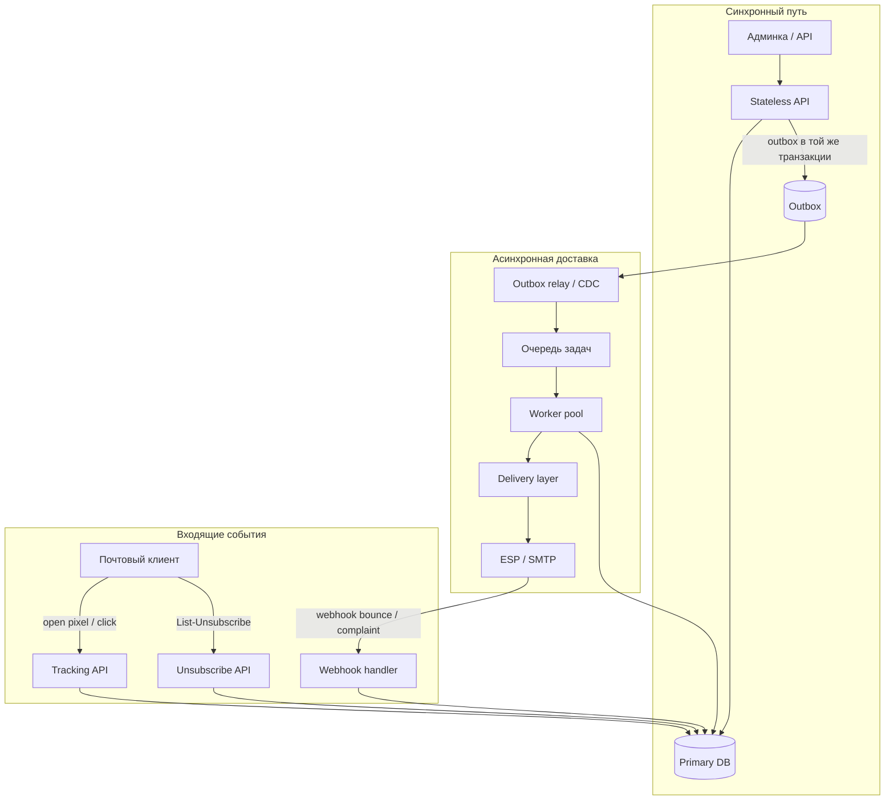
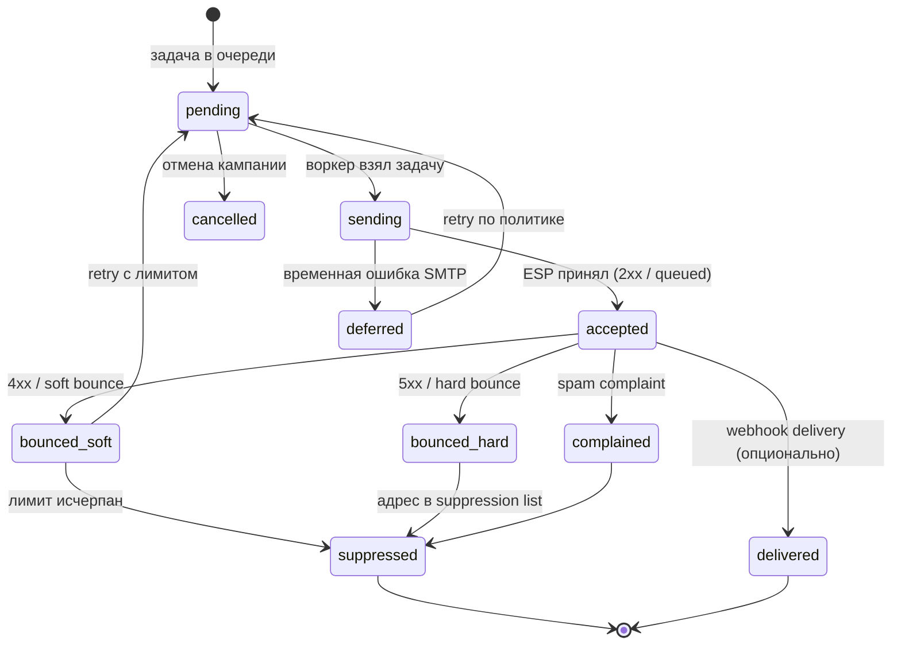

# Email-рассылка как распределённая система

  ОБЯЗАТЕЛЬНО
  ДЛЯ НОВИЧКОВ

Разработчику
Архитектору

На бумаге сервис рассылки выглядит как три сущности: **список адресов**, **кампания**, кнопка **Send**. На практике доставка почты — это асинхронная интеграция с внешними MTA (Gmail, Outlook, корпоративный Exchange), где ошибки приходят с задержкой, повторная отправка опасна, а «успех» в API провайдера ещё не значит попадание во входящие.

Эта глава собирает типичный **продакшн-контур** в одном месте: для system design, для code review и как мост между [SMTP в коде](/encyclopedia/5-languages/5-02-python/34.md) и [картой system design](143.md). Сквозной пример в формате собеседования — [ниже в 143](143.md#primer-servis-email-rassylki).

  
Откуда кейс

  

  Такой контур встречается в транзакционной почте (сброс пароля, чеки), в newsletter-платформах и в open-source вроде [Camp](https://github.com/codersgyan/camp) (Go).

  Продукты различаются UI и фичами, а инженерные задачи доставки — одни и те же.

  

---

## Ложный CRUD и реальная граница системы

| Слой, который видит продукт | Что происходит в инфраструктуре |
|-----------------------------|----------------------------------|
| Сохранить подписчиков в БД | Валидация, double opt-in, согласие на обработку данных |
| Создать кампанию и нажать Send | Постановка N×M задач в очередь, лимиты, state machine |
| «Письмо отправлено» в UI | Принято ESP/SMTP; доставка и открытие — отдельные события |
| Статистика открытий | Отдельные HTTP endpoints, боты, блокировщики трекеров |

Пока рассылка идёт на десяток адресов через один SMTP-ящик, хватает скрипта. После выхода в прод с тысячами получателей и разными доменами `@gmail.com` / `@company.com` появляются **очередь**, **пул воркеров**, **слой доставки** (адаптер к SES, SendGrid, Mailgun, Postmark или своему MTA) и **конечный автомат** на каждое письмо или пару «кампания + получатель».

---

## Типовая архитектура

**API** принимает «запустить кампанию», фиксирует намерение в БД и **не** шлёт письма в HTTP-запросе. **Outbox** ([паттерн](/encyclopedia/7-project/7-06-proektirovanie-i-arhitektura/design/2124.md)) гарантирует, что запись о кампании и задача в очереди появятся вместе. **Воркеры** масштабируются отдельно; их узкое место — лимиты ESP и репутация домена, а не CPU API.

Скелет «API → primary → очередь → воркеры» — тот же, что в [типовом контуре system design](143.md#tipovoi-kontur) и [§4 очередей](141.md#4-очередь-сообщений-message-queue).

---

## Конечный автомат сообщения

Статус хранят на уровне **отправки одному получателю** (или одного message id), а не только на уровне кампании «в целом».

| Статус | Смысл для продукта |
|--------|-------------------|
| `pending` / `sending` | Можно показывать «в очереди»; при падении воркера задача возвращается в очередь |
| `accepted` | Провайдер принял; во «входящие» письмо может не попасть (спам, DMARC) |
| `bounced_hard` | Адрес недействителен — **больше не слать** без ручной проверки |
| `bounced_soft` | Временный отказ — ограниченный retry |
| `suppressed` | Глобальный запрет на адрес (bounce, complaint, ручной unsubscribe) |
| `complained` | Жалоба «спам» — хуже hard bounce для репутации домена |

Кампания в UI — агрегат: `sent = count(delivered) + count(accepted)`, `failed = count(suppressed) + count(bounced_hard)`.

---

## Bounces и suppression list

**Bounce** — уведомление о недоставке: SMTP-ответ при отправке или **asynchronous bounce** (отдельное письмо от MTA получателя на ваш bounce-адрес / webhook ESP).

| Тип | Типичные причины | Политика |
|-----|-----------------|----------|
| **Hard bounce** | Несуществующий ящик, домен не принимает почту | Сразу в suppression; retry бессмысленен |
| **Soft bounce** | Почтовый ящик переполнен, greylisting, временный 4xx | Exponential backoff, cap попыток (например 3–5 за 72 ч) |
| **Complaint** | Пользователь нажал «Спам» у провайдера | Немедленный suppress; расследование контента и частоты |

**Suppression list** — отдельное хранилище (таблица или Redis set) email-адресов и доменов, куда **ни одна** кампания больше не ставит задачу. Проверка выполняется **до** постановки в очередь и **перед** вызовом delivery layer.

  
Повторная отправка на hard bounce

  

  Каждая попытка бьёт по **репутации отправляющего домена** (sender score).

  ESP могут ограничить или заблокировать аккаунт.

  Suppression — часть устойчивости, а не «удобство CRM».

  

---

## Retry policy

Retry относится к **инженерии устойчивости** ([design/2136](design/2136.md)), а не к циклу `for` вокруг `sendmail`.

| Ситуация | Retry? | Заметка |
|----------|--------|---------|
| Таймаут к ESP, 5xx провайдера | Да | С jitter и max attempts |
| Soft bounce | Да | С увеличением интервала |
| Hard bounce, complaint | Нет | Только suppress |
| Успешный `accepted`, потом duplicate worker | Нет повторной отправки | Нужна **идемпотентность** (ниже) |
| Rate limit 421 / 450 от Gmail | Да | С **глобальным** throttle по домену получателя |

Повторять имеет смысл только **идемпотентные** шаги ([design/213](design/213.md)): «поставить задачу», «отметить accepted», но не «отправить письмо без ключа дедупликации».

---

## Идемпотентность и сбой воркера

Типичный инцидент: воркер отправил письмо через ESP, упал **до** commit статуса в БД; при рестарте очередь отдаёт задачу снова — пользователь получает **дубликат**.

Защита:

1. **Уникальный ключ отправки** — `(campaign_id, recipient_id)` или `message_id` (UUID), передаётся в ESP как idempotency key / custom header, где API это поддерживает.
2. **Состояние «sending» с lease** — только один воркер держит lock на строку; по TTL lock снимается для recovery.
3. **At-least-once очередь** ([брокеры](/encyclopedia/2-system-network/2-09-osnovy-integratsionnogo-vzaimodeystviya/121)) + идемпотентный consumer: повторная доставка задачи не создаёт второе письмо, если статус уже `accepted` или выше. Модель **effectively exactly-once** — [Идемпотентность и семантика доставки](/encyclopedia/2-system-network/2-09-osnovy-integratsionnogo-vzaimodeystviya/133).

Транзакционный **outbox** связывает «кампания запущена» и «задачи созданы»; без него возможны кампании без писем или письма без записи в БД.

---

## SPF, DKIM, DMARC — «тихая» недоставка

Ошибки аутентификации редко ломают ваш API. Письмо уходит, а попадает в **спам** или отбрасывается на стороне получателя.

| Механизм | Где настраивается | Что проверяет получатель |
|----------|-------------------|---------------------------|
| **SPF** | DNS TXT у домена отправителя | Разрешён ли этот IP/хост слать от имени домена |
| **DKIM** | DNS TXT + подпись заголовков письма | Целостность письма и соответствие домену |
| **DMARC** | DNS TXT | Политика при несовпадении SPF/DKIM (none / quarantine / reject) + отчёты |

Записи `TXT` для SPF/DKIM — в [настройке DNS](/encyclopedia/2-system-network/2-04-kak-rabotayut-sayty-i-veb-sayty/112#2-настройка-dns); порты submission — в [справочнике почты](/encyclopedia/2-system-network/2-03-set-i-internet/618#pochta).

  
Практика для разработчика

  

  На staging проверяйте заголовки `Authentication-Results`, отчёты DMARC в почте администратора и тестовые ящики (mail-tester, встроенные postmaster-консоли Gmail/Outlook).

  Метрика «accepted от ESP» без мониторинга spam rate обманывает дашборд.

  

---

## Throttling и домен получателя

Лимиты бывают на трёх уровнях:

| Уровень | Пример | Реакция |
|---------|--------|---------|
| Ваш API / воркеры | 1000 задач/с | Token bucket на enqueue |
| ESP (SES, SendGrid) | N писем/сек на аккаунт | Очередь + backoff |
| Почтовый провайдер получателя | Gmail: плавный ramp для нового домена | **Per-domain** лимитер (`gmail.com`, `outlook.com`) |

Один глобальный `sleep(1)` между письмами не спасает: домен `small-corp.ru` может принимать быстро, а Gmail — нет. Часто вводят **несколько очередей или rate-limit keys** по MX-домену получателя.

Связь с [rate limiting в архитектуре](141.md#10-rate-limiting) и [троттлингом в администрировании](/encyclopedia/2-system-network/2-06-sistemnoe-administrirovanie/9#троттлинг).

---

## Webhooks от ESP

Провайдеры шлют HTTP POST о событиях: `delivered`, `bounced`, `complained`, `opened` (если включено на их стороне). Это тот же паттерн, что [входящие webhooks](/encyclopedia/7-project/7-06-proektirovanie-i-arhitektura/design/1171.md):

- проверка **подписи** (HMAC shared secret);
- **идемпотентность** по `event_id` провайдера;
- быстрый `200 OK` и обработка в фоне (очередь), чтобы не истекал timeout повторов у ESP;
- защита от replay (timestamp + nonce).

Обработчик обновляет state machine и suppression list; без него soft/hard bounce из реального мира не попадут в вашу БД.

---

## Open tracking, клики и отписка

| Функция | Реализация | Риски |
|---------|------------|-------|
| Open tracking | Пиксель `1×1` на вашем HTTPS | Блокировщики, превью почтовых клиентов, завышенные «открытия» |
| Click tracking | Редирект через ваш домен | Сломанные ссылки при падении трекера; нужен fallback |
| Unsubscribe | Заголовок `List-Unsubscribe` + URL + опционально `mailto:` | Юридические требования (CAN-SPAM, GDPR); отписка должна работать **без логина** по подписанному токену |

Эндпоинты трекинга и отписки — отдельная поверхность атаки (подбор токенов, DDoS). Нужны rate limit, короткий TTL токена, логирование без PII в открытом виде.

Транзакционные письма (сброс пароля) обычно **без** marketing open-tracker; маркетинговые — с явным согласием в [коммуникациях и GDPR](/encyclopedia/1-basics/1-22-kommunikatsiya-i-obschenie/6.md).

---

## Слой доставки — свой SMTP или ESP

| Подход | Когда уместен | Что вы всё равно пишете сами |
|--------|---------------|------------------------------|
| **ESP** (SES, SendGrid, Mailgun, Postmark) | Почти всегда в прод | Очередь, state machine, webhooks, suppression |
| **Свой MTA** (Postfix + IP, warmup) | Крупный объём, своя доставляемость | Репутация IP, bounce mailbox, FBL, мониторинг blacklists |
| **smtplib в приложении** | Прототип, внутренние уведомления | Throttling, retry, bounces — вручную |

В [Python-главе](/encyclopedia/5-languages/5-02-python/34.md) разобраны SMTP-коды и bulk-отправка; для продакшн-объёма там же указан переход на очередь и ESP с готовыми bounces.

---

## Наблюдаемость

Метрики, без которых рассылку слепо эксплуатировать:

| Метрика | Зачем |
|---------|--------|
| Глубина очереди / age of oldest message | Задержка кампании, нехватка воркеров |
| Отправок/сек по MX-домену | Поймать ban от Gmail |
| Доля hard/soft bounce, complaint rate | Репутация домена |
| Retry count, DLQ size | Политика устойчивости |
| Расхождение `accepted` vs webhook `delivered` | Проблемы auth / спам |

Алерты — на рост complaint rate и DLQ, а не только на 5xx API.

---

## Чек-лист для system design interview

Краткий порядок ответа (полный каркас — [143](143.md#karkas-ответa-na-system-design-interview)):

1. **NFR** — писем/день, допустимая задержка кампании, нужна ли exactly-once доставка письма пользователю.
2. **High-level** — API + DB + outbox + очередь + workers + ESP; webhooks обратно.
3. **Deep dive** — state machine, suppression, идемпотентность, per-domain throttle.
4. **Отказы** — падение ESP (circuit breaker, пауза кампании), дубликаты при retry воркера.
5. **Compliance** — unsubscribe, хранение согласий, разделение transactional / marketing.

---

## См. также

- [System Design — карта тем](143.md) · [классические задачи](143.md#pyat-klassicheskih-zadach)
- [12 концепций](141.md) · [инженерия устойчивости](design/2136.md)
- [Transactional outbox](design/2124.md) · [идемпотентность](design/213.md)
- [Публичный API и webhooks](design/1171.md)
- [Порты и протоколы почты](/encyclopedia/2-system-network/2-03-set-i-internet/618#pochta)
- [Отправка писем из Python](/encyclopedia/5-languages/5-02-python/34.md)
