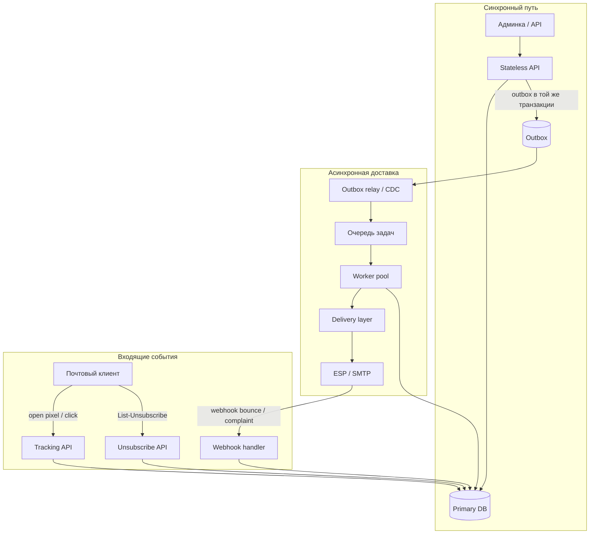
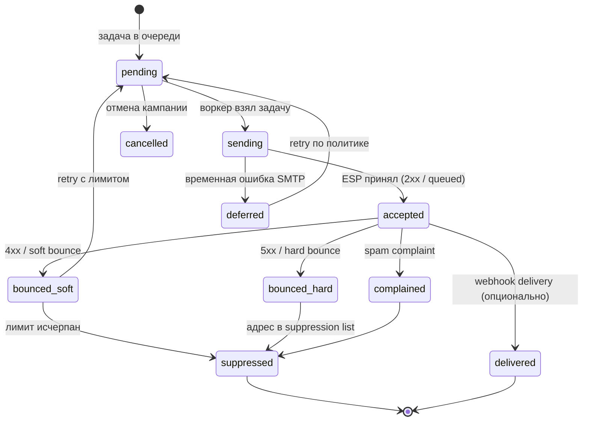

# Email-рассылка как распределённая система

  ОБЯЗАТЕЛЬНО
  ДЛЯ НОВИЧКОВ

Разработчику
Архитектору

  
Теория данных (раздел 3)

  

  Модель и масштаб — [Основы БД](/encyclopedia/3-data-markup/3-05-osnovy-baz-dannyh/intro), [опорные темы](/encyclopedia/3-data-markup/3-05-osnovy-baz-dannyh/12), [проектирование БД](design/116.md), [пакетная работа](/encyclopedia/3-data-markup/3-11-analiz-dannyh/433). Карта — [о разделе](./intro).
  

Email представляет собой электронное письмо, которое является основным элементом цифровой коммуникации, предназначенным для обмена структурированными сообщениями между отправителем и одним или несколькими получателями через сети, использующие протоколы передачи данных, при этом каждое письмо содержит заголовок с метаданными, включая адреса отправителя и получателя, тему, временные метки и маршрутную информацию, а также тело, которое может содержать текстовый контент, гипертекстовую разметку, вложенные файлы и мультимедийные элементы, что делает его универсальным инструментом как для личной переписки, так и для массовых бизнес-коммуникаций.

Email-рассылка представляет собой процесс целенаправленной отправки серии электронных писем значительному количеству подписчиков или сегментированной аудитории, который обычно организуется с использованием специализированных платформ или программных решений, позволяющих управлять списками контактов, создавать шаблоны сообщений, планировать время отправки и отслеживать результаты взаимодействия, при этом рассылка может принимать формы информационных бюллетеней, рекламных акций, транзакционных уведомлений, триггерных цепочек или персонализированных рекомендаций, и её эффективность напрямую зависит от релевантности контента, качества базы подписчиков и соблюдения технических и юридических норм.

На бумаге сервис рассылки выглядит как три сущности — **список адресов**, **кампания**, кнопка **Send**. На практике доставка почты — это асинхронная интеграция с внешними MTA (Gmail, Outlook, корпоративный Exchange), где ошибки приходят с задержкой, повторная отправка опасна, а "успех" в API провайдера ещё не значит попадание во входящие.

Эта глава собирает типичный **продакшн-контур** в одном месте: для system design, для code review и как мост между [SMTP в коде](/encyclopedia/5-languages/5-02-python/34.md) и [картой system design](143.md). Сквозной пример в формате собеседования — [ниже в 143](143.md#primer-servis-email-rassylki).

  
Откуда кейс

  

  Такой контур встречается в транзакционной почте (сброс пароля, чеки), в newsletter-платформах и в open-source вроде [Camp](https://github.com/codersgyan/camp) (Go).

  Продукты различаются UI и фичами, а инженерные задачи доставки — одни и те же.

  

---

## Ложный CRUD и реальная граница системы

| Слой, который видит продукт | Что происходит в инфраструктуре |
|-----------------------------|----------------------------------|
| Сохранить подписчиков в БД | Валидация, double opt-in, согласие на обработку данных |
| Создать кампанию и нажать Send | Постановка N×M задач в очередь, лимиты, state machine |
| "Письмо отправлено" в UI | Принято ESP/SMTP; доставка и открытие — отдельные события |
| Статистика открытий | Отдельные HTTP endpoints, боты, блокировщики трекеров |

Пока рассылка идёт на десяток адресов через один SMTP-ящик, хватает скрипта. После выхода в прод с тысячами получателей и разными доменами `@gmail.com` / `@company.com` появляются **очередь**, **пул воркеров**, **слой доставки** (адаптер к SES, SendGrid, Mailgun, Postmark или своему MTA) и **конечный автомат** на каждое письмо или пару "кампания + получатель".

Double opt-in представляет собой двухэтапный механизм подтверждения подписки, который требует от пользователя не только первичного выражения заинтересованности путём заполнения формы или нажатия кнопки, но и последующего обязательного подтверждения своего намерения через переход по уникальной ссылке, отправленной на указанный адрес электронной почты, что гарантирует, что владелец почтового ящика действительно осознанно и добровольно соглашается на получение рассылок, и этот подход служит надёжной защитой от ошибочных или злонамеренных подписок, значительно повышает качество базы контактов и положительно влияет на репутацию отправителя в глазах почтовых провайдеров.

Согласие на обработку данных представляет собой явное, информированное и добровольное волеизъявление субъекта персональных данных, выраженное в форме утвердительного действия, на основании которого оператор получает законное право собирать, хранить, систематизировать, использовать, передавать или иным образом обрабатывать его персональные данные в целях, заранее определённых и сообщённых субъекту, и это согласие должно быть задокументировано, легко отзываемым, предоставляемым отдельно для каждой цели, а также соответствовать требованиям регуляторных актов, таких как Общий регламент по защите данных или аналогичные национальные законы, причём для маркетинговых коммуникаций согласие часто должно быть подтверждено с использованием механизма double opt-in для обеспечения его юридической безупречности.

Кампания представляет собой комплексное маркетинговое или коммуникационное мероприятие, объединяющее серию скоординированных действий, направленных на достижение конкретной измеримой цели в течение определённого временного периода, и в контексте email-маркетинга кампания охватывает полный жизненный цикл от планирования стратегии, сегментации аудитории, создания контента и дизайна, настройки триггеров и условий отправки до мониторинга показателей доставляемости, вовлечённости и конверсий, при этом кампания может быть разовой, периодической или автоматизированной, и её успех оценивается по совокупности метрик, включая процент открытий, кликабельность, коэффициент конверсии и окупаемость инвестиций.

Постановка N×M задач в очередь представляет собой операцию массового добавления большого количества дискретных заданий в систему управления очередями, где N обозначает количество независимых сущностей, например, получателей или сообщений, а M обозначает количество типов действий или этапов обработки, которые должны быть выполнены для каждой сущности, и эта операция порождает N умноженное на M отдельных рабочих элементов, которые распределяются между доступными вычислительными ресурсами для параллельной или последовательной обработки, что позволяет эффективно управлять масштабными процессами, такими как отправка персонализированных писем миллионной аудитории с различными вариациями контента, но при этом требует тщательного контроля за производительностью системы и потреблением ресурсов.

Лимиты представляют собой заранее установленные количественные ограничения, накладываемые на различные аспекты функционирования системы массовых отправок, и могут относиться к максимальному числу писем, отправляемых в единицу времени, общему объёму исходящего трафика, количеству получателей в одном письме, частоте обращений к внешним интерфейсам, размеру вложений или числу одновременно обрабатываемых кампаний, и эти ограничения вводятся как поставщиками услуг электронной почты и почтовыми серверами для предотвращения злоупотреблений и поддержания стабильности инфраструктуры, так и самими отправителями для контроля затрат, соблюдения условий использования платформ и обеспечения постепенного прогрева новых IP-адресов или доменов.

State machine представляет собой абстрактную математическую модель, используемую для проектирования систем, которые могут находиться в одном из конечного множества состояний и переходить между ними в ответ на внешние события или внутренние условия, причём поведение системы в каждый момент времени полностью определяется её текущим состоянием и входными сигналами, а переходы между состояниями описываются строгими правилами, что делает эту концепцию особенно ценной для управления сложными многоэтапными процессами, такими как жизненный цикл электронного письма, где каждое сообщение последовательно проходит этапы создания, постановки в очередь, отправки, доставки, получения ответа от сервера и финальной обработки результатов.

Статистика открытий представляет собой совокупность количественных данных, собираемых и анализируемых для оценки того, как часто получатели фактически просматривают отправленные им электронные письма, и эта метрика обычно измеряется с помощью невидимого отслеживающего пикселя, встраиваемого в HTML-контент письма, который активируется при загрузке изображений в почтовом клиенте, что позволяет зафиксировать факт открытия, его время, географическое местоположение получателя, используемое устройство и почтовый клиент, однако эта статистика не является абсолютно точной из-за блокировки изображений, предпросмотра писем и автоматических проверок безопасности, поэтому она интерпретируется как индикатор интереса аудитории и используется для расчёта показателя открываемости, который служит важным критерием эффективности темы письма и репутации отправителя.

Боты представляют собой автоматизированные программные приложения, которые выполняют заранее определённые сценарии действий с высокой скоростью и без непосредственного участия человека, и в контексте электронной почты боты могут действовать как вредоносные агенты, собирающие адреса с веб-страниц для спам-рассылок, или как полезные инструменты, выполняющие функции проверки доставляемости, мониторинга почтовых ящиков, автоматического ответа на входящие сообщения или тестирования различных элементов писем, однако наиболее критичным аспектом является то, что боты могут искажать статистику открытий, поскольку многие антивирусные системы и почтовые фильтры используют ботов для сканирования ссылок и содержимого писем, что приводит к ложным срабатываниям трекеров и создаёт необходимость в фильтрации ботового трафика для получения достоверных данных о поведении реальных пользователей.

---

## Типовая архитектура

Outbox представляет собой временное хранилище или логическую структуру в архитектуре системы электронной почты, где подготовленные к отправке сообщения ожидают своей очереди на передачу, и этот компонент действует как буфер между процессом формирования писем и фактической доставкой через SMTP-соединения с почтовыми серверами, причём outbox может быть реализован как очередь в базе данных, очередь сообщений в распределённых системах типа RabbitMQ или Apache Kafka, или как локальная папка в почтовом клиенте, и его основная функция заключается в обеспечении надёжности доставки, позволяя системе сохранять письма даже в случае временных сбоев сети или перегрузки серверов, и повторять попытки отправки в соответствии с заданной политикой ретраев.

**API** принимает "запустить кампанию", фиксирует намерение в БД и **не** шлёт письма в HTTP-запросе. **Outbox** ([паттерн](/encyclopedia/7-project/7-06-proektirovanie-i-arhitektura/design/2124.md)) гарантирует, что запись о кампании и задача в очереди появятся вместе. **Воркеры** масштабируются отдельно; их узкое место — лимиты ESP и репутация домена, а не CPU API.

Скелет "API → primary → очередь → воркеры" — тот же, что в [типовом контуре system design](143.md#tipovoi-kontur) и [§4 очередей](141.md#4-очередь-сообщений-message-queue).

---

## Конечный автомат сообщения

Конечный автомат сообщения представляет собой специализированную реализацию концепции конечного автомата, применяемую для управления жизненным циклом отдельного электронного письма от момента его создания до достижения конечного состояния, и этот автомат определяет все возможные состояния, в которых может находиться сообщение, включая созданное, переданное в очередь, отправленное на MTA, доставленное, прочитанное, получившее ответ, отклонённое, отложенное, возвращённое как bounce или помещённое в suppression list, а также описывает все допустимые переходы между этими состояниями, которые инициируются такими событиями, как успешная передача данных, получение кода ответа от удалённого сервера, тайм-аут соединения или истечение срока действия письма, что позволяет системе предсказуемо обрабатывать каждое сообщение и корректно реагировать на разнообразные сетевые условия и ответы внешних систем.

Статус хранят на уровне **отправки одному получателю** (или одного message id), а не только на уровне кампании "в целом".

| Статус | Смысл для продукта |
|--------|-------------------|
| `pending` / `sending` | Можно показывать "в очереди"; при падении воркера задача возвращается в очередь |
| `accepted` | Провайдер принял; во "входящие" письмо может не попасть (спам, DMARC) |
| `bounced_hard` | Адрес недействителен — **больше не слать** без ручной проверки |
| `bounced_soft` | Временный отказ — ограниченный retry |
| `suppressed` | Глобальный запрет на адрес (bounce, complaint, ручной unsubscribe) |
| `complained` | Жалоба "спам" — хуже hard bounce для репутации домена |

DMARC представляет собой протокол аутентификации электронной почты на уровне домена, который расширяет возможности SPF и DKIM и позволяет владельцам доменов публиковать в DNS политику обработки писем, не прошедших проверку подлинности, указывая получателям, следует ли помечать такие сообщения как подозрительные, отправлять их в спам или полностью отклонять, и эта технология критически важна для борьбы с фишингом, спуфингом и другими формами мошенничества, так как она даёт возможность получателям проверять, что письмо, якобы отправленное с определённого домена, действительно исходит от авторизованного источника, и DMARC также предоставляет механизм агрегированных и судебных отчётов, которые позволяют отправителям отслеживать, сколько их писем успешно аутентифицируется, а сколько отвергается почтовыми системами по всему миру.

Кампания в UI — агрегат: `sent = count(delivered) + count(accepted)`, `failed = count(suppressed) + count(bounced_hard)`.

---

## Bounces и suppression list

Bounces представляют собой возвращённые электронные письма, которые не были доставлены адресату по различным причинам, и они делятся на две основные категории: жёсткие отказы, возникающие при постоянных проблемах, таких как несуществующий или некорректно написанный адрес, заблокированный домен или полная невозможность доставки, и мягкие отказы, возникающие при временных проблемах, таких как переполненный почтовый ящик получателя, временная недоступность почтового сервера или превышение лимита сообщений, причём каждый bounce сопровождается кодом ошибки и пояснительным сообщением от почтового сервера, что позволяет системе анализировать причины сбоев и принимать обоснованные решения о дальнейших действиях, включая повторные попытки для мягких отказов и удаление адресов для жёстких отказов.

Suppression list представляет собой структурированный перечень адресов электронной почты или доменов, которые исключаются из всех будущих рассылок на постоянной основе или на определённый период, и этот список включает адреса, давшие жёсткий отказ, пользователей, которые явно отказались от подписки, жалобщиков, нажавших кнопку "спам", а также адреса, которые были идентифицированы как невалидные или неактивные в результате периодической проверки, и ведение suppression list является обязательной практикой для поддержания высокой репутации отправителя, соблюдения требований законодательства о защите данных и минимизации показателя отказов, поскольку отправка писем на такие адреса не только бесполезна, но и активно вредит доставляемости и может привести к блокировке отправителя почтовыми провайдерами.

**Bounce** — уведомление о недоставке: SMTP-ответ при отправке или **asynchronous bounce** (отдельное письмо от MTA получателя на ваш bounce-адрес / webhook ESP).

Asynchronous bounce представляет собой тип возврата письма, который происходит не непосредственно во время SMTP-сессии, а с задержкой, когда удалённый почтовый сервер сначала принимает письмо с кодом успешного приёма, но затем, в процессе обработки, обнаруживает проблему, препятствующую доставке, и отправляет уведомление об ошибке обратно отправителю в виде отдельного bounce-сообщения, и этот механизм характерен для ситуаций, когда письмо проходит начальную валидацию на уровне протокола, но отбраковывается на более поздних этапах внутренними политиками получателя, проверкой содержимого или при попытке финальной доставки в почтовый ящик, и обработка асинхронных отказов требует специальной логики в системе, поскольку они поступают в произвольное время и должны быть сопоставлены с исходными письмами по уникальным идентификаторам.

| Тип | Типичные причины | Политика |
|-----|-----------------|----------|
| **Hard bounce** | Несуществующий ящик, домен не принимает почту | Сразу в suppression; retry бессмысленен |
| **Soft bounce** | Почтовый ящик переполнен, greylisting, временный 4xx | Exponential backoff, cap попыток (например 3–5 за 72 ч) |
| **Complaint** | Пользователь нажал "Спам" у провайдера | Немедленный suppress; расследование контента и частоты |

**Suppression list** — отдельное хранилище (таблица или Redis set) email-адресов и доменов, куда **ни одна** кампания больше не ставит задачу. Проверка выполняется **до** постановки в очередь и **перед** вызовом delivery layer.

  
Повторная отправка на hard bounce

  

  Каждая попытка бьёт по **репутации отправляющего домена** (sender score).

  ESP могут ограничить или заблокировать аккаунт.

  Suppression — часть устойчивости, а не "удобство CRM".

  

---

## Retry policy

Retry policy представляет собой строго определённую стратегию повторных попыток доставки электронных писем, которые не были успешно переданы получателю при первой попытке, и эта политика включает такие параметры, как количество допустимых повторных попыток, интервалы между ними, которые могут быть постоянными, экспоненциально возрастающими или с затуханием, а также условия, при которых следует прекратить попытки, например, по истечении максимального времени жизни письма, при получении жёсткого отказа или при превышении порога ошибок для конкретного почтового сервера, и правильно настроенная политика ретраев позволяет балансировать между максимальной вероятностью успешной доставки в случае временных сбоев и предотвращением бесконечных циклов, которые могут перегружать как собственную инфраструктуру, так и почтовые системы получателей.

Retry относится к **инженерии устойчивости** ([design/2136](design/2136.md)), а не к циклу `for` вокруг `sendmail`.

| Ситуация | Retry? | Заметка |
|----------|--------|---------|
| Таймаут к ESP, 5xx провайдера | Да | С jitter и max attempts |
| Soft bounce | Да | С увеличением интервала |
| Hard bounce, complaint | Нет | Только suppress |
| Успешный `accepted`, потом duplicate worker | Нет повторной отправки | Нужна **идемпотентность** (ниже) |
| Rate limit 421 / 450 от Gmail | Да | С **глобальным** throttle по домену получателя |

Повторять имеет смысл только **идемпотентные** шаги ([design/213](design/213.md)) — "поставить задачу", "отметить accepted", но не "отправить письмо без ключа дедупликации".

---

## Идемпотентность и сбой воркера

Идемпотентность представляет собой свойство операции, при котором её многократное выполнение с одними и теми же входными параметрами даёт тот же результат, что и однократное выполнение, и в контексте систем электронной почты это означает, что повторная отправка того же самого письма с тем же уникальным ключом не должна приводить к дублированию сообщений у получателя или к созданию нескольких записей в системе, даже если операция была выполнена несколько раз из-за сетевых сбоев, тайм-аутов или повторных попыток, и это свойство обеспечивается за счёт использования уникальных идентификаторов транзакций, проверки состояния перед выполнением действия и атомарных операций, что критически важно для поддержания целостности данных и корректности финансовых или транзакционных уведомлений.

Воркер представляет собой автономный вычислительный процесс или поток выполнения, который непрерывно извлекает задачи из общей очереди сообщений, обрабатывает их в соответствии с предопределённой бизнес-логикой и сохраняет или передаёт результаты своей работы в другие компоненты системы, и в контексте email-инфраструктуры воркеры выполняют такие функции, как генерация персонализированного контента, подготовка писем к отправке, взаимодействие с SMTP-серверами, обработка входящих уведомлений о доставке, обновление статистики и управление состоянием кампаний, и горизонтальное масштабирование системы достигается путём увеличения числа воркеров, которые могут работать параллельно, обрабатывая разные части очереди, но при этом разработчики должны предусмотреть механизмы предотвращения конфликтов при доступе к общим ресурсам и обеспечить корректное перераспределение задач в случае сбоя отдельных воркеров.

Сбой воркера представляет собой критическое событие, при котором рабочий процесс неожиданно завершает своё выполнение из-за программной ошибки, исчерпания памяти, тайм-аута операции, недоступности внешнего сервиса, ошибки в данных или аппаратного сбоя, и этот инцидент может привести к потере обрабатываемой задачи, если система не предусматривает механизмы сохранения прогресса и восстановления, или к зависанию задачи в состоянии промежуточной обработки, если воркер не успевает корректно сообщить о результате, поэтому надёжные архитектуры включают мониторинг работоспособности воркеров, автоматическое перезапуск упавших процессов, механизмы повторной постановки задач в очередь с использованием тайм-аутов и подтверждений, а также системы оповещения администраторов для быстрого реагирования на серийные или повторяющиеся сбои.

Типичный инцидент: воркер отправил письмо через ESP, упал **до** commit статуса в БД; при рестарте очередь отдаёт задачу снова — пользователь получает **дубликат**.

Защита:

1. **Уникальный ключ отправки** — `(campaign_id, recipient_id)` или `message_id` (UUID), передаётся в ESP как idempotency key / custom header, где API это поддерживает.
2. **Состояние "sending" с lease** — только один воркер держит lock на строку; по TTL lock снимается для recovery.
3. **At-least-once очередь** ([брокеры](/encyclopedia/2-system-network/2-09-osnovy-integratsionnogo-vzaimodeystviya/121)) + идемпотентный consumer: повторная доставка задачи не создаёт второе письмо, если статус уже `accepted` или выше. Модель **effectively exactly-once** — [Идемпотентность и семантика доставки](/encyclopedia/2-system-network/2-09-osnovy-integratsionnogo-vzaimodeystviya/133).

Транзакционный **outbox** связывает "кампания запущена" и "задачи созданы"; без него возможны кампании без писем или письма без записи в БД.

Уникальный ключ отправки представляет собой глобально уникальный идентификатор, генерируемый для каждого отдельного письма, который остаётся неизменным на протяжении всего жизненного цикла сообщения, и этот ключ выполняет несколько критически важных функций: он позволяет однозначно идентифицировать каждое письмо в системе для целей отслеживания, логирования и устранения дубликатов, обеспечивает возможность сопоставления асинхронных событий, таких как bounces, открытия и клики, с исходным отправленным сообщением, служит основой для реализации идемпотентности при повторных попытках отправки, а также используется для формирования уникальных ссылок для отписки и отслеживания, причём генерация такого ключа обычно осуществляется на основе комбинации временной метки, идентификатора кампании, идентификатора получателя и криптографически стойкого генератора случайных чисел.

Effectively exactly-once представляет собой гарантию доставки, которая обеспечивает, что каждое сообщение будет обработано системой ровно один раз, несмотря на возможные сбои в сети, перезапуски компонентов или повторные передачи, и эта гарантия достигается за счёт комбинации идемпотентных операций, атомарных транзакций, координации распределенных систем с использованием протоколов согласования и ведения детальных журналов состояния, и хотя в распределённых системах абсолютная exactly-once доставка является теоретически недостижимой в условиях неограниченных сбоев, на практике термин "effectively exactly-once" означает, что система реализует достаточные механизмы для того, чтобы в нормальных условиях и при типичных сценариях отказов конечный пользователь видел каждое письмо только один раз, а любые дубликаты или пропуски исключены с высокой вероятностью.

---

## SPF, DKIM, DMARC — "тихая" недоставка

Ошибки аутентификации редко ломают ваш API. Письмо уходит, а попадает в **спам** или отбрасывается на стороне получателя.

| Механизм | Где настраивается | Что проверяет получатель |
|----------|-------------------|---------------------------|
| **SPF** | DNS TXT у домена отправителя | Разрешён ли этот IP/хост слать от имени домена |
| **DKIM** | DNS TXT + подпись заголовков письма | Целостность письма и соответствие домену |
| **DMARC** | DNS TXT | Политика при несовпадении SPF/DKIM (none / quarantine / reject) + отчёты |

Записи `TXT` для SPF/DKIM — в [настройке DNS](/encyclopedia/2-system-network/2-04-kak-rabotayut-sayty-i-veb-sayty/112#2-настройка-dns); порты submission — в [справочнике почты](/encyclopedia/2-system-network/2-03-set-i-internet/618#pochta).

  
Практика для разработчика

  

  На staging проверяйте заголовки `Authentication-Results`, отчёты DMARC в почте администратора и тестовые ящики (mail-tester, встроенные postmaster-консоли Gmail/Outlook).

  Метрика "accepted от ESP" без мониторинга spam rate обманывает дашборд.

  

SPF представляет собой механизм аутентификации электронной почты, основанный на проверке DNS-записей, который позволяет владельцам доменов указать список IP-адресов и серверов, уполномоченных отправлять письма от имени их домена, и когда почтовый сервер получателя получает письмо, он проверяет SPF-запись домена отправителя, чтобы убедиться, что IP-адрес, с которого пришло письмо, присутствует в этом списке, и эта технология помогает предотвратить подделку адреса отправителя, но имеет ограничение, поскольку проверяется только конверт письма, а не заголовок From, и её эффективность зависит от правильной настройки и использования в сочетании с другими протоколами аутентификации, такими как DKIM и DMARC.

DKIM представляет собой метод криптографической аутентификации электронной почты, который позволяет отправителю подписывать исходящие письма с использованием закрытого ключа, а получателю проверять эту подпись с помощью открытого ключа, опубликованного в DNS-записях домена отправителя, и эта цифровая подпись создаётся на основе содержимого письма, включая заголовки и тело, что гарантирует целостность сообщения и подтверждает, что оно не было изменено в пути, а также удостоверяет, что письмо действительно исходит от заявленного домена, причём DKIM является более надёжным, чем SPF, потому что он работает на уровне содержимого и сохраняется даже при пересылке писем, что делает его ключевым элементом в борьбе с фишингом и спамом.

---

## Throttling и домен получателя

Throttling представляет собой технику контролируемого ограничения скорости отправки или обработки данных, которая применяется для предотвращения перегрузки систем, соблюдения лимитов, установленных почтовыми провайдерами, и обеспечения плавного прогрева новых IP-адресов, и этот механизм работает путём динамического регулирования количества писем, отправляемых в единицу времени, на основе таких факторов, как текущая загрузка системы, репутация отправителя, показатели отказов и жалоб, а также требования конкретного получателя, что позволяет снизить риск блокировок и улучшить доставляемость, поскольку многие почтовые серверы рассматривают внезапные всплески трафика как подозрительную активность, характерную для спамеров.

Лимиты бывают на трёх уровнях:

| Уровень | Пример | Реакция |
|---------|--------|---------|
| Ваш API / воркеры | 1000 задач/с | Token bucket на enqueue |
| ESP (SES, SendGrid) | N писем/сек на аккаунт | Очередь + backoff |
| Почтовый провайдер получателя | Gmail: плавный ramp для нового домена | **Per-domain** лимитер (`gmail.com`, `outlook.com`) |

Один глобальный `sleep(1)` между письмами не спасает: домен `small-corp.ru` может принимать быстро, а Gmail — нет. Часто вводят **несколько очередей или rate-limit keys** по MX-домену получателя.

Rate-limit представляет собой конкретное числовое ограничение на количество запросов или операций, которые могут быть выполнены за определённый интервал времени, и в контексте email-отправок это ограничение устанавливается как почтовыми серверами для каждого входящего соединения или домена, так и платформами для защиты своих ресурсов от злоупотреблений, и когда лимит превышается, система возвращает код ошибки, указывающий на превышение скорости, и требует от отправителя выждать определённый период перед следующей попыткой, и эффективное управление rate-limit включает в себя распределение отправок по времени, использование нескольких IP-адресов, мониторинг заголовков ответов, содержащих информацию о лимитах и времени их сброса, а также автоматическую адаптацию скорости отправки на основе получаемых обратных связей.

Связь с [rate limiting в архитектуре](141.md#10-rate-limiting) и [троттлингом в администрировании](/encyclopedia/2-system-network/2-06-sistemnoe-administrirovanie/9#троттлинг).

---

## Webhooks от ESP

Webhooks от ESP представляют собой механизм исходящих HTTP-вызовов, инициируемых поставщиком услуг электронной почты в реальном времени для уведомления внешней системы о значимых событиях, происходящих с отправленными письмами, и эти события включают доставку письма, жёсткий или мягкий отказ, открытие, клик по ссылке, подписку, отписку, добавление адреса в список жалоб на спам или изменение статуса в результате автоматической обработки, и использование webhooks позволяет отправителям получать мгновенную обратную связь без необходимости периодического опроса API, что даёт возможность оперативно обновлять базы данных, корректировать стратегии отправки, запускать триггерные цепочки писем и в режиме реального времени отслеживать эффективность кампаний.

Провайдеры шлют HTTP POST о событиях — `delivered`, `bounced`, `complained`, `opened` (если включено на их стороне). Это тот же паттерн, что [входящие webhooks](/encyclopedia/7-project/7-06-proektirovanie-i-arhitektura/design/1171.md):

- проверка **подписи** (HMAC shared secret);
- **идемпотентность** по `event_id` провайдера;
- быстрый `200 OK` и обработка в фоне (очередь), чтобы не истекал timeout повторов у ESP;
- защита от replay (timestamp + nonce).

Обработчик обновляет state machine и suppression list; без него soft/hard bounce из реального мира не попадут в вашу БД.

---

## Open tracking, клики и отписка

Open tracking представляет собой технологию отслеживания факта открытия электронного письма получателем, которая реализуется путём внедрения в HTML-версию письма уникального трекерного пикселя, представляющего собой невидимое изображение размером один на один пиксель, ссылка на которое содержит закодированную информацию об идентификаторе письма, получателе и кампании, и когда почтовый клиент или веб-интерфейс загружает это изображение, система фиксирует событие открытия с соответствующими метаданными, причём эта информация позволяет маркетологам измерять вовлечённость аудитории, определять оптимальное время отправки, тестировать различные темы писем и сегментировать пользователей по их поведению, однако эффективность open tracking снижается из-за того, что многие современные почтовые клиенты по умолчанию блокируют загрузку внешних изображений или используют службы предпросмотра, которые искажают реальные показатели.

Клики представляют собой действия получателя по нажатию на гиперссылки, размещённые в теле электронного письма, и каждое такое нажатие фиксируется системой благодаря тому, что ссылки заменяются на специальные отслеживающие URL, которые направляют пользователя сначала на сервер отправителя, где регистрируется событие клика с указанием времени, IP-адреса, идентификатора письма и конкретной ссылки, а затем перенаправляют на конечный целевой ресурс, и эта метрика является более значимой, чем открытия, поскольку она свидетельствует о более глубоком уровне интереса и намерении пользователя совершить целевое действие, и анализ кликов позволяет оптимизировать размещение элементов, проверять эффективность призывов к действию, а также сегментировать аудиторию на основе их взаимодействия с разными типами контента.

Отписка представляет собой действие, посредством которого получатель электронной почты инициирует процедуру прекращения получения будущих рассылок от конкретного отправителя или по определённым темам, и этот процесс должен быть максимально простым, прозрачным и мгновенным, что является не только законодательным требованием, но и основой для поддержания здоровой базы подписчиков, и стандартная реализация включает размещение в каждом письме чёткой видимой ссылки на страницу управления подписками, где пользователь может подтвердить свой выбор, после чего его адрес немедленно заносится в suppression list, и важно различать мягкую отписку, при которой пользователь временно приостанавливает получение писем, и жёсткую, при которой он полностью удаляется из базы, а также учитывать, что агрессивное противодействие отпискам или их усложнение негативно сказывается на репутации и может привести к жалобам на спам.

| Функция | Реализация | Риски |
|---------|------------|-------|
| Open tracking | Пиксель `1×1` на вашем HTTPS | Блокировщики, превью почтовых клиентов, завышенные "открытия" |
| Click tracking | Редирект через ваш домен | Сломанные ссылки при падении трекера; нужен fallback |
| Unsubscribe | Заголовок `List-Unsubscribe` + URL + опционально `mailto:` | Юридические требования (CAN-SPAM, GDPR); отписка должна работать **без логина** по подписанному токену |

Эндпоинты трекинга и отписки — отдельная поверхность атаки (подбор токенов, DDoS). Нужны rate limit, короткий TTL токена, логирование без PII в открытом виде.

Транзакционные письма (сброс пароля) обычно **без** marketing open-tracker; маркетинговые — с явным согласием в [коммуникациях и GDPR](/encyclopedia/1-basics/1-22-kommunikatsiya-i-obschenie/6.md).

---

## Слой доставки — свой SMTP или ESP

| Подход | Когда уместен | Что вы всё равно пишете сами |
|--------|---------------|------------------------------|
| **ESP** (SES, SendGrid, Mailgun, Postmark) | Почти всегда в прод | Очередь, state machine, webhooks, suppression |
| **Свой MTA** (Postfix + IP, warmup) | Крупный объём, своя доставляемость | Репутация IP, bounce mailbox, FBL, мониторинг blacklists |
| **smtplib в приложении** | Прототип, внутренние уведомления | Throttling, retry, bounces — вручную |

SMTP представляет собой основной протокол прикладного уровня, используемый для передачи электронной почты по сетям TCP/IP, который определяет правила взаимодействия между почтовыми клиентами, почтовыми серверами и ретрансляторами при отправке и маршрутизации сообщений, и этот протокол работает на основе модели клиент-сервер, где клиент устанавливает соединение на порт 25, 587 или 465 с сервером, после чего происходит диалог в виде текстовых команд и ответов, включающих приветствие, идентификацию отправителя, указание получателей, передачу данных письма и завершение сеанса, и хотя SMTP является надёжным и широко распространённым стандартом, он изначально не включает механизмы шифрования и аутентификации, поэтому современные реализации используют расширения для поддержки TLS и SASL, а также применяются дополнительные протоколы для обеспечения безопасности и проверки подлинности.

ESP представляет собой специализированную компанию или платформу, предоставляющую полный комплекс услуг по организации и проведению email-рассылок для других организаций, и этот поставщик берёт на себя техническую инфраструктуру, включая управление IP-адресами и доменами, масштабируемые SMTP-серверы, системы доставляемости, обработку отказов, аналитику, инструменты для создания писем, управления списками и автоматизации маркетинга, а также предлагает экспертные знания по вопросам репутации, прогрева IP, соблюдения законодательных норм и оптимизации показателей вовлечённости, и выбор ESP является критическим решением для бизнеса, так как он напрямую влияет на успешность доставки, стоимость и функциональные возможности кампаний.

MTA представляет собой ключевой компонент email-инфраструктуры, который отвечает за приём, маршрутизацию, очередирование и передачу электронных писем между почтовыми системами с использованием протокола SMTP, и этот сервер, также известный как почтовый ретранслятор, выполняет роль промежуточного звена между клиентскими агентами отправки и системами доставки, реализуя сложную логику управления очередями, обработки ошибок, применения политик безопасности, аутентификации и ограничения скорости, причём высокопроизводительные MTA, такие как Postfix, Sendmail или Exim, разработаны для обработки миллионов писем в день и включают продвинутые функции для управления репутацией, адаптивной доставки и интеграции с системами мониторинга, и от выбора и правильной настройки MTA в значительной степени зависит доставляемость и производительность всей почтовой системы.

В [Python-главе](/encyclopedia/5-languages/5-02-python/34.md) разобраны SMTP-коды и bulk-отправка; для продакшн-объёма там же указан переход на очередь и ESP с готовыми bounces.

---

## Наблюдаемость

Метрики, без которых рассылку слепо эксплуатировать:

| Метрика | Зачем |
|---------|--------|
| Глубина очереди / age of oldest message | Задержка кампании, нехватка воркеров |
| Отправок/сек по MX-домену | Поймать ban от Gmail |
| Доля hard/soft bounce, complaint rate | Репутация домена |
| Retry count, DLQ size | Политика устойчивости |
| Расхождение `accepted` vs webhook `delivered` | Проблемы auth / спам |

Алерты — на рост complaint rate и DLQ, а не только на 5xx API.

---

## Чек-лист для system design interview

Краткий порядок ответа (полный каркас — [System Design — карта тем и подготовка](143.md#karkas-ответa-na-system-design-interview)):

1. **NFR** — писем/день, допустимая задержка кампании, нужна ли exactly-once доставка письма пользователю.
2. **High-level** — API + DB + outbox + очередь + workers + ESP; webhooks обратно.
3. **Deep dive** — state machine, suppression, идемпотентность, per-domain throttle.
4. **Отказы** — падение ESP (circuit breaker, пауза кампании), дубликаты при retry воркера.
5. **Compliance** — unsubscribe, хранение согласий, разделение transactional / marketing.

NFR представляет собой совокупность нефункциональных требований, которые определяют критерии оценки работы системы, не связанные напрямую с её конкретными бизнес-функциями, но критически важные для её успешной эксплуатации, и в контексте email-инфраструктуры эти требования охватывают такие аспекты, как производительность, определяющая максимальное количество писем, обрабатываемых в минуту, и время ответа на запросы, масштабируемость, характеризующую способность системы увеличивать свою пропускную способность при росте нагрузки, надёжность, включающую время безотказной работы и механизмы восстановления после сбоев, безопасность, обеспечивающую защиту данных и защиту от несанкционированного доступа, а также сопровождаемость, которая определяет лёгкость внесения изменений и диагностики проблем, и эти требования должны быть специфицированы количественно перед началом разработки, чтобы гарантировать, что система будет соответствовать ожиданиям бизнеса по качеству обслуживания.

---

## См. также

- [System Design — карта тем](143.md) · [классические задачи](143.md#pyat-klassicheskih-zadach)
- [12 концепций](141.md) · [инженерия устойчивости](design/2136.md)
- [Transactional outbox](design/2124.md) · [идемпотентность](design/213.md)
- [Публичный API и webhooks](design/1171.md)
- [Порты и протоколы почты](/encyclopedia/2-system-network/2-03-set-i-internet/618#pochta)
- [Отправка писем из Python](/encyclopedia/5-languages/5-02-python/34.md)
