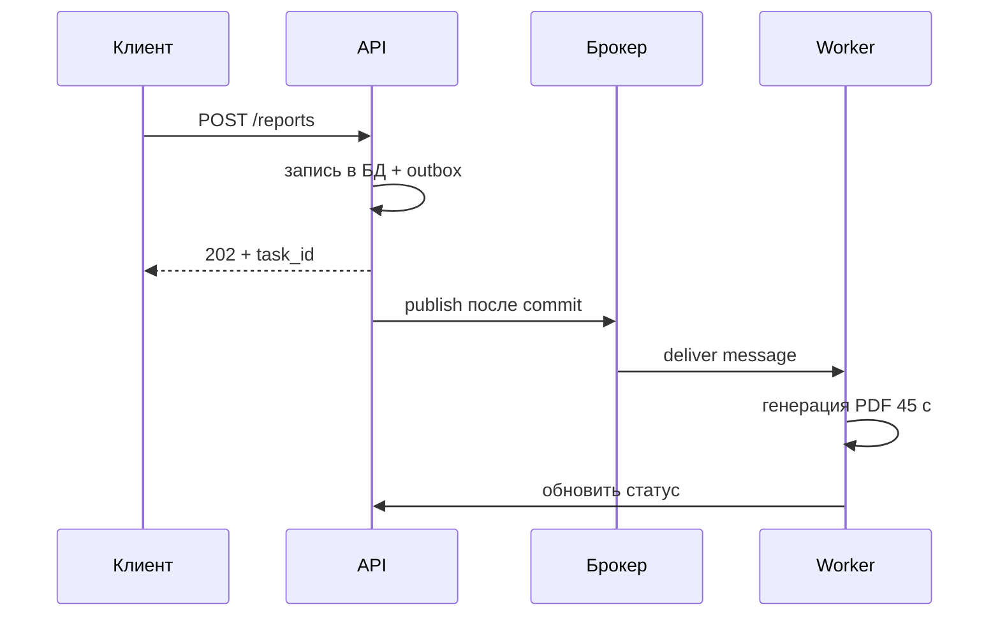
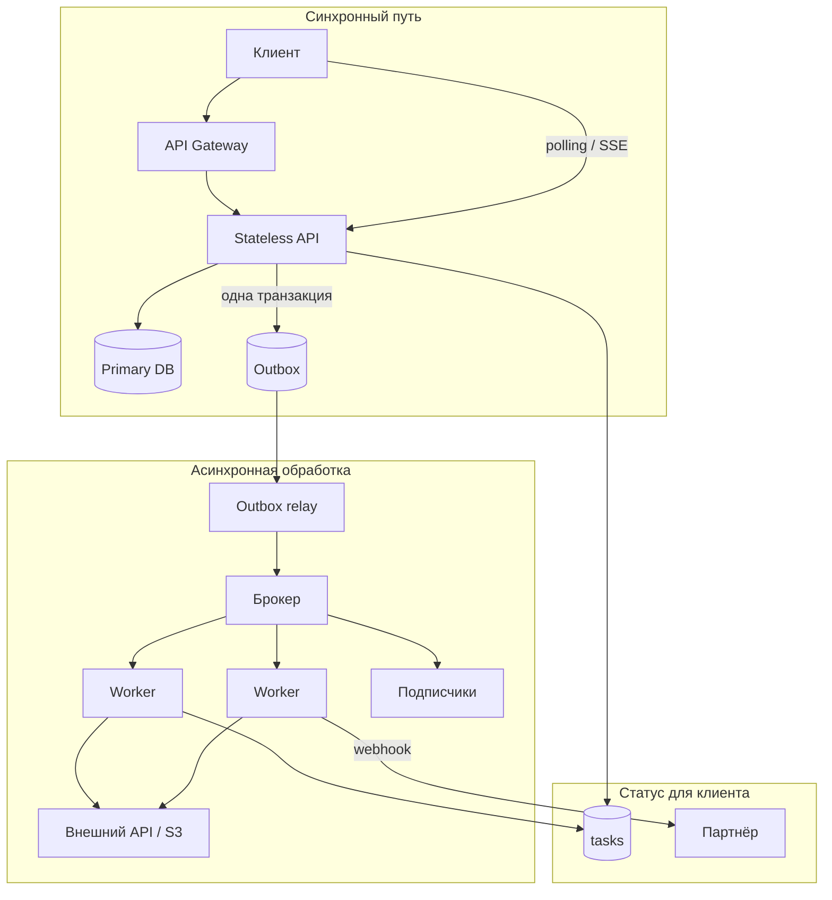
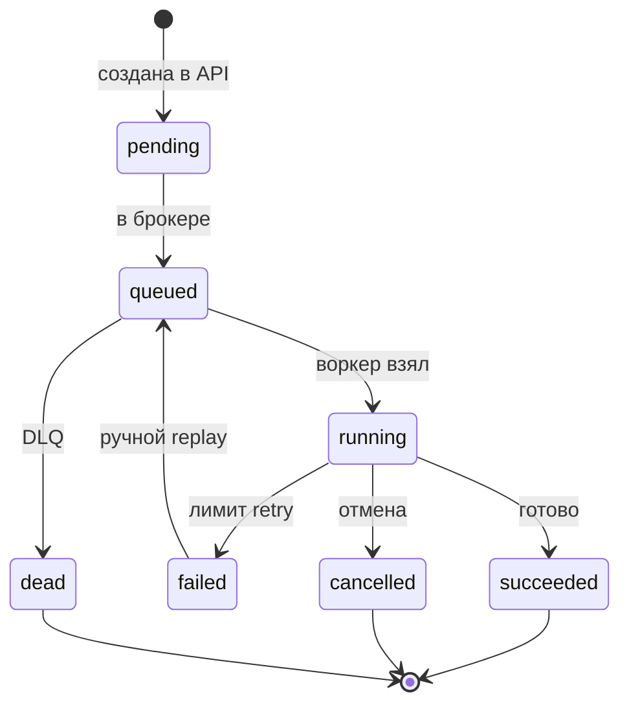
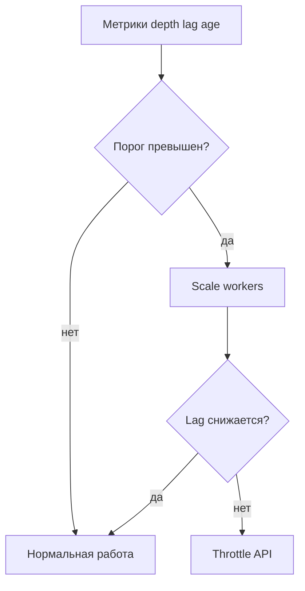
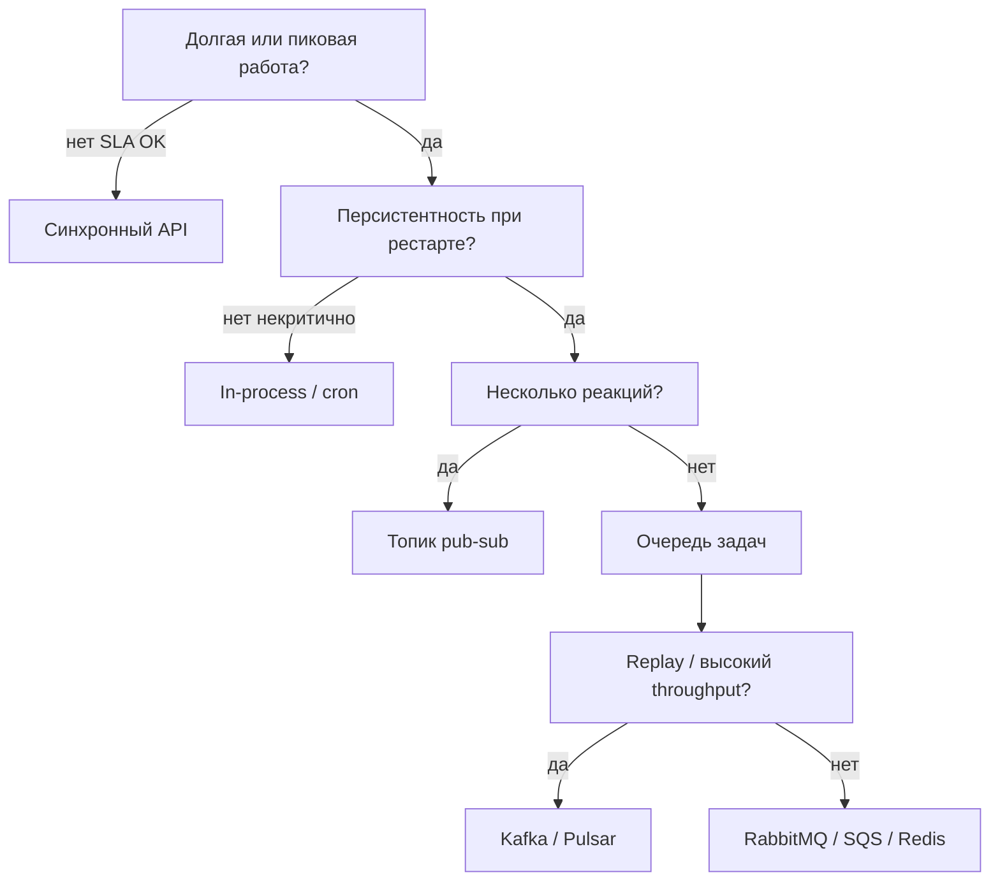

# Асинхронная обработка данных в высоконагруженных системах

<div class="article-tags">
  <span class="tag tag-required">ОБЯЗАТЕЛЬНО</span>
  <span class="tag tag-beginner">ДЛЯ НОВИЧКОВ</span>
</div>

<span class="complexity-badge">Разработчику</span>
<span class="complexity-badge">Архитектору</span>


**Асинхронная обработка** — способ организовать систему так, чтобы долгая работа не блокировала ответ пользователю.

Клиент получает быстрое подтверждение ("задача принята"). Тяжёлую часть система выполняет позже:

- в фоновом процессе (воркер);
- через [очередь сообщений](#komponenty);
- с уведомлением по [webhook](#patterny);
- при следующем запросе статуса (polling).

Типичные примеры фоновой работы:

- отправка email и push-уведомлений;
- генерация PDF-отчёта или выгрузки;
- обработка и сжатие видео;
- перенос событий в аналитику ([ClickHouse](/encyclopedia/3-data-markup/3-11-analiz-dannyh/intro), [Elasticsearch](/encyclopedia/3-data-markup/3-06-nosql/intro));
- пересчёт рекомендаций и поискового индекса.

Соседние материалы:

- [12 концепций распределённой архитектуры](141.md) — краткая шпаргалка;
- [System Design — карта тем](143.md) — порядок изучения;
- [Email-рассылка как распределённая система](144.md) — сквозной кейс с outbox и webhooks;
- [Асинхронная коммуникация](/encyclopedia/8-infra-security/8-05-mikroservisy-i-integratsiya/114) — протоколы и брокеры в продакшене;
- [Брокеры сообщений](/encyclopedia/2-system-network/2-09-osnovy-integratsionnogo-vzaimodeystviya/121) — ack, retry, DLQ;
- [Асинхронность в коде](/encyclopedia/4-code-dev/4-05-asinhronnost/intro) — event loop, `async`/`await`.

---

<span id="terminy"></span>

## Ключевые термины

Перед разбором архитектуры — словарь, который встретится дальше по тексту.

| Термин | Простыми словами | Подробнее |
|--------|------------------|-----------|
| **API** | Программный интерфейс, через который клиент (браузер, мобильное приложение, другой сервис) вызывает ваш backend | [Основы интеграционного взаимодействия](/encyclopedia/2-system-network/2-09-osnovy-integratsionnogo-vzaimodeystviya/intro) |
| **Воркер (worker)** | Отдельный процесс или сервис, который забирает задачи из очереди и выполняет тяжёлую логику | [§ воркеры](#vorery) |
| **Брокер сообщений** | Промежуточное хранилище между отправителем и исполнителем задачи (RabbitMQ, Kafka, SQS) | [Брокеры](/encyclopedia/2-system-network/2-09-osnovy-integratsionnogo-vzaimodeystviya/121) |
| **Очередь (queue)** | Список задач: каждую задачу обычно выполняет один воркер | [§4 в 12 концепциях](141.md#4-очередь-сообщений-message-queue) |
| **Топик (topic)** | Канал для рассылки события нескольким подписчикам | [Pub/Sub](141.md#5-publishsubscribe) |
| **Publish** | Отправить сообщение в брокер | [Асинхронная коммуникация](/encyclopedia/8-infra-security/8-05-mikroservisy-i-integratsiya/114) |
| **Ack (acknowledgment)** | Подтверждение воркером, что задача обработана; до ack брокер может отдать задачу снова | [Брокеры § ack](/encyclopedia/2-system-network/2-09-osnovy-integratsionnogo-vzaimodeystviya/121) |
| **DLQ (Dead Letter Queue)** | Отдельная очередь для "битых" задач, которые не удалось выполнить после нескольких попыток | [§ DLQ](#dlq) |
| **Outbox** | Таблица в БД, куда в одной транзакции с бизнес-данными записывается намерение отправить задачу в очередь | [§ outbox](#outbox) |
| **Идемпотентность** | Повторный запуск даёт тот же результат, что и первый (важно при двойной доставке) | [design/213](design/213.md) |
| **Webhook** | HTTP-запрос на URL клиента, когда задача завершена | [Polling, SSE, Webhook](/encyclopedia/2-system-network/2-04-kak-rabotayut-sayty-i-veb-sayty/129) |
| **SLA** | Договорённость о допустимой задержке и доступности сервиса | [NFR в цифрах](design/1116.md) |
| **p95 latency** | В 95% случаев ответ быстрее этого порога; "хвост" медленных запросов виден именно здесь | [Задержка и throughput](/encyclopedia/2-system-network/2-03-set-i-internet/1#пропускная-способность-и-задержка) |
| **RPS** | Requests per second — сколько запросов в секунду обрабатывает сервис | [Масштабируемость](2.md) |
| **Backpressure** | Очередь растёт быстрее, чем воркеры успевают разбирать задачи | [§ backpressure](#backpressure) |
| **Eventual consistency** | Данные на разных узлах сходятся через короткое время после записи | [PACELC](/encyclopedia/8-infra-security/8-05-mikroservisy-i-integratsiya/124) |

---

<span id="kogda-vvodit"></span>

## Когда вводить асинхронность

Очередь добавляет отдельный компонент в инфраструктуру: кластер брокера, мониторинг, политику повторов, разбор "мёртвых" сообщений. Имеет смысл, когда синхронный путь упирается в измеримый предел.

| Симптом | Что происходит | Типичное решение |
|---------|----------------|------------------|
| Растёт **p95** API из-за редких долгих запросов | Пул потоков API занят генерацией отчётов по 30 с | Задача уходит в очередь; API отвечает за сотни миллисекунд |
| Пики трафика кладут все инстансы | Между всплеском запросов и обработкой нет буфера | Очередь как амортизатор + autoscaling воркеров ([§12 в 141](141.md#12-autoscaling-hpa)) |
| Внешний сервис медленный или нестабилен | Повтор внутри HTTP-запроса удлиняет ответ клиенту | Асинхронный вызов + callback или webhook |
| На одно событие реагируют несколько подсистем | Длинная цепочка синхронных HTTP-вызовов | Топик событий и несколько подписчиков |
| Задача должна пережить рестарт API | `BackgroundTasks` во фреймворке хранит работу только в памяти процесса | Персистентная очередь и подтверждение **ack** |

**Синхронный путь уместен**, если:

- операция укладывается в [SLA](design/1116.md) (например, меньше 300 мс) и UI ждёт результат сразу;
- нужна атомарность в одной [БД](/encyclopedia/3-data-markup/3-05-osnovy-baz-dannyh/intro) без распределённого согласования;
- нагрузка мала, а очередь дороже редкого таймаута;
- команда пока не готова сопровождать брокер (мониторинг, runbook, дежурства — [инциденты](/encyclopedia/7-project/7-21-incidenty-i-ekspluatatsiya/intro)).

<div class="callout callout--warning">
  <div class="callout-title">Антипаттерн "async везде"</div>
  <div class="callout-body">
  Перенос простого CRUD в очередь "для масштабируемости" без цифр в требованиях часто добавляет только задержку согласованности и усложняет отладку.
  Сначала зафиксируйте <a href="design/1116.md">NFR</a> и профиль нагрузки.
  </div>
</div>

---

<span id="dva-urovnia"></span>

## Два уровня асинхронности

Слово "асинхронность" в IT означает два разных механизма. Их часто путают; на практике они дополняют друг друга.

| Уровень | Что происходит | Инструменты | Масштаб |
|--------|----------------|-------------|---------|
| **Внутри одного процесса** | Пока сервис ждёт ответа от сети или диска, он обрабатывает другие запросы | `async`/`await`, event loop, goroutines | Один инстанс API |
| **Между процессами и сервисами** | Задача сохраняется в брокере; API и воркер работают независимо | Очередь, топик, outbox | Кластер, несколько команд |

### Неблокирующий ввод-вывод в приложении

**Event loop** (цикл событий) — механизм в рантайме ([Node.js](/encyclopedia/5-languages/5-01-javascript/intro), [Python asyncio](/encyclopedia/5-languages/5-02-python/intro), [Go](/encyclopedia/5-languages/5-10-go/intro)), который переключается между запросами, пока один ждёт I/O. Это повышает **RPS** на одном сервере.

Ограничение: если работа нагружает **CPU** (рендер PDF, транскодинг видео), одного event loop мало — нужны отдельные [воркеры](#vorery) или [параллельные вычисления](/encyclopedia/4-code-dev/4-16-parallelnye-vychisleniya/intro).

Типичная ошибка новичка: контроллер объявлен `async`, но внутри вызывается **синхронная** библиотека без пула потоков — event loop блокируется, выигрыша нет. Подробнее — [асинхронное выполнение](/encyclopedia/4-code-dev/4-05-asinhronnost/12).

### Очередь между компонентами

Сообщение записывается на диск брокера (или в реплицированный журнал вроде [Kafka](/encyclopedia/8-infra-security/8-05-mikroservisy-i-integratsiya/119)). Если API упадёт сразу после публикации, задача дождётся воркера. Это другой уровень надёжности, чем фоновая goroutine или `setTimeout` в памяти процесса.

На практике часто сочетают оба уровня:

- на входе — неблокирующий HTTP ([stateless API](141.md#6-api-gateway));
- на выходе в тяжёлую подсистему — [брокер](#komponenty) и пул воркеров.



---

<span id="tipovoi-kontur"></span>

## Типовой продакшн-контур

Схема повторяется в отчётах, рассылках, медиа и ETL:



Тот же каркас описан в [типовом контуре system design](143.md#tipovoi-kontur), [email-рассылке](144.md#arhitektura) и [очередях в 12 концепциях](141.md#4-очередь-сообщений-message-queue).

| Компонент | Роль | Если компонента нет |
|-----------|------|---------------------|
| **Stateless API** | Принимает запрос, валидирует, фиксирует намерение | — |
| **Primary DB** | Источник истины по задаче и данным | Статус только в памяти воркера |
| **Outbox / job table** | Атомарность "данные + задача" | Задачи без записи или записи без задач |
| **Брокер** | Буфер, повторы, рассылка подписчикам | Потеря задач при рестарте API |
| **Workers** | Тяжёлая CPU/I/O логика | API не масштабируется по фону |
| **Status store** | `pending` → `running` → `done` / `failed` | Клиент не видит прогресс |

**Stateless API** — сервис без локального состояния сессии: любой инстанс может обработать запрос; данные — в БД или кэше ([Redis](/encyclopedia/3-data-markup/3-06-nosql/5)).

---

<span id="komponenty"></span>

## Ключевые компоненты

### Очереди и брокеры

**Брокер сообщений (message broker)** временно хранит задачи или события и передаёт их потребителям.

| Модель | Как устроено | Примеры задач | Технологии |
|--------|--------------|---------------|------------|
| **Очередь задач** | Одно сообщение обычно обрабатывает один воркер | Отчёты, письма, превью картинок | [RabbitMQ](/encyclopedia/8-infra-security/8-05-mikroservisy-i-integratsiya/118), [SQS](/encyclopedia/8-infra-security/8-01-oblachnye-tehnologii/intro) |
| **Журнал событий** | Сообщения хранятся по политике retention; чтение с **offset** | Аналитика, CDC, повторное проигрывание | [Kafka](/encyclopedia/8-infra-security/8-05-mikroservisy-i-integratsiya/119) |
| **Pub/Sub** | Одно событие получают все подписчики топика | `OrderCreated` → склад, CRM, аналитика | Kafka topic, Rabbit fanout |

#### Сравнение брокеров

Подробные гайды — [114](/encyclopedia/8-infra-security/8-05-mikroservisy-i-integratsiya/114), [118](/encyclopedia/8-infra-security/8-05-mikroservisy-i-integratsiya/118), [119](/encyclopedia/8-infra-security/8-05-mikroservisy-i-integratsiya/119).

| Критерий | RabbitMQ | Apache Kafka | Amazon SQS | Redis Streams |
|----------|----------|--------------|------------|---------------|
| Модель | Очереди, маршрутизация, TTL | Разделённый log | Управляемая очередь в облаке | Поток в памяти |
| Типичная задача | Workflow, фоновые job | Потоковая обработка, высокий throughput | Job без своего кластера | Лёгкие задачи при уже установленном Redis |
| Порядок сообщений | В пределах одной очереди | В пределах partition | Опциональная FIFO-очередь | В пределах stream |
| Хранение | До ack или по TTL | Дни и недели по настройке | До 14 дней | Ограничено RAM |
| Эксплуатация | Средняя (свой кластер) | Высокая | Низкая (managed) | Низкая; RAM — узкое место |

Выбор фиксируют в [ADR](/encyclopedia/7-project/7-20-adr-i-arhitekturnaya-pamyat/intro) с учётом команды, облака, объёма сообщений в секунду и необходимости replay.

<span id="vorery"></span>

### Фоновые воркеры

**Воркер** — процесс или сервис, который:

- подписывается на очередь или топик;
- забирает сообщение;
- выполняет бизнес-логику;
- подтверждает обработку (**ack**) или откладывает повтор (**nack**).

Рекомендации по эксплуатации:

- **Масштабирование** — по длине очереди или consumer lag ([KEDA](https://keda.sh/), [HPA](/encyclopedia/8-infra-security/8-06-konteynerizatsiya-i-orkestratsiya/intro)); CPU API для этого слабый сигнал.
- **Prefetch** — сколько сообщений воркер берёт заранее; согласовать с временем обработки одного сообщения.
- **Graceful shutdown** — при SIGTERM перестать брать новые задачи, завершить текущие или вернуть их в очередь.
- **Изоляция** — тяжёлые job (FFmpeg) в отдельном deployment от лёгких уведомлений.
- **Версионирование** — поле `schema_version` в payload; новые поля добавлять как необязательные.

Воркер должен быть [идемпотентным](#idempotentnost).

### Планировщики и отложенные задачи

| Механизм | Задержка | Пример |
|----------|----------|--------|
| Очередь с TTL / delayed exchange | Секунды и часы | Повтор через 5 мин, напоминание |
| Cron + batch | По расписанию | Ночной отчёт ([системное администрирование](/encyclopedia/2-system-network/2-06-sistemnoe-administrirovanie/intro)) |
| Workflow engine (Temporal, Cadence) | Долгие цепочки с таймерами | Бронь с удержанием 15 минут |

Для "выполнить через N секунд" часто хватает TTL в RabbitMQ или таблицы `scheduled_jobs` с poller.

### Publish-Subscribe

**Pub/Sub (издатель — подписчик)** — паттерн, при котором один факт рассылается нескольким независимым сервисам.

- **Очередь задач** — каждое письмо из 100 000 обрабатывает ровно один воркер.
- **Топик событий** — событие "заказ создан" одновременно получают склад, аналитика и CRM.

Подробнее — [событийная архитектура](design/2127.md), [типы взаимодействия](/encyclopedia/2-system-network/2-09-osnovy-integratsionnogo-vzaimodeystviya/111).

---

<span id="outbox"></span>

## Outbox, CDC и согласованность с БД

Если API сначала пишет в БД, а потом отдельным шагом шлёт в брокер, возможны рассинхроны:

- БД сохранилась, publish упал — задачи в очереди нет.
- Publish прошёл, БД откатилась — в очереди "лишняя" задача.

### Transactional Outbox

**Outbox** — таблица, куда в **той же транзакции**, что и бизнес-запись, добавляется строка "нужно опубликовать событие X". Отдельный процесс (**relay** или poller) читает outbox и шлёт в брокер; после успеха строка помечается опубликованной.

- [Transactional Outbox в Saga](design/2124.md)
- Пример в [email-рассылке](144.md#arhitektura)

```sql
CREATE TABLE outbox (
  id           BIGSERIAL PRIMARY KEY,
  aggregate_id UUID NOT NULL,
  event_type   TEXT NOT NULL,
  payload      JSONB NOT NULL,
  created_at   TIMESTAMPTZ NOT NULL DEFAULT now(),
  published_at TIMESTAMPTZ
);
```

Скелет для иллюстрации; в проде нужны индексы и политика очистки старых строк.

### CDC (Change Data Capture)

**CDC** — чтение журнала изменений БД (**WAL** в PostgreSQL) и передача в поток (Debezium → Kafka). Меньше кода в приложении; больше инфраструктуры стриминга. Связь с [репликацией](/encyclopedia/3-data-markup/3-08-upravlenie-rsubd/1).

### Inbox на стороне consumer

**Inbox** — таблица у получателя с уникальным `message_id`. Повторная доставка того же id не запускает обработку второй раз. Вместе с outbox даёт устойчивость при семантике **at-least-once** ([§ семантика](#semantika)).

---

<span id="scenarii"></span>

## Типичные сценарии

| Сценарий | Поведение | Риски | Углубление |
|----------|-----------|-------|------------|
| Фоновые задачи | `202 Accepted` + id; PDF или видео в фоне | Дубликаты, потеря статуса | [Паттерны с клиентом](#patterny), [state machine](#state-machine) |
| Телеметрия и логи | События в Kafka → хранилище аналитики | Потеря при at-most-once | [Пакетная работа](/encyclopedia/3-data-markup/3-11-analiz-dannyh/433) |
| Микросервисы | `OrderCreated` → несколько подписчиков | Распределённая согласованность | [Saga](design/2124.md) |
| ETL / bulk | Данные режут на chunk по 10k строк | OOM, долгие транзакции | [Конвейеры](design/2130.md) |
| Входящий webhook | Быстрый `200`, обработка в очереди | Таймаут и повторы у партнёра | [Входящие webhooks](design/1171.md) |

### Генерация отчёта

Пользователь нажимает "Скачать отчёт за год". Синхронный путь занимает 40–120 с и упирается в таймаут [балансировщика](/encyclopedia/2-system-network/2-03-set-i-internet/intro) (часто 60 с).

Шаги:

1. `POST /reports` — запись `reports(id, status=pending)` и строка outbox в одной транзакции.
2. Ответ `202` и `{ "task_id": "…" }`.
3. Воркер строит CSV/PDF, кладёт в [S3](/encyclopedia/8-infra-security/8-01-oblachnye-tehnologii/intro) или аналог, обновляет `status=ready`.
4. UI опрашивает `GET /reports/{id}` или слушает [SSE](/encyclopedia/2-system-network/2-04-kak-rabotayut-sayty-i-veb-sayty/129).

### Обработка видео

- Загрузка файла — синхронно (multipart → object storage).
- Транскодинг — цепочка очередей: `1080p` → `720p` → `thumbnails` → `notify-user`.
- Узкое место — CPU; воркеры на нодах с высоким CPU limit или GPU.
- Статус — [конечный автомат](#state-machine) на `video_id`.

### Создание заказа

Синхронно на критичном пути:

- резерв на складе;
- списание оплаты (или [Saga](design/2124.md) с компенсацией).

Асинхронно после события `OrderPaid`:

- письмо с чеком;
- бонусы;
- аналитика;
- push.

Отдельное событие нужно, чтобы сбой почты не откатывал заказ. См. [сценарий User/Order](/encyclopedia/8-infra-security/8-05-mikroservisy-i-integratsiya/115#user-order-scenario) и [email-рассылку](144.md).

---

<span id="state-machine"></span>

## Конечный автомат задачи

Статус фоновой задачи хранят в БД (таблица `jobs` / `tasks`). Память воркера для этого недостаточна — при рестарте процесса статус исчезнет.



| Статус | Для пользователя | Действия инженера |
|--------|------------------|-------------------|
| `pending` | "Принято" | Проверить outbox relay |
| `queued` | "В очереди" | Смотреть depth и lag |
| `running` | "Выполняется" | Lease на случай падения воркера |
| `succeeded` | Ссылка на результат | TTL артефакта в хранилище |
| `failed` | Ошибка | Алерт; не бесконечный retry |
| `dead` | "Обратитесь в поддержку" | Разбор DLQ |

**Lease (аренда задачи)** — при переходе в `running` воркер пишет `locked_until = now() + 5 min`. Другой воркер не берёт задачу, пока lock активен. После истечения — повторная доставка.

Аналогичная схема для письма — [state machine в email-рассылке](144.md#state-machine).

---

<span id="patterny"></span>

## Паттерны взаимодействия с клиентом

Как клиент узнаёт, что фоновая задача завершена:

| Паттерн | Суть | Плюсы | Минусы | Когда уместен |
|---------|------|-------|--------|---------------|
| **Fire-and-forget** | Задача ушла в очередь без статуса для клиента | Минимальная задержка | Нет обратной связи | Метрики, некритичные события |
| **Polling** | Периодический `GET /tasks/{id}` | Просто, работает везде | Лишние запросы | Мобильные клиенты, B2B |
| **Long polling** | Сервер держит соединение до смены статуса | Меньше опросов | Таймауты прокси | Умеренная нагрузка |
| **SSE** | Поток `text/event-stream` | Живой прогресс в браузере | Только server → client | Дашборды |
| **WebSocket** | Двусторонний канал | Чат и статус в одном UI | Сложнее инфраструктура | Интерактивные приложения |
| **Webhook** | `POST` на callback URL клиента | Без опроса | Нужны подпись и идемпотентность | B2B-интеграции |

Подробнее — [Polling, SSE, Webhook](/encyclopedia/2-system-network/2-04-kak-rabotayut-sayty-i-veb-sayty/129), [REST](/encyclopedia/2-system-network/2-09-osnovy-integratsionnogo-vzaimodeystviya/117).

### HTTP-контракт async API

| Метод | Код | Тело ответа | Смысл |
|-------|-----|-------------|-------|
| `POST /tasks` | **202 Accepted** | `task_id`, `status_url` | Задача принята, ещё не готова |
| `GET /tasks/{id}` | 200 | `status`, `progress`, `result` | Текущее состояние |
| `DELETE /tasks/{id}` | 202 / 204 | — | Запрос отмены (best-effort) |

Практики:

- заголовок **`Location`** с URL статуса;
- **`Idempotency-Key`** при повторном `POST` — [идемпотентность](design/213.md);
- коды ошибок и формат — [проектирование API](design/117.md).

### Требования к исходящему webhook

- подпись тела (HMAC-SHA256), проверка заголовка `X-Signature`;
- идемпотентность по `event_id` у получателя;
- быстрый `200 OK` и своя очередь на обработку (иначе партнёр шлёт повторы);
- timestamp и окно допустимого времени против replay.

Примеры — [webhooks ESP](144.md#webhooks), [публичный API](design/1171.md).

---

<span id="semantika"></span>

## Семантика доставки

**Семантика доставки** — ответ на вопрос, сколько раз сообщение будет обработано и может ли оно потеряться.

| Гарантия | Смысл | Цена |
|----------|-------|------|
| **At-most-once** | Может потеряться; дубликатов нет | Риск для критичных задач |
| **At-least-once** | Доставят минимум один раз; возможны дубликаты | Нужен идемпотентный воркер |
| **Exactly-once** (в рамках брокера) | Одна запись в транзакции producer | Сложность, связность компонентов |
| **Effectively exactly-once** | Пользователь видит один эффект | At-least-once + dedup + идемпотентность |

Подробнее — [идемпотентность и семантика доставки](/encyclopedia/2-system-network/2-09-osnovy-integratsionnogo-vzaimodeystviya/133).

### Где теряются и дублируются сообщения

| Точка сбоя | Риск | Митигация |
|------------|------|-----------|
| API упал до commit БД | Задача не создана | Повтор `POST` с `Idempotency-Key` |
| Commit есть, relay не опубликовал | Задача в outbox, не в брокере | Poller/CDC, алерт на "застрявшие" строки |
| Publish OK, crash до ack | Повторная доставка | [Идемпотентность](#idempotentnost) |
| Обработка OK, crash до ack | Повторная доставка | Идемпотентность + inbox |
| Ack до commit в БД | Потеря при crash после ack | Ack **после** commit (manual ack) |

---

<span id="backpressure"></span>

## Backpressure и управление нагрузкой

**Backpressure** — ситуация, когда задачи поступают в очередь быстрее, чем воркеры их разбирают.

Признаки:

- растёт **queue depth** (число сообщений в очереди);
- растёт **age of oldest message** (возраст самой старой задачи);
- растёт **consumer lag** в Kafka;
- нарушается SLA ("отчёт за 5 минут" систематически опаздывает);
- заканчивается память или диск брокера (нет TTL / max-length).

Стратегии:

- добавить воркеры или partition ([autoscaling](141.md#12-autoscaling-hpa));
- ускорить handler (batch, меньше round-trip к БД);
- **throttle** на `POST /tasks` ([rate limiting](141.md#10-rate-limiting));
- отдельные очереди по приоритету (`critical` / `batch`);
- честный ответ "система перегружена" вместо молчаливого lag;
- отброс некритичных событий при перегрузке (только для некритичного трафика).



---

<span id="idempotentnost"></span>

## Идемпотентность

При **at-least-once** повторная доставка неизбежна. Обработчик должен давать тот же эффект, что при первом запуске.

| Техника | Как работает | Пример |
|---------|--------------|--------|
| Естественная идемпотентность | Повтор безопасен сам по себе | `SET status = 'done' WHERE id = ?` |
| Ключ идемпотентности | Уникальный ключ в БД / Redis | `UNIQUE(message_id)` в inbox |
| Compare-and-set | Обновление только из допустимого статуса | `WHERE status = 'queued'` |
| Ключ внешнего API | Провайдер принимает idempotency key | Stripe, SES |

- [Методы и ключ идемпотентности](design/213.md)
- Кейс дубликата письма — [144](144.md#idempotentnost)

### Чеклист code review воркера

1. Есть стабильный `message_id` или бизнес-ключ в payload?
2. Запись в БД защищена уникальным constraint?
3. Вызов внешнего API — после фиксации "уже обработано"?
4. Повтор с тем же ключом возвращает тот же результат, а не 500?

---

<span id="poryadok"></span>

## Упорядочивание и партиционирование

| Требование | Решение | Цена |
|------------|---------|------|
| Строгий порядок всех событий | Одна очередь / один partition | Сложнее масштабировать consume |
| Порядок в рамках одной сущности | Partition key = `order_id` | "Горячие" ключи перегружают partition |
| Порядок не важен | Много consumers и partitions | Проще горизонтальный scale |

В Kafka порядок гарантирован **внутри partition**. События одного `user_id` часто кладут в одну partition, если нужна последовательная обработка профиля.

**Head-of-line blocking** — одно "застрявшее" сообщение блокирует всю partition. Поэтому нужны DLQ после N попыток и отдельные очереди для тяжёлых job.

---

<span id="retry-dlq"></span>

## Retry, DLQ и poison messages

<span id="dlq"></span>

**Retry (повтор)** — повторная попытка после ошибки. Часть [инженерии устойчивости](design/2136.md); не бесконечный цикл `while`.

| Параметр | Типичное значение | Заметка |
|----------|-------------------|---------|
| Max attempts | 3–10 | Зависит от побочных эффектов |
| Backoff | Экспоненциальный + **jitter** (случайный разброс) | Без jitter — "стадный" всплеск повторов |
| DLQ | Отдельная очередь / topic | Ручной разбор, алерт |

**Poison message** — сообщение, которое всегда падает (битый JSON, несуществующий `user_id`). Без DLQ оно крутится в retry и блокирует очередь.

- [Брокеры § DLQ](/encyclopedia/2-system-network/2-09-osnovy-integratsionnogo-vzaimodeystviya/121#dlq)

| Ситуация | Повторять? |
|----------|------------|
| Таймаут внешнего API, 5xx | Да |
| 4xx, ошибка валидации | Нет → сразу DLQ |
| Дубликат после успеха | Нет (идемпотентность) |
| Брокер недоступен | Повтор publish из outbox |

---

<span id="saga"></span>

## Saga и длинные процессы

Когда операция затрагивает несколько сервисов без общей БД, одной очереди мало. **Saga** — цепочка локальных шагов с **компенсацией** при сбое (например, отмена брони, если оплата не прошла).

| Тип | Как координируется | Плюс | Минус |
|-----|-------------------|------|-------|
| **Choreography** | События в брокере | Меньше центрального сервиса | Сложнее увидеть всю цепочку |
| **Orchestration** | Центральный координатор | Явный граф шагов | Ещё один сервис |

Пример: бронирование → оплата → письмо. Подробно — [Saga](design/2124.md). Outbox на каждом шаге связывает commit в БД и публикацию следующего события.

---

<span id="problemy"></span>

## Отладка, безопасность и версии сообщений

### Сложность отладки

Цепочка API → брокер → воркер → внешний API → ещё один топик. В логах одного сервиса виден только фрагмент.

Что помогает:

- `trace_id` / `correlation_id` из HTTP в payload и логи воркера;
- structured logging (JSON) с `task_id`, `partition`, `offset`;
- distributed tracing (OpenTelemetry, Jaeger, Zipkin);
- показ `task_id` в UI для поддержки.

### Отказоустойчивость брокера

- кластер с репликацией (quorum queues, Kafka ISR);
- мониторинг disk, memory, connections;
- runbook при потере лидера — [алгоритмы выбора лидера](142.md).

### Версионирование схемы

- новые поля — необязательные (backward-compatible);
- schema registry (Avro, Protobuf) для Kafka;
- поле `schema_version` в конверте;
- dual write / dual read при миграции.

### Безопасность

| Угроза | Мера |
|--------|------|
| Подмена сообщения | TLS, ACL на топики ([ИБ](/encyclopedia/2-system-network/2-08-osnovy-informatsionnoy-bezopasnosti/intro)) |
| PII в топике | Минимальный payload; шифрование at rest |
| Replay webhook | Подпись + timestamp |
| Переполнение очереди | Rate limit, auth на API ([уязвимости API](/encyclopedia/8-infra-security/8-07-informatsionnaya-bezopasnost/128)) |

---

<span id="nabludaemost"></span>

## Наблюдаемость

Без метрик очередь "слепая": lag замечают пользователи, а не дашборд.

### Основные метрики

| Метрика | Зачем смотреть | Алерт |
|---------|----------------|-------|
| Queue depth | Нехватка воркеров | depth выше порога N минут |
| Consumer lag (Kafka) | Отставание от головы log | lag выше SLA |
| Age of oldest message | Реальная задержка job | больше 5 мин для transactional |
| Publish rate и consume rate | Накопление | consume меньше publish 10 мин |
| DLQ size | Битые сообщения / баги | любой рост |
| Processing time p95 | Медленный handler | рост после деплоя |
| Retry count | Нестабильная зависимость | всплеск |
| Outbox unpublished | Сломан relay | больше 0 долго |

- [Prometheus и Grafana — практикум](/encyclopedia/2-system-network/2-06-sistemnoe-administrirovanie/prometheus-grafana-praktikum/intro)
- [Инженерия устойчивости](design/2136.md)

### Сквозной trace

Один `task_id` проходит через:

1. access log API;
2. запись outbox;
3. publish (offset/partition);
4. start/finish воркера;
5. исходящий webhook (если есть).

---

<span id="antipatterny"></span>

## Антипаттерны

| Антипаттерн | Почему плохо | Что делать |
|-------------|--------------|------------|
| In-memory queue в API | Потеря при рестарте | Персистентный брокер или job table |
| Ack до commit в БД | Потеря при crash | Manual ack после commit |
| Бесконечный retry | Очередь забита | Max attempts + DLQ |
| Огромный payload в сообщении | Нагрузка на брокер и сеть | URL в S3 + metadata |
| Синхронный RPC в цикле consumer | Блокировка partition | Отдельные очереди, batch |
| Одна очередь на всё | Head-of-line, нет приоритетов | Разделение по SLA |
| Нет идемпотентности | Дубликаты после инцидента | inbox + unique keys |
| "Exactly-once" без обоснования | Ложная уверенность | Явный at-least-once + design |

---

<span id="vybor-tehnologii"></span>

## Выбор технологий

| Ситуация | Частый выбор | Почему |
|----------|--------------|--------|
| Kubernetes, job с retry | RabbitMQ / Redis Streams | Знакомая эксплуатация, низкая latency |
| Streaming, replay, много consumers | Kafka | Log, retention, экосистема |
| Минимум ops, AWS | SQS + Lambda / ECS | Managed |
| Отложенные задачи, Redis уже в стеке | Bull / Celery / Sidekiq | Быстрый старт; RAM — лимит |
| Долгие саги с таймерами | Temporal, Cadence | Workflow как код |

[Экосистема MSA](design/118.md#ekosistema-msa) · [продакшн-стек](design/118.md#prodakshn-stek)

---

<span id="emkost"></span>

## Оценка ёмкости

Грубая формула для планирования воркеров:

```
время_разбора ≈ (глубина_очереди × среднее_время_задачи) / число_воркеров
```

Пример: 10 000 задач, 2 с на задачу, 50 воркеров → около 400 с (6,7 мин) в худшем случае без нового притока.

Если приходит 100 msg/s, а обрабатывается 80 msg/s, очередь растёт линейно — нужен scale или throttle.

- [Масштабируемость](2.md)
- [Имитационное моделирование](1161.md)

---

<span id="envelope"></span>

## Конверт сообщения

В очередь кладут **конверт (envelope)** с метаданными. Сырой JSON всего заказа в сообщение обычно не помещают.

| Поле | Назначение |
|------|------------|
| `message_id` | Уникальный id (UUID); dedup, inbox |
| `correlation_id` | Связь с HTTP-запросом / `task_id` |
| `event_type` | Тип для маршрутизации |
| `schema_version` | Версия контракта |
| `occurred_at` | Время факта (ISO 8601) |
| `payload` | Бизнес-данные |

```json
{
  "message_id": "550e8400-e29b-41d4-a716-446655440000",
  "correlation_id": "task_8f3a2b",
  "event_type": "ReportRequested",
  "schema_version": 1,
  "occurred_at": "2026-06-15T14:30:00Z",
  "payload": {
    "report_id": "rpt_991",
    "user_id": "usr_42",
    "format": "pdf"
  }
}
```

Большие файлы передают по **ссылке** (S3 key). Base64 в теле сообщения раздувает брокер и сеть.

- [Проектирование API](design/117.md)
- [Интеграции](/encyclopedia/2-system-network/2-09-osnovy-integratsionnogo-vzaimodeystviya/intro)

---

<span id="prioritety"></span>

## Приоритеты и несколько очередей

Одна FIFO-очередь на всё — простой старт. Минус: тяжёлый отчёт на 20 минут задерживает SMS с кодом входа.

| Подход | Как устроено |
|--------|--------------|
| Отдельные очереди по SLA | `jobs-critical`, `jobs-batch` |
| Приоритет в RabbitMQ | `x-max-priority` |
| Отдельный кластер Kafka | transactional и analytics |
| Weighted fair queue | Доля CPU на классы задач |

Критичный путь (OTP, оплата) не делит очередь с batch-ETL без записи в [ADR](/encyclopedia/7-project/7-20-adr-i-arhitekturnaya-pamyat/intro).

---

<span id="deploy-workers"></span>

## Деплой воркеров

| Модель | Плюс | Минус |
|--------|------|-------|
| Воркер в том же репо, отдельный entrypoint | Общие модели, один CI | Риск перепутать деплой API и worker |
| Отдельный сервис / репо | Независимый scale и релиз | Версионирование контрактов |
| Serverless (Lambda) | Оплата за вызов | Cold start, лимит времени |
| Kubernetes CronJob | Batch по расписанию | Не для постоянного consume |

Долгие job (видео) — отдельный deployment, autoscaling по queue depth ([Kubernetes](/encyclopedia/8-infra-security/8-06-konteynerizatsiya-i-orkestratsiya/intro)).

`terminationGracePeriodSeconds` в K8s должен превышать worst-case время обработки сообщения, иначе SIGKILL оборвёт работу без ack.

---

<span id="circuit-breaker-async"></span>

## Circuit Breaker в async-контуре

**Circuit Breaker (предохранитель)** — паттерн, который временно прекращает вызовы к "больному" сервису ([§7 в 141](141.md#7-circuit-breaker-предохранитель)).

| Ситуация | Поведение |
|----------|-----------|
| Воркер вызывает внешний API | При состоянии open — nack с delay или retry-очередь |
| Брокер недоступен | Outbox копится; relay повторяет publish |
| Лавина retry на мёртвую зависимость | Exponential backoff + DLQ |

**Bulkhead** — отдельные пулы соединений к разным внешним API, чтобы сбой одного не исчерпал все исходящие вызовы.

- [Инженерия устойчивости](design/2136.md)
- [Ошибки и отказоустойчивость](/encyclopedia/4-code-dev/4-06-arhitektura-vypolneniya/111#otkazoustojchivost)

---

<span id="keisy-rasshirennye"></span>

## Расширенные кейсы

### Пайплайн изображений (e-commerce)

1. `POST /products/{id}/images` → файл в storage, `image_id`, статус `uploaded`.
2. Очередь `resize` → воркеры 150×150, 800×800, WebP.
3. Параллельно очередь `moderation` (ML API).
4. Статус `ready_for_catalog` — когда все derivative готовы.

Идемпотентность по ключу `(image_id, variant)`.

### Ночной биллинг

Cron в 02:00 кладёт N сообщений в `invoices` (по контракту). Workers масштабируются; ошибка по одному контракту → DLQ без остановки batch.

- [Пакетная работа](/encyclopedia/3-data-markup/3-11-analiz-dannyh/433)
- checkpoint по `contract_id`

### Поисковый индекс

Запись в PostgreSQL — синхронно. Elasticsearch — асинхронно через outbox → `ProductUpdated`. Пользователь 1–2 с может видеть старый снимок в поиске — осознанный trade-off ([PACELC](/encyclopedia/8-infra-security/8-05-mikroservisy-i-integratsiya/124)).

### Импорт CSV

1. Multipart → S3.
2. `ImportJob` + сообщение "начать импорт".
3. Воркер читает потоком (chunk 5k строк), пишет в staging, обновляет `progress_percent`.
4. UI — SSE или polling.

---

<span id="multitenancy"></span>

## Мультитенантность

| Уровень | Реализация | Когда |
|---------|------------|-------|
| Логическая | `tenant_id` в payload + ACL | Большинство B2B SaaS |
| Очередь на tenant | `jobs-tenant-{id}` | Жёсткий SLA |
| Кластер на tenant | Отдельный брокер | Enterprise, compliance |

Один tenant не должен забить общую очередь — per-tenant rate limit и квота на параллельные job.

---

<span id="local-dev"></span>

## Локальная разработка

| Подход | Плюс | Минус |
|--------|------|-------|
| Docker Compose (API + Rabbit + worker) | Близко к проду | Тяжелее на ноутбуке |
| Testcontainers в CI | Реальный брокер в тесте | Медленнее unit |
| In-memory queue в dev | Быстрый старт | Не ловит баги ack/retry |

На проде Rabbit, локально только `asyncio.create_task` — семантика разъедется при первом инциденте.

Минимум parity: outbox, manual ack, DLQ в dev-dashboard (RabbitMQ Management, Kafka UI).

---

<span id="compliance"></span>

## Данные в очереди и compliance

Сообщения часто содержат **PII** (персональные данные). Очередь — ещё одно хранилище.

- минимальный payload (id вместо полного профиля);
- шифрование at rest (KMS);
- TTL согласован с [GDPR](/encyclopedia/1-basics/1-22-kommunikatsiya-i-obschenie/6.md);
- логи без полного тела сообщения.

Для аудита в конверте: `occurred_at`, `actor_id`, `correlation_id`.

---

<span id="decision-tree"></span>

## Дерево решений



---

<span id="monitoring-primer"></span>

## Пример метрик для дашборда

| Метрика | Тип | Идея PromQL |
|---------|-----|-------------|
| `queue_messages_ready` | gauge | `rabbitmq_queue_messages_ready{queue="jobs"}` |
| `kafka_consumer_lag` | gauge | `kafka_consumergroup_lag_sum` |
| `job_processing_seconds` | histogram | `histogram_quantile(0.95, …)` |
| `outbox_unpublished_total` | gauge | SQL count |
| `dlq_messages_total` | counter | рост за час |

Алерт: `queue_messages_ready > 1000` и consume rate меньше publish rate 10 минут.

- [Postmortem в лаборатории](/lab/Кейсы/2)
- [Инциденты](/encyclopedia/7-project/7-21-incidenty-i-ekspluatatsiya/intro)

---

<span id="migratsia"></span>

## Миграция на асинхронный путь

| Фаза | Действие | Риск |
|------|----------|------|
| 1 | Вынести логику в handler; вызывать синхронно | Низкий |
| 2 | Таблица `jobs`; poller в том же процессе | Средний |
| 3 | Outbox + отдельные worker-процессы | Средний |
| 4 | Клиент на `202` + polling | Контракт API |
| 5 | Scale workers, DLQ, алерты | Ops |

Feature flag для отката без деплоя.

- [Декомпозиция монолита](104.md)
- [Паттерны перехода](design/2144.md)

---

<span id="sobesedovanie"></span>

## Чек-лист system design interview

Порядок ответа — [каркас в 143](143.md#karkas-ответa-na-system-design-interview):

1. **NFR** — RPS, задержка job, нужен ли один эффект для пользователя.
2. Что синхронно в HTTP, что в фоне.
3. **High-level** — API, DB, outbox, broker, workers, storage, статус.
4. **Deep dive** — идемпотентность, state machine, retry/DLQ, partition key.
5. **Failure modes** — падение API, воркера, брокера; дубликаты.
6. **Scale** — API и workers отдельно; bottleneck.
7. **Observability** — depth, lag, DLQ, trace_id.

Уточняющие вопросы интервьюеру:

- нужен ли прогресс в реальном времени;
- допустима ли потеря некритичных событий;
- нужен ли строгий порядок по `order_id`.

### Пример ответа (сервис отчётов)

**NFR:** 10k отчётов/день, пик 500/ч, p95 API &lt;300 мс, отчёт за 15 мин, дубликат PDF недопустим.

**Схема:** Client → LB → API → PostgreSQL + outbox → RabbitMQ → workers → S3 → обновление `tasks.status`. Клиент polling `GET /tasks/{id}`.

**Детали:**

- outbox в той же TX, что `INSERT INTO reports`;
- `UNIQUE(report_id)` в inbox воркера;
- DLQ после 5 retry;
- метрики `queue_depth`, p95 `job_duration`, `dlq_size`.

**Отказы:** worker упал — сообщение вернётся после visibility timeout; Rabbit недоступен — растёт outbox, алерт; S3 down — retry, без ack.

- [Email-рассылка](144.md)
- [URL shortener](2.md)

---

<span id="latency-budget"></span>

## Бюджет задержки

| Этап | Синхронный путь (job 60 с) | Асинхронный путь |
|------|---------------------------|------------------|
| Приём запроса | 50 мс | 50 мс |
| Запись намерения | — | 30 мс (DB + outbox) |
| Ответ клиенту | 60 000 мс | 80 мс (`202`) |
| Генерация PDF | в HTTP-потоке | 45 с в worker |
| Результат | в теле ответа | polling / webhook |

В async-модели две задержки: быстрый ack и отдельно время до `succeeded`. UX должен это показывать ("отчёт готовится").

---

<span id="stoimost"></span>

## Стоимость и FinOps

| Статья | Комментарий |
|--------|-------------|
| Брокер | Kafka с длинным retention дороже SQS pay-per-request |
| Workers 24/7 | Постоянный pool или scale-to-zero на Lambda |
| Object storage | Lifecycle для артефактов |
| Операции | On-call, мониторинг, апгрейды |

Экономия бывает, когда без очереди пришлось бы сильно увеличить число API-инстансов под редкие пики CPU.

- [FinOps pet project](/encyclopedia/8-infra-security/8-16-finops-pet-project/intro)

---

<span id="sync-async-msa"></span>

## Синхронный вызов и событие между сервисами

| Критерий | HTTP/gRPC напрямую | Событие через брокер |
|----------|-------------------|----------------------|
| Связность | Вызывающий знает адрес callee | Издатель не знает подписчиков |
| Задержка для пользователя | Сумма всех hop | Только критичный путь синхронен |
| Отказ зависимости | 503 клиенту | Буфер, retry |
| Согласованность | Проще read-after-write | Eventual consistency |
| Отладка | Один request-id | Trace через топик |
| Версии | Жёсткий контракт API | Несколько consumer на topic |

Три и более синхронных вызова на критичном пути — сигнал вынести хвост в событие. Пример: `POST /orders` резервирует склад и списывает оплату; `OrderPaid` запускает письмо, CRM и аналитику.

- [Saga](design/2124.md)
- [REST и gRPC](/encyclopedia/2-system-network/2-09-osnovy-integratsionnogo-vzaimodeystviya/130)

---

<span id="postmortem-mini"></span>

## Мини-postmortem (рост очереди)

**Симптом:** `queue_depth` с 200 до 6 000 за час; отчёты опаздывают на 40+ минут.

**Хронология:**

1. Деплой воркера: обработка 8 с вместо 2 с.
2. Пик enqueue +30% от рассылки.
3. HPA смотрел на CPU, а не на depth; scale с задержкой 10 мин.
4. Нет DLQ — битый `report_id` крутится в retry.

**Действия:** KEDA по depth; алерт `oldest_message_age > 300s`; DLQ + runbook; canary на воркерах.

- [Разборы в лаборатории](/lab/Кейсы/2)
- [Инженерия устойчивости](design/2136.md)

---

<span id="read-model"></span>

## CQRS и read-модели

**CQRS** — разделение модели записи (command) и чтения (query).

1. **Command** — принимает намерение, пишет write-модель, публикует событие.
2. **Projector** — consumer обновляет read-модель (таблица, Elasticsearch, Redis).

После `POST` на `GET` данные могут обновиться с задержкой в секунды. UI — optimistic update или индикатор "обновляется".

- [Event Sourcing и CQRS](/encyclopedia/3-data-markup/3-06-nosql/2#2-event-sourcing-и-cqrs)
- [Событийная архитектура](design/2127.md)

| Вопрос продукта | Ответ |
|-----------------|-------|
| Почему счётчик не сразу +1? | Read model отстаёт |
| Нужна мгновенная согласованность? | Read-after-write из primary — дороже |
| События в неправильном порядке? | Partition по `aggregate_id`, version в событии |

---

## FAQ

<div class="faq">
  <p class="faq-q"><span class="faq-label">Вопрос.</span> Чем async в коде отличается от очереди?</p>
  <p class="faq-a"><span class="faq-label">Ответ.</span> <strong>Async I/O</strong> — внутри одного процесса; задача пропадёт при рестарте сервера. <strong>Очередь</strong> — в брокере между процессами; задача переживёт рестарт API. См. <a href="#dva-urovnia">два уровня асинхронности</a> и <a href="/encyclopedia/4-code-dev/4-05-asinhronnost/intro">раздел 4.05</a>.</p>
</div>

<div class="faq">
  <p class="faq-q"><span class="faq-label">Вопрос.</span> Нужен ли Kafka для 1000 писем в день?</p>
  <p class="faq-a"><span class="faq-label">Ответ.</span> Обычно нет. Достаточно outbox, <a href="/encyclopedia/8-infra-security/8-05-mikroservisy-i-integratsiya/118">RabbitMQ</a> или SQS и воркеров. Kafka уместен при потоковой аналитике, replay и множестве consumers на один поток.</p>
</div>

<div class="faq">
  <p class="faq-q"><span class="faq-label">Вопрос.</span> Как тестировать воркеры?</p>
  <p class="faq-a"><span class="faq-label">Ответ.</span> Unit-тест handler без брокера; интеграционный тест с Testcontainers; дважды один payload — проверка идемпотентности. <a href="/encyclopedia/7-project/7-05-testirovanie/intro">Тестирование</a>, <a href="/encyclopedia/7-project/7-05-testirovanie/1014">нагрузочное тестирование</a>.</p>
</div>

<div class="faq">
  <p class="faq-q"><span class="faq-label">Вопрос.</span> Celery / Sidekiq — это архитектура?</p>
  <p class="faq-a"><span class="faq-label">Ответ.</span> Это библиотеки воркеров поверх брокера (часто Redis). Outbox, семантика доставки и DLQ по-прежнему проектируете вы.</p>
</div>

<div class="faq">
  <p class="faq-q"><span class="faq-label">Вопрос.</span> Можно ли без брокера — только таблица jobs в PostgreSQL?</p>
  <p class="faq-a"><span class="faq-label">Ответ.</span> Да при умеренной нагрузке: <code>SELECT … FOR UPDATE SKIP LOCKED</code>, poller-воркеры. Fan-out и replay слабее, чем у Kafka; зато меньше компонентов. <a href="/encyclopedia/3-data-markup/3-07-sql/intro">SQL</a>, <a href="/encyclopedia/3-data-markup/3-08-upravlenie-rsubd/1">управление РСУБД</a>.</p>
</div>

<div class="faq">
  <p class="faq-q"><span class="faq-label">Вопрос.</span> Что такое visibility timeout в SQS?</p>
  <p class="faq-a"><span class="faq-label">Ответ.</span> Время, пока сообщение скрыто от других consumers после получения. Если не подтвердить обработку — сообщение снова станет видимым (аналог nack + retry). Должно быть больше worst-case времени обработки.</p>
</div>

<div class="faq">
  <p class="faq-q"><span class="faq-label">Вопрос.</span> Eventual consistency — это баг?</p>
  <p class="faq-a"><span class="faq-label">Ответ.</span> Нет, если это записано в требованиях. Баг — когда продукт обещает мгновенную согласованность без синхронного чтения после записи. <a href="/encyclopedia/8-infra-security/8-05-mikroservisy-i-integratsiya/124">PACELC</a>.</p>
</div>

<div class="faq">
  <p class="faq-q"><span class="faq-label">Вопрос.</span> Где граница между очередью и data pipeline?</p>
  <p class="faq-a"><span class="faq-label">Ответ.</span> Очередь задач — "выполни X один раз". Pipeline — непрерывный поток с checkpoint. <a href="design/2130.md">Конвейеры данных</a>, <a href="/encyclopedia/3-data-markup/3-11-analiz-dannyh/433">пакетная работа</a>.</p>
</div>

<div class="faq">
  <p class="faq-q"><span class="faq-label">Вопрос.</span> Нужен ли API Gateway перед async API?</p>
  <p class="faq-a"><span class="faq-label">Ответ.</span> Не обязателен на старте. Полезен для auth, rate limit и TLS. Тяжёлую работу gateway не выполняет — только <code>POST</code> и <code>202</code>. <a href="141.md#6-api-gateway">API Gateway в 12 концепциях</a>.</p>
</div>

---

## См. также

| Тема | Материал |
|------|----------|
| Шпаргалка по инфраструктурным идеям | [141](141.md) |
| System design | [143](143.md) |
| Сквозной кейс outbox + webhooks | [144](144.md) |
| RabbitMQ и Kafka | [114](/encyclopedia/8-infra-security/8-05-mikroservisy-i-integratsiya/114), [118](/encyclopedia/8-infra-security/8-05-mikroservisy-i-integratsiya/118), [119](/encyclopedia/8-infra-security/8-05-mikroservisy-i-integratsiya/119) |
| Async в коде | [4.05](/encyclopedia/4-code-dev/4-05-asinhronnost/intro) |
| Saga, outbox | [2124](design/2124.md) |
| Идемпотентность | [213](design/213.md) |
| Событийная архитектура | [2127](design/2127.md) |
| Устойчивость | [2136](design/2136.md) |
| Микросервисы | [8.05 intro](/encyclopedia/8-infra-security/8-05-mikroservisy-i-integratsiya/intro) |
| HTTP и статусы | [118](/encyclopedia/2-system-network/2-09-osnovy-integratsionnogo-vzaimodeystviya/118) |

<div class="callout callout--tip">
  <div class="callout-title">Чеклист перед внедрением очереди</div>
  <div class="callout-body">
  <ol>
  <li>Что произойдёт при <strong>дубликате</strong> сообщения?</li>
  <li>Где хранится <strong>статус</strong> для клиента?</li>
  <li>Какой <strong>лимит retry</strong> и куда попадёт poison message?</li>
  <li>Как измеряете <strong>depth, lag, age</strong>?</li>
  <li>Как связаны <strong>запись в БД</strong> и publish (outbox)?</li>
  <li>Какой <strong>контракт</strong> с клиентом — 202, polling, webhook?</li>
  <li>Есть ли <strong>runbook</strong> при росте DLQ?</li>
  </ol>
  </div>
</div>
