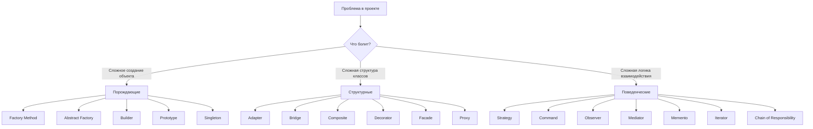
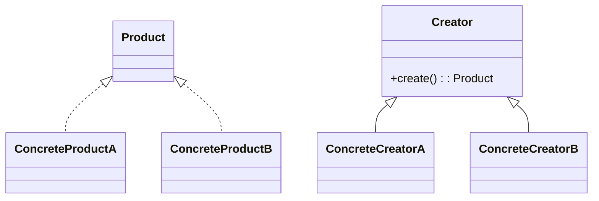
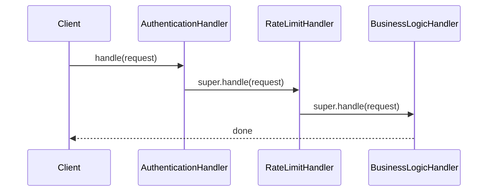
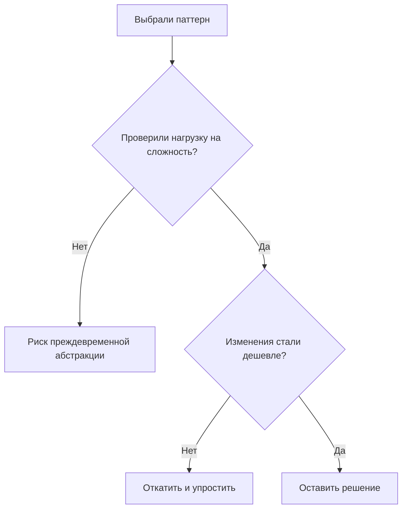

# GoF паттерны в Java - большой практический гид

  ОБЯЗАТЕЛЬНО
  ДЛЯ НОВИЧКОВ

Разработчику
Архитектору

  
Теория данных (раздел 3)

  

  Модель и масштаб — [Основы БД](/encyclopedia/3-data-markup/3-05-osnovy-baz-dannyh/intro), [опорные темы](/encyclopedia/3-data-markup/3-05-osnovy-baz-dannyh/12), [проектирование БД](design/116.md), [пакетная работа](/encyclopedia/3-data-markup/3-11-analiz-dannyh/433). Карта — [о разделе](./intro).
  

Этот материал объединяет практику по паттернам из серии `122-139` в один рабочий справочник. Цель статьи — дать инженерный инструмент выбора по типовым проблемам в коде. Для первого знакомства начните с [принципов перед паттернами](./142.md) и [десяти частых шаблонов](./141.md); составные схемы и MVC — в [отдельной статье](./143.md).

---

## Как читать этот материал

Маршрут для быстрого старта:

1. Смотрите карту выбора "какая проблема -> какой паттерн".
2. Сверяете сценарий с таблицей "когда использовать".
3. Проверяете анти-признаки, чтобы не ввести паттерн раньше времени.
4. Переходите в узкую статью с кодом по ссылке.

---

## Карта выбора паттерна

---

## Научный минимум без перегруза

В академической формулировке паттерн проектирования - это повторяемое архитектурное решение в заданном контексте с известными компромиссами.

Практически это означает три вещи:

- паттерн решает **типовую** проблему, а не любую;
- паттерн усиливает одни свойства системы ценой других;
- паттерн оценивается по влиянию на стоимость изменений, а не по "красоте UML".

Если после внедрения стало быстрее вносить изменение без каскада правок, паттерн сработал.

---

## Порождающие паттерны в Java

### Factory Method

- Нужен, когда базовый класс знает процесс, но не конкретный тип продукта.
- Дает расширение через подклассы по OCP.
- Риск: много мелких `*Creator` классов.

Подробно: [Factory Method в Java](./136.md).

### Abstract Factory

- Нужен, когда создается **семейство совместимых** объектов.
- Типичный кейс: AWS/Firebase, тема UI A/B, драйверы платформ.
- Риск: трудно добавить новый тип продукта в семейство.

Подробно: [Abstract Factory в Java](./135.md).

### Builder

- Нужен для объектов с большим числом опций и валидацией перед созданием.
- Особенно полезен для immutable-конфигураций.
- Риск: дублирование полей в `Builder` и `Product`.

Подробно: [Builder в Java](./130.md).

### Prototype

- Нужен при дорогой инициализации и массовом тиражировании похожих объектов.
- Ключевая инженерная тема: deep copy vs shallow copy.
- Риск: случайное совместное владение изменяемыми вложенными объектами.

Подробно: [Prototype в Java](./134.md).

### Singleton

- Нужен, если действительно требуется один экземпляр по доменной природе.
- В Java обычно выбирают `static final`, holder idiom или `enum`.
- Риск: глобальное состояние, скрытые зависимости, сложные тесты.

Подробно: [Singleton в Java](./138.md).

---

## Структурные паттерны в Java

### Adapter

- Когда внешний SDK не совпадает с вашим контрактом.
- Убирает утечку чужого API в доменный слой.
- Риск: адаптер превращается в "склад костылей" при миграции без границ.

Подробно: [Adapter в Java](./137.md).

### Bridge

- Когда есть две независимые оси изменений (`тип x реализация`).
- Снижает комбинаторный взрыв классов.
- Риск: избыточен, если ось изменения только одна.

Подробно: [Bridge в Java](./131.md).

### Composite

- Когда модель естественно древовидна: оргструктура, файловая система, UI.
- Позволяет одинаково обрабатывать лист и контейнер.
- Риск: ограничения состава дочерних узлов уходят в runtime-проверки.

Подробно: [Composite в Java](./132.md).

### Decorator

- Когда поведение комбинируется в runtime: лог, кеш, метрики.
- Альтернатива взрыву подклассов.
- Риск: длинная цепочка оберток ухудшает трассировку.

Подробно: [Decorator в Java](./133.md).

### Facade

- Когда нужна одна "точка входа" к сложной подсистеме.
- Снижает связность между слоями и делает API сценарно-ориентированным.
- Риск: фасад может превратиться в God Object.

Подробно: [Facade в Java](./129.md).

### Proxy

- Когда нужен контроль доступа, кеширование, lazy или remote-вызов.
- Работает как суррогат с тем же интерфейсом.
- Риск: несколько слоев прокси усложняют отладку.

Подробно: [Proxy в Java](./128.md).

---

## Поведенческие паттерны в Java

### Strategy

- Нужен для подмены алгоритма в runtime.
- Убирает `if-else` по типу поведения.
- Риск: лишние классы при двух тривиальных вариантах.

Подробно: [Strategy в Java](./139.md).

### Command

- Когда действие нужно хранить, повторять, ставить в очередь, отменять.
- Основа undo/redo и асинхронных пайплайнов.
- Риск: рост числа классов-команд.

Подробно: [Command в Java](./126.md).

### Observer

- Для модели "один ко многим" при изменении состояния.
- Хорош для событийной декомпозиции.
- Риск: непредсказуемый порядок уведомлений и утечки без unsubscribe.

Подробно: [Observer в Java](./127.md).

### Mediator

- Убирает прямые связи "каждый с каждым" через центральный координатор.
- Хорош для сложной оркестрации UI/чатов.
- Риск: медиатор разрастается в центр всей бизнес-логики.

Подробно: [Mediator в Java](./124.md).

### Memento

- Фиксирует снимок состояния для отката.
- Подходит для checkpoints и истории правок.
- Риск: рост памяти при больших состояниях и длинной истории.

Подробно: [Memento в Java](./125.md).

### Iterator

- Унифицирует обход разных структур без раскрытия внутреннего устройства.
- Подходит для пагинации и ленивой выборки.
- Риск: `ConcurrentModificationException` при мутациях коллекции во время обхода.

Подробно: [Iterator в Java](./123.md).

### Chain of Responsibility

- Проводит запрос через последовательность обработчиков.
- Полезен для пайплайнов фильтрации и авторизации.
- Риск: "черная дыра", если нет терминального обработчика.

Подробно: [Chain of Responsibility в Java](./122.md).

---

## Кросс-сравнение паттернов, которые чаще путают

| Пара | Ключевое различие |
|------|--------------------|
| Factory Method vs Abstract Factory | Один продукт vs семейство продуктов |
| Builder vs Factory Method | Пошаговая сборка vs выбор конкретного типа |
| Strategy vs Bridge | Замена алгоритма vs развязка двух иерархий |
| Decorator vs Proxy | Расширение поведения vs контроль доступа/жизненного цикла |
| Observer vs Mediator | Рассылка подписчикам vs центральная координация участников |
| Command vs Memento | Хранение действия vs хранение состояния |

---

## Анти-паттерн карта

---

## Чек-лист архитектурного ревью

- Паттерн введен под конкретный повторяющийся сценарий, а не "на будущее".
- Есть явные границы ответственности между ролями паттерна.
- Указаны компромиссы и известные риски.
- Добавлены тесты на критичные ветки (конфигурация, порядок вызовов, откат).
- Документирована точка расширения для следующего разработчика.

---

## Где продолжить углубление

- Порождающие: [111](./111.md), [130](./130.md), [134](./134.md), [135](./135.md), [136](./136.md), [138](./138.md)
- Структурные: [112](./112.md), [129](./129.md), [128](./128.md), [131](./131.md), [132](./132.md), [133](./133.md), [137](./137.md)
- Поведенческие: [113](./113.md), [122](./122.md), [123](./123.md), [124](./124.md), [125](./125.md), [126](./126.md), [127](./127.md), [139](./139.md)

  
Практический режим

  

  Применяйте паттерны как гипотезы. Берите одну реальную боль из кода, внедряйте минимальный каркас, меряйте скорость следующего изменения и только после этого масштабируйте решение на соседние модули.

