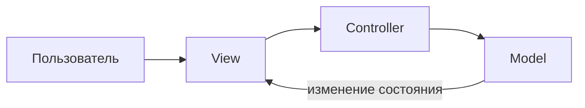

import ArchiStylerPlay from '@site/src/components/ArchiStylerPlay.jsx';

# Составные паттерны и MVC

  ОБЯЗАТЕЛЬНО
  ДЛЯ НОВИЧКОВ

Разработчику
Архитектору

В продакшене паттерны редко живут по одному. Типичный UI-сценарий (пульт управления, симулятор, дашборд) одновременно использует [Адаптер](./137.md), [Декоратор](./133.md), [Наблюдатель](./127.md) и [Компоновщик](./132.md). Частый архитектурный каркас таких систем — **Model–View–Controller (MVC)**. Здесь — как разложить роли и не перепутать MVC с «тремя папками в репозитории».

<ArchiStylerPlay defaultPattern="observer" title="Связи MVC и Observer" subtitle="Модель оповещает представления при изменении состояния" />

---

## MVC — три роли

| Роль | Ответственность | Что **не** должна делать |
|------|-----------------|--------------------------|
| **Model** | Данные и бизнес-правила (BPM, плейлист, заказ) | Рисовать UI и знать про кнопки |
| **View** | Отображение состояния модели | Менять правила расчёта скидки |
| **Controller** | Реакция на ввод пользователя, вызов операций модели | Хранить долгоживущее состояние домена |

Поток запроса: пользователь действует во **View** → **Controller** обновляет **Model** → **Model** уведомляет подписанные **View** → View перерисовывается.

В классическом примере с моделью ритма (BPM) модель хранит темп и список слушателей; представление (слайдеры, диаграмма) подписывается на изменения и не опрашивает модель в цикле — это прямое применение [Наблюдателя](./127.md) / [Наблюдателя в C#](./121.md).

---

## Какие паттерны GoF «сидят» внутри MVC

| Паттерн | Роль в MVC | Пример |
|---------|------------|--------|
| **Observer** | Model → View: слабая связь, автоматическое обновление UI | `PropertyChangeListener`, React state, SignalR push |
| **Strategy** | Подключаемые алгоритмы внутри модели или контроллера | Разные способы сортировки плейлиста, расчёта доставки |
| **Command** | Действие пользователя как объект (undo, очередь, макрос) | Кнопка «Play» упаковывает вызов в команду с историей |
| **Composite** | Дерево виджетов или меню | Панель содержит слайдеры и кнопки как единый `Component` |
| **Decorator** | Дополнительное оформление View без подклассов | Обводка, тени, логирование отрисовки |

MVC — **архитектурный** каркас; перечисленные шаблоны — **тактические** кирпичи внутри него. Обзор архитектурных стилей шире — в [Архитектурных паттернах](./114.md).

---

## Составной сценарий — несколько паттернов сразу

Условный **симулятор уток** в одном модуле может сочетать:

- утки с разным «кряканьем» — [Стратегия](./139.md);
- подсчёт кряков — [Декоратор](./133.md) вокруг `Quackable`;
- индюк за «уткой» — [Адаптер](./137.md);
- MVC для DJ-пульта — Model + View + Controller.

Урок для практики: **один паттерн решает одну ось изменений**. Если задача — только совместить API индюка и утки, достаточно Адаптера; если ещё нужен счётчик событий — добавляется Декоратор.

---

## MVC в корпоративном веб-приложении

Классический Spring Boot / ASP.NET MVC — это MVC **плюс** слои:

| Слой в проекте | Близкая роль MVC | Паттерны рядом |
|----------------|------------------|----------------|
| Controller / API | Controller | [Фасад](./129.md) над сервисами |
| Service | Model (правила) | [Стратегия](./139.md), [Команда](./126.md) |
| Repository | Model (доступ к данным) | [Фабрика](./136.md), DI |
| DTO + View (JSON, Razor, SPA) | View | [Адаптер](./137.md) к внешнему API |

Практика в лаборатории — [Spring Boot приложение](/lab/Кейсы/4): контроллер, сервис, репозиторий как разделение ответственности, а не как формальное «MVC ради MVC».

  
MVC и микросервисы

  

  В распределённой системе «моделью» часто становится сервис домена, «представлением» — SPA или BFF, «контроллером» — API-шлюз или REST-слой. Идея та же: <strong>изменение бизнес-правил не должно тянуть переписывание всех экранов</strong>.

  

---

## Чек-лист перед внедрением MVC

- Есть ли **несколько представлений** одних и тех же данных (веб, мобильное, отчёт)?
- Нужно ли **обновлять UI** при изменении модели без опроса?
- Отделены ли **тесты бизнес-логики** от UI-фреймворка?

Если ответ «нет» на все три вопроса, достаточно тонкого API и одного клиента — полноценный MVC может быть избыточен.

---

## См. также

- [Принципы ОО-проектирования перед паттернами](./142.md)
- [Частые паттерны GoF](./141.md)
- [Посредник в Java](./124.md) — альтернатива «спагетти» связей между виджетами
- [Жизненный цикл Spring MVC](/encyclopedia/5-languages/5-03-java/27) — как запрос проходит контроллер в Spring
