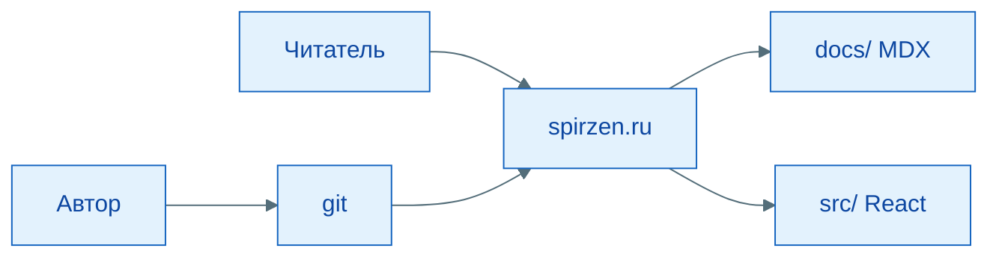

import ExternalPlayEmbed from '@site/src/components/ExternalPlayEmbed';

# Проектирование программных систем

  ОБЯЗАТЕЛЬНО
  ДЛЯ НОВИЧКОВ

Разработчику
Архитектору
Аналитику

  
Теория данных (раздел 3)

  

  Модель и масштаб — [Основы БД](/encyclopedia/3-data-markup/3-05-osnovy-baz-dannyh/intro), [опорные темы](/encyclopedia/3-data-markup/3-05-osnovy-baz-dannyh/12), [проектирование БД](design/116.md), [пакетная работа](/encyclopedia/3-data-markup/3-11-analiz-dannyh/433). Карта — [о разделе](./intro).
  

<ExternalPlayEmbed example="about/schema-maker-play" title="Эскиз паттерна" minHeight={560} playProps={{ defaultDocName: 'Паттерны', title: 'Эскиз паттерна', subtitle: 'Набросайте роли и связи до детализации в ArchiStyler' }} />

---

## Проектирование программного обеспечения

  
Правила неизбежности

  

  
- каждая система имеет свою архитектуру построения;

  
- систему нужно разворачивать так, чтобы она выдержала требуемую нагрузку;

  
- нужно понять, как обновлять систему, и исправлять ошибки;

  
- рано или поздно придётся интегрировать систему с внешними ресурсами;

  
- придётся обеспечить безопасность данных и доступа к системе;

  
- система неизбежно будет расширяться;

  
- будут ошибки, и нужна будет поддержка.

  

---

### Что такое проектирование?

Проектирование программного обеспечения — это *процесс принятия архитектурных и структурных решений*, направленный на обеспечение соответствия системы её целям. Он начинается задолго до появления первой строки кода и продолжается в течение всего жизненного цикла.

На входе систему часто рассматривают как **"чёрный ящик"**: известны внешние стимулы и ожидаемые результаты, внутренняя реализация ещё не зафиксирована. По мере проектирования ящик раскрывают — архитектура, модули, данные, API — с помощью нотаций (UML, ER-диаграммы, DFD, блок-схемы алгоритмов, макеты UI). Ограничения накладывает **модель предметной области** и выбранная [модель жизненного цикла](/encyclopedia/7-project/7-03-metodologiya-i-zhiznennyy-tsikl-po/1). Ошибки на этом этапе дороже всего: исправление архитектурной несогласованности после запуска системы может требовать переписывания значительной её части, в то время как уточнение требования или изменение структуры на стадии эскиза — дело одного обсуждения.

### Живой пример — от "чёрного ящика" к структуре репозитория

Снаружи [spirzen.ru](https://spirzen.ru) выглядит как сайт в браузере. Внутри — `docs/` (статьи), `src/` (тема и React-демо), `static/`, конфиг Docusaurus и пайплайн деплоя. Сводная схема раскрытия границ — [О проекте → архитектура](/about/project#arhitektura-proekta).

Важно разграничить три фундаментальных слоя проектирования: **подходы**, **принципы** и **паттерны**. Они действуют на разных уровнях абстракции и отвечают за разные аспекты процесса.

- **Подходы** определяют *порядок и направление* проектирования — с чего начать, в какой последовательности формировать компоненты системы, как синхронизировать их между собой.  
- **Принципы** — это *ограничения и эвристики*, выработанные практическим опытом, которые помогают избежать системных ошибок и сохранить управляемость кода. Они не предписывают конкретных действий, но позволяют оценить качество архитектурного решения.  
- **Паттерны** — это *повторяющиеся решения* для типовых проблем в конкретных контекстах. Это уже конкретные шаблоны — как устроить взаимодействие компонентов, как организовать инициализацию объектов, как реализовать обмен сообщениями.

<ExternalPlayEmbed example="about/archi-styler-play" title="Паттерны на диаграмме классов" minHeight={480} playProps={{ defaultPattern: 'factory', title: 'Паттерны на диаграмме классов', subtitle: 'Шаблоны GoF и архитектурные каркасы — с превью C# / Java' }} />

В этой главе рассматриваются **подходы** и **принципы проектирования** без детализации паттернов реализации или проектирования баз данных. Цель — дать системную основу для понимания последующих тем.

---

### С чего начать новичку

Если вы только входите в тему, проектирование удобно воспринимать как последовательность из четырех шагов:

1. Определить, **какую бизнес-проблему** решает система.
2. Зафиксировать **границы ответственности**: что делает система, а что остаётся внешним сервисам.
3. Согласовать **нефункциональные требования** — скорость, отказоустойчивость, безопасность, наблюдаемость.
4. Выбрать архитектурный каркас и только потом переходить к деталям реализации.

Такой порядок защищает команду от раннего "ныряния в код", когда технические детали уже написаны, а ключевые ограничения ещё не прояснены.

---

### Мини-кейс "Заказы интернет-магазина"

Сценарий: команда делает систему заказа и доставки.

- **Без проектирования** — сразу пишут `OrderController`, потом добавляют оплату, потом склад, потом статусы и уведомления. Через месяц появляются циклические зависимости, дубли правил и конфликтующие статусы.
- **С проектированием**: сначала фиксируют модель состояний заказа, инварианты и интеграционные точки. Только после этого выделяют API и внутренние сервисы.

Практический эффект:

- меньше переделок на позднем этапе;
- проще тестировать критические сценарии;
- ниже риск регрессий при изменении требований.

---

### Частые ошибки на старте

- Подменять проектирование выбором фреймворка и библиотек.
- Путать "архитектурную идею" с "структурой папок в репозитории".
- Описывать только "счастливый путь", не моделируя ошибки, таймауты и повторы.
- Считать, что "производительность добавим позже", не фиксируя NFR в цифрах.

---

### Что делать после этой статьи

Рекомендуемый маршрут:

1. [Подходы к проектированию](1111.md) — с какой точки входа начинать систему.
2. [Принципы проектирования](1112.md) — как оценивать качество решений.
3. [Проектирование под нефункциональные требования](1116.md) — как переводить NFR в архитектуру.
4. [Проектирование API и интеграций](117.md) — как фиксировать внешние контракты.
5. [Проектирование распределённых систем](21.md) — как работать с компромиссами CAP и PACELC.

---
