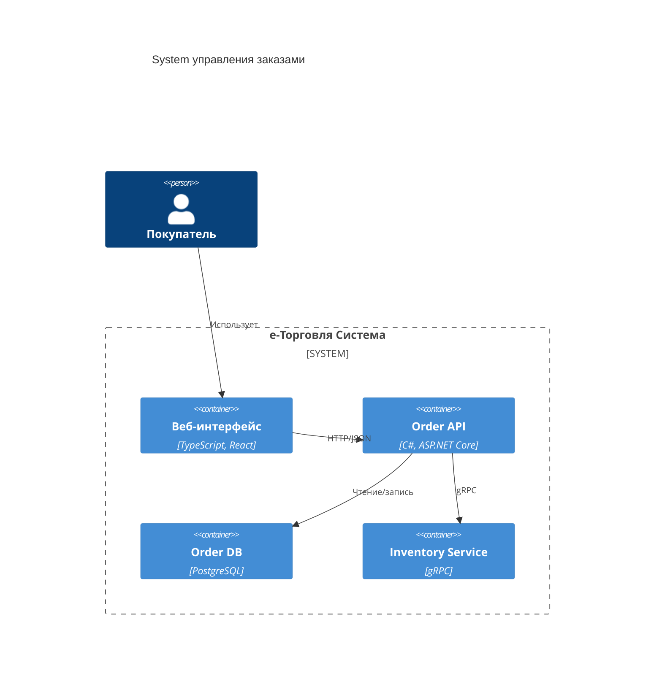

import DiagramStudio from '@site/src/components/DiagramStudio.jsx';

# Документация как инструмент проектирования

<div class="article-tags">
  <span class="tag tag-required">ОБЯЗАТЕЛЬНО</span>
  <span class="tag tag-beginner">ДЛЯ НОВИЧКОВ</span>
</div>

<span class="complexity-badge">Разработчику</span>
<span class="complexity-badge">Архитектору</span>
<span class="complexity-badge">Аналитику</span>


## Документация как инструмент проектирования

## 1. Проблема «мертвой» документации

Традиционный подход:  
1. Команда проектирует систему,  
2. Пишет код,  
3. По завершении — создаёт документацию для сдачи заказчику или архивирования.

Результат — документация:  
- Устаревает через неделю после деплоя,  
- Не отражает реальных компромиссов,  
- Не помогает новому разработчику понять *почему* система устроена так, а не иначе,  
- Используется только для аудита.

Это не документация — это *археологический артефакт*.

Хорошая документация — **living artifact**:  
- Создаётся *до* и *во время* проектирования,  
- Меняется вместе с системой,  
- Используется ежедневно командой (не только техписами),  
- Автоматизирована там, где возможно.

---

## 2. Типы документации в жизненном цикле проектирования

Документация делится по *цели и аудитории*.

### 2.1. Контекстная документация (Context)

**Цель**: объяснить *зачем* система существует, какие проблемы решает, в каком окружении работает.  
**Аудитория**: новые разработчики, менеджеры, архитекторы, заказчики.  
**Формат**:  
- **C4 Model — Уровень 1 (Система Context Diagram)** — система как чёрный ящиг, окружённый акторами (пользователи, внешние системы).  
- **ADR (Architectural Decision Record)** — фиксация ключевых решений с аргументами *за* и *против*.  
- **Non-functional Requirements** — измеримые NFR, как обсуждалось в предыдущем разделе.

**Пример ADR**:  
```markdown
## [ADR-003] Выбор Event Sourcing для Order Service

### Статус  
Принято 15.03.2025

### Контекст  
Требуется аудит всех изменений заказа, поддержка временных запросов («какой был статус 10.03?»), и компенсация ошибок через replay.

### Варианты  
1. **CRUD + Audit Table**  
   - Плюсы: простота, знакомая модель  
   - Минусы: сложность временных запросов, риск рассогласованности аудита  

2. **Event Sourcing**  
   - Плюсы: полная история, replay, естественная интеграция через события  
   - Минусы: сложность чтения, необходимость проекций  

### Решение  
Выбран Event Sourcing. Чтение реализуется через CQRS (материализованные представления).
```

Такой ADR живёт в репозитории (`/docs/adr/003-order-event-sourcing.md`) и становится частью кодовой базы.

### 2.2. Структурная документация (Structure)

**Цель**: показать *из чего состоит система* и как компоненты связаны.  
**Аудитория**: разработчики, DevOps, SRE.  
**Формат**:  
- **C4 Model — Уровень 2 (Container Diagram)** — сервисы, БД, внешние API, протоколы.  
- **C4 Model — Уровень 3 (Component Diagram)** — модули внутри сервиса (domain, application, infrastructure).  
- **Deployment Diagram** — как компоненты разворачиваются (K8s, VM, serverless).

**Ключевой принцип**: диаграммы генерируются из кода или поддерживаются в актуальном состоянии *вручную, но регулярно*.  
Инструменты:  
- **Structurizr** — DSL для C4-диаграмм, интеграция с CI/CD,  
- **Mermaid** — встраивается в Markdown, поддерживается в Docusaurus, Obsidian, Confluence.  
- **PlantUML** — для сложных диаграмм с версионированием.

Пример фрагмента Mermaid для Container Diagram:


Такая диаграмма обновляется при добавлении нового сервиса как *часть процесса интеграции*.

Соберите Container-диаграмму интерактивно (режим C4 → Containers, шаблон «Заказы»), отредактируйте под свой проект и скопируйте Mermaid в документацию:

<DiagramStudio initialMode="c4" modes={['c4', 'flow', 'uml', 'bpmn']} initialTemplate="orders" title="C4 Container — черновик" />

### 2.3. Поведенческая документация (Behaviour)

**Цель**: описать *как система работает* в типовых сценариях.  
**Аудитория**: тестировщики, аналитики, разработчики.  
**Формат**:  
- **Сценарии использования (Use Case)** — шаги, акторы, пред-/постусловия,  
- **Sequence Diagrams** — взаимодействие объектов во времени,  
- **State Machine Diagrams** — переходы между состояниями (например, статусы заказа).

Важно: такие диаграммы не рисуются в PowerPoint «на совещании». Они создаются *до* реализации — чтобы выявить логические разрывы.  
Пример: sequence-диаграмма для «Отмена оплаченного заказа» покажет, нужен ли возврат средств, кто его инициирует, как обрабатывается частичная отгрузка — до написания первой строки кода.

### 2.4. Контрактная документация (Contracts)

**Цель**: зафиксировать *интерфейсы взаимодействия* между компонентами.  
**Аудитория**: фронтенд/бэкенд-разработчики, внешние интеграторы.  
**Формат**:  
- **OpenAPI (Swagger)** — для REST,  
- **AsyncAPI** — для событий (Kafka, RabbitMQ),  
- **Protocol Buffers (.proto)** — для gRPC,  
- **JSON Schema** — для DTO и форм.

**Ключевой принцип**: контракты — *источник истины*.  
- Клиент и сервер генерируются из одного `.yaml`/`.proto`,  
- Валидация на шлюзе (API Gateway) проверяет соответствие запроса контракту,  
- Breaking change требует новой версии контракта — не тихого изменения поля.

Пример workflow:  
1. Аналитик + разработчик проектируют API в Swagger Editor,  
2. CI проверяет, не нарушает ли новый контракт обратную совместимость (spectral, openapi-diff),  
3. При мерже в `main` — генерируются клиентские SDK и обновляется Docusaurus-документация.

### 2.5. Живая документация (Living Документация)

**Цель**: обеспечить соответствие документации и реализации *в реальном времени*.  
**Механизмы**:  
- **Tests as Документация** — BDD-сценарии на Gherkin (`Given-When-Then`) читаются как спецификация:  
  ```gherkin
  Сценарий: Оформление заказа с недостатком товара
    Дано товар "Книга" в количестве 5 шт на складе
    Когда пользователь создаёт заказ на 10 шт
    Тогда возвращается ошибка "INSUFFICIENT_STOCK"
    И заказ не создаётся
  ```
- **API Docs from Code** — Swagger-аннотации в C# (`[ProducesResponseType]`) или Java (`@Operation`) генерируют OpenAPI-спецификацию.  
- **Interactive Примеры** — Docusaurus с плагином `@docusaurus/plugin-content-docs` + `redoc` / `swagger-ui` позволяет запускать запросы прямо из документации.

---

## 3. Инструменты для «живой» документации в Docusaurus

С учётом вашего стека (Docusaurus + Markdown), вот рекомендуемый стек:

| Задача | Инструмент | Как интегрируется |
|-------|------------|-------------------|
| **C4-диаграммы** | Mermaid + `@docusaurus/theme-classic` | Встроен в Docusaurus 3+; добавьте в `docusaurus.config.js`:  
````js
themeConfig: {
  mermaid: { theme: { ... } }
}
```` |
| **OpenAPI** | `@docusaurus/plugin-content-docs` + `redoc` | Используйте `@redocly/docusaurus-theme-redoc`, подключите `.yaml` как страницу:  
````md
# /docs/api/order.md

import Redoc from '@theme/Redoc';

<Redoc specUrl="/openapi/order.yaml" />
```` |
| **ADR** | Markdown-файлы в `/docs/adr/` | Подключите как отдельную sidebar в `sidebars.js`:  
````js
adr: [{ type: 'autogenerated', dirName: 'adr' }]
```` |
| **Interactive Code** | `@docusaurus/theme-live-codeblock` | Позволяет запускать JS/TS-примеры прямо в браузере (полезно для UI-логики). |

Преимущество: вся документация — в Git, версионируется вместе с кодом, проходит ревью в PR.

---

## 4. Документация как часть Definition of Done

Чтобы документация не «откладывалась на потом», её включают в **Definition of Done** для задачи:

- [ ] Код написан и покрыт тестами,  
- [ ] ADR обновлён (если было архитектурное решение),  
- [ ] C4-диаграмма обновлена (если изменилась структура),  
- [ ] OpenAPI-спецификация актуальна,  
- [ ] Примеры использования добавлены в документацию.

Такой подход гарантирует, что документация *не отстаёт* — она *развивается вместе с системой*.

---

