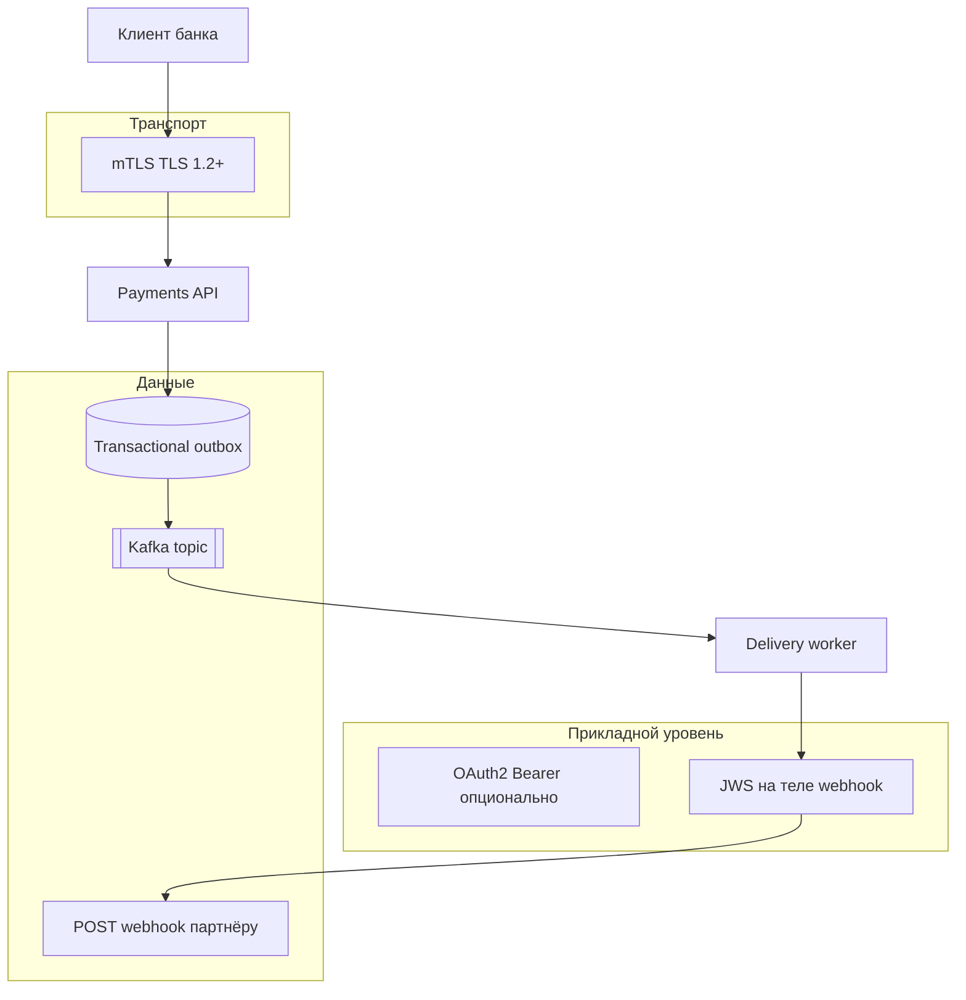
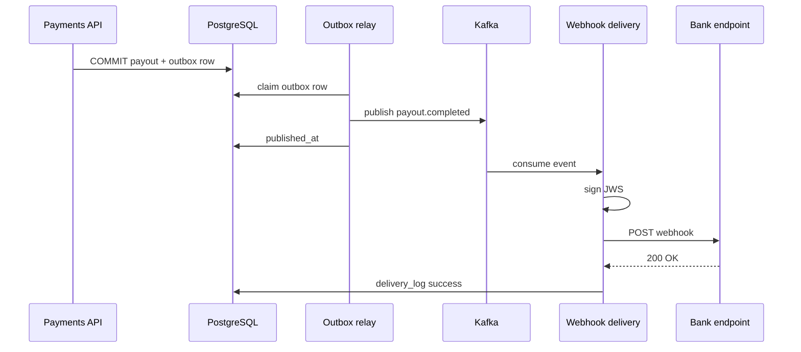

import ExternalCodeEmbed from '@site/src/components/ExternalCodeEmbed';


# mTLS, JWS-подпись webhooks и AsyncAPI с outbox

<div class="article-tags">
  <span class="tag tag-required">ОБЯЗАТЕЛЬНО</span>
  <span class="tag tag-beginner">ДЛЯ НОВИЧКОВ</span>
</div>

<span class="complexity-badge">Разработчику</span>
<span class="complexity-badge">Архитектору</span>
<span class="complexity-badge">Аналитику</span>


<div class="callout callout--info">
  <div class="callout-title">Теория данных (раздел 3)</div>
  <div class="callout-body">
  Модель и масштаб — [Основы БД](/encyclopedia/3-data-markup/3-05-osnovy-baz-dannyh/intro), [опорные темы](/encyclopedia/3-data-markup/3-05-osnovy-baz-dannyh/12), [проектирование БД](design/116.md), [пакетная работа](/encyclopedia/3-data-markup/3-11-analiz-dannyh/433). Карта — [о разделе](./intro).
  </div>
</div>

---

## Зачем третья глава

| Глава | Фокус |
|-------|--------|
| [Проектирование API и интеграций](/encyclopedia/7-project/7-06-proektirovanie-i-arhitektura/design/117) | REST, контракт, партнёрский API заказов, HMAC-ошибки |
| [Публичный API, OAuth 2.0 и webhooks](/encyclopedia/7-project/7-06-proektirovanie-i-arhitektura/design/1171) | Публичный API, OAuth 2.0, webhooks с shared secret |
| **Эта глава** | Регулируемый B2B: **mTLS** на транспорте, **JWS** на теле webhook, **AsyncAPI** на поток событий, **outbox** — чтобы событие не потерялось после commit в БД |

Сценарий: **банк-партнёр** подключается к платформе выплат. Требования: взаимная аутентификация по сертификату, неотрекаемость доставки уведомлений, аудит по `eventId`, согласованный каталог сообщений до деплоя.

---

## Слои доверия — что где проверять



- **mTLS** отвечает на вопрос «кто установил TCP/TLS-соединение» (сертификат клиента).
- **OAuth / scope** (если есть) — «какие операции разрешены этому client_id».
- **JWS** на webhook — «это тело не менялось после отправки платформой» (асимметричная подпись, ротация ключей через JWKS).

Подробнее про сертификаты: [8.07.112](/encyclopedia/8-infra-security/8-07-informatsionnaya-bezopasnost/112). HMAC из [Публичный API, OAuth 2.0 и webhooks](/encyclopedia/7-project/7-06-proektirovanie-i-arhitektura/design/1171) проще, но у крупных партнёров часто требуют **асимметрию** (платформа подписывает приватным ключом, банк проверяет публичным).

---

## mTLS — проектирование доступа

### Регистрация клиента

В консоли партнёра заводят запись:

| Поле | Пример | Зачем |
|------|--------|-------|
| `partnerId` | `bank_alfa` | ключ в логах и rate limit |
| `clientCertSubjectCN` | `payments-api.bank.example` | сопоставление с сертификатом |
| `allowedIPs` | опционально | дополнительный фильтр |
| `environment` | `sandbox` / `prod` | разные trust store |

Сертификат выпускает **ваш CA** или принимается сертификат из **доверенного УЦ партнёра** — политика фиксируется в договоре.

---

### Терминация TLS

Типичная схема:

1. **API Gateway / Ingress** завершает mTLS, прокидывает в заголовках `X-Client-Cert-Subject` или SPIFFE ID.
2. Сервис приложения **не** парсит PEM в каждом handler — идентичность уже проверена на краю.

Партнёр вызывает:

```http
GET /v1/payouts/po_7f3c9a2e HTTP/1.1
Host: api.payments.example
# TLS: клиентский сертификат bank_alfa (clientAuth)
Accept: application/json
```

Ответ `403` без валидного клиентского сертификата — ожидаемое поведение; тело ошибки в том же формате, что в [Проектирование API и интеграций](/encyclopedia/7-project/7-06-proektirovanie-i-arhitektura/design/117).

---

### Ротация сертификатов

- Перекрытие сроков: новый cert работает **до** отзыва старого (30–90 дней).
- В документации — fingerprint SHA-256 и дата `notAfter`.
- Алерт за 14 дней до истечения — обязанность **обеих** сторон.

mTLS **дополняет** OAuth для machine-to-machine: cert = «это именно инфраструктура банка», token = «этому client разрешён scope `payouts:read`».

---

## Webhooks с JWS — вместо одного shared secret

### Заголовки доставки

| Заголовок | Значение |
|-----------|----------|
| `Content-Type` | `application/json` |
| `X-Webhook-Id` | `evt_01JABC123` (идемпотентность — [Методы и ключ идемпотентности](/encyclopedia/7-project/7-06-proektirovanie-i-arhitektura/design/213)) |
| `X-Webhook-Timestamp` | `1716816005` |
| `X-Webhook-Signature` | `eyJhbGciOiJFERTQSIs...` — **compact JWS** над каноническим payload |

---

### Что подписываем

Строка для подписи (псевдоконтракт):

```text
{timestamp}.{raw_body_bytes}
```

`raw_body_bytes` — тело HTTP **до** JSON.parse. Партнёр повторяет ту же конкатенацию и проверяет JWS алгоритмом из заголовка JWS (`alg`: `EdDSA`, `RS256`).

Пример тела:

```json
{
  "id": "evt_01JABC123",
  "type": "payout.completed",
  "createdAt": "2026-05-27T14:00:00Z",
  "data": {
    "payoutId": "po_7f3c9a2e",
    "amount": { "value": "1500.00", "currency": "RUB" },
    "status": "completed"
  }
}
```

Платформа публикует **JWKS** по `GET https://api.payments.example/.well-known/webhook-jwks.json` — ротация `kid` без смены URL у партнёра.

---

### Проверка на стороне банка (псевдокод)


<ExternalCodeEmbed example="javascript/project-7-7-06-proektirovanie-i-arhitektura-design-1172-001" title="Проверка на стороне банка (псевдокод)" minHeight={390} />


Партнёр по-прежнему отвечает **`2xx` за секунды**, тяжёлую обработку кладёт во внутреннюю очередь — как в [Публичный API, OAuth 2.0 и webhooks](/encyclopedia/7-project/7-06-proektirovanie-i-arhitektura/design/1171).

---

## AsyncAPI — контракт на события

**OpenAPI** описывает синхронные HTTP-вызовы. **AsyncAPI** — каналы, сообщения, схемы payload для Kafka/RabbitMQ и для **исходящих** webhooks как «канал доставки».

Фрагмент AsyncAPI 3:


<ExternalCodeEmbed example="yaml/project-7-7-06-proektirovanie-i-arhitektura-design-1172-002" title="AsyncAPI — контракт на события" minHeight={624} />


Практика:

- одна **JSON Schema** на `PayoutCompleted` — и в Kafka, и в webhook (нет расхождения полей);
- ревью AsyncAPI **до** изменения producer;
- генерация типов (TypeScript, Java) и тестовых фикстур.

Синхронный REST по-прежнему в OpenAPI — [7.08.3](/encyclopedia/7-project/7-08-tehnicheskoe-pismo/3).

---

## Transactional outbox — от commit до webhook

Проблема: `UPDATE payouts SET status='completed'` закоммичен, а публикация в Kafka или HTTP webhook упала — партнёр не узнает о выплате.

---

### Шаг 1 — одна транзакция в БД


<ExternalCodeEmbed example="sql/project-7-7-06-proektirovanie-i-arhitektura-design-1172-003" title="Шаг 1 — одна транзакция в БД" minHeight={318} />


Таблица `outbox` — источник правды до успешной доставки. Паттерн разобран в [Saga / Outbox](/encyclopedia/7-project/7-06-proektirovanie-i-arhitektura/design/2124) и [событийной архитектуре](/encyclopedia/7-project/7-06-proektirovanie-i-arhitektura/design/2127).

---

### Шаг 2 — relay в брокер

Worker читает `published_at IS NULL`, публикует в `payments.payout.v1`, помечает строку:

```sql
UPDATE outbox SET published_at = now() WHERE id = 'evt_01JABC123';
```

Несколько инстансов — `FOR UPDATE SKIP LOCKED` (пример в [5.03 Java / outbox](/encyclopedia/5-languages/5-03-java/27)).

---

### Шаг 3 — delivery worker → webhook

Отдельный consumer (или тот же relay с веткой) строит конверт по AsyncAPI, подписывает JWS, шлёт `POST` на URL подписки банка. При `5xx` — retry с backoff; при исчерпании — DLQ и алерт `partnerId=bank_alfa`.

Идемпотентность: банк хранит `evt_01JABC123` 72 часа; повторная доставка → `200` без повторного списания в их учёте.



---

## Сводка — когда что включать

| Требование партнёра | Механизм |
|---------------------|----------|
| Доступ только с их ДЦ, без паролей в конфиге | mTLS |
| Scope и аудит по приложению | OAuth2 client credentials + mTLS |
| Неотрекаемость и ротация ключей подписи | JWS + JWKS |
| Согласованный каталог событий | AsyncAPI 3 |
| Не потерять событие после записи в БД | Transactional outbox → broker → webhook |

---

## Чеклист перед production

1. Trust store sandbox/prod разделены; тестовый cert **не** принимается в prod.
2. JWKS содержит минимум два `kid` при ротации.
3. AsyncAPI и OpenAPI версионируются вместе (`info.version`, changelog).
4. Outbox мониторится: возраст непубликованных строк, DLQ webhook.
5. Пентест / [8.07.128](/encyclopedia/8-infra-security/8-07-informatsionnaya-bezopasnost/128) включает replay webhook и отсутствие `alg: none` в JWS.

---

## Смежные материалы

| Тема | Статья |
|------|--------|
| Партнёрский REST (заказы) | [7.06.117](/encyclopedia/7-project/7-06-proektirovanie-i-arhitektura/design/117) |
| OAuth и HMAC-webhooks | [7.06.1171](/encyclopedia/7-project/7-06-proektirovanie-i-arhitektura/design/1171) |
| Outbox в Saga | [7.06.2124](/encyclopedia/7-project/7-06-proektirovanie-i-arhitektura/design/2124) |
| Теория очередей и брокеров | [2.09.121](/encyclopedia/2-system-network/2-09-osnovy-integratsionnogo-vzaimodeystviya/121) |
| Kafka в интеграции | [2.09.123](/encyclopedia/2-system-network/2-09-osnovy-integratsionnogo-vzaimodeystviya/123) |
| Маршрут по главам API | [7.06.117](/encyclopedia/7-project/7-06-proektirovanie-i-arhitektura/design/117) |

---
