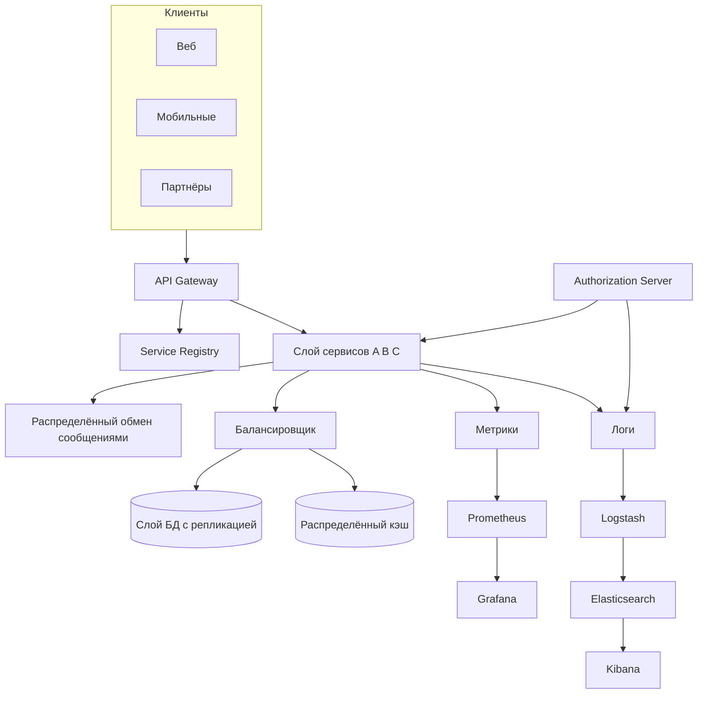

# Паттерны микросервисной архитектуры

<div class="article-tags">
  <span class="tag tag-required">ОБЯЗАТЕЛЬНО</span>
  <span class="tag tag-beginner">ДЛЯ НОВИЧКОВ</span>
</div>

<span class="complexity-badge">Разработчику</span>
<span class="complexity-badge">Архитектору</span>
<span class="complexity-badge">Аналитику</span>


<div class="callout callout--info">
  <div class="callout-title">Теория данных (раздел 3)</div>
  <div class="callout-body">
  Модель и масштаб — [Основы БД](/encyclopedia/3-data-markup/3-05-osnovy-baz-dannyh/intro), [опорные темы](/encyclopedia/3-data-markup/3-05-osnovy-baz-dannyh/12), [проектирование БД](./116.md), [пакетная работа](/encyclopedia/3-data-markup/3-11-analiz-dannyh/433). Карта — [о разделе](./intro).
  </div>
</div>

<div class="callout callout--tip">
  <div class="callout-title">Что прочитать до этой главы</div>

  <div class="callout-body">
  [Стили](../101.md), [NFR](1116.md), [распределённые системы](21.md), шпаргалка [12 концепций](../141.md) (gateway, discovery, circuit breaker).

  Перед разделением — [пять вопросов в декомпозиции монолита](../104.md#pyat-voprosov-pered-dekompoziciey).

  Если монолит не болит — [практика](../3.md), [модульный монолит](2126.md).
</div>
  </div>


---

## Паттерны микросервисной архитектуры

Микросервисы — **независимые сервисы с отдельным жизненным циклом**, каждый закрывает бизнес-возможность. Цена — сеть, согласованность, observability. Без паттернов ниже легко получить **распределённый монолит** (см. §17).

<div class="callout callout--warning">
  <div class="callout-title">Симптомы</div>

  <div class="callout-body">
  <p>Общая БД, цепочка из 5+ sync-вызовов, совместный релиз "всего зоопарка" — см. <a href="../104.md">декомпозицию</a> и <a href="2141.md">trade-off</a>.</p>
</div>
  </div>


---

<span id="ekosistema-msa"></span>

## Экосистема технологий вокруг микросервиса

**Микросервисная архитектура** — подход, при котором приложение делят на **независимые сервисы**, каждый из которых выполняет свою задачу, имеет собственный жизненный цикл и общается с остальными по сети. На схемах и в обзорах вокруг "центрального" сервиса часто показывают **девять групп технологий** — карта выбора — что понадобится при проектировании, разработке, выкате и эксплуатации.

Ниже — та же логика в виде таблицы со ссылками на главы энциклопедии. Она **дополняет**, а не заменяет [карту продакшн-стека](#prodakshn-stek) — там — роли в рантайме (gateway, registry, брокер в контуре), здесь — типовые **продукты и платформы** по слоям.

| Слой | Зачем в MSA | Примеры технологий | Углубление |
|------|-------------|-------------------|------------|
| **Базы данных** | Database per service; SQL для транзакций, NoSQL для гибкой схемы и масштаба | **SQL** — [MySQL](/encyclopedia/3-data-markup/3-07-sql/889), [PostgreSQL](/encyclopedia/3-data-markup/3-07-sql/888); **NoSQL** — [MongoDB](/encyclopedia/3-data-markup/3-06-nosql/intro), [Cassandra](/encyclopedia/3-data-markup/3-06-nosql/2), [DynamoDB](/encyclopedia/8-infra-security/8-01-oblachnye-tehnologii/1), [HBase](/encyclopedia/3-data-markup/3-06-nosql/1) | [Полиглотное хранение](/encyclopedia/3-data-markup/3-06-nosql/2#1-микросервисы-и-полиглотное-хранение-polyglot-persistence), [управление РСУБД](/encyclopedia/3-data-markup/3-08-upravlenie-rsubd/1), [проектирование БД](/encyclopedia/7-project/7-06-proektirovanie-i-arhitektura/design/116), [пакетная работа с данными](/encyclopedia/3-data-markup/3-11-analiz-dannyh/433) |
| **Брокеры сообщений** | Асинхронные события, сглаживание пиков, слабая связность | [Kafka](/encyclopedia/8-infra-security/8-05-mikroservisy-i-integratsiya/119), [RabbitMQ](/encyclopedia/8-infra-security/8-05-mikroservisy-i-integratsiya/118), Amazon SQS | [Брокеры в основах интеграции](/encyclopedia/2-system-network/2-09-osnovy-integratsionnogo-vzaimodeystviya/121), [асинхронная коммуникация](/encyclopedia/8-infra-security/8-05-mikroservisy-i-integratsiya/114) |
| **Языки** | Разный стек под команду и домен (polyglot) | [Java](/encyclopedia/5-languages/5-03-java/intro), [.NET](/encyclopedia/5-languages/5-04-platforma-dotnet/intro), [Go](/encyclopedia/5-languages/5-10-go/intro), [Node.js](/encyclopedia/5-languages/5-01-javascript/intro), [Python](/encyclopedia/5-languages/5-02-python/intro) | [Архитектура MSA](/encyclopedia/8-infra-security/8-05-mikroservisy-i-integratsiya/112) |
| **Безопасность** | Единая аутентификация, права между сервисами, шифрование трафика | JWT, OAuth 2.0 / OIDC, API authorization, TLS | [Аутентификация и авторизация](/encyclopedia/2-system-network/2-08-osnovy-informatsionnoy-bezopasnosti/111), [§3 — доступ и безопасность](#3-управление-доступом-и-безопасность) |
| **Контейнеры** | Одинаковый артефакт от dev до prod, изоляция процессов | [Docker](/encyclopedia/8-infra-security/8-06-konteynerizatsiya-i-orkestratsiya/111), Podman | [Контейнеры в микросервисах](/encyclopedia/8-infra-security/8-06-konteynerizatsiya-i-orkestratsiya/117#контейнеры-в-микросервисах) |
| **Оркестрация контейнеров** | Реплики, health check, rolling update, service discovery | [Kubernetes](/encyclopedia/8-infra-security/8-06-konteynerizatsiya-i-orkestratsiya/117), OpenShift, AWS ECS, HashiCorp Nomad | [Реализация Kubernetes](/encyclopedia/8-infra-security/8-06-konteynerizatsiya-i-orkestratsiya/1171), [жизненный цикл CI/CD](/encyclopedia/8-infra-security/8-04-devops-ci-cd/14) |
| **Облачные провайдеры** | Managed БД, очереди, кластеры, биллинг по потреблению | AWS, Azure, GCP; VPS — Linode, DigitalOcean | [Облачные технологии](/encyclopedia/8-infra-security/8-01-oblachnye-tehnologii/intro), [облако и архитектура](/encyclopedia/7-project/7-06-proektirovanie-i-arhitektura/105) |
| **CI/CD** | Сборка, тесты и выкат каждого сервиса отдельно | [GitHub Actions](/encyclopedia/8-infra-security/8-04-devops-ci-cd/2112), [Jenkins](/encyclopedia/8-infra-security/8-04-devops-ci-cd/3114), TeamCity, [GitLab CI](/encyclopedia/8-infra-security/8-04-devops-ci-cd/2113), CircleCI | [DevOps — о разделе](/encyclopedia/8-infra-security/8-04-devops-ci-cd/intro), [CI/CD — принципы](/encyclopedia/8-infra-security/8-04-devops-ci-cd/11) |
| **Мониторинг** | Метрики, логи и алерты по десяткам инстансов | [Prometheus](/encyclopedia/8-infra-security/8-04-devops-ci-cd/3115), [Grafana](/encyclopedia/8-infra-security/8-04-devops-ci-cd/3116), [Kibana](/encyclopedia/8-infra-security/8-04-devops-ci-cd/3120) (стек ELK), Zabbix | [Практикум Prometheus и Grafana](/encyclopedia/2-system-network/2-06-sistemnoe-administrirovanie/prometheus-grafana-praktikum/intro), [PromQL — галерея](/lab/Примеры/11114), [Практикум Zabbix](/encyclopedia/2-system-network/2-06-sistemnoe-administrirovanie/zabbix-praktikum/intro), [§8 — наблюдаемость](#8-наблюдаемость-и-диагностика), [логирование в DevOps](/encyclopedia/8-infra-security/8-04-devops-ci-cd/19) |

<div class="callout callout--tip">
  <div class="callout-title">Как пользоваться картой</div>

  <div class="callout-body">
  На старте достаточно одного языка, одной СУБД, Docker Compose и простого CI.

  Остальные блоки добавляют по мере роста нагрузки и числа команд.

  Сначала зафиксируйте границы сервисов и контракты API — см. [декомпозицию](../104.md) и [первые шаги к микросервисам](/encyclopedia/8-infra-security/8-05-mikroservisy-i-integratsiya/101).
</div>
  </div>


---

<span id="prodakshn-stek"></span>

## Карта продакшн-стека — девять компонентов

Типовое **продакшн-приложение на микросервисах** собирают из повторяющихся блоков — единый вход, реестр экземпляров, слой бизнес-сервисов, централизованная безопасность, данные с репликацией, общий кэш, асинхронный обмен, метрики и централизованные логи. Ниже — как эти блоки стыкуются в одном контуре; детали паттернов — в §1–§8 дальше по статье.



| № | Компонент | Роль в контуре | Углубление в энциклопедии |
|---|-----------|----------------|---------------------------|
| 1 | **API Gateway** | Единая точка входа: маршрутизация, TLS, rate limit, иногда агрегация ответов | §5 ниже, [12 концепций §6](../141.md#6-api-gateway), [REST в инфраструктуре](/encyclopedia/8-infra-security/8-05-mikroservisy-i-integratsiya/1151) |
| 2 | **Service Registry** | Каталог живых экземпляров `host:port` и health для gateway и сервисов | §4 ниже, [Kubernetes Services](/encyclopedia/8-infra-security/8-06-konteynerizatsiya-i-orkestratsiya/intro) |
| 3 | **Слой сервисов** | Независимые микросервисы; sync (REST, gRPC) и async (события) между собой | §1–§2 ниже, [коммуникация](/encyclopedia/8-infra-security/8-05-mikroservisy-i-integratsiya/113) |
| 4 | **Authorization Server** | Выдача и проверка токенов (OAuth 2.0 / OIDC), роли, админ-доступ | §3 ниже, [API и интеграции](117.md), [основы ИБ](/encyclopedia/2-system-network/2-08-osnovy-informatsionnoy-bezopasnosti/111) |
| 5 | **Слой БД** | Database per service; реплики для отказоустойчивости и чтения | §6 ниже, [репликация РСУБД](/encyclopedia/3-data-markup/3-08-upravlenie-rsubd/1) |
| 6 | **Распределённый кэш** | Redis/Memcached для горячих ключей и сессий; снижает нагрузку на БД | [12 концепций §2](../141.md#2-кэширование-caching), [Redis](/encyclopedia/3-data-markup/3-06-nosql/5) |
| 7 | **Распределённый обмен сообщениями** | Очереди и топики (RabbitMQ, Kafka): фоновые задачи, события, сглаживание пиков | [брокеры](/encyclopedia/2-system-network/2-09-osnovy-integratsionnogo-vzaimodeystviya/121), [RabbitMQ](/encyclopedia/8-infra-security/8-05-mikroservisy-i-integratsiya/118), [Kafka](/encyclopedia/8-infra-security/8-05-mikroservisy-i-integratsiya/119) |
| 8 | **Мониторинг и метрики** | Сбор RPS, latency, ошибок; дашборды и алерты | §8 ниже, [Практикум Prometheus и Grafana](/encyclopedia/2-system-network/2-06-sistemnoe-administrirovanie/prometheus-grafana-praktikum/intro), [PromQL — галерея](/lab/Примеры/11114), [Практикум Zabbix](/encyclopedia/2-system-network/2-06-sistemnoe-administrirovanie/zabbix-praktikum/intro), [Prometheus](/encyclopedia/8-infra-security/8-04-devops-ci-cd/3115), [Grafana](/encyclopedia/8-infra-security/8-04-devops-ci-cd/3116) |
| 9 | **Конвейер логирования** | Централизованный поиск по логам всех сервисов | §8 ниже, [Logstash](/encyclopedia/8-infra-security/8-04-devops-ci-cd/3119), [сисадмин — логи](/encyclopedia/2-system-network/2-06-sistemnoe-administrirovanie/3) |

### Типовые потоки

**Синхронный запрос пользователя.** Клиент → API Gateway (проверка токена, лимиты) → service registry подсказывает адрес инстанса → сервис → при необходимости балансировщик перед кэшем или БД → ответ наружу через gateway.

**Асинхронная работа.** Сервис публикует событие или задачу в брокер; потребители обрабатывают в своём темпе. HTTP-клиенту достаточно ответа "принято", пока воркеры догоняют очередь.

**Наблюдаемость.** Каждый сервис отдаёт метрики в Prometheus и структурированные логи в общий конвейер; по `trace_id` связывают логи, метрики и трассировку (Jaeger, OpenTelemetry). Сбор стека на учебном стенде — [Практикум Prometheus и Grafana](/encyclopedia/2-system-network/2-06-sistemnoe-administrirovanie/prometheus-grafana-praktikum/intro); готовые PromQL-запросы — [галерея Lab](/lab/Примеры/11114); мониторинг серверов и сети — [Практикум Zabbix](/encyclopedia/2-system-network/2-06-sistemnoe-administrirovanie/zabbix-praktikum/intro). Без этого девять компонентов на схеме не помогают при инциденте.

<div class="callout callout--info">
  <div class="callout-title">Связь с шпаргалкой "12 концепций"</div>

  <div class="callout-body">
  Балансировка, кэш, gateway, discovery, очереди и rate limit из [12 концепций архитектуры распределённых систем](../141.md) — инфраструктурные кирпичи внутри этой карты.

  Здесь же показано, **как они собираются в один продакшн-контур** вокруг слоя сервисов.

  Типовые **продукты по слоям** (БД, брокеры, K8s, CI/CD) — в [экосистеме технологий](#ekosistema-msa) выше.
</div>
  </div>


---

### 1. Основа — Декомпозиция по бизнес-возможностям

Любая микросервисная архитектура начинается с правильной декомпозиции системы. Центральным принципом является разделение приложения по бизнес-возможностям (business capabilities). Это означает, что каждый сервис должен инкапсулировать одну или несколько связанных бизнес-функций, которые имеют четкое значение для бизнеса. Например, в интернет-магазине это могут быть сервисы "Управление заказами", "Управление каталогом товаров", "Обработка платежей" и "Служба поддержки клиентов".

Декомпозиция по бизнес-возможностям позволяет командам сосредоточиться на конкретной области ответственности, что упрощает разработку, тестирование и поддержку. Она также способствует созданию слабо связанных компонентов, что является необходимым условием для независимого развертывания и масштабирования.

Альтернативный подход — декомпозиция по поддоменам (subdomains) — также используется, особенно в рамках подхода DDD (Domain-Driven Design). Поддомен представляет собой логическую часть бизнес-домена, например, "Заказы", "Платежи", "Инвентарь". Этот подход помогает структурировать систему в соответствии с семантикой бизнеса, но требует глубокого понимания предметной области.

Важно отметить, что выбор границ сервисов — это итеративный процесс. На начальных этапах границы могут быть не идеальными, и их следует корректировать по мере роста системы и уточнения требований.

---

### 2. Коммуникация между сервисами

Одним из фундаментальных аспектов микросервисной архитектуры является коммуникация между сервисами. Поскольку каждый сервис работает независимо, они должны обмениваться данными и координировать действия. Существуют два основных механизма коммуникации: синхронный и асинхронный.

Синхронная коммуникация обычно осуществляется через вызовы удаленных процедур (Remote Procedure Invocation), такие как HTTP/REST или gRPC. Этот метод подходит для сценариев, где требуется немедленный ответ, например, при получении данных о пользователе или проверке состояния заказа. Однако он создает прямую зависимость между сервисами, что может привести к проблемам с производительностью и отказоустойчивостью, если один из сервисов недоступен.

Асинхронная коммуникация реализуется с помощью шин сообщений (Messaging). Сервисы отправляют события или сообщения в очередь, а другие сервисы подписываются на них и обрабатывают в своем темпе. Это позволяет достичь высокой степени децентрализации и устойчивости, так как сервисы не зависят друг от друга во времени. Примеры таких систем — Apache Kafka, RabbitMQ, AWS SQS. Теория Producer–Broker–Consumer, ACK и выбор брокера — [брокеры сообщений](/encyclopedia/2-system-network/2-09-osnovy-integratsionnogo-vzaimodeystviya/121). Асинхронная коммуникация особенно полезна для обработки длинных операций, таких как отправка электронной почты, генерация отчетов или обработка платежей.

Выбор между синхронной и асинхронной коммуникацией зависит от требований к производительности, надежности и сложности системы. Часто применяется гибридный подход, где для критически важных операций используется синхронная коммуникация, а для фоновых задач — асинхронная.

---

### 3. Управление доступом и безопасность

В распределенной системе, состоящей из множества сервисов, обеспечение безопасности является первостепенной задачей. Один из ключевых паттернов — использование токенов доступа (Access Token). Токены позволяют аутентифицировать и авторизовать запросы между сервисами без необходимости передачи учетных данных пользователя на каждый сервис.

**Authorization Server** (сервер авторизации) в продакшн-контуре — отдельный компонент или кластер — Keycloak, Auth0, Okta, корпоративный IdP. Он выдаёт access token и refresh token после логина пользователя или client credentials для сервер-серверных вызовов. API Gateway и микросервисы **проверяют** подпись и claims (роли, scopes), а не хранят пароли. Для админ-панелей и операторских сценариев те же токены ограничивают доступ к опасным операциям (удаление данных, смена тарифов).

Токен доступа передаётся в заголовке `Authorization: Bearer …` и проверяется на gateway и в сервисах, которым нужна авторизация. Так вся система опирается на один механизм безопасности без дублирования каталога пользователей в каждом микросервисе.

Дополнительно, для защиты внутреннего трафика между сервисами можно использовать механизмы, такие как Mutual TLS (mTLS), где каждый сервис имеет свой сертификат и проверяет сертификаты других сервисов. Это предотвращает несанкционированный доступ к внутренним API.

---

### 4. Обнаружение сервисов

В динамической среде, где сервисы могут запускаться, останавливаться или масштабироваться, необходимо иметь механизм, позволяющий сервисам находить друг друга. Это решается с помощью паттернов обнаружения сервисов (Service Discovery).

Существует два основных подхода: клиентское обнаружение (Client-side discovery) и серверное обнаружение (Server-side discovery).

При клиентском обнаружении клиентский сервис сам отвечает за поиск доступных экземпляров целевого сервиса. Для этого он обращается к реестру сервисов (service registry), который хранит информацию о текущих адресах и состоянии всех сервисов. Клиент выбирает один из доступных экземпляров и отправляет ему запрос. Этот подход требует от клиента реализации логики балансировки нагрузки и повторных попыток в случае сбоя.

При серверном обнаружении клиент отправляет запрос на прокси-сервер или балансировщик нагрузки, который сам обращается к реестру сервисов и перенаправляет запрос на подходящий экземпляр целевого сервиса. Это упрощает клиентскую сторону, но добавляет дополнительный уровень абстракции и потенциальный узкий пункт отказа.

Выбор подхода зависит от требований к сложности клиентской логики и уровню централизации управления. В большинстве современных систем используется комбинация обоих подходов, где клиентское обнаружение применяется для внутренних вызовов, а серверное — для внешнего доступа через API Gateway.

---

### 5. Шлюз API

API Gateway является центральной точкой входа для всех внешних запросов в систему. Он выполняет множество функций, включая маршрутизацию запросов, аутентификацию, авторизацию, преобразование протоколов, кэширование и сбор метрик.

Основная задача API Gateway — абстрагировать внутреннюю структуру микросервисов от внешних клиентов. Клиенты взаимодействуют только с шлюзом, который знает, как распределить запрос между нужными сервисами. Это позволяет изменять внутреннюю архитектуру без влияния на клиентов.

API Gateway также может выполнять агрегацию данных, собирая информацию из нескольких сервисов и возвращая ее клиенту в едином формате. Это снижает количество запросов, которые должен сделать клиент, и упрощает клиентскую логику.

Кроме того, шлюз может применять политики безопасности, такие как ограничение частоты запросов (rate limiting — [пять алгоритмов](../141#10-rate-limiting)), защита от DDoS-атак и валидация входящих данных. Это делает его важным элементом в обеспечении надежности и безопасности системы.

---

### 6. Управление состоянием и конфигурацией

В микросервисной архитектуре важно обеспечить независимость сервисов, в том числе в отношении данных. Паттерн "База данных на сервис" (Database per Service) предполагает, что каждый сервис имеет свою собственную базу данных, которая не совместно используется с другими сервисами. Это позволяет каждому сервису выбирать оптимальную технологию хранения данных (SQL, NoSQL, графовая база и т.д.) и изменять схему базы данных без влияния на другие сервисы.

Однако этот подход создает проблемы с согласованностью данных и реализацией транзакций, охватывающих несколько сервисов. Для решения этих проблем используются паттерны, такие как Saga, который представляет собой последовательность локальных транзакций, каждая из которых обновляет данные одного сервиса. Если одна из транзакций завершается неудачно, запускается компенсирующая транзакция для отката изменений.

На схеме продакшн-стека **слой БД** часто стоит за балансировщиком: запись идёт на primary, чтение — на реплики. Репликация даёт отказоустойчивость (падение узла — переключение на копию) и разгружает отчёты и справочники. Кэш (Redis) ставят рядом с тем же балансировщиком или как отдельный managed-кластер: сервис сначала читает кэш, при промахе — БД.

Для управления конфигурацией сервисов применяется паттерн "Внешняя конфигурация" (Externalized Configuration). Конфигурационные параметры (например, адреса баз данных, токены доступа, настройки логгирования) хранятся вне кода сервиса, в централизованном хранилище, таком как Consul, etcd или Spring Cloud Config. Это позволяет изменять конфигурацию без пересборки и переразвертывания сервисов, что упрощает управление и масштабирование.

---

<span id="nadezhnost-msa"></span>

### 7. Надёжность и отказоустойчивость

Распределённые системы сбоятся по сети чаще, чем "ломается код". Важны не только retry, но и **ограничение ущерба**: не держать потоки на зависшем Payment.

Базовые термины (исключение в одном сервисе, фатальный сбой процесса, логирование с `cause`) — [4.06 / Ошибки и исключения](/encyclopedia/4-code-dev/4-06-arhitektura-vypolneniya/111). Паттерны уровня **кластера** — ниже и в [Инженерии устойчивости](2136.md).

---

#### Circuit Breaker (предохранитель)

**Circuit Breaker** — паттерн, который временно **перестаёт звонить** в зависимость при стабильных ошибках. Полное описание и пороги — в **[Инженерия устойчивости](2136.md)**.

| Состояние | Поведение |
|-----------|-----------|
| **Closed** | Вызовы идут в зависимость |
| **Open** | Fail fast без вызова |
| **Half-Open** | Пробные вызовы для проверки восстановления |

**Разбор:** Order → Payment. Payment лёг — без breaker Order копит таймауты и "роняет" витрину. С breaker — быстрый отказ и осмысленный fallback (очередь, статус "ожидает оплаты").

---

#### Retry, timeout, bulkhead

| Механизм | Что решает |
|----------|------------|
| **Timeout** | Не ждать бесконечно |
| **Retry** | Временный сбой (только для идемпотентных операций) |
| **Circuit Breaker** | Долгий outage зависимости |
| **Bulkhead** | Изоляция пулов (отчёт не съедает API) |

Подробнее — [Инженерия устойчивости](2136.md) (retry, circuit breaker, порядок политик), [надёжность и доступность](2134.md).

---

### 8. Наблюдаемость и диагностика

В сложной распределенной системе необходимо иметь возможность отслеживать состояние сервисов, анализировать производительность и диагностировать проблемы. Это достигается с помощью паттернов, относящихся к наблюдаемости (Observability).

Ключевыми компонентами наблюдаемости являются логгирование, метрики и трассировка.

Логгирование включает в себя запись событий, происходящих в системе. В микросервисной архитектуре важно использовать структурированное логгирование, где каждое сообщение содержит уникальный идентификатор запроса (trace ID), что позволяет коррелировать логи между сервисами. Также применяется аудит-логгирование для записи критически важных операций, таких как изменения данных или доступ к защищенным ресурсам.

Метрики предоставляют количественную информацию о работе системы — количество запросов, время отклика, количество ошибок, использование ресурсов и т.д. В типовом стеке **Prometheus** (pull-модель: опрос `/metrics` у сервисов и экспортёров) хранит временные ряды; **Grafana** строит дашборды и алерты (RPS, p95 latency, error rate, lag очередей). Справочники — [Prometheus](/encyclopedia/8-infra-security/8-04-devops-ci-cd/3115), [Grafana](/encyclopedia/8-infra-security/8-04-devops-ci-cd/3116); практикумы — [Prometheus и Grafana](/encyclopedia/2-system-network/2-06-sistemnoe-administrirovanie/prometheus-grafana-praktikum/intro), [Zabbix](/encyclopedia/2-system-network/2-06-sistemnoe-administrirovanie/zabbix-praktikum/intro); готовые PromQL-запросы — [галерея Lab](/lab/Примеры/11114).

**Конвейер логирования (ELK и аналоги).** Микросервисы пишут структурированные логи (JSON) в stdout или файл; агент или **Logstash** принимает поток, обогащает полями (имя сервиса, окружение) и отправляет в **Elasticsearch** для индексации и поиска. **Kibana** — веб-интерфейс для фильтров, дашбордов и расследования инцидентов. Authorization Server и gateway тоже отдают аудит-логи в тот же контур. Альтернативы — Grafana Loki, OpenSearch, облачные Log Analytics. См. [Logstash](/encyclopedia/8-infra-security/8-04-devops-ci-cd/3119).

Распределенная трассировка (Distributed tracing) позволяет отслеживать путь запроса через несколько сервисов. Каждый сервис добавляет свои данные в трассировку, что позволяет построить полную картину выполнения запроса и выявить узкие места или сбои. Инструменты, такие как Jaeger или Zipkin, используются для сбора и анализа трассировок.

Дополнительно, сервисы должны предоставлять API для проверки своего состояния (Health check API), которое позволяет системам оркестрации (например, Kubernetes) определять, готов ли сервис к обработке запросов.

---

### 9. Развертывание и инфраструктура

Организация развертывания микросервисов также требует применения специальных паттернов. Один из них — "Один сервис на хост" (Single Service per Host), при котором каждый сервис развертывается на отдельном хосте или контейнере. Это обеспечивает изоляцию ресурсов и упрощает масштабирование, но может привести к неэффективному использованию ресурсов.

Альтернативный подход — "Несколько сервисов на хост" (Multiple Services per Host) — позволяет более эффективно использовать ресурсы, но усложняет управление и отладку, так как несколько сервисов работают в одном окружении.

Для автоматизации развертывания и управления жизненным циклом сервисов используются платформы оркестрации, такие как Kubernetes, которые обеспечивают автоматическое масштабирование, балансировку нагрузки, обнаружение сервисов и управление конфигурацией.

---

### 10. Скрещивающиеся вопросы (Cross-cutting concerns)

Помимо основных паттернов, существуют скрещивающиеся вопросы, которые затрагивают несколько аспектов архитектуры. К ним относятся тестирование, безопасность, наблюдаемость и управление конфигурацией.

Тестирование микросервисов требует применения различных стратегий: компонентного тестирования (Service Component Test), интеграционного тестирования (Service Integration Contract Test) и тестирования на уровне контракта (Contract Testing). Контрактное тестирование позволяет проверить, что сервисы взаимодействуют в соответствии с заранее определенным контрактом, что предотвращает регрессии при изменениях.

Безопасность включает в себя аутентификацию и авторизацию, защиту данных, шифрование трафика, управление секретами и аудит доступа.

Наблюдаемость, как уже упоминалось, включает логгирование, метрики и трассировку, что позволяет обеспечить прозрачность работы системы и быструю диагностику проблем.

Управление конфигурацией и секретами требует использования централизованных хранилищ, которые обеспечивают безопасное хранение и распределение конфигурационных данных.

---

### 11. Паттерны развертывания и жизненного цикла

Микросервисы, будучи независимыми единицами, требуют гибкой и автоматизированной стратегии развертывания. Существует несколько подходов, различающихся по уровню изоляции, сложности и эффективности использования ресурсов.

---

#### **Один контейнер на один сервис**

Наиболее распространенный и рекомендуемый подход в современной практике. Каждый микросервис упаковывается в собственный контейнер (обычно Docker), что обеспечивает:
- **Повторяемость** окружения (от разработки до продакшена),
- **Изолированность зависимостей** (версии библиотек, runtime),
- **Упрощенное масштабирование** (каждый контейнер может быть независимо реплицирован),
- **Интеграцию с оркестраторами** (Kubernetes, Docker Swarm и др.).

Контейнеризация не означает обязательного использования Kubernetes, но в масштабных системах Kubernetes становится почти неизбежным выбором благодаря своей зрелости в управлении жизненным циклом, самовосстановлением и декларативной модели.

---

#### **Сервис как функция (Function as a Service, FaaS)**

В некоторых сценариях, особенно при наличии короткоживущих, событийных задач (например, обработка загруженного файла или валидация webhook), микросервисы могут быть заменены функциями, запускаемыми по событию. Это частный случай — **серверлесс-архитектура**. Хотя FaaS и микросервисы решают разные задачи, в гибридных архитектурах они часто сосуществуют: основные бизнес-сервисы реализуются как микросервисы, а вспомогательные или всплесковые задачи — как функции.

FaaS не заменяет микросервисы в целом, а дополняет их. Микросервисы сохраняют преимущества в управлении состоянием, долгоживущих соединениях (WebSocket, gRPC-стримы) и предсказуемом времени запуска.

---

#### **Стратегии развертывания**

Для минимизации рисков при обновлении используются стратегии:
- **Blue-Green Deployment** — развертывание новой версии параллельно с текущей, с последующим переключением трафика. Обеспечивает практически мгновенный откат.
- **Canary Release** — постепенное введение новой версии для части пользователей (например, 5 %, затем 20 % и т.д.). Позволяет собирать метрики и логи до полного развертывания.
- **Feature Toggle** — архитектурный приём: функциональность включается/выключается динамически через конфигурацию, без изменения кода или перезапуска. Особенно полезен при длительной разработке крупных фич.

Эти подходы часто комбинируются: например, Canary-релиз с Feature Toggle внутри версии.

---

### 12. Управление данными и согласованность

Одним из самых сложных аспектов микросервисной архитектуры является работа с данными. Поскольку каждый сервис владеет своими данными, возникает проблема **транзакционной согласованности**.

---

#### **Проблема распределённых транзакций**

В монолитной системе с общей базой данных можно использовать ACID-транзакции для обеспечения атомарности изменений. В микросервисах это невозможно: нет единой базы, к которой можно было бы применить `BEGIN ... COMMIT`. Попытка использовать двухфазный коммит (2PC) в распределённой среде приводит к снижению производительности, блокировкам и сложности отладки.

---

#### **Saga — паттерн для управления долгими транзакциями**

Saga представляет собой последовательность локальных транзакций, каждая из которых принадлежит одному сервису. Если какая-либо транзакция завершается неудачно, запускается цепочка **компенсирующих действий** — операций, отменяющих предыдущие шаги.

Существует два варианта реализации Saga:
- **Хореография (Choreography)** — каждый сервис публикует события, на которые подписываются другие. Логика потока распределена по сервисам. Преимущество — отсутствие централизованного оркестратора. Недостаток — сложность анализа и отладки, особенно при большом числе шагов.
- **Оркестрация (Orchestration)** — выделяется отдельный сервис (Saga Orchestrator), который управляет последовательностью шагов и принимает решения о компенсации. Преимущество — централизованная логика, проще тестировать. Недостаток — Orchestrator становится точкой сложности и потенциального отказа.

Выбор зависит от масштаба и критичности процесса. Для простых процессов (например, создание заказа → резервирование → оплата) подходит хореография. Для сложных, регулируемых бизнес-процессов (например, согласование кредита) — оркестрация.

---

#### **Event Sourcing и CQRS**

Эти два паттерна часто применяются совместно и особенно полезны в системах с высокими требованиями к аудиту, воспроизводимости состояния и сложной логикой изменения данных.

- **[Event Sourcing](2123.md)** — состояние агрегата выводится из append-only журнала доменных событий (`OrderCreated`, `OrderShipped`); UI читает проекцию (read model), при сбое её пересобирают replay. Сравнение с CRUD на примере заказа — [2123.md#crud-i-event-sourcing](2123.md#crud-i-event-sourcing). Недостаток — сложность хранилища событий, порядка и версионирования схемы.

- **CQRS (Command Query Responsibility Segregation)** — разделение операций на две категории:
  - **Команды (Commands)** — изменяют состояние (write-side), обычно идут через event sourcing и транзакции.
  - **Запросы (Queries)** — только читают данные (read-side), используют оптимизированные для выборки представления (например, денормализованные таблицы, кэш, материализованные представления).

CQRS устраняет компромиссы между оптимизацией записи и чтения. Однако он вносит сложность: требуется синхронизация read-model с write-model, что часто реализуется асинхронно и приводит к **временной несогласованности** (eventual consistency). Это приемлемо в большинстве бизнес-сценариев (например, пользователь не заметит, что статус заказа обновился через 200 мс), но требует проектирования интерфейсов с учётом этого фактора.

---

### 13. Версионирование и эволюция API

Микросервисы развиваются независимо, и их API со временем меняются. Чтобы избежать нарушения работы клиентов при обновлении, применяется строгая политика версионирования.

---

#### **Стратегии версионирования**
- **Версионирование в URL** (`/api/v1/orders`) — простой и наглядный способ, но фиксирует версию на уровне маршрута, что усложняет редиректы и кэширование.
- **Версионирование в заголовках** (`Accept: application/vnd.myapi.v2+json`) — более чистый с точки зрения REST, но менее очевидный для разработчиков и инструментов.
- **Версионирование по контракту без явного номера** — когда клиенты не указывают версию, но API гарантирует **обратную совместимость** (backwards compatibility). Это идеальный, но труднодостижимый вариант. На практике сочетают с семантическим версионированием и политикой deprecation.

---

#### **Deprecation Policy**

Каждое изменение API должно сопровождаться:
- Объявлением устаревших (deprecated) полей/методов,
- Документированием срока жизни (например, "поддержка v1 прекращается через 6 месяцев"),
- Логгированием использования устаревших версий для анализа готовности клиентов к миграции.

Важно: **не следует удалять функциональность немедленно**. Плавный переход — ключевой принцип зрелой API-экосистемы.

---

### 14. Управление зависимостями и контрактами

В монолите зависимости между модулями проверяются на этапе компиляции. В микросервисах это невозможно: сервисы могут быть написаны на разных языках и развиваться независимо. Поэтому необходимо явно управлять **контрактами взаимодействия**.

---

#### **Контрактное тестирование (Consumer-Driven Contract Testing)**

Суть подхода: потребитель (consumer) сервиса описывает, какие данные и в каком формате он ожидает получить. Поставщик (provider) проверяет, что его API по-прежнему удовлетворяет этим ожиданиям.

Инструменты, такие как **Pact**, автоматизируют этот процесс:
1. Потребитель создаёт "контракт" — JSON-файл, описывающий запросы и ожидаемые ответы.
2. Контракт публикуется в центральном хранилище.
3. Поставщик при сборке запускает тесты против своих эндпоинтов, проверяя соответствие всем зарегистрированным контрактам.

Это позволяет выявлять нарушения совместимости **до** развертывания в продакшн.

---

#### **Schema Registry**

Для событийной коммуникации через брокеры (например, Kafka), где структура сообщений может меняться, применяется **Schema Registry** (например, Confluent Schema Registry для Avro). Он хранит схемы сообщений, обеспечивает их версионирование и проверяет совместимость при записи/чтении. Это гарантирует, что producer и consumer используют согласованные структуры данных, даже если они обновляются в разное время.

---

### 15. Организационные и процессные паттерны

Микросервисная архитектура — это технологический и **организационный выбор**. Конвеер Девопс и культура ответственности команды за полный жизненный цикл сервиса — необходимые условия успеха.

---

#### **You Build It, You Run It**

Команда, разрабатывающая сервис, отвечает и за его эксплуатацию — мониторинг, инциденты, оптимизацию. Это повышает мотивацию к качеству, улучшает обратную связь и сокращает время реакции на сбои.

---

#### **Platform Team**

При росте числа микросервисов возникает дублирование усилий — каждая команда настраивает CI/CD, логгирование, шаблоны безопасности. Решение — выделение **Platform Team**, которая предоставляет внутреннюю платформу как продукт (Internal Developer Platform, IDP). Эта платформа включает:
- Шаблоны CI/CD-конвейеров,
- Базовые Dockerfile ([галерея типовых образов](/lab/Примеры/11113), [теория Dockerfile](/encyclopedia/8-infra-security/8-06-konteynerizatsiya-i-orkestratsiya/116)) и Helm-чарты,
- Библиотеки для логгирования, трассировки, circuit breaker,
- Инструменты развертывания.

Цель — абстрагировать команды от инфраструктурной сложности, позволив им фокусироваться на бизнес-логике.

---

#### **Обратная связь и метрики качества архитектуры**

Важно измерять технические метрики (latency, error rate) и **архитектурные**:
- Частота каскадных сбоев,
- Время восстановления после инцидента (MTTR),
- Доля изменений, требующих одновременного обновления нескольких сервисов,
- Количество прямых вызовов между сервисами (высокое значение может сигнализировать о неудачной декомпозиции).

Эти метрики помогают оценить "здоровье" архитектуры и вовремя скорректировать курс.

---

### 16. Реализация ключевых паттернов в популярных стеках

Хотя паттерны архитектуры независимы от языка и платформы, их конкретная реализация зависит от экосистемы. Ниже приведены проверенные подходы для трёх наиболее распространённых стеков: **.NET**, **JVM (Java/Kotlin)** и **Node.js/TypeScript**.

---

#### **.NET (C#, ASP.NET Core)**

- **Service Discovery**:  
  Используется `Microsoft.Extensions.DependencyInjection` в связке с библиотекой **Steeltoe** (для интеграции с Spring Cloud Netflix/Eureka или Consul). В Kubernetes-окружении часто достаточно встроенного DNS-разрешения (`http://order-service:8080`), но для гибридных сред — Steeltoe + Consul.

- **API Gateway**:  
  **YARP (Yet Another Reverse Proxy)** от Microsoft — современное, производительное решение с поддержкой маршрутизации, rate limiting, retry policies и health checks. Для сложных сценариев агрегации — **Ocelot**, хотя его активное развитие замедлилось.

- **Circuit Breaker и Resilience**:  
  **Polly** — де-факто стандарт. Поддерживает retry, circuit breaker, timeout, bulkhead isolation и их комбинации через политики (`Policy.Wrap`). Интегрируется с `HttpClientFactory`.

- **Distributed Tracing**:  
  Встроенная поддержка OpenTelemetry через `OpenTelemetry.Exporter.Zipkin` / `Jaeger`. ASP.NET Core автоматически пропагирует `traceparent` и `tracestate` в заголовках.

- **Saga**:  
  Часто реализуется вручную через конечные автоматы или с помощью библиотеки **MassTransit** (для оркестрации на основе сообщений в RabbitMQ/Kafka) или **NServiceBus** (платная, enterprise-grade).

> Примечание: .NET 8+ активно развивает поддержку cloud-native сценариев, включая health checks, конфигурацию через среду выполнения и улучшенную интеграцию с Kubernetes.

---

#### **JVM (Java/Kotlin, Spring Boot)**

- **Service Discovery**:  
  **Spring Cloud Netflix** (Eureka) — устаревает, но по-прежнему широко используется. Актуальная альтернатива — **Spring Cloud Consul** или **Spring Cloud Kubernetes**, особенно в облачных окружениях.

- **API Gateway**:  
  **Spring Cloud Gateway** — реактивный, основанный на WebFlux, замена Zuul. Поддерживает предикаты маршрутизации, фильтры, rate limiting через Redis.

- **Circuit Breaker**:  
  **Resilience4j** — лёгкая, функциональная замена Hystrix (устарел). Поддерживает circuit breaker, bulkhead, rate limiter, retry. Интеграция через аннотации (`@CircuitBreaker`) или декларативные конфигурации.

- **Distributed Tracing**:  
  **Spring Cloud Sleuth** + **Zipkin/Jaeger** — автоматическая инструментация HTTP, Kafka, RabbitMQ, JDBC. Sleuth теперь основан на OpenTelemetry (в новых версиях).

- **Event Sourcing / CQRS**:  
  **Axon Framework** — наиболее зрелое решение — поддержка aggregate roots, sagas, event sourcing, snapshotting. Имеет Axon Server (централизованное хранилище событий) или работает с Kafka/RabbitMQ.

---

#### **Node.js / TypeScript (NestJS, Express)**

- **Service Discovery**:  
  Ручная реализация через `consul` или `etcd`. В NestJS — `DiscoveryService`. В Kubernetes — DNS сервиса:

```typescript

import dns from "node:dns/promises";

await dns.resolve4("orders.orders.svc.cluster.local");
```

- **API Gateway**:  
  **Express Gateway**, **Kong** (внешний), или кастомный шлюз на NestJS с `@nestjs/microservices` и `ProxyModule`. Для простых сценариев — обратный прокси на **Traefik** или **Nginx** с динамической конфигурацией.

- **Circuit Breaker**:  
  **`opossum`** — активно поддерживаемая библиотека с поддержкой событий (`fire`, `close`, `open`), fallback-функций и статистики. Альтернатива — **`cockatiel`** (более современная, TypeScript-first).

- **Distributed Tracing**:  
  **OpenTelemetry JS SDK** — официальный инструментарий. Автоматическая инструментация Express, Fastify, GraphQL, pg, mysql2. Экспорт в Jaeger, Zipkin, Prometheus.

- **Event Sourcing**:  
  Практически нет зрелых фреймворков "из коробки". Обычно реализуется вручную с использованием:
  - Kafka или Redis Streams как event log,
  - TypeORM/Prisma для read-model,
  - Кастомные aggregate-классы с методами `apply(event)` и `rehydrate(events)`.

> Общая тенденция: все стеки сходятся к **OpenTelemetry** как стандарту наблюдаемости и к **Schema Registry + Contract Testing** как обязательному условию стабильной интеграции.

---

### 17. Анти-паттерны и типичные ошибки

Несмотря на привлекательность микросервисов, многие команды сталкиваются с проблемами, которые делают систему **сложнее, медленнее и менее надёжной**, чем исходный монолит. Ниже — перечень наиболее распространённых анти-паттернов.

---

#### **"Распределённый монолит" (Distributed Monolith)**

Сервисы формально разделены, но:
- Имеют **сильную временную связность** (сервис A вызывает B, B вызывает C, C вызывает D — синхронная цепочка),
- Используют **общую базу данных** или общие таблицы,
- Требуют **одновременного развертывания** нескольких сервисов для внесения изменений.

**Симптомы**:  
— Время запуска системы не уменьшилось.  
— Один сбой вызывает каскад ошибок.  
— Разработка новых фич по-прежнему требует координации всех команд.

**Решение**:  
— Провести аудит вызовов: выявить цепочки и заменить синхронные вызовы асинхронными событиями.  
— Применить **bounded context analysis** (DDD), чтобы пересмотреть границы сервисов.  
— Ввести **contract testing**, чтобы зафиксировать зависимости.

---

#### **Чрезмерная декомпозиция**

Когда сервисы слишком малы (например, "Сервис получения имени пользователя", "Сервис получения email’а"), накладные расходы на сеть, оркестрацию и мониторинг начинают превышать выгоду.

**Правило большого пальца**:  
— Сервис должен реализовывать **законченную бизнес-возможность**, а не техническую подфункцию.  
— Изменение требований в одной бизнес-области не должно затрагивать более 2–3 сервисов.

---

#### **Игнорирование временной несогласованности**

Команды проектируют интерфейсы так, будто данные всегда согласованы, но в распределённой системе с асинхронной коммуникацией это невозможно. Например, после создания заказа пользователь сразу переходит на страницу оплаты, но сервис оплаты ещё не получил событие `OrderCreated`.

**Решение**:  
— Дизайн интерфейса с учётом **eventual consistency** — показывать статус "Заказ принят, ожидает обработки", а не блокировать интерфейс.  
— Использовать **optimistic UI**: обновлять интерфейс заранее, а при ошибке — откатывать с уведомлением.

---

#### **Отсутствие единой политики логгирования и трассировки**

Логи не содержат `trace_id`, трассировки обрываются между сервисами, метрики не коррелируются с логами.

**Последствия**: диагностика инцидентов занимает часы вместо минут.

**Решение**:  
— Внедрить OpenTelemetry на всех уровнях.  
— Обязательно пропагировать `traceparent` в заголовках (W3C Trace Context).  
— Использовать структурированное логгирование (JSON) с единым набором полей — `trace_id`, `span_id`, `service_name`, `level`, `message`.

---

#### **"Секреты в коде" и "Конфигурация в репозитории"**

Хранение токенов, паролей, connection string в Git — критическая уязвимость.

**Решение**:  
— Использовать **Vault** (HashiCorp), **AWS Secrets Manager**, **Azure Key Vault**.  
— В Kubernetes — `Secret` + `ServiceAccount` с RBAC.  
— На этапе сборки — только placeholder’ы (`$&#123;DB_PASSWORD&#125;`), подстановка — на этапе запуска через sidecar или init-container.

---

### 18. Эволюция монолита в микросервисы — пошаговый подход

Полный переписывание системы — рискованно и почти всегда неоправданно. Реалистичный путь — **пошаговая стратегическая эволюция**.

---

#### **Шаг 1. Подготовка фундамента**
- Внедрить **CI/CD** (даже для монолита).  
- Настроить **наблюдаемость** — логгирование, метрики, health checks.  
- Автоматизировать **тестирование** (unit, integration).  
- Выделить **bounded contexts** по модели DDD (анализ предметной области через ubiquitous language).

---

#### **Шаг 2. Стратегическая изоляция**
- **Выделить модуль в отдельный деплой-юнит**, но без выноса данных (паттерн **Strangler Fig**).  
  Пример: модуль "Управление пользователями" остаётся в монолите, но вызывается через REST-интерфейс из других частей приложения.  
- Заменить прямые вызовы методов на **HTTP или сообщения** — это создаёт границу, которую позже можно физически разделить.

---

#### **Шаг 3. Вынос данных**
- Создать **дублирующую базу данных** для выделяемого сервиса.  
- Настроить **синхронизацию данных** через:
  - **Trigger-based CDC** (например, Debezium для PostgreSQL),
  - **Eventual consistency** через события (сервис публикует `UserUpdated`, монолит подписывается и обновляет кэш/локальные данные).
- Постепенно переключить чтение и запись на новую БД, отключив старую.

---

#### **Шаг 4. Независимое развертывание**
- Настроить **отдельный CI/CD-конвейер** для сервиса.  
- Внедрить **contract testing** между сервисом и монолитом.  
- Добиться, чтобы обновление сервиса не требовало пересборки монолита.

---

#### **Шаг 5. Повторение**
- Применить шаги 2–4 к следующему модулю.  
- Постепенно **уменьшать размер монолита**, превращая его в "легаси-ядро" или удаляя полностью.

> **Важно**: не все части системы стоит делать микросервисами. Некоторые — например, внутренние расчёты, не связанные с внешним взаимодействием, — лучше оставить в модульном монолите.

---

### 19. Метрики зрелости микросервисной архитектуры

Чтобы объективно оценить прогресс, можно использовать следующую шкалу зрелости:

| Уровень | Характеристики |
|--------|----------------|
| **0. Монолит** | Одно приложение, одна БД, одно развертывание. |
| **1. Распределённый монолит** | Несколько исполняемых файлов, но сильные зависимости, общая БД, синхронные цепочки вызовов. |
| **2. Независимые сервисы** | Чёткие границы, собственные БД, асинхронная коммуникация для кросс-сервисных операций. |
| **3. Автономные команды** | Команды управляют полным циклом (build → run), используют IDP, применяют contract testing. |
| **4. Самоорганизующаяся система** | Автоматическое масштабирование по бизнес-метрикам, self-healing (автовосстановление на основе анализа трассировок), A/B-тестирование на уровне сервисов. |

Диагностика текущего уровня помогает определить, куда инвестировать усилия: в инфраструктуру, процессы или пересмотр архитектуры.

---

## Что запомнить

Сервис = бизнес-возможность; своя БД; gateway + tracing обязательны. **Дальше:** [Saga](2124.md) · [Стратегии декомпозиции монолитных систем](../104.md) · [Threat modeling для архитекторов](2142.md) · [итоги](../998.md)

---
