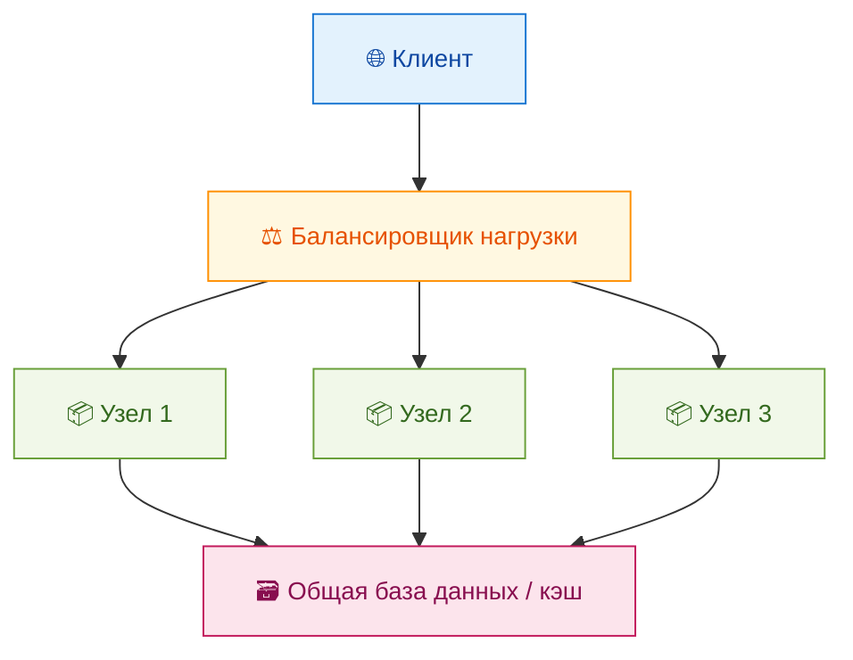
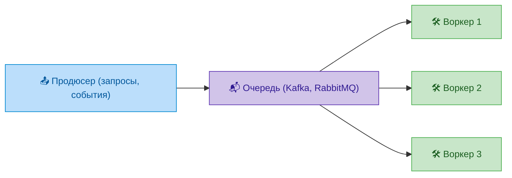
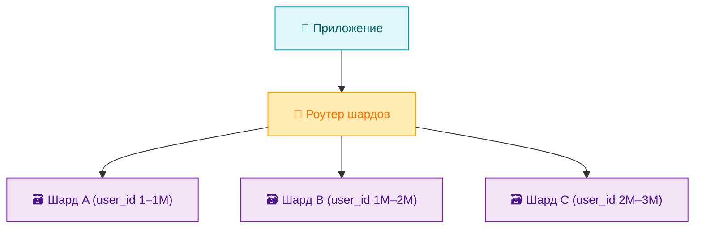

# Горизонтальное масштабирование

<div class="article-tags">
  <span class="tag tag-required">ОБЯЗАТЕЛЬНО</span>
  <span class="tag tag-beginner">ДЛЯ НОВИЧКОВ</span>
</div>

<span class="complexity-badge">Разработчику</span>
<span class="complexity-badge">Архитектору</span>
<span class="complexity-badge">Аналитику</span>

## Горизонтальное масштабирование

### Horizontal Scaling

Горизонтальное масштабирование — это стратегия расширения вычислительных ресурсов системы за счёт добавления дополнительных узлов, таких как физические серверы, виртуальные машины или контейнеры. Каждый из этих узлов выполняет одну и ту же функцию или часть общей задачи, что позволяет системе обрабатывать возрастающий объём запросов без перегрузки отдельных компонентов. Такой подход лежит в основе современных распределённых архитектур и широко применяется в облачных средах, микросервисных приложениях и высоконагруженных сервисах.

Основная цель горизонтального масштабирования — повышение пропускной способности системы, её отказоустойчивости и гибкости. В отличие от вертикального масштабирования, где ресурсы увеличиваются внутри одного узла (например, установка более мощного процессора или добавление оперативной памяти), горизонтальное масштабирование предполагает создание кластера из множества однотипных узлов, совместно обрабатывающих входящую нагрузку. Это делает систему не только производительнее, но и устойчивее к сбоям: если один из узлов перестаёт отвечать, остальные продолжают работу без остановки сервиса.

Центральным элементом горизонтально масштабируемой архитектуры является балансировщик нагрузки. Он принимает все входящие запросы от клиентов и распределяет их между доступными узлами кластера. Балансировщик может использовать различные алгоритмы распределения — например, «круговой перебор» (round-robin), наименьшее количество активных соединений, случайный выбор или даже динамическую оценку загруженности каждого узла. Современные решения, такие как NGINX, HAProxy, AWS Elastic Load Balancer или встроенные механизмы Kubernetes, поддерживают не только маршрутизацию трафика, но и проверку работоспособности узлов, автоматическое исключение неработающих экземпляров и восстановление после сбоев.

Для успешного горизонтального масштабирования система должна быть спроектирована как **stateless** — то есть без сохранения состояния сессии или данных пользователя внутри конкретного узла. Если приложение хранит данные локально, например, в оперативной памяти или на диске одного сервера, то последующие запросы от того же клиента должны направляться именно на этот сервер, что нарушает принцип равномерного распределения нагрузки. Чтобы избежать этой проблемы, состояние выносится во внешние хранилища — базы данных, кэши вроде Redis или Memcached, объектные хранилища. Такой подход обеспечивает полную взаимозаменяемость узлов: любой из них может обработать любой запрос, не завися от истории взаимодействия с клиентом.

Горизонтальное масштабирование особенно эффективно в условиях переменной нагрузки. Облачные платформы, такие как Amazon Web Services, Google Cloud Platform или Microsoft Azure, позволяют автоматически добавлять или удалять узлы в зависимости от текущей интенсивности трафика. Механизмы вроде Horizontal Pod Autoscaler в Kubernetes отслеживают метрики — например, использование CPU или количество HTTP-запросов в секунду — и при превышении пороговых значений запускают новые экземпляры приложения. Когда нагрузка снижается, избыточные узлы завершают работу, что позволяет оптимизировать расходы на вычислительные ресурсы.

Отказоустойчивость — ещё одно ключевое преимущество горизонтального масштабирования. При наличии нескольких узлов сбой одного из них не приводит к полному останову сервиса. Система продолжает функционировать, хотя и с пониженной производительностью. Это особенно важно для критически важных приложений — банковских систем, медицинских платформ, торговых площадок, где даже кратковременная недоступность может повлечь серьёзные последствия. Архитектура с избыточностью также упрощает процессы обслуживания: можно обновлять или перезагружать узлы по одному, не прерывая работу всего сервиса.

Однако горизонтальное масштабирование требует тщательного проектирования. Не все приложения легко адаптируются к распределённой модели. Например, монолитные системы, где бизнес-логика и данные тесно связаны, могут потребовать значительной рефакторинговой работы для разделения на независимые компоненты. Также необходимо учитывать сетевые задержки между узлами, согласованность данных в распределённых базах, сложность отладки и мониторинга. Инструменты вроде Prometheus, Grafana, Jaeger и ELK-стека помогают отслеживать состояние каждого узла, анализировать производительность и выявлять узкие места.

В контексте баз данных горизонтальное масштабирование реализуется через шардинг — разделение данных на части (шарды), которые размещаются на разных узлах. Каждый шард отвечает за определённый сегмент данных, например, по идентификатору пользователя или географическому региону. Это позволяет распределить не только вычислительную нагрузку, но и объём хранимой информации. Однако шардинг усложняет выполнение транзакций, охватывающих несколько шардов, и требует продуманной стратегии маршрутизации запросов. Некоторые современные базы данных, такие как Cassandra, ScyllaDB или CockroachDB, изначально спроектированы для горизонтального масштабирования и автоматически управляют распределением данных.

Горизонтальное масштабирование стало стандартом де-факто в современной инфраструктуре. Оно лежит в основе архитектурных паттернов, таких как микросервисы, serverless-вычисления и event-driven системы. Эти подходы предполагают, что каждая функция или сервис может масштабироваться независимо, в зависимости от своей нагрузки. Например, в интернет-магазине модуль авторизации может требовать меньше ресурсов, чем модуль обработки платежей, и масштабироваться отдельно. Это обеспечивает гибкость, экономическую эффективность и быструю реакцию на изменения в поведении пользователей.

---

### Архитектурные требования к горизонтальному масштабированию

Для того чтобы система могла эффективно масштабироваться по горизонтали, она должна соответствовать определённым архитектурным принципам. Первый и самый важный из них — отсутствие привязки к конкретному узлу. Каждый запрос должен быть обрабатываемым любым доступным экземпляром сервиса. Это достигается за счёт вынесения состояния за пределы приложения: данные пользователя, сессии, временные файлы и другие изменяемые объекты хранятся в централизованных или распределённых хранилищах, доступных всем узлам. Такой подход позволяет свободно добавлять и удалять узлы без риска нарушить целостность данных или пользовательский опыт.

Второе требование — идемпотентность операций. Поскольку в распределённой системе возможны сетевые сбои, дублирование запросов или частичные отказы, каждая операция должна быть безопасной для повторного выполнения. Например, если клиент отправляет платёжный запрос, но не получает подтверждение из-за таймаута, он может повторить запрос. Система должна корректно обработать этот повтор, не списав деньги дважды. Идемпотентность обеспечивается за счёт уникальных идентификаторов запросов, журналирования операций и проверки их выполнения до применения изменений.

Третий принцип — наблюдаемость. В системе с десятками или сотнями узлов невозможно отслеживать состояние вручную. Поэтому каждый компонент должен генерировать логи, метрики и трассировки, которые собираются централизованно. Инструменты вроде Prometheus фиксируют загрузку CPU, объём памяти, количество ошибок и задержки. Grafana визуализирует эти данные в реальном времени. Jaeger или Zipkin позволяют проследить путь одного запроса через несколько микросервисов, выявляя узкие места. Без такой инфраструктуры диагностика проблем превращается в игру вслепую.

Четвёртый аспект — автоматизация. Горизонтальное масштабирование теряет смысл, если добавление нового узла требует ручной настройки. Современные системы используют образы контейнеров (Docker), шаблоны виртуальных машин (AMI в AWS) или конфигурационные менеджеры (Ansible, Terraform), чтобы развертывание происходило мгновенно и без участия человека. Оркестраторы вроде Kubernetes не только запускают новые экземпляры, но и следят за их жизненным циклом: перезапускают зависшие процессы, перераспределяют трафик, обновляют версии ПО без простоя.

Пятый элемент — сетевая надёжность. Все узлы взаимодействуют друг с другом и с внешним миром через сеть, которая по своей природе ненадёжна. Задержки, потеря пакетов, временные недоступности — обычное дело. Поэтому архитектура должна предусматривать механизмы устойчивости: таймауты, повторные попытки, цепочки отказа (circuit breakers), буферизация. Библиотеки вроде Hystrix или Resilience4j помогают реализовать эти паттерны на уровне кода. Кроме того, важно минимизировать количество синхронных вызовов между узлами, заменяя их асинхронными сообщениями через очереди (Kafka, RabbitMQ, Amazon SQS).

---

### Горизонтальное масштабирование в практике облачных провайдеров

Облачные платформы предоставляют встроенные механизмы горизонтального масштабирования на всех уровнях стека. В Amazon Web Services можно создать Auto Scaling Group, который будет автоматически регулировать количество EC2-инстансов на основе метрик CloudWatch. В Google Cloud Platform аналогичную функцию выполняет Managed Instance Group с поддержкой прогнозирующего масштабирования. Microsoft Azure предлагает Scale Sets с возможностью масштабирования по расписанию или по событиям.

На уровне контейнеров Kubernetes предоставляет Horizontal Pod Autoscaler (HPA), который отслеживает среднюю загрузку CPU или пользовательские метрики из Prometheus и масштабирует количество подов в Deployment. Более продвинутый Cluster Autoscaler даже управляет размером самого кластера, заказывая новые виртуальные машины у облачного провайдера при нехватке ресурсов.

В serverless-архитектурах, таких как AWS Lambda или Azure Functions, горизонтальное масштабирование происходит полностью прозрачно для разработчика. Каждый вызов функции выполняется в изолированной среде, и платформа сама создаёт столько экземпляров, сколько требуется для обработки текущей нагрузки. Это достигает идеального уровня эластичности, но накладывает ограничения на длительность выполнения, объём памяти и состояние.

---

### Экономические и организационные последствия

Горизонтальное масштабирование меняет не только техническую архитектуру, но и подход к управлению ресурсами. Вместо крупных капитальных вложений в мощные серверы компания переходит к операционной модели, где платит только за реально использованные ресурсы. Это особенно выгодно для стартапов и проектов с непредсказуемой нагрузкой: можно начать с минимальной конфигурации и масштабироваться по мере роста аудитории.

Однако такая модель требует новых компетенций. Команды разработки должны понимать основы DevOps, уметь работать с инструментами мониторинга, проектировать отказоустойчивые системы. Архитекторы обязаны продумывать распределение данных, согласованность, восстановление после сбоев. Это ведёт к появлению ролей Site Reliability Engineer (SRE) и Cloud Architect, а также к интеграции культуры надёжности в сам процесс разработки.

---

### Ограничения и компромиссы

Несмотря на все преимущества, горизонтальное масштабирование не является универсальным решением. Некоторые задачи по своей природе трудно распараллеливаются: например, сложные аналитические запросы к базе данных, требующие полного сканирования таблицы, или вычисления, зависящие от предыдущих шагов (как в рекуррентных нейросетях). В таких случаях приходится комбинировать горизонтальное и вертикальное масштабирование или использовать специализированные решения — колоночные базы данных, GPU-кластеры, in-memory вычисления.

Ещё один компромисс — сложность. Распределённая система всегда сложнее монолита. Она требует больше инструментов, больше знаний, больше времени на отладку. Часто возникают проблемы, которые невозможны в однопоточной среде: гонки данных, частичные сбои, несогласованность кэшей, каскадные отказы. Поэтому решение о переходе к горизонтальному масштабированию должно приниматься осознанно, с учётом реальных потребностей бизнеса, а не просто потому, что это «современно».

---

### Практические примеры горизонтального масштабирования

Рассмотрим несколько типичных сценариев, где горизонтальное масштабирование применяется на практике.

*Веб-приложение с высокой нагрузкой.*  
Представим сервис онлайн-кинотеатра, который ежедневно обслуживает миллионы пользователей. В пиковые часы — например, вечером или во время премьеры — количество запросов резко возрастает. Чтобы справиться с этим, архитектура приложения разделена на микросервисы: авторизация, каталог фильмов, рекомендации, платёжная система. Каждый из них развернут в виде кластера из десятков контейнеров. Балансировщик распределяет входящие HTTP-запросы между экземплярами. Если один из подов завершается аварийно, Kubernetes автоматически запускает новый. При этом данные пользователей хранятся в Redis, а метаданные фильмов — в PostgreSQL с репликацией. Такая система легко масштабируется по мере роста аудитории.

*База данных с шардингом.*  
Сервис мессенджера хранит историю переписок миллионов пользователей. Хранить всё в одной базе невозможно — она не выдержит объёма и скорости запросов. Поэтому данные разделяются по принципу «один шард — один регион» или «один шард — диапазон user_id». Например, пользователи с ID от 1 до 1 000 000 обслуживаются шардом A, от 1 000 001 до 2 000 000 — шардом B и так далее. Маршрутизатор запросов (shard router) определяет, к какому шарду направить запрос, исходя из идентификатора. Это позволяет распределить не только нагрузку, но и физический объём данных.

*Обработка очередей сообщений.*  
Система интернет-магазина получает заказы через API и помещает их в очередь Kafka. Несколько воркеров (worker processes) читают сообщения из этой очереди и обрабатывают: проверяют наличие товара, списывают деньги, отправляют уведомление. Если поступает 10 000 заказов в минуту, можно запустить 100 воркеров вместо одного. Каждый обрабатывает по 100 заказов. При падении одного воркера его задачи автоматически перехватываются другими. Это классический пример горизонтального масштабирования фоновых задач.

---

### Схемы архитектуры

Ниже представлены три схемы в формате Mermaid, иллюстрирующие ключевые аспекты горизонтального масштабирования.



Эта схема показывает базовую модель: клиент взаимодействует с балансировщиком, который распределяет запросы между несколькими идентичными узлами. Все узлы обращаются к единому внешнему хранилищу, что обеспечивает согласованность данных и stateless-поведение.



Здесь показана асинхронная обработка через очередь. Продюсер не зависит от производительности воркеров — он просто отправляет сообщения. Воркеры масштабируются независимо, и каждый обрабатывает свою часть задач.



Эта схема демонстрирует шардинг: приложение передаёт запрос роутеру, который направляет его в нужный шард на основе ключа (например, user_id). Каждый шард работает независимо и может масштабироваться отдельно.

---

### Сравнительная таблица: Горизонтальное и вертикальное масштабирование

| Критерий                     | Горизонтальное масштабирование             | Вертикальное масштабирование         |
|-----------------------------|-------------------------------------------|--------------------------------------|
| Способ увеличения мощности  | Добавление новых узлов                    | Увеличение ресурсов одного узла      |
| Отказоустойчивость          | Высокая (избыточность узлов)              | Низкая (единственная точка отказа)   |
| Максимальная производительность | Теоретически не ограничена               | Ограничена возможностями железа      |
| Сложность архитектуры       | Высокая (требуется распределённая логика) | Низкая (монолит, простое управление) |
| Затраты на инфраструктуру   | Гибкие (оплата по использованию)          | Высокие капитальные вложения          |
| Подходит для                 | Облачные, микросервисные, high-load системы | Небольшие приложения, legacy-системы |
| Требования к приложению     | Stateless, идемпотентность, внешнее состояние | Не требует изменений кода           |

---

### Пример конфигурации Horizontal Pod Autoscaler в Kubernetes

В реальных условиях масштабирование часто управляется автоматически. Например, в Kubernetes можно задать следующий манифест:

```yaml
apiVersion: autoscaling/v2
kind: HorizontalPodAutoscaler
metadata:
  name: web-app-hpa
spec:
  scaleTargetRef:
    apiVersion: apps/v1
    kind: Deployment
    name: web-app
  minReplicas: 3
  maxReplicas: 20
  metrics:
  - type: Resource
    resource:
      name: cpu
      target:
        type: Utilization
        averageUtilization: 70
```

Этот HPA будет поддерживать от 3 до 20 подов приложения `web-app`, стремясь к средней загрузке CPU в 70%. Когда трафик растёт — создаются новые поды. Когда падает — лишние завершаются. Это позволяет эффективно использовать ресурсы и реагировать на нагрузку в реальном времени.

---