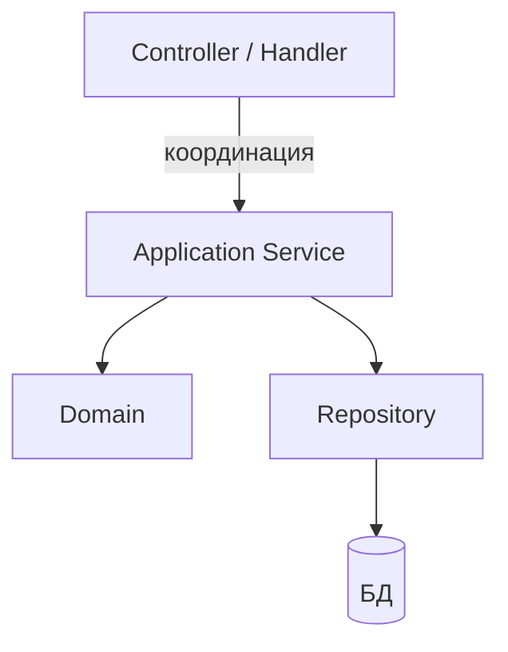

# GRASP и паттерн ADR для веб-бэкенда

  ОБЯЗАТЕЛЬНО
  ДЛЯ НОВИЧКОВ

Разработчику
Архитектору

  
Теория данных (раздел 3)

  

  Модель и масштаб — [Основы БД](/encyclopedia/3-data-markup/3-05-osnovy-baz-dannyh/intro), [опорные темы](/encyclopedia/3-data-markup/3-05-osnovy-baz-dannyh/12), [проектирование БД](./116.md), [пакетная работа](/encyclopedia/3-data-markup/3-11-analiz-dannyh/433). Карта — [о разделе](./intro).
  

**SOLID** описывает свойства классов. **GRASP** (General Responsibility Assignment Software Patterns) отвечает на вопрос: **кому поручить эту обязанность?** — полезно при проектировании слоёв API, сервисов и домена.

Дополнение к [паттернам проектирования](/encyclopedia/7-project/7-06-proektirovanie-i-arhitektura/design-patterns/intro) и [SOLID](/encyclopedia/7-project/7-06-proektirovanie-i-arhitektura/design/2125).

---

## Ключевые принципы GRASP

| Принцип | Вопрос | Пример в бэкенде |
|---------|--------|------------------|
| **Information Expert** | Кто владеет данными для решения? | `Order.calculateTotal()` — не контроллер |
| **Creator** | Кто создаёт B, зная A? | `OrderFactory` создаёт `OrderLine` при известном `Order` |
| **Controller** | Кто принимает системное событие? | HTTP-контроллер, consumer очереди — не домен |
| **Low Coupling** | Как уменьшить связность? | Интерфейс `PaymentGateway`, не прямой SDK в домене |
| **High Cohesion** | Логика одной темы вместе? | `BillingService`, не "God service" |
| **Polymorphism** | Вариативность через типы? | `NotificationSender` → email / push |
| **Indirection** | Посредник для гибкости? | Репозиторий между сервисом и ORM |
| **Protected Variations** | Стабильный интерфейс при смене реализации? | Адаптер внешнего API |

GRASP не противоречит SOLID: **Controller** ↔ SRP на границе, **Indirection** ↔ DIP.

---

## Где применять на практике

- **Controller** тонкий — парсинг HTTP, код ответа, вызов одного use-case.
- **Expert** в домене — скидки, статусы заказа, инварианты.
- **Creator** не размазан: фабрики для сложных агрегатов.

Антипример — контроллер на 400 строк с SQL — нарушены Controller, Expert, Low Coupling.

---

## ADR — Action–Domain–Responder

Эволюция **MVC** для HTTP (не путать с Architecture Decision Record — в контексте веба ниже именно **Action–Domain–Responder**).

| Роль | Ответственность |
|------|-----------------|
| **Action** | Один вход: метод + путь → вызывает use-case |
| **Domain** | Бизнес-логика и сущности |
| **Responder** | Формирует HTTP-ответ (JSON, статус, заголовки) |

Сравнение с классическим MVC:

| MVC | ADR |
|-----|-----|
| Controller "толстеет" | Action остаётся тонким |
| View для HTML | Responder для API (JSON) |
| Model смешивает персистентность | Domain отделён от инфраструктуры |

**Когда уместен ADR:** JSON API, PHP (Aura, Slim-подобные), Node, где не нужен тяжёлый View.

**Когда достаточно MVC + слоёв:** Spring `@RestController` + `@Service` + repository — по сути те же роли, другие имена.

---

## Связь с другими паттернами

- **Hexagonal / Ports-Adapters** — Domain в центре, Action на driving side, Responder — адаптер вывода.
- **CQRS** — разные Action/Responder для command и query.
- [Проектирование API](/encyclopedia/7-project/7-06-proektirovanie-i-arhitektura/design/117) — контракт Responder’а = OpenAPI-схема.

---

## Чек-лист ревью

1. Есть ли бизнес-правило в контроллере? → перенести в Domain (Expert).
2. Создаёт ли контроллер десятки типов? → Creator / Factory.
3. Меняется ли формат ответа независимо от логики? → Responder / DTO mapper.
4. Тестируется ли домен без HTTP? → да, иначе связность высокая.

---

## Связанные темы

- [Типы веб-приложений](/encyclopedia/1-basics/1-23-frontend-i-bekend/8)
- [Компетенции бэкенда](/encyclopedia/1-basics/1-23-frontend-i-bekend/4)
- [Проектирование сервисов и методов](1113.md)
- [Методы и ключ идемпотентности](213.md)
- [Проектирование API и интеграций](117.md)

---

## Практический пример распределения ответственности

Сценарий: `POST /orders`.

- **Action** принимает HTTP-запрос, валидирует формат, передает команду в use-case.
- **Domain** проверяет инварианты заказа, резервирует товар, формирует событие.
- **Responder** возвращает `201 Created` и нормализованную структуру ответа.

Такой поток удерживает бизнес-логику вне HTTP-слоя и снижает связанность между веб-фреймворком и доменом.

---

## Где часто ошибаются

- Action содержит SQL и бизнес-правила одновременно.
- Domain зависит от HTTP-кодов и формата JSON.
- Responder начинает принимать решения домена вместо форматирования ответа.
- Нет единого словаря ошибок и контракт "плывет" между эндпоинтами.

Эти ошибки усложняют тестирование и приводят к непредсказуемому поведению API.

---

## Мини-чек-лист для code review

1. Можно ли протестировать Domain без веб-сервера и БД?
2. Зависит ли Domain только от абстракций, а не от инфраструктуры?
3. Использует ли Action один use-case на одно системное действие?
4. Формируется ли HTTP-ответ централизованно через Responder?
5. Есть ли единый контракт ошибок для клиентов?

---
