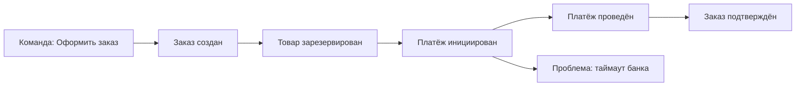

# Event Storming — совместное проектирование домена

  ОБЯЗАТЕЛЬНО
  ДЛЯ НОВИЧКОВ

Архитектору
Аналитику
Разработчику

Event Storming — это **быстрый workshop**, на котором бизнес, аналитики и разработчики вместе выкладывают на стену (или на Miro) **события предметной области** и выстраивают из них процесс. Не презентация архитектора «сверху», а общее понимание: что реально происходит в системе и где проходят границы.

  
Когда имеет смысл

  
Сложный или запутанный домен, спорные границы сервисов, новый продукт, модернизация легаси. Для простого CRUD из трёх экранов workshop часто избыточен.

Связанные материалы: [Доменная модель](../114.md), [декомпозиция монолита](../104.md), [NFR](1116.md), [роль архитектора](../117.md).

---

## Что получаем на выходе

После хорошей сессии у команды есть:

- **хронология событий** («Заказ создан», «Платёж проведён», «Заказ отменён»);
- **команды** (кто или что инициирует действие);
- **агрегаты / политики** (где живут правила и данные);
- **внешние системы** и **проблемные места** (узкие горлышки, ручные шаги);
- черновик **bounded contexts** и кандидатов в backlog.

Это напрямую кормит [C4](1117.md), [ADR](../1.md) и решение «резать ли микросервисы».

---

## Три уровня workshop (не путайте их)

| Уровень | Фокус | Участники | Длительность |
|---------|--------|-----------|--------------|
| **Big Picture** | Поток ценности end-to-end, боли, внешние системы | Стейкхолдеры, аналитики, архитектор, лиды | ½–1 день |
| **Process** | Один процесс детально (например, «оформление заказа») | Команда продукта + разработка | 2–4 часа |
| **Design** | Модель команд, агрегатов, инвариантов | Разработчики + доменный эксперт | 2–4 часа |

Новички часто прыгают сразу в Design без Big Picture — и спорят о классах, не договорившись о процессе.

---

## Как провести сессию (короткий сценарий)

### Подготовка (30 минут)

- Выберите **один сценарий** («от заявки до оплаты»), не «всю ERP».
- Пригласите **эксперта домена** — без него стикеры будут техническими фантазиями.
- Стикеры: оранжевый — доменное событие, синий — команда, жёлтый — агрегат, розовый — внешняя система, красный — проблема (по договорённости команды).

### Ход (2–3 часа на Process)

1. **События по времени** — участники пишут события в прошедшем времени, выкладывают слева направо. Архитектор задаёт вопросы: *«Что произошло в системе в этот момент?»*
2. **Уточнение** — где неясно, ставим красный стикер «?» или «боль».
3. **Команды** — кто инициирует переход к событию (пользователь, таймер, другой сервис).
4. **Правила и агрегаты** — где хранится состояние, какие инварианты («нельзя отгрузить без оплаты»).
5. **Границы** — провести линии между зонами разной терминологии → кандидаты в **bounded context**.

### Завершение (15 минут)

- Сфотографировать / экспортировать доску.
- Зафиксировать **3–5 решений** в ADR или в Confluence: границы, спорные места, открытые вопросы.
- Превратить красные стикеры в **задачи** в backlog.

---

## Разбор: фрагмент интернет-магазина

Упрощённая цепочка (Process level):

**Комментарий архитектора:** событие «Платёж проведён» и «Заказ подтверждён» могут жить в разных контекстах (Billing vs Fulfillment). Workshop как раз показывает, нужен ли синхронный вызов или сообщение `PaymentCompleted`.

---

## Типичные ошибки

| Ошибка | Почему мешает | Что делать |
|--------|---------------|------------|
| Нет доменного эксперта | События = CRUD-таблицы | Перенести сессию, пока не найдётся владелец процесса |
| Слишком широкий scope | Усталость, вода | Один процесс за раз |
| Сразу рисовать микросервисы | Путают домен и деплой | Сначала события и контексты, сервисы — потом |
| Не зафиксировать результат | Повторные споры через месяц | ADR + снимок доски в репозитории |

---

## Связь с архитектурными решениями

- **Bounded context** из линий на доске → кандидаты в сервисы ([микросервисы](118.md), [модульный монолит](2126.md)).
- **События** → AsyncAPI, топики Kafka, [событийная архитектура](2127.md).
- **Красные стикеры** → NFR и риски ([проектирование под NFR](1116.md), [оценка альтернатив](2141.md)).

---

## Дальше

- [Оценка архитектурных альтернатив](2141.md) — как оформить выбор после workshop.
- [Threat modeling для архитекторов](2142.md) — угрозы на границах контекстов.
- [Документация как инструмент](1117.md) — перенести результат в C4.

---
