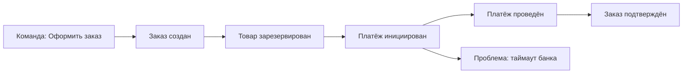

# Event Storming — совместное проектирование домена

  ОБЯЗАТЕЛЬНО
  ДЛЯ НОВИЧКОВ

Архитектору
Аналитику
Разработчику

Event Storming — это **быстрый workshop** (совместная сессия на 2–8 часов), на котором бизнес, аналитики и разработчики вместе выкладывают на стену или на доску Miro **события предметной области** и выстраивают из них процесс. Это общее понимание: что реально происходит в жизни клиента и в системе, а не презентация архитектора «сверху».

Если вы впервые слышите термин: представьте, что вы **рассказываете историю** заказа от клика «Купить» до «Заказ доставлен» — шаг за шагом, стикер за стикером, без UML-классов на первом проходе. Из этой истории потом рождаются границы сервисов, задачи в backlog и схемы.

  
Когда имеет смысл

  
Сложный или запутанный домен, спорные границы сервисов, новый продукт, модернизация легаси. Для простого CRUD из трёх экранов workshop часто избыточен — достаточно короткого интервью с владельцем продукта.

Связанные материалы: [Доменная модель](../114.md), [декомпозиция монолита](../104.md), [NFR](1116.md), [роль архитектора](../117.md).

---

## Откуда взялся метод и зачем он архитектору

Метод предложил **Alberto Brandolini** (сообщество Domain-Driven Design). Идея простая: люди из разных ролей **быстро создают общую картину** процесса, не утонув в UML. Архитектору это нужно, чтобы:

- услышать **реальные** названия и правила от бизнеса, а не придумать их за закрытой дверью;
- увидеть **разрывы** (ручные шаги, «потом в Excel», «звоним в другой отдел»);
- наметить **bounded context** до спора «сколько микросервисов».

---

## Термины, которые услышите на сессии

| Термин | Человеческое объяснение |
|--------|-------------------------|
| **Доменное событие** | Факт, который уже произошёл: «Заказ создан», «Платёж отклонён». Формулируют в **прошедшем времени**. |
| **Команда** | Действие, которое **запускает** переход к событию: «Оформить заказ», «Отменить платёж». Кто-то или что-то инициирует. |
| **Агрегат** (жёлтый стикер) | Место, где **хранится состояние** и проверяются правила: «Заказ», «Корзина». Не обязательно = таблица в БД. |
| **Политика** | Правило «когда случилось A — сделай B»: «Когда платёж проведён — зарезервировать товар». |
| **Внешняя система** | То, чем вы не владеете: банк, 1С, СМС-шлюз. |
| **Проблема / боли** | Красный стикер: неясность, задержка, ручной труд, риск. |
| **Bounded context** | Зона, где слова имеют **один смысл**; границы часто видны, когда на одной цепочке разные отделы по-разному называют одно и то же. |

**Событие и команда — разные стикеры.** Новички пишут «Создать заказ» как событие; правильнее: команда «Оформить заказ» → событие «Заказ создан».

---

## Что получаем на выходе

После хорошей сессии у команды есть:

- **хронология событий** («Заказ создан», «Платёж проведён», «Заказ отменён»);
- **команды** (кто или что инициирует действие: пользователь, таймер, другой сервис);
- **агрегаты и политики** (где живут правила и данные);
- **внешние системы** и **проблемные места** (узкие горлышки, ручные шаги);
- черновик **bounded contexts** и кандидатов в backlog.

Это напрямую кормит [C4](1117.md), [ADR](../1.md) и решение о декомпозиции ([микросервисы](118.md), [модульный монолит](2126.md)).

  
Разбор

  
Один оранжевый стикер «Платёж проведён» может означать разные вещи в биллинге и в отделе доставки. Линия между зонами на доске — <strong>явное место перевода смыслов</strong> (контракт, ACL, событие). Отдельный микросервис на этой границе — следующий шаг по <a href="2141.md">оценке альтернатив</a>, если на то есть NFR и команды.

---

## Три уровня workshop (не путайте их)

| Уровень | Фокус | Участники | Длительность |
|---------|--------|-----------|--------------|
| **Big Picture** | Поток ценности end-to-end, боли, внешние системы | Стейкхолдеры, аналитики, архитектор, лиды | ½–1 день |
| **Process** | Один процесс детально (например, «оформление заказа») | Команда продукта + разработка | 2–4 часа |
| **Design** | Модель команд, агрегатов, инвариантов | Разработчики + доменный эксперт | 2–4 часа |

**Big Picture** отвечает на вопрос «где вообще болит бизнес». **Process** — «как устроен один сценарий по шагам». **Design** — «как это ляжет в код и границы агрегатов».

Новички часто прыгают сразу в Design без Big Picture — и спорят о классах, не договорившись о процессе. Порядок уровней экономит часы споров.

---

## Как провести сессию (подробный сценарий)

### Подготовка (30–60 минут)

- Выберите **один сценарий** («от заявки до оплаты»), не «всю ERP».
- Пригласите **эксперта домена** (product owner, ведущий аналитик, операционист) — без него стикеры превращаются в технические фантазии.
- Подготовьте доску: Miro, FigJam, физическая стена.
- Договоритесь о цветах стикеров (пример ниже).

**Цвета стикеров (типичная договорённость):**

| Цвет | Смысл |
|------|--------|
| Оранжевый | Доменное событие |
| Синий | Команда |
| Жёлтый | Агрегат / сущность с правилами |
| Розовый | Внешняя система |
| Красный | Проблема, риск, вопрос |
| Фиолетовый | Политика (реакция на событие) |

Роли в комнате: **фасилитатор** (задаёт вопросы, следит за временем), **секретарь** (фото, экспорт), **эксперт домена** (подтверждает или опровергает факты).

### Ход Process-уровня (2–3 часа)

1. **События по времени (30–60 мин)**  
   Участники пишут события в прошедшем времени и выкладывают **слева направо** — как временную линию.  
   Вопрос фасилитатора: *«Что **уже произошло** в системе или в жизни клиента в этот момент?»*  
   Паузы и пустые места — нормально: туда позже придут команды и уточнения.

2. **Уточнение (20–30 мин)**  
   Где формулировка размыта — красный стикер «?» или «боль». Не спорить «правильно ли назван класс» — спорить «так ли бывает в жизни».

3. **Команды (20–30 мин)**  
   Перед каждым событием (кроме самого первого) — кто или что инициировал переход: пользователь, cron, webhook банка.

4. **Правила и агрегаты (30–40 мин)**  
   Где хранится состояние? Какие инварианты? Пример: «нельзя отгрузить без оплаты» — политика или правило внутри агрегата «Заказ».

5. **Границы (20–30 мин)**  
   Провести вертикальные линии там, где **меняется язык** или владелец процесса. Это кандидаты в **bounded context**.

### Завершение (15–20 минут)

- Сфотографировать / экспортировать доску в репозиторий (`docs/workshops/2025-05-order-storming.png`).
- Зафиксировать **3–5 решений** в ADR или Confluence: границы, спорные места, открытые вопросы.
- Каждый красный стикер → **задача** в backlog с владельцем.

---

## Пример — фрагмент интернет-магазина

Упрощённая цепочка (Process level):

**Разбор для новичка:**

- После «Заказ создан» склад может резервировать остаток — отдельное событие, отдельная ответственность.
- «Платёж проведён» и «Заказ подтверждён» могут жить в разных контекстах (**Billing** и **Fulfillment**). Workshop показывает, нужен ли **синхронный** вызов (пользователь ждёт ответа) или **сообщение** `PaymentCompleted` (слабая связность, возможна задержка).
- Красный стикер «таймаут банка» → в backlog: политика повторов, таймаут UI, идемпотентность callback.

---

## Онлайн и офлайн — практические советы

| Ситуация | Совет |
|----------|--------|
| Удалённая команда | Miro + таймер на блоки; один человек двигает стикеры, остальные диктуют |
| 10+ участников | Разбить на группы по подпроцессам, потом склеить на общей линии |
| Сопротивление бизнеса | Начать с **их** боли (красные стикеры), не с «нарисуем микросервисы» |
| Легаси | Добавить розовые стикеры «1С», «старый монолит» и явно показать, где ручной обмен |

---

## Типичные ошибки

| Ошибка | Почему мешает | Что делать |
|--------|---------------|------------|
| Нет доменного эксперта | События превращаются в CRUD-таблицы | Перенести сессию, пока не найдётся владелец процесса |
| Слишком широкий scope | Усталость, вода | Один процесс за раз; Big Picture — отдельный день |
| Сразу рисовать микросервисы | Путают домен и деплой | Сначала события и контексты, сервисы — после [оценки альтернатив](2141.md) |
| Не зафиксировать результат | Повторные споры через месяц | ADR + снимок доски в репозитории |
| Спор об именах классов | Workshop не про код | Отложить Design-уровень на отдельную сессию |

---

## Связь с архитектурными решениями

- **Bounded context** из линий на доске → кандидаты в сервисы или модули ([микросервисы](118.md), [модульный монолит](2126.md)).
- **События** → топики Kafka, контракты AsyncAPI, [событийная архитектура](2127.md).
- **Красные стикеры** → NFR и риски ([проектирование под NFR](1116.md), [оценка альтернатив](2141.md)).
- **Внешние системы** → контракты интеграции, [проектирование API](117.md).

---

## Мини-чек-лист «сессия удалась»

- [ ] Есть временная линия из 10+ согласованных событий для одного сценария.
- [ ] Бизнес подтвердил формулировки («да, так и бывает»).
- [ ] Отмечены минимум 3 проблемы/риска с владельцами в backlog.
- [ ] Намечены 1–3 границы контекстов (линии на доске или список).
- [ ] Результат сохранён вне головы участников (фото + ADR/Confluence).

---

## Дальше

- [Оценка архитектурных альтернатив](2141.md) — как оформить выбор после workshop.
- [Threat modeling для архитекторов](2142.md) — угрозы на границах контекстов.
- [Документация как инструмент](1117.md) — перенести результат в C4.

---
