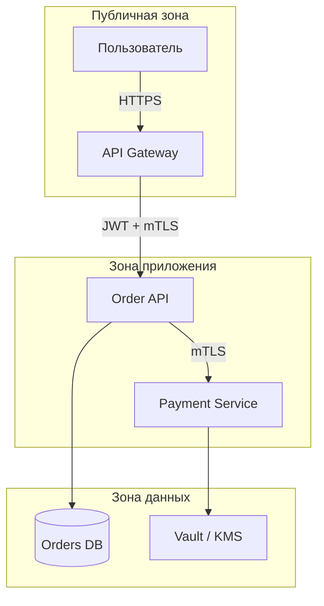

# Threat modeling для архитекторов

  ОБЯЗАТЕЛЬНО
  ДЛЯ НОВИЧКОВ

Архитектору
Разработчику

Безопасность — **свойство границ системы**. Архитектор задаёт: где проходит доверие, что считается внешним миром, какие данные не должны пересекать границу без контроля. Детали XSS, TLS и OWASP — в разделе [Информационная безопасность](/encyclopedia/8-infra-security/8-07-informatsionnaya-bezopasnost/intro); здесь — **модель угроз на уровне схемы**.

Связь: [NFR — безопасность](1116.md), [проектирование API](117.md), [микросервисы — безопасность](118.md).

---

## Threat model - угрозы и меры для архитектора

- IDOR и broken access control чаще закладываются в **маршрутизацию и модель владения ресурсом**, а не «забыли проверку в одном if».
- Микросервисы умножают **поверхность атаки**: больше API, больше токенов, больше внутреннего трафика.
- Регуляторика (152-ФЗ, PCI, отраслевые) — это **архитектурные ограничения** (где хранятся ПДн, кто имеет доступ).

---

## STRIDE-lite (достаточно для большинства проектов)

Для каждого **компонента или потока данных** задайте вопрос:

| Угроза | Вопрос | Пример митигации на архитектуре |
|--------|--------|----------------------------------|
| **S** Spoofing | Можно подделать отправителя? | OAuth2/OIDC, mTLS между сервисами |
| **T** Tampering | Можно изменить данные в пути? | TLS 1.3, подпись сообщений, immutable audit log |
| **R** Repudiation | Можно отрицать действие? | Audit log с correlation ID, WORM-хранилище |
| **I** Information disclosure | Утечёт лишнее? | Шифрование at rest, минимизация полей в API, сегментация сети |
| **D** Denial of service | Можно положить сервис? | Rate limit на gateway, bulkhead, autoscale с лимитом |
| **E** Elevation of privilege | Можно получить чужие права? | RBAC/ABAC, проверка владельца ресурса в сервисе, не только в JWT |

Полный STRIDE в Microsoft Threat Modeling Tool — опционально; для agile-команды хватит таблицы на 1–2 страницы в ADR.

---

## Границы доверия на C4

На **Container diagram** обведите зоны:

**Правила:**

- Каждая стрелка через границу — **аутентификация + авторизация + минимум данных**.
- Внутренний трафик «без проверки, мы же в VPC» — типичная дыра; Zero Trust предполагает проверку и внутри ([Zero Trust](/encyclopedia/8-infra-security/8-07-informatsionnaya-bezopasnost/121.md)).

---

## Разбор: заказ и оплата

**Угроза:** пользователь A подставляет `orderId` пользователя B в `GET /orders/{id}`.

**Архитектурное решение:** проверка `order.ownerId == currentUser.id` в **доменном сервисе**, не только наличие валидного JWT. Gateway не знает владельца заказа — не подменяет сервис.

**Угроза:** утечка PAN через логи Payment.

**Решение:** Payment context изолирован; в Order API нет полей карты; маскирование в логах; PCI-scope только на Payment + Vault.

Подробнее по API: [Уязвимости и атаки на API](/encyclopedia/8-infra-security/8-07-informatsionnaya-bezopasnost/128.md).

---

## Когда проводить сессию

- Новый внешний API или интеграция с гос/банк-системой.
- Выделение нового микросервиса с ПДн.
- Крупный рефакторинг auth / multi-tenant.

**Участники:** архитектор, backend, security champion (если есть), иногда DevOps (сеть, секреты).

**Длительность:** 60–90 минут на один поток (например, «оформление заказа»).

**Артефакт:** таблица STRIDE + 5–10 пунктов в backlog + при необходимости ADR «Security constraints».

---

## Чек-лист перед релизом (архитектурный срез)

- [ ] Все внешние вызовы — только через gateway с auth и rate limit?
- [ ] Внутренние сервисы не доверяют сети «по умолчанию» (mTLS или эквивалент)?
- [ ] Секреты не в git; ротация ключей описана?
- [ ] ПДн/платёжные данные в отдельном контексте с минимальным доступом?
- [ ] Audit log для критичных операций с correlation ID?
- [ ] Threat model обновлён, если изменились границы или потоки?

---

## Дальше

- [Информационная безопасность](/encyclopedia/8-infra-security/8-07-informatsionnaya-bezopasnost/1.md) — CIA, OWASP.
- [Безопасность приложений](/encyclopedia/8-infra-security/8-07-informatsionnaya-bezopasnost/113.md) — XSS, CSRF, CSP.
- [Оценка альтернатив](2141.md) · [Event Storming](2140.md)

---
