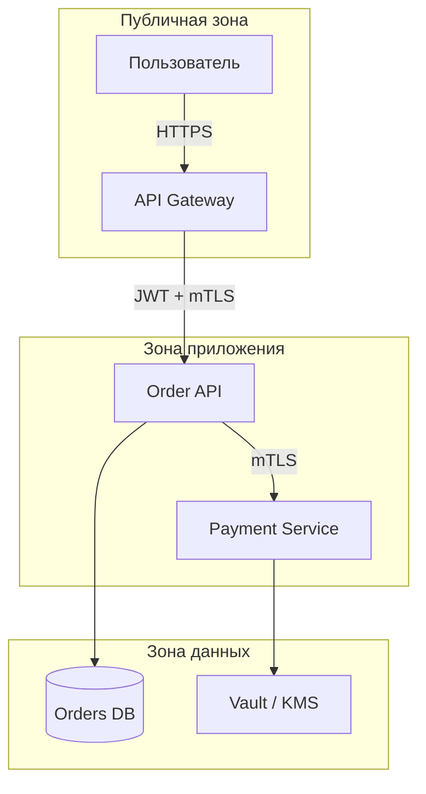

# Threat modeling для архитекторов

  ОБЯЗАТЕЛЬНО
  ДЛЯ НОВИЧКОВ

Архитектору
Разработчику

**Threat modeling** (моделирование угроз) — это разбор **"кто что может сделать с нашей системой и чем это плохо"** ещё до написания кода. Архитектор смотрит на схему: куда идут данные, где проходит граница доверия, что случится, если злоумышленник подставит чужой идентификатор или перехватит трафик.

Детали XSS, настройки TLS и чек-листы OWASP — в разделе [Информационная безопасность](/encyclopedia/8-infra-security/8-07-informatsionnaya-bezopasnost/intro). Здесь — **угрозы на уровне границ и потоков**, понятным языком для тех, кто только входит в тему.

Связь: [NFR — безопасность](1116.md), [проектирование API](117.md), [микросервисы — безопасность](118.md), [оценка альтернатив](2141.md).

---

## С чего начать новичку

Представьте интернет-магазин. Пользователь нажимает "Оплатить". Данные идут через браузер, API Gateway, сервис заказов, платёжный сервис, банк. **Threat modeling** задаёт вопросы по каждой стрелке на схеме:

- Можно ли **выдать себя за другого** (чужой заказ, чужой аккаунт)?
- Можно ли **подменить или украсть** данные по пути?
- Можно ли **отрицать**, что действие было (нет аудита)?
- Можно ли **положить** сервис запросами (DoS)?
- Можно ли **получить права** выше положенных?

Ответы превращаются в **меры**: проверка владельца ресурса, TLS, rate limit, журнал аудита. Часть мер — в коде одного `if`, часть — в **расположении** сервисов и правилах сети. Архитектор как раз отвечает за вторую часть.

  
Главная мысль

  

  
Безопасность — свойство <strong>границ системы</strong>: где заканчивается "наш" доверенный мир и начинается интернет, другой отдел, старый легаси.

  

---

## Термины, которые встретите

| Термин | Простыми словами |
|--------|------------------|
| **Threat** (угроза) | Способ навредить: утечка, подмена, отказ в обслуживании. |
| **Asset** (актив) | То, что защищаем: ПДн, деньги, пароли, репутация. |
| **Trust boundary** (граница доверия) | Линия, где уровень доверия **меняется** (браузер → наш API; наш API → банк). |
| **Attack surface** (поверхность атаки) | Всё, что снаружи может дернуть: URL, порты, очереди, админки. |
| **STRIDE** | Мнемоника шести типов угроз (см. ниже). |
| **IDOR** | Insecure Direct Object Reference — доступ к чужому объекту по подставленному id. |
| **mTLS** | Взаимная TLS-аутентификация: и клиент, и сервер предъявляют сертификат. |
| **Zero Trust** | Проверять права **на каждом** вызове, даже "внутри" корпоративной сети. |
| **PCI / 152-ФЗ** | Регуляторные рамки: где хранить карты/ПДн, кто имеет доступ. |

---

## Почему это задача архитектора, а не только security-отдела

- **IDOR** и ошибки контроля доступа часто закладываются в **маршрутизацию и модель владения ресурсом** ("заказ принадлежит userId"), а не в один забытый `if` в конце проекта.
- **Микросервисы** умножают поверхность атаки: больше HTTP API, больше токенов, больше внутреннего трафика, который можно перехватить при компрометации одного узла.
- **Регуляторика** (152-ФЗ, PCI, отраслевые) задаёт **архитектурные ограничения**: ПДн только в выделенном контуре, карты — только в Payment + Vault.

Security champion или отдел ИБ помогают глубиной; архитектор **встраивает** требования в схему и ADR, чтобы разработка не узнала о PCI за неделю до релиза.

---

## STRIDE-lite (достаточно для большинства проектов)

**STRIDE** — шесть категорий угроз от Microsoft. Для agile-команды достаточно пройти **таблицу на 1–2 страницы** по каждому важному потоку на схеме.

Для каждого **компонента или стрелки** (потока данных) задайте вопрос:

| Буква | Угроза | Вопрос | Пример митигации на архитектуре |
|-------|--------|--------|----------------------------------|
| **S** | Spoofing (подмена личности) | Можно выдать себя за другого отправителя? | OAuth2/OIDC для пользователей; mTLS между сервисами |
| **T** | Tampering (подмена данных) | Можно изменить данные в пути? | TLS 1.3; подпись сообщений; неизменяемый audit log |
| **R** | Repudiation (отказ от действия) | Можно сказать "это не я"? | Audit log с correlation ID; WORM-хранилище для критичных операций |
| **I** | Information disclosure (утечка) | Утечёт лишнее? | Шифрование at rest; минимум полей в API; сегментация сети |
| **D** | Denial of service (отказ) | Можно положить сервис? | Rate limit на gateway; bulkhead; autoscale с верхним лимитом |
| **E** | Elevation of privilege (повышение прав) | Можно получить чужие права? | RBAC/ABAC; проверка владельца ресурса в сервисе, не только "валидный JWT" |

Полный STRIDE в Microsoft Threat Modeling Tool — опционально; результат всё равно должен попасть в **backlog** и при необходимости в ADR "Security constraints".

**Как проводить за 60 минут:** возьмите одну sequence-диаграмму "оформление заказа", пройдите по стрелкам сверху вниз и заполните хотя бы по одной строке STRIDE на стрелку.

---

## Границы доверия на C4

На **Container diagram** (C4, уровень контейнеров) обведите **зоны** — места, где меняются правила доверия:

**Правила для новичка:**

- Каждая стрелка **через границу** — повод спросить: кто аутентифицирован, кто авторизован, **какие поля** уходят (минимум данных).
- Фраза "внутри VPC всё доверенное" устарела: при компрометации одного pod злоумышленник видит весь внутренний трафик. **Zero Trust** предполагает проверку и внутри ([Zero Trust](/encyclopedia/8-infra-security/8-07-informatsionnaya-bezopasnost/121.md)).
- **Секреты** (ключи API, пароли БД) — в Vault/KMS, не в git и не в переменных образа без ротации.

---

## Разбор — заказ и оплата

### Угроза 1 — чужой заказ (IDOR)

**Сценарий:** пользователь A подставляет `orderId` пользователя B в `GET /orders/{id}` или в теле запроса отмены.

**Почему это архитектура:** если проверка "этот заказ твой" только в UI, любой клиент API обойдёт интерфейс.

**Решение:** в **доменном сервисе** заказов правило `order.ownerId == currentUser.id` (или роль админа с отдельным аудитом). API Gateway **не знает** владельца каждой строки в БД — он проверяет токен, но не подменяет бизнес-логику.

---

### Угроза 2 — утечка номера карты (Information disclosure)

**Сценарий:** PAN попадает в логи Order API, потому что "удобно отладить".

**Решение:** **Payment context** изолирован; в Order API **нет** полей карты; в логах — маскирование; PCI-scope только Payment + Vault. Order хранит `paymentId`, не номер карты.

---

### Угроза 3 — повтор платежа (Tampering / логика)

**Сценарий:** повторный callback от банка создаёт второй списание.

**Решение:** идемпотентность по `idempotency-key` / `paymentIntentId` на стороне Payment; события в audit log.

Подробнее по API: [Уязвимости и атаки на API](/encyclopedia/8-infra-security/8-07-informatsionnaya-bezopasnost/128.md).

---

## Микросервисы — что меняется на схеме

| Риск | Почему | Архитектурный ответ |
|------|--------|---------------------|
| Больше endpoints | Каждый сервис — новая дверь | Единый gateway, единые политики auth |
| Service-to-service trust | Украли токен одного сервиса — ходят везде | mTLS, короткоживущие токены, scope по сервису |
| Распределённый audit | Сложно собрать цепочку | Correlation ID через все вызовы |
| Секреты в 10 репозиториях | Утечка в одном — компрометация | Централизованный Vault, ротация |

См. также [микросервисы — безопасность](118.md).

---

## Когда проводить сессию

- Новый внешний API или интеграция с гос/банк-системой.
- Выделение нового микросервиса с ПДн.
- Крупный рефакторинг auth / multi-tenant.
- После [Event Storming](2140.md), если на доске появились новые внешние системы и потоки.

**Участники:** архитектор, backend, security champion (если есть), при необходимости DevOps (сеть, секреты).

**Длительность:** 60–90 минут на **один** поток (например, "оформление заказа").

**Артефакт:** таблица STRIDE + 5–10 пунктов в backlog + при необходимости ADR "Security constraints".

---

## Шаблон таблицы угроз (можно копировать)

| Поток | Угроза (STRIDE) | Описание | Риск (H/M/L) | Мера | Владелец |
|-------|-----------------|----------|--------------|------|----------|
| Browser → Gateway | S | Подделка сессии | M | OIDC, короткий TTL refresh | Backend |
| Gateway → Order API | E | JWT без проверки scope | H | Проверка audience, RBAC | Backend |
| Order API → DB | I | Утечка дампа БД | H | Шифрование at rest, минимум ПДн | Ops |
| Payment → Bank | T | Подмена callback | H | Подпись webhook, whitelist IP | Payment team |

---

## Чек-лист перед релизом (архитектурный срез)

- [ ] Все внешние вызовы — через gateway с auth и rate limit?
- [ ] Внутренние сервисы проверяют вызывающего (mTLS или эквивалент)?
- [ ] Секреты вне git; описана ротация ключей?
- [ ] ПДн/платёжные данные в отдельном контексте с минимальным доступом?
- [ ] Audit log для критичных операций с correlation ID?
- [ ] Threat model обновлён, если изменились границы или потоки?
- [ ] Для каждого внешнего id в URL есть проверка владельца (IDOR)?

---

## Связь с остальным циклом проектирования

1. [Event Storming](2140.md) — видите потоки и внешние системы.  
2. [Оценка альтернатив](2141.md) — если security в топ-3 NFR, веса в матрице отражают это.  
3. Threat modeling — уточняете меры на выбранной схеме.  
4. [NFR](1116.md) и раздел [ИБ](/encyclopedia/8-infra-security/8-07-informatsionnaya-bezopasnost/1.md) — детали реализации и OWASP.

---

## Дальше

- [Информационная безопасность](/encyclopedia/8-infra-security/8-07-informatsionnaya-bezopasnost/1.md) — CIA, OWASP.
- [Безопасность приложений](/encyclopedia/8-infra-security/8-07-informatsionnaya-bezopasnost/113.md) — XSS, CSRF, CSP.
- [Оценка альтернатив](2141.md) · [Event Storming](2140.md)

---
