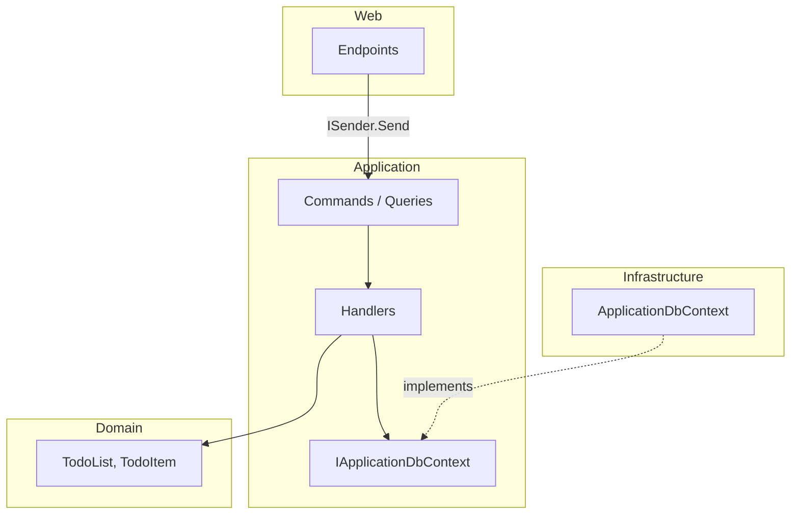

# Clean Architecture на ASP.NET Core

<div class="article-tags">
  <span class="tag tag-required">ОБЯЗАТЕЛЬНО</span>
  <span class="tag tag-beginner">ДЛЯ НОВИЧКОВ</span>
</div>

<span class="complexity-badge">Разработчику</span>
<span class="complexity-badge">Архитектору</span>

<div class="callout callout--tip">
  <div class="callout-title">Связь с теорией</div>
  <p>Круги зависимостей, сущности и use cases — в <a href="2132.md">чистой архитектуре</a>. Здесь — <strong>как это выглядит в Visual Studio</strong> на базе открытого шаблона <a href="https://github.com/jasontaylordev/CleanArchitecture">jasontaylordev/CleanArchitecture</a> и документации <a href="https://cleanarchitecture.jasontaylor.dev/docs/architecture/">cleanarchitecture.jasontaylor.dev</a>.</p>
</div>

## Где применяют эталонный шаблон

Теория Uncle Bob отвечает на вопрос «куда направлены зависимости». Шаблон Jason Taylor показывает **рабочую раскладку решения**: отдельные проекты `Domain`, `Application`, `Infrastructure`, `Web`, оркестрация через **MediatR**, валидация **FluentValidation**, данные через **EF Core**, локальный запуск через **.NET Aspire** (`AppHost`).

Шаблон устанавливается как NuGet-шаблон:

```bash
dotnet new install Clean.Architecture.Solution.Template
dotnet new ca-sln -cf none -db sqlite -o MyApp
dotnet run --project .\src\AppHost
```

Параметры `-cf` (Angular / React / API only) и `-db` (SQLite, PostgreSQL, SQL Server) меняют оболочку, **ядро слоёв остаётся тем же**.

---

## Четыре проекта и правило зависимостей

| Проект | Папка | Роль | Зависит от |
|--------|-------|------|------------|
| **Domain** | `src/Domain` | Сущности, value objects, domain events, перечисления | — |
| **Application** | `src/Application` | Команды, запросы, обработчики, интерфейсы портов, валидаторы | Domain |
| **Infrastructure** | `src/Infrastructure` | `DbContext`, EF-конфигурации, внешние сервисы | Application |
| **Web** | `src/Web` | HTTP endpoints, middleware, OpenAPI, DI-регистрация | Application, Infrastructure |

Дополнительно: **`AppHost`** (Aspire) — оркестратор для разработки: поднимает Web, БД, дашборд наблюдаемости.



**Правило:** ссылки на проекты идут только **внутрь**. `Domain` не знает про ASP.NET и EF. `Application` объявляет `IApplicationDbContext`; `Infrastructure` его реализует.

Сопоставление с [построением систем на классах](../113.md): там та же логика может жить в папках одного репозитория; шаблон **жёстко разносит сборки**, чтобы компилятор не дал «случайно» импортировать `Microsoft.EntityFrameworkCore` в домен.

---

## Vertical slice: одна папка — один сценарий

В `Application` код группируют **по фиче**, а не по типу файла:

```
Application/
└── TodoLists/
    ├── Commands/
    │   ├── CreateTodoList/
    │   │   ├── CreateTodoList.cs          ← команда + handler
    │   │   └── CreateTodoListCommandValidator.cs
    │   └── DeleteTodoList/
    └── Queries/
        └── GetTodos/
            ├── GetTodosQuery.cs
            └── GetTodosQueryHandler.cs
```

Открыть `CreateTodoList` — значит увидеть весь сценарий «создать список» без поиска по `Services/` и `Repositories/`.

### Domain

Сущность хранит инварианты; value object `Colour` инкапсулирует допустимые значения:

```csharp
// Domain/Entities/TodoList.cs (упрощённо)
public class TodoList
{
    public int Id { get; set; }
    public string? Title { get; set; }
    public Colour Colour { get; set; } = Colour.White;
    public IList<TodoItem> Items { get; private set; } = new List<TodoItem>();
}
```

### Application: команда и обработчик

```csharp
public record CreateTodoListCommand : IRequest<int>
{
    public string? Title { get; init; }
    public string? Colour { get; init; }
}

public class CreateTodoListCommandHandler : IRequestHandler<CreateTodoListCommand, int>
{
    private readonly IApplicationDbContext _context;

    public CreateTodoListCommandHandler(IApplicationDbContext context) => _context = context;

    public async Task<int> Handle(CreateTodoListCommand request, CancellationToken cancellationToken)
    {
        var entity = new TodoList
        {
            Title = request.Title,
            Colour = Colour.From(request.Colour ?? Colour.Grey)
        };

        _context.TodoLists.Add(entity);
        await _context.SaveChangesAsync(cancellationToken);
        return entity.Id;
    }
}
```

Обработчик **оркестрирует** домен и порт сохранения. SQL и HTTP здесь отсутствуют.

### Web: тонкий endpoint

```csharp
public static async Task<Created<int>> CreateTodoList(ISender sender, CreateTodoListCommand command)
{
    var id = await sender.Send(command);
    return TypedResults.Created($"/{nameof(TodoLists)}/{id}", id);
}
```

`ISender` — фасад MediatR: endpoint не знает конкретный `CreateTodoListCommandHandler`. Подробнее про pipeline и валидацию — в [MediatR и cross-cutting в Application](/encyclopedia/5-languages/5-05-csharp/4518).

---

## Где живут интерфейсы

| Абстракция | Слой | Пример |
|------------|------|--------|
| Репозиторий / контекст БД | **Application** | `IApplicationDbContext` |
| Реализация EF | **Infrastructure** | `ApplicationDbContext` |
| HTTP, OpenAPI | **Web** | `TodoLists` endpoints |
| Регистрация DI | **Infrastructure** + **Web** | `AddInfrastructure()`, `AddWebServices()` |

Интерфейс порта в **Application** — каноничный вариант для Clean Architecture: прикладной слой задаёт контракт, инфраструктура подстраивается. В [113.md](../113.md) встречаются примеры с интерфейсом в Infrastructure — это допустимо для маленьких проектов, но в enterprise-шаблоне предпочтительнее порт в Application.

---

## Cross-cutting: pipeline behaviours

Валидация, логирование и замер времени выполнения вешаются на **MediatR pipeline**, а не в каждый handler:

```csharp
public class ValidationBehaviour<TRequest, TResponse> : IPipelineBehavior<TRequest, TResponse>
    where TRequest : notnull
{
  private readonly IEnumerable<IValidator<TRequest>> _validators;

  public async Task<TResponse> Handle(TRequest request, RequestHandlerDelegate<TResponse> next, CancellationToken ct)
  {
    if (_validators.Any())
    {
      var results = await Task.WhenAll(
        _validators.Select(v => v.ValidateAsync(new ValidationContext<TRequest>(request), ct)));
      var failures = results.SelectMany(r => r.Errors).Where(e => e != null).ToList();
      if (failures.Count != 0)
        throw new ValidationException(failures);
    }
    return await next();
  }
}
```

Команда проходит цепочку **до** `Handle`: сначала FluentValidation, затем бизнес-логика. Контроллер остаётся без `if (!ModelState.IsValid)` для доменных правил.

---

## Aspire и точка входа

Локально приложение стартует из **`src/AppHost`**: Aspire поднимает Web API, контейнер с БД (при PostgreSQL/SQL Server) и открывает dashboard с URL и логами. Это связывает чистую архитектуру с [узлом приложений .NET Aspire](/encyclopedia/5-languages/5-04-platforma-dotnet/173.md): топология «сервис + БД» описана в коде, а не в README.

В проде `Web` деплоится отдельно; `AppHost` — инструмент разработки и интеграционных сценариев.

---

## Тестирование

| Уровень | Что проверяем | Зависимости |
|---------|---------------|-------------|
| **Unit** | Handler + домен | Mock `IApplicationDbContext` или in-memory |
| **Integration** | HTTP → pipeline → БД | `WebApplicationFactory`, Testcontainers / Respawn |

Шаблон использует NUnit, Shouldly, Moq; для БД — сброс состояния между тестами (Respawn). См. также [интеграционные тесты ASP.NET Core](/encyclopedia/5-languages/5-05-csharp/4516.md).

Юнит-тест handler'а `CreateTodoList` **без** Kestrel и Docker — прямой вызов `Handle` с подменённым контекстом; тот же приём, что в [сквозном примере todo в 2132](2132.md#тест-без-инфраструктуры).

---

## Когда шаблон уместен

| Ситуация | Рекомендация |
|----------|--------------|
| Корпоративный API, 2+ года жизни, несколько разработчиков | Четыре проекта + vertical slices оправданы |
| CRUD на 3–5 сущностей, один разработчик, срок до 6 месяцев | Достаточно [одного проекта со слоями в папках](2132.md) или [Minimal API](/encyclopedia/5-languages/5-05-csharp/4517) без четырёх сборок |
| Нужны отдельные read/write модели и масштаб чтения | Добавить [CQRS](2122.md) осознанно, не «по умолчанию» |
| Микросервис с одной ответственностью | Урезать: Domain + Application + один host, без SPA-проектов |

MediatR, AutoMapper и четыре сборки — **инструменты**, не требование чистой архитектуры. Минимальный каркас из [2132](2132.md) выражает те же правила зависимостей.

---

## Антипаттерны (чеклист)

| Симптом | Почему ломает CA | Что делать |
|---------|------------------|------------|
| `[Table]`, `[JsonProperty]` на entity | Домен привязан к EF/JSON | Конфигурация в `IEntityTypeConfiguration`, DTO в Web |
| `DbContext` в handler через `new` | Нет DI и подмены в тестах | Инжектировать `IApplicationDbContext` |
| SQL в endpoint | Presentation знает персистентность | `sender.Send(command)` |
| «God» `ApplicationService` на 800 строк | Смешаны сценарии | Разбить на команды/запросы по папкам |
| `Shared` со всем подряд | Скрытые зависимости наружу | Только примитивы ядра; фичи — в slice |
| Валидация только в UI | Домен обходят через API | FluentValidation + инварианты в entity |
| AutoMapper в Domain | Зависимость от инфраструктуры маппинга | Профили в Application или Web |

---

## ADR и эволюция

В репозитории шаблона решения фиксируют как **Architecture Decision Records** (`docs/decisions/`): выбор БД, аутентификация, структура тестов. Тот же приём описан в [документации как инструмент проектирования](1117.md) и [оценке альтернатив](2141.md).

При форке шаблона под продукт имеет смысл оставить формат ADR: через год команда вспомнит, **почему** выбрали SQLite, а не «потому что так в примере».

---

## Карта материалов энциклопедии

| Тема | Статья |
|------|--------|
| Теория кругов и порты | [2132 — Чистая архитектура](2132.md) |
| Папки, типы классов, DI | [113 — Построение на классах](../113.md) |
| CQRS | [2122](2122.md) |
| MediatR, pipeline | [4518 — MediatR](/encyclopedia/5-languages/5-05-csharp/4518) |
| ASP.NET Web API | [4511](/encyclopedia/5-languages/5-05-csharp/4511) |
| EF Core | [441](/encyclopedia/5-languages/5-05-csharp/441) |
| Aspire | [173 — платформа .NET](/encyclopedia/5-languages/5-04-platforma-dotnet/173) |
| GRASP на границе HTTP | [2139](2139.md) |

---

## Итог

Шаблон **jasontaylordev/CleanArchitecture** — практический эталон для .NET: зависимости внутрь, сценарии в vertical slices, порты в Application, адаптеры в Infrastructure и Web. Его стоит разбирать **после** [2132](2132.md), проходя один сценарий (например `CreateTodoList`) от endpoint до таблицы в БД. Для собственного продукта шаблон можно упростить, сохранив **правило зависимостей** — оно важнее количества проектов в solution.

**Внешние источники:** [GitHub](https://github.com/jasontaylordev/CleanArchitecture) · [Документация](https://cleanarchitecture.jasontaylor.dev) · [Architecture overview](https://cleanarchitecture.jasontaylor.dev/docs/architecture/)

---
