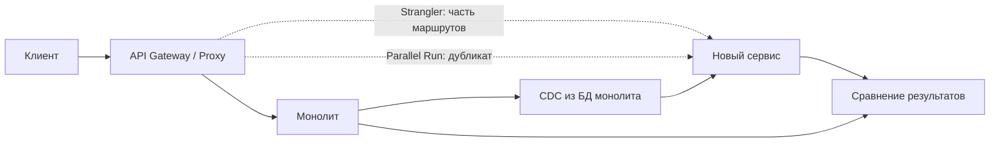

# Паттерны перехода от монолита к микросервисам

  ОБЯЗАТЕЛЬНО
  ДЛЯ НОВИЧКОВ

Разработчику
Архитектору
Аналитику

  
Теория данных (раздел 3)

  

  Модель и масштаб — [Основы БД](/encyclopedia/3-data-markup/3-05-osnovy-baz-dannyh/intro), [опорные темы](/encyclopedia/3-data-markup/3-05-osnovy-baz-dannyh/12), [проектирование БД](./116.md), [пакетная работа](/encyclopedia/3-data-markup/3-11-analiz-dannyh/433). Карта — [о разделе](./intro).
  

  
С чего начать план

  

  Сначала — [метрика успеха и карта монолита](../104.md)

  выбор паттерна под конкретный шаг. [Strangler Fig](2125.md) разобран отдельно; здесь — обзор четырёх переходных паттернов и их сочетание.

  

---

Переход с монолита на микросервисы редко делают одним релизом. На практике архитекторы комбинируют несколько **переходных паттернов** — приёмов, которые позволяют вынести функциональность, проверить новый код на боевом трафике и синхронизировать данные, пока старая система ещё работает.

Ниже — четыре распространённых паттерна, которые стоит учитывать при планировании миграции.

| Паттерн | Главная задача | Типичный момент в плане |
| --- | --- | --- |
| [Strangler Fig](#strangler-fig) | Постепенно перенаправлять трафик с монолита на новые сервисы | Выделение первого bounded context |
| [Parallel Run](#parallel-run) | Сравнить ответы монолита и нового сервиса до переключения пользователей | Перед cutover критичного API |
| [Decorating Collaborator](#decorating-collaborator) | Добавить новую логику рядом со старым сценарием без правок ядра монолита | Новая сквозная проверка (склад, антифрод) |
| [Change Data Capture (CDC)](#change-data-capture-cdc) | Реплицировать изменения БД монолита в сервисы и витрины | Разделение данных, read-модели, аналитика |

Паттерны **дополняют** друг друга — Strangler переключает маршрут, Parallel Run снижает риск ошибки в новом коде, Decorating Collaborator вводит смежный сервис до полного выноса домена, CDC держит копии данных в согласованном состоянии.

---

## Strangler Fig

**Идея.** Перед монолитом ставят **прокси или API Gateway**. Сначала весь трафик идёт в монолит. По мере готовности отдельных возможностей шлюз направляет часть запросов (например, чтение каталога или оформление подписки) в новый сервис. Монолит "сужается", пока от него не останется минимальное ядро или он полностью отключается.

**Как это выглядит на схеме потока**

1. Клиент → **Proxy/Gateway**.
2. Записи и сценарии, ещё не вынесенные, → **монолит** (Feature B, Feature C).
3. Вынесенная возможность (Feature A) → **Service A** с собственным контрактом и, по возможности, своей БД.
4. Правила маршрутизации расширяют по одному use case за релиз.

**Когда применять**

- Есть понятные границы по URL, заголовкам или типу операции.
- Бизнес должен работать без длительного простоя.
- Команда готова поддерживать два контура параллельно ограниченное время.

**Риски**

- Общая БД с монолитом сохраняет скрытую связанность.
- Долгое сосуществование двух реализаций одной функции без удаления старого кода.

Подробный разбор метафоры, этапов и инструментов — в статье [Strangler Fig](2125.md). Контекст декомпозиции и данных — в [Стратегиях декомпозиции монолита](../104.md).

---

## Parallel Run

**Идея.** Один входящий запрос **дублируют**: копия уходит в монолит (источник истины для пользователя), параллельно — в новый сервис с клонированной логикой. Ответ клиенту по-прежнему отдаёт монолит (или шлюз, настроенный на старый путь). Результаты обеих веток складывают и **сравнивают** в фоне — diff, метрики расхождений, алерты.

Тот же приём называют **shadow traffic** или **dark launch**: новый сервис "учится" на продакшен-нагрузке без влияния на UX.

**Когда применять**

- Критичные расчёты (цена, налоги, лимиты, скоринг).
- Сложная legacy-логика, которую трудно покрыть только unit-тестами.
- Нужно доказать эквивалентность перед переключением маршрута в Strangler.

**Что заложить в реализацию**

- **Идемпотентность** и одинаковые входные данные в обе ветки (включая заголовки контекста).
- **Сравнение** с допустимой погрешностью (даты, округление float, порядок полей в JSON).
- **Объём** — дублирование удваивает нагрузку; часто начинают с доли трафика (sampling) или с read-only операций.
- **PII** — логи сравнения без лишних персональных данных.

**Сигнал к cutover**

- Стабильно низкий процент расхождений на репрезентативной выборке.
- Понятная классификация оставшихся отличий (известные баги legacy vs дефекты нового сервиса).

---

## Decorating Collaborator

**Идея.** Запрос к монолиту проходит через **прокси**, который **не меняет** основной ответ, но **дополняет** цепочку вызовов. Классический пример: `Place Order` идёт в монолит, а прокси синхронно или асинхронно вызывает новый **Inventory Service** (`Check Inventory`) до или после основного сценария.

Монолит остаётся владельцем транзакции "как раньше"; новый сервис подключается как **коллаборатор** на периметре.

**Когда применять**

- В монолит трудно вносить изменения (долгий цикл релиза, чужой вендор).
- Нужна новая сквозная возможность (проверка остатков, гео, лимиты) до полного выноса заказов.
- Достаточно side-effect или предварительной валидации с понятным fallback.

**Варианты поведения прокси**

| Поведение | Эффект |
| --- | --- |
| Синхронная проверка до монолита | Можно отклонить заказ до записи в legacy |
| Синхронный вызов после монолита | Обогащение ответа данными нового сервиса |
| Асинхронный вызов | Слабее связанность, сложнее согласованность с ответом пользователю |

**Риски**

- Двойная бизнес-логика (в монолите и в сервисе) до завершения миграции.
- Рост задержки при синхронных цепочках.
- Неочевидные отказы: падение Inventory Service должно иметь явную политику (fail-open vs fail-closed).

Дальнейший шаг — вынести весь сценарий в сервис и переключить маршрут по [Strangler Fig](2125.md).

---

## Change Data Capture (CDC)

**Идея.** Изменения в БД монолита (**INSERT / UPDATE / DELETE**) фиксируются на уровне **журнала транзакций** (WAL, binlog) или эквивалента. Процесс CDC (часто [Debezium](/encyclopedia/8-infra-security/8-05-mikroservisy-i-integratsiya/116), Maxwell, коннекторы Kafka Connect) превращает строки в поток событий и доставляет их **целевым системам** — микросервису, кэшу, хранилищу аналитики.

Прикладной код монолита при этом можно не трогать: интеграция идёт **снизу**, на уровне данных.

**Когда применять**

- Новому сервису нужна **своя** БД, но источник правды пока в монолите.
- Строят read-модель, поисковый индекс, витрину отчётности.
- Нужна **eventual consistency** между legacy и MSA без массовой dual-write в коде.

**Цепочка (упрощённо)**

1. Транзакция в БД монолита.
2. Запись в redo / binlog.
3. CDC-коннектор читает лог, публикует события (`I` / `U` / `D`).
4. Потребители обновляют локальные хранилища (идемпотентно).

**Практические требования**

- Понимание **схемы** и эволюции таблиц (миграции ломают коннектор, если не versioning).
- **Порядок** событий по ключу партиции (например, `order_id`).
- Мониторинг **лага** репликации и отставания consumer'ов.

Связь с событийной архитектурой — [Событийно-ориентированная архитектура](2127.md); инструменты и примеры в продакшене — [реактивная коммуникация и CDC](/encyclopedia/8-infra-security/8-05-mikroservisy-i-integratsiya/116#change-data-capture-cdc).

---

## Как сочетать паттерны

Типичная последовательность для одного bounded context:

1. **CDC** — поднять read-копию или проекцию в БД нового сервиса.
2. **Parallel Run** — прогнать трафик через обе реализации, сравнить ответы.
3. **Strangler Fig** — переключить чтение, затем запись на новый сервис.
4. **Decorating Collaborator** — на соседних сценариях, где полный вынос ещё рано.

Для зелёного поля без legacy часто достаточно Strangler + собственная БД. CDC и Parallel Run наиболее ценны при **тяжёлом** монолите и жёстких требованиях к корректности.

---

## Чеклист перед следующим шагом миграции

- [ ] Зафиксирована метрика "до/после" ([Стратегии декомпозиции монолитных систем](../104.md)).
- [ ] Для выносимой функции выбран основной паттерн и запасной (fallback, откат маршрута).
- [ ] Есть трассировка сквозь gateway, монолит и новый сервис.
- [ ] Для Parallel Run определены порог расхождений и владелец разбора diff.
- [ ] Для CDC измеряется lag и есть runbook при остановке коннектора.
- [ ] После cutover запланировано удаление мёртвого кода в монолите ([Strangler Fig](2125.md)).

---

## См. также

- [Strangler Fig](2125.md) · [декомпозиция монолита](../104.md) · [микросервисные паттерны](118.md)
- [Архитектура MSA в продакшене](/encyclopedia/8-infra-security/8-05-mikroservisy-i-integratsiya/112#миграция-с-монолита)
- [Легаси-код — стратегии модернизации](/encyclopedia/7-project/7-11-legasi-kod/intro)
- [Событийная архитектура](2127.md) · [Saga](2124.md)

---
